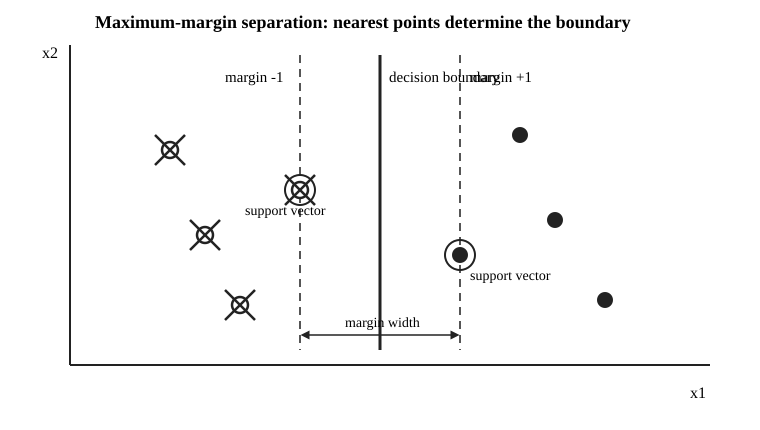

# Advanced 55 サポートベクターマシン・最大マージン・hinge損失

- 安定ID: `RIKOU-ADVANCED-55`
- 80大問 No.: 55
- 演習価値: A
- 難度: A
- 目安時間: 25〜30分
- 位置付け: 1級統計応用・共通事項に明示された分類法を、判別分析とは異なる「最大マージン」の考え方から扱う

## 問題

2次元の説明変数 $x=(x_1,x_2)^\top$ とクラスラベル $y\in\{-1,+1\}$ を考える。訓練データは

$$
\begin{array}{c|c}
y=-1&(-2,1),\ (-1,1),\ (-1,-1)\\
\hline
y=+1&(1,1),\ (1,-1),\ (2,0)
\end{array}
$$

である。次図はこの配置と、後で求める3本の境界を模式的に表したものである。図だけで解を読まず、以下では制約から導出せよ。

線形判別関数を

$$
f(x)=w^\top x+b,
\qquad
w=(w_1,w_2)^\top
$$

とし、ハードマージン・サポートベクターマシンの主問題を

$$
\min_{w,b}\frac12\|w\|^2
$$

subject to

$$
y_i(w^\top x_i+b)\ge1
\qquad(i=1,\ldots,6)
$$

とする。

1. 6観測から得られる制約をすべて書け。
2. $x_1=-1$ と $x_1=1$ 上の4観測に注目し、任意の実行可能解で

$$
w_1\ge1+|w_2|
$$

が必要であることを示せ。これを使って最適な $w,b$ を求めよ。
3. 決定境界、2本のマージン境界、マージン幅を求め、サポートベクトルを答えよ。図中の実線・破線との対応も説明せよ。
4. ソフトマージンの考え方として hinge 損失

$$
\ell_i=\max\{0,1-y_if(x_i)\}
$$

を考える。ある3観測について $y_if(x_i)$ がそれぞれ $1.5,0.4,-0.2$ であるとき、hinge損失を求め、3つの状態を解釈せよ。
5. ハードマージンからソフトマージンへ移る必要がある状況を説明せよ。また $C>0$ を用いる目的関数

$$
\frac12\|w\|^2+C\sum_i\ell_i
$$

について、$C$ が大きい場合と小さい場合の違いを説明せよ。
6. 特徴写像 $\phi(x)$ を明示的に計算せず、内積

$$
K(x,z)=\phi(x)^\top\phi(z)
$$

だけを計算して非線形な境界を扱う考え方をカーネル法と呼ぶ。なぜ双対問題が内積だけで書けるとカーネル法が可能になるのか、概念的に説明せよ。

## 詳細解答

### 1. 6本の制約

各観測について

$$
y_i(w^\top x_i+b)\ge1
$$

を代入する。

負クラスでは

$$
\begin{aligned}
(-2,1):&\quad 2w_1-w_2-b\ge1,\\
(-1,1):&\quad w_1-w_2-b\ge1,\\
(-1,-1):&\quad w_1+w_2-b\ge1.
\end{aligned}
$$

正クラスでは

$$
\begin{aligned}
(1,1):&\quad w_1+w_2+b\ge1,\\
(1,-1):&\quad w_1-w_2+b\ge1,\\
(2,0):&\quad 2w_1+b\ge1.
\end{aligned}
$$

したがって

$$
\boxed{
\begin{aligned}
2w_1-w_2-b&\ge1,\\
w_1-w_2-b&\ge1,\\
w_1+w_2-b&\ge1,\\
w_1+w_2+b&\ge1,\\
w_1-w_2+b&\ge1,\\
2w_1+b&\ge1.
\end{aligned}
}
$$

### 2. 最適な $w,b$

境界に近い $x_1=-1$ の負クラス2点から

$$
w_1-w_2-b\ge1,
\qquad
w_1+w_2-b\ge1.
$$

両方を満たすには

$$
w_1-b\ge1+|w_2|.
$$

同様に $x_1=1$ の正クラス2点から

$$
w_1+w_2+b\ge1,
\qquad
w_1-w_2+b\ge1
$$

なので

$$
w_1+b\ge1+|w_2|.
$$

2式を加えると

$$
2w_1\ge2+2|w_2|,
$$

従って

$$
\boxed{w_1\ge1+|w_2|}.
$$

目的関数は

$$
\frac12\|w\|^2
=\frac12(w_1^2+w_2^2).
$$

$w_2\ne0$ なら $w_1\ge1+|w_2|>1$ となり、$w_1^2+w_2^2$ は $w_2=0,w_1=1$ より必ず大きい。したがって最小値を与えるのは

$$
\boxed{w_2=0,\qquad w_1=1}.
$$

これを境界に近い制約へ代入すると

$$
1-b\ge1,
\qquad
1+b\ge1,
$$

すなわち

$$
b\le0,
\qquad
b\ge0.
$$

よって

$$
\boxed{b=0}.
$$

最適判別関数は

$$
\boxed{f(x)=x_1}.
$$

### 3. 決定境界・マージン・サポートベクトル

決定境界は

$$
f(x)=0
$$

だから

$$
\boxed{x_1=0}.
$$

正規化された制約ではマージン境界は

$$
f(x)=\pm1
$$

なので

$$
\boxed{x_1=-1,\qquad x_1=1}.
$$

一般に2本のマージン境界間の距離は

$$
\frac2{\|w\|}.
$$

本問では $\|w\|=1$ だから

$$
\boxed{\text{マージン幅}=2}.
$$

制約で等号

$$
y_if(x_i)=1
$$

を満たす観測がサポートベクトルである。本問では

$$
\boxed{(-1,1),\ (-1,-1),\ (1,1),\ (1,-1)}
$$

の4点が該当する。

図では中央の実線が $x_1=0$、左右の破線が $x_1=-1,1$ に対応する。クラスの遠い点 $(-2,1)$ と $(2,0)$ は制約に余裕があり、境界を少し動かす局面で最初に効く点ではない。

この例は、**全データの平均的位置ではなく、両クラスの境界に最も近い観測が最大マージン境界を決める**ことを可視化している。

### 4. hinge損失

$$
\ell_i=\max\{0,1-y_if(x_i)\}
$$

へ代入する。

$y_if(x_i)=1.5$ では

$$
\ell_i=\max(0,1-1.5)=\boxed0.
$$

正しく分類され、マージンの外側に十分離れている。

$y_if(x_i)=0.4$ では

$$
\ell_i=\max(0,1-0.4)=\boxed{0.6}.
$$

符号は正なので分類自体は正しいが、マージンの内側に入っている。

$y_if(x_i)=-0.2$ では

$$
\ell_i=\max(0,1-(-0.2))=\boxed{1.2}.
$$

符号が負なので誤分類されている。

したがって hinge 損失は

- マージン外の正分類: 0。
- マージン内の正分類: 正の罰則。
- 誤分類: さらに大きな罰則。

を1つの式で表す。

### 5. ソフトマージンと $C$

実データでは、外れ値・測定誤差・クラス重なりなどにより完全線形分離できないことがある。また無理に全点を完全分離すると、少数の特殊な観測に境界が引っ張られて汎化性能が悪化することもある。

そこで

$$
\frac12\|w\|^2+C\sum_i\ell_i
$$

のように、

- $\|w\|$ を小さくしてマージンを広くしたい。
- hinge損失を小さくして訓練誤差・マージン違反を減らしたい。

という2目的を両立させる。

$C$ が大きいと hinge 損失を強く罰するので、訓練データを正しく分類することを強く優先する。境界は外れ値にも影響されやすくなりうる。

$C$ が小さいと一部のマージン違反を許し、その代わり $\|w\|$ を小さくして広いマージンを選びやすい。

従って

$$
\boxed{
C\text{ は訓練誤差とマージン幅のトレードオフを制御する}
}.
$$

### 6. カーネル法

線形サポートベクターマシンを特徴空間で考えると、判別関数は

$$
w^\top\phi(x)+b
$$

となる。

双対問題では最適な $w$ が訓練データの特徴ベクトルの線形結合

$$
w=\sum_i\alpha_i y_i\phi(x_i)
$$

として表され、目的関数や予測式に現れる $\phi$ は

$$
\phi(x_i)^\top\phi(x_j)
$$

という内積の形だけになる。

もしこの内積を

$$
K(x_i,x_j)
$$

として元の入力 $x_i,x_j$ から直接計算できれば、高次元の $\phi(x)$ を実際に構成しなくても特徴空間での線形分類を実行できる。

元の入力空間から見ると、その特徴空間の線形境界が非線形な境界として現れる。

従ってカーネル法の本質は

$$
\boxed{
\text{特徴写像そのものではなく、特徴空間の内積だけを置き換える}
}
$$

ことにある。

## 本番答案

境界に近い4点の制約から

$$
w_1-b\ge1+|w_2|,
\qquad
w_1+b\ge1+|w_2|,
$$

ゆえに

$$
w_1\ge1+|w_2|.
$$

$\|w\|^2=w_1^2+w_2^2$ を最小にするには $w_2=0,w_1=1$、さらに両側の制約から $b=0$。従って

$$
f(x)=x_1.
$$

決定境界は $x_1=0$、マージン境界は $x_1=\pm1$、幅は2。サポートベクトルは $x_1=\pm1$ 上の4点。

hinge損失は $y_if_i=1.5,0.4,-0.2$ に対して

$$
0,\ 0.6,\ 1.2.
$$

ソフトマージンでは

$$
\frac12\|w\|^2+C\sum_i\ell_i
$$

を最小化し、$C$ が大きいほどマージン違反を強く罰する。双対問題が特徴ベクトルの内積だけで書ければ、その内積をカーネル $K(x,z)$ で置き換えて非線形境界を扱える。

## 採点基準

- 6本の制約の立式: 3点
- $w_1\ge1+|w_2|$ の導出と $w,b$ の最適化: 5点
- 決定境界・マージン・サポートベクトルと図の対応: 4点
- hinge損失の計算・解釈: 3点
- ソフトマージンと $C$ の解釈: 3点
- カーネル法の内積置換の説明: 2点

25分経過時は、境界に近い4点の制約から $w=(1,0)^\top,b=0$ を出すこと、マージン幅2、hinge損失、$C$ の意味を優先する。
