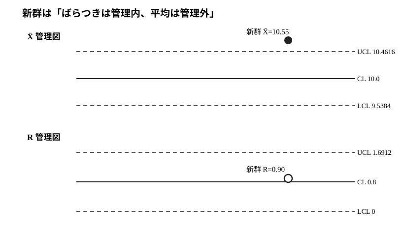

# Core 21 $\bar X-R$管理図・3シグマ管理限界

- 安定ID: `RIKOU-CORE-21`
- 80大問 No.: 56
- 演習価値: S
- 難度: B
- 目安時間: 20〜25分
- 電卓: 四則演算・平方根までで完結

## 問題

群サイズ $n=5$ の工程データから

$$
\bar{\bar X}=10.0,\qquad \bar R=0.8
$$

を得た。$n=5$ に対する管理図定数を

$$
A_2=0.577,\qquad D_3=0,\qquad D_4=2.114
$$

とする。

1. $\bar X$ 管理図の中心線、上方管理限界、下方管理限界を求めよ。
2. $R$ 管理図の3本の線を求めよ。
3. 新しい群で $\bar X=10.55$, $R=0.90$ を得た。工程状態を判定せよ。
4. $n=5$ に対して $d_2=2.326$ とする。$E[R]\approx d_2\sigma$ を使い、$A_2$ が

$$
A_2=\frac{3}{d_2\sqrt n}
$$

と表される理由を導け。与えられた $A_2=0.577$ と整合することも一般電卓で確認せよ。
5. なぜ平均管理図だけでなく $R$ 管理図も同時に確認する必要があるか。

## 詳細解答

### 0. 管理限界は「規格限界」とは違う

管理図の管理限界は製品規格から決める線ではない。工程が安定しており、平均・分散が一定だとしたときの**工程自身の通常変動**から作る警報線である。

群平均について、母平均を $\mu$、母標準偏差を $\sigma$ とすると

$$
E[\bar X]=\mu,
\qquad
\operatorname{SD}(\bar X)=\frac{\sigma}{\sqrt n}.
$$

したがって $\sigma$ が既知なら3シグマ管理限界は

$$
\mu\pm3\frac{\sigma}{\sqrt n}.
$$

実際には $\mu,\sigma$ は未知なので、複数の予備群から

$$
\mu\approx\bar{\bar X}
$$

とし、$\sigma$ は群範囲 $R$ から推定する。この置き換えを定数表にまとめたものが $A_2,D_3,D_4$ である。

本問では $A_2,D_3,D_4$ は問題文で与えられているので、**$D_3,D_4$ の数値を暗記する必要はない**。第4問で $A_2$ の由来だけを導く。

---

### 1. $\bar X$ 管理図

$\bar X-R$ 管理図では

$$
CL_{\bar X}=\bar{\bar X},
$$

$$
UCL_{\bar X}=\bar{\bar X}+A_2\bar R,
$$

$$
LCL_{\bar X}=\bar{\bar X}-A_2\bar R.
$$

数値を代入すると

$$
A_2\bar R=0.577\cdot0.8=0.4616.
$$

したがって

$$
\boxed{UCL_{\bar X}=10.4616},
$$

$$
\boxed{CL_{\bar X}=10.0},
$$

$$
\boxed{LCL_{\bar X}=9.5384}.
$$

---

### 2. $R$ 管理図

群範囲

$$
R=\max(X_1,\ldots,X_n)-\min(X_1,\ldots,X_n)
$$

は群内ばらつきの大きさを表す。

$R$ の分布は正規分布そのものではなく、群サイズ $n$ に依存する。その平均と標準偏差を標準化してあらかじめ表にした結果が管理図定数 $D_3,D_4$ である。

したがって

$$
CL_R=\bar R,
$$

$$
UCL_R=D_4\bar R,
\qquad
LCL_R=D_3\bar R.
$$

本問では

$$
UCL_R=2.114\cdot0.8=\boxed{1.6912},
$$

$$
CL_R=\boxed{0.8},
$$

$$
LCL_R=0\cdot0.8=\boxed{0}.
$$

$D_3=0$ なのは、範囲が負にならず、小群サイズでは理論上の下側3シグマ線が0未満になるため0へ切り上げられるからである。

---

### 3. 新しい群の判定

まず散布を確認する。

$$
0\le0.90\le1.6912
$$

なので $R$ は管理限界内である。

次に平均を確認すると

$$
10.55>10.4616.
$$

したがって

$$
\boxed{\bar X\text{ は上方管理限界を超えている}}.
$$

群内ばらつきは通常範囲内だが、工程平均に特殊原因による上方変化が疑われる。

図にすると、$R$ の点は管理限界内にある一方、$\bar X$ の点だけがUCLを越えていることが確認できる。これは「製品規格外」という意味ではなく、工程平均の変化を疑う管理図上の信号である。

---

### 4. $A_2$ の由来

母標準偏差 $\sigma$ が既知なら、群平均の標準偏差は

$$
\frac{\sigma}{\sqrt n}
$$

だから3シグマ限界は

$$
\mu\pm\frac{3\sigma}{\sqrt n}.
$$

しかし $\sigma$ は未知である。

群サイズ $n$ が固定された正規標本の範囲 $R$ について

$$
E[R]=d_2\sigma
$$

という関係があり、複数群の平均範囲 $\bar R$ を使って

$$
\sigma\approx\frac{\bar R}{d_2}
$$

と推定する。

また $\mu$ を

$$
\bar{\bar X}
$$

で推定する。これらを3シグマ限界へ代入すると

$$
\begin{aligned}
\bar{\bar X}\pm\frac{3}{\sqrt n}\frac{\bar R}{d_2}
&=\bar{\bar X}
\pm\frac{3}{d_2\sqrt n}\bar R.
\end{aligned}
$$

一方、管理図の表記は

$$
\bar{\bar X}\pm A_2\bar R
$$

なので係数を比較して

$$
\boxed{A_2=\frac3{d_2\sqrt n}}.
$$

$n=5,d_2=2.326$ なら

$$
A_2
=\frac{3}{2.326\sqrt5}
\approx0.577,
$$

与えられた定数と整合する。

---

### 5. なぜ $R$ 管理図も必要か

$\bar X$ 管理図の幅は

$$
3\frac{\sigma}{\sqrt n}
$$

を基礎としている。つまり工程内標準偏差 $\sigma$ が安定していることを前提としている。

もし分散が増加したのに古い $\bar R$ を使い続ければ、実際の群平均の標準誤差は大きくなっているのに管理限界は狭いままになり、想定した警報確率ではなくなる。

逆に分散が小さくなれば管理限界は相対的に広すぎる。

したがって

$$
\boxed{
\text{まず散布の安定性を確認し、その上で平均の管理状態を解釈する}
}
$$

のが基本である。

## 本番答案

$$
UCL_{\bar X}=10+0.577\cdot0.8=10.4616,
$$

$$
CL_{\bar X}=10,
\qquad
LCL_{\bar X}=9.5384.
$$

$$
UCL_R=2.114\cdot0.8=1.6912,
\quad
CL_R=0.8,
\quad
LCL_R=0.
$$

新群は $R=0.90$ で散布は管理内だが

$$
10.55>10.4616
$$

なので平均は管理外。

また

$$
E[R]=d_2\sigma
$$

から

$$
\sigma\approx\bar R/d_2
$$

とし、既知 $\sigma$ の3シグマ限界

$$
\mu\pm3\sigma/\sqrt n
$$

へ代入すれば

$$
A_2=3/(d_2\sqrt n)
$$

を得る。$D_3,D_4$ は範囲分布から作られた群サイズ依存定数で、本問では与えられた値を使う。

## 採点基準

- 管理限界と規格限界の違い: 2点
- (1) $\bar X$ 限界: 4点
- (2) $R$ 限界と定数の意味: 3点
- (3) 散布→平均の順で判定: 3点
- (4) 3シグマ限界と $E[R]=d_2\sigma$ から $A_2$ を導出: 5点
- (5) 併用理由: 3点

20分経過時は、管理図定数を暗記値として扱わず「$A_2$ は $\sigma\approx\bar R/d_2$ を3シグマ限界へ代入した係数」と書ければよい。