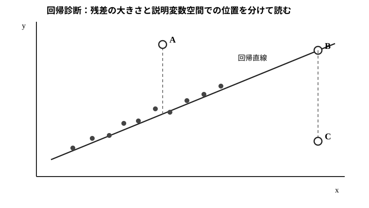

# Standard 38 多重共線性・回帰診断・$L_1$正則化

- 安定ID: `RIKOU-STANDARD-38`
- 80大問 No.: 38
- 演習価値: A
- 難度: A
- 目安時間: 25〜30分

## 問題

説明変数 $X_j$ を他の説明変数で回帰した決定係数を $R_j^2$ とする。

1. 分散拡大係数を定義し、$R_j^2=0.9$ のときの値を求めよ。
2. 共線性が通常最小二乗推定量の不偏性を壊さず、分散を増やす理由を説明せよ。
3. 次図は単回帰の概念図であり、灰色点が通常の観測、A・B・Cが診断対象の観測を表す。A・B・Cについて、**大残差点・高レバレッジ点・強い影響点になりやすい点**を区別せよ。また、高レバレッジと大残差が別概念である理由を説明せよ。

4. $L_1$ 正則化による回帰を

$$
\widehat\beta
=\arg\min_\beta
\left\{
\frac12\|y-X\beta\|^2
+\lambda\sum_{j=1}^p|\beta_j|
\right\},
\qquad \lambda>0
$$

で定義する。$X^\top X=I_p$ とし、$z_j=x_j^\top y$ と置く。第 $j$ 成分の最小化問題を1変数の問題へ落とし、

$$
\widehat\beta_j
=\operatorname{sign}(z_j)(|z_j|-\lambda)_+
$$

を導け。ただし $(a)_+=\max(a,0)$ とする。
5. $L_1$ 正則化が多重共線性のある回帰でどのように役立つか、通常最小二乗法との違いと、$\lambda$ の選択に交差検証などが必要な理由を説明せよ。

## 詳細解答

### 1. 分散拡大係数

説明変数 $X_j$ を他の説明変数で回帰したとき、$X_j$ のうち他変数では説明できない残差部分の平方和は

$$
(1-R_j^2)S_{jj},
\qquad
S_{jj}=\sum_i(x_{ij}-\bar x_j)^2
$$

に比例する。

等分散の線形回帰では

$$
\operatorname{Var}(\widehat\beta_j)
=\frac{\sigma^2}{(1-R_j^2)S_{jj}}.
$$

$R_j^2=0$ の基準分散 $\sigma^2/S_{jj}$ と比べると、分散の倍率は

$$
\boxed{
\frac1{1-R_j^2}
}.
$$

これを分散拡大係数という。

$R_j^2=0.9$ なら

$$
\boxed{
\frac1{1-0.9}=10
}.
$$

したがって分散は基準の10倍、標準誤差は $\sqrt{10}$ 倍である。

### 2. 不偏性と分散を分けて考える

線形回帰モデル

$$
y=X\beta+\varepsilon,
\qquad
E[\varepsilon\mid X]=0
$$

で $X$ が列フルランクなら

$$
\widehat\beta=(X^\top X)^{-1}X^\top y.
$$

条件付き期待値は

$$
\begin{aligned}
E[\widehat\beta\mid X]
&=(X^\top X)^{-1}X^\top E[y\mid X]\\
&=(X^\top X)^{-1}X^\top X\beta\\
&=\beta.
\end{aligned}
$$

したがって、完全共線性でランクが落ちない限り、強い共線性があっても不偏性そのものは保たれる。

一方

$$
\operatorname{Var}(\varepsilon\mid X)=\sigma^2I
$$

なら

$$
\operatorname{Var}(\widehat\beta\mid X)
=\sigma^2(X^\top X)^{-1}.
$$

説明変数が強く共線的だと $X^\top X$ に小さい固有値が生じ、逆行列ではその方向が大きく増幅される。その結果、係数推定の分散が大きくなる。

従って要点は

$$
\boxed{
\text{共線性は、完全共線でない限り不偏性ではなく推定精度を悪化させる}
}.
$$

### 3. 図から読む大残差・レバレッジ・影響

**残差**は応答方向のずれであり、図では観測点から回帰直線までの鉛直距離として読める。一方、**レバレッジ**は説明変数空間での位置の特殊さであり、単回帰の概念図では横方向に他の観測群から離れているかを見る。

- **A**: 説明変数 $x$ は観測群の中央付近だが、回帰直線から大きく離れている。したがって **大残差点**であるが、レバレッジは特に大きくない。
- **B**: $x$ が観測群から大きく離れているので **高レバレッジ点**である。一方、回帰直線の近くにあるため残差は小さい。高レバレッジだからといって必ず大残差とは限らない。
- **C**: Bと同様に説明変数空間で離れており、さらに回帰直線からも大きく離れている。したがって **高レバレッジかつ大残差**で、回帰係数や予測値を大きく動かす **強い影響点になりやすい**。

線形回帰ではハット行列

$$
H=X(X^\top X)^{-1}X^\top
$$

の対角要素 $h_{ii}$ がレバレッジを測る。残差は

$$
e_i=y_i-\widehat y_i
$$

で測る。両者はそれぞれ説明変数側と応答側の異常性を見ているため、別々に診断する必要がある。

なお、多変量回帰では「横軸から離れている」という1枚の散布図だけでレバレッジを完全には判断できない。図は単回帰で概念を可視化したものである。

### 4. $L_1$ 正則化とソフトしきい値

$X^\top X=I_p$ とする。目的関数の二乗誤差部分を展開すると

$$
\begin{aligned}
\frac12\|y-X\beta\|^2
&=\frac12(y-X\beta)^\top(y-X\beta)\\
&=\frac12y^\top y-\beta^\top X^\top y
+\frac12\beta^\top X^\top X\beta\\
&=\frac12y^\top y-\sum_{j=1}^p z_j\beta_j
+\frac12\sum_{j=1}^p\beta_j^2.
\end{aligned}
$$

ここで $z_j=x_j^\top y$ とした。$y^\top y/2$ は $\beta$ に依存しないため、最小化は各 $j$ について独立に

$$
q_j(b)
=\frac12b^2-z_jb+\lambda|b|
$$

を最小化する問題になる。

#### $b>0$ の場合

$|b|=b$ なので

$$
q_j'(b)=b-z_j+\lambda.
$$

停留点は

$$
b=z_j-\lambda.
$$

これが正になるのは $z_j>\lambda$ のときである。

#### $b<0$ の場合

$|b|=-b$ なので

$$
q_j'(b)=b-z_j-\lambda.
$$

停留点は

$$
b=z_j+\lambda.
$$

これが負になるのは $z_j<-\lambda$ のときである。

#### $b=0$ の場合

$|z_j|\le\lambda$ なら、0の右側では傾きが

$$
-z_j+\lambda\ge0,
$$

左側では

$$
-z_j-\lambda\le0
$$

となるため、0が最小点である。

以上より

$$
\widehat\beta_j
=\begin{cases}
z_j-\lambda,&z_j>\lambda,\\
0,&|z_j|\le\lambda,\\
z_j+\lambda,&z_j<-\lambda.
\end{cases}
$$

したがって

$$
\boxed{
\widehat\beta_j
=\operatorname{sign}(z_j)(|z_j|-\lambda)_+
}.
$$

これは**ソフトしきい値**であり、小さい係数候補をちょうど0へ落とすことが $L_1$ 正則化の重要な特徴である。

### 5. 共線性・変数選択と $\lambda$

通常最小二乗法は残差平方和だけを最小化するため、強く相関した説明変数があると係数が不安定になりやすい。

$L_1$ 正則化では

$$
\lambda\sum_j|\beta_j|
$$

という罰則を加えるため、大きな係数を抑え、小さい係数を0へ落とせる。その結果、

- 分散を下げて予測を安定化する、
- 変数選択を同時に行う、

という利点がある。

ただし罰則を入れるため、推定量には一般にバイアスが入る。$\lambda$ が小さすぎれば通常最小二乗法に近くなり、共線性への安定化が弱い。大きすぎれば重要な係数まで0へ縮め、過少適合になる。

従って $\lambda$ はデータから選ぶ必要があり、代表的には交差検証で予測誤差を比較して決める。

## 本番答案

分散拡大係数は

$$
\frac1{1-R_j^2},
$$

$R_j^2=0.9$ なら10。共線性があっても

$$
E[\widehat\beta\mid X]=\beta
$$

だが

$$
\operatorname{Var}(\widehat\beta\mid X)
=\sigma^2(X^\top X)^{-1}
$$

なので、小固有値によって分散が増える。

図ではAは中央付近の大残差、Bは高レバレッジだが小残差、Cは高レバレッジかつ大残差で強い影響点候補である。レバレッジは説明変数空間、残差は応答方向を測る。

$X^\top X=I$ の $L_1$ 正則化では各成分について

$$
\frac12b^2-z_jb+\lambda|b|
$$

を最小化し、場合分けから

$$
\widehat\beta_j
=\operatorname{sign}(z_j)(|z_j|-\lambda)_+.
$$

小さい係数を0へ落とせるため変数選択・安定化に使えるが、バイアスが入り、$\lambda$ は交差検証などで選ぶ。

## 採点基準

- 分散拡大係数の導出・数値: 4点
- 不偏性と分散を分けた説明: 4点
- 図から大残差・高レバレッジ・影響候補を区別: 3点
- $L_1$ 正則化の1変数化とソフトしきい値の導出: 6点
- 共線性・変数選択・交差検証の解釈: 3点

25分経過時は、図のA/B/Cについて「残差」と「レバレッジ」を混同しないこと、通常最小二乗法の「不偏だが不安定」と $L_1$ 正則化の「バイアスを許して分散を抑え、係数を0にもできる」という対比を残す。
