# DREAM THEATER 標準数学コア・カリキュラム

> **統計のために必要なところだけを掘る**構成から、**数学科の標準教科書を一周したときに「そこを抜くのは不自然」となる中核事項を原則回収する**構成へ拡張するための設計台帳です。

既存章はできるだけ正本として再利用し、新章は不足分だけを追加します。追加章は原則として **定義 → 代表定理 → 証明 → 典型例・反例 → 後続章への接続** まで閉じます。

章IDは実装時の衝突を避けるため、予定名前空間を `RA`（real analysis）、`LA`（linear algebra）、`TOP`（topology）、`MT`（measure theory）、`CA`（complex analysis）、`FA`（functional analysis）とします。公開済みの旧章URLは、分割時も互換ハブを残して読者リンクを切らないようにします。

## 0. 採用方針

標準コアへ入れる基準は次です。

1. 数学科の学部標準教科書で章・節として反復して現れる。
2. 後続の解析・確率・統計・最適化で暗黙の前提になりやすい。
3. 有限次元と無限次元、距離空間と一般位相など「どこから壊れるか」を理解するために重要である。
4. DREAM THEATER の主要定理の証明依存として現れる。

各章は `core` / `bridge` / `advanced-standard` を区別し、標準コアに含めることと統計検定1級の通常教材の必修前提にすることは分けます。

**Jordan標準形は LA4 の構造論の到達点として標準コアに含めます。** ただし、統計検定1級の通常教材の必修前提にはせず、最小多項式・Cayley–Hamilton・一般化固有空間から「対角化不能な作用素がどう壊れるか」を閉じるための数学科標準事項として扱います。

---

# 1. 全体の読む順 DAG

```mermaid
flowchart TD
  A["集合・写像・実数の完備性<br/>既存 A/A1/A1B"]

  A --> RA1["実解析 I<br/>数列・級数・limsup/liminf<br/>RA1"]
  A --> LA1["線形代数 I<br/>R/C・線形空間<br/>既存 E/F + LA1"]
  A --> TOP0["位相 I<br/>距離・位相・Hausdorff<br/>既存 B/B1"]

  RA1 --> RA1A["実解析 I-A<br/>数値級数の収束論<br/>RA1A"]
  RA1 --> RA2["実解析 II<br/>極限・連続・一様連続<br/>RA2"]
  RA1A --> RA4A
  RA1A --> RA5
  RA2 --> RA3["実解析 III<br/>微分・平均値定理・Taylor<br/>RA3"]
  RA2 --> RA4["実解析 IV<br/>Riemann/Darboux積分・FTC<br/>RA4"]
  RA4 --> RA4A["実解析 IV-A<br/>広義積分・収束判定<br/>RA4A"]
  RA2 --> RA5["実解析 V<br/>関数列・級数・一様収束<br/>RA5"]
  RA3 --> RA6["実解析 VI<br/>多変数微分・Fréchet微分<br/>既存 F0-02C3"]
  RA4 --> RA6A["実解析 VI-A<br/>逆関数定理・陰関数定理<br/>RA6A"]
  RA6 --> RA6A
  LA3C --> RA6A
  RA4 --> RA7["実解析 VII<br/>重積分・変数変換<br/>RA7"]
  RA6A --> RA7
  LA3C --> RA7
  RA5 --> RA8["Arzela-Ascoli・Stone-Weierstrass<br/>RA8"]
  TOP5 --> RA8

  RA6A --> VC1["ベクトル解析 I<br/>grad・div・curl・Laplacian<br/>VC1"]
  VC1 --> VC2["ベクトル解析 II<br/>曲線・線積分・保存場<br/>VC2"]
  TOP3 --> VC2
  VC1 --> VC3["ベクトル解析 III<br/>曲面・向き・flux<br/>VC3"]
  RA7 --> VC3
  LA3C --> VC3
  VC2 --> VC4["ベクトル解析 IV<br/>Green・Gauss・保存則<br/>VC4"]
  VC3 --> VC4
  VC4 --> VC5["ベクトル解析 V<br/>Stokes・curl・topology<br/>VC5"]
  VC5 --> VC6["ベクトル解析 VI<br/>直交曲線座標<br/>VC6"]

  TOP0 --> TOP1["位相の生成・initial/final<br/>積・商 TOP1"]
  TOP1 --> TOP2["同値関係による商・貼り合わせ<br/>TOP2"]
  TOP2 --> TOP3["連結性<br/>TOP3"]
  TOP3 --> TOP4["可算性・分離公理<br/>TOP4"]
  TOP4 --> TOP5["コンパクト性の一般論<br/>TOP5"]
  TOP4 --> GEO1["滑らかな多様体・滑らかな写像<br/>GEO1"]
  RA6A --> GEO1
  GEO1 --> GEO2["接空間・余接空間・微分・接束<br/>GEO2"]
  LA3A --> GEO2
  GEO2 --> GEO3["階数定理・はめ込み・沈め込み・部分多様体<br/>GEO3"]
  RA6A --> GEO3
  GEO3 --> GEO4["1 の分割・局所化・埋め込み<br/>GEO4"]
  TOP5A --> GEO4
  GEO2 --> GEO5["ベクトル場・積分曲線・局所流・Lie 括弧<br/>GEO5"]
  ODE1 -. "reuse" .-> GEO5
  ODE4 -. "reuse" .-> GEO5
  GEO3 --> GEO6["線形分布・積分多様体・Frobenius の定理<br/>GEO6"]
  GEO5 --> GEO6
  GEO2 --> GEO7["テンソル場・微分形式・外微分<br/>GEO7"]
  GEO5 --> GEO7
  LA3E --> GEO7
  GEO4 --> GEO8["向き・多様体上の積分・一般 Stokes<br/>GEO8"]
  GEO7 --> GEO8
  RA7 --> GEO8
  VC5 --> GEO8
  GEO7 --> GEO9["Poincaré の補題・de Rham コホモロジー<br/>GEO9"]
  GEO8 --> GEO9
  TOP3 --> GEO9
  GEO3 --> GEO10["Euclid 空間の曲線・超曲面 I<br/>基本形式と形作用素<br/>GEO10"]
  VC2 --> GEO10
  VC3 --> GEO10
  LA5 --> GEO10
  GEO10 --> GEO11["Euclid 空間の超曲面 II<br/>Gauss--Codazzi・基本定理<br/>GEO11"]
  GEO6 --> GEO11
  GEO9 --> GEO11
  GEO4 --> GEO12["Riemann 計量・長さ・距離・体積<br/>GEO12"]
  GEO7 --> GEO12
  GEO8 --> GEO12
  LA5 --> GEO12
  VC1 --> GEO12
  GEO5 --> GEO13["アフィン接続・Levi-Civita 接続・平行移動<br/>GEO13"]
  GEO12 --> GEO13
  GEO13 --> GEO14["測地線・指数写像・正規座標<br/>GEO14"]
  ODE4 -. "reuse" .-> GEO14
  TOP5 --> TOP5A["Urysohn・局所コンパクト性・cutoff<br/>TOP5A"]
  TOP5 --> BAIRE["全有界性・Baire・net/filter<br/>TOP6"]
  BAIRE --> UNIFORM["一様構造・一様連続・Cauchy構造<br/>TOP7"]
  RA5 --> UNIFORM

  LA1 --> LA2["直和・補空間・商空間<br/>LA2"]
  LA2 --> LA3A["代数的双対・双対基底<br/>LA3A"]
  LA3A --> LA3B["行列式の構成<br/>LA3B"]
  LA3B --> LA3C["行列式の計算・可逆性<br/>LA3C"]
  LA3C --> LA4["最小多項式・Cayley-Hamilton・Jordan構造<br/>LA4"]
  LA3C --> LA3D["交代多重線形形式・抽象行列式<br/>LA3D（発展分岐）"]
  LA3A --> LA3E["テンソル積・外積代数<br/>LA3E"]
  LA3D --> LA3E
  LA4 --> LA5["複素内積・有限次元随伴・normal<br/>LA5"]
  LA5 --> LA6["二次形式・polar decomposition・複素SVD<br/>既存 F1/F2 + LA6"]

  TOP5 --> MT0["測度 I<br/>Borel・測度・Caratheodory・Lebesgue正則性<br/>既存 D2/D3/D4 + MT0"]
  MT0 --> MTI["測度 II<br/>Lebesgue積分・MCT/Fatou/DCT<br/>既存 D2A/D2B"]
  MTI --> MTP["測度 III<br/>積測度・Fubini・Lp<br/>既存 D2C/D2D/D2E"]
  MTI --> MT1["収束様式・Egorov・Lusin<br/>MT1"]
  RA5 --> MT1
  MTI --> MT2["符号付き測度・RN・Lebesgue分解<br/>MT2/MT3"]

  RA4 --> RLB["Riemann ↔ Lebesgue<br/>一致定理・Lebesgue判定<br/>MT-RL"]
  MTI --> RLB

  MT2 --> MT4["Lebesgue微分定理・絶対連続・Lebesgue版FTC<br/>MT4"]
  TOP5A --> MT5["Radon測度・Riesz-Markov<br/>MT5"]
  MT2 --> MT5

  RA3 --> CA1["複素解析 I<br/>複素微分・Cauchy-Riemann<br/>CA1"]
  RA5 --> CA1
  LA1 --> CA1
  CA1 --> CA2["複素線積分・Cauchy-Goursat<br/>CA2"]
  RA4 --> CA2
  TOP3 --> CA2
  CA2 --> CA3["Cauchy積分公式・Liouville<br/>CA3"]
  CA3 --> CA4["Laurent・留数<br/>CA4"]
  CA4 --> CA5["偏角原理・Rouche・解析接続<br/>CA5"]
  CA5 --> CA6["Möbius・調和関数・Poisson核<br/>CA6"]
  CA6 --> CA7["正則関数列・正規族・Riemann写像<br/>CA7"]
  TOP5 --> CA7
  CA7 --> CA8["Riemann面・被覆・多価関数<br/>CA8"]
  TOP1 --> CA8
  TOP2 --> CA8
  TOP4 --> CA8
  TOP5 --> CA8
  CA8 --> CA9["楕円関数・Weierstrass wp<br/>CA9"]
  CA7 --> CA10["無限積・Weierstrass因数分解<br/>Mittag--Leffler CA10"]
  CA4 --> CA10
  CA10 --> CA11["Gamma関数・反射公式・Stirling<br/>CA11"]
  CA11 --> CA12["Riemann ζ・theta変換・関数等式<br/>CA12"]

  MTP --> FA0["関数解析 I<br/>Banach/Hilbert・有界作用素<br/>既存 D1/C1/C3"]
  LA6 --> FA0
  FA0 --> HB["Hahn-Banach・双対<br/>既存 C2/C6"]
  BAIRE --> FA2["一様有界性・開写像・閉グラフ<br/>FA1/FA2"]
  FA0 --> FA2
  HB --> FA4["weak/weak*・Banach-Alaoglu・反射性<br/>FA3/FA4"]
  TOP5 --> FA4
  FA0 --> FA5["spectrum・resolvent<br/>FA5"]
  FA2 --> FA5
  LA6 --> FA5
  CA3 --> FA5
  FA5 --> FA6["compact operator<br/>FA6"]
  FA6 --> FA7["compact self-adjoint spectral theorem<br/>Fredholm alternative<br/>FA7"]
  MT5 --> MT6["C0版Riesz-Markov・有限符号付きRadon測度<br/>MT6"]
  MT0 --> MT8["Hausdorff測度・Hausdorff次元<br/>MT8"]
  MT6 --> HB
```



最短の大動脈は次です。

```text
実数の完備性 → 実解析 → Riemann積分 ┐
                                      ├→ Riemann/Lebesgue接続
位相 → Borel集合 → 測度 → Lebesgue積分 ┘

線形代数 → 内積・スペクトル → Banach/Hilbert → 関数解析
一般位相 → コンパクト性・Baire ─────────────────────┘
測度論 → Lp ────────────────────────────────────────┘
```

---

# 2. 実解析：理論的微積分を一通り

現行 F0-00 は計算技法としての微積分を担っています。RA系列では **なぜ微積分の定理が成り立つか** を扱い、Riemann積分を本体に置きます。

## RA1 数列・級数 `core`

- 数列、部分列、Cauchy列、単調収束、Bolzano–Weierstrass
- `limsup` / `liminf`
- 級数を部分和列として定義し、Cauchy判定と絶対収束の基礎を構成
- 絶対収束級数の再配列不変性、Cauchy積
- 冪級数、収束半径

既存 A1/A1B/B0/D は正本として再利用します。数値級数の詳細な収束判定は RA1A に分離します。

## RA1A 数値級数の収束論 `core`

- 一般項が0へ行く必要条件、非負項級数の部分和有界性判定
- 比較判定・極限比較判定・比判定・根判定と境界値1の反例
- Cauchy凝縮判定、$p$ 級数、対数補正級数
- Leibnizの交代級数判定と剰余評価
- Abelの部分和変換、Dirichlet判定、Abel判定
- 条件収束とRiemann再配列定理（有限値版）

判定法名を列挙するだけでなく、Cauchy条件・単調収束・部分和変換へ還元して核心論証を本文内で閉じます。

## RA2 極限・連続・一様連続 `core`

- 関数極限の ε–δ 定義、片側極限、無限遠
- 連続性、中間値定理、最大最小値定理
- 一様連続、Heine–Cantor、Lipschitz
- 単調関数の不連続点

## RA3 微分法の理論 `core`

- 導関数、Fermat、Rolle、平均値定理、Cauchy平均値定理
- 単調性・凸性への応用
- L'Hopital
- Taylor定理と剰余項
- 逆関数の微分

## RA4 Riemann/Darboux積分・FTC `core`

- 分割・細分、上和・下和、上積分・下積分
- Darboux可積分性
- tagged partition と Riemann和
- Riemann積分とDarboux積分の同値
- Riemann可積分性のCauchy型判定
- 連続関数・単調関数の可積分性
- 可積分関数の和・積・絶対値、区間加法性・順序性
- 微積分学の基本定理 I / II
- 置換積分・部分積分の厳密な定理
- 本章は有限閉区間上の通常のRiemann積分で閉じ、広義積分の収束論は RA4A へ分離

## RA4A 広義積分・収束判定 `core`

- 無限区間・端点特異点・内部特異点を有限区間Riemann積分の片側極限として定義
- 複数の不良端点は各片側を独立に判定し、Cauchy主値による相殺と区別
- Cauchy判定、非負関数の有界性判定、比較判定・極限比較判定
- 無限遠・0近傍の $p$ 積分と $1/[x(\log x)^q]$ 型の対数補正
- 絶対収束・条件収束と「絶対収束なら収束」
- 級数と広義積分の積分判定
- Dirichlet判定・Abel判定と $\sin x/x$ 型の振動積分
- Cauchy主値が通常の広義積分とは別の極限操作であることを反例で確認

## RA5 関数列・関数級数・一様収束 `core`

- 各点収束と一様収束、一様Cauchy条件
- 一様極限と連続性
- 積分と極限の交換
- 微分と極限の交換条件
- Weierstrass M-test
- 冪級数の項別微分・項別積分
- 各点収束だけでは何が壊れるかの標準反例

## RA6 多変数微分 `core`

- Fréchet微分を一つの線形一次近似として定義し、一意性と微分可能性からの連続性を証明
- 偏微分・方向微分・全微分・Jacobianの関係
- 全偏微分の存在だけでは微分可能とは限らない反例と、破綻する残差比
- 連続な偏微分からFréchet微分可能性を導く座標増分・一変数平均値定理による証明
- Fréchet連鎖律を二つの剰余項の合成から証明
- 高階微分・Hessian・二階の多変数Taylor展開

既存 [F0-02C3](volumes/00_foundations/F0_02C3_Frechet微分_線形作用素_随伴/index.md) を標準コア正本として再利用し、Section 1〜10でRA6の有限次元部分を閉じます。後半はBanach/Hilbert空間への発展として関数解析系列へ接続します。

## RA6A 逆関数定理・陰関数定理 `core`

- 線分上の微分の積分表示と、恒等写像からのずれを使う定量評価
- 有限次元の閉球上で収縮写像補題を証明し、外部の不動点定理をブラックボックス化しない
- 逆関数定理を正規化 → 収縮写像 → 局所全単射 → 逆写像の微分可能性・$C^1$ 性まで証明
- 陰関数定理を $G(x,y)=(x,F(x,y))$ に対する逆関数定理から導き、$D\varphi=-(D_yF)^{-1}D_xF$ を証明
- 正則レベル集合の局所グラフ表示と接空間 $\ker DF$、Lagrange未定乗数法までを系として接続
- 「Jacobianが全点で正則でも大域単射とは限らない」「微分が非可逆でも写像自体は可逆な場合がある」という境界を反例で確認

[RA6A 本文](volumes/00_foundations/RA6A/index.md) は RA6 と RA7 の間に置き、局所可逆性を変数変換・制約付き最適化・推定方程式の感度解析へ接続します。

## RA7 多重Riemann積分・変数変換 `core`

- 長方形上のRiemann積分、Jordan可測集合
- 重積分、Riemann版Fubini
- 変数変換定理、Jacobianの絶対値
- 極座標・球座標の厳密化

## RA8 関数族のコンパクト性・近似 `advanced-standard`

- Arzela–Ascoli
- Weierstrass近似定理
- Stone–Weierstrass
- `C(K)` の一様ノルムへの接続

---

# 3. Riemann積分とLebesgue積分の橋

## MT-RL Riemann ↔ Lebesgue `core / bridge`

必ず独立した橋を置きます。

1. `[a,b]` 上でRiemann可積分な関数はLebesgue可測かつLebesgue可積分。
2. そのとき Riemann積分値とLebesgue積分値は一致。
3. **LebesgueのRiemann可積分判定**：有界関数がRiemann可積分であることと、不連続点集合がLebesgue測度0であることは同値。
4. Dirichlet関数・Thomae関数で境界を確認。
5. 広義Riemann積分とLebesgue `L1` 可積分性は同じではない。`sin x/x` などで条件収束と絶対可積分性を区別。

これで

```text
計算微積分 → 理論的Riemann積分 → 測度論的Lebesgue積分
```

が一本につながります。

---

# 4. 線形代数：数学科標準コア

現行 E/F/E1/E2/F1/F2 を基底・線形写像・実内積・実対称スペクトル定理・実SVDの正本として再利用し、LA系列では複素数体、商空間、代数的双対、一般作用素の構造、複素内積を補います。

## LA1 実・複素線形空間 `core`

- 体の最低限定義
- `R` / `C` 上のベクトル空間、複素共役
- 実行列の複素固有値、complexification の考え方

## LA2 直和・補空間・商空間 `core`

- 部分空間の和、内部/外部直和、補空間
- 商空間 `V/W`、商写像
- 次元公式、線形写像の第一同型定理

## LA3A 代数的双対・双対基底 `core`

- 「ベクトルを測る線形な測定器」という具体像から線形形式と代数的双対へ入る
- 双対基底、annihilator、商空間の双対、dual map
- 自然写像 `V -> V**` と有限次元
- 関数解析で使う「連続線形汎関数全体としての双対」とは概念名を分離する

## LA3B 行列式の構成 `core`

- 面積・体積倍率に欲しい性質を先に確認する
- 置換・転倒数・符号から Leibniz 公式を構成する
- 交代多重線形性、転置不変性、特徴付けによる一意性を証明する

## LA3C 行列式の計算・可逆性 `core`

- 基本変形、三角行列、Laplace 展開、余因子行列
- 行列式の乗法性と可逆性判定
- 相似不変性まで閉じ、LA4 の特性多項式へ直接接続する

## LA3D 交代多重線形形式・抽象行列式 `core / enrichment`

- 最高次交代形式の1次元性
- 線形自己写像が体積形式へ与える倍率としての抽象行列式
- 表現行列の行列式との一致
- 標準コアには含めるが、LA4へ進むための必須関門にはしない

## LA3E テンソル積・外積代数 `core-advanced-standard`

- テンソル積を二重線形写像の普遍性として構成
- テンソル積の基底・次元、共変・反変テンソル、縮約
- 交代化と外冪、外積の結合性・次数付き交換則
- 外冪の基底と `dim Λ^kV^*=binom(n,k)`
- 分解可能形式と、4次元での非分解可能2次形式
- 最高次外積の基底変換と行列式
- 内部積と符号付き積の法則

実装: [LA3E](volumes/00_foundations/LA3E/index.md)

LA3E は GEO7 の微分形式に対する代数的 prerequisite です。LA4 の Jordan 構造へ進む通常の線形代数主線には要求しません。

## LA4 作用素多項式・最小多項式・Jordan構造 `core`

- 作用素多項式、特性多項式、最小多項式
- Cayley–Hamilton
- 最小多項式による対角化判定
- 一般化固有空間とその直和分解
- Jordan鎖・Jordanブロック・Jordan標準形
- Jordan標準形は数学科標準コアとして扱うが、通常の統計検定1級ルートの必修前提にはしない

## LA5 複素内積・有限次元随伴・normal operator `core`

- sesquilinear form、複素内積、conjugate transpose
- **有限次元随伴**、Hermitian/self-adjoint、unitary、normal
- Schurのユニタリ三角化と複素normal operatorのスペクトル定理
- Banach/Hilbert空間での随伴作用素とは名称と依存を分離する

## LA6 スペクトル・二次形式・polar decomposition・SVD `core`

- Hermitian二次形式、congruence、Sylvesterの慣性法則
- Hermitian PSD作用素の一意なPSD平方根
- polar decomposition
- 既存F1/F2の実対称スペクトル定理・PSD・実SVDを正本として再利用
- 複素特異値分解へ拡張

`rational canonical form` は `advanced-standard` 候補とします。テンソル積・外積代数は LA3E として実装済みですが、Jordan 構造へ進む主線の必須前提にはせず、幾何学編への分岐として扱います。

---


# 4A. ベクトル解析：Euclidean な場と積分定理

多変数微分・多重積分を、曲線・曲面・場の積分へ接続します。PDE6 内に局所実装されていた法線・flux・発散定理を独立した canonical series へ移し、後続の PDE・流体・電磁気・連続体力学から再利用できる形にします。

## VC1 ベクトル場と微分演算子 `core`

- scalar/vector field、gradient、divergence、curl、Laplacian
- level surface と gradient の法線性
- `curl grad = 0`、`div curl = 0`、主要 product rules
- 微小 flux / circulation による局所的意味

実装: [VC1](volumes/00_foundations/VC1/index.md)

## VC2 曲線・線積分・保存場 `core`

- regular curve、arc length、scalar/vector line integral
- 線積分の基本定理
- conservative / potential / path independence
- star-shaped domain 上の初等 Poincaré lemma
- punctured plane の irrotational 非 conservative 反例

実装: [VC2](volumes/00_foundations/VC2/index.md)

## VC3 曲面・向き・曲面積分・flux `core`

- regular parametrized surface、接平面、法線、orientation
- surface area element と再パラメータ表示不変性
- scalar surface integral、oriented flux
- graph / sphere / cylinder の具体計算

実装: [VC3](volumes/00_foundations/VC3/index.md)

## VC4 Green・Gauss--Ostrogradsky と保存則 `core`

- Green theorem の circulation / flux form
- Gauss--Ostrogradsky divergence theorem
- graph domain と finite decomposition、内部境界 flux の相殺
- 特異場の punctured-domain 処理
- 局所保存則と積分保存則

実装: [VC4](volumes/00_foundations/VC4/index.md)

## VC5 Stokes theorem・curl・topology `core-advanced-standard`

- Kelvin--Stokes theoremをGreen theoremから古典的に証明
- 曲面orientationから誘導されるboundary orientation
- finite patch decompositionと内部境界の相殺
- curlの局所循環密度としての意味
- 穴あき領域でglobal potentialが壊れる機構
- irrotational / solenoidal / vector potential / gauge freedomの入口

実装: [VC5](volumes/00_foundations/VC5/index.md)

## VC6 直交曲線座標 `core-advanced-standard`

- orthogonal curvilinear coordinatesとscale factors
- 線素・面素・体積要素とJacobian
- scale factorからgrad / div / curl / scalar Laplacianを導出
- cylindrical / spherical coordinates
- 位置依存basisとvector Laplacianの注意
- radial / inverse-square / axisymmetric fieldの典型計算

実装: [VC6](volumes/00_foundations/VC6/index.md)

## VC7 添字記法・直交基底・成分変換 `core-advanced-standard`

- Einstein の総和規約、自由添字・ダミー添字
- Kronecker のデルタ、Levi--Civita 記号、縮約公式
- 直交デカルト基底変換と二階デカルトテンソル
- 二項積、縮約、跡、対称・反対称分解
- ベクトル場の勾配と二階テンソル場の発散
- 二階テンソル版 Gauss--Ostrogradsky の発散定理
- 応力テンソル、慣性テンソル、二階等方テンソル

実装: [VC7](volumes/00_foundations/VC7/index.md)

## VC8 Newton ポテンシャル・Helmholtz 分解 `advanced-standard`

- 三次元 Newton 核の調和性と単位流束
- Newton ポテンシャルと Poisson 方程式
- 発散・回転からの Helmholtz ポテンシャル構成
- コンパクトな台を持つ場の Helmholtz 分解の証明
- ゲージ自由度と Coulomb ゲージ
- 縦成分・横成分、調和成分と境界条件
- 無限遠境界項の消失条件
- Biot--Savart 型の渦度再構成

実装: [VC8](volumes/00_foundations/VC8/index.md)

## VC9 保存則・流体・Maxwell 方程式 `advanced-standard-bridge`

- VC4 の一般保存則から質量保存・連続の式へ特殊化
- 物質微分、非圧縮条件、渦度、二次元流れ関数
- Kelvin--Stokes の定理による循環と渦度の対応
- 二項積・応力テンソル・テンソル発散による運動量収支
- 角運動量保存からの応力テンソルの対称性
- Newton 流体から非圧縮 Navier--Stokes 方程式の形を導出
- Maxwell 方程式の積分形・微分形の同値
- Maxwell 方程式からの電荷保存
- 薄い箱・細いループによる界面跳躍条件

実装: [VC9](volumes/00_foundations/VC9/index.md)

VC4 までが PDE6 の direct prerequisite です。VC5--VC6 で古典ベクトル解析の積分定理と円柱・球座標、VC7 でデカルト座標の添字計算、VC8 で potential theory と Helmholtz 分解、VC9 で保存則・流体・Maxwell 方程式への橋まで整備しました。これで標準ベクトル解析 VC1--VC9 の主線は完結しています。

---

# 5. 一般位相：標準教科書コア

現行 B1 には位相空間・部分空間位相・位相的収束・連続写像に加え、Hausdorff性と極限一意性まで入っています。以下を補います。

## TOP1 位相の生成・initial/final topology・積・商 `core`

- basis / subbasis / neighborhood basis と生成位相
- 位相の包含関係による「最粗・最細」の証明
- initial topology の普遍性と、部分空間位相・積位相への特殊化
- final topology の普遍性と、商位相・商写像への特殊化
- 連続性判定を逆像の等式まで追う
- 飽和集合と $q^{-1}(q(A))$ の具体計算

## TOP2 同値関係による商空間・貼り合わせ `core`

- 同相写像、同値関係・同値類、同一視空間
- 商空間への写像の降下：well-defined性・連続性・一意性
- compact → Hausdorff の連続全単射による同相判定
- 区間の端点同一視から円、正方形の辺同一視から円柱・トーラス
- 位相的直和を final topology として扱い、貼り合わせを「直和 → 商」で構成
- 二重原点直線による「商空間はHausdorffとは限らない」反例

## TOP3 連結性 `core`

- connected / path connected
- component / path component
- locally connected / locally path connected
- 実数区間の連結性、連続像による保存

## TOP4 可算性公理・分離公理 `core`

- first countable / second countable / separable / Lindelof
- T0 / T1 / T2 / regular / normal
- 一般位相では点列だけで閉包・連続性を特徴付けられない理由

## TOP5 コンパクト性の一般論 `core / advanced-standard`

- finite intersection property
- TOP2で証明した「Hausdorff空間のコンパクト部分集合は閉集合」を再利用
- コンパクト空間からHausdorff空間への連続全単射は同相写像
- 距離空間ではコンパクト性と点列コンパクト性が同値
- one-point compactification、tube lemma
- 任意積とTychonoff定理、選択公理との関係
- Urysohn metrization theorem の位置付け

## TOP5A Urysohn の補題・局所コンパクト性・cutoff `advanced-standard / bridge`

- 正規性には $T_1$ を含めないという TOP4 の規約を継承
- コンパクト Hausdorff $\Rightarrow$ 正規 と正規空間の shrinking
- Urysohn の補題を正規空間一般で dyadic construction から証明
- locally compact の定義には Hausdorff 性を含めず、LCH shrinking を証明
- 関数の台 $\operatorname{supp}f$、$C_c(X)$、compact-open cutoff を明示定義・構成
- MT5「Radon測度・Riesz–Markov」の位相的前提をここで閉じる
- Tietze extension theorem は Urysohn の補題より後の拡張候補として残すが、TOP5A の完成範囲には含めない

## TOP6 全有界性・Baire・net/filter `advanced-standard`

- totally bounded
- 距離空間で `compact iff complete + totally bounded`
- Baire category theorem、meagre / nowhere dense
- net / filter：一般位相における収束の完全な言語

Baire は関数解析の標準三大定理へ直接つなぎます。

## TOP7 一様構造・一様連続・Cauchy構造 `advanced-standard`

- entourage / uniformity と metric uniformity
- 一様構造が誘導する位相
- uniformly continuous map
- Cauchy filter、complete / separated uniform space
- total boundedness の uniform-space 版
- 同じ位相でも異なる一様構造・異なる完備性を持ち得る具体例

TOP6 の filter と全有界性を受け、距離空間で暗黙に使ってきた「二点の一様な近さ」を抽象化します。

---

# 5A. 多様体・微分幾何：滑らかな構造の入口

位相空間の局所 Euclid 性を、多変数解析の滑らかさと結びつける系列です。一般多様体上の接空間・微分形式・Riemann 幾何へ進む canonical series として、実装済みの章だけを reader-facing DAG に登録します。

## GEO1 滑らかな多様体・滑らかな写像 `core`

- Hausdorff・第二可算・局所 Euclid 性による位相多様体
- 座標近傍、局所座標、アトラス
- 滑らかな座標変換と滑らかなアトラス
- アトラス同士の両立性が同値関係になることの証明
- 極大滑らかアトラスと滑らかな構造
- 球面 $S^n$、トーラス $T^n$、実射影空間 $\mathbb{RP}^n$
- 積多様体
- 滑らかな写像の座標独立性
- 微分同相写像
- compact → Hausdorff の位相的同定道具は TOP2 の canonical result を再利用

実装: [GEO1](volumes/00_foundations/GEO1/index.md)

直接 prerequisite は TOP4 と RA6A です。接空間・余接空間・写像の微分は GEO2 へ送り、本章では「滑らかさそのものが座標に依存しない」段階までを閉じます。

## GEO2 接空間・余接空間・微分・接束 `core`

- 滑らかな関数の芽と Leibniz 則を満たす点での微分作用素
- 接ベクトルの座標基底と $\dim T_pM=\dim M$
- 曲線の一次同値と微分作用素表示の同値
- 座標変換の Jacobi 行列による接ベクトル成分の変換
- 滑らかな写像の微分 $df_p$ と多様体上の連鎖律
- 余接空間、実数値関数の微分、余ベクトルの引き戻し
- 接束・余接束の局所自明化とベクトル束構造
- 積多様体の接空間と球面の接方向の具体計算

実装: [GEO2](volumes/00_foundations/GEO2/index.md)

直接 prerequisite は GEO1 と LA3A です。GEO3 の階数定理・正則値・部分多様体で必要になる $df_p$ と $T_pM$ をここで canonical に定義し、1 の分割やベクトル場は先取りしません。

## GEO3 階数定理・はめ込み・沈め込み・部分多様体 `core`

- 滑らかな写像の階数と座標不変性
- 定数階数定理と局所標準形
- はめ込み・沈め込み・埋め込みの区別
- 埋め込み部分多様体と適合座標
- 正則点・臨界点・正則値・レベル集合
- 正則値定理と次元公式
- 正則レベル集合の接空間 $T_p(f^{-1}(q))=\ker df_p$
- 部分多様体の局所方程式表示
- 直交群 $O(n)$ の正則レベル集合としての構成

実装: [GEO3](volumes/00_foundations/GEO3/index.md)

直接 prerequisite は GEO2 と RA6A です。RA6A の逆関数定理を既出定理として再利用し、多様体上の定数階数定理を核心証明まで閉じます。GEO4 の 1 の分割、GEO6 の Frobenius、GEO10 以降の曲面・Riemann 幾何で必要になる部分多様体の局所標準形をここで確立します。

## GEO4 1 の分割・局所化・埋め込み `core / advanced-standard`

- 局所有限族、開被覆の細分、パラコンパクト性
- 第二可算性と局所コンパクト性からのコンパクト exhaustion
- exhaustion の殻分解による局所有限な開細分の構成
- 平坦関数からの滑らかな隆起関数
- コンパクト集合を指定した開集合内へ閉じ込める滑らかな局所化関数
- 任意の開被覆に従属する滑らかな 1 の分割
- 1 の分割による局所関数の貼り合わせ
- コンパクト滑らかな多様体の有限次元 Euclid 空間への埋め込み
- 一般の Whitney の埋め込み定理は証明依存にせず、一般位置・Sard 型の道具を導入した後の拡張として位置付ける

実装: [GEO4](volumes/00_foundations/GEO4/index.md)

直接 prerequisite は GEO3 と TOP5A です。GEO1 の Hausdorff 性・第二可算性がパラコンパクト性にどう効くかを証明の中で回収し、従属する 1 の分割の構成を局所有限細分・滑らかな局所化関数・正規化まで閉じます。GEO8 の多様体上の積分と GEO12 の Riemann 計量の存在で、この大域化装置を再利用します。

## GEO5 ベクトル場・積分曲線・局所流・Lie 括弧 `core`

- ベクトル場を接束の滑らかな切断として定義し、局所座標で成分表示
- ベクトル場が $C^\infty(M)$ 上の導分を定めることと Leibniz 則
- 積分曲線を自律 ODE へ落とし、Picard--Lindelöf から局所存在・一意性を導出
- Picard 反復の縮小評価から初期値への滑らかな依存を構成
- 最大積分曲線と最大流、最大流の開な定義域・滑らかさ・局所群則
- 完備ベクトル場と、コンパクト多様体上での完備性
- 微分同相写像によるベクトル場の押し出しと流れの共役
- Lie 括弧を導分の可換子として定義し、座標公式・積の法則・Jacobi 恒等式を証明
- $\frac{d}{dt}(\Phi_{-t})_*Y=(\Phi_{-t})_*[X,Y]$ による流れからの Lie 括弧の解釈
- $[X,Y]=0$ と局所流の可換性
- 非零ベクトル場を $\partial/\partial u^1$ へ直すベクトル場の直線化定理

実装: [GEO5](volumes/00_foundations/GEO5/index.md)

章としての direct prerequisite は GEO2、ODE1、ODE4 です。標準数学コアの閉じた DAG では GEO2 を prerequisite とし、既存の ODE1・ODE4 は `reuses` として参照します。ODE の存在一意性そのものは再証明せず、局所座標を通して多様体へ移します。一方、初期値への滑らかな依存、最大積分曲線の貼り合わせ、最大流の局所群則、Lie 括弧の座標公式と Jacobi 恒等式、流れによる解釈、直線化定理は本章で核心証明まで閉じます。GEO4 を直接 prerequisite に入れないため、大域導分からベクトル場を復元するための 1 の分割は証明依存に持ち込みません。次の GEO6 では、この局所流と Lie 括弧を Frobenius の定理に使います。

## GEO6 線形分布・積分多様体・Frobenius の定理 `advanced-standard`

- 階数一定の滑らかな線形分布を局所枠で定義し、分布の局所切断を扱う
- 積分多様体・可積分性を定義し、正則レベル集合の接分布を基本例として構成
- 対合性を Lie 括弧による閉性として定義し、局所枠だけで判定できることを証明
- 可積分なら対合的であることを部分多様体の局所方程式から証明
- 対合的分布がその局所切断の流れで保存されることを線形 ODE で証明
- ベクトル場の直線化定理と横断面への帰納法により、対合性から適応座標を構成
- Frobenius の定理として「可積分・対合的・適応座標」の同値を核心証明まで閉じる
- 適応座標と局所第一積分 $D=\ker dF$ の同値を沈め込みの局所標準形から導出
- $\operatorname{span}\{\partial_x,\partial_y+x\partial_z\}$ を、Lie 括弧が外へ出る非可積分例として解析

実装: [GEO6](volumes/00_foundations/GEO6/index.md)

direct prerequisite は GEO3 と GEO5 です。GEO3 の部分多様体・正則値・沈め込みの局所標準形を使って「積分多様体」と「局所第一積分」を接続し、GEO5 の局所流・Lie 括弧・ベクトル場の直線化定理を Frobenius の核心証明へ使います。特に対合性から流れ不変性を導く線形 ODE と、横断面上の階数 $k-1$ 分布へ落とす帰納構成を省略しません。

## GEO7 テンソル場・微分形式・外微分 `core`

- $(r,s)$ 型テンソル場を接空間・余接空間のテンソル積として定義し、局所座標成分の滑らかさを確認
- $k$ 次微分形式を交代的な共変テンソル場として定義し、局所座標基底で表示・評価
- 微分形式の外積と次数付き交換則
- 任意の滑らかな写像による微分形式の引き戻しと、外積・写像合成との可換性
- 外微分を局所座標で構成し、Lie 括弧を使う座標不変表示から well-defined 性を証明
- 外微分の次数付き Leibniz 則
- $d^2=0$ を混合偏導関数の対称性と外積の反対称性から核心証明
- $d(F^*\omega)=F^*(d\omega)$ の自然性
- 内部積、局所流による Lie 微分、Cartan の公式
- 演習で wedge・pullback・exterior derivative・Cartan 公式を具体計算

実装: [GEO7](volumes/00_foundations/GEO7/index.md)

direct prerequisite は GEO2、GEO5、LA3E です。GEO2 の接・余接空間と写像の微分、LA3E のテンソル積・外積代数・内部積を多様体上へ持ち上げます。外微分の座標不変表示には GEO5 の Lie 括弧、Cartan の公式には GEO5 の局所流を実際に使うため、GEO5 も直接依存とします。次の GEO8 では、向き・境界向き・最高次形式の積分を導入して一般 Stokes の定理へ進みます。

## GEO8 向き・多様体上の積分・一般 Stokes の定理 `core`

- ベクトル空間と多様体の向き、向き付けられたアトラス
- 向き付け可能性と消えない最高次形式の同値
- 境界付き滑らかな多様体と境界座標の不変性
- 外向き先頭規約による境界向き
- コンパクト台を持つ最高次形式の局所積分と座標不変性
- 1 の分割による大域積分と選択独立性
- 半空間上の局所 Stokes を一変数微積分学の基本定理から証明
- 一般 Stokes の定理を 1 の分割で大域化して核心証明
- 微積分学の基本定理・Green・Kelvin--Stokes・Gauss--Ostrogradsky を特殊例として回収
- 演習で区間・円板・円環の境界向きと古典積分定理への翻訳を具体計算

実装: [GEO8](volumes/00_foundations/GEO8/index.md)

direct prerequisite は GEO4、GEO7、RA7、VC5 です。GEO7 の微分形式・外微分、RA7 の多変数変数変換、GEO4 の 1 の分割を一般 Stokes の証明へ直接使います。VC5 は古典 Kelvin--Stokes の向き規約との対応を確認する比較基準として再利用します。次の GEO9 では Poincaré の補題と de Rham コホモロジー入門へ進みます。


## GEO9 Poincaré の補題・de Rham コホモロジー入門 \`advanced-standard\`

- 閉形式・完全形式と「完全なら閉」
- 穴あき平面の角度1形式を用いた「閉だが完全でない」直接例
- 滑らかなホモトピーとホモトピー作用素
- Cartan の公式からホモトピー公式を証明
- 星型開集合上の Poincaré の補題を構成的に証明
- de Rham 複体と de Rham コホモロジー
- 連結多様体の $H^0_{\mathrm{dR}}$
- de Rham コホモロジーの滑らかなホモトピー不変性
- 周期関数の原始関数を使って $H^1_{\mathrm{dR}}(S^1)\cong\mathbb R$ を直接計算
- 穴あき平面を $S^1$ へ変形レトラクトし、$H^1_{\mathrm{dR}}(\mathbb R^2\setminus\{0\})\cong\mathbb R$ を計算

実装: [GEO9](volumes/00_foundations/GEO9/index.md)

direct prerequisite は GEO7、GEO8、TOP3 です。GEO7 の外微分・内部積・Cartan の公式をホモトピー公式へ、GEO8 の微分形式の積分を円周のコホモロジー計算へ使います。TOP3 の連結性は $H^0_{\mathrm{dR}}$ の計算に使います。de Rham の定理・特異ホモロジー・Mayer--Vietoris 完全系列はここでは先取りせず、後続の代数的位相幾何系列へ送ります。

## GEO10 Euclid 空間の曲線・超曲面 I：基本形式と形作用素 `core / advanced-standard`

- 正則曲線・弧長パラメータと弧長による再表示
- 曲率・Frenet 標構・捩率と Frenet--Serret 公式
- 超曲面・単位法線場と第一基本形式
- Gauss 写像、符号規約 $S=-dN$ による形作用素、第二基本形式
- 形作用素の自己共役性と座標表示 $A=G^{-1}B$
- 主曲率・主方向・Gauss 曲率・平均曲率
- 正規曲率と Euler の公式
- 平面・球面・円柱・グラフ曲面・トーラスの直接計算

実装: [GEO10](volumes/00_foundations/GEO10/index.md)

direct prerequisite は GEO3、VC2、VC3、LA5 です。VC2 の正則曲線・弧長・単位接ベクトルを曲線論の canonical dependency として再利用し、GEO3 の埋め込み部分多様体・正則値定理を超曲面の基礎へ、VC3 の接平面・法線・パラメータ曲面を座標計算へ、LA5 までに整備した有限次元内積・スペクトル理論を形作用素の主方向分解へ使います。法線選択による符号差を明示し、外向き球面では主曲率が $-1/R$ となる $S=-dN$ の規約で統一します。

## GEO11 Euclid 空間の超曲面 II：構造方程式・Gauss--Codazzi・基本定理 `advanced-standard`

- Gauss 公式と第一基本形式からの Christoffel 係数
- Weingarten 公式と形作用素の座標表示
- 混合偏微分の可換性から Gauss 方程式・Codazzi 方程式を導出
- Gauss--Weingarten 系と $d\Omega+\Omega\wedge\Omega=0$ の構造方程式
- $K=R_{1212}/\det G$ と Gauss の驚異の定理
- Gauss--Codazzi を可積分条件として用いる超曲面の基本定理
- 全臍的超曲面の剛性と平面・球面の局所分類
- 球面・円柱・共形計量・回転対称型計量の直接計算

実装: [GEO11](volumes/00_foundations/GEO11/index.md)

direct prerequisite は GEO10、GEO6、GEO9 です。GEO10 の第一・第二基本形式と形作用素を出発点にし、GEO6 の Frobenius の定理を標構方程式の局所積分へ、GEO9 の Poincaré の補題を閉じたベクトル値1形式から位置ベクトルを復元する段階へ使います。Gauss--Codazzi を必要条件として導くだけでなく局所存在の十分条件へ反転し、次の GEO12 で抽象 Riemann 計量へ移るための「内在量と外在量」の境界を閉じます。

## GEO12 Riemann 計量・長さ・距離・体積 `core`

- 接空間ごとの滑らかな正定値内積として Riemann 計量を定義
- GEO4 の 1 の分割で任意の滑らかな多様体上の Riemann 計量の存在を証明
- flat・sharp 同型と Riemannian 勾配、座標公式
- 曲線の Riemann 長・曲線エネルギー・再パラメータ不変性
- Cauchy--Schwarz による長さと曲線エネルギーの不等式
- 曲線長の下限として Riemann 距離を構成し、距離の公理を証明
- 計量行列の局所有界比較から Riemann 距離が元の多様体位相を誘導することを証明
- Riemann 等長写像による長さ・距離保存
- GEO8 の向き・最高次形式から Riemann 体積形式を構成し、$\sqrt{\det G}$ の座標表示を導出
- GEO7 の Lie 微分と Cartan の公式から Riemannian 発散を定義
- Laplace--Beltrami 作用素の座標公式と VC1 の Euclid 勾配・発散・Laplacian の回収
- A4/B3/C1 の演習で極座標、共形・対角・warped 型計量を具体計算

実装: [GEO12](volumes/00_foundations/GEO12/index.md)

direct prerequisite は GEO4、GEO7、GEO8、LA5、VC1 です。GEO4 は局所 Euclid 計量を 1 の分割で貼る存在証明、GEO7 はテンソル場・Lie 微分、GEO8 は向きと最高次形式、LA5 までの内積理論は各接空間の正定値内積、VC1 は Euclid の勾配・発散・Laplacian を Riemannian 公式の特殊例として回収するために直接使います。次の GEO13 では計量と両立し捩率が0の Levi-Civita 接続を構成します。

## GEO13 アフィン接続・Levi-Civita 接続・平行移動 `core`

- アフィン接続と共変微分の公理、Euclid 標準接続
- Christoffel 係数と共変微分の座標公式
- 二つの接続の差が型 $(1,2)$ テンソル場になることを証明
- 接続の捩率と座標表示、捩率0の条件
- 曲線に沿う共変微分と平行ベクトル場を構成
- 線形 ODE による平行移動の存在一意性と線形同型性
- 計量両立性から平行移動による内積・長さ・角度保存を証明
- Koszul の公式を捩率0と計量両立性から導出
- Koszul の公式から Levi-Civita 接続の存在一意性を核心証明
- Levi-Civita 接続の Christoffel 係数公式を導出
- 共変微分を余ベクトル場・一般テンソル場へ拡張
- A4/B3/C1 の演習で極座標、共形計量、warped 型計量、平行移動を具体計算

実装: [GEO13](volumes/00_foundations/GEO13/index.md)

direct prerequisite は GEO5、GEO12 です。GEO5 のベクトル場・Lie 括弧と、そこで再利用した ODE の存在一意性を平行移動の線形 ODE に用います。GEO12 の Riemann 計量と flat・sharp 同型を使い、計量両立性と捩率0から Koszul の公式を経て Levi-Civita 接続を一意に構成します。次の GEO14 ではこの接続から測地線・指数写像・正規座標へ進みます。

## GEO14 測地線・指数写像・正規座標 `core`

- 測地線を Levi-Civita 接続に関する自己平行曲線として定義し、座標で測地線方程式を導出
- 二階測地線方程式を一次の非線形自律系へ変換し、初期位置・初期速度からの局所存在一意性と滑らかな依存を証明
- 計量両立性から測地線の一定速性を証明
- アフィン再パラメータ化と初期速度のスケーリング則を証明し、非線形再パラメータ化の失敗を反例で確認
- 指数写像を構成し、滑らかさと $(d\exp_p)_0=\operatorname{id}$ を証明
- 逆関数定理から正規近傍・正規球・正規座標を構成
- 正規座標の基点で $g_{ij}=\delta_{ij}$、$\Gamma^k_{ij}=0$、$\partial_\ell g_{ij}=0$ を証明
- Gauss の補題を計量両立性と捩率0から核心まで証明
- Gauss の補題から放射測地線の最短性と測地線の局所最短性を導出
- 端点指数写像の局所可逆性と正規座標の二乗半径の凸性から凸正規近傍の局所存在を証明
- A4/B3/C1 の演習で Euclid・極座標・球面・上半平面・回転対称計量の測地線を具体計算

実装: [GEO14](volumes/00_foundations/GEO14/index.md)

章の prerequisite は GEO13、ODE4 です。GEO13 の Levi-Civita 接続・曲線に沿う共変微分・Christoffel 係数を測地線方程式へ使い、ODE4 の非線形自律系として局所存在一意性を扱います。標準数学コアの registry では ODE4 は系列外 node なので `reuse` として登録します。指数写像と正規座標、Gauss の補題、局所最短性、凸正規近傍までを閉じ、次の GEO15「完備性・Hopf--Rinow」の局所基盤を提供します。

## GEO15 完備性・Hopf--Rinow `advanced-standard`

- 距離完備性と測地完備性を区別して定義
- 距離完備性から有限時刻で終わる測地線を延長
- 指数写像の全域定義から任意の二点間の最短測地線を構成
- 閉距離球を接空間の閉球の指数像として表し、コンパクト性を証明
- Hopf--Rinow の同値条件を循環なく証明
- 切断時刻・切断点・切断点集合を導入
- A4/B3/C1 の演習で完備性・測地線延長・切断点を再構成

実装: [GEO15](volumes/00_foundations/GEO15/index.md)

direct prerequisite は GEO14、TOP5 です。GEO14 の正規近傍・凸正規近傍・指数写像を局所から大域へ延ばし、TOP5 のコンパクト性を閉距離球の議論に使います。次の GEO16 では完備性とは独立な局所二階情報として Riemann 曲率を構成します。

## GEO16 Riemann 曲率 `core-advanced-standard`

- Levi-Civita 接続の交換子から曲率作用素と Riemann 曲率テンソルを定義
- テンソル性と Christoffel 係数による座標公式を証明し、GEO11 の座標曲率と同一視
- Levi-Civita 接続だけから一点で Christoffel 係数を消す座標を構成し、曲率を計量の二階微分として表示
- 反対称性・対交換対称性・第一 Bianchi 恒等式・第二 Bianchi 恒等式を核心まで証明
- 断面曲率を定義し、基底不変性と断面曲率から Riemann 曲率テンソルを復元する定理を証明
- Ricci 曲率・スカラー曲率・定断面曲率を構成
- GEO11 の Gauss 方程式を内在表示へ読み替え、二次元の Gauss 曲率と断面曲率の一致を確認
- Euclid 空間・球面・上半平面模型をそれぞれ曲率 0、正、負の標準模型として計算
- A4/B3/C1 の演習で共形計量・主曲率・回転対称計量まで直接計算

実装: [GEO16](volumes/00_foundations/GEO16/index.md)

direct prerequisite は GEO13、GEO11 です。GEO13 の Levi-Civita 接続・テンソル場の共変微分を曲率作用素と第二 Bianchi 恒等式へ使い、GEO11 の Gauss--Codazzi と Gauss の驚異の定理を抽象 Riemann 曲率へ接続します。次の GEO17 では曲率を Jacobi 方程式へ入れ、測地線変分・共役点・最短性の喪失を解析します。

## GEO17 変分公式・Jacobi 場・共役点 `advanced-standard`

- 曲線の変分・変分ベクトル場・固定端点変分を定義
- Levi-Civita 接続の捩率0と曲率から変分方向・曲線方向の共変微分交換公式を証明
- エネルギーの第一変分公式を導き、測地線と固定端点エネルギー臨界点の同値を証明
- 長さの第一変分公式を導出
- エネルギーの第二変分公式を核心まで導き、指数形式を定義
- 測地線変分から Jacobi 方程式を導き、任意の Jacobi 場を測地線変分から実現
- 指数写像の微分を Jacobi 場の終値として表し、共役点と微分の退化の同値を証明
- 球面の対蹠点を最初の共役点として直接計算し、重複度 n-1 を導出
- 共役点がない区間で指数形式が正定値になることを Jacobi 基本行列から証明
- 区間内部の共役点から負の第二変分方向を構成し、局所最短性が壊れることを証明
- 非正断面曲率では共役点が存在しないことを Jacobi 場の長さ二乗の凸性から証明
- A4/B3/C1 の演習で Euclid・球面・非正曲率・指数写像退化・第二変分の符号を再構成

実装: [GEO17](volumes/00_foundations/GEO17/index.md)

direct prerequisite は GEO14、GEO16 です。GEO14 の測地線・指数写像を変分対象として使い、GEO16 の Riemann 曲率を第二変分と Jacobi 方程式へ入れます。次の GEO18 では Jacobi 場の定曲率模型との比較から Rauch 比較、Bonnet--Myers、Cartan--Hadamard へ進みます。

## GEO18 比較幾何入門 `advanced-standard`

- 定断面曲率模型と比較関数 $s_\kappa$ を導入し、Euclid・球面・双曲型の法 Jacobi 場を統一
- 法 Jacobi 場の長さに対する微分不等式を導き、Rauch の比較定理の定曲率模型・上曲率版を核心まで証明
- 断面曲率上界から共役点が模型より早く現れないことを導出
- 非正断面曲率では Rauch 比較と Gauss の補題から指数写像の微分が長さを縮めないことを証明
- 正の Ricci 曲率下界に平行法標構と指数形式を組み合わせ、Bonnet--Myers の直径上界とコンパクト性を証明
- 単連結を定義し、拡大局所微分同相の被覆補題を完備性から証明
- 完備非正曲率で指数写像が被覆写像となり、単連結なら大域微分同相となる Cartan--Hadamard の定理を証明
- 平坦トーラスで単連結仮定を落としたとき、証明の「被覆が一枚」という段階だけが壊れることを確認
- A4/B3/C1 の演習で Jacobi 場比較・共役点評価・Bonnet--Myers・Cartan--Hadamard を再構成

実装: [GEO18](volumes/00_foundations/GEO18/index.md)

direct prerequisite は GEO15、GEO17 です。GEO17 の Jacobi 場・指数形式を比較の解析装置として使い、GEO15 の完備性・Hopf--Rinow を直径・被覆の大域化に使います。次の GEO19 では二次元へ戻り、Gauss 曲率の積分と Euler 標数を Gauss--Bonnet の定理で結びます。


## GEO19 Gauss--Bonnet と二次元大域幾何 \`advanced-standard\`

- 向き付けられた Riemann 曲面上で測地曲率を Levi-Civita 接続から定義し、境界向きとの符号を固定
- 局所正規直交標構の接続1形式を導入し、標構回転で $\widetilde\omega=\omega-d\varphi$ と変換することを証明
- GEO16 の曲率符号規約から二次元の構造方程式 $d\omega=K\,dA$ を直接導出
- 境界接ベクトルの角度表示から $k_g\,ds=d\theta-\omega$ を証明
- 一般 Stokes と回転数を組み合わせ、外角項を含む局所 Gauss--Bonnet を証明
- Euler 標数 $\chi=V-E+F$ を導入し、細分不変性を確認
- 三角形分割で内部辺の測地曲率を相殺し、閉曲面の $\int_M K\,dA=2\pi\chi(M)$ を核心まで証明
- 境界頂点・境界辺を数え分け、測地曲率と外角を含む境界付き Gauss--Bonnet を証明
- 球面過剰、球面の全曲率 $4\pi$、標準トーラスの全曲率0、種数 $g$ の全曲率 $4\pi(1-g)$ を計算
- A4/B3/C1 の演習で境界向き・標構変換・球面三角形・トーラス・大域相殺を再構成

実装: [GEO19](volumes/00_foundations/GEO19/index.md)

direct prerequisite は GEO8、GEO11、GEO16 です。GEO8 の向き・境界向き・一般 Stokes、GEO11 で確認した Gauss 曲率の内在性、GEO16 の Levi-Civita 曲率・二次元断面曲率を統合します。GEO19 をもって GEO1--GEO19 の多様体・微分幾何主線は完結します。Lie 群へ進む前には、独立な抽象代数系列で必要な群論を canonical に整備します。

---

# 5A. 抽象代数：群・環・体への入口

抽象代数は Lie 群だけの補助ではなく、群・環・加群・体を学部標準の一本の系列として整備します。未実装講はこの読者向け正本へ先行登録せず、完成した講から追加します。

## GRP1 群・部分群・巡回群・置換群 `core`

- 群・可換群を定義し、単位元・逆元の一意性、消去法則、積の逆元公式を群公理から証明
- 部分群と部分群判定を導き、整数の加法群で直接検証
- 生成部分群、元の位数、巡回群を構成し、巡回群の全ての部分群が巡回群であることを証明
- 有限巡回群の部分群を位数の約数で分類
- 直積群を成分ごとの演算から構成
- 対称群、巡回置換、互いに素な巡回置換への分解、置換の偶奇、交代群を構成
- 二面体群で回転・反転の関係式と標準形を導出
- 左移動から Cayley の定理を証明し、任意の群を置換群の部分群として忠実に実現
- A4/B3/C1 の演習で部分群判定・巡回群分類・置換の偶奇・二面体群・Cayley の構成を再現

実装: [GRP1](volumes/00_foundations/GRP1/index.md)

direct prerequisite は集合・写像・全単射・合成写像の基礎です。GRP1 では剰余類・Lagrange の定理・正規部分群・商群を扱わず、群の具体例と部分群構成を閉じるところで止めます。

## GRP2 準同型・剰余類・正規部分群・商群 `core`

- 群準同型・群同型を導入し、単位元・逆元・整数冪の保存を証明
- 核・像を構成し、核の正規性と像の部分群性を証明
- 左右剰余類・指数を導入し、剰余類による分割から Lagrange の定理を証明
- 正規部分群を共役による同値条件まで整理
- 正規性が商群の積を代表元によらず定めるための必要十分条件であることを証明
- 標準射影から第一同型定理を証明し、Z/nZ と S_n/A_n を具体化
- 第二・第三同型定理と対応定理を自然な写像・核・像から証明
- 非正規部分群 S3 の例で、剰余類積が代表元依存になる機構を確認
- A4/B3/C1 の演習で核・剰余類・Lagrange・正規性・商群・同型定理を再構成

実装: [GRP2](volumes/00_foundations/GRP2/index.md)

direct prerequisite は GRP1 です。GRP2 までで Lie 群系列 LIE1 に必要な抽象群論の入口が整います。抽象代数系列そのものは GRP3 の群作用・共役、GRP4 の Sylow 理論へ続きます。

## GRP3 群作用・軌道・安定化群・共役 `core`

- 群作用を定義し、対称群への準同型との同値性を証明
- 忠実な作用・推移的な作用を作用準同型から整理
- 軌道・安定化群を定義し、安定化群が部分群であることと軌道による分割を証明
- 自然な全単射 $G/G_x\to Gx$ を well-defined 性・単射性・全射性まで構成
- 軌道・安定化群公式 $|Gx|=[G:G_x]$ と有限群版 $|G|=|Gx||G_x|$ を導出
- 左剰余類集合への推移的作用で、部分群を一点の安定化群として回収
- 共役作用から共役類・群の中心・元の中心化群を構成し、中心化群が共役作用の安定化群であることを確認
- 軌道分解と中心化群の指数から類等式を証明
- 類等式から非自明な有限 $p$-群の中心が非自明であることを証明
- A4/B3/C1 の演習で自然作用・剰余類作用・共役類・類等式・位数 $p^2$ の群の分類を再構成

実装: [GRP3](volumes/00_foundations/GRP3/index.md)

direct prerequisite は GRP2 です。GRP3 までで LIE2 / LIE4 に必要な代数的群作用・共役の基礎が整います。

## GRP4 Cauchy の定理・Sylow の定理・有限群への応用 `core / advanced-standard`

- 巡回群の作用で積が単位元になる $p$-組を数え、有限群の Cauchy の定理を証明
- $p$-部分群と Sylow $p$-部分群を定義し、最大の $p$-冪位数を群の位数から読み取る
- 類等式を用いる帰納法で Sylow の第一定理を証明
- $p$-群作用の固定点の法 $p$ 数え上げ $|X|\equiv|X^P|\pmod p$ を軌道分解から導出
- 左剰余類集合 $G/P$ への作用から Sylow の第二定理を証明
- 正規化群と共役作用から Sylow の第三定理 $n_p\mid m$, $n_p\equiv1\pmod p$ を証明
- 一意な Sylow 部分群と正規性の同値を導き、有限群の構造判定へ接続
- 位数 $pq$ の群の標準判定、位数15の巡回性、$A_4$ の Sylow 部分群数を具体計算
- 内部半直積を $S_3=C_3\rtimes C_2$ で導入し、Level C で位数6の群を $C_6$ と $S_3$ に分類
- A4/B3/C1 の演習で Cauchy・Sylow・正規化群・小位数群分類を再構成

実装: [GRP4](volumes/00_foundations/GRP4/index.md)

direct prerequisite は GRP3 です。GRP3 の群作用・類等式・有限 $p$-群の中心非自明性を再利用し、GRP1--GRP4 の群論主線を Sylow 理論まで閉じます。Lie 群系列は GRP3 までで開始でき、GRP4 は後続の有限群・Galois 理論応用へ再利用されます。

## RNG1 環・環準同型・イデアル・商環 `core`

- 環・可換環・単位元を持つ環を区別し、$\mathbb Z$ と $M_2(\mathbb R)$ で公理を確認
- 部分環を定義し、加法の部分群判定と積の閉性から部分環判定を証明
- 零因子・整域・体を定義し、体が整域であることを逆元による消去から証明
- 環準同型・核・像を導入し、核がイデアル、像が部分環になることを証明
- イデアルと主イデアルを定義し、部分環との違いを外部乗法に対する吸収性として整理
- 加法剰余類上の積 $(a+I)(b+I)=ab+I$ が代表元によらず定まることと $I$ のイデアル性の同値を証明
- 商環と標準射影を構成し、標準射影の核が元のイデアルになることを確認
- 環の第一同型定理 $R/\ker f\cong\operatorname{Im}f$ を写像の構成から証明
- $\mathbb Z$ の全イデアルが一意に $n\mathbb Z$ と書けることを除法で証明
- A4/B3/C1 の演習で環の分類、イデアル判定、商環、第一同型定理、$\mathbb Z\times\mathbb Z$ のイデアル分類を再構成

実装: [RNG1](volumes/00_foundations/RNG1/index.md)

章 metadata 上の direct prerequisite は GRP2 と F0-00A1D です。標準数学コア台帳では GRP2 を prerequisite edge、F0-00A1D を既存章の reuse として表します。GRP2 の加法群・準同型・核・剰余類・第一同型定理の構図を再利用し、F0-00A1D の自然数の整列性を $\mathbb Z$ のイデアル分類で使います。乗法を商へ降ろすための条件をイデアルとして新たに構成します。

## RNG2 素イデアル・極大イデアル・中国剰余定理 `core`

- 真のイデアル、素イデアル、極大イデアルを定義し、$\mathbb Z$ と積環で具体例を判定
- $P$ が素イデアルであることと $R/P$ が整域であることの同値を完全証明
- イデアルの和・積を構成し、互いに素な条件 $I+J=R$ を $1=u+v$ の表示として使う
- $M$ が極大イデアルであることと $R/M$ が体であることの同値を完全証明
- 極大イデアルが素イデアルであることを $M+(a)=R$ から直接証明
- 互いに素なイデアルについて $I\cap J=IJ$ を証明
- 二つのイデアルに対する中国剰余定理を核 $I\cap J$ と全射性の明示構成 $x=av+bu$ から証明
- 有限個の二つずつ互いに素なイデアルへ中国剰余定理を拡張
- A4/B3/C1 の演習で素・極大判定、CRT の同型、非互いに素な反例、法 $3,5,7$ の同時合同式を再構成

実装: [RNG2](volumes/00_foundations/RNG2/index.md)

章 metadata 上の direct prerequisite は RNG1 です。RNG1 のイデアル・主イデアル・商環・環の第一同型定理をそのまま再利用し、Euclid 整域や一般の Bézout 理論は先取りしません。整数の合同式では必要な $1$ の表示を具体的に与え、一般の整除理論は次の RNG3 へ送ります。

## RNG3 整除・Euclid 整域・単項イデアル整域・一意分解整域 `core / advanced-standard`

- 整域上の整除・単元・同伴を定義し、$\mathbb Z$ で単元と同伴を直接判定
- 既約元と素元を区別し、任意の整域で素元なら既約元であることを消去則から証明
- 最大公約元を整除関係で定義し、Bézout 等式との関係を整理
- Euclid 整域を定義し、互除法の停止、最後の非零余りの最大公約元性、逆代入による Bézout 等式を証明
- 非零イデアルから Euclid 値最小の元を取り、Euclid 整域が単項イデアル整域であることを証明
- PID では $(a,b)$ の生成元が最大公約元となり、Bézout 等式を持つことを証明
- 素元と素主イデアルの同値を証明し、既約元 $p$ に対する $(p)$ の極大性と RNG2 の「極大イデアルは素イデアル」から、PID では既約元が素元になることを導出
- PID のイデアル昇鎖停止を和集合イデアルから証明し、既約元分解の存在へ接続
- 既約元が素元であることを使って分解の一意性を証明し、PID が UFD であることを存在と一意性に分けて閉じる
- $\mathbb Z[\sqrt{-5}]$ で $2$ が既約だが素でないこと、および $6=2\cdot3=(1+\sqrt{-5})(1-\sqrt{-5})$ による一意分解の失敗を確認
- A4/B3/C1 の演習で整除、互除法、Bézout、ED⇒PID、PID の既約⇒素、非 UFD 反例を再構成

実装: [RNG3](volumes/00_foundations/RNG3/index.md)

direct prerequisite は RNG2 です。RNG1 の整域・主イデアルを基礎に、RNG2 の極大イデアル⇒素イデアルを PID の既約元⇒素元の橋として再利用します。多項式環固有の Gauss の補題・原始多項式・既約判定は先取りせず RNG4 へ送ります。

## RNG4 多項式環・Gauss の補題・既約多項式 \`core / advanced-standard\`

- 整域上の一変数多項式環を導入し、積の次数公式と多項式環の単元を証明
- 体上の多項式除法を最高次項の消去から構成し、商・余りの一意性まで証明
- 次数を Euclid 関数として $F[x]$ が Euclid 整域であることを示し、RNG3 の ED⇒PID⇒UFD を再利用
- UFD 上で content と原始多項式を導入し、係数の最大公約元を実際に取り出す
- Gauss の補題「原始多項式の積は原始」を、素元と係数の最小添字を用いて証明
- content の乗法性を導き、原始多項式の $R[x]$ と分数体 $K[x]$ における既約性が一致することを分母払いから証明
- $R$ が UFD なら $R[x]$ も UFD となることを、content と $K[x]$ の一意分解へ分けて証明
- 2次・3次の根による既約判定、有理根定理、Eisenstein の既約判定を証明
- 変数平行移動により $x^4+x^3+x^2+x+1$ へ Eisenstein 判定を適用する例を構成
- A4/B3/C1 の演習で多項式除法、content、Euclid の互除法、Gauss の補題、法 $2$、Eisenstein 判定を再構成

実装: [RNG4](volumes/00_foundations/RNG4/index.md)

direct prerequisite は RNG3 です。RNG3 の Euclid 整域・単項イデアル整域・一意分解整域と、既約元・素元・最大公約元を再利用します。RNG4 で多項式環の一意分解と既約判定を閉じることで、FLD1 の最小多項式・単純拡大と MOD1 の $F[x]$-加群への入口が整います。

## MOD1 加群・部分加群・商加群・自由加群 `core / advanced-standard`

- 左加群・右加群を環の作用として導入し、ベクトル空間・イデアル・$\mathbb Z/n\mathbb Z$ を具体例として比較
- 加群準同型、核、像、部分加群と部分加群判定を構成
- 商加群の加法・スカラー倍について代表元によらない良定義性を証明
- 加群の第一同型定理 $M/\ker\varphi\cong\operatorname{Im}\varphi$ を良定義性・全射性・単射性まで証明
- 生成系・有限生成加群・基底・自由加群を区別し、有限生成でも自由とは限らないことを $\mathbb Z/6\mathbb Z$ で確認
- 自由加群の基底上の写像が一意な加群準同型へ延長する普遍性を証明
- 可換整域上のねじれ元・ねじれ加群・ねじれなし加群を導入し、ねじれ元全体が部分加群となることを証明
- 零因子を許すとねじれ元全体の加法閉性が壊れ得ることを $\mathbb Z/6\mathbb Z$ で確認
- $\mathbb Z$-加群と Abel 群の対応を証明
- 線形作用素 $T$ から $p(x)\cdot v=p(T)v$ による $F[x]$-加群を構成し、$F[x]$-部分加群と $T$-不変部分空間の対応を証明
- A4/B3/C1 の演習で部分加群、商、第一同型定理、自由加群、ねじれ、$F[x]$-作用を再構成

実装: [MOD1](volumes/00_foundations/MOD1/index.md)

direct prerequisite は RNG4 と LA2 です。RNG4 の環・多項式環と LA2 の商空間・第一同型定理を一般の環上へ持ち上げます。MOD2 では自由加群の商と $F[x]$-加群を Smith 標準形・PID 上有限生成加群の構造定理へ接続します。

## MOD2 Smith 標準形・PID 上有限生成加群 `advanced-standard`

- PID 上自由加群間の準同型を行列で表し、行・列基本変形を始域・終域の可逆な基底変換として解釈
- Bézout 等式で二成分を最大公約元へ簡約し、RNG3 のイデアル昇鎖停止を用いて一般の PID 上で Smith 標準形の存在を証明
- 小行列式イデアルを導入し、行列同値で不変であることから Smith 不変因子の一意性を証明
- PID 上自由加群の部分加群が自由であることを射影と帰納法で証明
- 有限生成加群を有限階数自由加群間の準同型の余核として表示し、Smith 標準形から PID 上有限生成加群の構造定理を導出
- 不変因子表示と素元冪による基本因子表示を中国剰余定理で往復
- $\mathbb Z$-加群として有限生成 Abel 群の構造定理を導き、整数行列の余核を具体的に分類
- 有限次元線形自己写像を有限生成ねじれ $F[x]$-加群として扱い、巡回分解から有理標準形と LA4 の Jordan 構造への接続を整理
- A4/B3/C1 の演習で Smith 簡約、小行列式イデアル、余核、有限可換群、基本因子、$F[x]$-加群を再構成

実装: [MOD2](volumes/00_foundations/MOD2/index.md)

direct prerequisite は MOD1、RNG4、LA3B です。MOD1 の自由加群・商加群・ねじれ・$F[x]$-加群、RNG3--RNG4 で閉じた PID・UFD・多項式環の理論に加え、Smith 不変因子の一意性で使う LA3B の行列式を再利用します。Jordan 標準形は LA4 に既存の証明があるため重複再証明せず、加群構造論がその分類を統一的に説明するところまでを担当します。


## FLD1 体拡大・代数的元・最小多項式 `core`

- 体拡大 $K/F$ を $F$-ベクトル空間として読み、拡大次数 $[K:F]$ を定義
- 中間体 $F\subset K\subset L$ に対する塔の公式 $[L:F]=[L:K][K:F]$ を、基底の積から証明
- 有限拡大の元が代数的であることを $1,\alpha,\ldots,\alpha^n$ の一次従属から証明
- 代数的元・超越的元を区別し、評価準同型の核から最小多項式を構成
- 最小多項式の存在・一意性・既約性と、$f(\alpha)=0\iff m_\alpha\mid f$ を証明
- 単純拡大 $F(\alpha)$ と $F[\alpha]$ を比較し、代数的な場合に両者が一致することを証明
- 環の第一同型定理と Bézout 等式から $F(\alpha)\cong F[x]/(m_\alpha)$ を導出
- $[F(\alpha):F]=\deg m_\alpha$ を証明し、既約多項式 $p$ から $F[x]/(p)$ に根を構成
- $\mathbb Q(\sqrt2)$、$\mathbb Q(\sqrt[3]{2})$、$F(t)$、$\mathbb F_3[x]/(x^2+1)$ を直接例として計算
- A4/B3/C1 の演習で次数、塔の公式、最小多項式、商体、超越元、素数次数拡大の中間体制約を再構成

実装: [FLD1](volumes/00_foundations/FLD1/index.md)

direct prerequisite は RNG4 と LA1 です。RNG4 の多項式除法、$F[x]$ の Euclid 整域性、既約多項式、Eisenstein の既約判定に加え、LA1 のベクトル空間・基底・次元・一次独立を再利用し、体拡大の次数と単純代数拡大を canonical に閉じます。分解体・分離性・正規性は先取りせず FLD2 へ送ります。


## FLD2 分解体・分離性・正規性 `core / advanced-standard`

- 多項式の全ての根を含み、その根だけで基礎体上生成される最小の拡大体として分解体を定義
- 拡大体の全ての元が基礎体上代数的であることを代数拡大として明示し、FLD1 の有限拡大なら各元が代数的という結果から有限拡大が代数拡大であることを確認
- FLD1 の既約多項式による根の構成を次数帰納法で反復し、任意の非定数多項式の有限分解体の存在を証明
- 基礎体を固定する体の埋め込みを導入し、最小多項式の根を指定すると単純代数拡大上へ埋め込みが一意に延長されることを証明
- 代数閉包を共通の行き先として、有限代数拡大上への埋め込み延長を有限生成列から構成
- 根を一つずつ対応させることで分解体の同型を除く一意性を証明
- 形式微分と根の重複度を導入し、重根と $f,f'$ の共通根、さらに $\gcd(f,f')=1$ による判定を証明
- 既約多項式 $p$ について $p$ が分離的であることと $p'\ne0$ が同値であることを証明し、標数 $0$ 上の代数拡大が分離的であることを導出
- 正規拡大を「既約多項式の一根を含めば全ての根を含む」条件として導入
- 分解体が基礎体固定埋め込みで自身へ戻ることを示し、有限拡大について「正規拡大であること」と「基礎体係数多項式の分解体であること」の同値を証明
- $\mathbb Q(\sqrt[3]{2})/\mathbb Q$ を分離的だが非正規、$\mathbb F_p(t^{1/p})/\mathbb F_p(t)$ を正規だが非分離の例として比較
- A4/B3/C1 の演習で二次・三次・四次の分解体、埋め込み、重根判定、正標数の非分離例、正規性を再構成

実装: [FLD2](volumes/00_foundations/FLD2/index.md)

direct prerequisite は FLD1 です。FLD1 の最小多項式、単純代数拡大、塔の公式、既約多項式から根を作る商環構成を再利用します。自己同型群や固定体はまだ使わず、有限 Galois 理論に必要な「分離性」と「正規性」を独立した条件として先に閉じます。代数閉包の一般存在定理だけは Zorn の補題を要するため意図的黒箱とし、有限個の根の存在は分解体構成で自力証明します。


## FLD3 有限体 `core / advanced-standard`

- 標数・素体・有限体を定義し、有限体が素体上の有限次元ベクトル空間になることから位数が必ず $p^n$ となることを証明
- 標数 $p$ の Frobenius 写像 $x\mapsto x^p$ の加法性・乗法性・単射性を証明し、有限体では自己同型になることを導出
- 有限可換群の最大位数元に関する補題と多項式の根の個数評価から、有限体の乗法群 $K^\times$ が巡回群であることを証明
- 代数閉包中の $x^{p^n}-x$ の根全体が四則演算で閉じることを直接示し、部分体を構成
- $x^{p^n}-x$ の形式微分が $-1$ であることと FLD2 の分解体の存在・一意性を使い、位数 $p^n$ の有限体の存在と同型を除く一意性を証明
- 塔の公式と Frobenius の反復から $\mathbb F_{p^m}\subset\mathbb F_{p^n}\iff m\mid n$ を証明
- $\mathbb F_{q^m}/\mathbb F_q$ の相対 Frobenius $x\mapsto x^q$ が位数 $m$ を持ち、固定体が $\mathbb F_q$ であることを根の個数から証明
- $\mathbb F_{q^m}$ が $x^{q^m}-x$ の分解体であり、この多項式が重根を持たないことから有限体拡大が分離的かつ正規であることを証明
- $\mathbb F_4$、$\mathbb F_9$、$\mathbb F_{16}$、$\mathbb F_{2^{12}}$ を直接計算し、Frobenius・乗法群・部分体を具体化
- A4/B3/C1 の演習で標数、Frobenius、巡回乗法群、有限体構成、部分体判定、相対 Frobenius を再構成

実装: [FLD3](volumes/00_foundations/FLD3/index.md)

direct prerequisite は FLD2 と GRP2 です。FLD2 の分解体・形式微分・分離性・正規性を再利用し、GRP2 の Lagrange の定理を有限体の非零元へ適用します。群作用・共役を扱う GRP3 は FLD3 の証明では使わないため直接 prerequisite から外し、有限 Galois 理論の一般対応は FLD4 へ送ります。

## FLD4 有限 Galois 理論 `advanced-standard`

- 基礎体固定自己同型・自己同型群・固定体を定義し、二次拡大で固定体を直接計算
- 有限・分離・正規を同時に満たす有限 Galois 拡大を導入し、有限分離拡大の埋め込み数が拡大次数に等しいことを一段の埋め込み延長から証明
- 正規性により全ての基礎体固定埋め込みが自己同型になることから $|\operatorname{Gal}(L/F)|=[L:F]$ を導出
- Artin の独立性と可逆評価行列を証明し、有限自己同型群 $H$ に対する $[L:L^H]=|H|$ と $\operatorname{Gal}(L/L^H)=H$ を証明
- 有限 Galois 理論の基本定理を核心証明付きで閉じ、中間体と部分群の包含反転、$[L:E]=|H|$、$[E:F]=[G:H]$ を導出
- 固定体の共役移送から、正規部分群と基礎体上 Galois な中間体の対応を証明
- 制限準同型の核と全射性を確認し、$\operatorname{Gal}(E/F)\cong G/H$ を群の第一同型定理から導出
- $\mathbb Q(\sqrt2,\sqrt3)$、$x^3-2$ の分解体、$\mathbb F_{q^n}/\mathbb F_q$、$\mathbb Q(i)$ を具体例として計算
- A4/B3/C1 の演習で自己同型・固定体・Galois 対応・正規部分群・有限体対応を再構成

実装: [FLD4](volumes/00_foundations/FLD4/index.md)

direct prerequisite は FLD3 と GRP3 です。FLD3 から分離性・正規性を備えた有限体拡大と相対 Frobenius を具体例として再利用し、GRP3 から共役作用を固定体の共役移送に使います。FLD3 が FLD2 を、GRP3 が GRP2 を推移的に含むため、FLD2 / GRP2 は direct prerequisite として重複登録しません。作図可能性・可解群・根号による可解性は FLD5 へ送ります。

## FLD5 Galois 理論の応用：作図可能性・根号による可解性 `advanced-standard / bridge`

- 定規とコンパスの直線・円の交点計算を座標体上の一次・二次方程式へ落とし、作図可能数と実二次拡大列の同値を証明
- 塔の公式から作図可能な代数的数の次数が2の冪になる必要性を導き、立方体倍積・60度角三等分・正七角形の不可能性を具体的に判定
- 1の5乗根から $2\cos72^\circ$ の二次方程式を導き、正五角形の作図可能性を確認
- 交換子部分群・導来列・可解群を導入し、可解列による特徴付けと部分群・商群・拡大に対する閉性を証明
- 根号拡大と根号による可解性を定義し、必要な1の根を含む1段根号拡大の Galois 群が可換になることを証明
- 可換 Galois 段階列の正規閉包が可解になることを閉じ、根号拡大から可解 Galois 群への向きを証明
- 素数次数巡回 Galois 拡大を Lagrange の分解式で $K(\beta)$, $\beta^p\in K$ と表す Kummer 表示を証明
- 標数0で「多項式が根号によって可解」と「Galois 群が可解」が同値であることを双方向とも証明
- $A_5$ の共役類を数えて単純性を証明し、$S_5$ の非可解性を導出
- $x^5-4x+2$ の既約性、実根3個、複素共役による互換、Cauchy の定理による5-巡回置換から Galois 群を $S_5$ と同定し、根号で解けない五次方程式の存在を証明
- A4/B3/C1 の演習で二次拡大列、作図障害、正五角形、導来列、根号拡大、可解列、具体的 $S_5$ 五次を再構成

実装: [FLD5](volumes/00_foundations/FLD5/index.md)

direct prerequisite は FLD4 と GRP4 です。FLD4 の有限 Galois 対応・正規部分群と中間体・制限準同型を根号可解性の双方向で使い、GRP4 の Cauchy の定理を具体的 $S_5$ 五次の Galois 群同定に使います。GRP1--FLD5 の標準抽象代数系列は本章で完結します。

---

# Lie 理論：群構造の微分

## LIE1 Lie 群・Lie 環・不変ベクトル場 `core-advanced-standard`

- 群であり滑らかな多様体でもある対象として Lie 群を定義し、乗法・逆元の滑らかさを具体例で検証
- 左移動・右移動が微分同相写像であることを証明し、その微分で単位元の接ベクトルを群全体へ運ぶ
- 左不変・右不変ベクトル場を定義し、左不変ベクトル場全体と $T_eG$ が単位元での評価により線形同型であることを証明
- $F$-関連なベクトル場の Lie 括弧が再び $F$-関連になることを証明し、左不変ベクトル場が Lie 括弧で閉じることを導出
- 実 Lie 環を定義し、左不変ベクトル場の括弧を単位元へ移して $T_eG$ に Lie 環構造を入れる
- Lie 群準同型 $Phi:G\to H$ の微分 $d\Phi_e$ が Lie 環準同型になることを、左移動との可換図式と $F$-関連性から証明
- 加法群 $\mathbb R^n$、正の実数の乗法群、二次元アフィン群を直接計算し、アフィン群では $[H,E]=E$ を導出
- 一般線形群 $GL(n,\mathbb R)$ が Lie 群であることを開部分多様体・行列積・逆行列公式から証明
- $\mathfrak{gl}(n,\mathbb R)=M_n(\mathbb R)$ の Lie 括弧が行列交換子 $[A,B]=AB-BA$ であることを左不変場から導出
- A4/B3/C1 の演習で不変場、アフィン群、直積群、準同型の微分、行列交換子、跡0行列を再構成

実装: [LIE1](volumes/00_foundations/LIE1/index.md)

direct prerequisite は GRP2 と GEO5 です。GRP2 から群・群準同型を、GEO5 から滑らかなベクトル場・押し出し・$F$-関連性・Lie 括弧を再利用します。群作用・共役を本格的に使う LIE2 / LIE4 までは GRP3 を要求せず、1パラメータ部分群・指数写像・随伴表現は LIE2 へ送ります。

## LIE2 1パラメータ部分群・指数写像・随伴表現 `core-advanced-standard`

- 1パラメータ部分群を $(\mathbb R,+)$ から Lie 群への滑らかな準同型として定義し、初速度に対応する左不変ベクトル場の積分曲線であることを導出
- 左不変性と積分曲線の一意性から左不変ベクトル場の完備性を証明し、$T_eG$ と1パラメータ部分群の一対一対応を構成
- Lie 群の指数写像 $\exp_G:\mathfrak g\to G$ を定義し、$\exp(tX)$ の群則、滑らかさ、$d\exp_0=\operatorname{id}$、単位元近傍での局所微分同相性を証明
- Lie 群準同型の自然性 $\Phi(\exp_GX)=\exp_H(d\Phi_eX)$ を1パラメータ部分群の一意性から証明
- $GL(n,\mathbb R)$ では行列指数級数の収束・微分・群則を確認し、Lie 群の指数写像と行列指数が一致することを証明
- GRP3 の共役作用を滑らかな共役自己同型 $C_g$ へ持ち上げ、$\operatorname{Ad}_g=d(C_g)_e$ を定義して $\operatorname{Ad}_{gh}=\operatorname{Ad}_g\operatorname{Ad}_h$ を直接証明
- $\operatorname{ad}=d(\operatorname{Ad})_e$ を定義し、GEO5 の流れによる Lie 括弧の解釈から $\operatorname{ad}_X(Y)=[X,Y]$ を証明
- 指数写像の自然性から $\operatorname{Ad}_{\exp X}=\exp(\operatorname{ad}_X)$ を導出
- 二次元アフィン群で $\exp$・$\operatorname{Ad}$・$\operatorname{ad}$ を直接計算
- 共役四項積の指数座標における混合二階微分が $[X,Y]$ になることを証明し、Baker--Campbell--Hausdorff 公式への入口を作る
- A4/B3/C1 の演習で1パラメータ部分群、行列指数、自然性、随伴表現、アフィン群、共役四項積を再構成

実装: [LIE2](volumes/00_foundations/LIE2/index.md)

教材章としての direct prerequisite は LIE1、GRP3、ODE4 です。standard math core の機械可読レジストリでは ODE4 が独立 node ではないため、LIE1・GRP3 を `prerequisites`、ODE4 を `reuses` として記録します。LIE1 の Lie 群・Lie 環・左不変場、GRP3 の共役作用、ODE4 の自律系の見方を接続します。一般表現論を黒箱として導入せず、随伴表現の定義・準同型性・微分を章内で閉じます。Lie 部分群・古典群は LIE3 へ送ります。


## LIE3 Lie 部分群・古典群 `core-advanced-standard`

- Lie 部分群を埋め込み部分多様体かつ部分群として定義し、包含写像の微分から接空間が親 Lie 環の Lie 部分環になることを証明
- LIE2 の指数写像の自然性から、Lie 部分群の指数写像が親 Lie 群の指数写像の制限になることを証明
- 閉部分群定理を一般の剛性定理として位置付け、古典群の接空間計算自体は正則値定理で直接閉じる
- $SL(n,\mathbb R)$ を $\det=1$ の正則レベル集合として構成し、$\mathfrak{sl}(n,\mathbb R)=\{X:\operatorname{tr}X=0\}$ を導出
- $O(n)$ と $SO(n)$ を $A^\mathsf{T}A=I$ から構成し、$\mathfrak{so}(n)=\{X:X^\mathsf{T}+X=0\}$ と次元 $n(n-1)/2$ を導出
- $U(n)$ と $SU(n)$ を実多様体として扱い、反 Hermitian 条件とトレース条件から $\mathfrak u(n)$、$\mathfrak{su}(n)$ を導出
- $SO(2)$ の指数写像と $SU(2)$ の3次元 Lie 環を低次元例として直接計算
- A4/B3/C1 の演習で接空間、行列式微分、直交群・ユニタリ群、$SU(2)$ の括弧を再構成

実装: [LIE3](volumes/00_foundations/LIE3/index.md)

direct prerequisite は LIE2 と LA6 です。LIE2 の指数写像・自然性と、LA6 までの複素内積・ユニタリ作用素を再利用します。正則値定理は LIE1 の多様体側 prerequisite から既習です。閉部分群定理は本章では意図的黒箱として位置付け、古典群は定義方程式の微分から接 Lie 環を直接計算します。Lie 群作用・等質空間・Maurer--Cartan は LIE4 へ送ります。


---

# 6. 測度論：標準教科書の第2段階

現行 D2–D5 / D2A–D2E は、σ代数・測度・外測度・Caratheodory・Lebesgue測度・可測関数・Lebesgue積分・MCT/Fatou/DCT・積測度・Tonelli/Fubini・Lp を既に担当します。

## MT0 Borel・測度・Caratheodory・Lebesgue正則性 `core`

既存 D2/D3/D4 を正本として再利用し、後続の Lusin で暗黙依存になっていた部分だけを補います。

- 有界可測関数の有限値単関数による一様近似（測度有限性は不要）
- 有限測度 Lebesgue 可測集合の外正則性
- 有限測度 Lebesgue 可測集合の内正則性
- 有限可測分割を、総測度損失を制御しながら compact 集合へ縮める系

## MT1 収束様式・Egorov・Lusin `core`

- a.e. convergence / convergence in measure / Lp convergence
- 一様収束との関係、subsequence principle
- `L^p -> in measure` は有限測度性不要
- `in measure -> a.e. convergent subsequence` は有限測度性不要
- `a.e. -> in measure` と Egorov では有限測度性を上からの連続性に使う
- Lusin では MT0 の内正則性と有限単関数一様近似を明示的に使う
- 含意が逆転しないことを反例と「失われる機構」で整理

確率論の almost sure / in probability / Lp convergence へ接続します。

## MT2 符号付き測度・全変動 `core`

- signed measure
- Hahn decomposition、Jordan decomposition
- total variation

## MT3 Radon–Nikodym・Lebesgue分解 `core`

- absolute continuity `nu << mu`、singular measures
- Radon–Nikodym theorem / derivative
- Lebesgue decomposition theorem
- 密度関数を「測度の微分」として読み直す
- 条件付き期待値への橋

## MT4 Lebesgue微分定理・絶対連続関数 `advanced-standard`

- absolutely continuous function、bounded variation
- Lebesgue differentiation theorem
- a.e. differentiability
- Lebesgue版 fundamental theorem of calculus

## MT5 Radon測度・Riesz–Markov `advanced-standard / bridge`

- regular Borel measure、Radon measure
- locally compact Hausdorff space
- 正線形汎関数 `C_c(X) → R` の Riesz–Markov 表現
- LCH cutoff と測度の構成・一意性

## MT6 C0版Riesz–Markov・有限符号付きRadon測度 `advanced-standard / bridge`

- `C_0(X)` の Banach lattice 性と `C_c(X)` の一様稠密性
- 正錐上の envelope による有界汎関数の正負分解
- 有限符号付き Radon 測度との表現対応
- `||T|| = |ν|(X)` の等長性と一意性

## Lp系列の補強 `core`

- `1 <= p <= infinity` の完備性
- simple functions の稠密性
- 適切な仮定下での `C_c` の稠密性
- Lp duality
- `L2` のHilbert空間構造

## MT8 Hausdorff測度・Hausdorff次元 `advanced-standard`

- Hausdorff content / outer measure
- metric outer measure と Borel 可測性
- Hausdorff dimension の threshold property
- Lipschitz map による dimension の単調性
- mass distribution principle
- middle-thirds Cantor set の dimension `log 2 / log 3`

Caratheodory 外測度をスケール依存の幾何量へ拡張し、後続の Brownian path geometry へ接続します。

---

# 7. 複素解析：Cauchy 理論から特殊関数まで

複素解析は FA5 の補助定理置き場ではなく、Fourier解析・PDE・スペクトル論へ共通に流れ込む独立した標準系列とする。CA1--CA12 は証明・例・演習まで実装済みで、CA7 から後半の「複素解析 II」へ入り、正則関数族のコンパクト性・Riemann 写像定理、Riemann 面・被覆、複素トーラス上の楕円関数、無限積と整関数・有理型関数の構成論、Gamma 関数を経て、Riemann ζ 関数の Euler 積・theta 変換・解析接続・関数等式へ進む。

## CA1 複素微分・Cauchy–Riemann・初等正則関数 `core`
複素微分、holomorphic/entire、Cauchy–Riemann、Wirtinger微分、複素指数・三角関数。

## CA2 複素線積分・原始関数・Cauchy–Goursat `core`
曲線積分、ML評価、原始関数、三角形版Cauchy–Goursat、星型領域、対数の枝。

## CA3 Cauchy積分公式・Taylor展開・Liouville・最大値原理 `core`
Cauchy積分公式、高階導関数、正則なら解析的、Cauchy評価、Liouville、恒等定理、最大値原理。**FA5 のスペクトル非空性はこの章へ正式依存する。**

## CA4 Laurent展開・孤立特異点・留数定理 `core`
Laurent展開、可除特異点・極・真性特異点、留数定理、contourによる実積分。Fourier変換の具体例へ接続する。

## CA5 偏角原理・Rouché・解析接続 `core / advanced-standard`
winding number、偏角原理、Rouché、解析接続、monodromy。

## CA6 Möbius変換・Schwarz補題・調和関数・Poisson核 `advanced-standard / bridge`
Möbius変換、Schwarz の補題、調和関数、平均値性質、Poisson kernel。Fourier級数とDirichlet問題へ直接接続する。

## CA7 正則関数列・正規族・Riemann 写像定理 `core / advanced-standard`
局所一様収束、正規収束、局所有界族、Montel の定理、Hurwitz の定理、Riemann 写像定理、Schwarz の鏡像原理。一般 Arzelà--Ascoli を黒箱にせず、Cauchy 評価・有限ネット・対角化で Montel の定理を閉じ、極値法で Riemann 写像定理を証明する。

**証明境界**：Riemann 面・一様化定理・Runge 近似・Picard の定理は CA7 では使わず、後続の複素解析 II または将来拡張へ送る。

## CA8 Riemann 面・被覆・多価関数 `advanced-standard`
複素座標近傍・正則アトラスから Riemann 面を定義し、正則性と零点・極の位数の座標不変性を証明する。被覆写像の経路持ち上げ・ホモトピー持ち上げを局所逆写像とコンパクト性から閉じ、対数・平方根を被覆上の一価正則関数として構成する。さらに商位相から複素トーラス $\mathbb C/\Lambda$ のアトラス、Hausdorff 性、第二可算性、コンパクト性を証明し、コンパクト Riemann 面上の正則関数の剛性へつなぐ。

**証明境界**：被覆空間の基本群による完全分類、普遍被覆の一般存在定理、被覆変換の体系、分岐被覆の一般論、Riemann--Roch の定理、一様化定理は CA8 では使わず、後続または将来の複素幾何系列へ送る。

## CA9 楕円関数・Weierstrass wp 関数 `advanced-standard`
基本平行四辺形の対辺積分相殺から、楕円関数の留数和0と零点・極の総重複度一致を証明する。格子点個数の二次評価から格子冪和を制御し、補正付き級数による Weierstrass wp 関数の正規収束を閉じる。さらに偶性・周期性・Laurent 展開、Weierstrass 不変量 g2/g3、微分方程式、半周期、判別式非零、加法公式まで証明し、複素トーラスと非特異三次曲線の対応の入口へ接続する。

**証明境界**：Jacobi 楕円関数の体系、モジュラー形式・モジュラー群、複素乗法、楕円曲線算術、Riemann--Roch の一般論は CA9 では扱わない。

## CA10 無限積・Weierstrass 因数分解・Mittag--Leffler `advanced-standard`
無限積の局所一様収束を対数級数で制御し、Weierstrass の基本因子によって任意の離散零点多重集合から整関数を構成する。零点を持たない整関数が指数関数として表せることから Weierstrass 因数分解を導く。さらに各極の主要部から Taylor 多項式を差し引く Mittag--Leffler 構成を証明し、整数格子では $\pi\cot\pi z$ の部分分数展開と $\sin\pi z$ の Euler 積へ接続する。

**証明境界**：Hadamard の有限位数因数分解、Runge / Mergelyan の近似定理、Picard の定理、Nevanlinna 理論は CA10 では扱わない。

## CA11 Gamma 関数・反射公式・Stirling 公式 `advanced-standard`
Euler 積分をコンパクト集合上一様に制御して右半平面での正則性を示し、関数等式から全平面への有理型解析接続と非正整数での留数を導く。Euler の極限公式を経て逆 Gamma 関数の Weierstrass 積を構成し、CA10 の正弦関数の Euler 積との比較から Euler の反射公式を証明する。Stirling 公式は未定定数で止めず、Wallis 積から sqrt(2pi) を決定し、正の実軸まで拡張する。さらに Legendre の倍角公式と Beta--Gamma 関係式へ接続する。

**証明境界**：複素 sector 上の Stirling 公式の完全証明、高次の Stirling 展開、Bohr--Mollerup の特徴付け、Barnes G 関数・多重 Gamma 関数は CA11 では扱わない。

## CA12 Riemann ζ 関数・theta 変換・解析接続・関数等式 `advanced-standard`
標準数学コア内の主線では CA11 を直前ノードとし、章レベルの直接 prerequisite として FOU2・FOU3・F0-00D2C も明示する。Dirichlet 級数を局所一様絶対収束で正則化し、一意分解から Euler 積と右半平面での零点不存在を導く。FOU3 の Gaussian Fourier 変換を周期化し、FOU2 の Fourier 級数収束を用いて一般 Poisson 和公式を黒箱にせず theta 変換を証明する。theta の Mellin 表現を Fubini の適用条件まで確認し、積分を $t=1$ で分割して Riemann ζ 関数の有理型解析接続、$s=1$ の留数1、完成 zeta 因子の対称性、関数等式、自明零点へ接続する。

**証明境界**：素数定理、$\Re s=1$ の零点不存在の完全証明、zero-free region、Riemann--von Mangoldt 公式、L 関数・モジュラー形式、Riemann 予想の証明論は CA12 では扱わない。

---

# 8. 関数解析：標準三大定理の先まで

現行 C1/C1A/C2/C3/C3A/C3B/C6 は Banach/Hilbert・射影・双対・Riesz・有界線形作用素・随伴・Hahn–Banach を担当します。

## FA1 Baire・一様有界性原理 `core`

- quotient norm / quotient Banach
- Baire category theorem の再利用
- Banach–Steinhaus / uniform boundedness principle
- pointwise bounded と uniformly bounded の違い

## FA2 開写像定理・閉グラフ定理 `core`

- open mapping theorem
- bounded inverse theorem
- closed graph theorem
- 完備性を外すと何が壊れるか

## FA3 weak / weak* topology `core`

- weak convergence / weak* convergence
- norm convergenceとの違い、dual pairing
- weak topology を初期位相として見る
- Hilbert空間でのweak convergence

## FA4 Banach–Alaoglu・反射性 `core / advanced-standard`

- Banach–Alaoglu
- reflexive Banach space
- canonical embedding `X -> X**`
- 弱コンパクト性
- `Lp (1<p<infinity)` の反射性への橋

## FA5 spectrum・resolvent `core`

- spectrum / resolvent
- Neumann series、spectral radius
- 有限次元の固有値との違い

## FA6 compact operator `core`

- compact operator、finite-rank approximation
- Riesz lemma
- compact operator の spectrum
- 弱収束との関係

## FA7 compact self-adjoint spectral theorem `core / bridge`

- compact self-adjoint operator の spectral theorem
- orthonormal eigenbasis
- Fredholm alternative
- integral operator への応用
- RKHS・PDE・逆問題への橋

---

# 9. 既存正本との役割分担

| 分野 | 既存の正本 | 新系列の役割 |
|---|---|---|
| 実数の完備性 | A1/A1B | RA1から参照して解析定理へ使用 |
| 距離・位相・収束 | B/B1/C/C1/D | RA/TOP系列から相互参照 |
| 計算微積分 | F0-00 | RA3/RA4/RA6/RA6A/RA7で理論を与える |
| 基礎線形代数 | E/F/E1/E2/F1/F2 | LA系列が複素・商・代数的双対・行列式・作用素多項式・Jordan構造等を補う |
| 測度・Lebesgue | D2–D5, D2A–E | MT0がLebesgue正則性を閉じ、MT系列が収束様式・RN・微分定理等を補う |
| 複素解析 | RA/LA/TOPを再利用 | CA系列がCauchy理論・留数・調和関数を正本化し、FA5・Fourier・PDEへ接続 |
| Banach/Hilbert | C1–C3, C6 | FA系列がBaire系三大定理・弱位相・スペクトルを補う |

二重正本は作りません。既存章に定義がある概念は新章からリンクし、新章では新しい定理・依存だけを担当します。

---

# 10. 実装順

1. **RA1–RA5**：数列・級数 → 連続 → 微分 → Riemann → 一様収束。
2. **MT-RL**：Riemann–Lebesgue接続。
3. **LA1–LA6**：複素 → 商 → 代数的双対 → 通常行列式 → 最小多項式・Jordan構造 → 複素内積・normal → 二次形式・polar・複素SVD。LA3D の抽象行列式は LA3C から分岐する発展読順。
4. **TOP1–TOP7（TOP5Aを含む）**：位相の生成・initial/final → 同値関係による商・貼り合わせ → 連結 → 可算性/分離 → compact → Urysohn・局所コンパクト性 → Baire/net/filter → 一様構造。
5. **MT0・MT1–MT5**：Lebesgue正則性 → 収束様式 → signed measure → RN → differentiation/Radon。
6. **FA1–FA4**：Baire系三大定理 → weak/weak* → Banach–Alaoglu・反射性。
7. **CA1–CA12**：複素微分 → Cauchy理論 → Liouville → Laurent/留数 → 偏角原理 → Poisson核 → 正規族 → Riemann写像 → Riemann面・被覆 → 楕円関数・Weierstrass wp → 無限積・Weierstrass 因数分解・Mittag--Leffler → Gamma 関数 → Riemann ζ 関数・theta 変換・解析接続・関数等式。
8. **FA5–FA7**：CA3を受けて spectrum/resolvent → compact operator → compact self-adjoint spectral theorem/Fredholm alternative。
9. **RA6A–RA8**：RA6は既存F0-02C3再利用で閉じ、逆関数定理・陰関数定理 → 多重積分・変数変換 → Arzela–Ascoli/Stone–Weierstrassを最適化・関数解析へ接続。

各バッチで次を監査対象にします。

- formal definition / theorem / lemma 登録
- knowledge DAG の依存到達性
- reader-facing 初出用語
- 既存正本との重複
- DREAM THEATER 目次の読順
- Mermaid DAG のノードと実章の対応

---

# 11. 到達状態

この標準コアを通ると、DREAM THEATER は次を狙います。

- **実解析**：計算微積分だけでなく、Riemann積分・一様収束・多変数微分・逆関数定理・陰関数定理まで証明付きで一周。
- **線形代数**：実/複素線形空間・商・代数的双対・通常行列式・抽象行列式・最小多項式・Jordan構造・複素スペクトル・二次形式・polar decompositionまで一周。抽象行列式は発展分岐、Jordan標準形は数学科標準コアに含めるが統計検定1級通常ルートの必修前提にはしない。
- **位相**：位相の生成・initial/final topology、積・商・貼り合わせ、連結・可算性・分離・コンパクト性の一般論まで一周。
- **測度論**：Lebesgue積分の構成とLebesgue正則性に加え、収束様式・signed measure・Radon–Nikodymまで一周。
- **複素解析**：複素微分・Cauchy理論・Taylor/Liouville・Laurent/留数・偏角原理・調和関数・Poisson核・正規族・Riemann 写像定理・Riemann 面・楕円関数・無限積・Gamma 関数までを証明付きでつなぎ、Gaussian Fourier 変換から theta 変換を経て Riemann ζ 関数の解析接続・関数等式まで正本化。
- **関数解析**：Banach/Hilbertから一様有界性・開写像・閉グラフ・弱位相・スペクトル・compact operatorまで一周。

その上で確率論・統計理論・凸解析・RKHS・PDEへ進み、「知らない定理が地下から突然生えてくる」状態を減らします。
