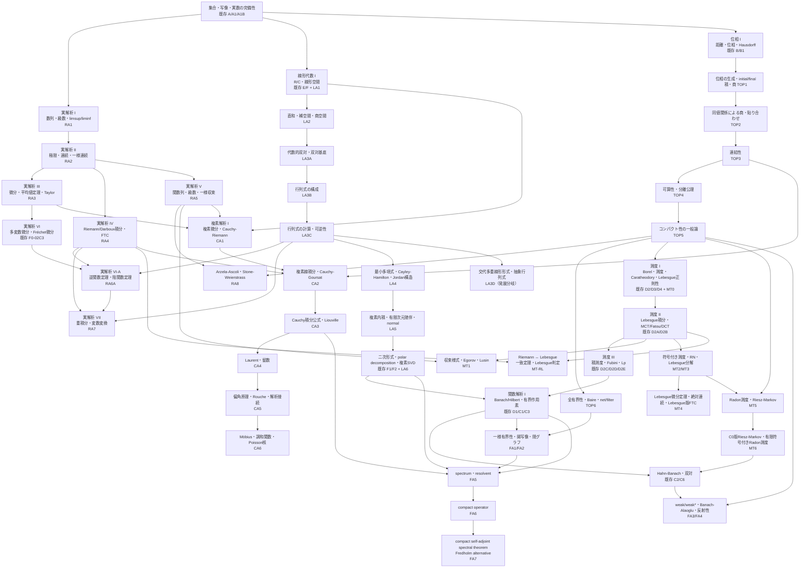

# DREAM THEATER 標準数学コア・カリキュラム

> **統計のために必要なところだけを掘る**構成から、**数学科の標準教科書を一周したときに「そこを抜くのは不自然」となる中核事項を原則回収する**構成へ拡張するための設計台帳です。

既存章はできるだけ正本として再利用し、新章は不足分だけを追加します。追加章は原則として **定義 → 代表定理 → 証明 → 典型例・反例 → 後続章への接続** まで閉じます。

章IDは実装時の衝突を避けるため、予定名前空間を `RA`（real analysis）、`LA`（linear algebra）、`TOP`（topology）、`MT`（measure theory）、`CA`（complex analysis）、`FA`（functional analysis）とします。公開済みの旧章URLは、分割時も互換ハブを残して読者リンクを切らないようにします。

## 0. 採用方針

標準コアへ入れる基準は次です。

1. 数学科の学部標準教科書で章・節として反復して現れる。
2. 後続の解析・確率・統計・最適化で暗黙の前提になりやすい。
3. 有限次元と無限次元、距離空間と一般位相など「どこから壊れるか」を理解するために重要である。
4. DREAM THEATER の主要定理の証明依存として現れる。

各章は `core` / `bridge` / `advanced-standard` を区別し、標準コアに含めることと統計検定1級の通常教材の必修前提にすることは分けます。

**Jordan標準形は LA4 の構造論の到達点として標準コアに含めます。** ただし、統計検定1級の通常教材の必修前提にはせず、最小多項式・Cayley–Hamilton・一般化固有空間から「対角化不能な作用素がどう壊れるか」を閉じるための数学科標準事項として扱います。

---

# 1. 全体の読む順 DAG



最短の大動脈は次です。

```text
実数の完備性 → 実解析 → Riemann積分 ┐
                                      ├→ Riemann/Lebesgue接続
位相 → Borel集合 → 測度 → Lebesgue積分 ┘

線形代数 → 内積・スペクトル → Banach/Hilbert → 関数解析
一般位相 → コンパクト性・Baire ─────────────────────┘
測度論 → Lp ────────────────────────────────────────┘
```

---

# 2. 実解析：理論的微積分を一通り

現行 F0-00 は計算技法としての微積分を担っています。RA系列では **なぜ微積分の定理が成り立つか** を扱い、Riemann積分を本体に置きます。

## RA1 数列・級数 `core`

- 数列、部分列、Cauchy列、単調収束、Bolzano–Weierstrass
- `limsup` / `liminf`
- 級数とCauchy判定、比較・比・根判定
- 絶対収束・条件収束、交代級数
- Riemann再配列定理、Cauchy積
- 冪級数、収束半径

既存 A1/A1B/B0/D は正本として再利用します。

## RA2 極限・連続・一様連続 `core`

- 関数極限の ε–δ 定義、片側極限、無限遠
- 連続性、中間値定理、最大最小値定理
- 一様連続、Heine–Cantor、Lipschitz
- 単調関数の不連続点

## RA3 微分法の理論 `core`

- 導関数、Fermat、Rolle、平均値定理、Cauchy平均値定理
- 単調性・凸性への応用
- L'Hopital
- Taylor定理と剰余項
- 逆関数の微分

## RA4 Riemann/Darboux積分・FTC `core`

- 分割・細分、上和・下和、上積分・下積分
- Darboux可積分性
- tagged partition と Riemann和
- Riemann積分とDarboux積分の同値
- Riemann可積分性のCauchy型判定
- 連続関数・単調関数の可積分性
- 可積分関数の和・積・絶対値、区間加法性・順序性
- 微積分学の基本定理 I / II
- 置換積分・部分積分の厳密な定理
- 通常のRiemann積分と広義Riemann積分を明確に分離

## RA5 関数列・関数級数・一様収束 `core`

- 各点収束と一様収束、一様Cauchy条件
- 一様極限と連続性
- 積分と極限の交換
- 微分と極限の交換条件
- Weierstrass M-test
- 冪級数の項別微分・項別積分
- 各点収束だけでは何が壊れるかの標準反例

## RA6 多変数微分 `core`

- Fréchet微分を一つの線形一次近似として定義し、一意性と微分可能性からの連続性を証明
- 偏微分・方向微分・全微分・Jacobianの関係
- 全偏微分の存在だけでは微分可能とは限らない反例と、破綻する残差比
- 連続な偏微分からFréchet微分可能性を導く座標増分・一変数平均値定理による証明
- Fréchet連鎖律を二つの剰余項の合成から証明
- 高階微分・Hessian・二階の多変数Taylor展開

既存 [F0-02C3](volumes/00_foundations/F0_02C3_Frechet微分_線形作用素_随伴/index.md) を標準コア正本として再利用し、Section 1〜10でRA6の有限次元部分を閉じます。後半はBanach/Hilbert空間への発展として関数解析系列へ接続します。

## RA6A 逆関数定理・陰関数定理 `core`

- 線分上の微分の積分表示と、恒等写像からのずれを使う定量評価
- 有限次元の閉球上で収縮写像補題を証明し、外部の不動点定理をブラックボックス化しない
- 逆関数定理を正規化 → 収縮写像 → 局所全単射 → 逆写像の微分可能性・$C^1$ 性まで証明
- 陰関数定理を $G(x,y)=(x,F(x,y))$ に対する逆関数定理から導き、$D\varphi=-(D_yF)^{-1}D_xF$ を証明
- 正則レベル集合の局所グラフ表示と接空間 $\ker DF$、Lagrange未定乗数法までを系として接続
- 「Jacobianが全点で正則でも大域単射とは限らない」「微分が非可逆でも写像自体は可逆な場合がある」という境界を反例で確認

[RA6A 本文](volumes/00_foundations/RA6A/index.md) は RA6 と RA7 の間に置き、局所可逆性を変数変換・制約付き最適化・推定方程式の感度解析へ接続します。

## RA7 多重Riemann積分・変数変換 `core`

- 長方形上のRiemann積分、Jordan可測集合
- 重積分、Riemann版Fubini
- 変数変換定理、Jacobianの絶対値
- 極座標・球座標の厳密化

## RA8 関数族のコンパクト性・近似 `advanced-standard`

- Arzela–Ascoli
- Weierstrass近似定理
- Stone–Weierstrass
- `C(K)` の一様ノルムへの接続

---

# 3. Riemann積分とLebesgue積分の橋

## MT-RL Riemann ↔ Lebesgue `core / bridge`

必ず独立した橋を置きます。

1. `[a,b]` 上でRiemann可積分な関数はLebesgue可測かつLebesgue可積分。
2. そのとき Riemann積分値とLebesgue積分値は一致。
3. **LebesgueのRiemann可積分判定**：有界関数がRiemann可積分であることと、不連続点集合がLebesgue測度0であることは同値。
4. Dirichlet関数・Thomae関数で境界を確認。
5. 広義Riemann積分とLebesgue `L1` 可積分性は同じではない。`sin x/x` などで条件収束と絶対可積分性を区別。

これで

```text
計算微積分 → 理論的Riemann積分 → 測度論的Lebesgue積分
```

が一本につながります。

---

# 4. 線形代数：数学科標準コア

現行 E/F/E1/E2/F1/F2 を基底・線形写像・実内積・実対称スペクトル定理・実SVDの正本として再利用し、LA系列では複素数体、商空間、代数的双対、一般作用素の構造、複素内積を補います。

## LA1 実・複素線形空間 `core`

- 体の最低限定義
- `R` / `C` 上のベクトル空間、複素共役
- 実行列の複素固有値、complexification の考え方

## LA2 直和・補空間・商空間 `core`

- 部分空間の和、内部/外部直和、補空間
- 商空間 `V/W`、商写像
- 次元公式、線形写像の第一同型定理

## LA3A 代数的双対・双対基底 `core`

- 「ベクトルを測る線形な測定器」という具体像から線形形式と代数的双対へ入る
- 双対基底、annihilator、商空間の双対、dual map
- 自然写像 `V -> V**` と有限次元
- 関数解析で使う「連続線形汎関数全体としての双対」とは概念名を分離する

## LA3B 行列式の構成 `core`

- 面積・体積倍率に欲しい性質を先に確認する
- 置換・転倒数・符号から Leibniz 公式を構成する
- 交代多重線形性、転置不変性、特徴付けによる一意性を証明する

## LA3C 行列式の計算・可逆性 `core`

- 基本変形、三角行列、Laplace 展開、余因子行列
- 行列式の乗法性と可逆性判定
- 相似不変性まで閉じ、LA4 の特性多項式へ直接接続する

## LA3D 交代多重線形形式・抽象行列式 `core / enrichment`

- 最高次交代形式の1次元性
- 線形自己写像が体積形式へ与える倍率としての抽象行列式
- 表現行列の行列式との一致
- 標準コアには含めるが、LA4へ進むための必須関門にはしない

## LA4 作用素多項式・最小多項式・Jordan構造 `core`

- 作用素多項式、特性多項式、最小多項式
- Cayley–Hamilton
- 最小多項式による対角化判定
- 一般化固有空間とその直和分解
- Jordan鎖・Jordanブロック・Jordan標準形
- Jordan標準形は数学科標準コアとして扱うが、通常の統計検定1級ルートの必修前提にはしない

## LA5 複素内積・有限次元随伴・normal operator `core`

- sesquilinear form、複素内積、conjugate transpose
- **有限次元随伴**、Hermitian/self-adjoint、unitary、normal
- Schurのユニタリ三角化と複素normal operatorのスペクトル定理
- Banach/Hilbert空間での随伴作用素とは名称と依存を分離する

## LA6 スペクトル・二次形式・polar decomposition・SVD `core`

- Hermitian二次形式、congruence、Sylvesterの慣性法則
- Hermitian PSD作用素の一意なPSD平方根
- polar decomposition
- 既存F1/F2の実対称スペクトル定理・PSD・実SVDを正本として再利用
- 複素特異値分解へ拡張

`rational canonical form`、tensor/exterior algebra は `advanced-standard` 候補とし、主DAGの必須前提にはしません。

---

# 5. 一般位相：標準教科書コア

現行 B1 には位相空間・部分空間位相・位相的収束・連続写像に加え、Hausdorff性と極限一意性まで入っています。以下を補います。

## TOP1 位相の生成・initial/final topology・積・商 `core`

- basis / subbasis / neighborhood basis と生成位相
- 位相の包含関係による「最粗・最細」の証明
- initial topology の普遍性と、部分空間位相・積位相への特殊化
- final topology の普遍性と、商位相・商写像への特殊化
- 連続性判定を逆像の等式まで追う
- 飽和集合と $q^{-1}(q(A))$ の具体計算

## TOP2 同値関係による商空間・貼り合わせ `core`

- 同相写像、同値関係・同値類、同一視空間
- 商空間への写像の降下：well-defined性・連続性・一意性
- compact → Hausdorff の連続全単射による同相判定
- 区間の端点同一視から円、正方形の辺同一視から円柱・トーラス
- 位相的直和を final topology として扱い、貼り合わせを「直和 → 商」で構成
- 二重原点直線による「商空間はHausdorffとは限らない」反例

## TOP3 連結性 `core`

- connected / path connected
- component / path component
- locally connected / locally path connected
- 実数区間の連結性、連続像による保存

## TOP4 可算性公理・分離公理 `core`

- first countable / second countable / separable / Lindelof
- T0 / T1 / T2 / regular / normal
- 一般位相では点列だけで閉包・連続性を特徴付けられない理由
- Urysohn lemma、Tietze extension theorem

## TOP5 コンパクト性の一般論 `core / advanced-standard`

- finite intersection property
- TOP2で証明した「Hausdorff空間のコンパクト部分集合は閉集合」を再利用
- locally compact、one-point compactification、tube lemma
- 任意積とTychonoff定理、選択公理との関係
- Urysohn metrization theorem の位置付け

## TOP6 全有界性・Baire・net/filter `advanced-standard`

- totally bounded
- 距離空間で `compact iff complete + totally bounded`
- Baire category theorem、meagre / nowhere dense
- net / filter：一般位相における収束の完全な言語

Baire は関数解析の標準三大定理へ直接つなぎます。

---

# 6. 測度論：標準教科書の第2段階

現行 D2–D5 / D2A–D2E は、σ代数・測度・外測度・Caratheodory・Lebesgue測度・可測関数・Lebesgue積分・MCT/Fatou/DCT・積測度・Tonelli/Fubini・Lp を既に担当します。

## MT0 Borel・測度・Caratheodory・Lebesgue正則性 `core`

既存 D2/D3/D4 を正本として再利用し、後続の Lusin で暗黙依存になっていた部分だけを補います。

- 有界可測関数の有限値単関数による一様近似（測度有限性は不要）
- 有限測度 Lebesgue 可測集合の外正則性
- 有限測度 Lebesgue 可測集合の内正則性
- 有限可測分割を、総測度損失を制御しながら compact 集合へ縮める系

## MT1 収束様式・Egorov・Lusin `core`

- a.e. convergence / convergence in measure / Lp convergence
- 一様収束との関係、subsequence principle
- `L^p -> in measure` は有限測度性不要
- `in measure -> a.e. convergent subsequence` は有限測度性不要
- `a.e. -> in measure` と Egorov では有限測度性を上からの連続性に使う
- Lusin では MT0 の内正則性と有限単関数一様近似を明示的に使う
- 含意が逆転しないことを反例と「失われる機構」で整理

確率論の almost sure / in probability / Lp convergence へ接続します。

## MT2 符号付き測度・全変動 `core`

- signed measure
- Hahn decomposition、Jordan decomposition
- total variation

## MT3 Radon–Nikodym・Lebesgue分解 `core`

- absolute continuity `nu << mu`、singular measures
- Radon–Nikodym theorem / derivative
- Lebesgue decomposition theorem
- 密度関数を「測度の微分」として読み直す
- 条件付き期待値への橋

## MT4 Lebesgue微分定理・絶対連続関数 `advanced-standard`

- absolutely continuous function、bounded variation
- Lebesgue differentiation theorem
- a.e. differentiability
- Lebesgue版 fundamental theorem of calculus

## MT5 Radon測度・Riesz–Markov `advanced-standard / bridge`

- regular Borel measure、Radon measure
- locally compact Hausdorff space
- 正線形汎関数 `C_c(X) → R` の Riesz–Markov 表現
- LCH cutoff と測度の構成・一意性

## MT6 C0版Riesz–Markov・有限符号付きRadon測度 `advanced-standard / bridge`

- `C_0(X)` の Banach lattice 性と `C_c(X)` の一様稠密性
- 正錐上の envelope による有界汎関数の正負分解
- 有限符号付き Radon 測度との表現対応
- `||T|| = |ν|(X)` の等長性と一意性

## Lp系列の補強 `core`

- `1 <= p <= infinity` の完備性
- simple functions の稠密性
- 適切な仮定下での `C_c` の稠密性
- Lp duality
- `L2` のHilbert空間構造

---

# 7. 複素解析：Cauchy 理論から留数・調和関数まで

複素解析は FA5 の補助定理置き場ではなく、Fourier解析・PDE・スペクトル論へ共通に流れ込む独立した標準系列とする。現段階では **定義・定理・例・演習の骨格を先に固定し、定理の証明は TODO** とする。証明完成まで YAML 上の状態は `planned` のままにする。

## CA1 複素微分・Cauchy–Riemann・初等正則関数 `core`
複素微分、holomorphic/entire、Cauchy–Riemann、Wirtinger微分、複素指数・三角関数。

## CA2 複素線積分・原始関数・Cauchy–Goursat `core`
曲線積分、ML評価、原始関数、三角形版Cauchy–Goursat、星型領域、対数の枝。

## CA3 Cauchy積分公式・Taylor展開・Liouville・最大値原理 `core`
Cauchy積分公式、高階導関数、正則なら解析的、Cauchy評価、Liouville、恒等定理、最大値原理。**FA5 のスペクトル非空性はこの章へ正式依存する。**

## CA4 Laurent展開・孤立特異点・留数定理 `core`
Laurent展開、可除特異点・極・真性特異点、留数定理、contourによる実積分。Fourier変換の具体例へ接続する。

## CA5 偏角原理・Rouché・解析接続 `core / advanced-standard`
winding number、偏角原理、Rouché、解析接続、monodromy。

## CA6 Möbius変換・Schwarz補題・調和関数・Poisson核 `advanced-standard / bridge`
Möbius変換、Schwarz lemma、調和関数、平均値性質、Poisson kernel。Fourier級数とDirichlet問題へ直接接続する。

**証明境界**：Riemann mapping theorem、normal family、Montel theorem は既知扱いせず、RA8 と接続する後続 advanced-standard 拡張へ送る。

---

# 8. 関数解析：標準三大定理の先まで

現行 C1/C1A/C2/C3/C3A/C3B/C6 は Banach/Hilbert・射影・双対・Riesz・有界線形作用素・随伴・Hahn–Banach を担当します。

## FA1 Baire・一様有界性原理 `core`

- quotient norm / quotient Banach
- Baire category theorem の再利用
- Banach–Steinhaus / uniform boundedness principle
- pointwise bounded と uniformly bounded の違い

## FA2 開写像定理・閉グラフ定理 `core`

- open mapping theorem
- bounded inverse theorem
- closed graph theorem
- 完備性を外すと何が壊れるか

## FA3 weak / weak* topology `core`

- weak convergence / weak* convergence
- norm convergenceとの違い、dual pairing
- weak topology を初期位相として見る
- Hilbert空間でのweak convergence

## FA4 Banach–Alaoglu・反射性 `core / advanced-standard`

- Banach–Alaoglu
- reflexive Banach space
- canonical embedding `X -> X**`
- 弱コンパクト性
- `Lp (1<p<infinity)` の反射性への橋

## FA5 spectrum・resolvent `core`

- spectrum / resolvent
- Neumann series、spectral radius
- 有限次元の固有値との違い

## FA6 compact operator `core`

- compact operator、finite-rank approximation
- Riesz lemma
- compact operator の spectrum
- 弱収束との関係

## FA7 compact self-adjoint spectral theorem `core / bridge`

- compact self-adjoint operator の spectral theorem
- orthonormal eigenbasis
- Fredholm alternative
- integral operator への応用
- RKHS・PDE・逆問題への橋

---

# 9. 既存正本との役割分担

| 分野 | 既存の正本 | 新系列の役割 |
|---|---|---|
| 実数の完備性 | A1/A1B | RA1から参照して解析定理へ使用 |
| 距離・位相・収束 | B/B1/C/C1/D | RA/TOP系列から相互参照 |
| 計算微積分 | F0-00 | RA3/RA4/RA6/RA6A/RA7で理論を与える |
| 基礎線形代数 | E/F/E1/E2/F1/F2 | LA系列が複素・商・代数的双対・行列式・作用素多項式・Jordan構造等を補う |
| 測度・Lebesgue | D2–D5, D2A–E | MT0がLebesgue正則性を閉じ、MT系列が収束様式・RN・微分定理等を補う |
| 複素解析 | RA/LA/TOPを再利用 | CA系列がCauchy理論・留数・調和関数を正本化し、FA5・Fourier・PDEへ接続 |
| Banach/Hilbert | C1–C3, C6 | FA系列がBaire系三大定理・弱位相・スペクトルを補う |

二重正本は作りません。既存章に定義がある概念は新章からリンクし、新章では新しい定理・依存だけを担当します。

---

# 10. 実装順

1. **RA1–RA5**：数列・級数 → 連続 → 微分 → Riemann → 一様収束。
2. **MT-RL**：Riemann–Lebesgue接続。
3. **LA1–LA6**：複素 → 商 → 代数的双対 → 通常行列式 → 最小多項式・Jordan構造 → 複素内積・normal → 二次形式・polar・複素SVD。LA3D の抽象行列式は LA3C から分岐する発展読順。
4. **TOP1–TOP6**：位相の生成・initial/final → 同値関係による商・貼り合わせ → 連結 → 可算性/分離 → compact/Baire。
5. **MT0・MT1–MT5**：Lebesgue正則性 → 収束様式 → signed measure → RN → differentiation/Radon。
6. **FA1–FA4**：Baire系三大定理 → weak/weak* → Banach–Alaoglu・反射性。
7. **CA1–CA6**：複素微分 → Cauchy理論 → Liouville → Laurent/留数 → 偏角原理 → Poisson核。
8. **FA5–FA7**：CA3を受けて spectrum/resolvent → compact operator → compact self-adjoint spectral theorem/Fredholm alternative。
9. **RA6A–RA8**：RA6は既存F0-02C3再利用で閉じ、逆関数定理・陰関数定理 → 多重積分・変数変換 → Arzela–Ascoli/Stone–Weierstrassを最適化・関数解析へ接続。

各バッチで次を監査対象にします。

- formal definition / theorem / lemma 登録
- knowledge DAG の依存到達性
- reader-facing 初出用語
- 既存正本との重複
- DREAM THEATER 目次の読順
- Mermaid DAG のノードと実章の対応

---

# 11. 到達状態

この標準コアを通ると、DREAM THEATER は次を狙います。

- **実解析**：計算微積分だけでなく、Riemann積分・一様収束・多変数微分・逆関数定理・陰関数定理まで証明付きで一周。
- **線形代数**：実/複素線形空間・商・代数的双対・通常行列式・抽象行列式・最小多項式・Jordan構造・複素スペクトル・二次形式・polar decompositionまで一周。抽象行列式は発展分岐、Jordan標準形は数学科標準コアに含めるが統計検定1級通常ルートの必修前提にはしない。
- **位相**：位相の生成・initial/final topology、積・商・貼り合わせ、連結・可算性・分離・コンパクト性の一般論まで一周。
- **測度論**：Lebesgue積分の構成とLebesgue正則性に加え、収束様式・signed measure・Radon–Nikodymまで一周。
- **複素解析**：複素微分・Cauchy理論・Taylor/Liouville・Laurent/留数・偏角原理・調和関数・Poisson核まで一周し、Fourier/PDE/スペクトル論の共通前提を正本化。
- **関数解析**：Banach/Hilbertから一様有界性・開写像・閉グラフ・弱位相・スペクトル・compact operatorまで一周。

その上で確率論・統計理論・凸解析・RKHS・PDEへ進み、「知らない定理が地下から突然生えてくる」状態を減らします。
