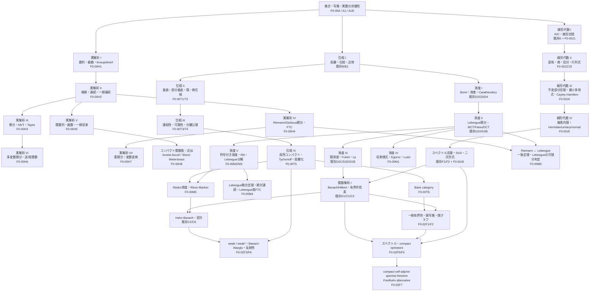

# DREAM THEATER 標準数学コア・カリキュラム

> 統計のために必要なところだけを地下へ掘るのではなく、**数学科の標準的な教科書を一周したときに「そこを抜くのは不自然」となる中核事項を原則として回収する**ためのカリキュラムです。

このページは DREAM THEATER の基礎数学系列について、既存章を活かしながら不足分を追加するための設計台帳です。単に用語名を目次へ追加するのではなく、各項目について **定義 → 代表定理 → 証明 → 典型例・反例 → 後続章への接続** までを教材化することを原則とします。

## 0. 方針

### 0.1 標準コアの判定基準

次のいずれかを満たす項目は、原則として DREAM THEATER の標準コアへ入れます。

1. 数学科の学部標準教科書で章・節として反復して現れる。
2. 後続の解析・確率・統計・最適化で暗黙の前提になりやすい。
3. 「有限次元では当たり前だが無限次元では壊れる」「距離空間では成り立つが一般位相では壊れる」のような境界を理解するために重要である。
4. 主要定理の証明依存として現れる。

一方、標準コアに含めることと、全読者の必修前提にすることは分けます。各章は `core` / `bridge` / `advanced-standard` を区別し、統計検定1級の通常教材へ逆流させません。

### 0.2 明示的な除外

- **Jordan標準形は標準コアの必須項目から除外**します。
- ただし Jordan 標準形を使わなくても扱える、最小多項式、Cayley–Hamilton、三角化、一般化固有空間、一次分解などは扱います。
- 代数的位相、微分幾何、圏論、表現論などは、本ページの「基礎5分野」の標準コアには含めません。必要になれば別系列とします。

---

# 1. 全体の読む順 DAG

章IDは追加実装時の予定IDです。既存章は現在のIDを維持し、不足章だけを新設します。



### 1.1 最短の本線

全部を直列に読む必要はありません。大きな本線は次の5本です。

```text
実数の完備性 → 実解析 → Riemann積分 ┐
                                      ├→ Riemann/Lebesgue接続
位相 → Borel集合 → 測度 → Lebesgue積分 ┘

線形代数 → 内積・スペクトル → Banach/Hilbert → 関数解析

一般位相 → コンパクト性・Baire ───────────────┘

測度論 → Lp ────────────────────────────────┘
```

---

# 2. 実解析：理論的微積分を一通り

現行 F0-00 は計算技法としての微積分を担っているため、新系列では **なぜ微積分の定理が成り立つか** を扱います。Riemann積分は単なる補足ではなく、実解析の本体として置きます。

## F0-00H1 数列・級数・実数の完備性の使い方 `core`

- 数列の収束、部分列、Cauchy列
- 単調収束定理
- Bolzano–Weierstrass定理
- 上極限・下極限 `limsup` / `liminf`
- 級数、Cauchy判定
- 正項級数の比較・比・根判定
- 絶対収束・条件収束
- 交代級数
- 級数の並べ替えと Riemann の再配列定理
- Cauchy積
- 冪級数と収束半径

既存 A1/A1B/B0/D の内容は再利用し、重複説明ではなく「解析でどう使うか」へ接続します。

## F0-00H2 関数の極限・連続・一様連続 `core`

- 関数極限の ε–δ 定義
- 片側極限、無限遠での極限
- 連続性と合成
- 中間値の定理
- 最大最小値定理
- 一様連続性
- Heine–Cantor定理
- Lipschitz連続性
- 単調関数の不連続点

既存 C/C1/C2 の位相的説明と相互リンクします。

## F0-00H3 微分法の理論 `core`

- 導関数の定義
- Fermatの定理
- Rolleの定理
- 平均値の定理
- Cauchyの平均値の定理
- 単調性・凸性への応用
- L'Hopitalの定理
- Taylorの定理と剰余項
- 逆関数の微分
- 凸関数の一変数解析

## F0-00H4 Riemann積分・Darboux積分・微積分学の基本定理 `core`

- 区間の分割、細分
- 上和・下和
- 上積分・下積分
- Darboux可積分性
- tagged partition と Riemann和
- Riemann積分とDarboux積分の同値性
- Riemann可積分性のCauchy型判定
- 連続関数・単調関数のRiemann可積分性
- 可積分関数の和・積・絶対値
- 区間に関する加法性・順序性
- 不連続点と可積分性の初歩
- 微積分学の基本定理 I / II
- 置換積分・部分積分の厳密な定理
- 広義Riemann積分は通常のRiemann積分と分離して定義

## F0-00H5 関数列・関数級数・一様収束 `core`

- 各点収束と一様収束
- 一様Cauchy条件
- 一様極限は連続性を保存
- 積分と極限の交換
- 微分と極限の交換に必要な条件
- Weierstrass M-test
- 冪級数の項別微分・項別積分
- Taylor級数と解析関数の入口
- 各点収束では何が壊れるか：標準反例

## F0-00H6 多変数微分・逆関数・陰関数 `core`

- R^n の開集合と多変数極限
- 全微分・Fréchet微分
- Jacobian
- chain rule
- 高階微分・Hessian
- 多変数Taylor定理
- 逆関数定理
- 陰関数定理
- 制約なし極値
- Lagrange未定乗数法との接続

既存 F0-02C3 の Fréchet微分は、無限次元版としてこの後に読む構成へ整理します。

## F0-00H7 多重Riemann積分・変数変換 `core`

- 長方形上のRiemann積分
- Jordan可測集合
- 重積分
- Riemann版Fubini
- 変数変換定理
- Jacobianの絶対値が現れる理由
- 極座標・球座標の厳密化

## F0-00H8 関数族のコンパクト性・近似 `advanced-standard`

- Arzela–Ascoli定理
- Weierstrass近似定理
- Stone–Weierstrass定理への入口
- C(K) の一様ノルムとの接続

---

# 3. Riemann積分とLebesgue積分の橋

## F0-00M0 Riemann積分とLebesgue積分 `core / bridge`

ここは必ず独立した橋として置きます。

### 必須定理

1. 有界閉区間 `[a,b]` 上で Riemann 可積分な関数は Lebesgue 可測かつ Lebesgue 可積分である。
2. そのとき両積分は一致する：

   `Riemann integral = Lebesgue integral`。
3. **LebesgueのRiemann可積分判定**：有界関数がRiemann可積分であることと、不連続点集合がLebesgue測度0であることは同値。
4. Riemann積分可能関数の変更を測度0集合上で行ったとき何が起こるか。
5. 広義Riemann積分とLebesgue `L1` 可積分性は同じではない。

### 必須反例

- Dirichlet関数：Lebesgue積分可能だがRiemann積分不能。
- Thomae関数：不連続点集合が測度0でRiemann積分可能。
- `sin x / x` の無限区間上の広義積分：条件収束と絶対可積分性の違い。

この章により、計算微積分 → 理論的Riemann積分 → 測度論的Lebesgue積分が一本につながります。

---

# 4. 線形代数：Jordan標準形を除く数学科コア

現行 E/F/E1/E2/F1/F2 を土台とします。特に現行 E は実ベクトル空間から始まるため、複素線形代数を正式に追加します。

## F0-00J1 体・実/複素ベクトル空間 `core`

- 体の最低限定義
- R と C 上のベクトル空間
- 複素共役
- complexification の考え方
- 実行列の複素固有値

## F0-00J2 直和・補空間・商空間 `core`

- 部分空間の和
- 直和
- 内部直和・外部直和
- 補空間
- 商空間 `V/W`
- 商写像
- 商空間の次元公式
- 線形写像の第一同型定理

## F0-00J3 双対空間・双対写像・行列式 `core`

- 代数的双対 `V*`
- 双対基底
- annihilator
- transpose / dual map
- `V -> V**`
- 有限次元での自然同型
- 行列式を交代多重線形写像として特徴付ける
- Laplace展開を定義の本体にしない

## F0-00J4 不変部分空間・作用素多項式 `core`

- 不変部分空間
- 固有空間
- 特性多項式
- 最小多項式
- Cayley–Hamilton定理
- 三角化可能性
- Schur三角化
- 一般化固有空間
- primary decomposition の考え方

**Jordan標準形そのものは必須化しません。**

## F0-00J5 複素内積空間・随伴・normal operator `core`

- sesquilinear form
- 複素内積
- conjugate transpose
- adjoint
- self-adjoint / Hermitian
- unitary / orthogonal
- normal operator
- 複素スペクトル定理

## F0-00J6 双線形形式・二次形式 `core`

- 双線形形式
- 対称双線形形式
- 二次形式
- congruence
- Sylvesterの慣性法則
- 正定値・半正定値
- Gram行列
- polar decomposition
- 正作用素の平方根

既存 F1/F2 のスペクトル定理・PSD・SVD と統合して重複を避けます。

### advanced-standard として候補に残すもの

- rational canonical form
- tensor product / exterior algebra

これらは標準線形代数の次段ではあるものの、この5分野の主DAGを塞ぐ前提にはしません。

---

# 5. 一般位相：標準教科書コア

現行 B1 には位相空間・部分空間位相・位相的収束・連続写像に加え、Hausdorff性と極限一意性まで入っています。ここから先を補います。

## F0-00T1 位相の基底・部分基底 `core`

- basis / subbasis
- basis が生成する位相
- 近傍基底
- 位相の強弱
- 連続性を基底で判定

## F0-00T2 積位相・商位相 `core`

- 有限積・任意積
- product topology
- box topologyとの違い
- 射影写像
- quotient topology
- quotient map
- 貼り合わせ・同一視の典型例

## F0-00T3 連結性 `core`

- connected / disconnected
- separation
- path connected
- connected component
- path component
- locally connected / locally path connected
- 実数区間が連結であること
- 連続像が連結性を保存

## F0-00T4 可算性公理・分離公理 `core`

- first countable
- second countable
- separable
- Lindelof
- T0 / T1 / T2(Hausdorff) / regular / normal
- 一般位相では点列だけで閉包・連続性を特徴付けられない理由
- Urysohn lemma
- Tietze extension theorem

## F0-00T5 コンパクト性の一般論 `core / advanced-standard`

- open-cover compactness
- finite intersection property
- compact subset of Hausdorff is closed
- locally compact
- one-point compactification
- tube lemma
- arbitrary products
- Tychonoff theorem と選択公理との関係
- Urysohn metrization theorem の位置付け
- 完全正規性などは必要に応じて補足

## F0-00T6 全有界性・Baire・net/filter `advanced-standard`

- totally bounded
- metric space で compact iff complete + totally bounded
- Baire category theorem
- meagre / nowhere dense
- net
- filter
- 一般位相における収束の完全な言語

Baire は関数解析の三大定理へ直接接続します。

---

# 6. 測度論：標準教科書の第2段階まで

現行 D2–D5 / D2A–D2E は、σ代数・測度・外測度・Caratheodory・Lebesgue測度・可測関数・Lebesgue積分・MCT/Fatou/DCT・積測度・Tonelli/Fubini・Lp までを既に担います。以下を追加します。

## F0-00M1 収束様式・Egorov・Lusin `core`

- a.e. convergence
- convergence in measure
- Lp convergence
- 一様収束との関係
- subsequence principle
- Egorov theorem
- Lusin theorem
- 反例で含意関係を整理

確率論の almost sure / in probability / Lp convergence へ直接接続します。

## F0-00M2 符号付き測度・全変動 `core`

- signed measure
- Hahn decomposition
- Jordan decomposition
- total variation
- complex measure は補足

## F0-00M3 Radon–Nikodym・Lebesgue分解 `core`

- absolute continuity `nu << mu`
- singular measures
- Radon–Nikodym theorem
- Radon–Nikodym derivative
- Lebesgue decomposition theorem
- 密度関数を「測度の微分」として読み直す
- 条件付き期待値への橋

## F0-00M4 Lebesgue微分定理・絶対連続関数 `advanced-standard`

- absolutely continuous function
- bounded variation
- Lebesgue differentiation theorem
- a.e. differentiability との関係
- Lebesgue版 fundamental theorem of calculus

## F0-00M5 Radon測度・Riesz–Markov `advanced-standard / bridge`

- regular Borel measure
- Radon measure
- locally compact Hausdorff space
- Riesz–Markov representation theorem
- `C_c(X)` / `C_0(X)` の線形汎関数と測度

## Lp 系列の補強 `core`

- `1 <= p <= infinity` の完備性
- simple functions の稠密性
- 適切な仮定下での `C_c` の稠密性
- Lp duality
- `L2` の Hilbert 空間構造

---

# 7. 関数解析：標準三大定理の先まで

現行 C1/C1A/C2/C3/C3A/C3B/C6 は Banach/Hilbert・射影・双対・Riesz・有界線形作用素・随伴・Hahn–Banach を担います。標準教科書として不足する本流を追加します。

## F0-02F1 Baire・一様有界性原理 `core`

- quotient norm / quotient Banach
- Baire category theorem の再利用
- Banach–Steinhaus / uniform boundedness principle
- pointwise bounded と uniformly bounded の違い

## F0-02F2 開写像定理・閉グラフ定理 `core`

- open mapping theorem
- bounded inverse theorem
- closed graph theorem
- 3定理の依存関係
- 完備性を外すと何が壊れるか

## F0-02F3 weak / weak* topology `core`

- weak convergence
- weak* convergence
- norm convergenceとの違い
- dual pairing
- weak topology を初期位相として見る
- Hilbert空間での weak convergence

## F0-02F4 Banach–Alaoglu・反射性 `core / advanced-standard`

- Banach–Alaoglu theorem
- reflexive Banach space
- canonical embedding `X -> X**`
- 弱コンパクト性
- `Lp (1<p<infinity)` の反射性への橋

## F0-02F5 スペクトル・resolvent `core`

- spectrum / resolvent
- Neumann series
- spectral radius
- finite-dimensional eigenvalues との違い
- spectrum が空でないこと（複素Banach代数の範囲は適切に制御）

## F0-02F6 compact operator `core`

- compact operator
- finite-rank approximation
- Riesz lemma
- compact operator の spectrum
- 弱収束との関係

## F0-02F7 compact self-adjoint spectral theorem `core / bridge`

- compact self-adjoint operator の spectral theorem
- orthonormal eigenbasis
- Fredholm alternative
- integral operator への応用
- RKHS・PDE・逆問題への橋

---

# 8. 既存章との再利用方針

新章を増やす際、既存の説明をコピーして二重正本にしません。

| 分野 | 既存の正本 | 新章側の役割 |
|---|---|---|
| 実数の完備性 | A1/A1B | H1 から参照して解析定理へ使用 |
| 距離・位相・収束 | B/B1/C/C1/D | H2 と T系列から相互参照 |
| 計算微積分 | F0-00 | H3/H4/H6/H7 で理論を与え、計算例はF0-00へ戻す |
| 基礎線形代数 | E/F/E1/E2/F1/F2 | J系列は複素・商・双対・作用素多項式等の不足を補う |
| 測度・Lebesgue | D2–D5, D2A–E | M系列は収束様式・RN・微分定理等の第2段階を補う |
| Banach/Hilbert | C1–C3, C6 | F系列はBaire系三大定理・弱位相・スペクトルを補う |

---

# 9. 実装順

大量の章を同時に生やして空ページを作らないため、依存順に実装します。

1. **実解析 H1–H5**：数列・級数 → 連続 → 微分 → Riemann → 一様収束。
2. **Riemann–Lebesgue橋 M0**：既存測度論と実解析を接続。
3. **線形代数 J1–J6**：複素、商、双対、最小多項式、normal、二次形式。
4. **一般位相 T1–T6**：基底 → 積/商 → 連結 → 可算性/分離 → compact/Baire。
5. **測度論 M1–M5**：収束様式 → signed measure → RN → differentiation/Radon。
6. **関数解析 F1–F7**：Baire系三大定理 → weak/weak* → spectrum/compact operator。
7. **実解析 H6–H8**：多変数・変数変換・Arzela–Ascoli/Stone–Weierstrassを既存最適化・関数解析へ接続。

各バッチで次をCI対象にします。

- formal definition / theorem / lemma の登録
- knowledge DAG の依存到達性
- reader-facing 初出用語
- 既存正本との重複
- DREAM THEATER 目次の読順
- Mermaid DAG のノードと実章の対応

---

# 10. 読者向けの到達イメージ

この標準コアを通ると、DREAM THEATER の地下数学は概ね次の状態になります。

- **実解析**：計算としての微積分ではなく、Riemann積分・一様収束まで証明付きで扱える。
- **線形代数**：行列計算だけでなく、実/複素線形空間・商・双対・作用素の構造を扱える。
- **位相**：距離空間の直感だけでなく、積・商・連結・可算性・分離・コンパクト性の一般論を扱える。
- **測度論**：Lebesgue積分の構成だけでなく、収束様式・Radon–Nikodym・signed measure まで進める。
- **関数解析**：Banach/Hilbert の定義だけでなく、一様有界性・開写像・閉グラフ・弱位相・スペクトル・compact operator まで一周する。

その上で確率論・統計理論・凸解析・RKHS・PDEへ進むと、「知らない定理が地下から突然生えてくる」状態をかなり減らせます。
