# DREAM THEATER 標準数学コア・カリキュラム

> **統計のために必要なところだけを掘る**構成から、**数学科の標準教科書を一周したときに「そこを抜くのは不自然」となる中核事項を原則回収する**構成へ拡張するための設計台帳です。

既存章はできるだけ正本として再利用し、新章は不足分だけを追加します。追加章は原則として **定義 → 代表定理 → 証明 → 典型例・反例 → 後続章への接続** まで閉じます。

章IDは実装時の衝突を避けるため、予定名前空間を `RA`（real analysis）、`LA`（linear algebra）、`TOP`（topology）、`MT`（measure theory）、`CA`（complex analysis）、`FA`（functional analysis）とします。公開済みの旧章URLは、分割時も互換ハブを残して読者リンクを切らないようにします。

## 0. 採用方針

標準コアへ入れる基準は次です。

1. 数学科の学部標準教科書で章・節として反復して現れる。
2. 後続の解析・確率・統計・最適化で暗黙の前提になりやすい。
3. 有限次元と無限次元、距離空間と一般位相など「どこから壊れるか」を理解するために重要である。
4. DREAM THEATER の主要定理の証明依存として現れる。

各章は `core` / `bridge` / `advanced-standard` を区別し、標準コアに含めることと統計検定1級の通常教材の必修前提にすることは分けます。

**Jordan標準形は LA4 の構造論の到達点として標準コアに含めます。** ただし、統計検定1級の通常教材の必修前提にはせず、最小多項式・Cayley–Hamilton・一般化固有空間から「対角化不能な作用素がどう壊れるか」を閉じるための数学科標準事項として扱います。

---

# 1. 全体の読む順 DAG

```mermaid
flowchart TD
  A["集合・写像・実数の完備性<br/>既存 A/A1/A1B"]

  A --> RA1["実解析 I<br/>数列・級数・limsup/liminf<br/>RA1"]
  A --> LA1["線形代数 I<br/>R/C・線形空間<br/>既存 E/F + LA1"]
  A --> TOP0["位相 I<br/>距離・位相・Hausdorff<br/>既存 B/B1"]

  RA1 --> RA1A["実解析 I-A<br/>数値級数の収束論<br/>RA1A"]
  RA1 --> RA2["実解析 II<br/>極限・連続・一様連続<br/>RA2"]
  RA1A --> RA4A
  RA1A --> RA5
  RA2 --> RA3["実解析 III<br/>微分・平均値定理・Taylor<br/>RA3"]
  RA2 --> RA4["実解析 IV<br/>Riemann/Darboux積分・FTC<br/>RA4"]
  RA4 --> RA4A["実解析 IV-A<br/>広義積分・収束判定<br/>RA4A"]
  RA2 --> RA5["実解析 V<br/>関数列・級数・一様収束<br/>RA5"]
  RA3 --> RA6["実解析 VI<br/>多変数微分・Fréchet微分<br/>既存 F0-02C3"]
  RA4 --> RA6A["実解析 VI-A<br/>逆関数定理・陰関数定理<br/>RA6A"]
  RA6 --> RA6A
  LA3C --> RA6A
  RA4 --> RA7["実解析 VII<br/>重積分・変数変換<br/>RA7"]
  RA6A --> RA7
  LA3C --> RA7
  RA5 --> RA8["Arzela-Ascoli・Stone-Weierstrass<br/>RA8"]
  TOP5 --> RA8

  RA6A --> VC1["ベクトル解析 I<br/>grad・div・curl・Laplacian<br/>VC1"]
  VC1 --> VC2["ベクトル解析 II<br/>曲線・線積分・保存場<br/>VC2"]
  TOP3 --> VC2
  VC1 --> VC3["ベクトル解析 III<br/>曲面・向き・flux<br/>VC3"]
  RA7 --> VC3
  LA3C --> VC3
  VC2 --> VC4["ベクトル解析 IV<br/>Green・Gauss・保存則<br/>VC4"]
  VC3 --> VC4
  VC4 --> VC5["ベクトル解析 V<br/>Stokes・curl・topology<br/>VC5"]
  VC5 --> VC6["ベクトル解析 VI<br/>直交曲線座標<br/>VC6"]

  TOP0 --> TOP1["位相の生成・initial/final<br/>積・商 TOP1"]
  TOP1 --> TOP2["同値関係による商・貼り合わせ<br/>TOP2"]
  TOP2 --> TOP3["連結性<br/>TOP3"]
  TOP3 --> TOP4["可算性・分離公理<br/>TOP4"]
  TOP4 --> TOP5["コンパクト性の一般論<br/>TOP5"]
  TOP4 --> GEO1["滑らかな多様体・滑らかな写像<br/>GEO1"]
  RA6A --> GEO1
  GEO1 --> GEO2["接空間・余接空間・微分・接束<br/>GEO2"]
  LA3A --> GEO2
  GEO2 --> GEO3["階数定理・はめ込み・沈め込み・部分多様体<br/>GEO3"]
  RA6A --> GEO3
  GEO3 --> GEO4["1 の分割・局所化・埋め込み<br/>GEO4"]
  TOP5A --> GEO4
  GEO2 --> GEO5["ベクトル場・積分曲線・局所流・Lie 括弧<br/>GEO5"]
  ODE1 -. "reuse" .-> GEO5
  ODE4 -. "reuse" .-> GEO5
  GEO3 --> GEO6["線形分布・積分多様体・Frobenius の定理<br/>GEO6"]
  GEO5 --> GEO6
  GEO2 --> GEO7["テンソル場・微分形式・外微分<br/>GEO7"]
  GEO5 --> GEO7
  LA3E --> GEO7
  GEO4 --> GEO8["向き・多様体上の積分・一般 Stokes<br/>GEO8"]
  GEO7 --> GEO8
  RA7 --> GEO8
  VC5 --> GEO8
  GEO7 --> GEO9["Poincaré の補題・de Rham コホモロジー<br/>GEO9"]
  GEO8 --> GEO9
  TOP3 --> GEO9
  GEO3 --> GEO10["Euclid 空間の曲線・超曲面 I<br/>基本形式と形作用素<br/>GEO10"]
  VC2 --> GEO10
  VC3 --> GEO10
  LA5 --> GEO10
  TOP5 --> TOP5A["Urysohn・局所コンパクト性・cutoff<br/>TOP5A"]
  TOP5 --> BAIRE["全有界性・Baire・net/filter<br/>TOP6"]
  BAIRE --> UNIFORM["一様構造・一様連続・Cauchy構造<br/>TOP7"]
  RA5 --> UNIFORM

  LA1 --> LA2["直和・補空間・商空間<br/>LA2"]
  LA2 --> LA3A["代数的双対・双対基底<br/>LA3A"]
  LA3A --> LA3B["行列式の構成<br/>LA3B"]
  LA3B --> LA3C["行列式の計算・可逆性<br/>LA3C"]
  LA3C --> LA4["最小多項式・Cayley-Hamilton・Jordan構造<br/>LA4"]
  LA3C --> LA3D["交代多重線形形式・抽象行列式<br/>LA3D（発展分岐）"]
  LA3A --> LA3E["テンソル積・外積代数<br/>LA3E"]
  LA3D --> LA3E
  LA4 --> LA5["複素内積・有限次元随伴・normal<br/>LA5"]
  LA5 --> LA6["二次形式・polar decomposition・複素SVD<br/>既存 F1/F2 + LA6"]

  TOP5 --> MT0["測度 I<br/>Borel・測度・Caratheodory・Lebesgue正則性<br/>既存 D2/D3/D4 + MT0"]
  MT0 --> MTI["測度 II<br/>Lebesgue積分・MCT/Fatou/DCT<br/>既存 D2A/D2B"]
  MTI --> MTP["測度 III<br/>積測度・Fubini・Lp<br/>既存 D2C/D2D/D2E"]
  MTI --> MT1["収束様式・Egorov・Lusin<br/>MT1"]
  RA5 --> MT1
  MTI --> MT2["符号付き測度・RN・Lebesgue分解<br/>MT2/MT3"]

  RA4 --> RLB["Riemann ↔ Lebesgue<br/>一致定理・Lebesgue判定<br/>MT-RL"]
  MTI --> RLB

  MT2 --> MT4["Lebesgue微分定理・絶対連続・Lebesgue版FTC<br/>MT4"]
  TOP5A --> MT5["Radon測度・Riesz-Markov<br/>MT5"]
  MT2 --> MT5

  RA3 --> CA1["複素解析 I<br/>複素微分・Cauchy-Riemann<br/>CA1"]
  RA5 --> CA1
  LA1 --> CA1
  CA1 --> CA2["複素線積分・Cauchy-Goursat<br/>CA2"]
  RA4 --> CA2
  TOP3 --> CA2
  CA2 --> CA3["Cauchy積分公式・Liouville<br/>CA3"]
  CA3 --> CA4["Laurent・留数<br/>CA4"]
  CA4 --> CA5["偏角原理・Rouche・解析接続<br/>CA5"]
  CA5 --> CA6["Möbius・調和関数・Poisson核<br/>CA6"]
  CA6 --> CA7["正則関数列・正規族・Riemann写像<br/>CA7"]
  TOP5 --> CA7
  CA7 --> CA8["Riemann面・被覆・多価関数<br/>CA8"]
  TOP1 --> CA8
  TOP2 --> CA8
  TOP4 --> CA8
  TOP5 --> CA8
  CA8 --> CA9["楕円関数・Weierstrass wp<br/>CA9"]
  CA7 --> CA10["無限積・Weierstrass因数分解<br/>Mittag--Leffler CA10"]
  CA4 --> CA10
  CA10 --> CA11["Gamma関数・反射公式・Stirling<br/>CA11"]
  CA11 --> CA12["Riemann ζ・theta変換・関数等式<br/>CA12"]

  MTP --> FA0["関数解析 I<br/>Banach/Hilbert・有界作用素<br/>既存 D1/C1/C3"]
  LA6 --> FA0
  FA0 --> HB["Hahn-Banach・双対<br/>既存 C2/C6"]
  BAIRE --> FA2["一様有界性・開写像・閉グラフ<br/>FA1/FA2"]
  FA0 --> FA2
  HB --> FA4["weak/weak*・Banach-Alaoglu・反射性<br/>FA3/FA4"]
  TOP5 --> FA4
  FA0 --> FA5["spectrum・resolvent<br/>FA5"]
  FA2 --> FA5
  LA6 --> FA5
  CA3 --> FA5
  FA5 --> FA6["compact operator<br/>FA6"]
  FA6 --> FA7["compact self-adjoint spectral theorem<br/>Fredholm alternative<br/>FA7"]
  MT5 --> MT6["C0版Riesz-Markov・有限符号付きRadon測度<br/>MT6"]
  MT0 --> MT8["Hausdorff測度・Hausdorff次元<br/>MT8"]
  MT6 --> HB
```



最短の大動脈は次です。

```text
実数の完備性 → 実解析 → Riemann積分 ┐
                                      ├→ Riemann/Lebesgue接続
位相 → Borel集合 → 測度 → Lebesgue積分 ┘

線形代数 → 内積・スペクトル → Banach/Hilbert → 関数解析
一般位相 → コンパクト性・Baire ─────────────────────┘
測度論 → Lp ────────────────────────────────────────┘
```

---

# 2. 実解析：理論的微積分を一通り

現行 F0-00 は計算技法としての微積分を担っています。RA系列では **なぜ微積分の定理が成り立つか** を扱い、Riemann積分を本体に置きます。

## RA1 数列・級数 `core`

- 数列、部分列、Cauchy列、単調収束、Bolzano–Weierstrass
- `limsup` / `liminf`
- 級数を部分和列として定義し、Cauchy判定と絶対収束の基礎を構成
- 絶対収束級数の再配列不変性、Cauchy積
- 冪級数、収束半径

既存 A1/A1B/B0/D は正本として再利用します。数値級数の詳細な収束判定は RA1A に分離します。

## RA1A 数値級数の収束論 `core`

- 一般項が0へ行く必要条件、非負項級数の部分和有界性判定
- 比較判定・極限比較判定・比判定・根判定と境界値1の反例
- Cauchy凝縮判定、$p$ 級数、対数補正級数
- Leibnizの交代級数判定と剰余評価
- Abelの部分和変換、Dirichlet判定、Abel判定
- 条件収束とRiemann再配列定理（有限値版）

判定法名を列挙するだけでなく、Cauchy条件・単調収束・部分和変換へ還元して核心論証を本文内で閉じます。

## RA2 極限・連続・一様連続 `core`

- 関数極限の ε–δ 定義、片側極限、無限遠
- 連続性、中間値定理、最大最小値定理
- 一様連続、Heine–Cantor、Lipschitz
- 単調関数の不連続点

## RA3 微分法の理論 `core`

- 導関数、Fermat、Rolle、平均値定理、Cauchy平均値定理
- 単調性・凸性への応用
- L'Hopital
- Taylor定理と剰余項
- 逆関数の微分

## RA4 Riemann/Darboux積分・FTC `core`

- 分割・細分、上和・下和、上積分・下積分
- Darboux可積分性
- tagged partition と Riemann和
- Riemann積分とDarboux積分の同値
- Riemann可積分性のCauchy型判定
- 連続関数・単調関数の可積分性
- 可積分関数の和・積・絶対値、区間加法性・順序性
- 微積分学の基本定理 I / II
- 置換積分・部分積分の厳密な定理
- 本章は有限閉区間上の通常のRiemann積分で閉じ、広義積分の収束論は RA4A へ分離

## RA4A 広義積分・収束判定 `core`

- 無限区間・端点特異点・内部特異点を有限区間Riemann積分の片側極限として定義
- 複数の不良端点は各片側を独立に判定し、Cauchy主値による相殺と区別
- Cauchy判定、非負関数の有界性判定、比較判定・極限比較判定
- 無限遠・0近傍の $p$ 積分と $1/[x(\log x)^q]$ 型の対数補正
- 絶対収束・条件収束と「絶対収束なら収束」
- 級数と広義積分の積分判定
- Dirichlet判定・Abel判定と $\sin x/x$ 型の振動積分
- Cauchy主値が通常の広義積分とは別の極限操作であることを反例で確認

## RA5 関数列・関数級数・一様収束 `core`

- 各点収束と一様収束、一様Cauchy条件
- 一様極限と連続性
- 積分と極限の交換
- 微分と極限の交換条件
- Weierstrass M-test
- 冪級数の項別微分・項別積分
- 各点収束だけでは何が壊れるかの標準反例

## RA6 多変数微分 `core`

- Fréchet微分を一つの線形一次近似として定義し、一意性と微分可能性からの連続性を証明
- 偏微分・方向微分・全微分・Jacobianの関係
- 全偏微分の存在だけでは微分可能とは限らない反例と、破綻する残差比
- 連続な偏微分からFréchet微分可能性を導く座標増分・一変数平均値定理による証明
- Fréchet連鎖律を二つの剰余項の合成から証明
- 高階微分・Hessian・二階の多変数Taylor展開

既存 [F0-02C3](volumes/00_foundations/F0_02C3_Frechet微分_線形作用素_随伴/index.md) を標準コア正本として再利用し、Section 1〜10でRA6の有限次元部分を閉じます。後半はBanach/Hilbert空間への発展として関数解析系列へ接続します。

## RA6A 逆関数定理・陰関数定理 `core`

- 線分上の微分の積分表示と、恒等写像からのずれを使う定量評価
- 有限次元の閉球上で収縮写像補題を証明し、外部の不動点定理をブラックボックス化しない
- 逆関数定理を正規化 → 収縮写像 → 局所全単射 → 逆写像の微分可能性・$C^1$ 性まで証明
- 陰関数定理を $G(x,y)=(x,F(x,y))$ に対する逆関数定理から導き、$D\varphi=-(D_yF)^{-1}D_xF$ を証明
- 正則レベル集合の局所グラフ表示と接空間 $\ker DF$、Lagrange未定乗数法までを系として接続
- 「Jacobianが全点で正則でも大域単射とは限らない」「微分が非可逆でも写像自体は可逆な場合がある」という境界を反例で確認

[RA6A 本文](volumes/00_foundations/RA6A/index.md) は RA6 と RA7 の間に置き、局所可逆性を変数変換・制約付き最適化・推定方程式の感度解析へ接続します。

## RA7 多重Riemann積分・変数変換 `core`

- 長方形上のRiemann積分、Jordan可測集合
- 重積分、Riemann版Fubini
- 変数変換定理、Jacobianの絶対値
- 極座標・球座標の厳密化

## RA8 関数族のコンパクト性・近似 `advanced-standard`

- Arzela–Ascoli
- Weierstrass近似定理
- Stone–Weierstrass
- `C(K)` の一様ノルムへの接続

---

# 3. Riemann積分とLebesgue積分の橋

## MT-RL Riemann ↔ Lebesgue `core / bridge`

必ず独立した橋を置きます。

1. `[a,b]` 上でRiemann可積分な関数はLebesgue可測かつLebesgue可積分。
2. そのとき Riemann積分値とLebesgue積分値は一致。
3. **LebesgueのRiemann可積分判定**：有界関数がRiemann可積分であることと、不連続点集合がLebesgue測度0であることは同値。
4. Dirichlet関数・Thomae関数で境界を確認。
5. 広義Riemann積分とLebesgue `L1` 可積分性は同じではない。`sin x/x` などで条件収束と絶対可積分性を区別。

これで

```text
計算微積分 → 理論的Riemann積分 → 測度論的Lebesgue積分
```

が一本につながります。

---

# 4. 線形代数：数学科標準コア

現行 E/F/E1/E2/F1/F2 を基底・線形写像・実内積・実対称スペクトル定理・実SVDの正本として再利用し、LA系列では複素数体、商空間、代数的双対、一般作用素の構造、複素内積を補います。

## LA1 実・複素線形空間 `core`

- 体の最低限定義
- `R` / `C` 上のベクトル空間、複素共役
- 実行列の複素固有値、complexification の考え方

## LA2 直和・補空間・商空間 `core`

- 部分空間の和、内部/外部直和、補空間
- 商空間 `V/W`、商写像
- 次元公式、線形写像の第一同型定理

## LA3A 代数的双対・双対基底 `core`

- 「ベクトルを測る線形な測定器」という具体像から線形形式と代数的双対へ入る
- 双対基底、annihilator、商空間の双対、dual map
- 自然写像 `V -> V**` と有限次元
- 関数解析で使う「連続線形汎関数全体としての双対」とは概念名を分離する

## LA3B 行列式の構成 `core`

- 面積・体積倍率に欲しい性質を先に確認する
- 置換・転倒数・符号から Leibniz 公式を構成する
- 交代多重線形性、転置不変性、特徴付けによる一意性を証明する

## LA3C 行列式の計算・可逆性 `core`

- 基本変形、三角行列、Laplace 展開、余因子行列
- 行列式の乗法性と可逆性判定
- 相似不変性まで閉じ、LA4 の特性多項式へ直接接続する

## LA3D 交代多重線形形式・抽象行列式 `core / enrichment`

- 最高次交代形式の1次元性
- 線形自己写像が体積形式へ与える倍率としての抽象行列式
- 表現行列の行列式との一致
- 標準コアには含めるが、LA4へ進むための必須関門にはしない

## LA3E テンソル積・外積代数 `core-advanced-standard`

- テンソル積を二重線形写像の普遍性として構成
- テンソル積の基底・次元、共変・反変テンソル、縮約
- 交代化と外冪、外積の結合性・次数付き交換則
- 外冪の基底と `dim Λ^kV^*=binom(n,k)`
- 分解可能形式と、4次元での非分解可能2次形式
- 最高次外積の基底変換と行列式
- 内部積と符号付き積の法則

実装: [LA3E](volumes/00_foundations/LA3E/index.md)

LA3E は GEO7 の微分形式に対する代数的 prerequisite です。LA4 の Jordan 構造へ進む通常の線形代数主線には要求しません。

## LA4 作用素多項式・最小多項式・Jordan構造 `core`

- 作用素多項式、特性多項式、最小多項式
- Cayley–Hamilton
- 最小多項式による対角化判定
- 一般化固有空間とその直和分解
- Jordan鎖・Jordanブロック・Jordan標準形
- Jordan標準形は数学科標準コアとして扱うが、通常の統計検定1級ルートの必修前提にはしない

## LA5 複素内積・有限次元随伴・normal operator `core`

- sesquilinear form、複素内積、conjugate transpose
- **有限次元随伴**、Hermitian/self-adjoint、unitary、normal
- Schurのユニタリ三角化と複素normal operatorのスペクトル定理
- Banach/Hilbert空間での随伴作用素とは名称と依存を分離する

## LA6 スペクトル・二次形式・polar decomposition・SVD `core`

- Hermitian二次形式、congruence、Sylvesterの慣性法則
- Hermitian PSD作用素の一意なPSD平方根
- polar decomposition
- 既存F1/F2の実対称スペクトル定理・PSD・実SVDを正本として再利用
- 複素特異値分解へ拡張

`rational canonical form` は `advanced-standard` 候補とします。テンソル積・外積代数は LA3E として実装済みですが、Jordan 構造へ進む主線の必須前提にはせず、幾何学編への分岐として扱います。

---


# 4A. ベクトル解析：Euclidean な場と積分定理

多変数微分・多重積分を、曲線・曲面・場の積分へ接続します。PDE6 内に局所実装されていた法線・flux・発散定理を独立した canonical series へ移し、後続の PDE・流体・電磁気・連続体力学から再利用できる形にします。

## VC1 ベクトル場と微分演算子 `core`

- scalar/vector field、gradient、divergence、curl、Laplacian
- level surface と gradient の法線性
- `curl grad = 0`、`div curl = 0`、主要 product rules
- 微小 flux / circulation による局所的意味

実装: [VC1](volumes/00_foundations/VC1/index.md)

## VC2 曲線・線積分・保存場 `core`

- regular curve、arc length、scalar/vector line integral
- 線積分の基本定理
- conservative / potential / path independence
- star-shaped domain 上の初等 Poincaré lemma
- punctured plane の irrotational 非 conservative 反例

実装: [VC2](volumes/00_foundations/VC2/index.md)

## VC3 曲面・向き・曲面積分・flux `core`

- regular parametrized surface、接平面、法線、orientation
- surface area element と再パラメータ表示不変性
- scalar surface integral、oriented flux
- graph / sphere / cylinder の具体計算

実装: [VC3](volumes/00_foundations/VC3/index.md)

## VC4 Green・Gauss--Ostrogradsky と保存則 `core`

- Green theorem の circulation / flux form
- Gauss--Ostrogradsky divergence theorem
- graph domain と finite decomposition、内部境界 flux の相殺
- 特異場の punctured-domain 処理
- 局所保存則と積分保存則

実装: [VC4](volumes/00_foundations/VC4/index.md)

## VC5 Stokes theorem・curl・topology `core-advanced-standard`

- Kelvin--Stokes theoremをGreen theoremから古典的に証明
- 曲面orientationから誘導されるboundary orientation
- finite patch decompositionと内部境界の相殺
- curlの局所循環密度としての意味
- 穴あき領域でglobal potentialが壊れる機構
- irrotational / solenoidal / vector potential / gauge freedomの入口

実装: [VC5](volumes/00_foundations/VC5/index.md)

## VC6 直交曲線座標 `core-advanced-standard`

- orthogonal curvilinear coordinatesとscale factors
- 線素・面素・体積要素とJacobian
- scale factorからgrad / div / curl / scalar Laplacianを導出
- cylindrical / spherical coordinates
- 位置依存basisとvector Laplacianの注意
- radial / inverse-square / axisymmetric fieldの典型計算

実装: [VC6](volumes/00_foundations/VC6/index.md)

## VC7 添字記法・直交基底・成分変換 `core-advanced-standard`

- Einstein の総和規約、自由添字・ダミー添字
- Kronecker のデルタ、Levi--Civita 記号、縮約公式
- 直交デカルト基底変換と二階デカルトテンソル
- 二項積、縮約、跡、対称・反対称分解
- ベクトル場の勾配と二階テンソル場の発散
- 二階テンソル版 Gauss--Ostrogradsky の発散定理
- 応力テンソル、慣性テンソル、二階等方テンソル

実装: [VC7](volumes/00_foundations/VC7/index.md)

## VC8 Newton ポテンシャル・Helmholtz 分解 `advanced-standard`

- 三次元 Newton 核の調和性と単位流束
- Newton ポテンシャルと Poisson 方程式
- 発散・回転からの Helmholtz ポテンシャル構成
- コンパクトな台を持つ場の Helmholtz 分解の証明
- ゲージ自由度と Coulomb ゲージ
- 縦成分・横成分、調和成分と境界条件
- 無限遠境界項の消失条件
- Biot--Savart 型の渦度再構成

実装: [VC8](volumes/00_foundations/VC8/index.md)

## VC9 保存則・流体・Maxwell 方程式 `advanced-standard-bridge`

- VC4 の一般保存則から質量保存・連続の式へ特殊化
- 物質微分、非圧縮条件、渦度、二次元流れ関数
- Kelvin--Stokes の定理による循環と渦度の対応
- 二項積・応力テンソル・テンソル発散による運動量収支
- 角運動量保存からの応力テンソルの対称性
- Newton 流体から非圧縮 Navier--Stokes 方程式の形を導出
- Maxwell 方程式の積分形・微分形の同値
- Maxwell 方程式からの電荷保存
- 薄い箱・細いループによる界面跳躍条件

実装: [VC9](volumes/00_foundations/VC9/index.md)

VC4 までが PDE6 の direct prerequisite です。VC5--VC6 で古典ベクトル解析の積分定理と円柱・球座標、VC7 でデカルト座標の添字計算、VC8 で potential theory と Helmholtz 分解、VC9 で保存則・流体・Maxwell 方程式への橋まで整備しました。これで標準ベクトル解析 VC1--VC9 の主線は完結しています。

---

# 5. 一般位相：標準教科書コア

現行 B1 には位相空間・部分空間位相・位相的収束・連続写像に加え、Hausdorff性と極限一意性まで入っています。以下を補います。

## TOP1 位相の生成・initial/final topology・積・商 `core`

- basis / subbasis / neighborhood basis と生成位相
- 位相の包含関係による「最粗・最細」の証明
- initial topology の普遍性と、部分空間位相・積位相への特殊化
- final topology の普遍性と、商位相・商写像への特殊化
- 連続性判定を逆像の等式まで追う
- 飽和集合と $q^{-1}(q(A))$ の具体計算

## TOP2 同値関係による商空間・貼り合わせ `core`

- 同相写像、同値関係・同値類、同一視空間
- 商空間への写像の降下：well-defined性・連続性・一意性
- compact → Hausdorff の連続全単射による同相判定
- 区間の端点同一視から円、正方形の辺同一視から円柱・トーラス
- 位相的直和を final topology として扱い、貼り合わせを「直和 → 商」で構成
- 二重原点直線による「商空間はHausdorffとは限らない」反例

## TOP3 連結性 `core`

- connected / path connected
- component / path component
- locally connected / locally path connected
- 実数区間の連結性、連続像による保存

## TOP4 可算性公理・分離公理 `core`

- first countable / second countable / separable / Lindelof
- T0 / T1 / T2 / regular / normal
- 一般位相では点列だけで閉包・連続性を特徴付けられない理由

## TOP5 コンパクト性の一般論 `core / advanced-standard`

- finite intersection property
- TOP2で証明した「Hausdorff空間のコンパクト部分集合は閉集合」を再利用
- コンパクト空間からHausdorff空間への連続全単射は同相写像
- 距離空間ではコンパクト性と点列コンパクト性が同値
- one-point compactification、tube lemma
- 任意積とTychonoff定理、選択公理との関係
- Urysohn metrization theorem の位置付け

## TOP5A Urysohn の補題・局所コンパクト性・cutoff `advanced-standard / bridge`

- 正規性には $T_1$ を含めないという TOP4 の規約を継承
- コンパクト Hausdorff $\Rightarrow$ 正規 と正規空間の shrinking
- Urysohn の補題を正規空間一般で dyadic construction から証明
- locally compact の定義には Hausdorff 性を含めず、LCH shrinking を証明
- 関数の台 $\operatorname{supp}f$、$C_c(X)$、compact-open cutoff を明示定義・構成
- MT5「Radon測度・Riesz–Markov」の位相的前提をここで閉じる
- Tietze extension theorem は Urysohn の補題より後の拡張候補として残すが、TOP5A の完成範囲には含めない

## TOP6 全有界性・Baire・net/filter `advanced-standard`

- totally bounded
- 距離空間で `compact iff complete + totally bounded`
- Baire category theorem、meagre / nowhere dense
- net / filter：一般位相における収束の完全な言語

Baire は関数解析の標準三大定理へ直接つなぎます。

## TOP7 一様構造・一様連続・Cauchy構造 `advanced-standard`

- entourage / uniformity と metric uniformity
- 一様構造が誘導する位相
- uniformly continuous map
- Cauchy filter、complete / separated uniform space
- total boundedness の uniform-space 版
- 同じ位相でも異なる一様構造・異なる完備性を持ち得る具体例

TOP6 の filter と全有界性を受け、距離空間で暗黙に使ってきた「二点の一様な近さ」を抽象化します。

---

# 5A. 多様体・微分幾何：滑らかな構造の入口

位相空間の局所 Euclid 性を、多変数解析の滑らかさと結びつける系列です。一般多様体上の接空間・微分形式・Riemann 幾何へ進む canonical series として、実装済みの章だけを reader-facing DAG に登録します。

## GEO1 滑らかな多様体・滑らかな写像 `core`

- Hausdorff・第二可算・局所 Euclid 性による位相多様体
- 座標近傍、局所座標、アトラス
- 滑らかな座標変換と滑らかなアトラス
- アトラス同士の両立性が同値関係になることの証明
- 極大滑らかアトラスと滑らかな構造
- 球面 $S^n$、トーラス $T^n$、実射影空間 $\mathbb{RP}^n$
- 積多様体
- 滑らかな写像の座標独立性
- 微分同相写像
- compact → Hausdorff の位相的同定道具は TOP2 の canonical result を再利用

実装: [GEO1](volumes/00_foundations/GEO1/index.md)

直接 prerequisite は TOP4 と RA6A です。接空間・余接空間・写像の微分は GEO2 へ送り、本章では「滑らかさそのものが座標に依存しない」段階までを閉じます。

## GEO2 接空間・余接空間・微分・接束 `core`

- 滑らかな関数の芽と Leibniz 則を満たす点での微分作用素
- 接ベクトルの座標基底と $\dim T_pM=\dim M$
- 曲線の一次同値と微分作用素表示の同値
- 座標変換の Jacobi 行列による接ベクトル成分の変換
- 滑らかな写像の微分 $df_p$ と多様体上の連鎖律
- 余接空間、実数値関数の微分、余ベクトルの引き戻し
- 接束・余接束の局所自明化とベクトル束構造
- 積多様体の接空間と球面の接方向の具体計算

実装: [GEO2](volumes/00_foundations/GEO2/index.md)

直接 prerequisite は GEO1 と LA3A です。GEO3 の階数定理・正則値・部分多様体で必要になる $df_p$ と $T_pM$ をここで canonical に定義し、1 の分割やベクトル場は先取りしません。

## GEO3 階数定理・はめ込み・沈め込み・部分多様体 `core`

- 滑らかな写像の階数と座標不変性
- 定数階数定理と局所標準形
- はめ込み・沈め込み・埋め込みの区別
- 埋め込み部分多様体と適合座標
- 正則点・臨界点・正則値・レベル集合
- 正則値定理と次元公式
- 正則レベル集合の接空間 $T_p(f^{-1}(q))=\ker df_p$
- 部分多様体の局所方程式表示
- 直交群 $O(n)$ の正則レベル集合としての構成

実装: [GEO3](volumes/00_foundations/GEO3/index.md)

直接 prerequisite は GEO2 と RA6A です。RA6A の逆関数定理を既出定理として再利用し、多様体上の定数階数定理を核心証明まで閉じます。GEO4 の 1 の分割、GEO6 の Frobenius、GEO10 以降の曲面・Riemann 幾何で必要になる部分多様体の局所標準形をここで確立します。

## GEO4 1 の分割・局所化・埋め込み `core / advanced-standard`

- 局所有限族、開被覆の細分、パラコンパクト性
- 第二可算性と局所コンパクト性からのコンパクト exhaustion
- exhaustion の殻分解による局所有限な開細分の構成
- 平坦関数からの滑らかな隆起関数
- コンパクト集合を指定した開集合内へ閉じ込める滑らかな局所化関数
- 任意の開被覆に従属する滑らかな 1 の分割
- 1 の分割による局所関数の貼り合わせ
- コンパクト滑らかな多様体の有限次元 Euclid 空間への埋め込み
- 一般の Whitney の埋め込み定理は証明依存にせず、一般位置・Sard 型の道具を導入した後の拡張として位置付ける

実装: [GEO4](volumes/00_foundations/GEO4/index.md)

直接 prerequisite は GEO3 と TOP5A です。GEO1 の Hausdorff 性・第二可算性がパラコンパクト性にどう効くかを証明の中で回収し、従属する 1 の分割の構成を局所有限細分・滑らかな局所化関数・正規化まで閉じます。GEO8 の多様体上の積分と GEO12 の Riemann 計量の存在で、この大域化装置を再利用します。

## GEO5 ベクトル場・積分曲線・局所流・Lie 括弧 `core`

- ベクトル場を接束の滑らかな切断として定義し、局所座標で成分表示
- ベクトル場が $C^\infty(M)$ 上の導分を定めることと Leibniz 則
- 積分曲線を自律 ODE へ落とし、Picard--Lindelöf から局所存在・一意性を導出
- Picard 反復の縮小評価から初期値への滑らかな依存を構成
- 最大積分曲線と最大流、最大流の開な定義域・滑らかさ・局所群則
- 完備ベクトル場と、コンパクト多様体上での完備性
- 微分同相写像によるベクトル場の押し出しと流れの共役
- Lie 括弧を導分の可換子として定義し、座標公式・積の法則・Jacobi 恒等式を証明
- $\frac{d}{dt}(\Phi_{-t})_*Y=(\Phi_{-t})_*[X,Y]$ による流れからの Lie 括弧の解釈
- $[X,Y]=0$ と局所流の可換性
- 非零ベクトル場を $\partial/\partial u^1$ へ直すベクトル場の直線化定理

実装: [GEO5](volumes/00_foundations/GEO5/index.md)

章としての direct prerequisite は GEO2、ODE1、ODE4 です。標準数学コアの閉じた DAG では GEO2 を prerequisite とし、既存の ODE1・ODE4 は `reuses` として参照します。ODE の存在一意性そのものは再証明せず、局所座標を通して多様体へ移します。一方、初期値への滑らかな依存、最大積分曲線の貼り合わせ、最大流の局所群則、Lie 括弧の座標公式と Jacobi 恒等式、流れによる解釈、直線化定理は本章で核心証明まで閉じます。GEO4 を直接 prerequisite に入れないため、大域導分からベクトル場を復元するための 1 の分割は証明依存に持ち込みません。次の GEO6 では、この局所流と Lie 括弧を Frobenius の定理に使います。

## GEO6 線形分布・積分多様体・Frobenius の定理 `advanced-standard`

- 階数一定の滑らかな線形分布を局所枠で定義し、分布の局所切断を扱う
- 積分多様体・可積分性を定義し、正則レベル集合の接分布を基本例として構成
- 対合性を Lie 括弧による閉性として定義し、局所枠だけで判定できることを証明
- 可積分なら対合的であることを部分多様体の局所方程式から証明
- 対合的分布がその局所切断の流れで保存されることを線形 ODE で証明
- ベクトル場の直線化定理と横断面への帰納法により、対合性から適応座標を構成
- Frobenius の定理として「可積分・対合的・適応座標」の同値を核心証明まで閉じる
- 適応座標と局所第一積分 $D=\ker dF$ の同値を沈め込みの局所標準形から導出
- $\operatorname{span}\{\partial_x,\partial_y+x\partial_z\}$ を、Lie 括弧が外へ出る非可積分例として解析

実装: [GEO6](volumes/00_foundations/GEO6/index.md)

direct prerequisite は GEO3 と GEO5 です。GEO3 の部分多様体・正則値・沈め込みの局所標準形を使って「積分多様体」と「局所第一積分」を接続し、GEO5 の局所流・Lie 括弧・ベクトル場の直線化定理を Frobenius の核心証明へ使います。特に対合性から流れ不変性を導く線形 ODE と、横断面上の階数 $k-1$ 分布へ落とす帰納構成を省略しません。

## GEO7 テンソル場・微分形式・外微分 `core`

- $(r,s)$ 型テンソル場を接空間・余接空間のテンソル積として定義し、局所座標成分の滑らかさを確認
- $k$ 次微分形式を交代的な共変テンソル場として定義し、局所座標基底で表示・評価
- 微分形式の外積と次数付き交換則
- 任意の滑らかな写像による微分形式の引き戻しと、外積・写像合成との可換性
- 外微分を局所座標で構成し、Lie 括弧を使う座標不変表示から well-defined 性を証明
- 外微分の次数付き Leibniz 則
- $d^2=0$ を混合偏導関数の対称性と外積の反対称性から核心証明
- $d(F^*\omega)=F^*(d\omega)$ の自然性
- 内部積、局所流による Lie 微分、Cartan の公式
- 演習で wedge・pullback・exterior derivative・Cartan 公式を具体計算

実装: [GEO7](volumes/00_foundations/GEO7/index.md)

direct prerequisite は GEO2、GEO5、LA3E です。GEO2 の接・余接空間と写像の微分、LA3E のテンソル積・外積代数・内部積を多様体上へ持ち上げます。外微分の座標不変表示には GEO5 の Lie 括弧、Cartan の公式には GEO5 の局所流を実際に使うため、GEO5 も直接依存とします。次の GEO8 では、向き・境界向き・最高次形式の積分を導入して一般 Stokes の定理へ進みます。

## GEO8 向き・多様体上の積分・一般 Stokes の定理 `core`

- ベクトル空間と多様体の向き、向き付けられたアトラス
- 向き付け可能性と消えない最高次形式の同値
- 境界付き滑らかな多様体と境界座標の不変性
- 外向き先頭規約による境界向き
- コンパクト台を持つ最高次形式の局所積分と座標不変性
- 1 の分割による大域積分と選択独立性
- 半空間上の局所 Stokes を一変数微積分学の基本定理から証明
- 一般 Stokes の定理を 1 の分割で大域化して核心証明
- 微積分学の基本定理・Green・Kelvin--Stokes・Gauss--Ostrogradsky を特殊例として回収
- 演習で区間・円板・円環の境界向きと古典積分定理への翻訳を具体計算

実装: [GEO8](volumes/00_foundations/GEO8/index.md)

direct prerequisite は GEO4、GEO7、RA7、VC5 です。GEO7 の微分形式・外微分、RA7 の多変数変数変換、GEO4 の 1 の分割を一般 Stokes の証明へ直接使います。VC5 は古典 Kelvin--Stokes の向き規約との対応を確認する比較基準として再利用します。次の GEO9 では Poincaré の補題と de Rham コホモロジー入門へ進みます。


## GEO9 Poincaré の補題・de Rham コホモロジー入門 \`advanced-standard\`

- 閉形式・完全形式と「完全なら閉」
- 穴あき平面の角度1形式を用いた「閉だが完全でない」直接例
- 滑らかなホモトピーとホモトピー作用素
- Cartan の公式からホモトピー公式を証明
- 星型開集合上の Poincaré の補題を構成的に証明
- de Rham 複体と de Rham コホモロジー
- 連結多様体の $H^0_{\mathrm{dR}}$
- de Rham コホモロジーの滑らかなホモトピー不変性
- 周期関数の原始関数を使って $H^1_{\mathrm{dR}}(S^1)\cong\mathbb R$ を直接計算
- 穴あき平面を $S^1$ へ変形レトラクトし、$H^1_{\mathrm{dR}}(\mathbb R^2\setminus\{0\})\cong\mathbb R$ を計算

実装: [GEO9](volumes/00_foundations/GEO9/index.md)

direct prerequisite は GEO7、GEO8、TOP3 です。GEO7 の外微分・内部積・Cartan の公式をホモトピー公式へ、GEO8 の微分形式の積分を円周のコホモロジー計算へ使います。TOP3 の連結性は $H^0_{\mathrm{dR}}$ の計算に使います。de Rham の定理・特異ホモロジー・Mayer--Vietoris 完全系列はここでは先取りせず、後続の代数的位相幾何系列へ送ります。

## GEO10 Euclid 空間の曲線・超曲面 I：基本形式と形作用素 `core / advanced-standard`

- 正則曲線・弧長パラメータと弧長による再表示
- 曲率・Frenet 標構・捩率と Frenet--Serret 公式
- 超曲面・単位法線場と第一基本形式
- Gauss 写像、符号規約 $S=-dN$ による形作用素、第二基本形式
- 形作用素の自己共役性と座標表示 $A=G^{-1}B$
- 主曲率・主方向・Gauss 曲率・平均曲率
- 正規曲率と Euler の公式
- 平面・球面・円柱・グラフ曲面・トーラスの直接計算

実装: [GEO10](volumes/00_foundations/GEO10/index.md)

direct prerequisite は GEO3、VC2、VC3、LA5 です。VC2 の正則曲線・弧長・単位接ベクトルを曲線論の canonical dependency として再利用し、GEO3 の埋め込み部分多様体・正則値定理を超曲面の基礎へ、VC3 の接平面・法線・パラメータ曲面を座標計算へ、LA5 までに整備した有限次元内積・スペクトル理論を形作用素の主方向分解へ使います。法線選択による符号差を明示し、外向き球面では主曲率が $-1/R$ となる $S=-dN$ の規約で統一します。次の GEO11 では Gauss 公式・Weingarten 公式・Gauss--Codazzi 方程式へ進みます。

---

# 6. 測度論：標準教科書の第2段階

現行 D2–D5 / D2A–D2E は、σ代数・測度・外測度・Caratheodory・Lebesgue測度・可測関数・Lebesgue積分・MCT/Fatou/DCT・積測度・Tonelli/Fubini・Lp を既に担当します。

## MT0 Borel・測度・Caratheodory・Lebesgue正則性 `core`

既存 D2/D3/D4 を正本として再利用し、後続の Lusin で暗黙依存になっていた部分だけを補います。

- 有界可測関数の有限値単関数による一様近似（測度有限性は不要）
- 有限測度 Lebesgue 可測集合の外正則性
- 有限測度 Lebesgue 可測集合の内正則性
- 有限可測分割を、総測度損失を制御しながら compact 集合へ縮める系

## MT1 収束様式・Egorov・Lusin `core`

- a.e. convergence / convergence in measure / Lp convergence
- 一様収束との関係、subsequence principle
- `L^p -> in measure` は有限測度性不要
- `in measure -> a.e. convergent subsequence` は有限測度性不要
- `a.e. -> in measure` と Egorov では有限測度性を上からの連続性に使う
- Lusin では MT0 の内正則性と有限単関数一様近似を明示的に使う
- 含意が逆転しないことを反例と「失われる機構」で整理

確率論の almost sure / in probability / Lp convergence へ接続します。

## MT2 符号付き測度・全変動 `core`

- signed measure
- Hahn decomposition、Jordan decomposition
- total variation

## MT3 Radon–Nikodym・Lebesgue分解 `core`

- absolute continuity `nu << mu`、singular measures
- Radon–Nikodym theorem / derivative
- Lebesgue decomposition theorem
- 密度関数を「測度の微分」として読み直す
- 条件付き期待値への橋

## MT4 Lebesgue微分定理・絶対連続関数 `advanced-standard`

- absolutely continuous function、bounded variation
- Lebesgue differentiation theorem
- a.e. differentiability
- Lebesgue版 fundamental theorem of calculus

## MT5 Radon測度・Riesz–Markov `advanced-standard / bridge`

- regular Borel measure、Radon measure
- locally compact Hausdorff space
- 正線形汎関数 `C_c(X) → R` の Riesz–Markov 表現
- LCH cutoff と測度の構成・一意性

## MT6 C0版Riesz–Markov・有限符号付きRadon測度 `advanced-standard / bridge`

- `C_0(X)` の Banach lattice 性と `C_c(X)` の一様稠密性
- 正錐上の envelope による有界汎関数の正負分解
- 有限符号付き Radon 測度との表現対応
- `||T|| = |ν|(X)` の等長性と一意性

## Lp系列の補強 `core`

- `1 <= p <= infinity` の完備性
- simple functions の稠密性
- 適切な仮定下での `C_c` の稠密性
- Lp duality
- `L2` のHilbert空間構造

## MT8 Hausdorff測度・Hausdorff次元 `advanced-standard`

- Hausdorff content / outer measure
- metric outer measure と Borel 可測性
- Hausdorff dimension の threshold property
- Lipschitz map による dimension の単調性
- mass distribution principle
- middle-thirds Cantor set の dimension `log 2 / log 3`

Caratheodory 外測度をスケール依存の幾何量へ拡張し、後続の Brownian path geometry へ接続します。

---

# 7. 複素解析：Cauchy 理論から特殊関数まで

複素解析は FA5 の補助定理置き場ではなく、Fourier解析・PDE・スペクトル論へ共通に流れ込む独立した標準系列とする。CA1--CA12 は証明・例・演習まで実装済みで、CA7 から後半の「複素解析 II」へ入り、正則関数族のコンパクト性・Riemann 写像定理、Riemann 面・被覆、複素トーラス上の楕円関数、無限積と整関数・有理型関数の構成論、Gamma 関数を経て、Riemann ζ 関数の Euler 積・theta 変換・解析接続・関数等式へ進む。

## CA1 複素微分・Cauchy–Riemann・初等正則関数 `core`
複素微分、holomorphic/entire、Cauchy–Riemann、Wirtinger微分、複素指数・三角関数。

## CA2 複素線積分・原始関数・Cauchy–Goursat `core`
曲線積分、ML評価、原始関数、三角形版Cauchy–Goursat、星型領域、対数の枝。

## CA3 Cauchy積分公式・Taylor展開・Liouville・最大値原理 `core`
Cauchy積分公式、高階導関数、正則なら解析的、Cauchy評価、Liouville、恒等定理、最大値原理。**FA5 のスペクトル非空性はこの章へ正式依存する。**

## CA4 Laurent展開・孤立特異点・留数定理 `core`
Laurent展開、可除特異点・極・真性特異点、留数定理、contourによる実積分。Fourier変換の具体例へ接続する。

## CA5 偏角原理・Rouché・解析接続 `core / advanced-standard`
winding number、偏角原理、Rouché、解析接続、monodromy。

## CA6 Möbius変換・Schwarz補題・調和関数・Poisson核 `advanced-standard / bridge`
Möbius変換、Schwarz の補題、調和関数、平均値性質、Poisson kernel。Fourier級数とDirichlet問題へ直接接続する。

## CA7 正則関数列・正規族・Riemann 写像定理 `core / advanced-standard`
局所一様収束、正規収束、局所有界族、Montel の定理、Hurwitz の定理、Riemann 写像定理、Schwarz の鏡像原理。一般 Arzelà--Ascoli を黒箱にせず、Cauchy 評価・有限ネット・対角化で Montel の定理を閉じ、極値法で Riemann 写像定理を証明する。

**証明境界**：Riemann 面・一様化定理・Runge 近似・Picard の定理は CA7 では使わず、後続の複素解析 II または将来拡張へ送る。

## CA8 Riemann 面・被覆・多価関数 `advanced-standard`
複素座標近傍・正則アトラスから Riemann 面を定義し、正則性と零点・極の位数の座標不変性を証明する。被覆写像の経路持ち上げ・ホモトピー持ち上げを局所逆写像とコンパクト性から閉じ、対数・平方根を被覆上の一価正則関数として構成する。さらに商位相から複素トーラス $\mathbb C/\Lambda$ のアトラス、Hausdorff 性、第二可算性、コンパクト性を証明し、コンパクト Riemann 面上の正則関数の剛性へつなぐ。

**証明境界**：被覆空間の基本群による完全分類、普遍被覆の一般存在定理、被覆変換の体系、分岐被覆の一般論、Riemann--Roch の定理、一様化定理は CA8 では使わず、後続または将来の複素幾何系列へ送る。

## CA9 楕円関数・Weierstrass wp 関数 `advanced-standard`
基本平行四辺形の対辺積分相殺から、楕円関数の留数和0と零点・極の総重複度一致を証明する。格子点個数の二次評価から格子冪和を制御し、補正付き級数による Weierstrass wp 関数の正規収束を閉じる。さらに偶性・周期性・Laurent 展開、Weierstrass 不変量 g2/g3、微分方程式、半周期、判別式非零、加法公式まで証明し、複素トーラスと非特異三次曲線の対応の入口へ接続する。

**証明境界**：Jacobi 楕円関数の体系、モジュラー形式・モジュラー群、複素乗法、楕円曲線算術、Riemann--Roch の一般論は CA9 では扱わない。

## CA10 無限積・Weierstrass 因数分解・Mittag--Leffler `advanced-standard`
無限積の局所一様収束を対数級数で制御し、Weierstrass の基本因子によって任意の離散零点多重集合から整関数を構成する。零点を持たない整関数が指数関数として表せることから Weierstrass 因数分解を導く。さらに各極の主要部から Taylor 多項式を差し引く Mittag--Leffler 構成を証明し、整数格子では $\pi\cot\pi z$ の部分分数展開と $\sin\pi z$ の Euler 積へ接続する。

**証明境界**：Hadamard の有限位数因数分解、Runge / Mergelyan の近似定理、Picard の定理、Nevanlinna 理論は CA10 では扱わない。

## CA11 Gamma 関数・反射公式・Stirling 公式 `advanced-standard`
Euler 積分をコンパクト集合上一様に制御して右半平面での正則性を示し、関数等式から全平面への有理型解析接続と非正整数での留数を導く。Euler の極限公式を経て逆 Gamma 関数の Weierstrass 積を構成し、CA10 の正弦関数の Euler 積との比較から Euler の反射公式を証明する。Stirling 公式は未定定数で止めず、Wallis 積から sqrt(2pi) を決定し、正の実軸まで拡張する。さらに Legendre の倍角公式と Beta--Gamma 関係式へ接続する。

**証明境界**：複素 sector 上の Stirling 公式の完全証明、高次の Stirling 展開、Bohr--Mollerup の特徴付け、Barnes G 関数・多重 Gamma 関数は CA11 では扱わない。

## CA12 Riemann ζ 関数・theta 変換・解析接続・関数等式 `advanced-standard`
標準数学コア内の主線では CA11 を直前ノードとし、章レベルの直接 prerequisite として FOU2・FOU3・F0-00D2C も明示する。Dirichlet 級数を局所一様絶対収束で正則化し、一意分解から Euler 積と右半平面での零点不存在を導く。FOU3 の Gaussian Fourier 変換を周期化し、FOU2 の Fourier 級数収束を用いて一般 Poisson 和公式を黒箱にせず theta 変換を証明する。theta の Mellin 表現を Fubini の適用条件まで確認し、積分を $t=1$ で分割して Riemann ζ 関数の有理型解析接続、$s=1$ の留数1、完成 zeta 因子の対称性、関数等式、自明零点へ接続する。

**証明境界**：素数定理、$\Re s=1$ の零点不存在の完全証明、zero-free region、Riemann--von Mangoldt 公式、L 関数・モジュラー形式、Riemann 予想の証明論は CA12 では扱わない。

---

# 8. 関数解析：標準三大定理の先まで

現行 C1/C1A/C2/C3/C3A/C3B/C6 は Banach/Hilbert・射影・双対・Riesz・有界線形作用素・随伴・Hahn–Banach を担当します。

## FA1 Baire・一様有界性原理 `core`

- quotient norm / quotient Banach
- Baire category theorem の再利用
- Banach–Steinhaus / uniform boundedness principle
- pointwise bounded と uniformly bounded の違い

## FA2 開写像定理・閉グラフ定理 `core`

- open mapping theorem
- bounded inverse theorem
- closed graph theorem
- 完備性を外すと何が壊れるか

## FA3 weak / weak* topology `core`

- weak convergence / weak* convergence
- norm convergenceとの違い、dual pairing
- weak topology を初期位相として見る
- Hilbert空間でのweak convergence

## FA4 Banach–Alaoglu・反射性 `core / advanced-standard`

- Banach–Alaoglu
- reflexive Banach space
- canonical embedding `X -> X**`
- 弱コンパクト性
- `Lp (1<p<infinity)` の反射性への橋

## FA5 spectrum・resolvent `core`

- spectrum / resolvent
- Neumann series、spectral radius
- 有限次元の固有値との違い

## FA6 compact operator `core`

- compact operator、finite-rank approximation
- Riesz lemma
- compact operator の spectrum
- 弱収束との関係

## FA7 compact self-adjoint spectral theorem `core / bridge`

- compact self-adjoint operator の spectral theorem
- orthonormal eigenbasis
- Fredholm alternative
- integral operator への応用
- RKHS・PDE・逆問題への橋

---

# 9. 既存正本との役割分担

| 分野 | 既存の正本 | 新系列の役割 |
|---|---|---|
| 実数の完備性 | A1/A1B | RA1から参照して解析定理へ使用 |
| 距離・位相・収束 | B/B1/C/C1/D | RA/TOP系列から相互参照 |
| 計算微積分 | F0-00 | RA3/RA4/RA6/RA6A/RA7で理論を与える |
| 基礎線形代数 | E/F/E1/E2/F1/F2 | LA系列が複素・商・代数的双対・行列式・作用素多項式・Jordan構造等を補う |
| 測度・Lebesgue | D2–D5, D2A–E | MT0がLebesgue正則性を閉じ、MT系列が収束様式・RN・微分定理等を補う |
| 複素解析 | RA/LA/TOPを再利用 | CA系列がCauchy理論・留数・調和関数を正本化し、FA5・Fourier・PDEへ接続 |
| Banach/Hilbert | C1–C3, C6 | FA系列がBaire系三大定理・弱位相・スペクトルを補う |

二重正本は作りません。既存章に定義がある概念は新章からリンクし、新章では新しい定理・依存だけを担当します。

---

# 10. 実装順

1. **RA1–RA5**：数列・級数 → 連続 → 微分 → Riemann → 一様収束。
2. **MT-RL**：Riemann–Lebesgue接続。
3. **LA1–LA6**：複素 → 商 → 代数的双対 → 通常行列式 → 最小多項式・Jordan構造 → 複素内積・normal → 二次形式・polar・複素SVD。LA3D の抽象行列式は LA3C から分岐する発展読順。
4. **TOP1–TOP7（TOP5Aを含む）**：位相の生成・initial/final → 同値関係による商・貼り合わせ → 連結 → 可算性/分離 → compact → Urysohn・局所コンパクト性 → Baire/net/filter → 一様構造。
5. **MT0・MT1–MT5**：Lebesgue正則性 → 収束様式 → signed measure → RN → differentiation/Radon。
6. **FA1–FA4**：Baire系三大定理 → weak/weak* → Banach–Alaoglu・反射性。
7. **CA1–CA12**：複素微分 → Cauchy理論 → Liouville → Laurent/留数 → 偏角原理 → Poisson核 → 正規族 → Riemann写像 → Riemann面・被覆 → 楕円関数・Weierstrass wp → 無限積・Weierstrass 因数分解・Mittag--Leffler → Gamma 関数 → Riemann ζ 関数・theta 変換・解析接続・関数等式。
8. **FA5–FA7**：CA3を受けて spectrum/resolvent → compact operator → compact self-adjoint spectral theorem/Fredholm alternative。
9. **RA6A–RA8**：RA6は既存F0-02C3再利用で閉じ、逆関数定理・陰関数定理 → 多重積分・変数変換 → Arzela–Ascoli/Stone–Weierstrassを最適化・関数解析へ接続。

各バッチで次を監査対象にします。

- formal definition / theorem / lemma 登録
- knowledge DAG の依存到達性
- reader-facing 初出用語
- 既存正本との重複
- DREAM THEATER 目次の読順
- Mermaid DAG のノードと実章の対応

---

# 11. 到達状態

この標準コアを通ると、DREAM THEATER は次を狙います。

- **実解析**：計算微積分だけでなく、Riemann積分・一様収束・多変数微分・逆関数定理・陰関数定理まで証明付きで一周。
- **線形代数**：実/複素線形空間・商・代数的双対・通常行列式・抽象行列式・最小多項式・Jordan構造・複素スペクトル・二次形式・polar decompositionまで一周。抽象行列式は発展分岐、Jordan標準形は数学科標準コアに含めるが統計検定1級通常ルートの必修前提にはしない。
- **位相**：位相の生成・initial/final topology、積・商・貼り合わせ、連結・可算性・分離・コンパクト性の一般論まで一周。
- **測度論**：Lebesgue積分の構成とLebesgue正則性に加え、収束様式・signed measure・Radon–Nikodymまで一周。
- **複素解析**：複素微分・Cauchy理論・Taylor/Liouville・Laurent/留数・偏角原理・調和関数・Poisson核・正規族・Riemann 写像定理・Riemann 面・楕円関数・無限積・Gamma 関数までを証明付きでつなぎ、Gaussian Fourier 変換から theta 変換を経て Riemann ζ 関数の解析接続・関数等式まで正本化。
- **関数解析**：Banach/Hilbertから一様有界性・開写像・閉グラフ・弱位相・スペクトル・compact operatorまで一周。

その上で確率論・統計理論・凸解析・RKHS・PDEへ進み、「知らない定理が地下から突然生えてくる」状態を減らします。
