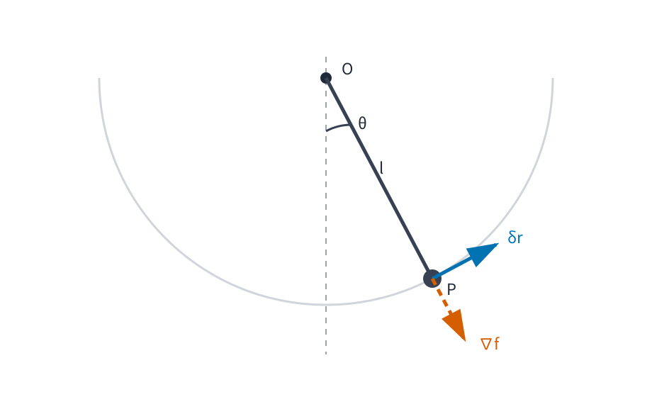

# AMECH1 拘束と一般化座標

古典力学 I では、質点の位置を直交座標で表し、Newton の第2法則

$$
m\ddot r=F
$$

から運動を求めてきました。障害物も拘束もない質点なら、この方法はそのまま使えます。

しかし、振り子の質点は平面上のどこへでも動けるわけではありません。長さ $\ell$ の糸で支点につながれていれば、位置 $(x,y)$ は常に

$$
x^2+y^2=\ell^2
$$

を満たします。二つの座標 $(x,y)$ を書いていても、実際に自由に選べる量は一つだけです。

ここで解析力学の最初の発想が現れます。

> **運動方程式を書く前に、そもそも系がどの配置を取り得るかを記述する。**

本章では、拘束条件から許される配置と自由度を取り出し、その配置を必要最小限の変数で表す方法を作ります。さらに、その変数に沿った速度、時刻を固定した微小な配置変化、力の対応成分を順に導きます。次章では、この幾何を使って拘束力の寄与を整理し、Lagrange 方程式へ進みます。

---

## 1. 振り子を直交座標だけで書くと何が起こるか

鉛直下向きを $y$ 軸の正方向とし、支点を原点に取ります。質量 $m$ の質点が長さ $\ell$ の質量を無視できる糸につながれ、重力加速度の大きさを $g$ とします。

質点の位置を

$$
r=
\begin{pmatrix}
x\\
y
\end{pmatrix}
$$

とすると、糸の長さが一定なので

$$
x^2+y^2=\ell^2
$$

です。

糸の張力の大きさを $T$ とすると、張力は支点向き、すなわち $-r$ の向きです。Newton 方程式は

$$
m\ddot x
=
-\frac{T}{\ell}x,
$$

$$
m\ddot y
=
mg-\frac{T}{\ell}y
$$

となります。

未知量は $x(t),y(t),T(t)$ の三つで、これに拘束式

$$
x(t)^2+y(t)^2=\ell^2
$$

を合わせて解かなければなりません。

もちろんこれは解けます。しかし、質点が動けるのは円周上だけです。そこで最初から

$$
x=\ell\sin\theta,
\qquad
y=\ell\cos\theta
$$

と置けば、拘束式は自動的に満たされ、配置は角度 $\theta$ 一つで指定できます。

この「許される配置だけを座標化する」という見方が、本章の中心です。

---

## 2. ホロノミック拘束と配置空間

$N$ 個の質点を考え、それぞれの位置を

$$
r_i\in\mathbb R^3,
\qquad
i=1,\ldots,N
$$

とします。全配置は $3N$ 個の実数で表せます。

拘束があるとき、全ての $3N$ 成分を独立には選べません。位置と時刻に関する等式で拘束を書ける場合をまず扱います。

<!-- formal-statement-start -->
> **定義（ホロノミック拘束）**  
> $N$ 個の質点の位置を $r_1,\ldots,r_N$ とする。拘束条件が、ある関数 $f_a$ を用いて

$$
f_a(r_1,\ldots,r_N,t)=0,
\qquad
a=1,\ldots,k
$$

> と表されるとき、この拘束をホロノミック拘束という。拘束式が時刻 $t$ に陽に依存しない場合を時間非依存（scleronomous）、陽に依存する場合を時間依存（rheonomous）という。
<!-- formal-statement-end -->

本章では、$f_a$ は位置変数について必要なだけ滑らかであり、各 $f_a$ の位置変数に関する偏微分を行に並べた $k\times 3N$ 行列が、考えている配置で階数 $k$ を持つ場合を主に扱います。この正則性があると、[RA6A の正則レベル集合の局所グラフ表示](../RA6A/index.md#cor-ra6a-regular-level-set)により、拘束を満たす集合は局所的に $3N-k$ 個の変数で表せます。

<!-- formal-statement-start -->
> **定義（配置空間・自由度）**  
> 時刻 $t$ を固定する。ホロノミック拘束

$$
f_a(r_1,\ldots,r_N,t)=0,
\qquad
a=1,\ldots,k
$$

> を満たす配置 $(r_1,\ldots,r_N)$ 全体の集合を、その時刻における配置空間とする。考えている点で $k$ 本の拘束が独立で正則なら、配置空間を局所的に指定するために必要な独立パラメータの個数は

$$
n=3N-k
$$

> であり、この $n$ を自由度という。
<!-- formal-statement-end -->

### 2.1 例：平面振り子

平面内の一質点なら、拘束がなければ位置は $(x,y)$ の二変数です。振り子では

$$
f(x,y)=x^2+y^2-\ell^2=0
$$

という独立な拘束が一つあります。

したがって

$$
n=2-1=1.
$$

実際、円周上の位置は局所的には角度 $\theta$ 一つで表せます。

### 2.2 例：球面上の一質点

三次元空間で

$$
x^2+y^2+z^2=R^2
$$

を満たす質点を考えます。拘束が一つなので自由度は

$$
n=3-1=2.
$$

球面上の位置を指定するには二つの独立なパラメータが必要です。

---

## 3. 一般化座標

自由度が $n$ なら、配置空間上の許される位置を $n$ 個の変数で直接表したくなります。

<!-- formal-statement-start -->
> **定義（一般化座標）**  
> 自由度 $n$ の拘束系を考える。パラメータ範囲 $U\subset\mathbb R^n$ の変数

$$
q=(q_1,\ldots,q_n)
$$

> を用い、各粒子の位置を

$$
r_i=r_i(q,t),
\qquad
i=1,\ldots,N
$$

> と表す。この表示が拘束条件を満たし、考えている範囲で $q$ に関する微分の階数が $n$ で、配置を局所的に一意に指定するとき、$q_1,\ldots,q_n$ を一般化座標という。
<!-- formal-statement-end -->

「座標」という名前ですが、$q_j$ は長さである必要はありません。角度でもよく、複数粒子の相対位置でもかまいません。

### 3.1 振り子では角度が一般化座標になる

鉛直下向きからの角度を $\theta$ として

$$
r(\theta)
=
\begin{pmatrix}
\ell\sin\theta\\
\ell\cos\theta
\end{pmatrix}
$$

と置けば、

$$
|r(\theta)|^2
=
\ell^2\sin^2\theta+\ell^2\cos^2\theta
=
\ell^2
$$

なので拘束を自動的に満たします。

$\theta$ と $\theta+2\pi$ は同じ配置を表すため、$\theta\in\mathbb R$ 全体を一つの一対一座標とみなすことはできません。しかし、たとえば

$$
-\pi<\theta<\pi
$$

のような範囲では、端点の同一視を避ければ局所座標として使えます。

一般化座標は、必ずしも配置空間全体を一枚で覆う必要はありません。

### 3.2 球面では座標が極で退化する

球面上の位置を

$$
r(\theta,\phi)
=
R
\begin{pmatrix}
\sin\theta\cos\phi\\
\sin\theta\sin\phi\\
\cos\theta
\end{pmatrix}
$$

とします。

偏微分は

$$
\frac{\partial r}{\partial\theta}
=
R
\begin{pmatrix}
\cos\theta\cos\phi\\
\cos\theta\sin\phi\\
-\sin\theta
\end{pmatrix},
$$

$$
\frac{\partial r}{\partial\phi}
=
R
\begin{pmatrix}
-\sin\theta\sin\phi\\
\sin\theta\cos\phi\\
0
\end{pmatrix}.
$$

$0<\theta<\pi$ では二本は独立です。しかし極 $\theta=0,\pi$ では

$$
\frac{\partial r}{\partial\phi}=0
$$

となります。

これは極で物理的な自由度が突然一つに減ったという意味ではありません。選んだ球面座標がそこで退化しただけです。配置空間そのものと、配置空間に置いた座標を区別する必要があります。

---

## 4. 一般化座標から速度を作る

一般化座標は時間とともに変化します。実際の運動では

$$
q=q(t)
$$

です。

さらに 時間依存（rheonomous）な拘束では、同じ $q$ を固定しても、拘束そのものが動くため $r_i(q,t)$ が時刻に陽に依存することがあります。

<!-- formal-statement-start -->
> **命題（一般化座標による速度公式）**  
> 各粒子の位置が、一般化座標 $q=(q_1,\ldots,q_n)$ と時刻 $t$ の滑らかな関数

$$
r_i=r_i(q,t)
$$

> で表され、実際の運動が $q=q(t)$ で与えられるとする。このとき第 $i$ 粒子の速度は

$$
v_i
=
\sum_{j=1}^n
\frac{\partial r_i}{\partial q_j}\dot q_j
+
\frac{\partial r_i}{\partial t}
$$

> である。
<!-- formal-statement-end -->

### 証明の見取り図

$r_i$ は $q_1(t),\ldots,q_n(t),t$ の合成関数です。多変数の連鎖律を、その各成分へ適用します。

<!-- proof-start -->
### 証明

実際の軌道に沿って

$$
r_i(t)
=
r_i(q_1(t),\ldots,q_n(t),t)
$$

です。

各成分に連鎖律を適用すると

$$
\frac{dr_i}{dt}
=
\sum_{j=1}^n
\frac{\partial r_i}{\partial q_j}
\frac{dq_j}{dt}
+
\frac{\partial r_i}{\partial t}.
$$

$\dot q_j=dq_j/dt$、$v_i=dr_i/dt$ なので

$$
v_i
=
\sum_{j=1}^n
\frac{\partial r_i}{\partial q_j}\dot q_j
+
\frac{\partial r_i}{\partial t}.
$$

これで示されました。

<!-- proof-end -->

時間非依存（scleronomous）な拘束で $r_i$ が $t$ に陽に依存しなければ、

$$
\frac{\partial r_i}{\partial t}=0
$$

なので

$$
v_i
=
\sum_{j=1}^n
\frac{\partial r_i}{\partial q_j}\dot q_j
$$

です。

### 4.1 振り子の速度

$$
r(\theta)
=
\begin{pmatrix}
\ell\sin\theta\\
\ell\cos\theta
\end{pmatrix}
$$

より

$$
\frac{\partial r}{\partial\theta}
=
\begin{pmatrix}
\ell\cos\theta\\
-\ell\sin\theta
\end{pmatrix}.
$$

したがって

$$
v
=
\frac{\partial r}{\partial\theta}\dot\theta
=
\begin{pmatrix}
\ell\cos\theta\,\dot\theta\\
-\ell\sin\theta\,\dot\theta
\end{pmatrix}.
$$

速度の大きさは

$$
|v|
=
\ell|\dot\theta|
$$

です。

---

## 5. 仮想変位：時間を進めずに「許される方向」だけを見る

実際の微小時間 $dt$ の間の変位は速度と結びついています。一方、拘束の幾何だけを調べたいときには、時刻を固定したまま、許される別の配置へ少し動かすことを考えます。

この操作では時間を進めません。

<!-- formal-statement-start -->
> **定義（仮想変位）**  
> 時刻 $t$ を固定し、一般化座標を

$$
q\longmapsto q+\varepsilon\,\delta q
$$

> と変化させる。各粒子について

$$
\delta r_i
=
\left.
\frac{d}{d\varepsilon}
r_i(q+\varepsilon\,\delta q,t)
\right|_{\varepsilon=0}
$$

> を仮想変位という。連鎖律により

$$
\delta r_i
=
\sum_{j=1}^n
\frac{\partial r_i}{\partial q_j}\delta q_j
$$

> である。
<!-- formal-statement-end -->

重要なのは

$$
\delta t=0
$$

だという点です。

したがって、実際の時間発展

$$
dr_i
=
\left(
\sum_j
\frac{\partial r_i}{\partial q_j}\dot q_j
+
\frac{\partial r_i}{\partial t}
\right)dt
$$

と、仮想変位

$$
\delta r_i
=
\sum_j
\frac{\partial r_i}{\partial q_j}\delta q_j
$$

は、時間依存（rheonomous）な拘束では明確に異なります。

### 5.1 時間とともに半径が変わる円

半径 $R(t)>0$ の円周上を動く質点を

$$
r(\theta,t)
=
R(t)
\begin{pmatrix}
\cos\theta\\
\sin\theta
\end{pmatrix}
$$

とします。

実際の速度は

$$
v
=
\dot R
\begin{pmatrix}
\cos\theta\\
\sin\theta
\end{pmatrix}
+
R\dot\theta
\begin{pmatrix}
-\sin\theta\\
\cos\theta
\end{pmatrix}.
$$

第1項は円そのものが膨張・収縮する半径方向、第2項は円周に沿う接線方向です。

一方、時刻を固定した仮想変位は

$$
\delta r
=
R
\begin{pmatrix}
-\sin\theta\\
\cos\theta
\end{pmatrix}
\delta\theta.
$$

仮想変位には $\dot R$ に対応する半径方向成分がありません。時刻を固定しているからです。

---

## 6. 仮想変位は拘束面の接方向を向く

ホロノミック拘束の式そのものから、仮想変位がどの方向を向くかを確認できます。

<!-- formal-statement-start -->
> **命題（ホロノミック拘束と仮想変位の接方向性）**  
> $N$ 個の質点にホロノミック拘束

$$
f_a(r_1,\ldots,r_N,t)=0,
\qquad
a=1,\ldots,k
$$

> があり、一般化座標表示 $r_i=r_i(q,t)$ がこの拘束を満たすとする。時刻 $t$ を固定した任意の仮想変位について

$$
\sum_{i=1}^N
\nabla_{r_i}f_a\cdot\delta r_i
=
0,
\qquad
a=1,\ldots,k
$$

> が成り立つ。
<!-- formal-statement-end -->

### 証明の見取り図

拘束式へ $r_i(q,t)$ を代入すると、左辺は $q$ をどう変えても常に $0$ です。そこで $q_j$ で偏微分します。

<!-- proof-start -->
### 証明

一般化座標表示が拘束を満たすので

$$
f_a(r_1(q,t),\ldots,r_N(q,t),t)=0
$$

です。

時刻 $t$ を固定して $q_j$ で偏微分すると、連鎖律により

$$
\sum_{i=1}^N
\nabla_{r_i}f_a
\cdot
\frac{\partial r_i}{\partial q_j}
=
0.
$$

これを $\delta q_j$ 倍して $j=1,\ldots,n$ について足すと

$$
\sum_{j=1}^n
\sum_{i=1}^N
\nabla_{r_i}f_a
\cdot
\frac{\partial r_i}{\partial q_j}
\delta q_j
=
0.
$$

和の順序を入れ替え、

$$
\delta r_i
=
\sum_{j=1}^n
\frac{\partial r_i}{\partial q_j}\delta q_j
$$

を使えば

$$
\sum_{i=1}^N
\nabla_{r_i}f_a\cdot\delta r_i
=
0
$$

となります。

<!-- proof-end -->

一質点で一つの拘束 $f(r,t)=0$ なら、

$$
\nabla_r f\cdot\delta r=0
$$

です。

したがって $\nabla_r f$ が拘束面の法線方向を与えるとき、仮想変位はその法線と直交し、拘束面の接方向を向きます。

振り子では、円の半径方向が拘束の法線方向、円周の接線方向が許される仮想変位の方向です。

図では、質点 $P$ の半径方向は拘束の法線方向、$\delta r$ は円周の接線方向です。両者の直交が、拘束式を微分した式と一致しています。

---

## 7. 一般化力：力を一般化座標の方向へ射影する

[MECH3](../MECH3/index.md) では、微小変位に対する仕事を力と変位の内積で表しました。仮想変位に対しても同じ代数操作を行います。

各粒子に働く力を $F_i$ とし、仮想仕事を

$$
\delta W
=
\sum_{i=1}^N
F_i\cdot\delta r_i
$$

とします。

仮想変位を一般化座標で展開すると、各 $\delta q_j$ の係数が自然に現れます。

<!-- formal-statement-start -->
> **定義（一般化力）**  
> 各粒子の位置が $r_i=r_i(q,t)$ で表され、各粒子に力 $F_i$ が働くとする。一般化座標 $q_j$ に対応する一般化力を

$$
Q_j
=
\sum_{i=1}^N
F_i\cdot
\frac{\partial r_i}{\partial q_j}
$$

> と定義する。
<!-- formal-statement-end -->

一般化力 $Q_j$ の単位は、必ずしも通常の力と同じではありません。

たとえば $q_j$ が長さなら $\partial r_i/\partial q_j$ は無次元なので $Q_j$ は力の次元を持ちます。一方、$q_j$ が角度なら角度を無次元とみなして $\partial r_i/\partial q_j$ は長さの次元を持つため、$Q_j$ は

$$
\text{力}\times\text{長さ}
$$

すなわちトルクと同じ次元を持ちます。

<!-- formal-statement-start -->
> **命題（一般化力と仮想仕事）**  
> 一般化力 $Q_j$ を

$$
Q_j
=
\sum_{i=1}^N
F_i\cdot
\frac{\partial r_i}{\partial q_j}
$$

> と定めると、任意の仮想変位に対する仮想仕事は

$$
\delta W
=
\sum_{j=1}^n
Q_j\,\delta q_j
$$

> と表される。
<!-- formal-statement-end -->

### 証明の見取り図

$\delta r_i$ を $\delta q_j$ の線形結合で書き、有限和の順序を入れ替えるだけです。

<!-- proof-start -->
### 証明

仮想変位の定義から

$$
\delta r_i
=
\sum_{j=1}^n
\frac{\partial r_i}{\partial q_j}\delta q_j.
$$

したがって

$$
\begin{aligned}
\delta W
&=
\sum_{i=1}^N
F_i\cdot\delta r_i\\
&=
\sum_{i=1}^N
F_i\cdot
\left(
\sum_{j=1}^n
\frac{\partial r_i}{\partial q_j}\delta q_j
\right)\\
&=
\sum_{j=1}^n
\left(
\sum_{i=1}^N
F_i\cdot
\frac{\partial r_i}{\partial q_j}
\right)
\delta q_j\\
&=
\sum_{j=1}^n
Q_j\,\delta q_j.
\end{aligned}
$$

<!-- proof-end -->

### 7.1 振り子に対する重力の一般化力

平面振り子で

$$
r(\theta)
=
\begin{pmatrix}
\ell\sin\theta\\
\ell\cos\theta
\end{pmatrix},
\qquad
\frac{\partial r}{\partial\theta}
=
\begin{pmatrix}
\ell\cos\theta\\
-\ell\sin\theta
\end{pmatrix}
$$

でした。

重力は、鉛直下向きを $y$ 軸正方向に取っているので

$$
F_g
=
\begin{pmatrix}
0\\
mg
\end{pmatrix}.
$$

したがって

$$
\begin{aligned}
Q_\theta^{(g)}
&=
F_g\cdot
\frac{\partial r}{\partial\theta}\\
&=
\begin{pmatrix}
0\\
mg
\end{pmatrix}
\cdot
\begin{pmatrix}
\ell\cos\theta\\
-\ell\sin\theta
\end{pmatrix}\\
&=
-mg\ell\sin\theta.
\end{aligned}
$$

よって

$$
\boxed{
Q_\theta^{(g)}
=
-mg\ell\sin\theta
}.
$$

張力は半径方向なので

$$
F_T
=
-T
\begin{pmatrix}
\sin\theta\\
\cos\theta
\end{pmatrix}.
$$

これと接線方向 $\partial r/\partial\theta$ の内積を取ると

$$
\begin{aligned}
F_T\cdot
\frac{\partial r}{\partial\theta}
&=
-T
\begin{pmatrix}
\sin\theta\\
\cos\theta
\end{pmatrix}
\cdot
\begin{pmatrix}
\ell\cos\theta\\
-\ell\sin\theta
\end{pmatrix}\\
&=
-T\ell
\left(
\sin\theta\cos\theta
-
\cos\theta\sin\theta
\right)\\
&=
0.
\end{aligned}
$$

つまり、この理想化では張力は $\theta$ 方向の一般化力を持ちません。

ただし、ここで「だから拘束力はいつでも運動方程式から消せる」と一般化してはいけません。どの拘束力が仮想仕事をしないか、その条件を次章で整理します。

---

## 8. 極座標では基底そのものが動く

一般化座標は、拘束によって自由度を減らすためだけに使うものではありません。拘束のない平面運動でも、問題に合った曲線座標を選ぶと便利です。

平面上で

$$
r
=
\rho e_\rho,
$$

$$
e_\rho
=
\begin{pmatrix}
\cos\theta\\
\sin\theta
\end{pmatrix},
\qquad
e_\theta
=
\begin{pmatrix}
-\sin\theta\\
\cos\theta
\end{pmatrix}
$$

とします。

$\rho,\theta$ を時間の関数とすると、基底も $\theta(t)$ を通して時間変化します。

まず

$$
\frac{de_\rho}{dt}
=
\dot\theta
\begin{pmatrix}
-\sin\theta\\
\cos\theta
\end{pmatrix}
=
\dot\theta e_\theta,
$$

$$
\frac{de_\theta}{dt}
=
\dot\theta
\begin{pmatrix}
-\cos\theta\\
-\sin\theta
\end{pmatrix}
=
-\dot\theta e_\rho.
$$

この二式を使えば、速度・加速度を途中式を飛ばさず導けます。

<!-- formal-statement-start -->
> **命題（平面極座標の速度・加速度）**  
> 平面内の質点の位置を

$$
r(t)=\rho(t)e_\rho(t)
$$

> とし、

$$
e_\rho
=
\begin{pmatrix}
\cos\theta\\
\sin\theta
\end{pmatrix},
\qquad
e_\theta
=
\begin{pmatrix}
-\sin\theta\\
\cos\theta
\end{pmatrix}
$$

> とする。このとき速度と加速度は

$$
v
=
\dot\rho\,e_\rho
+
\rho\dot\theta\,e_\theta,
$$

$$
a
=
\left(
\ddot\rho-\rho\dot\theta^2
\right)e_\rho
+
\left(
\rho\ddot\theta+2\dot\rho\dot\theta
\right)e_\theta
$$

> である。
<!-- formal-statement-end -->

### 証明の見取り図

$r=\rho e_\rho$ を微分するとき、$\rho$ だけでなく $e_\rho$ も時間依存することを忘れないことが核心です。加速度では二つの積をそれぞれ微分します。

<!-- proof-start -->
### 証明

位置

$$
r=\rho e_\rho
$$

を微分すると

$$
\begin{aligned}
v
&=
\dot\rho\,e_\rho
+
\rho\frac{de_\rho}{dt}\\
&=
\dot\rho\,e_\rho
+
\rho\dot\theta\,e_\theta.
\end{aligned}
$$

もう一度微分します。

$$
\begin{aligned}
a
&=
\frac{d}{dt}
\left(
\dot\rho\,e_\rho
\right)
+
\frac{d}{dt}
\left(
\rho\dot\theta\,e_\theta
\right)\\
&=
\ddot\rho\,e_\rho
+
\dot\rho\,\dot\theta e_\theta\\
&\quad
+
\left(
\dot\rho\dot\theta+\rho\ddot\theta
\right)e_\theta
+
\rho\dot\theta
\left(
-\dot\theta e_\rho
\right).
\end{aligned}
$$

$e_\rho$ 成分と $e_\theta$ 成分をまとめると

$$
a
=
\left(
\ddot\rho-\rho\dot\theta^2
\right)e_\rho
+
\left(
\rho\ddot\theta+2\dot\rho\dot\theta
\right)e_\theta.
$$

<!-- proof-end -->

力を

$$
F=F_\rho e_\rho+F_\theta e_\theta
$$

と分解すれば、Newton 方程式 $ma=F$ は

$$
m
\left(
\ddot\rho-\rho\dot\theta^2
\right)
=
F_\rho,
$$

$$
m
\left(
\rho\ddot\theta+2\dot\rho\dot\theta
\right)
=
F_\theta
$$

になります。

円拘束 $\rho=\ell$ なら

$$
\dot\rho=0,
\qquad
\ddot\rho=0
$$

なので

$$
-m\ell\dot\theta^2=F_\rho,
$$

$$
m\ell\ddot\theta=F_\theta.
$$

接線方向だけ見れば運動は $\theta$ 一つで記述できます。しかし Newton 形式では、半径方向には拘束力を含む $F_\rho$ が残ります。

ここに次章への入口があります。一般化座標は「許される運動の方向」をきれいに表しました。次に欲しいのは、その許される方向だけを使って、拘束力を明示的に解かず運動方程式を作る原理です。

---

## 9. 一般化座標は単なる記号の置き換えではない

本章で起きたことを整理します。

直交座標から極座標へ移るだけなら、平面の自由度は

$$
2\longrightarrow2
$$

で変わりません。これは主として座標変換です。

一方、平面振り子では

$$
(x,y)
\quad\text{と}\quad
x^2+y^2=\ell^2
$$

という「二変数＋拘束」を、

$$
\theta
$$

という一つの一般化座標へ置き換えました。

この場合は

$$
2\longrightarrow1
$$

と、拘束に合わせて独立に動かす変数を減らしています。

解析力学で重要なのは、単に $x$ を $q$ と書き換えることではありません。

- 許される配置全体を先に捉える。
- その配置空間に合った座標を選ぶ。
- 許される微小な配置変化を仮想変位として取り出す。
- 力をその許される方向へ一般化力として射影する。

この準備ができると、次章で拘束力の仮想仕事を整理して Lagrange 方程式へ進めます。

---

# 演習

## Level A

### A1. 拘束の個数と自由度を数える

各場合について、拘束式を書き、正則な点での自由度を求めよ。

1. 三次元空間で平面 $z=0$ 上だけを動く一質点。
2. 半径 $R>0$ の球面上だけを動く一質点。
3. 半径 $R$ の球面と平面 $z=0$ の交線上だけを動く一質点。
4. 平面内で長さ $\ell$ の糸につながれた一質点。

- Level: A

<!-- solution-start -->
#### 詳細解答

1. 一質点の三次元位置は $(x,y,z)$ の3変数です。拘束は

$$
f(x,y,z)=z=0
$$

の1本です。

偏微分を並べた行ベクトルは

$$
(0,0,1)
$$

で常に非零なので、対応する行列の階数は $1$ です。したがって拘束は正則で、

$$
n=3-1=2.
$$

2. 拘束は

$$
f(x,y,z)
=
x^2+y^2+z^2-R^2
=
0.
$$

球面上では、偏微分を並べた行ベクトルは

$$
(2x,2y,2z)
$$

です。$R>0$ より原点にはいないためこの行ベクトルは非零で、対応する行列の階数は $1$ です。したがって

$$
n=3-1=2.
$$

3. 拘束は

$$
f_1=x^2+y^2+z^2-R^2=0,
$$

$$
f_2=z=0
$$

です。

交線上では $x^2+y^2=R^2$ なので $(x,y)\ne(0,0)$ です。

二つの拘束式について偏微分を行に並べると

$$
\begin{pmatrix}
2x & 2y & 0\\
0 & 0 & 1
\end{pmatrix}
$$

となります。交線上では $(x,y)\ne(0,0)$ なので、この二行は独立で行列の階数は $2$ です。したがって

$$
n=3-2=1.
$$

実際、交線は円であり角度一つで位置を指定できます。

4. 平面内なので拘束がなければ2変数です。支点を原点に取れば

$$
x^2+y^2-\ell^2=0
$$

という1本の拘束があります。

したがって

$$
n=2-1=1.
$$

<!-- solution-end -->

---

### A2. 振り子の一般化座標から速度と仮想変位を求める

平面振り子の位置を

$$
r(\theta)
=
\begin{pmatrix}
\ell\sin\theta\\
\ell\cos\theta
\end{pmatrix}
$$

とする。

1. $\partial r/\partial\theta$ を求めよ。
2. 実際の運動が $\theta=\theta(t)$ のとき速度を求めよ。
3. 仮想変位 $\delta r$ を求めよ。
4. $r\cdot\delta r=0$ を確認し、その意味を説明せよ。

- Level: A

<!-- solution-start -->
#### 詳細解答

偏微分すると

$$
\frac{\partial r}{\partial\theta}
=
\begin{pmatrix}
\ell\cos\theta\\
-\ell\sin\theta
\end{pmatrix}.
$$

実際の運動では連鎖律から

$$
v
=
\frac{\partial r}{\partial\theta}\dot\theta
=
\begin{pmatrix}
\ell\cos\theta\,\dot\theta\\
-\ell\sin\theta\,\dot\theta
\end{pmatrix}.
$$

時刻を固定した仮想変位は

$$
\delta r
=
\frac{\partial r}{\partial\theta}\delta\theta
=
\begin{pmatrix}
\ell\cos\theta\\
-\ell\sin\theta
\end{pmatrix}
\delta\theta.
$$

内積を計算すると

$$
\begin{aligned}
r\cdot\delta r
&=
\begin{pmatrix}
\ell\sin\theta\\
\ell\cos\theta
\end{pmatrix}
\cdot
\begin{pmatrix}
\ell\cos\theta\\
-\ell\sin\theta
\end{pmatrix}
\delta\theta\\
&=
\ell^2
\left(
\sin\theta\cos\theta
-
\cos\theta\sin\theta
\right)
\delta\theta\\
&=
0.
\end{aligned}
$$

$r$ は円の半径方向、$\delta r$ はそれに直交するので、仮想変位は円の接線方向です。したがって拘束 $|r|=\ell$ を壊さない許容方向になっています。

<!-- solution-end -->

---

### A3. 振り子に働く力の一般化力を求める

A2 と同じ振り子に、重力

$$
F_g=
\begin{pmatrix}
0\\
mg
\end{pmatrix}
$$

と、一定の水平力

$$
F_h=
\begin{pmatrix}
F_0\\
0
\end{pmatrix}
$$

が働くとする。鉛直下向きを $y$ 軸正方向とする。

1. 重力の一般化力 $Q_\theta^{(g)}$ を求めよ。
2. 水平力の一般化力 $Q_\theta^{(h)}$ を求めよ。
3. 合力の一般化力を求めよ。
4. $Q_\theta$ の物理次元を説明せよ。

- Level: A

<!-- solution-start -->
#### 詳細解答

A2 で

$$
\frac{\partial r}{\partial\theta}
=
\begin{pmatrix}
\ell\cos\theta\\
-\ell\sin\theta
\end{pmatrix}
$$

でした。

重力について

$$
\begin{aligned}
Q_\theta^{(g)}
&=
F_g\cdot
\frac{\partial r}{\partial\theta}\\
&=
\begin{pmatrix}
0\\
mg
\end{pmatrix}
\cdot
\begin{pmatrix}
\ell\cos\theta\\
-\ell\sin\theta
\end{pmatrix}\\
&=
-mg\ell\sin\theta.
\end{aligned}
$$

水平力について

$$
\begin{aligned}
Q_\theta^{(h)}
&=
F_h\cdot
\frac{\partial r}{\partial\theta}\\
&=
\begin{pmatrix}
F_0\\
0
\end{pmatrix}
\cdot
\begin{pmatrix}
\ell\cos\theta\\
-\ell\sin\theta
\end{pmatrix}\\
&=
F_0\ell\cos\theta.
\end{aligned}
$$

したがって合力の一般化力は

$$
\boxed{
Q_\theta
=
F_0\ell\cos\theta
-
mg\ell\sin\theta
}.
$$

角度 $\theta$ は無次元なので

$$
\frac{\partial r}{\partial\theta}
$$

は長さの次元を持ちます。したがって $Q_\theta$ は

$$
[\text{力}]\,[\text{長さ}]
$$

であり、トルクまたはエネルギーと同じ次元を持ちます。

<!-- solution-end -->

---

### A4. 膨張する円で実変位と仮想変位を区別する

質点の位置が

$$
r(\theta,t)
=
R(t)
\begin{pmatrix}
\cos\theta\\
\sin\theta
\end{pmatrix},
\qquad
R(t)>0
$$

で与えられる。

1. $\partial r/\partial\theta$ と $\partial r/\partial t$ を求めよ。
2. 実際の運動 $\theta=\theta(t)$ に沿う速度を求めよ。
3. 時刻を固定した仮想変位を求めよ。
4. $\dot R\ne0$ のとき、$v\,dt$ と $\delta r$ が同じ種類の変位ではない理由を説明せよ。

- Level: A

<!-- solution-start -->
#### 詳細解答

まず

$$
\frac{\partial r}{\partial\theta}
=
R
\begin{pmatrix}
-\sin\theta\\
\cos\theta
\end{pmatrix}.
$$

また、$\theta$ を固定して $t$ で偏微分すると

$$
\frac{\partial r}{\partial t}
=
\dot R
\begin{pmatrix}
\cos\theta\\
\sin\theta
\end{pmatrix}.
$$

[一般化座標による速度公式](#prop-amech1-generalized-velocity)から

$$
\begin{aligned}
v
&=
\frac{\partial r}{\partial\theta}\dot\theta
+
\frac{\partial r}{\partial t}\\
&=
R\dot\theta
\begin{pmatrix}
-\sin\theta\\
\cos\theta
\end{pmatrix}
+
\dot R
\begin{pmatrix}
\cos\theta\\
\sin\theta
\end{pmatrix}.
\end{aligned}
$$

仮想変位では時刻を固定するので

$$
\boxed{
\delta r
=
R
\begin{pmatrix}
-\sin\theta\\
\cos\theta
\end{pmatrix}
\delta\theta
}.
$$

$v\,dt$ には、円そのものの膨張・収縮による半径方向成分

$$
\dot R
\begin{pmatrix}
\cos\theta\\
\sin\theta
\end{pmatrix}dt
$$

があります。

しかし $\delta r$ は同じ時刻の円周上で許される配置を比較するため、接線方向成分しか持ちません。したがって 時間依存（rheonomous）な拘束では、実際の微小時間発展と仮想変位を同一視できません。

<!-- solution-end -->

---

## Level B

### B1. 球面座標が極で退化することを確認する

半径 $R$ の球面上の位置を

$$
r(\theta,\phi)
=
R
\begin{pmatrix}
\sin\theta\cos\phi\\
\sin\theta\sin\phi\\
\cos\theta
\end{pmatrix}
$$

とする。

1. $\partial r/\partial\theta$ と $\partial r/\partial\phi$ を求めよ。
2. 両ベクトルが直交することを示せ。
3. それぞれの長さを求めよ。
4. $0<\theta<\pi$ では二本が独立であることを説明せよ。
5. $\theta=0,\pi$ で何が起こるかを説明し、物理的な自由度が減ったわけではないことを述べよ。

- Level: B

<!-- solution-start -->
#### 詳細解答

偏微分すると

$$
\frac{\partial r}{\partial\theta}
=
R
\begin{pmatrix}
\cos\theta\cos\phi\\
\cos\theta\sin\phi\\
-\sin\theta
\end{pmatrix},
$$

$$
\frac{\partial r}{\partial\phi}
=
R
\begin{pmatrix}
-\sin\theta\sin\phi\\
\sin\theta\cos\phi\\
0
\end{pmatrix}.
$$

内積は

$$
\begin{aligned}
\frac{\partial r}{\partial\theta}
\cdot
\frac{\partial r}{\partial\phi}
&=
R^2
\left[
-\cos\theta\sin\theta\cos\phi\sin\phi
+
\cos\theta\sin\theta\sin\phi\cos\phi
\right]\\
&=
0.
\end{aligned}
$$

したがって二本は直交します。

長さは

$$
\begin{aligned}
\left|
\frac{\partial r}{\partial\theta}
\right|^2
&=
R^2
\left(
\cos^2\theta\cos^2\phi
+
\cos^2\theta\sin^2\phi
+
\sin^2\theta
\right)\\
&=
R^2,
\end{aligned}
$$

なので

$$
\left|
\frac{\partial r}{\partial\theta}
\right|
=
R.
$$

また

$$
\begin{aligned}
\left|
\frac{\partial r}{\partial\phi}
\right|^2
&=
R^2\sin^2\theta
\left(
\sin^2\phi+\cos^2\phi
\right)\\
&=
R^2\sin^2\theta.
\end{aligned}
$$

従って

$$
\left|
\frac{\partial r}{\partial\phi}
\right|
=
R|\sin\theta|.
$$

$0<\theta<\pi$ では $\sin\theta>0$ なので二本とも非零です。さらに直交しているため一次独立です。

一方、$\theta=0,\pi$ では

$$
\frac{\partial r}{\partial\phi}=0.
$$

極では $\phi$ を変えても位置が変わらないためです。

これは球面の自由度が極だけ1に減るという意味ではありません。球面自体はどの点でも局所的に二次元です。退化しているのは $(\theta,\phi)$ という座標表示であり、極の近くでは別の局所座標を使えばよいのです。

<!-- solution-end -->

---

### B2. 極座標の加速度を基底の微分から導く

平面極座標で

$$
r=\rho e_\rho,
$$

$$
e_\rho=
\begin{pmatrix}
\cos\theta\\
\sin\theta
\end{pmatrix},
\qquad
e_\theta=
\begin{pmatrix}
-\sin\theta\\
\cos\theta
\end{pmatrix}
$$

とする。

1. $de_\rho/dt$ と $de_\theta/dt$ を求めよ。
2. 速度を導け。
3. 加速度を導け。
4. 円運動 $\rho=R$ の場合へ特殊化せよ。
5. さらに $\dot\theta=\omega$ が一定なら、加速度が中心向きで大きさ $R\omega^2$ になることを確認せよ。

- Level: B

<!-- solution-start -->
#### 詳細解答

まず

$$
\frac{de_\rho}{d\theta}
=
e_\theta
$$

なので、連鎖律から

$$
\boxed{
\frac{de_\rho}{dt}
=
\dot\theta e_\theta
}.
$$

同様に

$$
\frac{de_\theta}{d\theta}
=
-e_\rho
$$

より

$$
\boxed{
\frac{de_\theta}{dt}
=
-\dot\theta e_\rho
}.
$$

位置 $r=\rho e_\rho$ を微分すると

$$
\begin{aligned}
v
&=
\dot\rho e_\rho
+
\rho\frac{de_\rho}{dt}\\
&=
\boxed{
\dot\rho e_\rho
+
\rho\dot\theta e_\theta
}.
\end{aligned}
$$

さらに

$$
v
=
\dot\rho e_\rho
+
\rho\dot\theta e_\theta
$$

を微分します。

第1項は

$$
\frac{d}{dt}
\left(
\dot\rho e_\rho
\right)
=
\ddot\rho e_\rho
+
\dot\rho\dot\theta e_\theta.
$$

第2項は

$$
\begin{aligned}
\frac{d}{dt}
\left(
\rho\dot\theta e_\theta
\right)
&=
\left(
\dot\rho\dot\theta
+
\rho\ddot\theta
\right)e_\theta
+
\rho\dot\theta
\frac{de_\theta}{dt}\\
&=
\left(
\dot\rho\dot\theta
+
\rho\ddot\theta
\right)e_\theta
-
\rho\dot\theta^2e_\rho.
\end{aligned}
$$

したがって

$$
\boxed{
a
=
\left(
\ddot\rho-\rho\dot\theta^2
\right)e_\rho
+
\left(
\rho\ddot\theta+2\dot\rho\dot\theta
\right)e_\theta
}.
$$

円運動 $\rho=R$ なら

$$
\dot\rho=0,
\qquad
\ddot\rho=0
$$

なので

$$
a
=
-R\dot\theta^2e_\rho
+
R\ddot\theta e_\theta.
$$

さらに $\dot\theta=\omega$ が一定なら $\ddot\theta=0$ です。従って

$$
\boxed{
a=-R\omega^2e_\rho
}.
$$

$e_\rho$ は中心から外向きなので、$-e_\rho$ は中心向きです。また

$$
|a|=R\omega^2.
$$

<!-- solution-end -->

---

### B3. 放物線拘束で一般化力を求める

鉛直上向きを $y$ 軸正方向とする平面内で、質点が

$$
y=ax^2,
\qquad
a>0
$$

という滑らかな曲線上だけを動く。

一般化座標として

$$
q=x
$$

を選ぶ。質点には一定水平力 $(F_0,0)$ と重力 $(0,-mg)$ が働く。

1. 位置 $r(q)$ を書け。
2. 仮想変位 $\delta r$ を求めよ。
3. 合力の一般化力 $Q_q$ を求めよ。
4. 曲線の接線ベクトルと直交する法線ベクトルを一つ作れ。
5. 摩擦のない拘束反力がその法線方向にあるとき、その一般化力が $0$ であることを示せ。

- Level: B

<!-- solution-start -->
#### 詳細解答

$q=x$ なので

$$
r(q)
=
\begin{pmatrix}
q\\
aq^2
\end{pmatrix}.
$$

従って

$$
\frac{\partial r}{\partial q}
=
\begin{pmatrix}
1\\
2aq
\end{pmatrix}.
$$

仮想変位は

$$
\boxed{
\delta r
=
\begin{pmatrix}
1\\
2aq
\end{pmatrix}
\delta q
}.
$$

水平力と重力の合力は

$$
F
=
\begin{pmatrix}
F_0\\
-mg
\end{pmatrix}.
$$

したがって

$$
\begin{aligned}
Q_q
&=
F\cdot
\frac{\partial r}{\partial q}\\
&=
\begin{pmatrix}
F_0\\
-mg
\end{pmatrix}
\cdot
\begin{pmatrix}
1\\
2aq
\end{pmatrix}\\
&=
\boxed{
F_0-2amgq
}.
\end{aligned}
$$

接線ベクトルは

$$
\tau
=
\begin{pmatrix}
1\\
2aq
\end{pmatrix}.
$$

これに直交するベクトルとして

$$
n
=
\begin{pmatrix}
-2aq\\
1
\end{pmatrix}
$$

を取れます。実際、

$$
n\cdot\tau
=
-2aq+2aq
=
0.
$$

拘束反力が

$$
F_c=\lambda n
$$

と書けるなら、その一般化力は

$$
\begin{aligned}
Q_q^{(c)}
&=
F_c\cdot
\frac{\partial r}{\partial q}\\
&=
\lambda n\cdot\tau\\
&=
0.
\end{aligned}
$$

したがって摩擦のない法線反力は、許される接線方向 $q$ には一般化力を持ちません。

<!-- solution-end -->

---

## Level C

### C1. 回転する円形フープで時間依存拘束を読む

半径 $R$ の円形フープが、鉛直な $z$ 軸のまわりを一定角速度 $\Omega$ で回転している。質点は摩擦なくフープ上を動く。

時刻 $t$ におけるフープの水平半径方向を

$$
e_h(t)
=
\begin{pmatrix}
\cos\Omega t\\
\sin\Omega t\\
0
\end{pmatrix}
$$

とし、角度 $\theta$ を鉛直下向きから測る。質点の位置を

$$
r(\theta,t)
=
R\sin\theta\,e_h(t)
-
R\cos\theta
\begin{pmatrix}
0\\
0\\
1
\end{pmatrix}
$$

とする。

1. $|r|=R$ を確認せよ。
2. $\partial r/\partial\theta$ と $\partial r/\partial t$ を求めよ。
3. 実際の運動 $\theta=\theta(t)$ に沿う速度を求めよ。
4. 速さの二乗が
   $$
   |v|^2
   =
   R^2\dot\theta^2
   +
   R^2\Omega^2\sin^2\theta
   $$
   となることを示せ。
5. 仮想変位を求め、$\partial r/\partial t$ の項が含まれない理由を説明せよ。
6. 重力
   $$
   F_g=
   \begin{pmatrix}
   0\\
   0\\
   -mg
   \end{pmatrix}
   $$
   の一般化力 $Q_\theta^{(g)}$ を求めよ。
7. 摩擦のないフープからの反力がフープの接線 $\partial r/\partial\theta$ に直交するとする。この反力の一般化力が $0$ であることを示せ。
8. それにもかかわらず、反力の実際の仕事率が必ず $0$ とは限らない理由を、速度公式を使って説明せよ。

- Level: C

<!-- solution-start -->
#### 詳細解答

まず $e_h$ は単位ベクトルで、鉛直単位ベクトル

$$
e_z=
\begin{pmatrix}
0\\
0\\
1
\end{pmatrix}
$$

と直交します。

したがって

$$
\begin{aligned}
|r|^2
&=
R^2\sin^2\theta\,|e_h|^2
+
R^2\cos^2\theta\,|e_z|^2\\
&=
R^2
\left(
\sin^2\theta+\cos^2\theta
\right)\\
&=
R^2.
\end{aligned}
$$

よって質点は常に半径 $R$ の球面上にあります。さらに $e_h(t)$ と $e_z$ が張る回転平面内にあるため、フープ上にあります。

次に

$$
\frac{\partial r}{\partial\theta}
=
R\cos\theta\,e_h
+
R\sin\theta\,e_z.
$$

また

$$
\frac{de_h}{dt}
=
\Omega
\begin{pmatrix}
-\sin\Omega t\\
\cos\Omega t\\
0
\end{pmatrix}.
$$

ここで

$$
e_\phi(t)
=
\begin{pmatrix}
-\sin\Omega t\\
\cos\Omega t\\
0
\end{pmatrix}
$$

と置けば

$$
\frac{de_h}{dt}
=
\Omega e_\phi.
$$

$\theta$ を固定した偏微分は

$$
\boxed{
\frac{\partial r}{\partial t}
=
R\Omega\sin\theta\,e_\phi
}.
$$

したがって一般化座標による速度公式から

$$
\begin{aligned}
v
&=
\frac{\partial r}{\partial\theta}\dot\theta
+
\frac{\partial r}{\partial t}\\
&=
R\dot\theta
\left(
\cos\theta\,e_h
+
\sin\theta\,e_z
\right)
+
R\Omega\sin\theta\,e_\phi.
\end{aligned}
$$

$e_h,e_\phi,e_z$ は互いに直交する単位ベクトルです。したがって二つの速度成分も直交し、

$$
\begin{aligned}
|v|^2
&=
R^2\dot\theta^2
\left(
\cos^2\theta+\sin^2\theta
\right)
+
R^2\Omega^2\sin^2\theta\\
&=
\boxed{
R^2\dot\theta^2
+
R^2\Omega^2\sin^2\theta
}.
\end{aligned}
$$

仮想変位では時刻を固定するので

$$
\boxed{
\delta r
=
\frac{\partial r}{\partial\theta}\delta\theta
=
R
\left(
\cos\theta\,e_h
+
\sin\theta\,e_z
\right)
\delta\theta
}.
$$

$\partial r/\partial t$ は「同じ $\theta$ の点がフープの回転によって移動する成分」です。仮想変位では $t$ を変えないため、この成分は入りません。

重力の一般化力は

$$
\begin{aligned}
Q_\theta^{(g)}
&=
F_g\cdot
\frac{\partial r}{\partial\theta}\\
&=
(-mg e_z)
\cdot
R
\left(
\cos\theta\,e_h
+
\sin\theta\,e_z
\right)\\
&=
\boxed{
-mgR\sin\theta
}.
\end{aligned}
$$

フープからの反力を $F_c$ とし、摩擦がないため

$$
F_c\cdot
\frac{\partial r}{\partial\theta}
=
0
$$

とします。

すると

$$
\boxed{
Q_\theta^{(c)}
=
F_c\cdot
\frac{\partial r}{\partial\theta}
=
0
}.
$$

しかし実際の速度は

$$
v
=
\frac{\partial r}{\partial\theta}\dot\theta
+
\frac{\partial r}{\partial t}
$$

です。

したがって反力の仕事率は

$$
\begin{aligned}
F_c\cdot v
&=
F_c\cdot
\frac{\partial r}{\partial\theta}\dot\theta
+
F_c\cdot
\frac{\partial r}{\partial t}\\
&=
F_c\cdot
\frac{\partial r}{\partial t}.
\end{aligned}
$$

第1項は仮想仕事がゼロなので消えますが、第2項は一般にはゼロとは限りません。

つまり、時間依存する拘束では

$$
\text{仮想仕事がゼロ}
$$

と

$$
\text{実際の仕事率がゼロ}
$$

は別の主張です。

回転するフープは外部の駆動装置によって動かされており、その運動を介して質点とエネルギーをやり取りし得ます。これが、時間依存（rheonomous）な拘束で実変位と仮想変位を区別する必要がある理由です。

<!-- solution-end -->

---

## まとめ

本章では、Newton 方程式へ入る前に「許される配置」を整理しました。

- ホロノミック拘束は位置と時刻の等式で表される。
- 独立な $k$ 本の正則拘束が $3N$ 次元の配置を制限すると、局所的な自由度は $3N-k$ になる。
- 一般化座標 $q_1,\ldots,q_n$ は、拘束を満たす配置を直接パラメータ化する。
- 速度は
  $$
  v_i
  =
  \sum_j
  \frac{\partial r_i}{\partial q_j}\dot q_j
  +
  \frac{\partial r_i}{\partial t}
  $$
  と表される。
- 仮想変位は時刻を固定して
  $$
  \delta r_i
  =
  \sum_j
  \frac{\partial r_i}{\partial q_j}\delta q_j
  $$
  と表され、ホロノミック拘束の接方向を向く。
- 一般化力
  $$
  Q_j
  =
  \sum_i
  F_i\cdot
  \frac{\partial r_i}{\partial q_j}
  $$
  を使えば、仮想仕事は
  $$
  \delta W
  =
  \sum_jQ_j\,\delta q_j
  $$
  となる。
- 極座標では方向ベクトル $e_\rho,e_\theta$ 自身が時間とともに変化するため、加速度には $\rho\dot\theta^2$ や $2\dot\rho\dot\theta$ の項が現れる。

一般化座標によって、拘束系の「動ける方向」は見えるようになりました。しかし Newton 方程式のままでは、拘束反力をどう扱うかという問題が残ります。

次章では、仮想変位に沿って拘束力の寄与を整理し、Lagrange 方程式を導きます。
