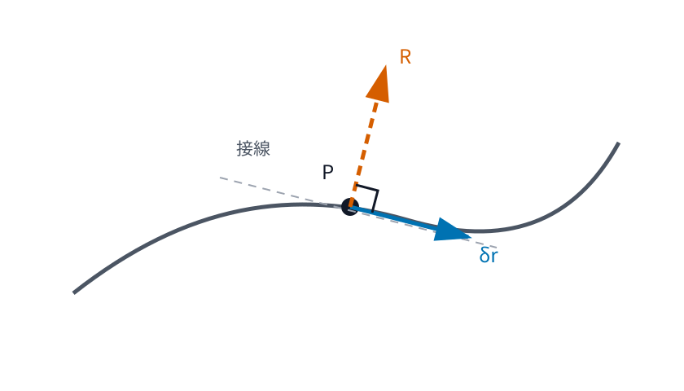

# AMECH2 d'Alembert 原理と Lagrange 方程式

AMECH1 では、拘束を満たす配置を一般化座標で表し、仮想変位と一般化力を導入しました。これで「どちらへ動けるか」は見えるようになりました。

しかし Newton 方程式をそのまま使うと、拘束面から受ける反力まで未知量として解かなければなりません。たとえば滑らかな曲線上を動く質点では、接線方向の運動だけを知りたいのに、法線方向の拘束反力も同時に求めることになります。

解析力学では、ここで見方を変えます。

> **拘束力そのものを求めるのではなく、許される仮想変位へ Newton 方程式を射影する。**

摩擦のない滑らかな拘束では、拘束反力は許される仮想変位に仕事をしません。この性質を使うと、拘束反力を明示的に解かずに、自由度の数だけの運動方程式を得られます。

本章では、この射影を一般化座標で書き直し、自由度の数だけの運動方程式を導きます。さらに保存力の場合に

$$
L=T-V
$$

という一つの関数で運動を記述できることを、振り子・中心力・連成振動子で確かめます。

---

## 1. Newton 方程式で拘束力まで解く必要はあるか

$N$ 個の質点からなる系を考えます。第 $i$ 粒子の質量を $m_i$、位置を $r_i$、加速度を $a_i=\ddot r_i$ とします。

力を二種類に分けます。

- 既知の外力・相互作用など、運動を記述したい力を $F_i$
- 拘束を保つために拘束物から受ける反力を $R_i$

と書きます。Newton の第2法則は

$$
m_i a_i=F_i+R_i
$$

です。

拘束がなければ、これで十分です。しかし拘束系では $R_i$ が未知です。しかも $R_i$ の主な役割は、質点を許されない方向へ出さないことです。

AMECH1 で導入した仮想変位

$$
\delta r_i
=
\sum_{j=1}^n
\frac{\partial r_i}{\partial q_j}\delta q_j
$$

は、時刻を固定したまま拘束を破らない微小変位でした。

そこで Newton 方程式を「許される方向」へだけ見ることを考えます。

---

## 2. 理想拘束

摩擦のない滑らかな面や曲線では、拘束反力は通常、拘束面の法線方向を向きます。一方、仮想変位は接方向です。この二つは直交します。

次の図は、この関係だけを取り出した模式図です。

<!-- formal-statement-start -->
> **定義（理想拘束）**  
> 第 $i$ 粒子に働く拘束反力を $R_i$ とする。時刻を固定した任意の許容仮想変位 $\delta r_i$ に対して
$$
\sum_{i=1}^N R_i\cdot\delta r_i=0
$$
> が成り立つとき、その拘束を理想拘束という。
<!-- formal-statement-end -->

この条件は「拘束反力が常に 0」という意味ではありません。拘束反力は大きくてもよく、許される仮想変位への成分だけが 0 です。

また、すべての拘束が理想拘束とは限りません。摩擦力を伴う接触や、速度に依存する複雑な拘束では、この条件をそのまま使えないことがあります。

<!-- definition-example-start: def-amech2-ideal-constraint -->
### 例：滑らかな曲線上の質点

**定義の確認**

平面内の滑らかな曲線を局所的に

$$
r=r(q)
$$

と表します。接線ベクトルは

$$
\tau=\frac{\partial r}{\partial q}
$$

です。

仮想変位は

$$
\delta r
=
\frac{\partial r}{\partial q}\delta q
=
\tau\,\delta q
$$

なので接線方向です。

摩擦がなく、拘束反力が法線方向の単位ベクトル $n$ に沿って

$$
R=\lambda n
$$

と書けるとします。法線と接線は直交するので

$$
n\cdot\tau=0.
$$

したがって

$$
R\cdot\delta r
=
\lambda n\cdot\tau\,\delta q
=
0.
$$

よってこの拘束は理想拘束の条件を満たします。
<!-- definition-example-end -->

ここで重要なのは、理想拘束が**力の大きさを消す条件ではなく、仮想仕事を消す条件**だということです。

---

## 3. ダランベールの原理

Newton 方程式

$$
m_i a_i=F_i+R_i
$$

を移項すると

$$
F_i-m_i a_i=-R_i
$$

です。

この式を仮想変位と内積し、粒子について足し合わせます。理想拘束の条件を使うと、拘束反力を含まない次の関係が得られます。

<!-- formal-statement-start -->
> **原理（ダランベールの原理）**  
> $N$ 個の質点からなる系が
$$
m_i a_i=F_i+R_i,
\qquad i=1,\ldots,N
$$
> に従い、拘束反力 $R_i$ が理想拘束条件
$$
\sum_{i=1}^N R_i\cdot\delta r_i=0
$$
> を満たすとする。このとき、任意の許容仮想変位に対して
$$
\boxed{
\sum_{i=1}^N
\left(
F_i-m_i a_i
\right)\cdot\delta r_i
=
0
}
$$
> が成り立つ。
<!-- formal-statement-end -->

本章では、この形を Newton 方程式と理想拘束条件から得られる結果として使います。

<!-- proof-start -->
### 証明

各粒子について

$$
m_i a_i=F_i+R_i
$$

なので

$$
F_i-m_i a_i=-R_i.
$$

両辺と $\delta r_i$ の内積を取ると

$$
\left(
F_i-m_i a_i
\right)\cdot\delta r_i
=
-R_i\cdot\delta r_i.
$$

$i=1,\ldots,N$ について加えると

$$
\sum_{i=1}^N
\left(
F_i-m_i a_i
\right)\cdot\delta r_i
=
-
\sum_{i=1}^N
R_i\cdot\delta r_i.
$$

理想拘束では右辺が 0 なので

$$
\sum_{i=1}^N
\left(
F_i-m_i a_i
\right)\cdot\delta r_i
=
0.
$$

これで示されました。
<!-- proof-end -->

$d'Alembert$ 原理の利点は、右辺に拘束反力が残らないことです。ただし消えた理由は、拘束反力を無視したからではなく、**許容仮想変位に対する仮想仕事が 0 だから**です。

---

## 4. 一般化座標へ射影する

一般化座標を

$$
q=(q_1,\ldots,q_n)
$$

とし、各粒子の位置を

$$
r_i=r_i(q,t)
$$

とします。

AMECH1 より、仮想変位は

$$
\delta r_i
=
\sum_{j=1}^n
\frac{\partial r_i}{\partial q_j}
\delta q_j
$$

です。

これを ダランベールの原理へ代入すると

$$
\sum_{i=1}^N
\left(
F_i-m_i a_i
\right)
\cdot
\left[
\sum_{j=1}^n
\frac{\partial r_i}{\partial q_j}
\delta q_j
\right]
=
0.
$$

有限和の順序を交換して

$$
\sum_{j=1}^n
\left[
\sum_{i=1}^N
F_i\cdot
\frac{\partial r_i}{\partial q_j}
-
\sum_{i=1}^N
m_i a_i\cdot
\frac{\partial r_i}{\partial q_j}
\right]
\delta q_j
=
0.
$$

AMECH1 の一般化力

$$
Q_j
=
\sum_{i=1}^N
F_i\cdot
\frac{\partial r_i}{\partial q_j}
$$

を使えば

$$
\sum_{j=1}^n
\left[
Q_j
-
\sum_{i=1}^N
m_i a_i\cdot
\frac{\partial r_i}{\partial q_j}
\right]
\delta q_j
=
0.
$$

一般化座標が局所座標として独立なら、時刻を固定した $\delta q_1,\ldots,\delta q_n$ は独立に選べます。したがって各係数が 0 です。

<!-- formal-statement-start -->
> **命題（一般化座標への射影式）**  
> 一般化座標 $q_1,\ldots,q_n$ が独立で、拘束が理想拘束であるとする。既知の力 $F_i$ に対応する一般化力を
$$
Q_j
=
\sum_{i=1}^N
F_i\cdot
\frac{\partial r_i}{\partial q_j}
$$
> と定める。このとき各 $j=1,\ldots,n$ について
$$
\boxed{
\sum_{i=1}^N
m_i a_i\cdot
\frac{\partial r_i}{\partial q_j}
=
Q_j
}
$$
> が成り立つ。
<!-- formal-statement-end -->

この時点で、拘束反力は式から消えています。しかし左辺にはまだ直交座標の加速度 $a_i$ が残っています。

次に、この左辺を一般化座標だけで書き直します。

---

## 5. 運動エネルギーの恒等式

全運動エネルギーを

$$
T
=
\frac12
\sum_{i=1}^N
m_i|v_i|^2
$$

とします。

AMECH1 の速度公式は

$$
v_i
=
\sum_{k=1}^n
\frac{\partial r_i}{\partial q_k}\dot q_k
+
\frac{\partial r_i}{\partial t}
$$

でした。

ここでは $q_j$ と $\dot q_j$ を独立な変数として偏微分します。

<!-- formal-statement-start -->
> **命題（運動エネルギー恒等式）**  
> 各粒子の位置が $r_i=r_i(q,t)$ で表され、必要な二階偏微分が連続であるとする。運動エネルギーを
$$
T(q,\dot q,t)
=
\frac12
\sum_{i=1}^N
m_i|v_i|^2
$$
> とする。このとき各 $j=1,\ldots,n$ について
$$
\boxed{
\frac{d}{dt}
\frac{\partial T}{\partial\dot q_j}
-
\frac{\partial T}{\partial q_j}
=
\sum_{i=1}^N
m_i a_i\cdot
\frac{\partial r_i}{\partial q_j}
}
$$
> が成り立つ。
<!-- formal-statement-end -->

この恒等式が、Newton の加速度を一般化座標だけの運動方程式へ変換する橋です。

<!-- proof-start -->
### 証明

まず

$$
T
=
\frac12
\sum_i m_i v_i\cdot v_i
$$

なので、$\dot q_j$ で偏微分すると

$$
\frac{\partial T}{\partial\dot q_j}
=
\sum_i
m_i
v_i\cdot
\frac{\partial v_i}{\partial\dot q_j}.
$$

速度公式

$$
v_i
=
\sum_k
\frac{\partial r_i}{\partial q_k}\dot q_k
+
\frac{\partial r_i}{\partial t}
$$

では、$\dot q_j$ に依存するのは第 $j$ 項だけです。したがって

$$
\frac{\partial v_i}{\partial\dot q_j}
=
\frac{\partial r_i}{\partial q_j}.
$$

よって

$$
\boxed{
\frac{\partial T}{\partial\dot q_j}
=
\sum_i
m_i
v_i\cdot
\frac{\partial r_i}{\partial q_j}
}.
$$

これを実際の運動 $q=q(t)$ に沿って時間微分します。積の微分から

$$
\begin{aligned}
\frac{d}{dt}
\frac{\partial T}{\partial\dot q_j}
&=
\sum_i
m_i
\frac{dv_i}{dt}\cdot
\frac{\partial r_i}{\partial q_j}
+
\sum_i
m_i
v_i\cdot
\frac{d}{dt}
\left(
\frac{\partial r_i}{\partial q_j}
\right)\\
&=
\sum_i
m_i a_i\cdot
\frac{\partial r_i}{\partial q_j}
+
\sum_i
m_i
v_i\cdot
\frac{d}{dt}
\left(
\frac{\partial r_i}{\partial q_j}
\right).
\end{aligned}
$$

一方、$T$ を $q_j$ で偏微分すると

$$
\frac{\partial T}{\partial q_j}
=
\sum_i
m_i
v_i\cdot
\frac{\partial v_i}{\partial q_j}.
$$

ここで

$$
v_i
=
\sum_k
\frac{\partial r_i}{\partial q_k}\dot q_k
+
\frac{\partial r_i}{\partial t}
$$

を $q_j$ で偏微分すると

$$
\frac{\partial v_i}{\partial q_j}
=
\sum_k
\frac{\partial^2 r_i}
{\partial q_j\partial q_k}
\dot q_k
+
\frac{\partial^2 r_i}
{\partial q_j\partial t}.
$$

また、$\partial r_i/\partial q_j$ を実際の軌道に沿って時間微分すると、連鎖律より

$$
\frac{d}{dt}
\left(
\frac{\partial r_i}{\partial q_j}
\right)
=
\sum_k
\frac{\partial^2 r_i}
{\partial q_k\partial q_j}
\dot q_k
+
\frac{\partial^2 r_i}
{\partial t\partial q_j}.
$$

二階偏微分の交換ができる仮定から

$$
\frac{\partial v_i}{\partial q_j}
=
\frac{d}{dt}
\left(
\frac{\partial r_i}{\partial q_j}
\right).
$$

したがって

$$
\frac{\partial T}{\partial q_j}
=
\sum_i
m_i
v_i\cdot
\frac{d}{dt}
\left(
\frac{\partial r_i}{\partial q_j}
\right).
$$

先ほどの式からこれを引くと、$v_i$ を含む項が相殺して

$$
\frac{d}{dt}
\frac{\partial T}{\partial\dot q_j}
-
\frac{\partial T}{\partial q_j}
=
\sum_i
m_i a_i\cdot
\frac{\partial r_i}{\partial q_j}.
$$

これで示されました。
<!-- proof-end -->

時間依存拘束 $r_i(q,t)$ でもこの恒等式は成り立ちます。$\partial r_i/\partial t$ を最初から落としてはいけませんが、上の計算ではその寄与も含めて相殺が起こっています。

---

## 6. Lagrange 方程式

一般化座標への射影式は

$$
\sum_i
m_i a_i\cdot
\frac{\partial r_i}{\partial q_j}
=
Q_j
$$

でした。

運動エネルギー恒等式を代入すると、すぐに一般化座標だけの式になります。

<!-- formal-statement-start -->
> **定理（Lagrange 方程式）**  
> $q_1,\ldots,q_n$ を独立な一般化座標とし、各粒子の位置が $r_i=r_i(q,t)$ で必要なだけ滑らかに表されるとする。拘束は理想拘束とし、拘束反力を除いた力 $F_i$ の一般化力を
$$
Q_j
=
\sum_{i=1}^N
F_i\cdot
\frac{\partial r_i}{\partial q_j}
$$
> とする。運動エネルギー
$$
T
=
\frac12
\sum_{i=1}^N m_i|v_i|^2
$$
> に対して、運動は
$$
\boxed{
\frac{d}{dt}
\frac{\partial T}{\partial\dot q_j}
-
\frac{\partial T}{\partial q_j}
=
Q_j,
\qquad
j=1,\ldots,n
}
$$
> を満たす。
<!-- formal-statement-end -->

<!-- proof-start -->
### 証明

[一般化座標への射影式](#prop-amech2-generalized-dalembert)より

$$
\sum_i
m_i a_i\cdot
\frac{\partial r_i}{\partial q_j}
=
Q_j.
$$

一方、[運動エネルギー恒等式](#prop-amech2-kinetic-identity)より

$$
\sum_i
m_i a_i\cdot
\frac{\partial r_i}{\partial q_j}
=
\frac{d}{dt}
\frac{\partial T}{\partial\dot q_j}
-
\frac{\partial T}{\partial q_j}.
$$

二つの右辺を等置して

$$
\frac{d}{dt}
\frac{\partial T}{\partial\dot q_j}
-
\frac{\partial T}{\partial q_j}
=
Q_j.
$$

これで示されました。
<!-- proof-end -->

ここまでの導出では、まだポテンシャルエネルギーを仮定していません。したがって非保存力があっても、一般化力 $Q_j$ を計算できれば使えます。

---

## 7. 保存力とラグランジアン

MECH3 では、保存力がポテンシャルエネルギーから得られることを学びました。

一般化座標でポテンシャルエネルギーを

$$
V=V(q,t)
$$

と書けるとします。実空間での保存力 $F_i$ が

$$
F_i=-\nabla_{r_i}V
$$

から来る場合、連鎖律により

$$
\frac{\partial V}{\partial q_j}
=
\sum_i
\nabla_{r_i}V\cdot
\frac{\partial r_i}{\partial q_j}.
$$

したがって一般化力は

$$
\begin{aligned}
Q_j
&=
\sum_i
F_i\cdot
\frac{\partial r_i}{\partial q_j}\\
&=
-\sum_i
\nabla_{r_i}V\cdot
\frac{\partial r_i}{\partial q_j}\\
&=
-\frac{\partial V}{\partial q_j}.
\end{aligned}
$$

よって Lagrange 方程式は

$$
\frac{d}{dt}
\frac{\partial T}{\partial\dot q_j}
-
\frac{\partial T}{\partial q_j}
+
\frac{\partial V}{\partial q_j}
=
0
$$

となります。

ここで $T$ と $V$ の差を一つの関数として扱います。次でその定義を固定します。

<!-- formal-statement-start -->
> **定義（力学的ラグランジアン）**  
> 理想ホロノミック拘束のもとで、運動エネルギーを $T(q,\dot q,t)$、速度に依存しないポテンシャルエネルギーを $V(q,t)$ とする。このとき
$$
\boxed{
L(q,\dot q,t)=T(q,\dot q,t)-V(q,t)
}
$$
> を本章で扱う力学的ラグランジアンという。
<!-- formal-statement-end -->

<!-- definition-example-start: def-amech2-mechanical-lagrangian -->
### 例：一次元調和振動子

**定義の確認**

質量 $m$ の質点の座標を $x$、ばね定数を $k>0$ とします。

運動エネルギーは

$$
T=\frac12m\dot x^2
$$

です。

ばね力 $F=-kx$ に対応するポテンシャルエネルギーは

$$
V=\frac12kx^2
$$

です。実際、

$$
-\frac{dV}{dx}
=
-kx
=
F.
$$

したがって力学的ラグランジアンは

$$
\boxed{
L(x,\dot x)
=
\frac12m\dot x^2
-
\frac12kx^2
}.
$$
<!-- definition-example-end -->

<!-- formal-statement-start -->
> **定理（保存力系の Lagrange 方程式）**  
> Lagrange 方程式の仮定に加えて、拘束反力以外の力が速度に依存しないポテンシャル $V(q,t)$ から生じ、
$$
Q_j=-\frac{\partial V}{\partial q_j}
$$
> と書けるとする。$L=T-V$ とおけば
$$
\boxed{
\frac{d}{dt}
\frac{\partial L}{\partial\dot q_j}
-
\frac{\partial L}{\partial q_j}
=
0,
\qquad
j=1,\ldots,n
}
$$
> が成り立つ。
<!-- formal-statement-end -->

<!-- proof-start -->
### 証明

$V$ は $\dot q_j$ に依存しないので

$$
\frac{\partial L}{\partial\dot q_j}
=
\frac{\partial T}{\partial\dot q_j}.
$$

また

$$
\frac{\partial L}{\partial q_j}
=
\frac{\partial T}{\partial q_j}
-
\frac{\partial V}{\partial q_j}.
$$

したがって

$$
\begin{aligned}
\frac{d}{dt}
\frac{\partial L}{\partial\dot q_j}
-
\frac{\partial L}{\partial q_j}
&=
\frac{d}{dt}
\frac{\partial T}{\partial\dot q_j}
-
\frac{\partial T}{\partial q_j}
+
\frac{\partial V}{\partial q_j}\\
&=
Q_j+\frac{\partial V}{\partial q_j}\\
&=
0.
\end{aligned}
$$

これで示されました。
<!-- proof-end -->

ここでは $L=T-V$ を[ダランベールの原理](#principle-amech2-dalembert)から導いた運動方程式の便利なまとめ方として導入しました。

次章 AMECH3 では、同じ方程式が作用積分の停留条件からも現れることを学びます。そこで初めて、ラグランジアンが変分原理の中心に立つ意味を扱います。

---

## 8. 例1：単振り子

鉛直上向きを $y$ 軸正方向とし、支点を原点に取ります。質量 $m$、長さ $\ell$ の単振り子を考え、鉛直下向きからの角度を $\theta$ とします。

位置は

$$
r(\theta)
=
\begin{pmatrix}
\ell\sin\theta\\
-\ell\cos\theta
\end{pmatrix}.
$$

速度は

$$
v
=
\frac{\partial r}{\partial\theta}\dot\theta
=
\begin{pmatrix}
\ell\cos\theta\,\dot\theta\\
\ell\sin\theta\,\dot\theta
\end{pmatrix}.
$$

したがって

$$
|v|^2
=
\ell^2\dot\theta^2
$$

であり、

$$
T
=
\frac12m\ell^2\dot\theta^2.
$$

高さは

$$
y=-\ell\cos\theta
$$

なので、ポテンシャルの基準を支点と同じ高さに取れば

$$
V
=
mgy
=
-mg\ell\cos\theta.
$$

よって

$$
L
=
\frac12m\ell^2\dot\theta^2
+
mg\ell\cos\theta.
$$

各偏微分は

$$
\frac{\partial L}{\partial\dot\theta}
=
m\ell^2\dot\theta,
$$

$$
\frac{d}{dt}
\frac{\partial L}{\partial\dot\theta}
=
m\ell^2\ddot\theta,
$$

$$
\frac{\partial L}{\partial\theta}
=
-mg\ell\sin\theta.
$$

したがって Lagrange 方程式は

$$
m\ell^2\ddot\theta
+
mg\ell\sin\theta
=
0.
$$

$m\ell$ で割ると

$$
\boxed{
\ell\ddot\theta+g\sin\theta=0
}.
$$

Newton 方程式から始めたときに現れた糸の張力は、最後まで求めていません。

張力が存在しないのではなく、理想拘束の反力として仮想仕事に寄与しないため、$\theta$ の方程式には現れなかったのです。

---

## 9. 例2：平面中心力

質量 $m$ の質点が平面内を動き、ポテンシャルが原点からの距離 $\rho$ のみの関数

$$
V=V(\rho)
$$

であるとします。

極座標 $(\rho,\phi)$ で

$$
r
=
\rho
\begin{pmatrix}
\cos\phi\\
\sin\phi
\end{pmatrix}.
$$

AMECH1 の極座標速度から

$$
|v|^2
=
\dot\rho^2+\rho^2\dot\phi^2.
$$

したがって

$$
T
=
\frac12m
\left(
\dot\rho^2+\rho^2\dot\phi^2
\right),
$$

$$
L
=
\frac12m
\left(
\dot\rho^2+\rho^2\dot\phi^2
\right)
-
V(\rho).
$$

### 9.1 動径方向

$$
\frac{\partial L}{\partial\dot\rho}
=
m\dot\rho
$$

なので

$$
\frac{d}{dt}
\frac{\partial L}{\partial\dot\rho}
=
m\ddot\rho.
$$

また

$$
\frac{\partial L}{\partial\rho}
=
m\rho\dot\phi^2
-
V'(\rho).
$$

よって

$$
m\ddot\rho
-
m\rho\dot\phi^2
+
V'(\rho)
=
0,
$$

すなわち

$$
\boxed{
m
\left(
\ddot\rho-\rho\dot\phi^2
\right)
=
-V'(\rho)
}.
$$

MECH6 の極座標 Newton 方程式の動径成分と一致します。

### 9.2 角方向

$L$ は $\phi$ に陽に依存しないので

$$
\frac{\partial L}{\partial\phi}=0.
$$

一方、

$$
\frac{\partial L}{\partial\dot\phi}
=
m\rho^2\dot\phi.
$$

したがって

$$
\frac{d}{dt}
\left(
m\rho^2\dot\phi
\right)
=
0.
$$

よって

$$
\boxed{
m\rho^2\dot\phi=\text{constant}
}.
$$

これは角運動量保存です。

この段階では、$\phi$ が式に現れないことと一定量が現れることの関係を「循環座標」として一般化しません。それは AMECH4 で扱います。ここでは Lagrange 方程式を計算した結果として確認します。

---

## 10. 例3：二つの連成振動子

直線上に同じ質量 $m$ の二質点があり、平衡位置からの変位を $x_1,x_2$ とします。

各質点は壁にばね定数 $k$ のばねでつながれ、二質点の間はばね定数 $\kappa$ のばねでつながれているとします。

運動エネルギーは

$$
T
=
\frac12m\dot x_1^2
+
\frac12m\dot x_2^2.
$$

ポテンシャルエネルギーは

$$
V
=
\frac12kx_1^2
+
\frac12kx_2^2
+
\frac12\kappa(x_2-x_1)^2.
$$

したがって

$$
L=T-V.
$$

$x_1$ について

$$
\frac{\partial L}{\partial\dot x_1}
=
m\dot x_1,
\qquad
\frac{d}{dt}
\frac{\partial L}{\partial\dot x_1}
=
m\ddot x_1.
$$

また

$$
\begin{aligned}
\frac{\partial V}{\partial x_1}
&=
kx_1
+
\frac12\kappa
\cdot
2(x_2-x_1)(-1)\\
&=
kx_1-\kappa(x_2-x_1)\\
&=
(k+\kappa)x_1-\kappa x_2.
\end{aligned}
$$

したがって

$$
\frac{\partial L}{\partial x_1}
=
-(k+\kappa)x_1+\kappa x_2.
$$

[Lagrange 方程式](#thm-amech2-lagrange-equations)より

$$
\boxed{
m\ddot x_1
+
(k+\kappa)x_1
-
\kappa x_2
=
0
}.
$$

同様に $x_2$ について

$$
\boxed{
m\ddot x_2
+
(k+\kappa)x_2
-
\kappa x_1
=
0
}.
$$

行列で書けば

$$
m
\begin{pmatrix}
\ddot x_1\\
\ddot x_2
\end{pmatrix}
+
\begin{pmatrix}
k+\kappa&-\kappa\\
-\kappa&k+\kappa
\end{pmatrix}
\begin{pmatrix}
x_1\\
x_2
\end{pmatrix}
=
0.
$$

線形代数で固有ベクトルを取れば正規モードに分解できますが、本章の主眼はそこではありません。二自由度でも、$T$ と $V$ を書けば各座標について同じ操作を繰り返すだけで運動方程式が得られることが重要です。

---

## 11. 非保存力がある場合

Lagrange 方程式

$$
\frac{d}{dt}
\frac{\partial T}{\partial\dot q_j}
-
\frac{\partial T}{\partial q_j}
=
Q_j
$$

は、保存力に限定されません。

力を

- ポテンシャル $V$ から来る保存力
- それ以外の力

に分け、後者の一般化力を $Q_j^{(\mathrm{nc})}$ と書くと

$$
Q_j
=
-\frac{\partial V}{\partial q_j}
+
Q_j^{(\mathrm{nc})}.
$$

したがって $L=T-V$ とおけば

$$
\boxed{
\frac{d}{dt}
\frac{\partial L}{\partial\dot q_j}
-
\frac{\partial L}{\partial q_j}
=
Q_j^{(\mathrm{nc})}
}.
$$

たとえば一自由度で粘性抵抗

$$
F_d=-c\dot x,
\qquad
c>0
$$

があるなら

$$
Q^{(\mathrm{nc})}=-c\dot x
$$

です。調和振動子では

$$
L
=
\frac12m\dot x^2
-
\frac12kx^2
$$

なので

$$
m\ddot x+kx=-c\dot x,
$$

すなわち

$$
m\ddot x+c\dot x+kx=0
$$

を得ます。

したがって「Lagrange 方程式は保存系にしか使えない」という理解は正しくありません。$L=T-V$ の右辺 0 という最も簡潔な形が、保存力だけで閉じる場合に対応します。

---

## 12. どの仮定で何が効いているか

ここまでの論理を分解すると、各仮定の役割が見えます。

### 12.1 ホロノミック拘束と一般化座標

AMECH1 で

$$
r_i=r_i(q,t)
$$

と表すことで、許される配置を自由度 $n$ 個の変数で記述しました。

### 12.2 理想拘束

$$
\sum_iR_i\cdot\delta r_i=0
$$

により、拘束反力が[ダランベールの原理](#principle-amech2-dalembert)から消えました。

### 12.3 独立な一般化座標

$\delta q_j$ を独立に選べるので

$$
\sum_j A_j\delta q_j=0
$$

から各

$$
A_j=0
$$

を結論できます。

### 12.4 滑らかさ

運動エネルギー恒等式では

$$
\frac{\partial^2r_i}{\partial q_j\partial t}
=
\frac{\partial^2r_i}{\partial t\partial q_j}
$$

など二階偏微分の交換を使いました。

### 12.5 ポテンシャルの存在

$Q_j=-\partial V/\partial q_j$ と書ける場合に初めて

$$
L=T-V
$$

を使って右辺 0 の形へまとめられます。

これらを混同すると、「なぜ拘束力が消えたのか」「なぜ $L=T-V$ でよいのか」が見えなくなります。

---

# 演習

## Level A

### A1. 斜面上の質点で拘束反力の仮想仕事を確認する

水平軸を $x$、鉛直上向きを $y$ とする。傾き角 $\alpha$ の固定された滑らかな直線

$$
y=x\tan\alpha
$$

上を質点が動く。

一般化座標を斜面に沿った距離 $s$ とし、

$$
r(s)
=
\begin{pmatrix}
s\cos\alpha\\
s\sin\alpha
\end{pmatrix}
$$

とする。

1. 仮想変位 $\delta r$ を求めよ。
2. 単位法線ベクトル
   $$
   n=
   \begin{pmatrix}
   -\sin\alpha\\
   \cos\alpha
   \end{pmatrix}
   $$
   が接線と直交することを示せ。
3. 拘束反力が $R=Nn$ と書けるとき、$R\cdot\delta r=0$ を示せ。

- Level: A

<!-- solution-start -->
#### 詳細解答

位置を $s$ で微分すると

$$
\frac{\partial r}{\partial s}
=
\begin{pmatrix}
\cos\alpha\\
\sin\alpha
\end{pmatrix}.
$$

したがって仮想変位は

$$
\boxed{
\delta r
=
\begin{pmatrix}
\cos\alpha\\
\sin\alpha
\end{pmatrix}
\delta s
}.
$$

接線単位ベクトルを

$$
t=
\begin{pmatrix}
\cos\alpha\\
\sin\alpha
\end{pmatrix}
$$

とすると

$$
\begin{aligned}
n\cdot t
&=
(-\sin\alpha)\cos\alpha
+
(\cos\alpha)\sin\alpha\\
&=
0.
\end{aligned}
$$

よって $n$ と接線は直交します。

拘束反力が

$$
R=Nn
$$

なら

$$
\begin{aligned}
R\cdot\delta r
&=
Nn\cdot(t\,\delta s)\\
&=
N(n\cdot t)\delta s\\
&=
0.
\end{aligned}
$$

したがって滑らかな固定斜面の法線反力は仮想仕事をしません。
<!-- solution-end -->

---

### A2. 一自由度の Lagrange 方程式を直接計算する

$$
L(q,\dot q)
=
\frac12M\dot q^2
-
\frac12Kq^2,
\qquad
M>0,\ K>0
$$

とする。

1. $\partial L/\partial\dot q$ を求めよ。
2. その時間微分を求めよ。
3. $\partial L/\partial q$ を求めよ。
4. [Lagrange 方程式](#thm-amech2-lagrange-equations)から運動方程式を求めよ。

- Level: A

<!-- solution-start -->
#### 詳細解答

まず

$$
\frac{\partial L}{\partial\dot q}
=
M\dot q.
$$

時間微分すると

$$
\frac{d}{dt}
\frac{\partial L}{\partial\dot q}
=
M\ddot q.
$$

また

$$
\frac{\partial L}{\partial q}
=
-Kq.
$$

したがって

$$
\frac{d}{dt}
\frac{\partial L}{\partial\dot q}
-
\frac{\partial L}{\partial q}
=
0
$$

は

$$
M\ddot q-(-Kq)=0
$$

となるので

$$
\boxed{
M\ddot q+Kq=0
}.
$$
<!-- solution-end -->

---

### A3. 保存力の一般化力をポテンシャルから求める

一般化座標 $(q_1,q_2)$ に対し

$$
V(q_1,q_2)
=
\frac12k(q_1-q_2)^2
+
\frac12k_0q_1^2
$$

とする。

1. $Q_1=-\partial V/\partial q_1$ を求めよ。
2. $Q_2=-\partial V/\partial q_2$ を求めよ。
3. $q_1=q_2$ のとき、結合ばねの寄与が両方で 0 になることを確認せよ。

- Level: A

<!-- solution-start -->
#### 詳細解答

$q_1$ で偏微分すると

$$
\begin{aligned}
\frac{\partial V}{\partial q_1}
&=
k(q_1-q_2)
+
k_0q_1.
\end{aligned}
$$

したがって

$$
\boxed{
Q_1
=
-k(q_1-q_2)-k_0q_1
}.
$$

$q_2$ で偏微分すると

$$
\frac{\partial V}{\partial q_2}
=
k(q_1-q_2)(-1)
=
-k(q_1-q_2).
$$

よって

$$
\boxed{
Q_2
=
k(q_1-q_2)
}.
$$

$q_1=q_2$ なら

$$
q_1-q_2=0
$$

なので、結合項から来る

$$
-k(q_1-q_2),
\qquad
k(q_1-q_2)
$$

はいずれも 0 です。
<!-- solution-end -->

---

### A4. 粘性抵抗を右辺へ入れる

質量 $m$、ばね定数 $k$ の一次元振動子に、粘性抵抗

$$
F_d=-c\dot x,
\qquad
c>0
$$

が働く。

1. 保存力部分に対する $L$ を書け。
2. 非保存一般化力 $Q^{(\mathrm{nc})}$ を書け。
3. 非保存力を含む[Lagrange 方程式](#thm-amech2-lagrange-equations)から運動方程式を導け。

- Level: A

<!-- solution-start -->
#### 詳細解答

運動エネルギーとポテンシャルエネルギーは

$$
T=\frac12m\dot x^2,
\qquad
V=\frac12kx^2.
$$

したがって

$$
L=T-V
=
\frac12m\dot x^2-\frac12kx^2.
$$

座標が $x$ そのものなので、粘性抵抗の一般化力は

$$
Q^{(\mathrm{nc})}
=
-c\dot x.
$$

左辺を計算すると

$$
\frac{\partial L}{\partial\dot x}
=
m\dot x,
$$

$$
\frac{d}{dt}
\frac{\partial L}{\partial\dot x}
=
m\ddot x,
$$

$$
\frac{\partial L}{\partial x}
=
-kx.
$$

したがって

$$
m\ddot x-(-kx)
=
-c\dot x.
$$

よって

$$
\boxed{
m\ddot x+c\dot x+kx=0
}.
$$
<!-- solution-end -->

---

## Level B

### B1. 可動支点を持つ振り子

鉛直上向きを $y$ 軸正方向とする。長さ $\ell$、質量 $m$ の振り子の支点が、水平方向に既知の運動

$$
X=X(t)
$$

をしている。

鉛直下向きからの角度を $\theta$ とし、質点の位置を

$$
r(\theta,t)
=
\begin{pmatrix}
X(t)+\ell\sin\theta\\
-\ell\cos\theta
\end{pmatrix}
$$

とする。

1. 速度を求めよ。
2. $T$ と $V$ を求めよ。
3. $L=T-V$ を作れ。
4. $\theta$ に関する Lagrange 方程式を導け。
5. $X(t)$ が一定なら通常の単振り子へ戻ることを確認せよ。

- Level: B

<!-- solution-start -->
#### 詳細解答

各成分を時間微分すると

$$
v
=
\begin{pmatrix}
\dot X+\ell\cos\theta\,\dot\theta\\
\ell\sin\theta\,\dot\theta
\end{pmatrix}.
$$

したがって

$$
\begin{aligned}
|v|^2
&=
\left(
\dot X+\ell\cos\theta\,\dot\theta
\right)^2
+
\ell^2\sin^2\theta\,\dot\theta^2\\
&=
\dot X^2
+
2\ell\dot X\cos\theta\,\dot\theta
+
\ell^2
\left(
\cos^2\theta+\sin^2\theta
\right)
\dot\theta^2\\
&=
\dot X^2
+
2\ell\dot X\cos\theta\,\dot\theta
+
\ell^2\dot\theta^2.
\end{aligned}
$$

よって

$$
T
=
\frac12m
\left(
\dot X^2
+
2\ell\dot X\cos\theta\,\dot\theta
+
\ell^2\dot\theta^2
\right).
$$

高さは

$$
y=-\ell\cos\theta
$$

なので

$$
V=-mg\ell\cos\theta.
$$

したがって

$$
L
=
\frac12m
\left(
\dot X^2
+
2\ell\dot X\cos\theta\,\dot\theta
+
\ell^2\dot\theta^2
\right)
+
mg\ell\cos\theta.
$$

$\dot\theta$ で偏微分すると

$$
\frac{\partial L}{\partial\dot\theta}
=
m\ell\dot X\cos\theta
+
m\ell^2\dot\theta.
$$

時間微分は

$$
\begin{aligned}
\frac{d}{dt}
\frac{\partial L}{\partial\dot\theta}
&=
m\ell
\left(
\ddot X\cos\theta
-
\dot X\sin\theta\,\dot\theta
\right)
+
m\ell^2\ddot\theta.
\end{aligned}
$$

一方、

$$
\begin{aligned}
\frac{\partial L}{\partial\theta}
&=
\frac12m
\left(
2\ell\dot X(-\sin\theta)\dot\theta
\right)
-
mg\ell\sin\theta\\
&=
-m\ell\dot X\sin\theta\,\dot\theta
-
mg\ell\sin\theta.
\end{aligned}
$$

したがって Lagrange 方程式は

$$
m\ell\ddot X\cos\theta
-
m\ell\dot X\sin\theta\,\dot\theta
+
m\ell^2\ddot\theta
+
m\ell\dot X\sin\theta\,\dot\theta
+
mg\ell\sin\theta
=
0.
$$

$\dot X$ を含む二項が相殺し、

$$
m\ell^2\ddot\theta
+
m\ell\ddot X\cos\theta
+
mg\ell\sin\theta
=
0.
$$

$m\ell$ で割って

$$
\boxed{
\ell\ddot\theta
+
\ddot X\cos\theta
+
g\sin\theta
=
0
}.
$$

$X(t)$ が一定なら

$$
\ddot X=0
$$

なので

$$
\ell\ddot\theta+g\sin\theta=0
$$

へ戻ります。
<!-- solution-end -->

---

### B2. 平面中心力の二本の方程式

$$
L(\rho,\phi,\dot\rho,\dot\phi)
=
\frac12m
\left(
\dot\rho^2+\rho^2\dot\phi^2
\right)
-
V(\rho)
$$

とする。

1. $\rho$ に関する Lagrange 方程式を導け。
2. $\phi$ に関する Lagrange 方程式を導け。
3. 第2式を積分して一定量を求めよ。
4. その一定量が原点まわりの角運動量と一致することを説明せよ。

- Level: B

<!-- solution-start -->
#### 詳細解答

$\rho$ について

$$
\frac{\partial L}{\partial\dot\rho}
=
m\dot\rho,
$$

$$
\frac{d}{dt}
\frac{\partial L}{\partial\dot\rho}
=
m\ddot\rho.
$$

また

$$
\frac{\partial L}{\partial\rho}
=
m\rho\dot\phi^2
-
V'(\rho).
$$

したがって

$$
m\ddot\rho
-
m\rho\dot\phi^2
+
V'(\rho)
=
0,
$$

すなわち

$$
\boxed{
m
\left(
\ddot\rho-\rho\dot\phi^2
\right)
=
-V'(\rho)
}.
$$

次に $\phi$ について、$L$ は $\phi$ に陽に依存しないので

$$
\frac{\partial L}{\partial\phi}=0.
$$

また

$$
\frac{\partial L}{\partial\dot\phi}
=
m\rho^2\dot\phi.
$$

したがって

$$
\frac{d}{dt}
\left(
m\rho^2\dot\phi
\right)
=
0.
$$

積分すると

$$
\boxed{
m\rho^2\dot\phi=\ell_z
}
$$

で、$\ell_z$ は定数です。

平面極座標で速度の角方向成分は

$$
\rho\dot\phi
$$

なので、原点まわりの角運動量の大きさは

$$
m\rho\cdot\rho\dot\phi
=
m\rho^2\dot\phi.
$$

したがって上の一定量は角運動量と一致します。
<!-- solution-end -->

---

### B3. 連成振動子の同方向・逆方向モード

二つの同質量 $m$ の変位を $x_1,x_2$ とし、

$$
L
=
\frac12m
\left(
\dot x_1^2+\dot x_2^2
\right)
-
\frac12k
\left(
x_1^2+x_2^2
\right)
-
\frac12\kappa
(x_2-x_1)^2
$$

とする。

1. $x_1,x_2$ の Lagrange 方程式を導け。
2. $x_1=x_2=A\cos\omega t$ と仮定し、$\omega$ を求めよ。
3. $x_1=-x_2=A\cos\omega t$ と仮定し、$\omega$ を求めよ。
4. 二つのモードで結合ばねがどう働くかを説明せよ。

- Level: B

<!-- solution-start -->
#### 詳細解答

$x_1$ について

$$
\frac{\partial L}{\partial\dot x_1}
=
m\dot x_1,
\qquad
\frac{d}{dt}
\frac{\partial L}{\partial\dot x_1}
=
m\ddot x_1.
$$

ポテンシャルの $x_1$ 微分は

$$
\frac{\partial V}{\partial x_1}
=
kx_1-\kappa(x_2-x_1)
=
(k+\kappa)x_1-\kappa x_2.
$$

したがって

$$
\boxed{
m\ddot x_1+(k+\kappa)x_1-\kappa x_2=0
}.
$$

同様に

$$
\boxed{
m\ddot x_2+(k+\kappa)x_2-\kappa x_1=0
}.
$$

同方向モード

$$
x_1=x_2=A\cos\omega t
$$

では

$$
\ddot x_1=\ddot x_2=-\omega^2A\cos\omega t.
$$

第1式へ代入すると

$$
-m\omega^2A\cos\omega t
+
(k+\kappa)A\cos\omega t
-
\kappa A\cos\omega t
=
0.
$$

したがって

$$
-m\omega^2+k=0
$$

であり

$$
\boxed{
\omega_{\mathrm{in}}
=
\sqrt{\frac{k}{m}}
}.
$$

逆方向モード

$$
x_1=-x_2=A\cos\omega t
$$

では、第1式へ

$$
x_2=-A\cos\omega t
$$

を代入して

$$
-m\omega^2A\cos\omega t
+
(k+\kappa)A\cos\omega t
+
\kappa A\cos\omega t
=
0.
$$

よって

$$
-m\omega^2+k+2\kappa=0
$$

なので

$$
\boxed{
\omega_{\mathrm{out}}
=
\sqrt{\frac{k+2\kappa}{m}}
}.
$$

同方向モードでは

$$
x_2-x_1=0
$$

なので結合ばねは伸び縮みせず、復元力に寄与しません。

逆方向モードでは二質点が反対方向へ動くため結合ばねの伸び縮みが大きくなり、復元力が増えます。そのため逆方向モードの角振動数の方が大きくなります。
<!-- solution-end -->

---

## Level C

### C1. 円環上のビーズと回転する拘束

半径 $R$ の円形フープが鉛直な $z$ 軸のまわりを一定角速度 $\Omega$ で回転している。質量 $m$ のビーズは摩擦なくフープ上を動く。

時刻 $t$ における水平半径方向を

$$
e_h(t)
=
\begin{pmatrix}
\cos\Omega t\\
\sin\Omega t\\
0
\end{pmatrix}
$$

とし、鉛直上向き単位ベクトルを

$$
e_z=
\begin{pmatrix}
0\\
0\\
1
\end{pmatrix}
$$

とする。

角度 $\theta$ を鉛直下向きから測り、位置を

$$
r(\theta,t)
=
R\sin\theta\,e_h(t)
-
R\cos\theta\,e_z
$$

とする。

1. 速度を求め、速さの二乗が
   $$
   |v|^2
   =
   R^2\dot\theta^2
   +
   R^2\Omega^2\sin^2\theta
   $$
   となることを示せ。
2. 運動エネルギー $T$ を求めよ。
3. 重力ポテンシャル $V$ を求めよ。
4. $L=T-V$ を書け。
5. $\theta$ に関する Lagrange 方程式を導け。
6. 平衡条件を求めよ。
7. $\theta=0$ の平衡の微小なずれが時間とともにどう振る舞うかを調べよ。
8. この問題でフープからの拘束反力を求めなくても $\theta$ の方程式が得られた理由を説明せよ。

- Level: C

<!-- solution-start -->
#### 詳細解答

$e_h$ の時間微分は

$$
\frac{de_h}{dt}
=
\Omega e_\phi,
$$

ただし

$$
e_\phi(t)
=
\begin{pmatrix}
-\sin\Omega t\\
\cos\Omega t\\
0
\end{pmatrix}.
$$

位置を時間微分すると

$$
\begin{aligned}
v
&=
R\cos\theta\,\dot\theta\,e_h
+
R\sin\theta\,\frac{de_h}{dt}
+
R\sin\theta\,\dot\theta\,e_z\\
&=
R\dot\theta
\left(
\cos\theta\,e_h+\sin\theta\,e_z
\right)
+
R\Omega\sin\theta\,e_\phi.
\end{aligned}
$$

$e_h,e_\phi,e_z$ は互いに直交する単位ベクトルなので

$$
\begin{aligned}
|v|^2
&=
R^2\dot\theta^2
\left(
\cos^2\theta+\sin^2\theta
\right)
+
R^2\Omega^2\sin^2\theta\\
&=
\boxed{
R^2\dot\theta^2
+
R^2\Omega^2\sin^2\theta
}.
\end{aligned}
$$

したがって

$$
\boxed{
T
=
\frac12mR^2
\left(
\dot\theta^2+\Omega^2\sin^2\theta
\right)
}.
$$

高さは

$$
z=-R\cos\theta
$$

なので

$$
\boxed{
V=-mgR\cos\theta
}.
$$

よって

$$
\boxed{
L
=
\frac12mR^2
\left(
\dot\theta^2+\Omega^2\sin^2\theta
\right)
+
mgR\cos\theta
}.
$$

$\dot\theta$ で偏微分すると

$$
\frac{\partial L}{\partial\dot\theta}
=
mR^2\dot\theta,
$$

したがって

$$
\frac{d}{dt}
\frac{\partial L}{\partial\dot\theta}
=
mR^2\ddot\theta.
$$

一方、

$$
\begin{aligned}
\frac{\partial L}{\partial\theta}
&=
\frac12mR^2\Omega^2
\cdot
2\sin\theta\cos\theta
-
mgR\sin\theta\\
&=
mR^2\Omega^2\sin\theta\cos\theta
-
mgR\sin\theta.
\end{aligned}
$$

[Lagrange 方程式](#thm-amech2-lagrange-equations)より

$$
mR^2\ddot\theta
-
mR^2\Omega^2\sin\theta\cos\theta
+
mgR\sin\theta
=
0.
$$

$mR$ で割って

$$
\boxed{
R\ddot\theta
-
R\Omega^2\sin\theta\cos\theta
+
g\sin\theta
=
0
}.
$$

平衡では

$$
\dot\theta=0,
\qquad
\ddot\theta=0
$$

なので

$$
\sin\theta
\left(
g-R\Omega^2\cos\theta
\right)
=
0.
$$

したがって

$$
\theta=0,\pi
$$

は常に平衡です。

さらに

$$
\cos\theta
=
\frac{g}{R\Omega^2}
$$

を満たす平衡は

$$
\frac{g}{R\Omega^2}\le1,
$$

すなわち

$$
\Omega^2\ge\frac{g}{R}
$$

のとき存在します。

次に $\theta=0$ の近くで

$$
\sin\theta\approx\theta,
\qquad
\cos\theta\approx1
$$

とすると、運動方程式は

$$
R\ddot\theta
+
\left(
g-R\Omega^2
\right)\theta
\approx0.
$$

したがって

$$
\ddot\theta
+
\left(
\frac{g}{R}-\Omega^2
\right)\theta
\approx0.
$$

係数が正、すなわち

$$
\Omega^2<\frac{g}{R}
$$

なら小振動方程式になり、$\theta=0$ からの微小なずれは振動にとどまります。

一方、

$$
\Omega^2>\frac{g}{R}
$$

なら係数が負になり、微小なずれは指数関数型の解を持って増大します。

この問題では、フープからの反力はフープ接線方向の仮想変位に対して仮想仕事をしません。したがって理想拘束の ダランベールの原理を一般化座標 $\theta$ に射影すると、拘束反力を明示的に求めずに $\theta$ の運動方程式を得られます。

ただしフープが回転しているため、拘束反力の実際の仕事率まで常に 0 とは限りません。AMECH1 で見たように、時間依存拘束では仮想仕事と実際の仕事を区別する必要があります。
<!-- solution-end -->

---

## まとめ

本章では、Newton 方程式を一般化座標へ変換する核心を作りました。

- 力を既知の力 $F_i$ と拘束反力 $R_i$ に分けた。
- 理想拘束では
  $$
  \sum_iR_i\cdot\delta r_i=0
  $$
  が成り立つ。
- Newton 方程式と理想拘束条件から ダランベールの原理
  $$
  \sum_i(F_i-m_ia_i)\cdot\delta r_i=0
  $$
  を得た。
- 一般化座標へ射影すると
  $$
  \sum_i
  m_i a_i\cdot
  \frac{\partial r_i}{\partial q_j}
  =
  Q_j
  $$
  となる。
- 運動エネルギー恒等式
  $$
  \frac{d}{dt}
  \frac{\partial T}{\partial\dot q_j}
  -
  \frac{\partial T}{\partial q_j}
  =
  \sum_i
  m_i a_i\cdot
  \frac{\partial r_i}{\partial q_j}
  $$
  により
  $$
  \frac{d}{dt}
  \frac{\partial T}{\partial\dot q_j}
  -
  \frac{\partial T}{\partial q_j}
  =
  Q_j
  $$
  を得た。
- 保存力で
  $$
  Q_j=-\frac{\partial V}{\partial q_j}
  $$
  なら
  $$
  L=T-V
  $$
  と置いて
  $$
  \frac{d}{dt}
  \frac{\partial L}{\partial\dot q_j}
  -
  \frac{\partial L}{\partial q_j}
  =
  0
  $$
  と書ける。
- 非保存力がある場合も、その一般化力を右辺へ残せばよい。

ここまででは、Lagrange 方程式は Newton 方程式と理想拘束から導かれた運動方程式です。

次章では視点をさらに変えます。運動の各瞬間ではなく、始点から終点までの経路全体に対して作用積分を定義し、その停留条件から同じ Lagrange 方程式が現れることを示します。
