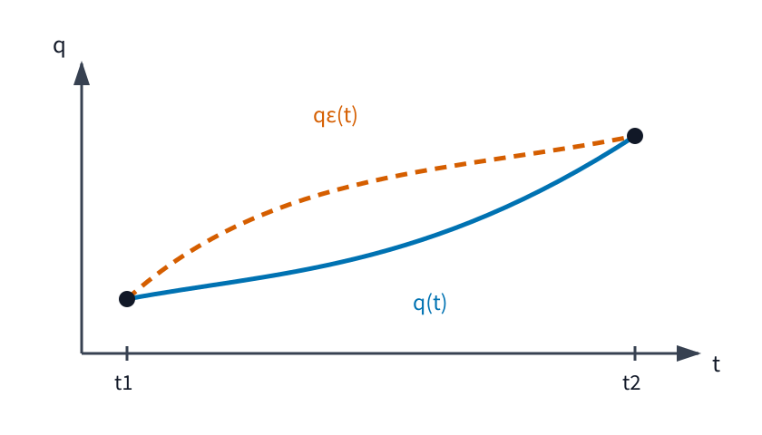

# AMECH3 作用積分と Hamilton の原理

AMECH2 では、理想拘束のもとで Newton 方程式を許される仮想変位へ射影し、保存力系では

$$
\frac{d}{dt}\frac{\partial L}{\partial \dot q_j}
-
\frac{\partial L}{\partial q_j}
=
0
$$

という Lagrange 方程式を得ました。そこでは、ある時刻の配置と速度から運動方程式を立てるという見方をしていました。

本章では、視点を一段変えます。

> **一瞬ごとの力のつり合いではなく、二つの時刻を結ぶ軌道全体を少しずつ変えて比較する。**

軌道 $q(t)$ 全体に一つの数を対応させ、その数が近くの軌道へ変えたとき一次では変化しない条件を計算します。比較では両端の配置を固定し、途中の通り方だけを変えます。すると AMECH2 と同じ Lagrange 方程式が現れます。

この一致には二つの異なる内容があります。

- **変分法の数学**：軌道に対応する積分量が一次では変化しない条件から、Euler--Lagrange 方程式を導く。
- **物理として置く仮定**：実際の運動に、その停留条件を課す。

この二つを混同しないことが、本章の中心です。

---

## 1. 点ではなく軌道を変える

時刻区間を

$$
t_1\le t\le t_2
$$

とし、$n$ 個の一般化座標をまとめて

$$
q(t)
=
\begin{pmatrix}
q_1(t)\\
\vdots\\
q_n(t)
\end{pmatrix}
$$

と書きます。ドットは時刻 $t$ による微分で、

$$
\dot q(t)=\frac{dq}{dt}(t)
$$

です。

AMECH2 の力学的ラグランジアンは、各時刻で

$$
L(q(t),\dot q(t),t)
$$

という値を持ちます。しかし解析力学では、この瞬間の値だけではなく、区間全体にわたる積分を考えます。

ここで重要なのは、これから変える対象が数 $q(t_0)$ 一つではなく、関数 $q(\,\cdot\,)$ 全体だということです。そこでまず、関数そのものを入力として数を返す写像に名前を付けます。

<!-- formal-statement-start -->
> **定義（汎関数）**  
> 関数の集合 $\mathcal A$ が与えられているとする。各 $q\in\mathcal A$ に実数 $J[q]\in\mathbb R$ を対応させる写像
$$
J:\mathcal A\to\mathbb R
$$
> を汎関数という。
<!-- formal-statement-end -->

<!-- definition-example-start: def-amech3-functional -->
### 例：関数を入力して数を返す

**定義の確認**

区間 $[0,1]$ 上の連続関数全体を $\mathcal A$ とし、

$$
J[q]
=
\int_0^1 q(t)^2\,dt
$$

と置きます。入力は数 $q(t_0)$ ではなく、関数 $q$ 全体です。

たとえば $q(t)=t$ を入力すると

$$
J[q]
=
\int_0^1 t^2\,dt
=
\frac13.
$$

したがって $J$ は $\mathcal A$ の関数を実数へ送る汎関数です。
<!-- definition-example-end -->

---

## 2. 軌道を一つの数へ送る積分

$L(q,\dot q,t)$ が与えられているとします。軌道 $q$ を一つ選ぶと、時刻ごとの $L$ を積分できます。

<!-- formal-statement-start -->
> **定義（作用）**  
> $L(q,\dot q,t)$ を十分滑らかな実数値関数とし、$q:[t_1,t_2]\to\mathbb R^n$ を区分的に $C^1$ 級の軌道とする。積分が存在するとき、
$$
\boxed{
S[q]
=
\int_{t_1}^{t_2}
L(q(t),\dot q(t),t)\,dt
}
$$
> を軌道 $q$ の作用という。これは直前に定義した汎関数の一例である。
<!-- formal-statement-end -->

作用そのものが力やエネルギーだという意味ではありません。力学的ラグランジアン $L=T-V$ を使うと、$S$ は「運動エネルギーとポテンシャルエネルギーの差を時間に沿って積み上げた量」になります。

<!-- definition-example-start: def-amech3-action -->
### 例：自由粒子の等速軌道

**定義の確認**

一次元自由粒子では

$$
L(q,\dot q)
=
\frac12m\dot q^2.
$$

区間 $[0,T]$ で

$$
q(t)=q_0+vt
$$

という等速軌道を取ると

$$
\dot q(t)=v.
$$

したがって作用は

$$
\begin{aligned}
S[q]
&=
\int_0^T
\frac12mv^2\,dt\\
&=
\boxed{
\frac12mv^2T
}.
\end{aligned}
$$

同じ端点を結ぶ別の軌道では、途中の速度が異なるため一般に別の作用を持ちます。
<!-- definition-example-end -->

---

## 3. 両端を固定して途中だけを少し変える

実際の運動と近くの軌道を比較するため、基準となる軌道 $q(t)$ に小さな変形を加えます。

本章で最初に扱う比較では、出発時刻 $t_1$ と到着時刻 $t_2$ の配置は固定します。比較するのは、その二点を結ぶ**途中の通り方**です。

次の図では、実線の基準軌道と破線の変形後の軌道が、同じ二つの端点を共有しています。

この「端点は同じ、途中だけ変える」を式にします。

<!-- formal-statement-start -->
> **定義（固定端変分）**  
> 基準軌道 $q:[t_1,t_2]\to\mathbb R^n$ と $C^1$ 級関数 $\eta:[t_1,t_2]\to\mathbb R^n$ を取り、
$$
\eta(t_1)=\eta(t_2)=0
$$
> とする。十分小さい実数 $\varepsilon$ に対して
$$
\boxed{
q_\varepsilon(t)
=
q(t)+\varepsilon\eta(t)
}
$$
> と置く。この族を $q$ の固定端変分という。$\eta$ を変分の方向という。
<!-- formal-statement-end -->

端点では

$$
q_\varepsilon(t_1)=q(t_1),
\qquad
q_\varepsilon(t_2)=q(t_2)
$$

です。一方、区間内部では $\eta(t)$ が 0 でなければ、軌道は変わります。

<!-- definition-example-start: def-amech3-fixed-end-variation -->
### 例：端点で確かに消える変分

**定義の確認**

区間 $[0,T]$ で、固定ベクトル $u\in\mathbb R^n$ に対し

$$
\eta(t)=t(T-t)u
$$

と置きます。

端点では

$$
\eta(0)=0,
\qquad
\eta(T)=0.
$$

したがって

$$
q_\varepsilon(t)
=
q(t)+\varepsilon t(T-t)u
$$

は固定端変分です。

区間内部 $0<t<T$ では一般に

$$
t(T-t)>0
$$

なので、$u\neq0$ なら軌道の途中は変わります。
<!-- definition-example-end -->

### 3.1 AMECH1 の仮想変位との違い

AMECH1 の仮想変位は、ある時刻を固定して許される配置方向を考えるものでした。本章の $\eta(t)$ は、時刻区間全体にわたって軌道を変形する関数です。

両者は「実際の時間発展そのものではない比較変位」という点で似ていますが、同じ対象ではありません。

また

$$
\delta q(t)=\varepsilon\eta(t)
$$

と書くことはあっても、これは

$$
dq=\dot q\,dt
$$

という実際の微小時間発展とは区別します。

---

## 4. 作用は一次でどれだけ変わるか

軌道を

$$
q_\varepsilon=q+\varepsilon\eta
$$

と変えたとき、作用は実数値関数

$$
\varepsilon\longmapsto S[q_\varepsilon]
$$

になります。そこで通常の一変数微分を $\varepsilon=0$ で取ります。

<!-- formal-statement-start -->
> **定義（第一変分）**  
> 固定端変分 $q_\varepsilon=q+\varepsilon\eta$ に対し、
$$
\boxed{
\delta S[q;\eta]
=
\left.
\frac{d}{d\varepsilon}
S[q_\varepsilon]
\right|_{\varepsilon=0}
}
$$
> を $q$ における方向 $\eta$ の第一変分という。すべての固定端変分方向 $\eta$ に対して $\delta S[q;\eta]=0$ となるとき、$q$ は固定端変分に関して作用の停留軌道であるという。
<!-- formal-statement-end -->

ここで「停留」は「最小」と同義ではありません。一変数関数で $f'(x_0)=0$ が極小だけでなく極大や鞍点型の状況を含むのと同じです。この違いは後で実例を計算します。

<!-- definition-example-start: def-amech3-first-variation -->
### 例：自由粒子で第一変分を直接見る

**定義の確認**

一次元自由粒子

$$
L=\frac12m\dot q^2
$$

に対し

$$
q_\varepsilon=q+\varepsilon\eta
$$

とすると

$$
\dot q_\varepsilon
=
\dot q+\varepsilon\dot\eta.
$$

したがって

$$
\begin{aligned}
S[q_\varepsilon]
&=
\int_{t_1}^{t_2}
\frac12m
\left(
\dot q+\varepsilon\dot\eta
\right)^2dt\\
&=
S[q]
+
\varepsilon
m
\int_{t_1}^{t_2}
\dot q\,\dot\eta\,dt
+
\frac{\varepsilon^2m}{2}
\int_{t_1}^{t_2}
\dot\eta^2\,dt.
\end{aligned}
$$

よって $\varepsilon$ の一次係数が第一変分で、

$$
\boxed{
\delta S[q;\eta]
=
m
\int_{t_1}^{t_2}
\dot q\,\dot\eta\,dt
}.
$$
<!-- definition-example-end -->

---

## 5. 第一変分を計算する

一般の $n$ 自由度へ進みます。

$L$ を $(q,\dot q,t)$ について十分滑らかとし、$q$ を $C^2$ 級、$\eta$ を $C^1$ 級とします。固定端変分

$$
q_\varepsilon=q+\varepsilon\eta
$$

に対し

$$
\dot q_\varepsilon
=
\dot q+\varepsilon\dot\eta
$$

です。

作用は

$$
S[q_\varepsilon]
=
\int_{t_1}^{t_2}
L(
q+\varepsilon\eta,
\dot q+\varepsilon\dot\eta,
t
)\,dt.
$$

$\varepsilon$ で微分し、$\varepsilon=0$ を代入すると、[多変数の連鎖律](../RA6/index.md#thm-ra6-chain-rule)から

$$
\delta S[q;\eta]
=
\int_{t_1}^{t_2}
\sum_{j=1}^n
\left(
\frac{\partial L}{\partial q_j}\eta_j
+
\frac{\partial L}{\partial\dot q_j}\dot\eta_j
\right)dt.
$$

ここが第一の重要な式です。

第2項には $\dot\eta_j$ が入っています。Euler--Lagrange 方程式を取り出すには、部分積分で微分を $\eta_j$ から $\partial L/\partial\dot q_j$ へ移します。

各 $j$ について

$$
\int_{t_1}^{t_2}
\frac{\partial L}{\partial\dot q_j}
\dot\eta_j\,dt
=
\left[
\frac{\partial L}{\partial\dot q_j}
\eta_j
\right]_{t_1}^{t_2}
-
\int_{t_1}^{t_2}
\frac{d}{dt}
\left(
\frac{\partial L}{\partial\dot q_j}
\right)
\eta_j\,dt.
$$

固定端条件

$$
\eta_j(t_1)=\eta_j(t_2)=0
$$

により境界項は 0 です。したがって

$$
\boxed{
\delta S[q;\eta]
=
\int_{t_1}^{t_2}
\sum_{j=1}^n
\left[
\frac{\partial L}{\partial q_j}
-
\frac{d}{dt}
\left(
\frac{\partial L}{\partial\dot q_j}
\right)
\right]
\eta_j\,dt
}.
$$

「固定端」が単なる言葉ではなく、**部分積分で出る境界項を消すために働いている**ことが見えます。

---

## 6. 積分がすべての変分で 0 なら係数は 0

前節の式から Euler--Lagrange 方程式を得るには、

$$
\int g(t)\eta(t)\,dt=0
$$

がすべての許される $\eta$ について成り立つなら、$g$ 自身が 0 だと結論する必要があります。

この一歩を「任意だから」で済ませず、一次元区間で必要な形を証明します。

<!-- formal-statement-start -->
> **補題（変分法の基本補題・本章で使う形）**  
> 連続関数 $g_1,\ldots,g_n:[t_1,t_2]\to\mathbb R$ が、端点で 0 となる任意の $C^1$ 級関数 $\eta_1,\ldots,\eta_n$ に対して
$$
\int_{t_1}^{t_2}
\sum_{j=1}^n
g_j(t)\eta_j(t)\,dt
=
0
$$
> を満たすとする。このとき
$$
g_j(t)=0
\qquad
(j=1,\ldots,n)
$$
> が区間全体で成り立つ。
<!-- formal-statement-end -->

### 証明の見取り図

もしある $g_j(t_0)$ が正なら、連続性により $t_0$ の近くでも正です。その小区間だけで正になる $C^1$ 級の変分を作れば、積分は正になって仮定に反します。負の場合も符号を逆にすれば同じです。

<!-- proof-start -->
### 証明

ある添字 $j$ と区間内部の点 $t_0$ で

$$
g_j(t_0)>0
$$

と仮定します。

$g_j$ は連続なので、$t_0$ を含む閉区間 $[a,b]\subset(t_1,t_2)$ と定数 $c>0$ を選び、

$$
g_j(t)\ge c
\qquad
(a\le t\le b)
$$

とできます。

変分の第 $j$ 成分を

$$
\eta_j(t)
=
\begin{cases}
(t-a)^2(b-t)^2,&a\le t\le b,\\
0,&\text{otherwise}
\end{cases}
$$

とし、他の成分をすべて 0 とします。

区間 $[a,b]$ の両端では関数値だけでなく一階微分も 0 なので、この $\eta_j$ は区間全体で $C^1$ 級です。また $t_1,t_2$ でも 0 です。

したがって仮定より

$$
0
=
\int_{t_1}^{t_2}
g_j(t)\eta_j(t)\,dt.
$$

しかし $[a,b]$ では

$$
g_j(t)\eta_j(t)
\ge
c(t-a)^2(b-t)^2
\ge0
$$

であり、区間内部では右辺が正です。よって

$$
\int_a^b
g_j(t)\eta_j(t)\,dt
>
0
$$

となり矛盾します。

$g_j(t_0)<0$ の場合は $-g_j$ に同じ議論を適用できます。したがって各 $g_j$ は区間内部で 0 です。連続性により端点でも 0 となります。
<!-- proof-end -->

---

## 7. Euler--Lagrange 方程式は停留条件そのもの

前節までの計算をまとめます。

<!-- formal-statement-start -->
> **定理（固定端変分の Euler--Lagrange 方程式）**  
> $L(q,\dot q,t)$ を $C^2$ 級とし、$q:[t_1,t_2]\to\mathbb R^n$ を $C^2$ 級とする。端点を固定した任意の $C^1$ 級変分方向 $\eta$ に対して第一変分が存在するとする。このとき、次は同値である。
>
> 1. $q$ は作用
$$
S[q]
=
\int_{t_1}^{t_2}
L(q,\dot q,t)\,dt
$$
> の固定端停留軌道である。
> 2. 各 $j=1,\ldots,n$ について
$$
\boxed{
\frac{d}{dt}
\frac{\partial L}{\partial\dot q_j}
-
\frac{\partial L}{\partial q_j}
=
0
}
$$
> が $[t_1,t_2]$ で成り立つ。
<!-- formal-statement-end -->

### 証明の見取り図

第一変分を連鎖律で計算し、$\dot\eta_j$ を含む項を部分積分します。固定端条件で境界項を消すと、第一変分は Euler--Lagrange 式の左辺と $\eta_j$ の積の積分になります。すべての $\eta$ に対して 0 なら基本補題を使って係数が 0 です。逆向きは式を第一変分へ代入すれば直ちに従います。

<!-- proof-start -->
### 証明

前節の計算より

$$
\delta S[q;\eta]
=
\int_{t_1}^{t_2}
\sum_{j=1}^n
\left[
\frac{\partial L}{\partial q_j}
-
\frac{d}{dt}
\left(
\frac{\partial L}{\partial\dot q_j}
\right)
\right]
\eta_j\,dt.
$$

まず $q$ が停留軌道だとします。このとき任意の固定端変分方向 $\eta$ に対して

$$
\delta S[q;\eta]=0.
$$

したがって、連続関数

$$
g_j(t)
=
\frac{\partial L}{\partial q_j}
-
\frac{d}{dt}
\left(
\frac{\partial L}{\partial\dot q_j}
\right)
$$

について

$$
\int_{t_1}^{t_2}
\sum_{j=1}^n
g_j(t)\eta_j(t)\,dt
=
0
$$

が任意の $\eta$ で成り立ちます。

[変分法の基本補題](#lem-amech3-fundamental-variation)から

$$
g_j(t)=0
$$

なので

$$
\frac{d}{dt}
\frac{\partial L}{\partial\dot q_j}
-
\frac{\partial L}{\partial q_j}
=
0
$$

を得ます。

逆に Euler--Lagrange 方程式が成り立つなら、第一変分の積分の各係数が 0 なので

$$
\delta S[q;\eta]=0
$$

が任意の固定端変分方向 $\eta$ に対して成り立ちます。したがって $q$ は停留軌道です。
<!-- proof-end -->

この定理は純粋に数学的な主張です。「どの軌道が自然界で実現するか」はまだ何も言っていません。

---

## 8. 実際の運動へ停留条件を課す

ここで物理の主張を加えます。

AMECH2 で導入した力学的ラグランジアン

$$
L=T-V
$$

を考えます。

<!-- formal-statement-start -->
> **原理（Hamilton の原理）**  
> 保存力系を力学的ラグランジアン $L=T-V$ で記述し、時刻 $t_1,t_2$ と両端の配置を固定する。実現する運動軌道 $q(t)$ は、十分近い許容軌道との固定端変分に対して作用
$$
S[q]
=
\int_{t_1}^{t_2}
L(q,\dot q,t)\,dt
$$
> を停留させる、すなわち
$$
\boxed{
\delta S[q;\eta]=0
}
$$
> を任意の許容固定端変分方向 $\eta$ に対して満たす。
<!-- formal-statement-end -->

[Hamilton の原理](#principle-amech3-hamilton)と[固定端変分の Euler--Lagrange 方程式](#thm-amech3-euler-lagrange)を組み合わせると、

$$
\frac{d}{dt}
\frac{\partial L}{\partial\dot q_j}
-
\frac{\partial L}{\partial q_j}
=
0
$$

を得ます。これは AMECH2 で d'Alembert 原理から得た保存力系の Lagrange 方程式と同じです。

### 8.1 数学的導出と物理原理を分ける

論理の向きを明確にしておきます。

**変分法の数学**

$$
\delta S=0
\quad\Longleftrightarrow\quad
\text{Euler--Lagrange 方程式}
$$

は、滑らかさと固定端条件の下で証明できる数学です。

**物理として置く仮定**

$$
\text{実際の運動}
\quad\Longrightarrow\quad
\delta S=0
$$

を物理法則として採用するのが Hamilton の原理です。

AMECH2 では Newton 力学から Lagrange 方程式を導き、本章では実際の運動に $\delta S=0$ を課して同じ方程式を得ました。通常の保存力系では両者は同じ運動方程式を与えますが、「変分法だけで自然法則を証明した」という意味ではありません。

---

## 9. 例：調和振動子を作用から導く

質量 $m>0$、ばね定数 $k>0$ の一次元調和振動子を考えます。

関数 $L$ は

$$
L(q,\dot q)
=
\frac12m\dot q^2
-
\frac12kq^2.
$$

作用は

$$
S[q]
=
\int_{t_1}^{t_2}
\left(
\frac12m\dot q^2
-
\frac12kq^2
\right)dt.
$$

必要な偏微分は

$$
\frac{\partial L}{\partial\dot q}
=
m\dot q,
\qquad
\frac{d}{dt}
\frac{\partial L}{\partial\dot q}
=
m\ddot q,
$$

$$
\frac{\partial L}{\partial q}
=
-kq.
$$

したがって Euler--Lagrange 方程式は

$$
m\ddot q-(-kq)=0.
$$

よって

$$
\boxed{
m\ddot q+kq=0
}.
$$

AMECH2 で力から得た運動方程式と一致します。

第一変分を直接計算しても同じことが見えます。

$$
\begin{aligned}
\delta S[q;\eta]
&=
\int_{t_1}^{t_2}
\left(
m\dot q\,\dot\eta
-
kq\eta
\right)dt\\
&=
\left[
m\dot q\,\eta
\right]_{t_1}^{t_2}
-
\int_{t_1}^{t_2}
\left(
m\ddot q+kq
\right)\eta\,dt.
\end{aligned}
$$

固定端では境界項が 0 なので

$$
\delta S[q;\eta]
=
-
\int_{t_1}^{t_2}
\left(
m\ddot q+kq
\right)\eta\,dt.
$$

任意の $\eta$ に対してこれが 0 になる条件が

$$
m\ddot q+kq=0
$$

です。

---

## 10. 「最小作用」という言い方に注意する

Hamilton の原理はしばしば「最小作用の原理」と呼ばれます。しかし一般には、必要なのは**停留**であって最小とは限りません。

調和振動子でこの違いを実際に計算します。

区間 $[0,T]$ で端点

$$
q(0)=q(T)=0
$$

を固定し、停留軌道

$$
q(t)=0
$$

を考えます。

変分方向を

$$
\eta(t)
=
\sin\frac{\pi t}{T}
$$

とし、

$$
q_\varepsilon(t)
=
\varepsilon\eta(t)
$$

とします。確かに

$$
\eta(0)=\eta(T)=0.
$$

角振動数を

$$
\omega^2=\frac{k}{m}
$$

と書くと、

$$
S[q_\varepsilon]
-
S[0]
=
\frac{m\varepsilon^2}{2}
\int_0^T
\left(
\dot\eta^2-\omega^2\eta^2
\right)dt.
$$

ここで

$$
\dot\eta(t)
=
\frac{\pi}{T}
\cos\frac{\pi t}{T}.
$$

したがって

$$
\int_0^T\eta^2\,dt
=
\frac{T}{2},
$$

$$
\int_0^T\dot\eta^2\,dt
=
\frac{\pi^2}{2T}.
$$

よって

$$
\boxed{
S[q_\varepsilon]-S[0]
=
\frac{m\varepsilon^2}{4}
\left(
\frac{\pi^2}{T}
-
\omega^2T
\right)
}.
$$

もし

$$
T>\frac{\pi}{\omega}
$$

なら括弧内は負です。したがって任意に小さい $\varepsilon\neq0$ に対して

$$
S[q_\varepsilon]<S[0]
$$

となります。

それでも $q=0$ は Euler--Lagrange 方程式

$$
\ddot q+\omega^2q=0
$$

を満たすので停留軌道です。

したがって、

> **停留作用は、一般には最小作用とは限らない。**

という区別が必要です。

---

## 11. 境界項はどこへ消えたのか

第一変分の部分積分では、本来

$$
\left[
\sum_{j=1}^n
\frac{\partial L}{\partial\dot q_j}
\eta_j
\right]_{t_1}^{t_2}
$$

という境界項が出ます。

固定端変分では

$$
\eta_j(t_1)=\eta_j(t_2)=0
$$

なので消えました。

逆に端点を自由に動かす変分問題では、この境界項は一般には残ります。そのときは Euler--Lagrange 方程式だけでなく、端点に関する追加条件が現れます。

本章では固定端問題に集中しますが、端点の扱いを変えると、停留条件から現れる境界側の条件も変わる、という点は覚えておく必要があります。

---

## 12. $L$ に全時間微分を加えても運動は変わらない

運動方程式を与える関数 $L$ は、一意には決まりません。

$q$ と $t$ の滑らかな関数 $F(q,t)$ を取ると、軌道に沿った全時間微分は

$$
\frac{dF}{dt}
=
\sum_{j=1}^n
\frac{\partial F}{\partial q_j}\dot q_j
+
\frac{\partial F}{\partial t}
$$

です。

これを $L$ に加えます。

<!-- formal-statement-start -->
> **命題（全時間微分を加えた Lagrangian の同値性）**  
> $L(q,\dot q,t)$ と $F(q,t)$ を十分滑らかとし、
$$
L'(q,\dot q,t)
=
L(q,\dot q,t)
+
\frac{dF(q,t)}{dt}
$$
> とする。固定した時刻 $t_1,t_2$ と固定端配置のもとでは、$L$ と $L'$ の作用は端点だけで決まる定数だけ異なる。したがって両者は同じ固定端停留軌道、同じ Euler--Lagrange 方程式を与える。
<!-- formal-statement-end -->

### 証明の見取り図

全時間微分を積分すると端点差になります。固定端変分ではその端点差は変わらないので、第一変分は元の作用と同じです。

<!-- proof-start -->
### 証明

$L$ と $L'$ の作用をそれぞれ $S,S'$ とします。

定義より

$$
\begin{aligned}
S'[q]
&=
\int_{t_1}^{t_2}
\left(
L+\frac{dF}{dt}
\right)dt\\
&=
S[q]
+
\int_{t_1}^{t_2}
\frac{dF}{dt}\,dt.
\end{aligned}
$$

[微積分学の基本定理II](../RA4/index.md#thm-ra4-ftc2)から

$$
\int_{t_1}^{t_2}
\frac{dF}{dt}\,dt
=
F(q(t_2),t_2)
-
F(q(t_1),t_1).
$$

よって

$$
S'[q]
=
S[q]
+
F(q(t_2),t_2)
-
F(q(t_1),t_1).
$$

固定端変分では $q(t_1),q(t_2)$ が変わらないので、右辺の端点差は $\varepsilon$ に依存しません。

したがって

$$
\delta S'[q;\eta]
=
\delta S[q;\eta].
$$

よって $S$ が停留する軌道と $S'$ が停留する軌道は一致します。[停留条件との同値性](#thm-amech3-euler-lagrange)により、両方の関数 $L,L'$ は同じ運動方程式を与えます。
<!-- proof-end -->

### 12.1 直接計算できる最小例

自由粒子の

$$
L=\frac12m\dot q^2
$$

に対し

$$
F(q,t)=\lambda q
$$

とします。$\lambda$ は定数です。

すると

$$
\frac{dF}{dt}
=
\lambda\dot q
$$

なので

$$
L'
=
\frac12m\dot q^2+\lambda\dot q.
$$

$L'$ について

$$
\frac{\partial L'}{\partial q}=0,
$$

$$
\frac{\partial L'}{\partial\dot q}
=
m\dot q+\lambda.
$$

時間微分すると

$$
\frac{d}{dt}
\frac{\partial L'}{\partial\dot q}
=
m\ddot q.
$$

したがって Euler--Lagrange 方程式は

$$
m\ddot q=0
$$

で、元の自由粒子と同じです。

これは「$L$ の式が違えば物理も必ず違う」という理解が誤りであることを示す最小例です。

---

## 13. AMECH2 と何が変わったのか

AMECH2 と本章は、同じ Lagrange 方程式へ異なる入口から到達しました。

AMECH2 の流れは

$$
\text{Newton 方程式}
\longrightarrow
\text{d'Alembert 原理}
\longrightarrow
\text{Lagrange 方程式}
$$

でした。

本章の流れは

$$
\text{Hamilton の原理}
\longrightarrow
\delta S=0
\longrightarrow
\text{Euler--Lagrange 方程式}
$$

です。

前者は力と拘束を許される方向へ射影する見方、後者は軌道全体を比較する見方です。

この「軌道全体を一つの対象として見る」視点が、次章 AMECH4 の対称性と Noether の定理へつながります。作用を変えない連続変換があるとき、そこから運動中に一定となる量が現れることを調べます。

---

# 演習

## Level A

### A1. 固定端変分の条件を確認する

区間 $[0,T]$ で

$$
\eta(t)
=
t^2(T-t)^2
$$

とする。

1. $\eta(0)=\eta(T)=0$ を確認せよ。
2. $\eta'(0)=\eta'(T)=0$ も確認せよ。
3. 任意の $C^1$ 級軌道 $q(t)$ に対し
   $$
   q_\varepsilon(t)=q(t)+\varepsilon\eta(t)
   $$
   が固定端変分になることを説明せよ。

- Level: A

<!-- solution-start -->
#### 詳細解答

端点 $t=0$ を代入すると

$$
\eta(0)
=
0^2T^2
=
0.
$$

$t=T$ では

$$
\eta(T)
=
T^2(T-T)^2
=
0.
$$

次に微分します。

$$
\begin{aligned}
\eta'(t)
&=
2t(T-t)^2
+
t^2\cdot2(T-t)(-1)\\
&=
2t(T-t)
\left(
(T-t)-t
\right)\\
&=
2t(T-t)(T-2t).
\end{aligned}
$$

したがって

$$
\eta'(0)=0,
\qquad
\eta'(T)=0.
$$

変形後の軌道は

$$
q_\varepsilon(0)
=
q(0)+\varepsilon\eta(0)
=
q(0),
$$

$$
q_\varepsilon(T)
=
q(T)+\varepsilon\eta(T)
=
q(T)
$$

なので、両端の配置を変えません。よって固定端変分です。

なお固定端変分の定義に必要なのは $\eta(0)=\eta(T)=0$ であり、$\eta'$ まで端点で 0 であることは必須ではありません。
<!-- solution-end -->

---

### A2. 自由粒子の第一変分から運動方程式を出す

一次元自由粒子

$$
L(q,\dot q)=\frac12m\dot q^2,
\qquad
m>0
$$

を考える。固定端変分方向 $\eta$ に対して次を示せ。

1. 第一変分が
   $$
   \delta S
   =
   m\int_{t_1}^{t_2}\dot q\,\dot\eta\,dt
   $$
   となることを示せ。
2. 部分積分して
   $$
   \delta S
   =
   -m\int_{t_1}^{t_2}\ddot q\,\eta\,dt
   $$
   を得よ。
3. 停留条件から運動方程式を求めよ。

- Level: A

<!-- solution-start -->
#### 詳細解答

作用は

$$
S[q]
=
\int_{t_1}^{t_2}
\frac12m\dot q^2\,dt.
$$

$q_\varepsilon=q+\varepsilon\eta$ なら

$$
\dot q_\varepsilon
=
\dot q+\varepsilon\dot\eta.
$$

したがって

$$
S[q_\varepsilon]
=
\int_{t_1}^{t_2}
\frac12m
\left(
\dot q+\varepsilon\dot\eta
\right)^2dt.
$$

$\varepsilon$ で微分し $\varepsilon=0$ を代入すると

$$
\boxed{
\delta S
=
m\int_{t_1}^{t_2}
\dot q\,\dot\eta\,dt
}.
$$

部分積分すると

$$
\begin{aligned}
\delta S
&=
m
\left[
\dot q\,\eta
\right]_{t_1}^{t_2}
-
m
\int_{t_1}^{t_2}
\ddot q\,\eta\,dt.
\end{aligned}
$$

固定端条件より

$$
\eta(t_1)=\eta(t_2)=0
$$

なので境界項は 0 です。よって

$$
\boxed{
\delta S
=
-m
\int_{t_1}^{t_2}
\ddot q\,\eta\,dt
}.
$$

任意の固定端変分方向 $\eta$ で $\delta S=0$ が成り立つため、[変分法の基本補題](#lem-amech3-fundamental-variation)から

$$
m\ddot q=0.
$$

$m>0$ なので

$$
\boxed{
\ddot q=0
}.
$$

これは自由粒子の等速直線運動です。
<!-- solution-end -->

---

### A3. 調和振動子の Euler--Lagrange 方程式

$$
L(q,\dot q)
=
\frac12m\dot q^2-\frac12kq^2,
\qquad
m>0,\ k>0
$$

とする。

1. $\partial L/\partial\dot q$ を求めよ。
2. $d/dt(\partial L/\partial\dot q)$ を求めよ。
3. $\partial L/\partial q$ を求めよ。
4. Euler--Lagrange 方程式を導け。

- Level: A

<!-- solution-start -->
#### 詳細解答

まず

$$
\frac{\partial L}{\partial\dot q}
=
m\dot q.
$$

したがって

$$
\frac{d}{dt}
\frac{\partial L}{\partial\dot q}
=
m\ddot q.
$$

また

$$
\frac{\partial L}{\partial q}
=
-kq.
$$

Euler--Lagrange 方程式

$$
\frac{d}{dt}
\frac{\partial L}{\partial\dot q}
-
\frac{\partial L}{\partial q}
=
0
$$

へ代入すると

$$
m\ddot q-(-kq)=0.
$$

よって

$$
\boxed{
m\ddot q+kq=0
}.
$$
<!-- solution-end -->

---

### A4. 全時間微分を加えた自由粒子

$$
L(q,\dot q)
=
\frac12m\dot q^2
$$

とし、

$$
F(q,t)=atq,
$$

ここで $a$ は定数とする。

1. $dF/dt$ を求めよ。
2. $L'=L+dF/dt$ を書け。
3. $L'$ に Euler--Lagrange 方程式を直接適用し、$\ddot q=0$ が得られることを確認せよ。

- Level: A

<!-- solution-start -->
#### 詳細解答

連鎖律より

$$
\frac{dF}{dt}
=
\frac{\partial F}{\partial q}\dot q
+
\frac{\partial F}{\partial t}.
$$

ここで

$$
\frac{\partial F}{\partial q}
=
at,
\qquad
\frac{\partial F}{\partial t}
=
aq.
$$

したがって

$$
\boxed{
\frac{dF}{dt}
=
at\dot q+aq
}.
$$

よって

$$
L'
=
\frac12m\dot q^2
+
at\dot q
+
aq.
$$

$q$ で偏微分すると

$$
\frac{\partial L'}{\partial q}
=
a.
$$

$\dot q$ で偏微分すると

$$
\frac{\partial L'}{\partial\dot q}
=
m\dot q+at.
$$

時間微分は

$$
\frac{d}{dt}
\frac{\partial L'}{\partial\dot q}
=
m\ddot q+a.
$$

したがって Euler--Lagrange 方程式は

$$
(m\ddot q+a)-a=0.
$$

よって

$$
m\ddot q=0.
$$

$m>0$ なので

$$
\boxed{
\ddot q=0
}.
$$

全時間微分に由来する二つの $a$ が打ち消し合い、元の自由粒子と同じ運動方程式になります。
<!-- solution-end -->

---

## Level B

### B1. 自由粒子では停留軌道が実際に最小になる

一次元自由粒子を区間 $[0,T]$ で考え、端点を

$$
q(0)=q_A,
\qquad
q(T)=q_B
$$

と固定する。

1. Euler--Lagrange 方程式を解き、固定端を結ぶ停留軌道 $q_*(t)$ を求めよ。
2. 任意の固定端軌道を
   $$
   q(t)=q_*(t)+\eta(t),
   \qquad
   \eta(0)=\eta(T)=0
   $$
   と書く。
3. 作用差が
   $$
   S[q]-S[q_*]
   =
   \frac{m}{2}
   \int_0^T
   \dot\eta^2\,dt
   $$
   となることを示せ。
4. この問題では $q_*$ が作用を最小にすることを結論せよ。

- Level: B

<!-- solution-start -->
#### 詳細解答

自由粒子では

$$
L=\frac12m\dot q^2
$$

なので Euler--Lagrange 方程式は

$$
m\ddot q=0.
$$

したがって

$$
q(t)=A+Bt.
$$

端点条件から

$$
A=q_A,
$$

$$
q_B=q_A+BT
$$

なので

$$
B=\frac{q_B-q_A}{T}.
$$

よって

$$
\boxed{
q_*(t)
=
q_A
+
\frac{q_B-q_A}{T}t
}.
$$

任意の同じ端点を持つ軌道を

$$
q=q_*+\eta
$$

と書くと

$$
\dot q=\dot q_*+\dot\eta.
$$

作用差は

$$
\begin{aligned}
S[q]-S[q_*]
&=
\frac{m}{2}
\int_0^T
\left[
(\dot q_*+\dot\eta)^2
-
\dot q_*^2
\right]dt\\
&=
m
\int_0^T
\dot q_*\dot\eta\,dt
+
\frac{m}{2}
\int_0^T
\dot\eta^2\,dt.
\end{aligned}
$$

$q_*$ は等速なので $\dot q_*$ は定数です。したがって

$$
\begin{aligned}
\int_0^T
\dot q_*\dot\eta\,dt
&=
\dot q_*
\left[
\eta(t)
\right]_0^T\\
&=
\dot q_*
\left(
\eta(T)-\eta(0)
\right)\\
&=
0.
\end{aligned}
$$

よって

$$
\boxed{
S[q]-S[q_*]
=
\frac{m}{2}
\int_0^T
\dot\eta^2\,dt
\ge0
}.
$$

等号が成り立つには

$$
\dot\eta=0
$$

が必要です。$\eta$ は定数となり、さらに $\eta(0)=0$ なので $\eta\equiv0$ です。

したがってこの自由粒子の固定端問題では $q_*$ が作用の一意な最小軌道です。
<!-- solution-end -->

---

### B2. 調和振動子では停留が最小とは限らない

$$
L
=
\frac12m\dot q^2
-
\frac12m\omega^2q^2,
\qquad
m>0,\ \omega>0
$$

とする。区間 $[0,T]$ で端点を $q(0)=q(T)=0$ と固定し、停留軌道 $q=0$ を考える。

1. $\eta(t)=\sin(\pi t/T)$ が固定端変分方向であることを示せ。
2. $q_\varepsilon=\varepsilon\eta$ とするとき、
   $$
   S[q_\varepsilon]-S[0]
   =
   \frac{m\varepsilon^2}{4}
   \left(
   \frac{\pi^2}{T}-\omega^2T
   \right)
   $$
   を導け。
3. $T>\pi/\omega$ のとき $q=0$ が局所最小ではないことを説明せよ。
4. それでも $q=0$ が停留軌道である理由を述べよ。

- Level: B

<!-- solution-start -->
#### 詳細解答

まず

$$
\eta(0)=\sin0=0,
$$

$$
\eta(T)=\sin\pi=0.
$$

よって固定端変分方向です。

$q_\varepsilon=\varepsilon\eta$ なので

$$
\dot q_\varepsilon
=
\varepsilon\dot\eta.
$$

したがって

$$
\begin{aligned}
S[q_\varepsilon]-S[0]
&=
\frac{m\varepsilon^2}{2}
\int_0^T
\left(
\dot\eta^2-\omega^2\eta^2
\right)dt.
\end{aligned}
$$

ここで

$$
\dot\eta
=
\frac{\pi}{T}
\cos\frac{\pi t}{T}.
$$

したがって

$$
\int_0^T
\eta^2\,dt
=
\frac{T}{2},
$$

$$
\int_0^T
\dot\eta^2\,dt
=
\frac{\pi^2}{T^2}
\cdot
\frac{T}{2}
=
\frac{\pi^2}{2T}.
$$

よって

$$
\begin{aligned}
S[q_\varepsilon]-S[0]
&=
\frac{m\varepsilon^2}{2}
\left(
\frac{\pi^2}{2T}
-
\frac{\omega^2T}{2}
\right)\\
&=
\boxed{
\frac{m\varepsilon^2}{4}
\left(
\frac{\pi^2}{T}
-
\omega^2T
\right)
}.
\end{aligned}
$$

$T>\pi/\omega$ なら

$$
\omega^2T^2>\pi^2
$$

なので

$$
\frac{\pi^2}{T}-\omega^2T<0.
$$

したがって任意に小さい $\varepsilon\neq0$ に対して

$$
S[q_\varepsilon]<S[0].
$$

よって $q=0$ は局所最小ではありません。

一方、$q=0$ は

$$
\ddot q+\omega^2q=0
$$

を満たします。[停留条件との同値性](#thm-amech3-euler-lagrange)より、これは第一変分がすべての固定端変分方向で 0 になることを意味します。したがって最小ではなくても停留軌道です。
<!-- solution-end -->

---

### B3. 二次元ポテンシャル系を作用から導く

質量 $m>0$ の質点が平面内を動き、位置を $(x,y)$、ポテンシャルを $V(x,y)$ とする。

$$
L(x,y,\dot x,\dot y)
=
\frac12m
\left(
\dot x^2+\dot y^2
\right)
-
V(x,y)
$$

とする。

1. $x$ に対する Euler--Lagrange 方程式を導け。
2. $y$ に対する Euler--Lagrange 方程式を導け。
3. 二式をベクトル
   $$
   r=
   \begin{pmatrix}
   x\\
   y
   \end{pmatrix}
   $$
   を用いてまとめよ。
4. AMECH2 の保存力 $F=-\nabla V$ と一致することを説明せよ。

- Level: B

<!-- solution-start -->
#### 詳細解答

$x$ について

$$
\frac{\partial L}{\partial\dot x}
=
m\dot x,
$$

$$
\frac{d}{dt}
\frac{\partial L}{\partial\dot x}
=
m\ddot x,
$$

$$
\frac{\partial L}{\partial x}
=
-\frac{\partial V}{\partial x}.
$$

したがって

$$
m\ddot x
+
\frac{\partial V}{\partial x}
=
0,
$$

すなわち

$$
\boxed{
m\ddot x
=
-\frac{\partial V}{\partial x}
}.
$$

同様に $y$ について

$$
\boxed{
m\ddot y
=
-\frac{\partial V}{\partial y}
}.
$$

二式を縦に並べると

$$
m
\begin{pmatrix}
\ddot x\\
\ddot y
\end{pmatrix}
=
-
\begin{pmatrix}
\partial V/\partial x\\
\partial V/\partial y
\end{pmatrix}.
$$

したがって

$$
\boxed{
m\ddot r=-\nabla V
}.
$$

保存力は

$$
F=-\nabla V
$$

なので

$$
m\ddot r=F
$$

です。これは Newton の第2法則と一致します。

本章で作用の停留条件 $\delta S=0$ から得た Euler--Lagrange 方程式が、AMECH2 で扱った保存力系の運動方程式を再現していることが分かります。
<!-- solution-end -->

---

## Level C

### C1. 時間依存外力と全時間微分の同値性をまとめて確認する

一次元系で

$$
L(q,\dot q,t)
=
\frac12m\dot q^2
-
\frac12kq^2
+
f(t)q,
\qquad
m>0,\ k>0
$$

とする。$f$ は連続関数とする。

さらに $C^1$ 級関数 $a(t)$ を用いて

$$
F(q,t)=a(t)q
$$

とし、

$$
L'
=
L+\frac{dF}{dt}
$$

を考える。

1. $L$ から Euler--Lagrange 方程式を導け。
2. $dF/dt$ を $q,\dot q,t$ で表せ。
3. $L'$ について $\partial L'/\partial q$ と $\partial L'/\partial\dot q$ を求め、Euler--Lagrange 方程式が $L$ と同じになることを直接示せ。
4. 固定端変分では $S'[q]-S[q]$ が変分に依存しない理由を説明せよ。
5. この例を用いて、「$L$ の式の形」と「運動方程式」が一対一対応しないことを説明せよ。

- Level: C

<!-- solution-start -->
#### 詳細解答

まず $L$ について

$$
\frac{\partial L}{\partial\dot q}
=
m\dot q,
$$

$$
\frac{d}{dt}
\frac{\partial L}{\partial\dot q}
=
m\ddot q.
$$

また

$$
\frac{\partial L}{\partial q}
=
-kq+f(t).
$$

したがって Euler--Lagrange 方程式は

$$
m\ddot q-(-kq+f(t))=0.
$$

よって

$$
\boxed{
m\ddot q+kq=f(t)
}.
$$

次に

$$
F(q,t)=a(t)q
$$

なので

$$
\frac{\partial F}{\partial q}
=
a(t),
$$

$$
\frac{\partial F}{\partial t}
=
\dot a(t)q.
$$

軌道に沿った全時間微分は

$$
\begin{aligned}
\frac{dF}{dt}
&=
\frac{\partial F}{\partial q}\dot q
+
\frac{\partial F}{\partial t}\\
&=
a(t)\dot q+\dot a(t)q.
\end{aligned}
$$

したがって

$$
L'
=
\frac12m\dot q^2
-
\frac12kq^2
+
f(t)q
+
a(t)\dot q
+
\dot a(t)q.
$$

$q$ で偏微分すると

$$
\frac{\partial L'}{\partial q}
=
-kq+f(t)+\dot a(t).
$$

$\dot q$ で偏微分すると

$$
\frac{\partial L'}{\partial\dot q}
=
m\dot q+a(t).
$$

時間微分は

$$
\frac{d}{dt}
\frac{\partial L'}{\partial\dot q}
=
m\ddot q+\dot a(t).
$$

したがって Euler--Lagrange 方程式は

$$
m\ddot q+\dot a(t)
-
\left(
-kq+f(t)+\dot a(t)
\right)
=
0.
$$

$\dot a(t)$ が相殺して

$$
m\ddot q+kq-f(t)=0.
$$

よって

$$
\boxed{
m\ddot q+kq=f(t)
}
$$

となり、$L$ から得た方程式と一致します。

作用差は

$$
\begin{aligned}
S'[q]-S[q]
&=
\int_{t_1}^{t_2}
\frac{dF}{dt}\,dt\\
&=
F(q(t_2),t_2)
-
F(q(t_1),t_1).
\end{aligned}
$$

固定端変分では $q(t_1),q(t_2)$ が固定され、$t_1,t_2$ も固定されています。したがってこの端点差は $\varepsilon$ に依存せず、

$$
\delta S'=\delta S
$$

です。

この例では $L$ と $L'$ は異なる式ですが、固定端変分に対する第一変分は同じで、同じ運動方程式を与えます。したがって $L$ の具体的な式と物理的運動は一対一対応ではありません。
<!-- solution-end -->
