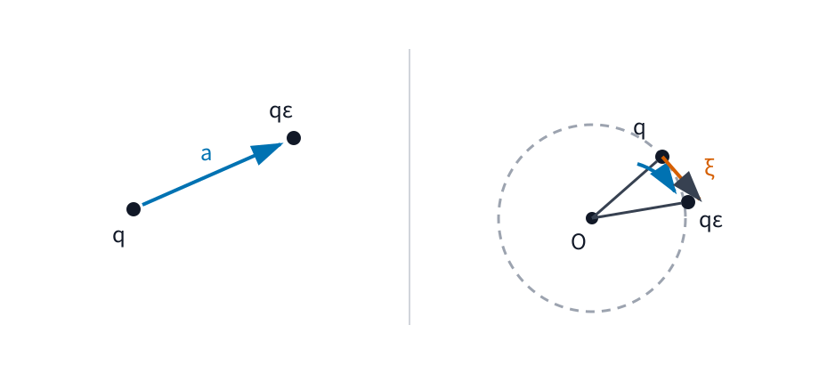

# AMECH4 対称性・循環座標・Noether の定理

AMECH3 では、軌道全体に対する作用の停留条件から Euler--Lagrange 方程式を導きました。保存力系なら、運動は

$$
\frac{d}{dt}
\frac{\partial L}{\partial \dot q_j}
-
\frac{\partial L}{\partial q_j}
=
0
$$

に従います。

MECH3 と MECH4 では、エネルギー・運動量・角運動量が、特定の力学的条件のもとで保存することを Newton 方程式から導きました。ここでは逆向きの問いを考えます。

> **ラグランジアンの式そのものに「変えても変わらない方向」が見えたとき、運動方程式を解く前に、運動中に一定となる量を読み取れないか。**

この問いに対する最初の答えは、ラグランジアンに現れない座標を利用することです。さらに「座標を少しずらす」「空間を少し回す」「時刻の原点を少しずらす」を同じ形で扱うと、連続対称性と一定量を結ぶ一般則に到達します。

本章の流れは

$$
\text{L に現れない座標}
\longrightarrow
\text{一般化運動量保存}
\longrightarrow
\text{連続対称性}
\longrightarrow
\text{対称性から一定量}
\longrightarrow
\text{運動量・角運動量・エネルギー}
$$

です。

本章では ラグランジアン を $L$ と書くため、角運動量ベクトルは $\ell$ と書きます。

---

## 1. 一般化座標ごとに対応する運動量を作る

Lagrange 方程式には

$$
\frac{\partial L}{\partial \dot q_j}
$$

が繰り返し現れます。直交座標の自由粒子なら、これは通常の運動量 $m\dot q_j$ そのものです。しかし一般化座標では、角度に対応する量が角運動量になったり、長さ以外の次元を持ったりします。

そこで座標 $q_j$ ごとに、この偏微分を一つの基本量として扱います。

<!-- formal-statement-start -->
> **定義（一般化運動量）**  
> $n$ 自由度の ラグランジアン $L(q,\dot q,t)$ が速度変数 $\dot q_j$ について微分可能であるとする。一般化座標 $q_j$ に対応する一般化運動量を

$$
\boxed{
p_j
=
\frac{\partial L}{\partial \dot q_j}
}
$$

> と定める。
<!-- formal-statement-end -->

<!-- definition-example-start: def-amech4-generalized-momentum -->
### 例：極座標の角度に対応する一般化運動量

**定義の確認**

質量 $m>0$ の質点が平面内を運動し、極座標を $(r,\theta)$ とします。中心ポテンシャル $V(r)$ のもとで

$$
L
=
\frac{m}{2}
\left(
\dot r^2+r^2\dot\theta^2
\right)
-
V(r)
$$

です。

$r$ に対応する一般化運動量は

$$
p_r
=
\frac{\partial L}{\partial \dot r}
=
m\dot r.
$$

一方、角度 $\theta$ に対応する一般化運動量は

$$
\begin{aligned}
p_\theta
&=
\frac{\partial L}{\partial \dot\theta}\\
&=
\frac{\partial}{\partial\dot\theta}
\left[
\frac{m}{2}r^2\dot\theta^2
\right]\\
&=
\boxed{
mr^2\dot\theta
}.
\end{aligned}
$$

これは長さ方向の通常の運動量ではありません。[MECH4 の角運動量](../MECH4/index.md#def-mech4-angular-momentum)を軌道面に垂直な軸について取ると、その成分がちょうど $mr^2\dot\theta$ になります。

したがって一般化運動量は「必ず $m\dot q$」ではなく、**選んだ一般化座標に共役する量**です。
<!-- definition-example-end -->

---

## 2. ラグランジアン に現れない座標は何を保存するか

Lagrange 方程式を一般化運動量で書くと

$$
\frac{dp_j}{dt}
=
\frac{\partial L}{\partial q_j}
$$

です。

この式を見ると、もし $L$ がある座標 $q_a$ にまったく依存しなければ、右辺は 0 になります。つまり $p_a$ は時間変化しません。

この「ラグランジアン に現れない座標」に名前を付けます。

<!-- formal-statement-start -->
> **定義（循環座標）**  
> ラグランジアン $L(q,\dot q,t)$ が微分可能であるとする。ある一般化座標 $q_a$ について、考えている領域全体で

$$
\frac{\partial L}{\partial q_a}
=
0
$$

> が成り立つとき、$q_a$ を循環座標という。
<!-- formal-statement-end -->

<!-- definition-example-start: def-amech4-cyclic-coordinate -->
### 例：中心ポテンシャルでは角度が循環座標になる

**定義の確認**

先ほどの

$$
L
=
\frac{m}{2}
\left(
\dot r^2+r^2\dot\theta^2
\right)
-
V(r)
$$

を見ます。

式には $\dot\theta$ は現れますが、$\theta$ 自身は現れません。したがって

$$
\frac{\partial L}{\partial\theta}
=
0
$$

であり、$\theta$ は循環座標です。

「$\dot\theta$ が現れるから循環座標ではない」と考えてはいけません。循環座標の条件は、**座標 $q_a$ 自身への依存がないこと**です。
<!-- definition-example-end -->

<!-- formal-statement-start -->
> **定理（循環座標に対応する一般化運動量保存）**  
> $L(q,\dot q,t)$ を微分可能な ラグランジアン とし、$C^2$ 級軌道 $q(t)$ が Lagrange 方程式

$$
\frac{d}{dt}
\frac{\partial L}{\partial\dot q_j}
-
\frac{\partial L}{\partial q_j}
=
0
\qquad
(j=1,\ldots,n)
$$

> を満たすとする。$q_a$ が循環座標、すなわち

$$
\frac{\partial L}{\partial q_a}=0
$$

> なら、一般化運動量

$$
p_a=\frac{\partial L}{\partial\dot q_a}
$$

> は時間に依らず一定である。
<!-- formal-statement-end -->

### 証明の見取り図

Lagrange 方程式の $j=a$ 成分だけを取り出します。循環座標では右辺が 0 なので、$dp_a/dt=0$ になります。

<!-- proof-start -->
### 証明

$j=a$ に対する Lagrange 方程式は

$$
\frac{d}{dt}
\frac{\partial L}{\partial\dot q_a}
-
\frac{\partial L}{\partial q_a}
=
0.
$$

一般化運動量の定義から

$$
p_a
=
\frac{\partial L}{\partial\dot q_a}.
$$

また $q_a$ は循環座標なので

$$
\frac{\partial L}{\partial q_a}
=
0.
$$

したがって

$$
\frac{dp_a}{dt}
=
0.
$$

よって時間区間の各点で

$$
\boxed{
p_a=\text{一定}
}
$$

です。
<!-- proof-end -->

中心ポテンシャルの例では

$$
p_\theta=mr^2\dot\theta
$$

が保存します。これは [MECH4 の角運動量保存](../MECH4/index.md#thm-mech4-angular-momentum-conservation)を ラグランジアンの形から読み直したものです。

---

## 3. 時刻が式に現れないときの一定量

循環座標は「ある配置座標が ラグランジアン に現れない」という対称性でした。次に、**時刻 $t$ が陽に現れない**場合を考えます。

そのために、一般化運動量を使って次の量を作ります。

<!-- formal-statement-start -->
> **定義（Lagrangian energy）**  
> $n$ 自由度の微分可能な ラグランジアン $L(q,\dot q,t)$ に対し、一般化運動量を

$$
p_j=\frac{\partial L}{\partial\dot q_j}
$$

> とする。このとき

$$
\boxed{
E_L
=
\sum_{j=1}^n
\dot q_jp_j
-
L
}
$$

> を Lagrangian energy とよぶ。
<!-- formal-statement-end -->

この段階では $E_L$ を Hamiltonian と同一視しません。次章 AMECH5 で Legendre 変換の条件を確認してから、$q,\dot q$ を $q,p$ へ移す操作を行います。

<!-- definition-example-start: def-amech4-lagrangian-energy -->
### 例：調和振動子では通常の力学的エネルギーになる

**定義の確認**

一次元調和振動子

$$
L(q,\dot q)
=
\frac12m\dot q^2
-
\frac12kq^2,
\qquad
m>0,\ k>0
$$

を考えます。

一般化運動量は

$$
p
=
\frac{\partial L}{\partial\dot q}
=
m\dot q.
$$

したがって

$$
\begin{aligned}
E_L
&=
\dot q\,p-L\\
&=
m\dot q^2
-
\left(
\frac12m\dot q^2-\frac12kq^2
\right)\\
&=
\boxed{
\frac12m\dot q^2+\frac12kq^2
}.
\end{aligned}
$$

これは [MECH3 の力学的エネルギー](../MECH3/index.md#def-mech3-mechanical-energy)と一致します。
<!-- definition-example-end -->

<!-- formal-statement-start -->
> **命題（Lagrangian energy の時間変化）**  
> $L(q,\dot q,t)$ を $C^2$ 級とし、$C^2$ 級軌道 $q(t)$ が Lagrange 方程式を満たすとする。一般化運動量

$$
p_j=\frac{\partial L}{\partial\dot q_j}
$$

> と Lagrangian energy

$$
E_L=\sum_{j=1}^n\dot q_jp_j-L
$$

> を用いると、軌道に沿って

$$
\boxed{
\frac{dE_L}{dt}
=
-
\frac{\partial L}{\partial t}
}
$$

> が成り立つ。
<!-- formal-statement-end -->

### 証明の見取り図

$E_L$ をそのまま時間微分します。積の微分で出る $\ddot q_jp_j$ と、$dL/dt$ の中の $(\partial L/\partial\dot q_j)\ddot q_j$ が相殺します。残りは Lagrange 方程式で消えます。

<!-- proof-start -->
### 証明

定義から

$$
E_L
=
\sum_{j=1}^n
\dot q_jp_j
-
L(q,\dot q,t).
$$

時間微分すると

$$
\frac{dE_L}{dt}
=
\sum_{j=1}^n
\left(
\ddot q_jp_j+\dot q_j\dot p_j
\right)
-
\frac{dL}{dt}.
$$

[RA6 の多変数の連鎖律](../RA6/index.md#thm-ra6-chain-rule)より

$$
\frac{dL}{dt}
=
\sum_{j=1}^n
\frac{\partial L}{\partial q_j}\dot q_j
+
\sum_{j=1}^n
\frac{\partial L}{\partial\dot q_j}\ddot q_j
+
\frac{\partial L}{\partial t}.
$$

一般化運動量 $p_j=\partial L/\partial\dot q_j$ を代入すると

$$
\begin{aligned}
\frac{dE_L}{dt}
&=
\sum_j
\left(
\ddot q_jp_j+\dot q_j\dot p_j
\right)
-
\sum_j
\frac{\partial L}{\partial q_j}\dot q_j
-
\sum_j
p_j\ddot q_j
-
\frac{\partial L}{\partial t}\\
&=
\sum_j
\dot q_j
\left(
\dot p_j-\frac{\partial L}{\partial q_j}
\right)
-
\frac{\partial L}{\partial t}.
\end{aligned}
$$

Lagrange 方程式は

$$
\dot p_j
=
\frac{\partial L}{\partial q_j}
$$

なので、和の中はすべて 0 です。したがって

$$
\boxed{
\frac{dE_L}{dt}
=
-
\frac{\partial L}{\partial t}
}.
$$
<!-- proof-end -->

特に

$$
\frac{\partial L}{\partial t}=0
$$

なら

$$
\frac{dE_L}{dt}=0
$$

であり、$E_L$ は保存します。

### 3.1 自然な ラグランジアン では $E_L=T+V$

時間に陽に依存しない

$$
L(q,\dot q)
=
T(q,\dot q)-V(q)
$$

を考え、運動エネルギーが

$$
T
=
\frac12
\dot q^{\mathsf T}
M(q)
\dot q
$$

という速度について二次の形で、$M(q)$ が対称行列だとします。

このとき

$$
p
=
\frac{\partial L}{\partial\dot q}
=
M(q)\dot q.
$$

よって

$$
\dot q^{\mathsf T}p
=
\dot q^{\mathsf T}M(q)\dot q
=
2T.
$$

したがって

$$
\begin{aligned}
E_L
&=
\dot q^{\mathsf T}p-L\\
&=
2T-(T-V)\\
&=
\boxed{
T+V
}.
\end{aligned}
$$

この条件では、AMECH4 の $E_L$ が MECH3 の力学的エネルギーと一致します。

---

## 4. 「座標に現れない」から「変換しても変わらない」へ

循環座標は便利ですが、回転対称性を極座標へ変換しないと見えないようでは、対称性の本質を座標選択に預けすぎています。

そこで、座標の一成分だけでなく、配置全体を少し変えることを考えます。

たとえば平面上の点 $q$ に対して、

- 一定ベクトル $a$ の方向へ少し平行移動する。
- 原点のまわりで少し回転する。

という変換があります。

次の図では、左が並進、右が回転です。右図の $\xi$ は、回転をほんの少し進めたときに点が動き始める接線方向を表します。

変換量を実数 $\varepsilon$ とし、$\varepsilon=0$ で元の配置に戻るとします。一次の変化だけを取り出すと、

$$
q
\longmapsto
q+\varepsilon\xi(q,t)+o(\varepsilon)
$$

と書けます。

さらに時刻の原点も一定量だけずらせるよう、

$$
t
\longmapsto
t+\varepsilon\tau
$$

とします。ここで $\tau$ は定数です。本章ではこのような**一定時間シフト**だけを扱うため、変換後も $dt_\varepsilon=dt$ です。時間の伸縮まで許す一般の再パラメータ化は扱いません。

軌道上では $\xi$ 自身も $q(t)$ と $t$ に依存するので、連鎖律から

$$
\frac{d}{dt}\xi(q(t),t)
=
\frac{\partial\xi}{\partial t}
+
D_q\xi\,\dot q
$$

です。

<!-- formal-statement-start -->
> **定義（無限小対称性・本章の形）**  
> $L(q,v,t)$ を $C^1$ 級の ラグランジアン とする。$C^1$ 級写像 $\xi(q,t)\in\mathbb R^n$ と定数 $\tau\in\mathbb R$ が、領域内の任意の $(q,v,t)$ に対して

$$
\sum_{j=1}^n
\frac{\partial L}{\partial q_j}\xi_j
+
\sum_{j=1}^n
\frac{\partial L}{\partial v_j}
\left(
\frac{\partial\xi_j}{\partial t}
+
\sum_{k=1}^n
\frac{\partial\xi_j}{\partial q_k}v_k
\right)
+
\tau
\frac{\partial L}{\partial t}
=
0
$$

> を満たすとき、組 $(\xi,\tau)$ を本章で扱う ラグランジアンの無限小対称性という。
<!-- formal-statement-end -->

この式は「変換した ラグランジアンの $\varepsilon$ 一次変化が 0」という条件です。

<!-- definition-example-start: def-amech4-infinitesimal-symmetry -->
### 例：$x$ に依存しないポテンシャルの平行移動

**定義の確認**

平面内の質点で

$$
L(x,y,\dot x,\dot y)
=
\frac{m}{2}
\left(
\dot x^2+\dot y^2
\right)
-
V(y)
$$

とします。

$x$ 方向へ

$$
(x,y)
\longmapsto
(x+\varepsilon,y)
$$

と動かす変換では

$$
\xi=
\begin{pmatrix}
1\\
0
\end{pmatrix},
\qquad
\tau=0.
$$

また $\xi$ は定数なので

$$
\frac{d\xi}{dt}=0.
$$

対称性条件の左辺は

$$
\frac{\partial L}{\partial x}
=
0
$$

だけになり、確かに 0 です。

したがって $x$ 方向の並進は無限小対称性です。
<!-- definition-example-end -->

### 4.1 循環座標は最も単純な連続対称性

$q_a$ が循環座標なら

$$
q_a
\longmapsto
q_a+\varepsilon
$$

と少しずらしても ラグランジアン は一次で変化しません。

この変換の生成方向は

$$
\xi=e_a,
\qquad
\tau=0
$$

です。したがって循環座標による保存則は、これから示す連続対称性の一般定理の特別な場合になります。

---

## 5. 連続対称性から一定量を作る

ここまでに二つの式を得ています。

[AMECH2 の Lagrange 方程式](../AMECH2/index.md#thm-amech2-lagrange-equations)から

$$
\dot p_j
=
\frac{\partial L}{\partial q_j},
$$

Lagrangian energy から

$$
\dot E_L
=
-
\frac{\partial L}{\partial t}.
$$

無限小対称性の式には、ちょうど

$$
\frac{\partial L}{\partial q_j},
\qquad
\frac{\partial L}{\partial\dot q_j},
\qquad
\frac{\partial L}{\partial t}
$$

が現れます。これらを時間微分の形へ組み替えると、一定量が現れます。

<!-- formal-statement-start -->
> **定理（Noether の定理・有限自由度）**  
> $L(q,\dot q,t)$ を $C^2$ 級の ラグランジアン とし、$C^2$ 級軌道 $q(t)$ が Lagrange 方程式を満たすとする。一般化運動量と Lagrangian energy を

$$
p_j=\frac{\partial L}{\partial\dot q_j},
\qquad
E_L=\sum_{j=1}^n\dot q_jp_j-L
$$

> とする。$C^1$ 級写像 $\xi(q,t)$ と定数 $\tau$ の組 $(\xi,\tau)$ が前節の無限小対称性条件を満たすなら、

$$
\boxed{
J
=
\sum_{j=1}^n
p_j\xi_j
-
\tau E_L
}
$$

> は軌道に沿って保存する。
<!-- formal-statement-end -->

### 証明の見取り図

候補 $J$ を直接時間微分します。

- $d(p_j\xi_j)/dt$ の $\dot p_j$ を Lagrange 方程式で $\partial L/\partial q_j$ に置き換える。
- $-\,\tau\dot E_L$ を energy balance で $+\tau\,\partial L/\partial t$ に置き換える。
- 残った式が、そのまま無限小対称性の条件になる。

<!-- proof-start -->
### 証明

まず

$$
J
=
\sum_{j=1}^n
p_j\xi_j
-
\tau E_L
$$

を時間微分します。$\tau$ は定数なので

$$
\frac{dJ}{dt}
=
\sum_{j=1}^n
\left(
\dot p_j\xi_j
+
p_j\dot\xi_j
\right)
-
\tau\dot E_L.
$$

軌道に沿った $\xi_j(q(t),t)$ の時間微分は、連鎖律より

$$
\dot\xi_j
=
\frac{\partial\xi_j}{\partial t}
+
\sum_{k=1}^n
\frac{\partial\xi_j}{\partial q_k}\dot q_k.
$$

[AMECH2 の Lagrange 方程式](../AMECH2/index.md#thm-amech2-lagrange-equations)から

$$
\dot p_j
=
\frac{\partial L}{\partial q_j}.
$$

また [Lagrangian energy の時間変化](#prop-amech4-energy-balance)から

$$
\dot E_L
=
-
\frac{\partial L}{\partial t}.
$$

したがって

$$
\begin{aligned}
\frac{dJ}{dt}
&=
\sum_j
\frac{\partial L}{\partial q_j}\xi_j
+
\sum_j
p_j
\left(
\frac{\partial\xi_j}{\partial t}
+
\sum_k
\frac{\partial\xi_j}{\partial q_k}\dot q_k
\right)
+
\tau
\frac{\partial L}{\partial t}.
\end{aligned}
$$

ここで

$$
p_j
=
\frac{\partial L}{\partial\dot q_j}
$$

なので

$$
\frac{dJ}{dt}
=
\sum_j
\frac{\partial L}{\partial q_j}\xi_j
+
\sum_j
\frac{\partial L}{\partial\dot q_j}
\left(
\frac{\partial\xi_j}{\partial t}
+
\sum_k
\frac{\partial\xi_j}{\partial q_k}\dot q_k
\right)
+
\tau
\frac{\partial L}{\partial t}.
$$

右辺は無限小対称性の定義により 0 です。よって

$$
\boxed{
\frac{dJ}{dt}=0
}
$$

であり、$J$ は保存します。
<!-- proof-end -->

Noether の定理の核心は、一定量を当てずっぽうで探すのではなく、**ラグランジアン を変えない連続変換の生成方向から系統的に作れる**ことです。

---

## 6. 三つの基本保存則を Noether の定理で読み直す

### 6.1 空間並進と運動量

質量 $m>0$ の質点を $\mathbb R^d$ で考え、

$$
L(r,v,t)
=
\frac12m|v|^2
-
V(r,t)
$$

とします。

一定ベクトル $a\in\mathbb R^d$ の方向へ

$$
r
\longmapsto
r+\varepsilon a
$$

と並進します。生成方向は $\xi=a$、時間シフトは $\tau=0$ です。

<!-- formal-statement-start -->
> **命題（空間並進と運動量）**  
> $V(r,t)$ を $r$ について $C^1$ 級とし、質量 $m>0$ の質点の ラグランジアン を

$$
L(r,v,t)
=
\frac12m|v|^2-V(r,t)
$$

> とする。$C^2$ 級軌道 $r(t)$ がこの ラグランジアンの Lagrange 方程式を満たすとする。一定ベクトル $a$ に対して

$$
a\cdot\nabla V(r,t)=0
$$

> が軌道を含む領域で恒等的に成り立つなら、$a$ 方向の並進は無限小対称性であり、運動量 $p=mv$ の成分

$$
\boxed{
p\cdot a
}
$$

> が軌道に沿って保存する。
<!-- formal-statement-end -->

### 証明の見取り図

$\xi=a$ は定数なので $\dot\xi=0$ です。対称性条件は

$$
\frac{\partial L}{\partial r}\cdot a
=
-\nabla V\cdot a
=
0
$$

になります。Noether の定理の一定量は $p\cdot a$ です。

<!-- proof-start -->
### 証明

$\xi=a$、$\tau=0$ と取ります。

$a$ は定数なので

$$
\frac{\partial\xi}{\partial t}=0,
\qquad
D_r\xi=0.
$$

したがって無限小対称性条件の左辺は

$$
\frac{\partial L}{\partial r}\cdot a.
$$

ここで

$$
\frac{\partial L}{\partial r}
=
-\nabla V(r,t)
$$

なので、仮定 $a\cdot\nabla V=0$ から対称性条件は満たされます。

一般化運動量は

$$
p
=
\frac{\partial L}{\partial v}
=
mv.
$$

[Noether の定理](#thm-amech4-noether)より

$$
J=p\cdot a
$$

が保存します。
<!-- proof-end -->

すべての方向 $a$ について並進対称なら、$p$ のすべての成分が保存し、運動量ベクトル自体が一定です。これは [MECH4 の運動量保存](../MECH4/index.md#thm-mech4-linear-momentum-conservation)を対称性から見たものです。

### 6.2 回転と角運動量

三次元で固定ベクトル $\omega$ を取り、微小回転の生成方向を

$$
\xi(r)
=
\omega\times r
$$

とします。

中心ポテンシャル

$$
V(r)=U(|r|)
$$

では、位置を原点のまわりで回しても距離 $|r|$ は変わらないため、ラグランジアン は回転対称です。

<!-- formal-statement-start -->
> **命題（回転と角運動量）**  
> $U:(0,\infty)\to\mathbb R$ を $C^2$ 級とし、質量 $m>0$ の質点が三次元の領域 $r\neq0$ で

$$
L(r,v)
=
\frac12m|v|^2-U(|r|)
$$

> に従うとする。$C^2$ 級軌道 $r(t)$ がこの ラグランジアンの Lagrange 方程式を満たし、考えている時間区間で $r(t)\neq0$ とする。任意の一定ベクトル $\omega$ に対する生成方向

$$
\xi(r)=\omega\times r
$$

> は無限小対称性を与える。この対称性に対して Noether の定理が与える量は

$$
\boxed{
\omega\cdot\ell
}
$$

> である。ただし

$$
\ell=r\times p,
\qquad
p=mv
$$

> は角運動量である。任意の $\omega$ について成り立つので、角運動量ベクトル $\ell$ は軌道に沿って保存する。
<!-- formal-statement-end -->

### 証明の見取り図

微小回転では位置の変化が $\omega\times r$、速度の変化が $\omega\times v$ です。

- 運動エネルギーの一次変化は $v\cdot(\omega\times v)=0$。
- 中心ポテンシャルの一次変化は $\nabla V\cdot(\omega\times r)=0$。中心ポテンシャルでは $\nabla V$ が $r$ と平行だからです。
- Noether 量 $p\cdot(\omega\times r)$ をスカラー三重積で並べ替えると $\omega\cdot(r\times p)$ になります。

<!-- proof-start -->
### 証明

生成方向を

$$
\xi(r)=\omega\times r
$$

と取ります。$\omega$ は定数なので、軌道に沿って

$$
\dot\xi
=
\omega\times\dot r
=
\omega\times v.
$$

ラグランジアンの位置微分は

$$
\nabla_rL
=
-\nabla U(|r|).
$$

中心ポテンシャルなので、$r\neq0$ では

$$
\nabla U(|r|)
=
U'(|r|)
\frac{r}{|r|}
$$

となり、$r$ と平行です。したがって

$$
\nabla_rL\cdot\xi
=
-\nabla U(|r|)
\cdot
(\omega\times r)
=
0.
$$

また

$$
\frac{\partial L}{\partial v}
=
mv=p.
$$

速度側の寄与は

$$
p\cdot\dot\xi
=
mv\cdot(\omega\times v)
=
0
$$

です。よって無限小対称性条件を満たします。

Noether の定理の一定量は

$$
J
=
p\cdot\xi
=
p\cdot(\omega\times r).
$$

スカラー三重積の巡回性から

$$
p\cdot(\omega\times r)
=
\omega\cdot(r\times p).
$$

角運動量を

$$
\ell=r\times p
$$

と書けば

$$
\boxed{
J=\omega\cdot\ell
}.
$$

これは任意の一定ベクトル $\omega$ について保存します。特に $\omega=e_1,e_2,e_3$ を選べば $\ell$ の各成分が保存するので、

$$
\boxed{
\ell=\text{一定}
}
$$

です。
<!-- proof-end -->

これは [MECH4 の角運動量保存](../MECH4/index.md#thm-mech4-angular-momentum-conservation)を、中心力のトルク計算ではなく回転対称性から導いたものです。

### 6.3 時間並進とエネルギー

時刻を

$$
t
\longmapsto
t+\varepsilon
$$

と一定量ずらす変換では

$$
\xi=0,
\qquad
\tau=1.
$$

無限小対称性条件は

$$
\frac{\partial L}{\partial t}=0
$$

だけになります。

<!-- formal-statement-start -->
> **命題（時間並進とエネルギー）**  
> $C^2$ 級ラグランジアン $L(q,\dot q,t)$ と、その Lagrange 方程式を満たす $C^2$ 級軌道 $q(t)$ を考える。一般化運動量と Lagrangian energy を

$$
p_j=\frac{\partial L}{\partial\dot q_j},
\qquad
E_L=\sum_{j=1}^n\dot q_jp_j-L
$$

> とする。ラグランジアン が

$$
\frac{\partial L}{\partial t}=0
$$

> を満たすなら、時間並進に対応する Noether 量は $-E_L$ であり、したがって $E_L$ は軌道に沿って保存する。
<!-- formal-statement-end -->

### 確認

時間並進では

$$
\xi=0,
\qquad
\tau=1.
$$

Noether 量は

$$
\begin{aligned}
J
&=
\sum_jp_j\xi_j-\tau E_L\\
&=
-E_L.
\end{aligned}
$$

[Noether の定理](#thm-amech4-noether)から

$$
\frac{dJ}{dt}=0
$$

なので

$$
\boxed{
\frac{dE_L}{dt}=0
}.
$$

これは [Lagrangian energy の時間変化](#prop-amech4-energy-balance)から直接得た結論と一致します。

---

## 7. 対称性が壊れれば一定量も一般には壊れる

Noether の定理は「どんな量でも保存する」と言っているのではありません。対応する連続対称性があるときに、その生成方向から一定量を作る定理です。

たとえば一次元調和振動子

$$
L(x,\dot x)
=
\frac12m\dot x^2
-
\frac12kx^2
$$

では、空間並進

$$
x\longmapsto x+\varepsilon
$$

に対して

$$
\frac{\partial L}{\partial x}
=
-kx
$$

であり、一般には 0 ではありません。

したがって $x$ 方向並進は対称性ではありません。

実際、一般化運動量 $p=m\dot x$ は

$$
\dot p
=
\frac{\partial L}{\partial x}
=
-kx
$$

と変化し、保存しません。

一方で $L$ は時刻 $t$ に陽に依存しないため

$$
\frac{\partial L}{\partial t}=0
$$

であり、エネルギーは保存します。

**一つの系でも、どの変換に対して対称かによって保存する量と保存しない量が分かれる**ことが重要です。

### 7.1 離散対称性との違い

$x\mapsto -x$ のような反転で ラグランジアン が変わらないこともあります。しかし本章の Noether の定理は、$\varepsilon$ を連続に変えられる 1 パラメータ変換を対象にしています。

反転は恒等変換から連続に微小変形して得る生成方向を持たないため、この定理から直接、運動中に一定となる量を作ることはできません。

「対称性なら必ず一定量」という標語だけで覚えず、**連続変換を $\varepsilon=0$ で微分して得る生成方向が必要**だと確認しておきます。

---

## 8. MECH4 の保存則をどう読み直したか

MECH4 では Newton 方程式から

- 合力が 0 なら運動量保存。
- 合トルクが 0 なら角運動量保存。

を導きました。

AMECH4 では同じ結果を別の入口から見ました。

| ラグランジアンの対称性 | 生成方向 | 対応して一定となる量 |
|---|---|---|
| $q_a$ の平行移動 | $\xi=e_a,\ \tau=0$ | $p_a$ |
| 空間並進 | $\xi=a,\ \tau=0$ | $p\cdot a$ |
| 空間回転 | $\xi=\omega\times r,\ \tau=0$ | $\omega\cdot\ell$ |
| 時間並進 | $\xi=0,\ \tau=1$ | $-E_L$ |

同じ保存則でも、

$$
\text{力・トルクが消える}
\longrightarrow
\text{保存}
$$

という Newton 的な見方と、

$$
\text{ラグランジアン が連続変換で変わらない}
\longrightarrow
\text{保存}
$$

という解析力学的な見方があります。

後者は、座標系を変えても同じ考え方を持ち運べることが強みです。

次章 AMECH5 では、一般化運動量 $p_j$ を単なる補助量ではなく独立変数として使える条件を調べます。そこで Legendre 変換を行い、Lagrange 方程式を Hamilton の正準方程式へ書き換えます。

---

# 演習

## Level A

### A1. 極座標の一般化運動量

平面内の質点について

$$
L(r,\theta,\dot r,\dot\theta)
=
\frac{m}{2}
\left(
\dot r^2+r^2\dot\theta^2
\right)
-
V(r),
\qquad
m>0
$$

とする。

1. $p_r$ を求めよ。
2. $p_\theta$ を求めよ。
3. $\theta$ が循環座標であることを確認せよ。
4. $p_\theta$ が保存することを [AMECH2 の Lagrange 方程式](../AMECH2/index.md#thm-amech2-lagrange-equations)から示せ。

- Level: A

<!-- solution-start -->
#### 詳細解答

一般化運動量の定義は

$$
p_j
=
\frac{\partial L}{\partial\dot q_j}
$$

です。

$r$ について

$$
\begin{aligned}
p_r
&=
\frac{\partial L}{\partial\dot r}\\
&=
m\dot r.
\end{aligned}
$$

したがって

$$
\boxed{
p_r=m\dot r
}.
$$

$\theta$ について

$$
\begin{aligned}
p_\theta
&=
\frac{\partial L}{\partial\dot\theta}\\
&=
\frac{\partial}{\partial\dot\theta}
\left(
\frac12mr^2\dot\theta^2
\right)\\
&=
\boxed{
mr^2\dot\theta
}.
\end{aligned}
$$

ラグランジアンの式には $\theta$ 自身が現れないので

$$
\frac{\partial L}{\partial\theta}=0.
$$

よって $\theta$ は循環座標です。

$\theta$ に対する Lagrange 方程式は

$$
\frac{d}{dt}
\frac{\partial L}{\partial\dot\theta}
-
\frac{\partial L}{\partial\theta}
=
0.
$$

したがって

$$
\frac{dp_\theta}{dt}=0.
$$

よって

$$
\boxed{
mr^2\dot\theta=\text{一定}
}.
$$
<!-- solution-end -->

---

### A2. $x$ 方向並進と運動量成分

平面内の質点について

$$
L(x,y,\dot x,\dot y)
=
\frac{m}{2}
\left(
\dot x^2+\dot y^2
\right)
-
V(y),
\qquad
m>0
$$

とする。

1. $x$ が循環座標であることを確認せよ。
2. $p_x$ を求めよ。
3. $p_x$ が保存することを示せ。
4. この保存則を $x$ 方向の空間並進対称性として説明せよ。

- Level: A

<!-- solution-start -->
#### 詳細解答

$L$ は $x$ に陽に依存しないので

$$
\frac{\partial L}{\partial x}=0.
$$

したがって $x$ は循環座標です。

一般化運動量は

$$
\begin{aligned}
p_x
&=
\frac{\partial L}{\partial\dot x}\\
&=
m\dot x.
\end{aligned}
$$

[AMECH2 の Lagrange 方程式](../AMECH2/index.md#thm-amech2-lagrange-equations)から

$$
\frac{dp_x}{dt}
=
\frac{\partial L}{\partial x}
=
0.
$$

よって

$$
\boxed{
p_x=m\dot x=\text{一定}
}.
$$

また

$$
(x,y)
\longmapsto
(x+\varepsilon,y)
$$

と変換しても、$\dot x,\dot y$ と $V(y)$ は変わらないため $L$ は変わりません。

この変換の生成方向は

$$
\xi=
\begin{pmatrix}
1\\
0
\end{pmatrix}
$$

なので、Noether 量は

$$
p\cdot\xi=p_x
$$

です。循環座標の保存則と並進対称性の保存則が同じ量を与えています。
<!-- solution-end -->

---

### A3. 調和振動子の Lagrangian energy

一次元調和振動子

$$
L(q,\dot q)
=
\frac12m\dot q^2-\frac12kq^2,
\qquad
m>0,\ k>0
$$

を考える。

1. 一般化運動量 $p$ を求めよ。
2. $E_L=\dot q\,p-L$ を計算せよ。
3. $\partial L/\partial t$ を求めよ。
4. $E_L$ が保存することを示せ。

- Level: A

<!-- solution-start -->
#### 詳細解答

一般化運動量は

$$
p
=
\frac{\partial L}{\partial\dot q}
=
m\dot q.
$$

したがって

$$
\begin{aligned}
E_L
&=
\dot q\,p-L\\
&=
m\dot q^2
-
\left(
\frac12m\dot q^2-\frac12kq^2
\right)\\
&=
\boxed{
\frac12m\dot q^2+\frac12kq^2
}.
\end{aligned}
$$

$L$ の式には $t$ が陽に現れないので

$$
\frac{\partial L}{\partial t}=0.
$$

[Lagrangian energy の時間変化](#prop-amech4-energy-balance)より

$$
\frac{dE_L}{dt}
=
-
\frac{\partial L}{\partial t}
=
0.
$$

よって

$$
\boxed{
E_L=\text{一定}
}.
$$
<!-- solution-end -->

---

### A4. 対称性が壊れると運動量は保存しない

一次元で

$$
L(x,\dot x)
=
\frac12m\dot x^2-\frac12kx^2,
\qquad
m>0,\ k>0
$$

とする。

1. $x$ 方向並進の生成方向 $\xi=1$ に対し、無限小対称性条件の左辺を求めよ。
2. 一般に並進対称性でないことを確認せよ。
3. $p=m\dot x$ の時間微分を求めよ。
4. 運動量が保存しないことと整合することを説明せよ。

- Level: A

<!-- solution-start -->
#### 詳細解答

$\xi=1$ は定数で、$\tau=0$ なので

$$
\dot\xi=0.
$$

したがって無限小対称性条件の左辺は

$$
\frac{\partial L}{\partial x}\xi
=
-kx.
$$

これは一般には 0 ではありません。したがって $x$ 方向並進は対称性ではありません。

一般化運動量は

$$
p
=
\frac{\partial L}{\partial\dot x}
=
m\dot x.
$$

[AMECH2 の Lagrange 方程式](../AMECH2/index.md#thm-amech2-lagrange-equations)から

$$
\dot p
=
\frac{\partial L}{\partial x}
=
-kx.
$$

したがって $x\neq0$ では一般に

$$
\dot p\neq0.
$$

よって運動量 $p$ は保存しません。

並進対称性が破れていることと、その対称性に対応する運動量が保存しないことが一致しています。
<!-- solution-end -->

---

## Level B

### B1. 中心ポテンシャルの回転対称性から角運動量を出す

$U:(0,\infty)\to\mathbb R$ を $C^2$ 級とする。三次元で $r(t)\neq0$ を保って運動する質点について

$$
L(r,v)
=
\frac12m|v|^2-U(|r|),
\qquad
m>0
$$

とする。一定ベクトル $\omega$ に対し

$$
\xi(r)=\omega\times r
$$

とする。

1. 軌道に沿って $\dot\xi=\omega\times v$ となることを示せ。
2. 位置側の一次変化 $\nabla_rL\cdot\xi$ が 0 であることを示せ。
3. 速度側の一次変化 $(\partial L/\partial v)\cdot\dot\xi$ が 0 であることを示せ。
4. Noether 量が $\omega\cdot(r\times p)$ になることを示せ。
5. 任意の $\omega$ について成り立つことから角運動量ベクトルの保存を結論せよ。

- Level: B

<!-- solution-start -->
#### 詳細解答

$\omega$ は定数なので

$$
\begin{aligned}
\dot\xi
&=
\frac{d}{dt}
(\omega\times r)\\
&=
\omega\times\dot r\\
&=
\boxed{
\omega\times v
}.
\end{aligned}
$$

中心ポテンシャルでは

$$
\nabla U(|r|)
=
U'(|r|)
\frac{r}{|r|}
$$

なので、$\nabla U(|r|)$ は $r$ と平行です。

一方

$$
\xi=\omega\times r
$$

は $r$ と垂直です。したがって

$$
\begin{aligned}
\nabla_rL\cdot\xi
&=
-\nabla U(|r|)\cdot(\omega\times r)\\
&=
0.
\end{aligned}
$$

次に

$$
\frac{\partial L}{\partial v}
=
mv
=
p.
$$

したがって

$$
\begin{aligned}
\frac{\partial L}{\partial v}\cdot\dot\xi
&=
mv\cdot(\omega\times v)\\
&=
0,
\end{aligned}
$$

なぜなら $\omega\times v$ は $v$ に垂直だからです。

よって $(\xi,0)$ は無限小対称性です。

Noether 量は

$$
J=p\cdot\xi.
$$

したがって

$$
\begin{aligned}
J
&=
p\cdot(\omega\times r)\\
&=
\omega\cdot(r\times p).
\end{aligned}
$$

角運動量を

$$
\ell=r\times p
$$

と書けば

$$
\boxed{
J=\omega\cdot\ell
}.
$$

任意の $\omega$ について $\omega\cdot\ell$ が一定なので、基底ベクトル $\omega=e_i$ を選べば各成分 $\ell_i$ が一定です。したがって

$$
\boxed{
\ell=\text{一定}
}.
$$
<!-- solution-end -->

---

### B2. 時間依存外力では energy がどう変わるか

一次元で

$$
L(q,\dot q,t)
=
\frac12m\dot q^2
-
\frac12kq^2
+
f(t)q,
\qquad
m>0,\ k>0
$$

とする。$f$ は $C^1$ 級とする。

1. 一般化運動量 $p$ を求めよ。
2. Lagrangian energy $E_L$ を求めよ。
3. $\partial L/\partial t$ を求めよ。
4. $dE_L/dt$ を求めよ。
5. $f(t)$ が定数の場合と時間依存する場合の違いを説明せよ。

- Level: B

<!-- solution-start -->
#### 詳細解答

一般化運動量は

$$
p
=
\frac{\partial L}{\partial\dot q}
=
m\dot q.
$$

したがって

$$
\begin{aligned}
E_L
&=
\dot q\,p-L\\
&=
m\dot q^2
-
\left(
\frac12m\dot q^2
-
\frac12kq^2
+
f(t)q
\right)\\
&=
\boxed{
\frac12m\dot q^2
+
\frac12kq^2
-
f(t)q
}.
\end{aligned}
$$

$t$ による陽な偏微分は

$$
\frac{\partial L}{\partial t}
=
f'(t)q.
$$

したがって [Lagrangian energy の時間変化](#prop-amech4-energy-balance)から

$$
\boxed{
\frac{dE_L}{dt}
=
-f'(t)q
}.
$$

$f$ が定数なら $f'(t)=0$ なので

$$
\frac{dE_L}{dt}=0
$$

となり、$E_L$ は保存します。

一方、$f$ が時間依存すれば一般には

$$
f'(t)q\neq0
$$

なので $E_L$ は保存しません。

外力の時間依存が、時間並進対称性を破っていることが式に直接現れています。
<!-- solution-end -->

---

### B3. Noether の定理の計算を自分で閉じる

$n$ 自由度の $C^2$ 級ラグランジアン $L(q,\dot q,t)$ と、Lagrange 方程式を満たす軌道 $q(t)$ を考える。一般化運動量と Lagrangian energy を

$$
p_j=\frac{\partial L}{\partial\dot q_j},
\qquad
E_L=\sum_j\dot q_jp_j-L
$$

とする。

$C^1$ 級写像 $\xi(q,t)$ と定数 $\tau$ が無限小対称性条件を満たすとする。

1. $J=\sum_jp_j\xi_j-\tau E_L$ を時間微分せよ。
2. $\dot p_j=\partial L/\partial q_j$ を代入せよ。
3. $\dot E_L=-\partial L/\partial t$ を代入せよ。
4. $\dot\xi_j$ を連鎖律で展開せよ。
5. 無限小対称性条件から $\dot J=0$ を結論せよ。

- Level: B

<!-- solution-start -->
#### 詳細解答

まず

$$
J
=
\sum_jp_j\xi_j-\tau E_L
$$

を時間微分します。$\tau$ は定数なので

$$
\frac{dJ}{dt}
=
\sum_j
\left(
\dot p_j\xi_j+p_j\dot\xi_j
\right)
-
\tau\dot E_L.
$$

[AMECH2 の Lagrange 方程式](../AMECH2/index.md#thm-amech2-lagrange-equations)から

$$
\dot p_j
=
\frac{\partial L}{\partial q_j}.
$$

また energy balance から

$$
\dot E_L
=
-
\frac{\partial L}{\partial t}.
$$

したがって

$$
\frac{dJ}{dt}
=
\sum_j
\frac{\partial L}{\partial q_j}\xi_j
+
\sum_j
p_j\dot\xi_j
+
\tau
\frac{\partial L}{\partial t}.
$$

次に $\xi_j=\xi_j(q(t),t)$ なので、連鎖律より

$$
\dot\xi_j
=
\frac{\partial\xi_j}{\partial t}
+
\sum_k
\frac{\partial\xi_j}{\partial q_k}\dot q_k.
$$

さらに

$$
p_j
=
\frac{\partial L}{\partial\dot q_j}
$$

を代入すると

$$
\begin{aligned}
\frac{dJ}{dt}
&=
\sum_j
\frac{\partial L}{\partial q_j}\xi_j\\
&\quad+
\sum_j
\frac{\partial L}{\partial\dot q_j}
\left(
\frac{\partial\xi_j}{\partial t}
+
\sum_k
\frac{\partial\xi_j}{\partial q_k}\dot q_k
\right)
+
\tau
\frac{\partial L}{\partial t}.
\end{aligned}
$$

これは無限小対称性条件の左辺そのものです。仮定により 0 なので

$$
\boxed{
\frac{dJ}{dt}=0
}.
$$

したがって $J$ は保存します。
<!-- solution-end -->

---

## Level C

### C1. 時間依存する中心ポテンシャル：角運動量は保存するが energy は保存しない

平面極座標 $(r,\theta)$ で

$$
L
=
\frac{m}{2}
\left(
\dot r^2+r^2\dot\theta^2
\right)
-
\frac12k(t)r^2,
\qquad
m>0
$$

とする。$k$ は $C^1$ 級関数とする。

1. 一般化運動量 $p_r,p_\theta$ を求めよ。
2. $\theta$ が循環座標であることを確認し、$p_\theta$ が保存することを示せ。
3. Lagrangian energy $E_L$ を求めよ。
4. $\partial L/\partial t$ を求め、$dE_L/dt$ を計算せよ。
5. $k'(t)\neq0$ のとき、回転対称性は残るが時間並進対称性は壊れていることを説明せよ。
6. この例から「一つの保存則が壊れても別の保存則は残り得る」ことを説明せよ。

- Level: C

<!-- solution-start -->
#### 詳細解答

まず一般化運動量を求めます。

$r$ について

$$
p_r
=
\frac{\partial L}{\partial\dot r}
=
m\dot r.
$$

$\theta$ について

$$
p_\theta
=
\frac{\partial L}{\partial\dot\theta}
=
mr^2\dot\theta.
$$

したがって

$$
\boxed{
p_r=m\dot r,
\qquad
p_\theta=mr^2\dot\theta
}.
$$

ラグランジアンの式には $\theta$ 自身が現れないので

$$
\frac{\partial L}{\partial\theta}=0.
$$

したがって $\theta$ は循環座標です。

$\theta$ に対する Lagrange 方程式は

$$
\frac{d}{dt}p_\theta
=
\frac{\partial L}{\partial\theta}
=
0.
$$

よって

$$
\boxed{
p_\theta=mr^2\dot\theta=\text{一定}
}.
$$

次に Lagrangian energy を計算します。

$$
\begin{aligned}
E_L
&=
\dot r\,p_r
+
\dot\theta\,p_\theta
-
L\\
&=
m\dot r^2
+
mr^2\dot\theta^2
-
\left[
\frac{m}{2}
\left(
\dot r^2+r^2\dot\theta^2
\right)
-
\frac12k(t)r^2
\right]\\
&=
\boxed{
\frac{m}{2}
\left(
\dot r^2+r^2\dot\theta^2
\right)
+
\frac12k(t)r^2
}.
\end{aligned}
$$

陽な時間依存は $k(t)$ だけなので

$$
\frac{\partial L}{\partial t}
=
-
\frac12k'(t)r^2.
$$

したがって

$$
\frac{dE_L}{dt}
=
-
\frac{\partial L}{\partial t}
=
\boxed{
\frac12k'(t)r^2
}.
$$

$k'(t)\neq0$ なら一般には

$$
\frac{dE_L}{dt}\neq0
$$

であり、energy は保存しません。

一方、ポテンシャル

$$
\frac12k(t)r^2
$$

は各時刻で角度 $\theta$ に依存しません。したがって空間回転対称性は保たれ、$p_\theta$、すなわち軌道面に垂直な角運動量成分は保存します。

しかし $k(t)$ が時間とともに変わるため、時刻の原点をずらすと ラグランジアンの式は変わります。つまり時間並進対称性は壊れています。

この例は、

$$
\boxed{
\text{回転対称性はある}
\ \Longrightarrow\
\text{角運動量保存}
}
$$

と

$$
\boxed{
\text{時間並進対称性はない}
\ \Longrightarrow\
\text{energy は一般に非保存}
}
$$

が同時に起こることを示します。

保存則は「系全体に一括で付く性質」ではなく、**どの連続対称性が残っているかごとに対応して現れる**と理解できます。
<!-- solution-end -->
