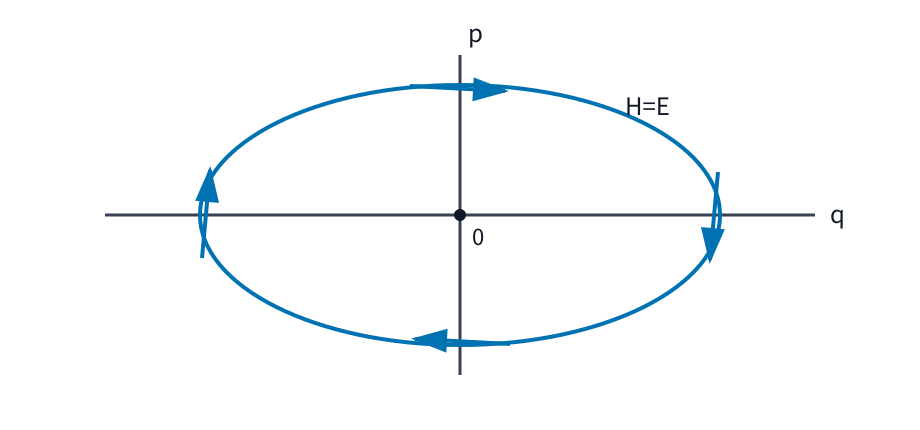

# AMECH5 Legendre 変換と Hamilton 形式

AMECH4 まで、運動は一般化座標 $q=(q_1,\ldots,q_n)$ と一般化速度 $\dot q$ を使い、ラグランジアン

$$
L(q,\dot q,t)
$$

から記述してきました。一般化運動量

$$
p_j
=
\frac{\partial L}{\partial \dot q_j}
$$

も導入しましたが、そこではまだ $p_j$ は「$q,\dot q,t$ から計算される量」でした。

ここから視点を変えます。

> **速度 $\dot q$ の代わりに共役運動量 $p$ を独立変数として使い、運動を $(q,p)$ の一階連立方程式として書けないか。**

この変換が可能なら、二階方程式である [AMECH2 の Lagrange 方程式](../AMECH2/index.md#thm-amech2-lagrange-equations)を

$$
\dot q_j
=
\frac{\partial H}{\partial p_j},
\qquad
\dot p_j
=
-
\frac{\partial H}{\partial q_j}
$$

という対称な形へ移せます。

ただし、単に

$$
p_j
=
\frac{\partial L}{\partial \dot q_j}
$$

と置くだけでは不十分です。$p$ を与えたときに $\dot q$ を戻せなければ、$(q,p)$ を新しい独立変数として使えません。

本章の流れは

$$
\text{速度から共役運動量}
\longrightarrow
\text{正則性と局所可逆性}
\longrightarrow
\text{Legendre 変換}
\longrightarrow
\text{新しい関数 }H
\longrightarrow
\text{二つの一階方程式}
\longrightarrow
\text{座標と運動量の空間}
$$

です。

---

## 1. 速度の代わりに共役運動量を使うには何が必要か

一次元調和振動子

$$
L(q,\dot q)
=
\frac12m\dot q^2
-
\frac12kq^2,
\qquad
m>0,\ k>0
$$

では、

$$
p
=
\frac{\partial L}{\partial \dot q}
=
m\dot q.
$$

したがって

$$
\dot q
=
\frac{p}{m}
$$

と一意に戻せます。

この例では、速度 $\dot q$ と共役運動量 $p$ の交換は何も難しくありません。

しかし、たとえば

$$
L(q,\dot q,t)
=
a(q,t)\dot q
-
V(q,t)
$$

なら

$$
p
=
\frac{\partial L}{\partial \dot q}
=
a(q,t)
$$

であり、$p$ は $\dot q$ をまったく覚えていません。異なる速度を入れても同じ $p$ が出ます。

Hamilton 形式へ移るには、まず

$$
(q,\dot q)
\longmapsto
(q,p)
$$

が少なくとも局所的に反転できる条件を明示する必要があります。

---

## 2. Legendre 写像と正則性

共役運動量への変換を写像としてまとめます。

<!-- formal-statement-start -->
> **定義（Legendre 写像）**  
> $L(q,\dot q,t)$ を速度変数について微分可能な $n$ 自由度のラグランジアン とする。時刻 $t$ を固定し、

$$
p_j
=
\frac{\partial L}{\partial\dot q_j}
\qquad
(j=1,\ldots,n)
$$

> と置く。$q$ を保ったまま

$$
\boxed{
\mathcal{F}L_t:
(q,\dot q)
\longmapsto
(q,p)
}
$$

> と送る写像を、本章では速度変数に関する Legendre 写像という。
<!-- formal-statement-end -->

<!-- definition-example-start: def-amech5-legendre-map -->
### 例：調和振動子の Legendre 写像

**定義の確認**

調和振動子では

$$
L(q,\dot q)
=
\frac12m\dot q^2-\frac12kq^2
$$

なので

$$
p=m\dot q.
$$

したがって

$$
\mathcal{F}L:
(q,\dot q)
\longmapsto
(q,m\dot q).
$$

$m>0$ だから逆写像は

$$
(q,p)
\longmapsto
\left(
q,\frac{p}{m}
\right)
$$

です。

この最小例では、Legendre 写像が「位置はそのままに、速度を共役運動量へ取り替える写像」であることがそのまま見えます。
<!-- definition-example-end -->

多自由度では、速度から運動量への局所可逆性を速度 Hessian で判定します。

<!-- formal-statement-start -->
> **定義（正則ラグランジアン）**  
> $L(q,\dot q,t)$ を速度変数について $C^2$ 級とする。速度 Hessian

$$
W(q,\dot q,t)
=
\left(
\frac{\partial^2L}
{\partial\dot q_i\partial\dot q_j}
\right)_{i,j=1}^n
$$

> が、考えている領域の各点で可逆であるとき、$L$ をその領域で正則であるという。
<!-- formal-statement-end -->

<!-- definition-example-start: def-amech5-regular-lagrangian -->
### 例：調和振動子は正則である

**定義の確認**

一次元調和振動子では

$$
\frac{\partial^2L}{\partial\dot q^2}
=
m.
$$

$m>0$ なので速度 Hessian は $1\times1$ 行列 $(m)$ であり、

$$
\det W=m\neq0.
$$

したがって調和振動子のラグランジアン は正則です。

一方、

$$
L(q,\dot q,t)
=
a(q,t)\dot q-V(q,t)
$$

では

$$
\frac{\partial^2L}{\partial\dot q^2}
=
0.
$$

この場合は正則ではなく、実際に

$$
p=a(q,t)
$$

から $\dot q$ を復元できません。

正則性は、単なる形式条件ではなく、**速度の情報が共役運動量へ移ったあとも失われないことを保証する条件**です。
<!-- definition-example-end -->

<!-- formal-statement-start -->
> **命題（正則性による局所速度回収）**  
> 時刻 $t$ を固定し、$L(q,\dot q,t)$ を $(q,\dot q)$ について $C^2$ 級とする。点 $(q_0,\dot q_0)$ で速度 Hessian

$$
W(q_0,\dot q_0,t)
$$

> が可逆であるとする。このとき Legendre 写像 $\mathcal{F}L_t$ は $(q_0,\dot q_0)$ を含む十分小さい領域で $C^1$ 級逆写像を持つ。したがって、その局所領域では速度を

$$
\boxed{
\dot q
=
v(q,p,t)
}
$$

> と $q,p,t$ の関数として一意に回収できる。
<!-- formal-statement-end -->

### 証明の見取り図

Legendre 写像全体

$$
(q,\dot q)
\longmapsto
(q,p(q,\dot q,t))
$$

の微分を見ます。

$q$ 成分はそのままなので、Jacobian はブロック三角形になります。右下ブロックが速度 Hessian $W$ です。$W$ が可逆なら Legendre 写像全体の微分も可逆です。

そこで [RA6A の逆関数定理](../RA6A/index.md#thm-ra6a-inverse-function)を適用します。

<!-- proof-start -->
### 証明

固定した $t$ に対して

$$
\Phi_t(q,\dot q)
=
\left(
q,
\frac{\partial L}{\partial\dot q}(q,\dot q,t)
\right)
$$

と置きます。これは Legendre 写像そのものです。

$(q,\dot q)$ に関する微分は、ブロック行列で

$$
D\Phi_t
=
\begin{pmatrix}
I & 0\\
\displaystyle
\frac{\partial p}{\partial q}
&
\displaystyle
\frac{\partial p}{\partial\dot q}
\end{pmatrix}.
$$

ここで

$$
\frac{\partial p_i}{\partial\dot q_j}
=
\frac{\partial^2L}
{\partial\dot q_i\partial\dot q_j}
$$

なので、右下ブロックはちょうど $W$ です。

したがって

$$
D\Phi_t(q_0,\dot q_0)
=
\begin{pmatrix}
I & 0\\
* & W(q_0,\dot q_0,t)
\end{pmatrix}.
$$

ブロック三角行列の行列式は対角ブロックの行列式の積だから

$$
\det D\Phi_t
=
\det I\,
\det W
=
\det W.
$$

仮定より

$$
\det W(q_0,\dot q_0,t)\neq0.
$$

よって $D\Phi_t(q_0,\dot q_0)$ は可逆です。

[逆関数定理](../RA6A/index.md#thm-ra6a-inverse-function)を $\Phi_t$ に適用すると、$(q_0,\dot q_0)$ を含む十分小さい領域で $\Phi_t$ は $C^1$ 級逆写像を持ちます。

Legendre 写像の第1成分は常に $q$ 自身なので、その逆写像も第1成分を $q$ に保ちます。従って第2成分をある $C^1$ 級関数 $v$ で

$$
\dot q=v(q,p,t)
$$

と書けます。
<!-- proof-end -->

ここで重要なのは **局所的** という語です。

速度 Hessian が各点で可逆でも、Legendre 写像が全領域で一対一とは限りません。本章で $(q,p,t)$ を独立変数とする新しい関数を構成するときは、必要な局所逆写像が選べる領域に制限して議論します。

---

## 3. Legendre 変換で新しい関数を作る

正則性によって

$$
\dot q=v(q,p,t)
$$

と速度を回収できるようになりました。

AMECH4 では Lagrangian energy を

$$
E_L
=
\sum_{j=1}^n
\dot q_jp_j-L
$$

と定義しました。

そこで、この同じ式から $\dot q$ を消し、独立変数を $(q,p,t)$ に取り替えた新しい関数を作ります。

<!-- formal-statement-start -->
> **定義（Hamiltonian）**  
> $L(q,\dot q,t)$ が正則で、ある領域で Legendre 写像を

$$
\dot q=v(q,p,t)
$$

> と局所的に反転できるとする。このとき

$$
\boxed{
H(q,p,t)
=
\sum_{j=1}^n
p_jv_j(q,p,t)
-
L(q,v(q,p,t),t)
}
$$

> を、その領域における Hamiltonian という。
<!-- formal-statement-end -->

<!-- definition-example-start: def-amech5-hamiltonian -->
### 例：調和振動子の Hamiltonian

**定義の確認**

$$
L(q,\dot q)
=
\frac12m\dot q^2-\frac12kq^2
$$

では

$$
p=m\dot q,
\qquad
\dot q=\frac{p}{m}.
$$

Hamiltonian の定義へ代入すると

$$
\begin{aligned}
H(q,p)
&=
p\frac{p}{m}
-
\left[
\frac12m
\left(
\frac{p}{m}
\right)^2
-
\frac12kq^2
\right]\\
&=
\frac{p^2}{m}
-
\frac{p^2}{2m}
+
\frac12kq^2\\
&=
\boxed{
\frac{p^2}{2m}
+
\frac12kq^2
}.
\end{aligned}
$$

速度表示の

$$
E_L
=
\frac12m\dot q^2+\frac12kq^2
$$

に $\dot q=p/m$ を代入したものと一致します。

ただし、ここで得た $H$ を見て

$$
H=\text{常に保存エネルギー}
$$

と結論してはいけません。Hamiltonian が時間に陽に依存すれば、一般には $H$ は時間変化します。保存条件は後で改めて確認します。
<!-- definition-example-end -->

---

## 4. Legendre 変換で何が消えるのか

Hamilton 方程式を導く核心は、$H$ を微分したときに $d\dot q$ の項が打ち消し合うことです。

この計算を一段ずつ行います。

<!-- formal-statement-start -->
> **命題（Hamiltonian の微分公式）**  
> 正則ラグランジアン $L(q,\dot q,t)$ と、その Legendre 変換で得られる Hamiltonian $H(q,p,t)$ を考える。対応する点で

$$
p_j
=
\frac{\partial L}{\partial\dot q_j}
$$

> が成り立つとき、

$$
\boxed{
dH
=
\sum_{j=1}^n
\dot q_j\,dp_j
-
\sum_{j=1}^n
\frac{\partial L}{\partial q_j}\,dq_j
-
\frac{\partial L}{\partial t}\,dt
}
$$

> が成り立つ。従って

$$
\boxed{
\frac{\partial H}{\partial p_j}
=
\dot q_j,
\qquad
\frac{\partial H}{\partial q_j}
=
-
\frac{\partial L}{\partial q_j},
\qquad
\frac{\partial H}{\partial t}
=
-
\frac{\partial L}{\partial t}
}
$$

> である。
<!-- formal-statement-end -->

### 証明の見取り図

出発点は

$$
H
=
\sum_jp_j\dot q_j-L
$$

です。

$\dot q$ はすでに $q,p,t$ の関数ですが、まず合成関数として全微分し、$d\dot q_j$ を残したまま書きます。

その後

$$
p_j
=
\frac{\partial L}{\partial\dot q_j}
$$

を使うと、$d\dot q_j$ の係数が 0 になります。

<!-- proof-start -->
### 証明

Hamiltonian を、Legendre 写像で対応する $\dot q=v(q,p,t)$ を暗黙に代入した形で

$$
H
=
\sum_jp_j\dot q_j-L(q,\dot q,t)
$$

と書きます。

全微分は

$$
dH
=
d\left(
\sum_jp_j\dot q_j
\right)
-
dL.
$$

積の微分から

$$
d\left(
\sum_jp_j\dot q_j
\right)
=
\sum_j
\dot q_j\,dp_j
+
\sum_j
p_j\,d\dot q_j.
$$

一方、

$$
dL
=
\sum_j
\frac{\partial L}{\partial q_j}\,dq_j
+
\sum_j
\frac{\partial L}{\partial\dot q_j}\,d\dot q_j
+
\frac{\partial L}{\partial t}\,dt.
$$

従って

$$
\begin{aligned}
dH
&=
\sum_j
\dot q_j\,dp_j
+
\sum_j
p_j\,d\dot q_j\\
&\quad-
\sum_j
\frac{\partial L}{\partial q_j}\,dq_j
-
\sum_j
\frac{\partial L}{\partial\dot q_j}\,d\dot q_j
-
\frac{\partial L}{\partial t}\,dt.
\end{aligned}
$$

Legendre 写像の定義から

$$
p_j
=
\frac{\partial L}{\partial\dot q_j}.
$$

従って

$$
\sum_j
\left(
p_j-\frac{\partial L}{\partial\dot q_j}
\right)
d\dot q_j
=
0.
$$

よって

$$
dH
=
\sum_j
\dot q_j\,dp_j
-
\sum_j
\frac{\partial L}{\partial q_j}\,dq_j
-
\frac{\partial L}{\partial t}\,dt.
$$

他方、$H=H(q,p,t)$ の全微分は

$$
dH
=
\sum_j
\frac{\partial H}{\partial q_j}\,dq_j
+
\sum_j
\frac{\partial H}{\partial p_j}\,dp_j
+
\frac{\partial H}{\partial t}\,dt.
$$

独立な微分 $dq_j,dp_j,dt$ の係数を比較すると

$$
\frac{\partial H}{\partial p_j}
=
\dot q_j,
$$

$$
\frac{\partial H}{\partial q_j}
=
-
\frac{\partial L}{\partial q_j},
$$

$$
\frac{\partial H}{\partial t}
=
-
\frac{\partial L}{\partial t}
$$

を得ます。
<!-- proof-end -->

この係数比較こそ Legendre 変換の中心です。

$L$ では速度 $\dot q$ が独立変数でしたが、$H$ では運動量 $p$ が独立変数になります。その交換を可能にするのが正則性です。

---

## 5. 二つの一階方程式へ

[AMECH2 の Lagrange 方程式](../AMECH2/index.md#thm-amech2-lagrange-equations)は

$
\frac{d}{dt}
\frac{\partial L}{\partial\dot q_j}
=
\frac{\partial L}{\partial q_j}
$$

でした。

左辺は

$$
\dot p_j
$$

です。

[Hamiltonian の微分公式](#prop-amech5-hamiltonian-differential)から

$$
\frac{\partial L}{\partial q_j}
=
-
\frac{\partial H}{\partial q_j}
$$

であり、また

$$
\dot q_j
=
\frac{\partial H}{\partial p_j}
$$

でした。

これをまとめると、次の二つの一階方程式を得ます。

<!-- formal-statement-start -->
> **定理（Hamilton の正準方程式と Lagrange 方程式の同値性）**  
> $L(q,\dot q,t)$ を正則な $C^2$ 級ラグランジアン とし、Legendre 写像を局所反転できる領域で Hamiltonian $H(q,p,t)$ を構成する。
>
> $C^2$ 級曲線 $q(t)$ が Lagrange 方程式を満たし、

$$
p_j(t)
=
\frac{\partial L}{\partial\dot q_j}
(q(t),\dot q(t),t)
$$

> と置くと、$(q(t),p(t))$ は

$$
\boxed{
\dot q_j
=
\frac{\partial H}{\partial p_j},
\qquad
\dot p_j
=
-
\frac{\partial H}{\partial q_j}
}
\qquad
(j=1,\ldots,n)
$$

> を満たす。
>
> 逆に、$(q(t),p(t))$ がこの正準方程式を満たし、Legendre 逆写像で

$$
\dot q=v(q,p,t)
$$

> と対応させるなら、$q(t)$ は Lagrange 方程式を満たす。
<!-- formal-statement-end -->

### 証明の見取り図

順方向では、

1. [Hamiltonian の微分公式](#prop-amech5-hamiltonian-differential)から $\dot q_j=H_{p_j}$。
2. [AMECH2 の Lagrange 方程式](../AMECH2/index.md#thm-amech2-lagrange-equations)から $\dot p_j=L_{q_j}$。
3. 再び微分公式から $L_{q_j}=-H_{q_j}$。

逆方向では同じ式を逆順に使います。

<!-- proof-start -->
### 証明

まず $q(t)$ が [AMECH2 の Lagrange 方程式](../AMECH2/index.md#thm-amech2-lagrange-equations)を満たすとします。

Legendre 写像で

$$
p_j
=
\frac{\partial L}{\partial\dot q_j}
$$

と定めます。

[Hamiltonian の微分公式](#prop-amech5-hamiltonian-differential)から

$
\frac{\partial H}{\partial p_j}
=
\dot q_j.
$$

従って

$$
\boxed{
\dot q_j
=
\frac{\partial H}{\partial p_j}
}.
$$

次に [AMECH2 の Lagrange 方程式](../AMECH2/index.md#thm-amech2-lagrange-equations)から

$
\dot p_j
=
\frac{d}{dt}
\frac{\partial L}{\partial\dot q_j}
=
\frac{\partial L}{\partial q_j}.
$$

[Hamiltonian の微分公式](#prop-amech5-hamiltonian-differential)は

$
\frac{\partial H}{\partial q_j}
=
-
\frac{\partial L}{\partial q_j}
$$

も与えるので

$$
\boxed{
\dot p_j
=
-
\frac{\partial H}{\partial q_j}
}.
$$

従って $(q,p)$ は Hamilton の正準方程式を満たします。

逆に、$(q,p)$ が

$$
\dot q_j
=
\frac{\partial H}{\partial p_j},
\qquad
\dot p_j
=
-
\frac{\partial H}{\partial q_j}
$$

を満たすとします。

Legendre 逆写像により

$$
\dot q=v(q,p,t)
$$

と対応させているので

$$
p_j
=
\frac{\partial L}{\partial\dot q_j}.
$$

また [Hamiltonian の微分公式](#prop-amech5-hamiltonian-differential)から

$
-
\frac{\partial H}{\partial q_j}
=
\frac{\partial L}{\partial q_j}.
$$

従って第2正準方程式は

$$
\frac{d}{dt}
\frac{\partial L}{\partial\dot q_j}
=
\frac{\partial L}{\partial q_j}
$$

となります。

すなわち

$$
\boxed{
\frac{d}{dt}
\frac{\partial L}{\partial\dot q_j}
-
\frac{\partial L}{\partial q_j}
=
0
},
$$

これは Lagrange 方程式です。
<!-- proof-end -->

二つの形式は別の物理法則ではありません。

正則性が成り立つ範囲では、

$$
(q,\dot q)
\quad\longleftrightarrow\quad
(q,p)
$$

という変数の取り方を変えて、同じ運動を記述しています。

---

## 6. $(q,p)$ で一時刻の運動を表す

Lagrange 形式では、ある時刻の運動を

$$
(q,\dot q)
$$

で表しました。

Hamilton 形式では、速度を共役運動量へ取り替えて

$$
(q,p)
$$

で表します。

<!-- formal-statement-start -->
> **定義（相空間）**  
> Hamilton 形式で、一般化座標

$$
q=(q_1,\ldots,q_n)
$$

> と共役運動量

$$
p=(p_1,\ldots,p_n)
$$

> を独立な局所座標として一時刻の運動を表す空間を相空間という。本章の局所座標表示では、$n$ 自由度の相空間は $2n$ 個の座標

$$
(q_1,\ldots,q_n,p_1,\ldots,p_n)
$$

> を持つ。
<!-- formal-statement-end -->

<!-- definition-example-start: def-amech5-phase-space -->
### 例：調和振動子の一時刻の運動は $(q,p)$ の一点である

**定義の確認**

一次元調和振動子では相空間は $(q,p)$ 平面です。

Hamiltonian は

$$
H(q,p)
=
\frac{p^2}{2m}
+
\frac12kq^2.
$$

ある時刻に

$$
q=q_0,
\qquad
p=p_0
$$

なら、その時刻の運動は $(q,p)$ 平面上の一点

$$
(q_0,p_0)
$$

です。

Hamilton 方程式は

$$
\dot q
=
\frac{\partial H}{\partial p}
=
\frac{p}{m},
$$

$$
\dot p
=
-
\frac{\partial H}{\partial q}
=
-kq.
$$

従って$(q,p)$ 平面上の各点には

$$
\left(
\frac{p}{m},
-kq
\right)
$$

という進行方向が対応します。
<!-- definition-example-end -->

時間に陽に依存しない調和振動子では、後で示すように $H$ が一定です。$H=E>0$ とすると

$$
\frac{p^2}{2m}
+
\frac12kq^2
=
E.
$$

両辺を $E$ で割れば

$$
\frac{q^2}{2E/k}
+
\frac{p^2}{2mE}
=
1.
$$

従って等エネルギー曲線は楕円です。

次の図では、横軸が $q$、縦軸が $p$ です。上側では $p>0$ なので $\dot q>0$、右側では $q>0$ なので $\dot p<0$ です。従って運動は時計回りに進みます。

この図は「実空間で質点が楕円運動する」という意味ではありません。

相空間の楕円は、**一つの時刻における位置 $q$ と運動量 $p$ の組がどう変化するか**を表しています。

---

## 7. いつ $H=T+V$ になるのか

数理量子力学で頻繁に現れる

$$
H(q,p)
=
\frac{p^2}{2m}+V(q)
$$

は重要ですが、すべてのラグランジアン に対して自動的に成立する式ではありません。

まず、多自由度の自然なラグランジアン で成立条件を確認します。

<!-- formal-statement-start -->
> **命題（自然なラグランジアンの Hamiltonian）**  
> $M(q)$ を各 $q$ で実対称正定値な $n\times n$ 行列とし、

$$
L(q,\dot q,t)
=
\frac12
\dot q^{\mathsf T}
M(q)
\dot q
-
V(q,t)
$$

> とする。このとき $L$ は正則で、

$$
p=M(q)\dot q,
\qquad
\dot q=M(q)^{-1}p
$$

> である。Hamiltonian は

$$
\boxed{
H(q,p,t)
=
\frac12
p^{\mathsf T}
M(q)^{-1}p
+
V(q,t)
}
$$

> となる。
<!-- formal-statement-end -->

### 証明の見取り図

$M(q)$ は対称なので、二次形式の速度微分は

$$
p=M(q)\dot q
$$

です。

速度 Hessian は $M(q)$ そのものです。正定値行列は可逆なので速度を戻せます。

その後

$$
H=p^{\mathsf T}\dot q-L
$$

へ代入します。

<!-- proof-start -->
### 証明

運動エネルギー部分を

$$
T(q,\dot q)
=
\frac12
\dot q^{\mathsf T}
M(q)
\dot q
$$

と置きます。

$M(q)$ は対称なので

$$
\frac{\partial T}{\partial\dot q}
=
M(q)\dot q.
$$

従って

$$
p
=
\frac{\partial L}{\partial\dot q}
=
M(q)\dot q.
$$

さらに速度 Hessian は

$$
W
=
\frac{\partial p}{\partial\dot q}
=
M(q).
$$

$M(q)$ は正定値なので、$x\neq0$ に対して

$$
x^{\mathsf T}M(q)x>0.
$$

もし $M(q)x=0$ なら左辺は 0 になって矛盾するため、$M(q)$ は可逆です。

従って

$$
\dot q
=
M(q)^{-1}p.
$$

Hamiltonian は

$$
H
=
p^{\mathsf T}\dot q
-
L.
$$

ここで $p=M\dot q$ だから

$$
p^{\mathsf T}\dot q
=
\dot q^{\mathsf T}M\dot q.
$$

従って

$$
\begin{aligned}
H
&=
\dot q^{\mathsf T}M\dot q
-
\left(
\frac12
\dot q^{\mathsf T}M\dot q
-
V
\right)\\
&=
\frac12
\dot q^{\mathsf T}M\dot q
+
V.
\end{aligned}
$$

最後に

$$
\dot q=M^{-1}p
$$

を代入します。$M$ と $M^{-1}$ は対称なので

$$
\begin{aligned}
\dot q^{\mathsf T}M\dot q
&=
(M^{-1}p)^{\mathsf T}
M
(M^{-1}p)\\
&=
p^{\mathsf T}
M^{-1}
M
M^{-1}
p\\
&=
p^{\mathsf T}
M^{-1}p.
\end{aligned}
$$

よって

$$
\boxed{
H
=
\frac12
p^{\mathsf T}
M^{-1}p
+
V
}.
$$
<!-- proof-end -->

一次元 Cartesian 座標で

$$
M=m
$$

なら

$$
\boxed{
H(q,p,t)
=
\frac{p^2}{2m}
+
V(q,t)
}.
$$

これが数理量子力学で使う古典 Hamiltonian の基本形です。

ただし、一般化座標では $M(q)$ が $q$ に依存します。また速度に一次の項があるラグランジアン では、共役運動量 $p$ が単純な $m\dot q$ ではないため、Hamiltonian を機械的に $p^2/(2m)+V$ と書くことはできません。

---

## 8. Hamiltonian はいつ保存するか

Hamiltonian に時間依存がある場合を確認します。

<!-- formal-statement-start -->
> **命題（Hamiltonian の時間変化）**  
> $H(q,p,t)$ に対して Hamilton の正準方程式

$$
\dot q_j
=
\frac{\partial H}{\partial p_j},
\qquad
\dot p_j
=
-
\frac{\partial H}{\partial q_j}
$$

> を満たす軌道を考える。このとき

$$
\boxed{
\frac{dH}{dt}
=
\frac{\partial H}{\partial t}
}
$$

> である。
>
> さらに $H$ が正則ラグランジアン $L$ の Legendre 変換であるなら

$$
\boxed{
\frac{dH}{dt}
=
\frac{\partial H}{\partial t}
=
-
\frac{\partial L}{\partial t}
}
$$

> が成り立つ。従って $L$ が $t$ に陽に依存しなければ $H$ は保存する。
<!-- formal-statement-end -->

### 証明の見取り図

$H(q(t),p(t),t)$ を連鎖律で時間微分します。

$q$ と $p$ から来る二つの和は、Hamilton 方程式を代入すると項ごとに打ち消し合います。

<!-- proof-start -->
### 証明

連鎖律から

$$
\frac{dH}{dt}
=
\sum_j
\frac{\partial H}{\partial q_j}\dot q_j
+
\sum_j
\frac{\partial H}{\partial p_j}\dot p_j
+
\frac{\partial H}{\partial t}.
$$

Hamilton 方程式

$$
\dot q_j
=
\frac{\partial H}{\partial p_j},
\qquad
\dot p_j
=
-
\frac{\partial H}{\partial q_j}
$$

を代入すると

$$
\begin{aligned}
\frac{dH}{dt}
&=
\sum_j
\frac{\partial H}{\partial q_j}
\frac{\partial H}{\partial p_j}\\
&\quad-
\sum_j
\frac{\partial H}{\partial p_j}
\frac{\partial H}{\partial q_j}
+
\frac{\partial H}{\partial t}\\
&=
\frac{\partial H}{\partial t}.
\end{aligned}
$$

また [Hamiltonian の微分公式](#prop-amech5-hamiltonian-differential)から

$$
\frac{\partial H}{\partial t}
=
-
\frac{\partial L}{\partial t}.
$$

従って

$$
\boxed{
\frac{dH}{dt}
=
\frac{\partial H}{\partial t}
=
-
\frac{\partial L}{\partial t}
}.
$$
<!-- proof-end -->

AMECH4 の Lagrangian energy に対する

$$
\frac{dE_L}{dt}
=
-
\frac{\partial L}{\partial t}
$$

と同じ内容が、Legendre 変換後の変数で現れています。

したがって区別すべきなのは

- Hamiltonian を定義できること。
- Hamiltonian が通常の力学的エネルギーと一致すること。
- Hamiltonian が時間に沿って保存すること。

の三つです。

これらは同じ命題ではありません。

---

## 9. 中心力を Hamilton 形式へ移す

平面極座標 $(r,\theta)$ で、中心ポテンシャル $V(r)$ のもとを動く質点を考えます。

ラグランジアン は

$$
L
=
\frac{m}{2}
\left(
\dot r^2+r^2\dot\theta^2
\right)
-
V(r),
\qquad
r>0.
$$

共役運動量は

$$
p_r
=
\frac{\partial L}{\partial\dot r}
=
m\dot r,
$$

$$
p_\theta
=
\frac{\partial L}{\partial\dot\theta}
=
mr^2\dot\theta.
$$

従って

$$
\dot r
=
\frac{p_r}{m},
$$

$$
\dot\theta
=
\frac{p_\theta}{mr^2}.
$$

Hamiltonian を計算します。

まず

$$
p_r\dot r+p_\theta\dot\theta
=
m\dot r^2
+
mr^2\dot\theta^2.
$$

従って

$$
\begin{aligned}
H
&=
p_r\dot r+p_\theta\dot\theta-L\\
&=
\frac{m}{2}
\left(
\dot r^2+r^2\dot\theta^2
\right)
+
V(r).
\end{aligned}
$$

速度を $p$ で置き換えると

$$
\boxed{
H(r,\theta,p_r,p_\theta)
=
\frac{p_r^2}{2m}
+
\frac{p_\theta^2}{2mr^2}
+
V(r)
}.
$$

ここから Hamilton 方程式を一つずつ計算します。

$r$ について

$$
\dot r
=
\frac{\partial H}{\partial p_r}
=
\frac{p_r}{m}.
$$

$\theta$ について

$$
\dot\theta
=
\frac{\partial H}{\partial p_\theta}
=
\frac{p_\theta}{mr^2}.
$$

$p_r$ については

$$
\dot p_r
=
-
\frac{\partial H}{\partial r}.
$$

$r$ 微分を途中まで書くと

$$
\frac{\partial}{\partial r}
\left(
\frac{p_\theta^2}{2mr^2}
\right)
=
\frac{p_\theta^2}{2m}
(-2)r^{-3}
=
-
\frac{p_\theta^2}{mr^3}.
$$

従って

$$
\frac{\partial H}{\partial r}
=
-
\frac{p_\theta^2}{mr^3}
+
V'(r),
$$

よって

$$
\boxed{
\dot p_r
=
\frac{p_\theta^2}{mr^3}
-
V'(r)
}.
$$

最後に $H$ は $\theta$ に依存しないので

$$
\boxed{
\dot p_\theta
=
-
\frac{\partial H}{\partial\theta}
=
0
}.
$$

AMECH4 で得た

$$
p_\theta
=
mr^2\dot\theta
=
\text{一定}
$$

が、Hamilton 形式では「Hamiltonian が $\theta$ に依存しないため $p_\theta$ の時間微分が 0」という形でそのまま現れます。

---

## 10. 共役運動量は力学的運動量とは限らない

最後に、共役運動量を $m\dot q$ と機械的に同一視すると何が起きるかを確認します。

定数 $a$ に対して

$$
L(q,\dot q)
=
\frac12m\dot q^2
+
aq\dot q
-
V(q)
$$

を考えます。

第2項は

$$
aq\dot q
=
\frac{d}{dt}
\left(
\frac{a}{2}q^2
\right)
$$

なので、AMECH3 で見たように Euler--Lagrange 方程式は

$$
L_0
=
\frac12m\dot q^2-V(q)
$$

と同じです。

しかし共役運動量は

$$
p
=
\frac{\partial L}{\partial\dot q}
=
m\dot q+aq
$$

です。

従って

$$
\dot q
=
\frac{p-aq}{m}.
$$

Hamiltonian は

$$
\begin{aligned}
H
&=
p\dot q-L\\
&=
(m\dot q+aq)\dot q
-
\left(
\frac12m\dot q^2+aq\dot q-V
\right)\\
&=
\frac12m\dot q^2+V(q).
\end{aligned}
$$

さらに $p$ で書けば

$$
\boxed{
H(q,p)
=
\frac{(p-aq)^2}{2m}
+
V(q)
}.
$$

同じ運動方程式を記述していても、ラグランジアン へ全微分を加えると共役運動量の式は変わります。

Hamilton 形式では「何を $p$ と呼んでいるか」を、必ず

$$
p=\frac{\partial L}{\partial\dot q}
$$

から確認する必要があります。

---

## 11. 本章で何ができるようになったか

Lagrange 形式では運動の瞬間データを $(q,\dot q)$ で表し、二階の [Euler--Lagrange 方程式](../AMECH2/index.md#thm-amech2-lagrange-equations)を使いました。

本章では正則性を確認した上で

$$
(q,\dot q)
\longleftrightarrow
(q,p)
$$

と変数を取り替え、

$$
H
=
p\cdot\dot q-L
$$

から

$$
\boxed{
\dot q_j
=
\frac{\partial H}{\partial p_j},
\qquad
\dot p_j
=
-
\frac{\partial H}{\partial q_j}
}
$$

を導きました。

特に押さえる点は次です。

- Legendre 写像が速度の情報を保つには正則性が必要。
- 正則性は速度 Hessian の可逆性で判定する。
- Hamiltonian の微分では $d\dot q$ の項が Legendre 関係によって消える。
- 正則な範囲では Hamilton 方程式と Lagrange 方程式は同じ運動を記述する。
- 相空間では運動の瞬間データを $(q,p)$ の一点として見る。
- $H=T+V$ は自然なラグランジアン など、成立条件を確認して使う。
- $H$ が保存するのは $\partial H/\partial t=0$ のときであり、Hamiltonian であること自体は保存を意味しない。

次章 AMECH6 では、任意の観測量 $f(q,p,t)$ の時間変化を一つの二項演算で書きます。そこで

$$
\{q_i,p_j\}
=
\delta_{ij}
$$

を基本関係とする Poisson 括弧が現れ、Hamiltonian が相空間上の時間発展を生成するという見方へ進みます。

---

# 演習

## Level A

### A1. 調和振動子を Hamilton 形式へ移す

$$
L(q,\dot q)
=
\frac12m\dot q^2
-
\frac12kq^2,
\qquad
m>0,\ k>0
$$

とする。

1.共役運動量$p$ を求めよ。
2. 速度 Hessian を求め、正則性を確認せよ。
3. $\dot q$ を $q,p$ の関数として求めよ。
4. Hamiltonian を求めよ。
5. Hamilton の正準方程式を求め、$m\ddot q+kq=0$ を再現せよ。

- Level: A

<!-- solution-start -->
#### 詳細解答

共役運動量は

$$
p
=
\frac{\partial L}{\partial\dot q}
=
m\dot q.
$$

速度 Hessian は

$$
W
=
\frac{\partial^2L}{\partial\dot q^2}
=
m.
$$

$m>0$ なので

$$
W\neq0.
$$

従って $L$ は正則です。

$p=m\dot q$ から

$$
\dot q
=
\frac{p}{m}.
$$

Hamiltonian は

$$
H
=
p\dot q-L.
$$

$\dot q=p/m$ を代入して

$$
\begin{aligned}
H
&=
\frac{p^2}{m}
-
\left[
\frac12m
\left(
\frac{p}{m}
\right)^2
-
\frac12kq^2
\right]\\
&=
\boxed{
\frac{p^2}{2m}
+
\frac12kq^2
}.
\end{aligned}
$$

第1正準方程式は

$$
\dot q
=
\frac{\partial H}{\partial p}
=
\frac{p}{m}.
$$

第2正準方程式は

$$
\dot p
=
-
\frac{\partial H}{\partial q}
=
-kq.
$$

$p=m\dot q$ を時間微分すると

$$
\dot p
=
m\ddot q.
$$

従って

$$
m\ddot q
=
-kq,
$$

すなわち

$$
\boxed{
m\ddot q+kq=0
}.
$$
<!-- solution-end -->

---

### A2. 正則なラグランジアン と特異なラグランジアン

次の一次元ラグランジアン を考える。

$$
L_1(q,\dot q)
=
\frac12m\dot q^2-V(q),
\qquad
m>0,
$$

$$
L_2(q,\dot q,t)
=
a(q,t)\dot q-V(q,t).
$$

1. それぞれの共役運動量を求めよ。
2. それぞれの速度 Hessian を求めよ。
3. 正則性を判定せよ。
4. $L_2$ で $p$ から $\dot q$ を回収できない理由を説明せよ。

- Level: A

<!-- solution-start -->
#### 詳細解答

$L_1$ では

$$
p_1
=
\frac{\partial L_1}{\partial\dot q}
=
m\dot q.
$$

従って速度 Hessian は

$$
\frac{\partial p_1}{\partial\dot q}
=
m.
$$

$m>0$ だから

$$
m\neq0,
$$

よって $L_1$ は正則です。

実際、

$$
\dot q
=
\frac{p_1}{m}
$$

と速度を回収できます。

一方 $L_2$ では

$$
p_2
=
\frac{\partial L_2}{\partial\dot q}
=
a(q,t).
$$

従って

$$
\frac{\partial p_2}{\partial\dot q}
=
0.
$$

速度 Hessian は 0 なので $L_2$ は正則ではありません。

しかも $p_2=a(q,t)$ は $\dot q$ を含みません。同じ $(q,t)$ でどの速度を選んでも同じ $p_2$ になるため、

$$
p_2
\longmapsto
\dot q
$$

を一意に定めることはできません。
<!-- solution-end -->

---

### A3. 相空間での進行方向

調和振動子

$$
H(q,p)
=
\frac{p^2}{2m}
+
\frac12kq^2
$$

を考える。

1. 位相点 $(q,p)=(0,p_0)$ での $(\dot q,\dot p)$ を求めよ。
2. $p_0>0$ のとき、$(q,p)$ 平面ではどちら向きへ進み始めるか。
3. 位相点 $(q,p)=(q_0,0)$ での $(\dot q,\dot p)$ を求めよ。
4. $q_0>0$ のとき、$(q,p)$ 平面ではどちら向きへ進み始めるか。

- Level: A

<!-- solution-start -->
#### 詳細解答

Hamilton 方程式は

$$
\dot q
=
\frac{p}{m},
\qquad
\dot p
=
-kq.
$$

$(q,p)=(0,p_0)$ では

$$
\dot q
=
\frac{p_0}{m},
\qquad
\dot p
=
0.
$$

従って

$$
\boxed{
(\dot q,\dot p)
=
\left(
\frac{p_0}{m},0
\right)
}.
$$

$p_0>0$ なら $\dot q>0$ なので、$(q,p)$ 平面では右向きに進み始めます。

次に $(q,p)=(q_0,0)$ では

$$
\dot q=0,
$$

$$
\dot p=-kq_0.
$$

従って

$$
\boxed{
(\dot q,\dot p)
=
(0,-kq_0)
}.
$$

$q_0>0$ なら $\dot p<0$ なので、$(q,p)$ 平面では下向きに進み始めます。

上側で右向き、右側で下向きなので、等エネルギー楕円を時計回りに進むことと一致します。
<!-- solution-end -->

---

### A4. 対角質量行列の自然なラグランジアン

$$
L(q_1,q_2,\dot q_1,\dot q_2)
=
\frac12m_1\dot q_1^2
+
\frac12m_2\dot q_2^2
-
V(q_1,q_2),
$$

$$
m_1>0,\qquad m_2>0
$$

とする。

1. $p_1,p_2$ を求めよ。
2. 速度 Hessian を書き、正則性を確認せよ。
3. $\dot q_1,\dot q_2$ を $p_1,p_2$ で表せ。
4. Hamiltonian を求めよ。

- Level: A

<!-- solution-start -->
#### 詳細解答

共役運動量は

$$
p_1
=
\frac{\partial L}{\partial\dot q_1}
=
m_1\dot q_1,
$$

$$
p_2
=
\frac{\partial L}{\partial\dot q_2}
=
m_2\dot q_2.
$$

速度 Hessian は

$$
W
=
\begin{pmatrix}
m_1 & 0\\
0 & m_2
\end{pmatrix}.
$$

行列式は

$$
\det W
=
m_1m_2>0.
$$

従って $W$ は可逆で、$L$ は正則です。

速度は

$$
\dot q_1
=
\frac{p_1}{m_1},
\qquad
\dot q_2
=
\frac{p_2}{m_2}.
$$

Hamiltonian は

$$
H
=
p_1\dot q_1+p_2\dot q_2-L.
$$

代入すると

$$
\begin{aligned}
H
&=
\frac{p_1^2}{m_1}
+
\frac{p_2^2}{m_2}\\
&\quad-
\left(
\frac{p_1^2}{2m_1}
+
\frac{p_2^2}{2m_2}
-
V
\right)\\
&=
\boxed{
\frac{p_1^2}{2m_1}
+
\frac{p_2^2}{2m_2}
+
V(q_1,q_2)
}.
\end{aligned}
$$
<!-- solution-end -->

---

## Level B

### B1. Hamiltonian の微分公式を自分で導く

正則ラグランジアン $L(q,\dot q,t)$ と

$$
H
=
\sum_jp_j\dot q_j-L
$$

を考える。

1. $d(\sum_jp_j\dot q_j)$ を積の微分で展開せよ。
2. $dL$ を $dq_j,d\dot q_j,dt$ で展開せよ。
3. $p_j=\partial L/\partial\dot q_j$ を使って $d\dot q_j$ の項が消えることを示せ。
4. $dH$ の係数比較から $H_{p_j},H_{q_j},H_t$ を求めよ。

- Level: B

<!-- solution-start -->
#### 詳細解答

まず

$$
d\left(
\sum_jp_j\dot q_j
\right)
=
\sum_j
\dot q_j\,dp_j
+
\sum_j
p_j\,d\dot q_j.
$$

次に

$$
dL
=
\sum_j
\frac{\partial L}{\partial q_j}\,dq_j
+
\sum_j
\frac{\partial L}{\partial\dot q_j}\,d\dot q_j
+
\frac{\partial L}{\partial t}\,dt.
$$

従って

$$
\begin{aligned}
dH
&=
\sum_j
\dot q_j\,dp_j
+
\sum_j
p_j\,d\dot q_j\\
&\quad-
\sum_j
\frac{\partial L}{\partial q_j}\,dq_j
-
\sum_j
\frac{\partial L}{\partial\dot q_j}\,d\dot q_j
-
\frac{\partial L}{\partial t}\,dt.
\end{aligned}
$$

ここで

$$
p_j
=
\frac{\partial L}{\partial\dot q_j}
$$

なので

$$
p_j\,d\dot q_j
-
\frac{\partial L}{\partial\dot q_j}\,d\dot q_j
=
0.
$$

従って

$$
\boxed{
dH
=
\sum_j
\dot q_j\,dp_j
-
\sum_j
\frac{\partial L}{\partial q_j}\,dq_j
-
\frac{\partial L}{\partial t}\,dt
}.
$$

一方

$$
dH
=
\sum_j
\frac{\partial H}{\partial q_j}\,dq_j
+
\sum_j
\frac{\partial H}{\partial p_j}\,dp_j
+
\frac{\partial H}{\partial t}\,dt.
$$

係数比較から

$$
\boxed{
\frac{\partial H}{\partial p_j}
=
\dot q_j
},
$$

$$
\boxed{
\frac{\partial H}{\partial q_j}
=
-
\frac{\partial L}{\partial q_j}
},
$$

$$
\boxed{
\frac{\partial H}{\partial t}
=
-
\frac{\partial L}{\partial t}
}
$$

を得ます。
<!-- solution-end -->

---

### B2. 中心力の Hamiltonian と角運動量保存

$$
L
=
\frac{m}{2}
\left(
\dot r^2+r^2\dot\theta^2
\right)
-
V(r),
\qquad
r>0
$$

とする。

1. $p_r,p_\theta$ を求めよ。
2. $\dot r,\dot\theta$ を $p_r,p_\theta$ で表せ。
3. Hamiltonian を求めよ。
4. 4本の Hamilton 方程式を求めよ。
5. $p_\theta$ が保存する理由を Hamiltonian の $\theta$ 依存性から説明せよ。

- Level: B

<!-- solution-start -->
#### 詳細解答

共役運動量は

$$
p_r
=
\frac{\partial L}{\partial\dot r}
=
m\dot r,
$$

$$
p_\theta
=
\frac{\partial L}{\partial\dot\theta}
=
mr^2\dot\theta.
$$

従って

$$
\dot r
=
\frac{p_r}{m},
$$

$$
\dot\theta
=
\frac{p_\theta}{mr^2}.
$$

Hamiltonian は

$$
H
=
p_r\dot r+p_\theta\dot\theta-L.
$$

速度表示では

$$
H
=
\frac{m}{2}
\left(
\dot r^2+r^2\dot\theta^2
\right)
+
V(r).
$$

速度を運動量で置き換えると

$$
\boxed{
H
=
\frac{p_r^2}{2m}
+
\frac{p_\theta^2}{2mr^2}
+
V(r)
}.
$$

第1組の正準方程式は

$$
\boxed{
\dot r
=
\frac{\partial H}{\partial p_r}
=
\frac{p_r}{m}
},
$$

$$
\boxed{
\dot\theta
=
\frac{\partial H}{\partial p_\theta}
=
\frac{p_\theta}{mr^2}
}.
$$

第2組では

$$
\frac{\partial H}{\partial r}
=
-
\frac{p_\theta^2}{mr^3}
+
V'(r),
$$

なので

$$
\boxed{
\dot p_r
=
-
\frac{\partial H}{\partial r}
=
\frac{p_\theta^2}{mr^3}
-
V'(r)
}.
$$

また $H$ は $\theta$ に依存しないため

$$
\frac{\partial H}{\partial\theta}=0.
$$

従って

$$
\boxed{
\dot p_\theta
=
-
\frac{\partial H}{\partial\theta}
=
0
}.
$$

よって

$$
\boxed{
p_\theta=mr^2\dot\theta=\text{一定}
}.
$$

Hamilton 形式では、循環座標 $\theta$ に対応する保存則が第2正準方程式から直接読めます。
<!-- solution-end -->

---

### B3. 時間依存調和振動子では Hamiltonian は保存するか

$$
L(q,\dot q,t)
=
\frac12m\dot q^2
-
\frac12k(t)q^2,
\qquad
m>0
$$

とし、$k$ は $C^1$ 級とする。

1. $p$ と Hamiltonian $H$ を求めよ。
2. $\partial H/\partial t$ を求めよ。
3. $dH/dt$ を求めよ。
4. $k'(t)=0$ の場合と $k'(t)\neq0$ の場合を比較せよ。
5. $-\partial L/\partial t$ と一致することを確認せよ。

- Level: B

<!-- solution-start -->
#### 詳細解答

共役運動量は

$$
p
=
\frac{\partial L}{\partial\dot q}
=
m\dot q.
$$

従って

$$
\dot q
=
\frac{p}{m}.
$$

Hamiltonian は

$$
\begin{aligned}
H
&=
p\dot q-L\\
&=
\frac{p^2}{m}
-
\left[
\frac{p^2}{2m}
-
\frac12k(t)q^2
\right]\\
&=
\boxed{
\frac{p^2}{2m}
+
\frac12k(t)q^2
}.
\end{aligned}
$$

$q,p$ を固定して $t$ で偏微分すると

$$
\boxed{
\frac{\partial H}{\partial t}
=
\frac12k'(t)q^2
}.
$$

Hamilton 方程式を満たす軌道では

$$
\frac{dH}{dt}
=
\frac{\partial H}{\partial t}
$$

なので

$$
\boxed{
\frac{dH}{dt}
=
\frac12k'(t)q^2
}.
$$

$k'(t)=0$ なら

$$
\frac{dH}{dt}=0
$$

であり、$H$ は保存します。

一方 $k'(t)\neq0$ なら、一般には

$$
\frac{dH}{dt}\neq0
$$

です。

ラグランジアンの陽な時間微分は

$$
\frac{\partial L}{\partial t}
=
-
\frac12k'(t)q^2.
$$

従って

$$
-\frac{\partial L}{\partial t}
=
\frac12k'(t)q^2
=
\frac{dH}{dt}.
$$

確かに

$$
\boxed{
\frac{dH}{dt}
=
-
\frac{\partial L}{\partial t}
}
$$

が成り立ちます。
<!-- solution-end -->

---

## Level C

### C1. total derivative を加えると共役運動量と Hamiltonian はどう変わるか

$m>0$、$a$ を定数とし、

$$
L(q,\dot q)
=
\frac12m\dot q^2
+
aq\dot q
-
V(q)
$$

を考える。$V$ は $C^2$ 級とする。

1. $aq\dot q$ が total derivative であることを示せ。
2. Euler--Lagrange 方程式を直接計算し、$m\ddot q+V'(q)=0$ を得よ。
3.共役運動量$p$ を求め、$\dot q$ を $q,p$ で表せ。
4. Hamiltonian $H(q,p)$ を求めよ。
5. Hamilton の正準方程式を求めよ。
6. 第2正準方程式と $p=m\dot q+aq$ を組み合わせて、再び $m\ddot q+V'(q)=0$ を導け。
7. この例で $p$ と力学的運動量 $m\dot q$ が一致しないことの意味を説明せよ。

- Level: C

<!-- solution-start -->
#### 詳細解答

まず

$$
\frac{d}{dt}
\left(
\frac{a}{2}q^2
\right)
=
aq\dot q.
$$

従って

$$
aq\dot q
$$

は total derivative です。

Euler--Lagrange 方程式を直接確認します。

位置微分は

$$
\frac{\partial L}{\partial q}
=
a\dot q
-
V'(q).
$$

速度微分は

$$
\frac{\partial L}{\partial\dot q}
=
m\dot q+aq.
$$

時間微分すると

$$
\frac{d}{dt}
\frac{\partial L}{\partial\dot q}
=
m\ddot q+a\dot q.
$$

従って Euler--Lagrange 方程式は

$$
m\ddot q+a\dot q
-
\left(
a\dot q-V'(q)
\right)
=
0.
$$

$a\dot q$ が消えて

$$
\boxed{
m\ddot q+V'(q)=0
}.
$$

次に共役運動量は

$$
\boxed{
p
=
m\dot q+aq
}.
$$

従って

$$
\boxed{
\dot q
=
\frac{p-aq}{m}
}.
$$

Hamiltonian は

$$
H=p\dot q-L.
$$

$p=m\dot q+aq$ を使うと

$$
\begin{aligned}
H
&=
(m\dot q+aq)\dot q
-
\left(
\frac12m\dot q^2
+
aq\dot q
-
V
\right)\\
&=
\frac12m\dot q^2+V(q).
\end{aligned}
$$

さらに

$$
\dot q=\frac{p-aq}{m}
$$

を代入して

$$
\boxed{
H(q,p)
=
\frac{(p-aq)^2}{2m}
+
V(q)
}.
$$

第1正準方程式は

$$
\begin{aligned}
\dot q
&=
\frac{\partial H}{\partial p}\\
&=
\frac{p-aq}{m}.
\end{aligned}
$$

これは Legendre 逆写像と一致します。

第2正準方程式のために $q$ 微分を計算します。

$$
\begin{aligned}
\frac{\partial H}{\partial q}
&=
\frac{1}{2m}
\cdot
2(p-aq)(-a)
+
V'(q)\\
&=
-
\frac{a}{m}(p-aq)
+
V'(q).
\end{aligned}
$$

従って

$$
\begin{aligned}
\dot p
&=
-
\frac{\partial H}{\partial q}\\
&=
\frac{a}{m}(p-aq)
-
V'(q)\\
&=
a\dot q
-
V'(q).
\end{aligned}
$$

一方

$$
p=m\dot q+aq
$$

を時間微分すると

$$
\dot p
=
m\ddot q+a\dot q.
$$

二つの $\dot p$ を等置して

$$
m\ddot q+a\dot q
=
a\dot q-V'(q).
$$

従って

$$
\boxed{
m\ddot q+V'(q)=0
}.
$$

確かに Lagrange 形式と同じ運動方程式が再現されました。

この例では

$$
p
=
m\dot q+aq
$$

なので、共役運動量 $p$ は力学的運動量 $m\dot q$ と一致しません。

したがって Hamilton 形式で現れる $p$ を見て、座標系やラグランジアンの形を確認せずに「質量×速度」と解釈するのは誤りです。

共役運動量の正本はあくまで

$$
\boxed{
p
=
\frac{\partial L}{\partial\dot q}
}
$$

という定義です。
<!-- solution-end -->
