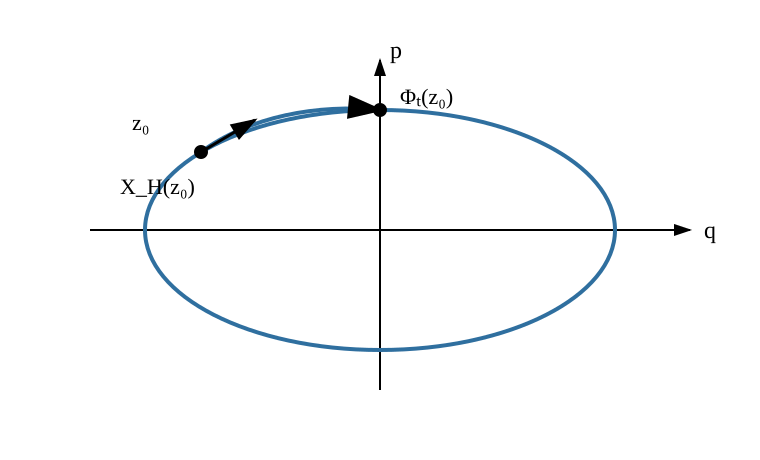

# AMECH6 Poisson 括弧と Hamiltonian flow

AMECH5 では、正則なラグランジアンから相空間の座標 $(q,p)$ と Hamiltonian $H(q,p,t)$ を作り、運動を

$$
\dot q_i
=
\frac{\partial H}{\partial p_i},
\qquad
\dot p_i
=
-
\frac{\partial H}{\partial q_i}
$$

という一階連立方程式で書きました。

この形まで来ると、座標 $q_i$ と運動量 $p_i$ だけでなく、相空間上の任意の関数

$$
f(q,p,t)
$$

が運動に沿ってどう変わるかを一つずつ連鎖律で計算できます。しかし運動中に一定となる量が増え、対称性や座標変換を扱うようになると、毎回同じ偏微分の組合せを書くのは構造を見えにくくします。

そこで本章では次の問いを考えます。

> **相空間上の関数どうしの関係を一つの演算で表し、その演算だけから時間発展・一定量・回転・流れを読めないか。**

この二項演算を、次節で正確に定義します。

本章の流れは

$$
\text{正準座標}
\longrightarrow
\text{新しい二項演算}
\longrightarrow
\text{時間発展}
\longrightarrow
\text{保存の判定}
\longrightarrow
\text{Hamiltonian vector field}
\longrightarrow
\text{Hamiltonian flow}
\longrightarrow
\text{位相体積保存}
$$

です。

---

## 1. 正準方程式に繰り返し現れる組合せ

$f(q,p,t)$ を $C^1$ 級関数とします。Hamilton 軌道 $(q(t),p(t))$ に沿う時間微分は、連鎖律から

$$
\frac{df}{dt}
=
\sum_{i=1}^n
\frac{\partial f}{\partial q_i}\dot q_i
+
\sum_{i=1}^n
\frac{\partial f}{\partial p_i}\dot p_i
+
\frac{\partial f}{\partial t}.
$$

ここへ Hamilton 方程式を代入すると

$$
\frac{df}{dt}
=
\sum_{i=1}^n
\left(
\frac{\partial f}{\partial q_i}
\frac{\partial H}{\partial p_i}
-
\frac{\partial f}{\partial p_i}
\frac{\partial H}{\partial q_i}
\right)
+
\frac{\partial f}{\partial t}.
$$

括弧の中には、$f$ と $H$ の偏微分がいつも同じ交差した形で現れます。

この組合せを独立した演算として切り出します。

<!-- formal-statement-start -->
> **定義（Poisson 括弧）**  
> 正準座標
>
$$
(q_1,\ldots,q_n,p_1,\ldots,p_n)
$$
>
> を持つ相空間の開領域で、$C^1$ 級関数 $f,g$ に対し

$$
\boxed{
\{f,g\}
=
\sum_{i=1}^n
\left(
\frac{\partial f}{\partial q_i}
\frac{\partial g}{\partial p_i}
-
\frac{\partial f}{\partial p_i}
\frac{\partial g}{\partial q_i}
\right)
}
$$

> と定める。この二項演算を Poisson 括弧という。
<!-- formal-statement-end -->

<!-- definition-example-start: def-amech6-poisson-bracket -->
### 例：一次元で定義をそのまま計算する

一次元では

$$
\{f,g\}
=
f_qg_p-f_pg_q.
$$

$f(q,p)=q^2$、$g(q,p)=p^3$ とすると

$$
f_q=2q,
\qquad
f_p=0,
$$

$$
g_q=0,
\qquad
g_p=3p^2.
$$

したがって

$$
\{q^2,p^3\}
=
(2q)(3p^2)-0
=
\boxed{6qp^2}.
$$

ここでは「$q$ 側の微分と $p$ 側の微分を交差させ、逆順の積を引く」という定義をそのまま使っています。
<!-- definition-example-end -->

Poisson 括弧は掛け算でも内積でもありません。二つの関数を入れると新しい関数が一つ出る演算です。

---

## 2. 正準座標そのものを括弧に入れる

定義へ座標関数 $q_i,p_j$ を入れると、Poisson 括弧の最小単位が見えます。

<!-- formal-statement-start -->
> **命題（正準座標の基本 Poisson 括弧）**  
> 正準座標 $(q_1,\ldots,q_n,p_1,\ldots,p_n)$ に対して

$$
\boxed{
\{q_i,q_j\}=0,
\qquad
\{p_i,p_j\}=0,
\qquad
\{q_i,p_j\}=\delta_{ij}
}
$$

> が成り立つ。ここで $\delta_{ij}$ は $i=j$ のとき 1、$i\ne j$ のとき 0 とする。また反対称性から

$
\{p_i,q_j\}
=
-\delta_{ij}.
$
<!-- formal-statement-end -->

### 証明の見取り図

$q_i$ を各変数で偏微分すると、添字が一致するときだけ 1 が残り、$p_i$ ではその逆です。それを定義へ代入します。

<!-- proof-start -->
### 証明

座標関数について

$$
\frac{\partial q_i}{\partial q_k}
=
\delta_{ik},
\qquad
\frac{\partial q_i}{\partial p_k}
=
0,
$$

$$
\frac{\partial p_j}{\partial q_k}
=
0,
\qquad
\frac{\partial p_j}{\partial p_k}
=
\delta_{jk}.
$$

したがって

$$
\begin{aligned}
\{q_i,p_j\}
&=
\sum_{k=1}^n
\left(
\delta_{ik}\delta_{jk}
-
0
\right)\\
&=
\delta_{ij}.
\end{aligned}
$$

同様に、$q_i,q_j$ では両者の $p$ 微分が 0 なので

$$
\{q_i,q_j\}=0.
$$

$p_i,p_j$ では両者の $q$ 微分が 0 なので

$$
\{p_i,p_j\}=0.
$$

最後に定義の二項を入れ替えると符号が反転するため

$$
\{p_i,q_j\}
=
-
\{q_j,p_i\}
=
-\delta_{ij}.
$$
<!-- proof-end -->

この関係は、$q_i$ と $p_i$ が Hamilton 形式で特別な対を作っていることを最短の形で表します。

---

## 3. Poisson 括弧はどんな計算法則を満たすか

Poisson 括弧を保存量の計算へ使うには、展開法則を確認しておく必要があります。

<!-- formal-statement-start -->
> **定理（Poisson 括弧の代数的性質）**  
> $f,g,h$ を正準座標上の $C^2$ 級関数、$a,b\in\mathbb R$ とする。このとき次が成り立つ。
>
> 1. 双線形性
>
$$
\{af+bg,h\}
=
a\{f,h\}+b\{g,h\},
$$
>
> および第2変数についても同様である。
>
> 2. 反対称性
>
$$
\boxed{
\{f,g\}
=
-\{g,f\}
}.
$$
>
> 3. Leibniz 則
>
$$
\boxed{
\{fg,h\}
=
f\{g,h\}
+
g\{f,h\}
}.
$$
>
> 4. Poisson 括弧の Jacobi 恒等式
>
$$
\boxed{
\{\{f,g\},h\}
+
\{\{g,h\},f\}
+
\{\{h,f\},g\}
=
0
}.
$$
<!-- formal-statement-end -->

### 証明の見取り図

双線形性と反対称性は定義を展開して確かめます。Leibniz 則では積を偏微分して得られる二項をそのまま代入します。

Poisson 括弧の Jacobi 恒等式では二階偏微分が現れますが、混合偏微分の対称性と Poisson 括弧の「$q,p$ を交差させる反対称な係数」が組になって打ち消し合います。

<!-- proof-start -->
### 証明

双線形性は偏微分の線形性から直ちに従います。

反対称性は

$$
\begin{aligned}
\{g,f\}
&=
\sum_i
\left(
g_{q_i}f_{p_i}
-
g_{p_i}f_{q_i}
\right)\\
&=
-
\sum_i
\left(
f_{q_i}g_{p_i}
-
f_{p_i}g_{q_i}
\right)\\
&=
-\{f,g\}.
\end{aligned}
$$

Leibniz 則では

$$
(fg)_{q_i}
=
f_{q_i}g+fg_{q_i},
$$

$$
(fg)_{p_i}
=
f_{p_i}g+fg_{p_i}.
$$

したがって

$$
\begin{aligned}
\{fg,h\}
&=
\sum_i
\left[
(f_{q_i}g+fg_{q_i})h_{p_i}
-
(f_{p_i}g+fg_{p_i})h_{q_i}
\right]\\
&=
g\sum_i
\left(
f_{q_i}h_{p_i}
-
f_{p_i}h_{q_i}
\right)\\
&\quad+
f\sum_i
\left(
g_{q_i}h_{p_i}
-
g_{p_i}h_{q_i}
\right)\\
&=
g\{f,h\}
+
f\{g,h\}.
\end{aligned}
$$

Poisson 括弧の Jacobi 恒等式は、正準座標を

$$
z=(q_1,\ldots,q_n,p_1,\ldots,p_n)
$$

とまとめ、定数行列

$$
J
=
\begin{pmatrix}
0&I\\
-I&0
\end{pmatrix}
$$

を使うと追いやすくなります。添字 $a,b$ を $1,\ldots,2n$ に取れば

$$
\{f,g\}
=
\sum_{a,b}
f_aJ_{ab}g_b.
$$

$J$ は定数なので

$$
\partial_c\{f,g\}
=
\sum_{a,b}
\left(
f_{ac}J_{ab}g_b
+
f_aJ_{ab}g_{bc}
\right).
$$

従って $\{\{f,g\},h\}$ は、$f$ の二階偏微分を含む項と $g$ の二階偏微分を含む項の和になります。三つの巡回項を足すと、たとえば $f$ の二階偏微分を含む項は

$$
\sum_{a,b,c,d}
f_{ac}J_{ab}J_{cd}
\left(
g_bh_d-h_bg_d
\right)
$$

の形にまとめられます。

ここで $f_{ac}=f_{ca}$ は添字 $a,c$ の交換に対して対称です。一方、括弧内を含む係数は $a,c$ の交換で符号が反転します。したがってこの和は 0 です。

$g$ の二階偏微分を含む項、$h$ の二階偏微分を含む項も同じ仕組みで 0 になります。よって巡回和全体が 0 となり、

$$
\{\{f,g\},h\}
+
\{\{g,h\},f\}
+
\{\{h,f\},g\}
=
0.
$$
<!-- proof-end -->

Poisson 括弧の Jacobi 恒等式は後で「保存量を二つ組み合わせると、また保存量が得られる」ことを保証します。

---

## 4. Hamiltonian が時間発展を生成する

Poisson 括弧を導入した目的へ戻ります。

<!-- formal-statement-start -->
> **定理（観測量の時間発展）**  
> $H(q,p,t)$ を $C^1$ 級 Hamiltonian とし、$(q(t),p(t))$ が Hamilton の正準方程式を満たすとする。$f(q,p,t)$ を $C^1$ 級関数とすれば、軌道に沿って

$$
\boxed{
\frac{df}{dt}
=
\{f,H\}
+
\frac{\partial f}{\partial t}
}
$$

> が成り立つ。
<!-- formal-statement-end -->

### 証明の見取り図

$f(q(t),p(t),t)$ を連鎖律で微分し、$dot q_i$ と $dot p_i$ に Hamilton 方程式を代入します。残る二つの和が Poisson 括弧の定義そのものです。

<!-- proof-start -->
### 証明

連鎖律より

$$
\frac{df}{dt}
=
\sum_i
f_{q_i}\dot q_i
+
\sum_i
f_{p_i}\dot p_i
+
f_t.
$$

Hamilton 方程式

$$
\dot q_i=H_{p_i},
\qquad
\dot p_i=-H_{q_i}
$$

を代入すると

$$
\begin{aligned}
\frac{df}{dt}
&=
\sum_i
f_{q_i}H_{p_i}
-
\sum_i
f_{p_i}H_{q_i}
+
f_t\\
&=
\{f,H\}
+
\frac{\partial f}{\partial t}.
\end{aligned}
$$
<!-- proof-end -->

特に $f=q_i$ とすると

$$
\dot q_i
=
\{q_i,H\}
=
\frac{\partial H}{\partial p_i},
$$

$f=p_i$ とすると

$$
\dot p_i
=
\{p_i,H\}
=
-
\frac{\partial H}{\partial q_i}.
$$

つまり Hamilton 方程式そのものが

$$
\boxed{
\dot q_i=\{q_i,H\},
\qquad
\dot p_i=\{p_i,H\}
}
$$

と書けます。

### 例：調和振動子

$$
H(q,p)
=
\frac{p^2}{2m}
+
\frac12kq^2
$$

なら

$$
\{q,H\}
=
1\cdot\frac{p}{m}
-
0\cdot kq
=
\frac{p}{m},
$$

$$
\{p,H\}
=
0\cdot\frac{p}{m}
-
1\cdot kq
=
-kq.
$$

したがって

$$
\dot q=\frac{p}{m},
\qquad
\dot p=-kq.
$$

AMECH5 の正準方程式が、Poisson 括弧一つで再現されました。

---

## 5. 保存量を Poisson 括弧で判定する

時間発展公式により、保存量の判定は短くなります。

<!-- formal-statement-start -->
> **命題（Poisson 括弧による保存量判定）**  
> 自律 Hamiltonian $H(q,p)$ の Hamilton 系を考える。$f(q,p)$ が $C^1$ 級で、陽な時間依存を持たないとする。
>
> ある Hamilton 軌道に沿って
>
$$
\{f,H\}=0
$$
>
> が成り立てば、その軌道上で $f$ は一定である。特に領域全体で
>
$$
\boxed{
\{f,H\}=0
}
$$
>
> なら、その領域を通るすべての Hamilton 軌道で $f$ は保存する。
<!-- formal-statement-end -->

<!-- proof-start -->
### 証明

$f$ は陽な時間依存を持たないので

$$
\frac{\partial f}{\partial t}=0.
$$

時間発展公式から

$$
\frac{df}{dt}
=
\{f,H\}.
$$

軌道に沿って右辺が 0 なら

$$
\frac{df}{dt}=0,
$$

よって $f$ はその軌道上で一定です。
<!-- proof-end -->

$H$ 自身については反対称性から

$$
\{H,H\}=0.
$$

したがって自律系では

$$
\frac{dH}{dt}=0.
$$

これは AMECH5 で得た Hamiltonian の保存条件を Poisson 括弧で言い直したものです。

さらに Poisson 括弧の Jacobi 恒等式は保存量どうしを結びます。

<!-- formal-statement-start -->
> **命題（保存量の Poisson 括弧）**  
> 自律 Hamiltonian $H$ に対し、陽な時間依存を持たない $C^2$ 級関数 $f,g$ が
>
$$
\{f,H\}=0,
\qquad
\{g,H\}=0
$$
>
> を満たすとする。このとき
>
$$
\boxed{
\{\{f,g\},H\}=0
}
$$
>
> であり、$\{f,g\}$ も保存量である。
<!-- formal-statement-end -->

<!-- proof-start -->
### 証明

Poisson 括弧の Jacobi 恒等式を $f,g,H$ に適用すると

$$
\{\{f,g\},H\}
+
\{\{g,H\},f\}
+
\{\{H,f\},g\}
=
0.
$$

仮定から

$$
\{g,H\}=0.
$$

また反対称性より

$$
\{H,f\}
=
-\{f,H\}
=
0.
$$

従って後ろ二項は消え、

$$
\{\{f,g\},H\}=0.
$$

よって保存量判定から $\{f,g\}$ も保存します。
<!-- proof-end -->

---

## 6. 角運動量は Poisson 括弧の中でも回転の構造を持つ

AMECH4 では回転対称性から角運動量

$$
\ell=r\times p
$$

が現れました。

三次元直交座標

$$
r=(x,y,z),
\qquad
p=(p_x,p_y,p_z)
$$

では

$$
\ell_x=yp_z-zp_y,
$$

$$
\ell_y=zp_x-xp_z,
$$

$$
\ell_z=xp_y-yp_x.
$$

これらを Poisson 括弧に入れると、角運動量成分どうしの関係そのものが現れます。

<!-- formal-statement-start -->
> **命題（角運動量の Poisson 括弧）**  
> 三次元正準座標 $(x,y,z,p_x,p_y,p_z)$ 上で
>
$$
\ell=r\times p
$$
>
> とする。このとき
>
$$
\boxed{
\{\ell_x,\ell_y\}=\ell_z,
\qquad
\{\ell_y,\ell_z\}=\ell_x,
\qquad
\{\ell_z,\ell_x\}=\ell_y
}
$$
>
> が成り立つ。Levi-Civita 記号を使えば
>
$$
\boxed{
\{\ell_i,\ell_j\}
=
\sum_k\varepsilon_{ijk}\ell_k
}.
$$
<!-- formal-statement-end -->

### 証明の見取り図

まず一組 $\{\ell_x,\ell_y\}$ を偏微分表から直接計算します。他の二組は $x\to y\to z\to x$ と運動量の添字を同じ順に入れ替えれば同じ計算になります。

<!-- proof-start -->
### 証明

$$
\ell_x=yp_z-zp_y,
\qquad
\ell_y=zp_x-xp_z.
$$

必要な偏微分は

$$
\nabla_r\ell_x
=
(0,p_z,-p_y),
$$

$$
\nabla_p\ell_x
=
(0,-z,y),
$$

$$
\nabla_r\ell_y
=
(-p_z,0,p_x),
$$

$$
\nabla_p\ell_y
=
(z,0,-x).
$$

したがって

$$
\begin{aligned}
\{\ell_x,\ell_y\}
&=
\nabla_r\ell_x\cdot\nabla_p\ell_y
-
\nabla_p\ell_x\cdot\nabla_r\ell_y\\
&=
(0,p_z,-p_y)\cdot(z,0,-x)\\
&\quad-
(0,-z,y)\cdot(-p_z,0,p_x)\\
&=
xp_y-yp_x\\
&=
\ell_z.
\end{aligned}
$$

$(x,y,z)$ を $(y,z,x)$ へ、$(p_x,p_y,p_z)$ を $(p_y,p_z,p_x)$ へ同時に入れ替えると

$$
\{\ell_y,\ell_z\}=\ell_x,
$$

$$
\{\ell_z,\ell_x\}=\ell_y
$$

も得られます。
<!-- proof-end -->

この式は「三成分が独立な三つの保存数値」なのではなく、回転の構造を保ったまま結び付いていることを示します。

---

## 7. Hamilton 方程式を相空間上の矢印として見る

AMECH5 では相空間の各点 $(q,p)$ に対し、Hamilton 方程式が

$$
(\dot q,\dot p)
$$

を与えました。

つまり Hamiltonian は、相空間の開領域 $U\subset\mathbb R^{2n}$ の各点 $z$ に「次にどちらへ進むか」を表すベクトルを一つ対応させます。これを写像 $U\to\mathbb R^{2n}$ としてまとめ、Hamiltonian から得られる特別な写像に名前を付けます。

<!-- formal-statement-start -->
> **定義（Hamiltonian vector field）**  
> 正準座標上の $C^1$ 級 Hamiltonian $H(q,p)$ に対し

$$
\boxed{
X_H(q,p)
=
\left(
\frac{\partial H}{\partial p_1},
\ldots,
\frac{\partial H}{\partial p_n},
-
\frac{\partial H}{\partial q_1},
\ldots,
-
\frac{\partial H}{\partial q_n}
\right)
}
$$

> を Hamiltonian vector field という。
>
> 行列
>
$$
J=
\begin{pmatrix}
0&I\\
-I&0
\end{pmatrix}
$$
>
> と $z=(q,p)$ を使えば
>
$$
X_H(z)=J\nabla H(z)
$$
>
> と書ける。
<!-- formal-statement-end -->

<!-- definition-example-start: def-amech6-hamiltonian-vector-field -->
### 例：調和振動子では等エネルギー楕円へ接する

$$
H(q,p)
=
\frac{p^2}{2m}
+
\frac12kq^2
$$

なら

$$
X_H(q,p)
=
\left(
\frac{p}{m},
-kq
\right).
$$

一方、等エネルギー曲線 $H(q,p)=E$ の法線方向は $\nabla H$ です。

接線方向との内積を計算すると

$$
\nabla H\cdot X_H
=
(kq,p/m)\cdot(p/m,-kq)
=
0.
$$

したがって $X_H$ は等エネルギー曲線に接します。これは $H$ が保存することの幾何学的な見え方です。
<!-- definition-example-end -->

図では、楕円が等エネルギー曲線、矢印が $X_H$ の向きです。初期点 $z_0$ はこの矢印場に従って同じ楕円上を移動します。

ここで重要なのは、楕円を「解の集合」とだけ見るのではなく、各点に接線方向が指定されていることです。

---

## 8. ベクトル場の矢印を積分すると Hamiltonian flow になる

ベクトル場 $X_H$ が与える微分方程式

$$
\dot z=X_H(z)
$$

を初期値 $z(0)=z_0$ から解きます。

ODE の局所存在・一意性が成り立つ範囲では、初期点ごとに時刻 $t$ 後の点が一意に決まります。

<!-- formal-statement-start -->
> **定義（Hamiltonian flow）**  
> $H$ を $C^2$ 級の自律 Hamiltonian とし、Hamilton 方程式の局所解が一意に存在する領域を考える。初期点 $z_0$ から出る解を $z(t;z_0)$ とする。
>
> 定義できる時刻 $t$ について
>
$$
\boxed{
\Phi_t(z_0)
=
z(t;z_0)
}
$$
>
> と置く。この写像族 $\Phi_t$ を Hamiltonian flow という。
<!-- formal-statement-end -->

<!-- definition-example-start: def-amech6-hamiltonian-flow -->
### 例：一次元調和振動子の flow

$\omega=\sqrt{k/m}$ とすると

$$
\dot q=\frac{p}{m},
\qquad
\dot p=-m\omega^2q.
$$

初期値 $(q_0,p_0)$ に対する解は

$$
q(t)
=
q_0\cos\omega t
+
\frac{p_0}{m\omega}\sin\omega t,
$$

$$
p(t)
=
p_0\cos\omega t
-
m\omega q_0\sin\omega t.
$$

したがって

$$
\Phi_t
\begin{pmatrix}
q_0\\
p_0
\end{pmatrix}
=
\begin{pmatrix}
\cos\omega t&
\dfrac{1}{m\omega}\sin\omega t\\
-m\omega\sin\omega t&
\cos\omega t
\end{pmatrix}
\begin{pmatrix}
q_0\\
p_0
\end{pmatrix}.
$$

行列式は

$$
\cos^2\omega t+\sin^2\omega t=1.
$$

したがってこの flow は相平面の面積を変えません。後で一般の Hamilton 系でも同じ体積保存が成り立つことを示します。
<!-- definition-example-end -->

自律系では

$$
\Phi_0=\operatorname{id}.
$$

また一意性により、$z_0$ から $s$ 進んでさらに $t$ 進む解と、最初から $s+t$ 進む解は同じ初期値問題を満たします。したがって定義できる範囲で

$$
\boxed{
\Phi_t\circ\Phi_s
=
\Phi_{t+s}
}.
$$

これが「flow」と呼ぶ理由です。

---

## 9. Hamiltonian flow は位相体積を押し潰さない

Hamiltonian vector field には、一般の一階微分方程式の右辺にはない重要な性質があります。

<!-- formal-statement-start -->
> **命題（Hamiltonian vector field の発散）**  
> $H(q,p)$ を正準座標上の $C^2$ 級 Hamiltonian とする。このとき
>
$$
X_H
=
(H_{p_1},\ldots,H_{p_n},-H_{q_1},\ldots,-H_{q_n})
$$
>
> の $2n$ 次元発散は
>
$$
\boxed{
\operatorname{div}X_H=0
}
$$
>
> である。
<!-- formal-statement-end -->

<!-- proof-start -->
### 証明

定義から

$$
\operatorname{div}X_H
=
\sum_{i=1}^n
\frac{\partial}{\partial q_i}
\left(
\frac{\partial H}{\partial p_i}
\right)
+
\sum_{i=1}^n
\frac{\partial}{\partial p_i}
\left(
-
\frac{\partial H}{\partial q_i}
\right).
$$

したがって

$$
\operatorname{div}X_H
=
\sum_i
\left(
H_{q_ip_i}
-
H_{p_iq_i}
\right).
$$

$H$ は $C^2$ 級なので混合偏微分が一致し、

$$
H_{q_ip_i}
=
H_{p_iq_i}.
$$

よって各項が消えて

$$
\operatorname{div}X_H=0.
$$
<!-- proof-end -->

発散 0 は、微小な位相体積が局所的に膨張も収縮もしないことを示唆します。それを flow の Jacobian で確定します。

<!-- formal-statement-start -->
> **定理（Liouville の定理・正準座標版）**  
> $H$ を $C^2$ 級の自律 Hamiltonian とし、$\Phi_t$ をその $C^1$ 級局所 Hamiltonian flow とする。flow が定義される範囲で
>
$$
\boxed{
\det D\Phi_t(z_0)=1
}
$$
>
> が成り立つ。
>
> 従って $\Phi_t$ は局所的に $2n$ 次元の位相体積を保存する。
<!-- formal-statement-end -->

### 証明の見取り図

初期値 $z_0$ を少し動かしたとき解がどう動くかを Jacobian 行列

$$
A(t)=D\Phi_t(z_0)
$$

で追います。

変分方程式から $\dot A=DX_H(\Phi_t(z_0))A$ が得られます。そこで $A$ の各列を時間微分し、行列式の各列に関する多重線形性を使って $d(\det A)/dt$ を直接展開します。すると係数は $DX_H$ の対角成分の和になり、これは $\operatorname{div}X_H$ です。前節で発散は 0 と示したので、行列式は初期値 1 のまま変化しません。

<!-- proof-start -->
### 証明

flow は

$$
\frac{d}{dt}\Phi_t(z_0)
=
X_H(\Phi_t(z_0))
$$

を満たします。

初期値 $z_0$ で微分し、

$$
A(t)=D\Phi_t(z_0)
$$

と置くと、連鎖律から

$$
\dot A(t)
=
DX_H(\Phi_t(z_0))A(t).
$$

また $\Phi_0=\operatorname{id}$ なので

$$
A(0)=I.
$$

$A(0)=I$ であり $A(t)$ は連続なので、十分小さい $|t|$ では $A(t)$ は可逆です。まず

$
B(t)
=
DX_H(\Phi_t(z_0)),
\qquad
C(t)
=
A(t)^{-1}\dot A(t)
$

と置きます。変分方程式 $\dot A=BA$ から

$
C=A^{-1}BA.
$

$A$ の第 $j$ 列を $a_j$、$C$ の成分を $c_{kj}$ と書きます。$\dot A=AC$ なので

$
\dot a_j
=
\sum_k c_{kj}a_k.
$

行列式を各列について時間微分すると

$
\frac{d}{dt}\det A
=
\sum_j
\det
(a_1,\ldots,\dot a_j,\ldots,a_{2n}).
$

ここへ $\dot a_j=\sum_kc_{kj}a_k$ を代入します。$k\ne j$ の項では第 $j$ 列が既存の第 $k$ 列と同じ方向になり、同じ列を二本持つ行列式は 0 です。したがって $k=j$ の項だけが残り、

$
\frac{d}{dt}\det A
=
\left(
\sum_jc_{jj}
\right)
\det A.
$

次に $C=A^{-1}BA$ の対角成分の和を添字で計算します。

$
\begin{aligned}
\sum_i c_{ii}
&=
\sum_{i,j,k}
(A^{-1})_{ij}B_{jk}A_{ki}\\
&=
\sum_{j,k}
B_{jk}
\left(
\sum_i
A_{ki}(A^{-1})_{ij}
\right)\\
&=
\sum_{j,k}
B_{jk}\delta_{kj}\\
&=
\sum_jB_{jj}.
\end{aligned}
$

3行目では $AA^{-1}=I$ を使いました。$B=DX_H(\Phi_t(z_0))$ なので、その対角成分の和は $X_H$ の発散です。従って

$
\frac{d}{dt}\det A
=
\det A\,
\operatorname{div}X_H(\Phi_t(z_0)).
$

Hamiltonian vector field では

$
\operatorname{div}X_H=0
$

だから

$$
\frac{d}{dt}\det A=0.
$$

初期値は

$$
\det A(0)=\det I=1.
$$

従って

$$
\boxed{
\det D\Phi_t(z_0)=1
}.
$$

局所変数変換公式から、これは $\Phi_t$ が位相体積を保存することを意味します。
<!-- proof-end -->

Liouville の定理は「各軌道で $H$ が一定」という保存則とは別の主張です。

- $H$ 保存は一つの軌道に沿うスカラー量の保存。
- Liouville の定理は近くに集めた多数の初期点が作る位相体積の保存。

Hamiltonian flow は領域を伸ばしたり折り曲げたりできますが、正準座標で測る位相体積を一方的に縮めて一点へ押し込むことはできません。

---

## 10. Poisson 括弧と量子力学の交換子は同じものではない

量子力学では演算子 $A,B$ に対して交換子

$$
[A,B]=AB-BA
$$

が現れます。

Poisson 括弧と交換子は、反対称性や Poisson 括弧の Jacobi 恒等式など似た代数的性質を持ちます。そのため古典力学と量子力学の対応を考えるとき

$$
\{f,g\}
\quad\leftrightarrow\quad
\frac{1}{i\hbar}
[\widehat f,\widehat g]
$$

という形式的な類似が重要になります。

しかし、ここで同一視してはいけません。

Poisson 括弧は相空間上の関数を微分して作る演算です。一方、交換子は一般に非可換な線形作用素の積から作ります。また古典的な関数 $f(q,p)$ を演算子 $\widehat f$ に移す方法は一般には一意ではなく、$q$ と $p$ の積の順序も問題になります。

本章で必要なのは、**Hamiltonian が Poisson 括弧を通じて古典的時間発展を生成する**という事実までです。量子化は後続の数理量子力学で別のモデル化として扱います。

---

## 11. 本章で何ができるようになったか

Hamilton 方程式を成分ごとに書く代わりに、任意の相空間関数 $f$ の時間発展を

$$
\boxed{
\frac{df}{dt}
=
\{f,H\}
+
\frac{\partial f}{\partial t}
}
$$

と一つの式へまとめられるようになりました。

さらに

$$
\{f,H\}=0
$$

は保存量の判定を与え、Poisson 括弧の Jacobi 恒等式は保存量どうしの構造を保ちます。

相空間の幾何学的な見方では

$$
\dot z
=
X_H(z)
=
J\nabla H(z)
$$

と書き、これを積分した写像

$$
\Phi_t
$$

が Hamiltonian flow です。

最後に

$$
\operatorname{div}X_H=0
$$

から

$$
\det D\Phi_t=1
$$

を導き、Hamiltonian flow が位相体積を保存することを示しました。

次章 AMECH7 では、$(q,p)$ を別の変数 $(Q,P)$ に取り替えてもこの Hamilton 構造を保つ変換を考えます。そこで Poisson 括弧を保つことが、正準変換を見分ける中心条件になります。

---

# 演習

## Level A

### A1. 基本 Poisson 括弧を定義から確認する

二自由度の正準座標 $(q_1,q_2,p_1,p_2)$ を考える。

1. $\{q_1,p_1\}$ を定義から計算せよ。
2. $\{q_1,p_2\}$ を計算せよ。
3. $\{p_2,q_2\}$ を計算せよ。
4. $\{q_1q_2,p_1\}$ を直接計算し、Leibniz 則の結果と一致することを確認せよ。

- Level: A

<!-- solution-start -->
#### 詳細解答

定義は

$$
\{f,g\}
=
\sum_{i=1}^2
\left(
f_{q_i}g_{p_i}
-
f_{p_i}g_{q_i}
\right)
$$

です。

$f=q_1$、$g=p_1$ では

$$
f_{q_1}=1,
\quad
g_{p_1}=1
$$

で、それ以外の必要な偏微分は 0 です。したがって

$$
\boxed{
\{q_1,p_1\}=1
}.
$$

$f=q_1$、$g=p_2$ では、同じ添字で非零になる組がありません。よって

$$
\boxed{
\{q_1,p_2\}=0
}.
$$

反対称性から

$$
\boxed{
\{p_2,q_2\}
=
-\{q_2,p_2\}
=
-1
}.
$$

最後に

$$
f=q_1q_2,
\qquad
g=p_1
$$

とすると

$$
f_{q_1}=q_2,
\qquad
f_{q_2}=q_1,
$$

$$
g_{p_1}=1,
\qquad
g_{p_2}=0.
$$

従って

$$
\{q_1q_2,p_1\}
=
q_2.
$$

Leibniz 則では

$$
\{q_1q_2,p_1\}
=
q_1\{q_2,p_1\}
+
q_2\{q_1,p_1\}.
$$

基本関係を入れると

$$
0+q_2=q_2.
$$

確かに直接計算と一致します。
<!-- solution-end -->

---

### A2. 調和振動子の時間発展を Poisson 括弧で読む

$$
H(q,p)
=
\frac{p^2}{2m}
+
\frac12m\omega^2q^2,
\qquad
m>0,
\quad
\omega>0
$$

とする。

1. $\{q,H\}$ を求めよ。
2. $\{p,H\}$ を求めよ。
3. $\{H,H\}$ を求めよ。
4. 以上から $\dot q,\dot p,dH/dt$ を求めよ。

- Level: A

<!-- solution-start -->
#### 詳細解答

一次元では

$$
\{f,g\}
=
f_qg_p-f_pg_q.
$$

$q$ について

$$
q_q=1,
\qquad
q_p=0,
$$

なので

$$
\boxed{
\{q,H\}
=
\frac{\partial H}{\partial p}
=
\frac{p}{m}
}.
$$

$p$ について

$$
p_q=0,
\qquad
p_p=1,
$$

なので

$$
\boxed{
\{p,H\}
=
-
\frac{\partial H}{\partial q}
=
-m\omega^2q
}.
$$

反対称性から任意の関数 $f$ について $\{f,f\}=0$ です。従って

$$
\boxed{
\{H,H\}=0
}.
$$

時間発展公式により

$$
\boxed{
\dot q=\frac{p}{m},
\qquad
\dot p=-m\omega^2q
}.
$$

$H$ は陽に $t$ に依存しないので

$$
\frac{dH}{dt}
=
\{H,H\}
=
\boxed{0}.
$$
<!-- solution-end -->

---

### A3. 保存量かどうかを Poisson 括弧で判定する

二次元自由粒子

$$
H
=
\frac{p_x^2+p_y^2}{2m}
$$

を考える。

次の量について $\{f,H\}$ を計算し、保存するか判定せよ。

1. $f=p_x$
2. $f=x$
3. $f=yp_x-xp_y$

- Level: A

<!-- solution-start -->
#### 詳細解答

Hamiltonian は位置に依存しないので

$$
H_x=H_y=0,
$$

$$
H_{p_x}=\frac{p_x}{m},
\qquad
H_{p_y}=\frac{p_y}{m}.
$$

まず $f=p_x$ では

$$
f_x=f_y=0,
\qquad
f_{p_x}=1,
\qquad
f_{p_y}=0.
$$

従って

$$
\{p_x,H\}=0.
$$

よって $p_x$ は保存します。

次に $f=x$ では

$$
\{x,H\}
=
H_{p_x}
=
\frac{p_x}{m}.
$$

一般には 0 でないので、$x$ は保存量ではありません。

最後に

$$
f=yp_x-xp_y
$$

と置きます。偏微分は

$$
f_x=-p_y,
\qquad
f_y=p_x,
$$

$$
f_{p_x}=y,
\qquad
f_{p_y}=-x.
$$

従って

$$
\begin{aligned}
\{f,H\}
&=
(-p_y)\frac{p_x}{m}
+
(p_x)\frac{p_y}{m}\\
&\quad-
y\cdot0
-
(-x)\cdot0\\
&=
0.
\end{aligned}
$$

よって

$$
\boxed{
yp_x-xp_y
}
$$

も保存します。

これは $z$ 軸方向角運動量の符号を反転した量であり、自由粒子の回転対称性と整合します。
<!-- solution-end -->

---

### A4. Hamiltonian vector field と発散

$$
H(q,p)
=
\frac12ap^2
+
bpq
+
\frac12cq^2
$$

とし、$a,b,c$ を定数とする。

1. $X_H$ を求めよ。
2. $\operatorname{div}X_H$ を直接計算せよ。
3. $H$ が $C^2$ 級なら一般に発散が 0 になる公式と照合せよ。

- Level: A

<!-- solution-start -->
#### 詳細解答

偏微分は

$$
H_p=ap+bq,
$$

$$
H_q=bp+cq.
$$

したがって

$$
\boxed{
X_H(q,p)
=
(ap+bq,-bp-cq)
}.
$$

発散は $(q,p)$ の順で

$$
\operatorname{div}X_H
=
\frac{\partial}{\partial q}(ap+bq)
+
\frac{\partial}{\partial p}(-bp-cq).
$$

それぞれ

$$
\frac{\partial}{\partial q}(ap+bq)=b,
$$

$$
\frac{\partial}{\partial p}(-bp-cq)=-b.
$$

従って

$$
\boxed{
\operatorname{div}X_H
=
b-b
=
0
}.
$$

一般公式では

$$
\operatorname{div}X_H
=
H_{qp}-H_{pq}.
$$

この例では

$$
H_{qp}=b,
\qquad
H_{pq}=b
$$

なので、同じく 0 になります。
<!-- solution-end -->

---

## Level B

### B1. 角運動量の Poisson 括弧を別の組で確認する

三次元正準座標で

$$
\ell_y=zp_x-xp_z,
$$

$$
\ell_z=xp_y-yp_x
$$

とする。

1. $\nabla_r\ell_y,\nabla_p\ell_y$ を求めよ。
2. $\nabla_r\ell_z,\nabla_p\ell_z$ を求めよ。
3. $\{\ell_y,\ell_z\}=\ell_x$ を直接示せ。

- Level: B

<!-- solution-start -->
#### 詳細解答

まず

$$
\ell_y=zp_x-xp_z
$$

なので

$$
\nabla_r\ell_y
=
(-p_z,0,p_x),
$$

$$
\nabla_p\ell_y
=
(z,0,-x).
$$

次に

$$
\ell_z=xp_y-yp_x
$$

なので

$$
\nabla_r\ell_z
=
(p_y,-p_x,0),
$$

$$
\nabla_p\ell_z
=
(-y,x,0).
$$

Poisson 括弧は

$$
\{f,g\}
=
\nabla_r f\cdot\nabla_p g
-
\nabla_p f\cdot\nabla_r g.
$$

従って

$$
\begin{aligned}
\{\ell_y,\ell_z\}
&=
(-p_z,0,p_x)\cdot(-y,x,0)\\
&\quad-
(z,0,-x)\cdot(p_y,-p_x,0)\\
&=
yp_z-zp_y.
\end{aligned}
$$

右辺は

$$
\ell_x=yp_z-zp_y
$$

なので

$$
\boxed{
\{\ell_y,\ell_z\}=\ell_x
}.
$$
<!-- solution-end -->

---

### B2. Poisson 括弧の Jacobi 恒等式から新しい保存量を作る

自律 Hamiltonian $H(q,p)$ と、陽な時間依存を持たない $C^2$ 級関数 $f,g$ が

$$
\{f,H\}=0,
\qquad
\{g,H\}=0
$$

を満たすとする。

1. Poisson 括弧の Jacobi 恒等式を $f,g,H$ に対して書け。
2. 反対称性を使って $\{H,f\}=0$ を示せ。
3. $\{\{f,g\},H\}=0$ を導け。
4. なぜ $\{f,g\}$ が保存量になるか説明せよ。

- Level: B

<!-- solution-start -->
#### 詳細解答

Poisson 括弧の Jacobi 恒等式は

$$
\{\{f,g\},H\}
+
\{\{g,H\},f\}
+
\{\{H,f\},g\}
=
0.
$$

仮定から

$$
\{g,H\}=0.
$$

また

$$
\{H,f\}
=
-\{f,H\}
=
0.
$$

従って第2項と第3項はともに 0 です。よって

$$
\boxed{
\{\{f,g\},H\}=0
}.
$$

$\{f,g\}$ も陽な時間依存を持たないので、時間発展公式から

$$
\frac{d}{dt}\{f,g\}
=
\{\{f,g\},H\}
=
0.
$$

したがって

$$
\boxed{
\{f,g\}\text{ も保存量}
}
$$

です。
<!-- solution-end -->

---

### B3. 調和振動子の flow が面積を保つことを行列で確認する

一次元調和振動子の flow

$$
\Phi_t(z_0)
=
M(t)z_0
$$

を

$$
M(t)
=
\begin{pmatrix}
\cos\omega t&
\dfrac{1}{m\omega}\sin\omega t\\
-m\omega\sin\omega t&
\cos\omega t
\end{pmatrix}
$$

とする。

1. $\det M(t)$ を計算せよ。
2. $D\Phi_t=M(t)$ であることを説明せよ。
3. 変数変換公式から、任意の十分小さい領域の面積が保存されることを説明せよ。
4. $M(t+s)=M(t)M(s)$ を三角関数の加法定理から確認せよ。

- Level: B

<!-- solution-start -->
#### 詳細解答

行列式は

$$
\begin{aligned}
\det M(t)
&=
\cos^2\omega t
-
\left(
\frac{1}{m\omega}\sin\omega t
\right)
\left(
-m\omega\sin\omega t
\right)\\
&=
\cos^2\omega t
+
\sin^2\omega t\\
&=
\boxed{1}.
\end{aligned}
$$

$\Phi_t(z_0)=M(t)z_0$ は初期値 $z_0$ に関して線形なので、その Jacobian 行列はそのまま

$$
\boxed{
D\Phi_t=M(t)
}
$$

です。

したがって

$$
\left|
\det D\Phi_t
\right|
=
1.
$$

変数変換公式により、領域 $A$ の面積は

$$
\operatorname{Area}(\Phi_t(A))
=
\int_A
\left|
\det D\Phi_t
\right|
,dq,dp.
$$

よって

$$
\operatorname{Area}(\Phi_t(A))
=
\int_A1,dq,dp
=
\boxed{
\operatorname{Area}(A)
}.
$$

最後に行列積を計算すると、$(1,1)$ 成分は

$$
\cos\omega t\cos\omega s
-
\sin\omega t\sin\omega s
=
\cos\omega(t+s).
$$

$(1,2)$ 成分は

$$
\frac{1}{m\omega}
\left(
\cos\omega t\sin\omega s
+
\sin\omega t\cos\omega s
\right)
=
\frac{1}{m\omega}
\sin\omega(t+s).
$$

$(2,1)$ 成分は

$
-m\omega
\left(
\sin\omega t\cos\omega s
+
\cos\omega t\sin\omega s
\right)
=
-m\omega\sin\omega(t+s).
$

$(2,2)$ 成分は

$
-\sin\omega t\sin\omega s
+
\cos\omega t\cos\omega s
=
\cos\omega(t+s).
$

したがって四成分すべてが一致し、

$
\boxed{
M(t+s)=M(t)M(s)
}
$

を得ます。

従って

$$
\Phi_{t+s}
=
\Phi_t\circ\Phi_s
$$

が具体的に確認できました。
<!-- solution-end -->

---

## Level C

### C1. 角運動量は保存するだけでなく回転を生成する

二次元等方調和振動子

$$
H
=
\frac{p_1^2+p_2^2}{2m}
+
\frac12m\omega^2(q_1^2+q_2^2)
$$

を考え、

$$
L
=
q_1p_2-q_2p_1
$$

と置く。

1. $\{L,H\}=0$ を直接計算し、$L$ が保存量であることを示せ。
2. 補助パラメータ $s$ に対して
   $$
   \frac{dF}{ds}=\{F,L\}
   $$
   と定める。$F=q_1,q_2,p_1,p_2$ の四つについて微分方程式を書け。
3. 初期値を $(q_1(0),q_2(0))=(a,b)$ として、$q_1(s),q_2(s)$ を求めよ。
4. $p_1,p_2$ も同じ角度で回転することを示せ。
5. 「$L$ は保存量である」と「$L$ は相空間上の回転を生成する」の違いを説明せよ。

- Level: C

<!-- solution-start -->
#### 詳細解答

まず偏微分を整理します。

$$
L_{q_1}=p_2,
\qquad
L_{q_2}=-p_1,
$$

$$
L_{p_1}=-q_2,
\qquad
L_{p_2}=q_1.
$$

Hamiltonian について

$$
H_{p_1}=\frac{p_1}{m},
\qquad
H_{p_2}=\frac{p_2}{m},
$$

$$
H_{q_1}=m\omega^2q_1,
\qquad
H_{q_2}=m\omega^2q_2.
$$

従って

$$
\begin{aligned}
\{L,H\}
&=
p_2\frac{p_1}{m}
+
(-p_1)\frac{p_2}{m}\\
&\quad-
(-q_2)m\omega^2q_1
-
(q_1)m\omega^2q_2\\
&=
0.
\end{aligned}
$$

よって

$$
\boxed{
\{L,H\}=0
}
$$

であり、$L$ は保存量です。

次に $L$ を「$s$ 方向の発展を生成する関数」として使います。

$q_1$ について

$$
\frac{dq_1}{ds}
=
\{q_1,L\}
=
\frac{\partial L}{\partial p_1}
=
-q_2.
$$

$q_2$ について

$$
\frac{dq_2}{ds}
=
\{q_2,L\}
=
\frac{\partial L}{\partial p_2}
=
q_1.
$$

したがって

$$
\boxed{
q_1'=-q_2,
\qquad
q_2'=q_1
}.
$$

第1式をもう一度微分すると

$$
q_1''
=
-q_2'
=
-q_1.
$$

初期値

$$
q_1(0)=a,
\qquad
q_2(0)=b
$$

に加え

$$
q_1'(0)=-b
$$

なので

$$
q_1(s)
=
a\cos s-b\sin s.
$$

また

$$
q_2'=q_1
$$

または初期値から

$$
q_2(s)
=
a\sin s+b\cos s.
$$

従って

$$
\boxed{
\begin{pmatrix}
q_1(s)\\
q_2(s)
\end{pmatrix}
=
\begin{pmatrix}
\cos s&-\sin s\\
\sin s&\cos s
\end{pmatrix}
\begin{pmatrix}
a\\
b
\end{pmatrix}
}.
$$

これは角度 $s$ の平面回転です。

運動量については

$$
\frac{dp_1}{ds}
=
\{p_1,L\}
=
-
\frac{\partial L}{\partial q_1}
=
-p_2,
$$

$$
\frac{dp_2}{ds}
=
\{p_2,L\}
=
-
\frac{\partial L}{\partial q_2}
=
p_1.
$$

したがって $(p_1,p_2)$ も同じ方程式を満たし、

$$
\boxed{
\begin{pmatrix}
p_1(s)\\
p_2(s)
\end{pmatrix}
=
\begin{pmatrix}
\cos s&-\sin s\\
\sin s&\cos s
\end{pmatrix}
\begin{pmatrix}
p_1(0)\\
p_2(0)
\end{pmatrix}
}.
$$

「$L$ が保存量」という主張は、実際の時間発展を Hamiltonian $H$ が生成するとき

$$
\frac{dL}{dt}
=
\{L,H\}
=
0
$$

である、という主張です。

一方「$L$ が回転を生成する」という主張では、$H$ とは別に $L$ 自身を生成関数として

$$
\frac{dF}{ds}
=
\{F,L\}
$$

という補助的な flow を作っています。

この flow が $(q_1,q_2)$ と $(p_1,p_2)$ を同時に回転させます。

したがって一つの関数 $L$ には、

- 実際の運動の中で値が変わらない保存量という役割。
- Poisson 括弧を通じて相空間上の回転を生成する役割。

の二つがあります。

この二つが結び付くことが、AMECH4 の Noether 的な「対称性と保存量」の見方を Hamilton 形式でさらに構造化したものです。
<!-- solution-end -->
