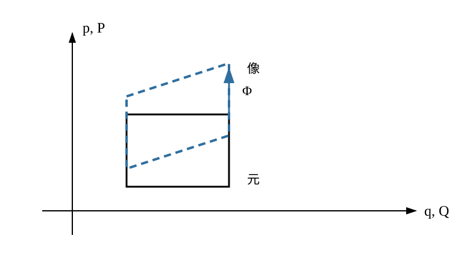

# AMECH7 正準変換

AMECH6 では、相空間上の Hamilton 方程式を Poisson 括弧と Hamiltonian flow で読み直しました。特に、正準座標 $(q,p)$ では

$$
\{q_i,q_j\}=0,
\qquad
\{p_i,p_j\}=0,
\qquad
\{q_i,p_j\}=\delta_{ij}
$$

という基本関係が成り立ち、Hamiltonian flow は相空間体積を保存しました。

ここで新しい問題が生じます。相空間でも座標を取り替えたいのですが、**体積を保つ座標変換なら何でも Hamilton 形式に適しているわけではありません。**

二自由度で

$$
Q_1=2q_1,
\qquad
P_1=p_1,
\qquad
Q_2=\frac12q_2,
\qquad
P_2=p_2
$$

とすると、変換の Jacobian 行列式は

$$
2\cdot1\cdot\frac12\cdot1=1
$$

です。したがって四次元体積は保たれます。

しかし

$$
\{Q_1,P_1\}=2,
\qquad
\{Q_2,P_2\}=\frac12
$$

なので、正準座標の基本関係は壊れています。

つまり AMECH6 の Liouville の定理で見た「相空間体積を保つ」という性質だけでは、Hamilton 方程式の構造を保つ座標変換を選び切れません。

本章の中心問いは次です。

> **どの座標変換なら、$(q,p)$ を $(Q,P)$ に取り替えても Poisson 括弧と Hamilton 方程式の形を保てるか。**

その答えが**正準変換**です。

本章では

$$
\text{Poisson 括弧を保つ座標変換}
\longrightarrow
\text{Jacobian 行列条件}
\longrightarrow
\text{Hamiltonian flow の正準性}
\longrightarrow
\text{母関数}
\longrightarrow
\text{時間依存正準変換}
$$

と進みます。

---

## 1. 正準変換は「位置と運動量の組み方」を保つ

時刻 $t$ を固定し、相空間の局所座標変換

$$
(q_1,\ldots,q_n,p_1,\ldots,p_n)
\longmapsto
(Q_1,\ldots,Q_n,P_1,\ldots,P_n)
$$

を考えます。

単に可逆であるだけでは足りません。新しい座標も、元の正準座標と同じ Poisson 括弧の基本関係を満たしてほしいのです。

<!-- formal-statement-start -->
> **定義（正準変換）**  
> 正準座標 $(q,p)$ を持つ相空間の開領域 $U\subset\mathbb R^{2n}$ から開領域 $V\subset\mathbb R^{2n}$ への、$C^1$ 級で局所的に可逆な座標変換
>
> $$
> \Phi:(q,p)\longmapsto(Q(q,p),P(q,p))
> $$
>
> を考える。元の $(q,p)$ による Poisson 括弧で
>
> $$
> \boxed{
> \{Q_i,Q_j\}=0,
> \qquad
> \{P_i,P_j\}=0,
> \qquad
> \{Q_i,P_j\}=\delta_{ij}
> }
> $$
>
> がすべての $i,j$ について成り立つとき、$\Phi$ を正準変換という。
<!-- formal-statement-end -->

<!-- definition-example-start: def-amech7-canonical-transformation -->
### 例：位置を $a$ 倍したら運動量は $1/a$ 倍する

$a\ne0$ として一自由度で

$$
Q=aq,
\qquad
P=\frac{p}{a}
$$

とします。

**定義の確認**を行います。偏微分は

$$
Q_q=a,
\qquad
Q_p=0,
$$

$$
P_q=0,
\qquad
P_p=\frac1a.
$$

したがって

$$
\{Q,P\}
=
Q_qP_p-Q_pP_q
=
a\frac1a-0
=
1.
$$

また任意の関数 $f$ について $\{f,f\}=0$ なので

$$
\{Q,Q\}=0,
\qquad
\{P,P\}=0.
$$

よって

$$
\boxed{
Q=aq,\qquad P=p/a
}
$$

は正準変換です。

一方

$$
Q=aq,
\qquad
P=ap
$$

なら

$$
\{Q,P\}=a^2.
$$

$a^2\ne1$ なら正準変換ではありません。「座標を同じ倍率で拡大する」という見た目の自然さは、正準性を保証しません。
<!-- definition-example-end -->

正準変換では、位置変数だけを好きに変えるのではなく、運動量変数もそれに合わせて変換されます。

---

## 2. 基本関係を保てば任意の Poisson 括弧も保たれる

定義では $Q_i,P_i$ 自身の Poisson 括弧だけを確認しました。

しかし本当に欲しいのは、新座標で書いた任意の関数 $F(Q,P)$ と $G(Q,P)$ の Poisson 括弧まで同じ形になることです。

<!-- formal-statement-start -->
> **定理（正準変換による Poisson 括弧保存）**  
> $\Phi:(q,p)\mapsto(Q,P)$ を正準変換とする。$F,G$ を新座標 $(Q,P)$ 上の $C^1$ 級関数とする。このとき
>
> $$
> \boxed{
> \{F\circ\Phi,G\circ\Phi\}_{q,p}
> =
> \{F,G\}_{Q,P}\circ\Phi
> }
> $$
>
> が成り立つ。
<!-- formal-statement-end -->

### 証明の見取り図

$F(Q(q,p),P(q,p))$ を $q_k,p_k$ で微分し、連鎖律で $F_{Q_i},F_{P_i}$ を取り出します。展開後に現れる係数は

$$
\{Q_i,Q_j\},
\quad
\{Q_i,P_j\},
\quad
\{P_i,Q_j\},
\quad
\{P_i,P_j\}
$$

だけです。正準変換の基本関係を代入すると、新座標での Poisson 括弧が残ります。

<!-- proof-start -->
### 証明

記号を簡単にするため、合成 $F\circ\Phi$ も $F$ と書きます。

連鎖律から

$$
\frac{\partial F}{\partial q_k}
=
\sum_i
\left(
F_{Q_i}\frac{\partial Q_i}{\partial q_k}
+
F_{P_i}\frac{\partial P_i}{\partial q_k}
\right),
$$

$$
\frac{\partial F}{\partial p_k}
=
\sum_i
\left(
F_{Q_i}\frac{\partial Q_i}{\partial p_k}
+
F_{P_i}\frac{\partial P_i}{\partial p_k}
\right).
$$

$G$ にも同じ式を使って Poisson 括弧へ代入すると、$F$ と $G$ の新座標偏微分ごとに整理して

$$
\begin{aligned}
\{F,G\}_{q,p}
&=
\sum_{i,j}
F_{Q_i}G_{Q_j}\{Q_i,Q_j\}\\
&\quad+
\sum_{i,j}
F_{Q_i}G_{P_j}\{Q_i,P_j\}\\
&\quad+
\sum_{i,j}
F_{P_i}G_{Q_j}\{P_i,Q_j\}\\
&\quad+
\sum_{i,j}
F_{P_i}G_{P_j}\{P_i,P_j\}.
\end{aligned}
$$

正準変換の定義から

$$
\{Q_i,Q_j\}=0,
\qquad
\{P_i,P_j\}=0,
$$

$$
\{Q_i,P_j\}=\delta_{ij},
\qquad
\{P_i,Q_j\}=-\delta_{ij}.
$$

したがって

$$
\begin{aligned}
\{F,G\}_{q,p}
&=
\sum_iF_{Q_i}G_{P_i}
-
\sum_iF_{P_i}G_{Q_i}\\
&=
\{F,G\}_{Q,P}.
\end{aligned}
$$

各式は対応する点 $\Phi(q,p)$ で評価されるので、

$$
\boxed{
\{F\circ\Phi,G\circ\Phi\}_{q,p}
=
\{F,G\}_{Q,P}\circ\Phi
}
$$

を得ます。
<!-- proof-end -->

これで、正準変換は座標関数だけでなく Poisson 括弧の計算法則全体を保つことが分かりました。

---

## 3. Jacobian 行列一枚で正準性を判定する

成分ごとにすべての Poisson 括弧を計算する代わりに、行列でまとめます。

AMECH6 と同じく

$$
z=
\begin{pmatrix}
q\\
p
\end{pmatrix},
\qquad
w=
\begin{pmatrix}
Q\\
P
\end{pmatrix},
$$

$$
J=
\begin{pmatrix}
0&I\\
-I&0
\end{pmatrix}
$$

とします。

変換 $w=\Phi(z)$ の Jacobian 行列を

$$
M(z)=D\Phi(z)
$$

と置きます。

<!-- formal-statement-start -->
> **定理（正準変換の Jacobian 行列条件）**  
> $\Phi:z\mapsto w$ を $C^1$ 級で局所的に可逆な座標変換とし、Jacobian 行列 $M=D\Phi$ は各点で可逆とする。このとき次は同値である。
>
> 1. $\Phi$ は正準変換である。
> 2. 各点で
>
> $$
> \boxed{
> M J M^{\mathsf T}=J
> }
> $$
>
> が成り立つ。
> 3. 各点で
>
> $$
> \boxed{
> M^{\mathsf T}J M=J
> }
> $$
>
> が成り立つ。
<!-- formal-statement-end -->

### 証明の見取り図

$M$ の各行は $Q_i,P_i$ の勾配です。そのため $MJM^{\mathsf T}$ の各成分は、新座標関数どうしの Poisson 括弧そのものになります。

<!-- proof-start -->
### 証明

新座標を

$$
w_1,\ldots,w_{2n}
=
Q_1,\ldots,Q_n,P_1,\ldots,P_n
$$

と並べます。

$M=D\Phi$ の第 $a$ 行は

$$
\nabla_z w_a^{\mathsf T}
$$

です。

Poisson 括弧は

$$
\{f,g\}
=
\nabla_z f^{\mathsf T}
J
\nabla_z g
$$

と書けるので、

$$
(MJM^{\mathsf T})_{ab}
=
\{w_a,w_b\}_{q,p}.
$$

したがって

$$
MJM^{\mathsf T}=J
$$

であることは

$$
\{Q_i,Q_j\}=0,
\qquad
\{P_i,P_j\}=0,
\qquad
\{Q_i,P_j\}=\delta_{ij}
$$

とまったく同じ条件です。よって 1 と 2 は同値です。

次に 2 を仮定します。$M$ は可逆です。

$$
MJM^{\mathsf T}=J
$$

の右から $-J$ を掛けます。$J(-J)=I$ なので

$$
M\bigl(-JM^{\mathsf T}J\bigr)=I.
$$

従って

$$
M^{-1}=-JM^{\mathsf T}J.
$$

この式の左から $J$ を掛けると、$J(-J)=I$ より

$$
JM^{-1}=M^{\mathsf T}J.
$$

さらに右から $M$ を掛ければ

$$
\boxed{
M^{\mathsf T}JM=J
}.
$$

よって 2 から 3 が従います。

逆に 3 を仮定すると、同じ計算で

$$
M^{-1}=-JM^{\mathsf T}J
$$

を得ます。この式を $M^{\mathsf T}$ について解くと

$$
M^{\mathsf T}=-JM^{-1}J.
$$

これを $MJM^{\mathsf T}$ へ代入すると

$$
\begin{aligned}
MJM^{\mathsf T}
&=
MJ(-JM^{-1}J)\\
&=
MM^{-1}J\\
&=
J.
\end{aligned}
$$

従って 3 から 2 も従い、2 と 3 は同値です。
<!-- proof-end -->

この行列条件は、後の解析力学 II でシンプレクティック構造として整理されます。本章では多様体や微分形式の一般論へ進まず、**$J$ が表す位置・運動量の反対称な組を保つこと**だけを使います。

---

## 4. 一自由度では「面積保存」と正準性が一致する

一自由度なら

$$
M
=
\begin{pmatrix}
Q_q&Q_p\\
P_q&P_p
\end{pmatrix}.
$$

この場合、基本関係で非自明なのは $\{Q,P\}=1$ だけです。

<!-- formal-statement-start -->
> **命題（一自由度の正準条件）**  
> 一自由度の $C^1$ 級局所座標変換 $(q,p)\mapsto(Q,P)$ は
>
> $$
> \boxed{
> \frac{\partial(Q,P)}{\partial(q,p)}
> =
> Q_qP_p-Q_pP_q
> =
> 1
> }
> $$
>
> を満たすとき、かつそのときに限り正準変換である。
<!-- formal-statement-end -->

<!-- proof-start -->
### 証明

一自由度では

$$
\{Q,P\}
=
Q_qP_p-Q_pP_q.
$$

右辺は Jacobian 行列式

$$
\det
\begin{pmatrix}
Q_q&Q_p\\
P_q&P_p
\end{pmatrix}
$$

そのものです。

また反対称性により

$$
\{Q,Q\}=0,
\qquad
\{P,P\}=0
$$

は自動的に成り立ちます。

従って正準変換の定義は

$$
\{Q,P\}=1
$$

だけになり、これは

$$
\frac{\partial(Q,P)}{\partial(q,p)}=1
$$

と同値です。
<!-- proof-end -->

### 例：正準 shear

$$
Q=q,
\qquad
P=p+\alpha q
$$

とします。Jacobian は

$$
M=
\begin{pmatrix}
1&0\\
\alpha&1
\end{pmatrix},
$$

したがって

$$
\det M=1.
$$

よって正準変換です。

図では、元の正方形が同じ面積の平行四辺形へ shear されます。

一自由度ではこの「向き付き面積を 1 倍のまま保つ」という条件が正準性と一致します。

しかし多自由度では、章頭の反例のように全体積の倍率が 1 でも、各 $(Q_i,P_i)$ の組み方が壊れることがあります。**多自由度の正準性は体積保存より強い条件**です。

---

## 5. 正準変換は局所的な相空間体積を保つ

正準条件から体積保存は従います。

<!-- formal-statement-start -->
> **命題（正準変換の局所体積保存）**  
> $2n$ 次元相空間の正準変換 $\Phi$ の Jacobian 行列を $M=D\Phi$ とする。このとき
>
> $$
> \boxed{
> |\det M|=1
> }
> $$
>
> である。従って正準変換は局所的な $2n$ 次元体積を保存する。
<!-- formal-statement-end -->

<!-- proof-start -->
### 証明

正準条件

$$
MJM^{\mathsf T}=J
$$

の行列式を取ります。

$$
\det(MJM^{\mathsf T})
=
\det J.
$$

積の行列式から

$$
(\det M)(\det J)(\det M^{\mathsf T})
=
\det J.
$$

$\det M^{\mathsf T}=\det M$ なので

$$
(\det M)^2\det J
=
\det J.
$$

$J$ は可逆だから $\det J\ne0$ です。従って

$$
(\det M)^2=1.
$$

よって

$$
\boxed{
|\det M|=1
}.
$$
<!-- proof-end -->

ここで論理の向きを取り違えないでください。

$$
\boxed{
\text{正準}
\Longrightarrow
\text{体積保存}
}
$$

ですが、多自由度では逆は一般に成り立ちません。

---

## 6. Hamiltonian flow 自身が正準変換である

AMECH6 で Hamiltonian flow $\Phi_t$ が体積を保つことを示しました。

実はもっと強く、時間発展そのものが正準変換です。

<!-- formal-statement-start -->
> **定理（Hamiltonian flow は正準変換）**  
> $H(q,p)$ を $C^2$ 級の自律 Hamiltonian とし、$\Phi_t$ をその $C^1$ 級局所 Hamiltonian flow とする。flow が定義される範囲で、各固定時刻 $t$ の写像
>
> $$
> \Phi_t:z_0\longmapsto z(t;z_0)
> $$
>
> は正準変換である。
<!-- formal-statement-end -->

### 証明の見取り図

AMECH6 と同じく

$$
A(t)=D\Phi_t(z_0)
$$

を考えます。

変分方程式は

$$
\dot A=DX_H(\Phi_t)A
$$

です。Hamiltonian vector field は

$$
X_H=J\nabla H
$$

だから

$$
DX_H=J\,\operatorname{Hess}H.
$$

Hessian は対称なので、$A^{\mathsf T}JA$ を微分すると二項がちょうど打ち消し合います。

<!-- proof-start -->
### 証明

$$
S(t)
=
\operatorname{Hess}H(\Phi_t(z_0))
$$

と置きます。$H$ は $C^2$ 級なので

$$
S^{\mathsf T}=S.
$$

Hamiltonian vector field は

$$
X_H=J\nabla H
$$

なので

$$
DX_H=JS.
$$

したがって変分方程式は

$$
\dot A=JSA.
$$

ここで

$$
C(t)=A(t)^{\mathsf T}JA(t)
$$

を微分します。

$$
\dot C
=
\dot A^{\mathsf T}JA
+
A^{\mathsf T}J\dot A.
$$

$\dot A=JSA$ と $J^{\mathsf T}=-J$ を使うと

$$
\dot A^{\mathsf T}
=
A^{\mathsf T}S^{\mathsf T}J^{\mathsf T}
=
-A^{\mathsf T}SJ.
$$

従って

$$
\begin{aligned}
\dot C
&=
(-A^{\mathsf T}SJ)JA
+
A^{\mathsf T}J(JSA)\\
&=
-A^{\mathsf T}S(J^2)A
+
A^{\mathsf T}(J^2)SA.
\end{aligned}
$$

$J^2=-I$ なので

$$
\dot C
=
A^{\mathsf T}SA
-
A^{\mathsf T}SA
=
0.
$$

よって $C(t)$ は一定です。

$t=0$ では

$$
\Phi_0=\operatorname{id},
\qquad
A(0)=I.
$$

したがって

$$
C(0)=I^{\mathsf T}JI=J.
$$

以上から

$$
\boxed{
A(t)^{\mathsf T}JA(t)=J
}.
$$

Jacobian 行列条件により $\Phi_t$ は正準変換です。
<!-- proof-end -->

AMECH6 の Liouville の定理は、この定理からも

$$
|\det D\Phi_t|=1
$$

として回収できます。正準性は、体積保存より細かい Hamilton 構造まで時間発展が保つことを述べています。

### 例：調和振動子の flow

一次元調和振動子では

$$
\Phi_t
\begin{pmatrix}
q_0\\
p_0
\end{pmatrix}
=
M(t)
\begin{pmatrix}
q_0\\
p_0
\end{pmatrix}
$$

で

$$
M(t)
=
\begin{pmatrix}
\cos\omega t&
\dfrac{1}{m\omega}\sin\omega t\\
-m\omega\sin\omega t&
\cos\omega t
\end{pmatrix}.
$$

一自由度では $\det M(t)=1$ なら正準です。AMECH6 で

$$
\det M(t)=1
$$

を直接計算したので、この具体例でも flow の正準性が確認できます。

---

## 7. 正準変換を「探す」のではなく母関数から「作る」

正準条件を満たす $Q(q,p),P(q,p)$ を直接探すのは、自由度が増えるほど大変です。

そこで発想を逆にします。

一つのスカラー関数を選び、その偏微分から $p$ と $Q$ を同時に作れば、正準条件が自動的に入るようにします。

本章では最も使いやすい**第2種母関数**を詳しく扱います。

<!-- formal-statement-start -->
> **定義（第2種母関数）**  
> $q=(q_1,\ldots,q_n)$、$P=(P_1,\ldots,P_n)$、時刻 $t$ の $C^2$ 級関数
>
> $$
> F_2(q,P,t)
> $$
>
> を考える。
>
> $$
> \boxed{
> p_i=\frac{\partial F_2}{\partial q_i},
> \qquad
> Q_i=\frac{\partial F_2}{\partial P_i}
> }
> $$
>
> によって $(q,p)$ と $(Q,P)$ を関係付け、混合 Hessian
>
> $$
> \left(
> \frac{\partial^2F_2}{\partial q_i\partial P_j}
> \right)_{i,j}
> $$
>
> が可逆で、これらの式から局所的に $(Q,P)$ と $(q,p)$ を互いに解けるとする。このとき $F_2$ を第2種母関数という。
<!-- formal-statement-end -->

<!-- definition-example-start: def-amech7-type2-generating-function -->
### 例：恒等変換を作る最小の母関数

$$
F_2(q,P)=qP
$$

とします。

**定義の確認**として偏微分すると

$$
p=\frac{\partial F_2}{\partial q}=P,
$$

$$
Q=\frac{\partial F_2}{\partial P}=q.
$$

従って

$$
Q=q,
\qquad
P=p,
$$

すなわち恒等変換です。

混合二階微分は

$$
\frac{\partial^2F_2}{\partial q\partial P}=1
$$

なので可逆性条件も満たします。
<!-- definition-example-end -->

### 例：母関数から正準 shear を作る

一自由度で

$$
F_2(q,P)
=
qP-\frac{\alpha}{2}q^2
$$

とします。

すると

$$
p
=
\frac{\partial F_2}{\partial q}
=
P-\alpha q,
$$

$$
Q
=
\frac{\partial F_2}{\partial P}
=
q.
$$

第1式を $P$ について解くと

$$
P=p+\alpha q.
$$

したがって

$$
\boxed{
Q=q,
\qquad
P=p+\alpha q
}
$$

となり、4節の正準 shear が母関数から得られました。

---

## 8. 第2種母関数が正準変換を作る理由

母関数の公式を暗記するだけでは、なぜ正準条件が入るのかが見えません。

固定時刻で

$$
dF_2
=
p\cdot dq
+
Q\cdot dP
$$

となることが核心です。

さらに時間依存も含めると

$$
dF_2
=
p\cdot dq
+
Q\cdot dP
+
\frac{\partial F_2}{\partial t}dt.
$$

この一つの微分関係から、正準性と新しい Hamiltonian の両方が出ます。

<!-- formal-statement-start -->
> **定理（第2種母関数による正準変換と Hamiltonian の変換）**  
> $F_2(q,P,t)$ を第2種母関数とし
>
> $$
> p_i=\frac{\partial F_2}{\partial q_i},
> \qquad
> Q_i=\frac{\partial F_2}{\partial P_i}
> $$
>
> により局所変換 $(q,p)\leftrightarrow(Q,P)$ を定める。
>
> 1. 各固定時刻 $t$ で、この変換は正準変換である。
> 2. 元の Hamiltonian を $H(q,p,t)$ とすると、新座標で
>
> $$
> \boxed{
> K(Q,P,t)
> =
> H(q,p,t)
> +
> \frac{\partial F_2}{\partial t}(q,P,t)
> }
> $$
>
> と定め、右辺の $q,p$ を $Q,P,t$ で表せば、新変数は
>
> $$
> \boxed{
> \dot Q_i=\frac{\partial K}{\partial P_i},
> \qquad
> \dot P_i=-\frac{\partial K}{\partial Q_i}
> }
> $$
>
> を満たす。
<!-- formal-statement-end -->

### 証明の見取り図

正準性については、$F_2$ の Hessian の対称性を使います。

Hamiltonian の変換については

$$
p\cdot\dot q-H
$$

と

$$
P\cdot\dot Q-K
$$

の差が全時間微分になることを直接示します。AMECH3 で見たように、作用積分へ全時間微分を加えても固定端変分の運動方程式は変わりません。

<!-- proof-start -->
### 証明

まず時刻 $t$ を固定します。

$$
p=F_{2,q},
\qquad
Q=F_{2,P}
$$

です。

二つの微小変化を

$$
(\delta q^{(1)},\delta P^{(1)}),
\qquad
(\delta q^{(2)},\delta P^{(2)})
$$

とします。

Hessian のブロックを

$$
A=F_{2,qq},
\qquad
B=F_{2,qP},
\qquad
C=F_{2,PP}
$$

と置くと

$$
\delta p=A\delta q+B\delta P,
$$

$$
\delta Q=B^{\mathsf T}\delta q+C\delta P.
$$

$F_2$ は $C^2$ 級なので

$$
A^{\mathsf T}=A,
\qquad
C^{\mathsf T}=C.
$$

元の座標で二つの微小変化が作る反対称な組合せは

$$
\Omega_{\mathrm{old}}
=
(\delta q^{(1)})^{\mathsf T}\delta p^{(2)}
-
(\delta p^{(1)})^{\mathsf T}\delta q^{(2)}.
$$

$\delta p=A\delta q+B\delta P$ を代入すると、$A$ の対称性により $A$ を含む二項が消え、

$$
\Omega_{\mathrm{old}}
=
(\delta q^{(1)})^{\mathsf T}B\delta P^{(2)}
-
(\delta P^{(1)})^{\mathsf T}B^{\mathsf T}\delta q^{(2)}.
$$

新座標側では

$$
\Omega_{\mathrm{new}}
=
(\delta Q^{(1)})^{\mathsf T}\delta P^{(2)}
-
(\delta P^{(1)})^{\mathsf T}\delta Q^{(2)}.
$$

$\delta Q=B^{\mathsf T}\delta q+C\delta P$ を代入すると

$$
\begin{aligned}
\Omega_{\mathrm{new}}
&=
(\delta q^{(1)})^{\mathsf T}B\delta P^{(2)}
+
(\delta P^{(1)})^{\mathsf T}C\delta P^{(2)}\\
&\quad-
(\delta P^{(1)})^{\mathsf T}B^{\mathsf T}\delta q^{(2)}
-
(\delta P^{(1)})^{\mathsf T}C\delta P^{(2)}\\
&=
(\delta q^{(1)})^{\mathsf T}B\delta P^{(2)}
-
(\delta P^{(1)})^{\mathsf T}B^{\mathsf T}\delta q^{(2)}.
\end{aligned}
$$

従って

$$
\Omega_{\mathrm{new}}
=
\Omega_{\mathrm{old}}.
$$

ここで混合 Hessian $B=F_{2,qP}$ は可逆です。したがって

$$
\delta p=A\delta q+B\delta P
$$

から、任意の $(\delta q,\delta p)$ に対して

$$
\delta P
=
B^{-1}(\delta p-A\delta q)
$$

が一意に決まります。つまり上の等式は特別な変分だけでなく、元の相空間の任意の接方向の組に対して成り立ちます。

従って変換の Jacobian 行列 $M$ は

$$
M^{\mathsf T}JM=J
$$

を満たします。Jacobian 行列条件から、各固定時刻で変換は正準です。

次に時間依存を含めます。

定義から

$$
\frac{dF_2}{dt}
=
p\cdot\dot q
+
Q\cdot\dot P
+
\frac{\partial F_2}{\partial t}.
$$

積 $P\cdot Q$ を微分すると

$$
\frac{d}{dt}(P\cdot Q)
=
\dot P\cdot Q
+
P\cdot\dot Q.
$$

したがって

$$
\begin{aligned}
\frac{d}{dt}(F_2-P\cdot Q)
&=
p\cdot\dot q
+
Q\cdot\dot P
+
F_{2,t}\\
&\quad-
\dot P\cdot Q
-
P\cdot\dot Q\\
&=
p\cdot\dot q
-
P\cdot\dot Q
+
F_{2,t}.
\end{aligned}
$$

よって

$$
p\cdot\dot q-H
=
P\cdot\dot Q
-
\left(H+F_{2,t}\right)
+
\frac{d}{dt}(F_2-P\cdot Q).
$$

ここで

$$
K=H+F_{2,t}
$$

と置けば

$$
\boxed{
p\cdot\dot q-H
=
P\cdot\dot Q-K
+
\frac{d}{dt}(F_2-P\cdot Q)
}.
$$

時間区間 $[t_0,t_1]$ で積分すると、最後の項は端点値

$$
[F_2-P\cdot Q]_{t_0}^{t_1}
$$

だけになります。したがって端点近くで 0 となる変分、すなわち内部だけを動かす変分に対しては、この全時間微分項の変分は 0 です。

ここで新変数の相空間作用を

$$
\mathcal A_{\mathrm{new}}[Q,P]
=
\int_{t_0}^{t_1}
\left(
P\cdot\dot Q-K
\right)dt
$$

と置きます。$Q,P$ を端点近くで固定して変分すると

$$
\begin{aligned}
\delta\mathcal A_{\mathrm{new}}
&=
\int_{t_0}^{t_1}
\left(
\delta P\cdot\dot Q
+
P\cdot\delta\dot Q
-
K_Q\cdot\delta Q
-
K_P\cdot\delta P
\right)dt.
\end{aligned}
$$

$P\cdot\delta\dot Q$ を部分積分し、境界項が 0 であることを使うと

$$
\delta\mathcal A_{\mathrm{new}}
=
\int_{t_0}^{t_1}
\left[
(\dot Q-K_P)\cdot\delta P
+
(-\dot P-K_Q)\cdot\delta Q
\right]dt.
$$

$\delta Q,\delta P$ は区間内部で独立に選べるので、停留条件は

$$
\boxed{
\dot Q_i=K_{P_i},
\qquad
\dot P_i=-K_{Q_i}
}
$$

です。元の相空間作用と新しい相空間作用は上の恒等式により全時間微分だけ異なるため、局所的な正準変換で同じ運動を記述します。
<!-- proof-end -->

この定理で重要なのは、時間依存変換では

$$
K
\ne
H\circ\Phi^{-1}
$$

となり得ることです。

座標を時間依存で動かすと、その動きの分が

$$
\frac{\partial F_2}{\partial t}
$$

として Hamiltonian に加わります。

---

## 9. 時間依存変換では追加項を落としてはいけない

一自由度で、時刻に依存する既知関数 $a(t)$ を使い

$$
Q=q-a(t),
\qquad
P=p
$$

という移動座標を考えます。

これを作る第2種母関数は

$$
F_2(q,P,t)
=
(q-a(t))P
$$

です。

実際、

$$
p
=
\frac{\partial F_2}{\partial q}
=
P,
$$

$$
Q
=
\frac{\partial F_2}{\partial P}
=
q-a(t).
$$

時間偏微分は

$$
\frac{\partial F_2}{\partial t}
=
-\dot a(t)P.
$$

従って新 Hamiltonian は

$$
\boxed{
K(Q,P,t)
=
H(Q+a(t),P,t)
-
\dot a(t)P
}.
$$

### 例：自由粒子を動く座標から見る

元の Hamiltonian を

$$
H(q,p)=\frac{p^2}{2m}
$$

とします。

すると

$$
K(Q,P,t)
=
\frac{P^2}{2m}
-
\dot a(t)P.
$$

Hamilton 方程式は

$$
\dot Q
=
\frac{\partial K}{\partial P}
=
\frac{P}{m}
-
\dot a(t),
$$

$$
\dot P
=
-
\frac{\partial K}{\partial Q}
=
0.
$$

一方

$$
Q=q-a(t)
$$

を直接時間微分しても

$$
\dot Q
=
\dot q-\dot a(t)
=
\frac{p}{m}-\dot a(t)
=
\frac{P}{m}-\dot a(t).
$$

一致しました。

もし $K$ を単純に $H=P^2/(2m)$ としてしまうと $-\dot a(t)$ が消え、動く座標から見た速度を再現できません。

---

## 10. 母関数には四つの標準形がある

第2種母関数だけが特別なのではありません。

正準変換を記述するとき、旧変数と新変数のどちらを独立変数に選ぶかで四つの標準形があります。

| 種類 | 独立変数 | 変換式 |
| --- | --- | --- |
| $F_1$ | $(q,Q,t)$ | $p=F_{1,q}$, $P=-F_{1,Q}$ |
| $F_2$ | $(q,P,t)$ | $p=F_{2,q}$, $Q=F_{2,P}$ |
| $F_3$ | $(p,Q,t)$ | $q=-F_{3,p}$, $P=-F_{3,Q}$ |
| $F_4$ | $(p,P,t)$ | $q=-F_{4,p}$, $Q=F_{4,P}$ |

いずれも時間依存なら

$$
K=H+\frac{\partial F}{\partial t}
$$

という形になります。

本章で第2種を主役にしたのは、恒等変換が

$$
F_2=q\cdot P
$$

と極めて簡単に書け、Hamilton--Jacobi 理論でも $F_2(q,P,t)$ 型がそのまま使いやすいからです。

四種類の公式を別々に暗記するより、第2種から変数の Legendre 的な入れ替えで他の型が生じると理解する方が安全です。

---

## 11. 次章 Hamilton--Jacobi 理論への入口

第2種母関数の定理では

$$
K
=
H
+
\frac{\partial F_2}{\partial t}
$$

でした。

ここで大胆に、新しい Hamiltonian を

$$
K=0
$$

にできる母関数を探すとします。

すると新しい Hamilton 方程式は

$$
\dot Q_i=0,
\qquad
\dot P_i=0.
$$

つまり新変数はすべて定数になり、運動は解き終わったことになります。

$F_2$ を

$$
S(q,P,t)
$$

と書き換えると

$$
p
=
\frac{\partial S}{\partial q}.
$$

さらに $K=0$ は

$$
0
=
H\left(
q,
\frac{\partial S}{\partial q},
t
\right)
+
\frac{\partial S}{\partial t}.
$$

従って

$$
\boxed{
\frac{\partial S}{\partial t}
+
H\left(
q,
\frac{\partial S}{\partial q},
t
\right)
=
0
}
$$

が現れます。

これが次章 AMECH8 で扱う Hamilton--Jacobi 方程式です。

本章では「母関数をうまく選ぶと Hamiltonian 自体を簡単化できる」ことまでが責務です。Hamilton--Jacobi 方程式の完全積分、主関数、特性関数、中心力への適用は次章で扱います。

---

## 12. 本章で何ができるようになったか

相空間の座標変換は、単に可逆であればよいのではありません。

正準変換は

$$
\{Q_i,Q_j\}=0,
\qquad
\{P_i,P_j\}=0,
\qquad
\{Q_i,P_j\}=\delta_{ij}
$$

を保ち、その結果として任意の Poisson 括弧を保ちます。

微分レベルでは

$$
\boxed{
MJM^{\mathsf T}=J
}
$$

または同値な

$$
\boxed{
M^{\mathsf T}JM=J
}
$$

が判定条件です。

この条件から体積保存は従いますが、多自由度では体積保存だけでは正準性を保証しません。

さらに Hamiltonian flow 自身が正準変換であり、実際の時間発展は Hamilton 構造を壊しません。

最後に第2種母関数

$$
F_2(q,P,t)
$$

を使うと

$$
p=F_{2,q},
\qquad
Q=F_{2,P}
$$

から正準変換を構成でき、時間依存の場合は

$$
\boxed{
K=H+F_{2,t}
}
$$

となります。

次章では $K=0$ となる母関数を探すことで、運動方程式を一つの偏微分方程式へ変換します。

---

# 演習

## Level A

### A1. 正準 scaling を Poisson 括弧で確認する

一自由度で $a\ne0$ とし

$$
Q=aq,
\qquad
P=\frac{p}{a}
$$

とする。

1. $\{Q,P\}$ を定義から計算せよ。
2. $\{Q,Q\}$ と $\{P,P\}$ を求めよ。
3. この変換が正準変換であることを結論せよ。
4. $Q=aq,\ P=ap$ ならどの条件が壊れるか示せ。

- Level: A

<!-- solution-start -->
#### 詳細解答

一自由度の Poisson 括弧は

$$
\{f,g\}
=
f_qg_p-f_pg_q
$$

です。

まず

$$
Q_q=a,
\qquad
Q_p=0,
$$

$$
P_q=0,
\qquad
P_p=\frac1a.
$$

したがって

$$
\{Q,P\}
=
a\frac1a-0
=
\boxed{1}.
$$

反対称性から任意の関数 $f$ について $\{f,f\}=0$ なので

$$
\boxed{
\{Q,Q\}=0,
\qquad
\{P,P\}=0
}.
$$

三つの基本関係を満たすため、この変換は正準です。

一方

$$
Q=aq,
\qquad
P=ap
$$

では

$$
P_p=a
$$

なので

$$
\{Q,P\}
=
a^2.
$$

従って

$$
a^2\ne1
$$

なら

$$
\boxed{
\{Q,P\}\ne1
}
$$

となり、正準性が壊れます。
<!-- solution-end -->

---

### A2. 正準 shear を Jacobian で判定する

一自由度で

$$
Q=q,
\qquad
P=p+\alpha q
$$

とする。

1. Jacobian 行列 $M$ を求めよ。
2. $\det M$ を求めよ。
3. 一自由度の正準条件から正準変換であることを示せ。
4. 逆変換を求めよ。

- Level: A

<!-- solution-start -->
#### 詳細解答

偏微分から

$$
M
=
\frac{\partial(Q,P)}{\partial(q,p)}
=
\begin{pmatrix}
1&0\\
\alpha&1
\end{pmatrix}.
$$

したがって

$$
\det M
=
1\cdot1-0\cdot\alpha
=
\boxed{1}.
$$

一自由度では

$$
\det M=1
$$

が正準条件と同値なので、この変換は正準です。

逆変換は第1式から

$$
q=Q.
$$

第2式へ代入して

$$
P=p+\alpha Q
$$

だから

$$
p=P-\alpha Q.
$$

従って

$$
\boxed{
q=Q,
\qquad
p=P-\alpha Q
}.
$$
<!-- solution-end -->

---

### A3. 第2種母関数から変換を作る

$$
F_2(q,P)
=
qP+\frac{\beta}{2}P^2
$$

とする。

1. $p=\partial F_2/\partial q$ を求めよ。
2. $Q=\partial F_2/\partial P$ を求めよ。
3. $(q,p)$ から $(Q,P)$ への変換を明示せよ。
4. $\{Q,P\}=1$ を直接確認せよ。

- Level: A

<!-- solution-start -->
#### 詳細解答

まず

$$
p
=
\frac{\partial F_2}{\partial q}
=
P.
$$

したがって

$$
P=p.
$$

次に

$$
Q
=
\frac{\partial F_2}{\partial P}
=
q+\beta P.
$$

$P=p$ を代入して

$$
\boxed{
Q=q+\beta p,
\qquad
P=p
}.
$$

直接 Poisson 括弧を計算します。

$$
Q_q=1,
\qquad
Q_p=\beta,
$$

$$
P_q=0,
\qquad
P_p=1.
$$

従って

$$
\{Q,P\}
=
1\cdot1-\beta\cdot0
=
\boxed{1}.
$$

よって母関数から得た変換が実際に正準であることを確認できました。
<!-- solution-end -->

---

### A4. 時間依存の平行移動

$$
F_2(q,P,t)
=
(q-vt)P,
\qquad
v=\text{定数}
$$

とし、元の Hamiltonian を

$$
H(q,p)=\frac{p^2}{2m}
$$

とする。

1. $Q,P$ を $q,p$ で表せ。
2. $\partial F_2/\partial t$ を求めよ。
3. 新 Hamiltonian $K$ を求めよ。
4. 新しい Hamilton 方程式を求め、$Q=q-vt$ の直接微分と一致することを確かめよ。

- Level: A

<!-- solution-start -->
#### 詳細解答

母関数の公式から

$$
p
=
\frac{\partial F_2}{\partial q}
=
P,
$$

$$
Q
=
\frac{\partial F_2}{\partial P}
=
q-vt.
$$

したがって

$$
\boxed{
P=p,
\qquad
Q=q-vt
}.
$$

時間偏微分は

$$
\frac{\partial F_2}{\partial t}
=
-vP.
$$

元の Hamiltonian は $p=P$ なので

$$
H=\frac{P^2}{2m}.
$$

従って

$$
\boxed{
K(Q,P,t)
=
\frac{P^2}{2m}
-vP
}.
$$

Hamilton 方程式は

$$
\dot Q
=
\frac{\partial K}{\partial P}
=
\frac{P}{m}-v,
$$

$$
\dot P
=
-
\frac{\partial K}{\partial Q}
=
0.
$$

一方 $Q=q-vt$ を直接微分すると

$$
\dot Q
=
\dot q-v.
$$

自由粒子では

$$
\dot q=\frac{p}{m}=\frac{P}{m}
$$

なので

$$
\dot Q
=
\frac{P}{m}-v.
$$

確かに一致します。
<!-- solution-end -->

---

## Level B

### B1. 体積保存だが正準でない変換

二自由度で

$$
Q_1=2q_1,
\qquad
P_1=p_1,
$$

$$
Q_2=\frac12q_2,
\qquad
P_2=p_2
$$

とする。

1. 四次元 Jacobian 行列式を求めよ。
2. $\{Q_1,P_1\}$ と $\{Q_2,P_2\}$ を求めよ。
3. 体積保存でも正準とは限らない理由を説明せよ。

- Level: B

<!-- solution-start -->
#### 詳細解答

変換は各座標を独立に scaling しているので Jacobian 行列は対角行列

$$
M
=
\operatorname{diag}
\left(
2,\frac12,1,1
\right)
$$

です。

ここでは座標順を

$$
(q_1,q_2,p_1,p_2)
\longmapsto
(Q_1,Q_2,P_1,P_2)
$$

としています。

したがって

$$
\det M
=
2\cdot\frac12\cdot1\cdot1
=
\boxed{1}.
$$

よって四次元体積は保存します。

しかし

$$
\{Q_1,P_1\}
=
\{2q_1,p_1\}
=
2,
$$

$$
\{Q_2,P_2\}
=
\left\{\frac12q_2,p_2\right\}
=
\frac12.
$$

正準変換なら両方とも 1 でなければならないので、この変換は正準ではありません。

全体積の倍率は、複数の正準対で起きた拡大と縮小を互いに打ち消して 1 にできます。しかし正準条件は各 $(Q_i,P_i)$ と異なる対どうしの Poisson 関係まで同時に保つ必要があります。

従って

$$
\boxed{
\text{体積保存は正準性の必要条件だが、多自由度では十分条件ではない}
}
$$

と分かります。
<!-- solution-end -->

---

### B2. 調和振動子の flow を正準行列条件で確認する

一次元調和振動子の flow の Jacobian を

$$
M(t)
=
\begin{pmatrix}
c&\dfrac{s}{m\omega}\\
-m\omega s&c
\end{pmatrix},
\qquad
c=\cos\omega t,
\quad
s=\sin\omega t
$$

とする。

$$
J=
\begin{pmatrix}
0&1\\
-1&0
\end{pmatrix}
$$

に対して

$$
M(t)^{\mathsf T}JM(t)=J
$$

を直接確認せよ。

- Level: B

<!-- solution-start -->
#### 詳細解答

まず

$$
JM
=
\begin{pmatrix}
0&1\\
-1&0
\end{pmatrix}
\begin{pmatrix}
c&\dfrac{s}{m\omega}\\
-m\omega s&c
\end{pmatrix}
=
\begin{pmatrix}
-m\omega s&c\\
-c&-\dfrac{s}{m\omega}
\end{pmatrix}.
$$

次に

$$
M^{\mathsf T}
=
\begin{pmatrix}
c&-m\omega s\\
\dfrac{s}{m\omega}&c
\end{pmatrix}
$$

なので

$$
\begin{aligned}
M^{\mathsf T}JM
&=
\begin{pmatrix}
c&-m\omega s\\
\dfrac{s}{m\omega}&c
\end{pmatrix}
\begin{pmatrix}
-m\omega s&c\\
-c&-\dfrac{s}{m\omega}
\end{pmatrix}.
\end{aligned}
$$

各成分を計算します。

$(1,1)$ 成分は

$$
-cm\omega s
+
m\omega sc
=
0.
$$

$(1,2)$ 成分は

$$
c^2+s^2
=
1.
$$

$(2,1)$ 成分は

$$
-s^2-c^2
=
-1.
$$

$(2,2)$ 成分は

$$
\frac{sc}{m\omega}
-
\frac{cs}{m\omega}
=
0.
$$

従って

$$
\boxed{
M^{\mathsf T}JM
=
\begin{pmatrix}
0&1\\
-1&0
\end{pmatrix}
=
J
}.
$$

よって調和振動子の flow は具体的にも正準変換です。
<!-- solution-end -->

---

### B3. 時間依存母関数でポテンシャルを平行移動する

一自由度で

$$
H(q,p,t)
=
\frac{p^2}{2m}
+
V(q-a(t))
$$

とし、

$$
F_2(q,P,t)
=
(q-a(t))P
$$

を使う。

1. $Q,P$ を求めよ。
2. $K(Q,P,t)$ を求めよ。
3. 新しい Hamilton 方程式を求めよ。
4. ポテンシャルの引数から $a(t)$ が消える一方、どの項に時間依存が残るか説明せよ。

- Level: B

<!-- solution-start -->
#### 詳細解答

母関数から

$$
p=P,
$$

$$
Q=q-a(t).
$$

従って

$$
q=Q+a(t),
\qquad
p=P.
$$

元の Hamiltonian を新変数で書くと

$$
H
=
\frac{P^2}{2m}
+
V(Q).
$$

また

$$
\frac{\partial F_2}{\partial t}
=
-\dot a(t)P.
$$

従って

$$
\boxed{
K(Q,P,t)
=
\frac{P^2}{2m}
+
V(Q)
-
\dot a(t)P
}.
$$

Hamilton 方程式は

$$
\boxed{
\dot Q
=
\frac{P}{m}
-
\dot a(t)
}
$$

と

$$
\boxed{
\dot P
=
-
V'(Q)
}
$$

です。

元のポテンシャルは $V(q-a(t))$ と時間依存で平行移動していましたが、新座標では $V(Q)$ となり引数から $a(t)$ が消えます。

その代わり、座標系自身の運動が

$$
-\dot a(t)P
$$

という項として新 Hamiltonian に現れます。時間依存正準変換では、時間依存を「消す」のではなく、Hamiltonian の別の場所へ移すことがあると分かります。
<!-- solution-end -->

---

## Level C

### C1. 正準変換・母関数・Hamilton--Jacobi への接続

一自由度の Hamiltonian

$$
H(q,p,t)
$$

を考える。$C^2$ 級関数 $S(q,P,t)$ が

$$
p=\frac{\partial S}{\partial q},
\qquad
Q=\frac{\partial S}{\partial P}
$$

によって局所的な正準変換を定めるとする。

1. 第2種母関数の変換公式から、新 Hamiltonian が
   $$
   K
   =
   H\left(q,\frac{\partial S}{\partial q},t\right)
   +
   \frac{\partial S}{\partial t}
   $$
   となることを示せ。
2. $K=0$ を要求すると Hamilton--Jacobi 方程式
   $$
   \frac{\partial S}{\partial t}
   +
   H\left(q,\frac{\partial S}{\partial q},t\right)
   =
   0
   $$
   が得られることを示せ。
3. $K=0$ のとき新しい Hamilton 方程式から $Q,P$ が定数となることを示せ。
4. 時間に依存しない Hamiltonian
   $$
   H(q,p)=\frac{p^2}{2m}+V(q)
   $$
   に対して、新運動量パラメータをエネルギー $P=E$ と選び
   $$
   S(q,E,t)=W(q,E)-Et
   $$
   と置くと
   $$
   \frac{1}{2m}
   \left(
   \frac{\partial W}{\partial q}
   \right)^2
   +
   V(q)
   =
   E
   $$
   が得られることを示せ。
5. この方法が「微分方程式を解かずに済む」という意味ではないことを説明せよ。

- Level: C

<!-- solution-start -->
#### 詳細解答

$S(q,P,t)$ を第2種母関数として使うので

$$
p
=
\frac{\partial S}{\partial q}.
$$

時間依存母関数の公式は

$$
K
=
H+\frac{\partial S}{\partial t}
$$

です。

したがって $H$ の運動量変数 $p$ を $S_q$ で置き換えると

$$
\boxed{
K
=
H\left(
q,
\frac{\partial S}{\partial q},
t
\right)
+
\frac{\partial S}{\partial t}
}.
$$

ここで

$$
K=0
$$

を要求すると

$$
0
=
H\left(
q,
\frac{\partial S}{\partial q},
t
\right)
+
\frac{\partial S}{\partial t}.
$$

従って

$$
\boxed{
\frac{\partial S}{\partial t}
+
H\left(
q,
\frac{\partial S}{\partial q},
t
\right)
=
0
}
$$

を得ます。

次に新しい Hamilton 方程式は

$$
\dot Q
=
\frac{\partial K}{\partial P},
\qquad
\dot P
=
-
\frac{\partial K}{\partial Q}.
$$

$K$ を恒等的に 0 にできたなら

$$
\frac{\partial K}{\partial P}=0,
\qquad
\frac{\partial K}{\partial Q}=0.
$$

従って

$$
\boxed{
\dot Q=0,
\qquad
\dot P=0
}.
$$

つまり新変数は運動中に一定です。

時間に依存しない

$$
H(q,p)
=
\frac{p^2}{2m}
+
V(q)
$$

では

新運動量パラメータをエネルギー

$$
P=E
$$

と選び、

$$
S(q,E,t)
=
W(q,E)-Et
$$

と置きます。

すると

$$
\frac{\partial S}{\partial t}
=
-E,
$$

$$
\frac{\partial S}{\partial q}
=
\frac{\partial W}{\partial q}.
$$

Hamilton--Jacobi 方程式へ代入すると

$$
-E
+
\frac{1}{2m}
\left(
\frac{\partial W}{\partial q}
\right)^2
+
V(q)
=
0.
$$

従って

$$
\boxed{
\frac{1}{2m}
\left(
\frac{\partial W}{\partial q}
\right)^2
+
V(q)
=
E
}.
$$

ただし、これは計算を消したわけではありません。

元の Hamilton 方程式は $(q(t),p(t))$ に対する一階連立常微分方程式でした。Hamilton--Jacobi 法では、その情報を母関数 $S$ に対する偏微分方程式へ移しています。

したがって難しさは

$$
\text{軌道を直接積分する}
$$

から

$$
\text{適切な母関数を求める}
$$

へ移っただけです。

それでも、変数分離や対称性が使える系では $S$ を求める方が体系的であり、得られた $S$ から一族の軌道をまとめて回収できる利点があります。これを次章で詳しく調べます。
<!-- solution-end -->
