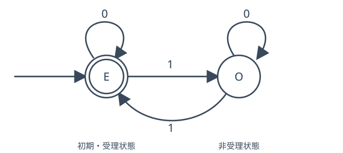

# AUT2 決定性有限オートマトン

[AUT1](../AUT1/index.md)では「1 が偶数個現れる文字列」の集合を言語として記述しました。しかし、言語を集合で指定するだけでは、入力が来たときにどう判定するかは分かりません。入力を左から一文字ずつ読んで、必要な情報だけを記録する機械を作りたいところです。

例えば 1 の個数の偶奇を判定するなら、過去に読んだ文字列そのものを保存する必要はありません。「偶数」か「奇数」の二通りだけを保持し、1 を読むたびに切り替えれば済みます。この記憶を**状態**と呼ぶのが有限オートマトンの発想です。入力を読み終えた状態だけから所属が決まる仕組みを、定義から証明まで組み立てます。

## 1. 二状態の機械から一般の定義へ

まずアルファベットを $\Sigma=\{0,1\}$ とします。状態 $E$ は「今までに読んだ 1 の個数が偶数」、$O$ は「奇数」の意味です。開始時は 0 個なので $E$ です。0 を読むと偶奇は変わらず、1 を読むと逆転します。

| 現在の状態 | 0 を読む | 1 を読む |
|---|---|---|
| $E$（偶数） | $E$ | $O$ |
| $O$（奇数） | $O$ | $E$ |

入力に対し次の状態が**一意に**決まることが重要です。この表は一文字についての規則を余さず指定しています。長い文字列については、これを繰り返し適用します。

<!-- formal-statement-start -->
### 定義（決定性有限オートマトン）

**決定性有限オートマトン**（deterministic finite automaton、以下 DFA）は、五つ組

$$
M=(Q,\Sigma,\delta,q_0,F)
$$

であり、$Q$ は空でない有限の状態集合、$\Sigma$ は空でない有限アルファベット、$\delta:Q\times\Sigma\to Q$ は**すべての状態と入力記号の組**に値を一つ指定する遷移関数、$q_0\in Q$ は初期状態、$F\subseteq Q$ は受理状態の集合である。
<!-- formal-statement-end -->

<!-- definition-example-start: def-aut2-dfa -->

**定義の確認**　上の表なら $Q=\{E,O\}$、$\Sigma=\{0,1\}$、$q_0=E$、$F=\{E\}$ とし、表の四つの欄で $\delta$ を定めます。 **全域関数**という語は、定義域のすべての入力に対して例外なく一つの値が定まる写像を指します。ここでは $Q\times\Sigma$ の四組すべてに行き先が必要です。$Q$ は二つの状態だけからなる空でない集合、$F$ はその部分集合であり、$Q\times\Sigma$ の四つの組のいずれにも行き先がちょうど一つあります。よって五つ組は DFA の全条件を満たします。初期状態 $E$ は入力を一文字も読まないときの状態でもあります。
<!-- definition-example-end -->

受理状態は「そこで入力が**終わった**なら『はい』」という意味であって、そこへ途中で一度でも到達すれば受理するという意味ではありません。例えば入力 11 では $E\to O\to E$ となり受理しますが、入力 1 では $E\to O$ で止まるので受理しません。

## 2. 一文字の遷移を文字列全体へ拡張する

関数 $\delta$ は一文字しか読みません。文字列 1011 を入力して得られる状態を正確に書くため、空文字列の場合を出発点とした拡張を作ります。$wa$ は文字列 $w$ の末尾に一つの記号 $a$ を追加した連結です。

<!-- formal-statement-start -->
### 定義（拡張遷移関数）

DFA $M=(Q,\Sigma,\delta,q_0,F)$ に対し、状態 $q\in Q$ と文字列 $w\in\Sigma^*$ を入力して読み終えた状態 $\widehat{\delta}(q,w)\in Q$ を、次の再帰規則で定める。

$$
\widehat{\delta}(q,\varepsilon)=q,
\qquad
\widehat{\delta}(q,wa)=\delta(\widehat{\delta}(q,w),a)
\quad(w\in\Sigma^*,\ a\in\Sigma).
$$
<!-- formal-statement-end -->

<!-- definition-example-start: def-aut2-extended-transition -->

**定義の確認**　二状態の機械で $\widehat{\delta}(E,1011)$ を求めます。まず

$$
\begin{aligned}
\widehat{\delta}(E,\varepsilon)&=E,\\
\widehat{\delta}(E,1)&=\delta(E,1)=O,\\
\widehat{\delta}(E,10)&=\delta(O,0)=O,\\
\widehat{\delta}(E,101)&=\delta(O,1)=E,\\
\widehat{\delta}(E,1011)&=\delta(E,1)=O.
\end{aligned}
$$

各行は直前までの状態へ最後の一文字を入れています。$1011$ には 1 が三つあるので最終状態 $O$ は解釈とも一致します。
<!-- definition-example-end -->

この定義が本当に任意の文字列で一意に状態を与えるのは、長さ $0$ の値が定まり、長さ $n+1$ の文字列は**長さ $n$ の接頭部と最後の一文字**へただ一通りに分けられるからです。長さに関する帰納法で、各段階に $\delta$ の一意の値を用いれば構成と一意性がともに従います。

長い文字列を二つに分けて読んでも同じ結果になるでしょうか。次の補題が、以後の積構成の基本計算になります。

<!-- formal-statement-start -->
### 補題（拡張遷移と連結）

任意の DFA $M=(Q,\Sigma,\delta,q_0,F)$、状態 $q\in Q$、文字列 $u,v\in\Sigma^*$ に対し、

$$
\widehat{\delta}(q,uv)
=\widehat{\delta}(\widehat{\delta}(q,u),v)
$$

が成り立つ。
<!-- formal-statement-end -->

**証明の見取り図**　まず $u$ を読んだ状態を固定します。その後で $v$ を読むのと、$uv$ を一続きに読むのでは、次の一文字に適用する規則が同じです。

<!-- proof-start -->
### 証明

$u$ と $q$ を固定し、$v$ の長さについて帰納法を使います。$v=\varepsilon$ なら左辺は $\widehat{\delta}(q,u)$、右辺も $\widehat{\delta}(\widehat{\delta}(q,u),\varepsilon)=\widehat{\delta}(q,u)$ です。

長さ $n$ のすべての $v$ で等式が成立するとします。長さ $n+1$ の文字列を $va$（$|v|=n,\ a\in\Sigma$）と書きます。再帰規則を **$uva$ の末尾 $a$** に適用し、帰納法の仮定を挟むと、

$$
\begin{aligned}
\widehat{\delta}(q,u(va))
&=\delta(\widehat{\delta}(q,uv),a)\\
&=\delta(\widehat{\delta}(\widehat{\delta}(q,u),v),a)\\
&=\widehat{\delta}(\widehat{\delta}(q,u),va).
\end{aligned}
$$

最初の等号で文字列連結の結合性により $u(va)=(uv)a$ を使っています。最後の等号は再帰規則の逆向きです。帰納法により任意の長さの $v$ で成り立ちます。
<!-- proof-end -->

## 3. 受理と状態遷移図

最後の状態を得たら、その状態が $F$ に属するかだけを確認します。これにより「計算」と「どの言語を認識するか」が結び付きます。

<!-- formal-statement-start -->
### 定義（DFA が認識する言語・正規言語）

DFA $M=(Q,\Sigma,\delta,q_0,F)$ の**認識言語**を

$$
L(M)=\{w\in\Sigma^*:\widehat{\delta}(q_0,w)\in F\}
$$

と定める。ある DFA $M$ が存在して $L=L(M)$ と表せる言語 $L$ を、**正規言語**とする。
<!-- formal-statement-end -->

<!-- definition-example-start: def-aut2-recognized-language -->

**定義の確認**　二状態の機械では空文字列で最終状態 $E\in F$ なので $\varepsilon\in L(M)$ です。文字列 $10$ では $E\to O\to O$ となり非受理、文字列 $101$ では $E\to O\to O\to E$ となり受理です。このように認識言語は状態遷移の結果で決まり、$1$ が偶数個の文字列全体となります。従ってこの言語は正規言語です。
<!-- definition-example-end -->

状態と矢印を図にすると、記号を読んだときの行き先が目で追えます。図では矢印の向きが遷移方向、矢印の横の 0 / 1 が読んだ記号です。外から入る矢印は初期状態、二重丸は受理状態を表します。

この図は上の表と同じ関数 $\delta$ を表しています。**二重丸は状態の属性**であり、矢印の行き先を変えるものではありません。

<!-- formal-statement-start -->
### 定義（状態遷移図）

DFA $M=(Q,\Sigma,\delta,q_0,F)$ の状態遷移図では各状態 $q\in Q$ を頂点とし、各組 $(q,a)\in Q\times\Sigma$ に対して、$q$ から $\delta(q,a)$ へ向かう、記号 $a$ を付した矢印を描く。$q_0$ に外部から開始矢印を付し、$F$ に属する状態は二重丸で示す。
<!-- formal-statement-end -->

<!-- definition-example-start: def-aut2-transition-diagram -->

**定義の確認**　図中の $E$ から記号 1 の矢印は $O$ に向かい、表の $\delta(E,1)=O$ と一致します。$O$ から記号 0 の矢印は $O$ 自身へ戻り、$\delta(O,0)=O$ と一致します。四つの状態・記号の組が四つの矢印へ対応し、開始矢印は $E$、二重丸は $E$ のみです。
<!-- definition-example-end -->

### 3.1 不変条件で認識を証明する

いくつかの入力が正しく受理されることと、**すべての**入力に対して正しいことは別です。前章の偶奇言語との一致を帰納法で閉じます。

<!-- formal-statement-start -->
### 命題（二状態 DFA の認識言語）

$Q=\{E,O\}$、$\Sigma=\{0,1\}$、$q_0=E$、$F=\{E\}$ とし、$\delta(E,0)=E$、$\delta(E,1)=O$、$\delta(O,0)=O$、$\delta(O,1)=E$ で定義した DFA $M$ について、

$$
L(M)=\{w\in\{0,1\}^*:w\text{ に現れる }1\text{ の個数が偶数}\}
$$

が成り立つ。
<!-- formal-statement-end -->

**証明の見取り図**　文字列を読んだときの状態が偶奇を正しく記録していることを、入力長について示します。受理の判定はその帰結です。

<!-- proof-start -->
### 証明

$N_1(w)$ を $w$ に含まれる記号 1 の個数とします。次の不変条件をすべての $w$ で証明します。$N_1(w)$ が偶数なら $\widehat{\delta}(E,w)=E$、奇数なら $\widehat{\delta}(E,w)=O$ です。

$w=\varepsilon$ のとき $N_1(w)=0$ は偶数、拡張遷移は $E$ です。長さ $n$ の文字列で不変条件が成立するとし、長さ $n+1$ の文字列を $wa$ とします。

$a=0$ のとき $N_1(wa)=N_1(w)$ であり、$\delta(E,0)=E$、$\delta(O,0)=O$ なので状態と偶奇はいずれも保存されます。

$a=1$ のとき $N_1(wa)=N_1(w)+1$ です。$N_1(w)=2k$ なら $N_1(wa)=2k+1$ で、状態は $E$ から $\delta(E,1)=O$ へ移ります。$N_1(w)=2k+1$ なら $N_1(wa)=2(k+1)$ で、状態は $O$ から $\delta(O,1)=E$ へ移ります。$k$ はそれぞれ非負整数です。よって帰納法が閉じます。

受理状態は $F=\{E\}$ のみなので、$w\in L(M)$ と最終状態が $E$ であることと、$N_1(w)$ が偶数であることは同値です。
<!-- proof-end -->

状態には何でも詰め込むのではなく、判定に必要な情報だけを割り当てます。例えば「最後に読んだ記号が 1」という言語なら、開始直後も非受理とする二状態の機械で足ります。一方「1 の個数が 3 の倍数」という言語なら剰余 0、1、2 の三状態を使えます。

## 4. 二つの条件を同時に調べる積オートマトン

「1 の個数が偶数」かつ「最後の記号が 1」という問いは、一つの状態だけでは二つの情報を記録できません。しかし、すでにある二台の DFA の状態を**組**にすれば、両方を同じ入力に対して並行更新できます。

アルファベットを共通の $\Sigma$ とする DFA を $M_1=(Q_1,\Sigma,\delta_1,s_1,F_1)$、$M_2=(Q_2,\Sigma,\delta_2,s_2,F_2)$ とします。状態 $(p,r)$ は、同じ入力を読んだ後、第一の機械が $p$、第二の機械が $r$ にいることを記録します。

<!-- formal-statement-start -->
### 定義（積オートマトン）

共通の有限アルファベット $\Sigma$ 上の DFA $M_i=(Q_i,\Sigma,\delta_i,s_i,F_i)$（$i=1,2$）に対し、状態集合 $Q_1\times Q_2$、初期状態 $(s_1,s_2)$、遷移

$$
\delta_\times((p,r),a)=(\delta_1(p,a),\delta_2(r,a))
$$

を持つ DFA を**積オートマトン**とする。受理集合を選ぶことで同時成立や少なくとも一方の成立を判定できる。
<!-- formal-statement-end -->

<!-- definition-example-start: def-aut2-product-automaton -->

**定義の確認**　第一の DFA を偶奇機械（$Q_1=\{E,O\}$）、第二の DFA を「最後の記号が 1」（$Q_2=\{N,Y\}$、初期 $N$、0 で常に $N$、1 で常に $Y$）とします。積状態は $(E,N),(E,Y),(O,N),(O,Y)$ の四つで、初期状態は $(E,N)$。例えば記号1を読むと

$$
\delta_\times((E,N),1)=(\delta_1(E,1),\delta_2(N,1))=(O,Y).
$$

この結果は偶奇が奇数かつ最後が1という事実を表します。全四状態・両入力について両成分に遷移があるため積も DFA です。
<!-- definition-example-end -->

積の最終状態が各成分の最終状態と一致することを示せれば、集合演算の証明ができます。

<!-- formal-statement-start -->
### 補題（積の拡張遷移は成分ごとに計算できる）

上記の二台の DFA の積の拡張遷移を $\widehat{\delta}_\times$ とすると、任意の $(p,r)\in Q_1\times Q_2$ と $w\in\Sigma^*$ について、

$$
\widehat{\delta}_\times((p,r),w)
=(\widehat{\delta}_1(p,w),\widehat{\delta}_2(r,w))
$$

が成立する。
<!-- formal-statement-end -->

**証明の見取り図**　空文字列なら各成分はそのまま。最後に一文字追加したときも、成分ごとの更新しか行いません。

<!-- proof-start -->
### 証明

$w$ の長さについて帰納法を使います。$w=\varepsilon$ では左辺 $(p,r)$、右辺 $(p,r)$ です。ある $w$ で等式が成立すると仮定し、$a\in\Sigma$ を追加します。積に対する拡張遷移の再帰規則により

$$
\begin{aligned}
\widehat{\delta}_\times((p,r),wa)
&=\delta_\times(\widehat{\delta}_\times((p,r),w),a)\\
&=\delta_\times((\widehat{\delta}_1(p,w),\widehat{\delta}_2(r,w)),a)\\
&=(\delta_1(\widehat{\delta}_1(p,w),a),
\delta_2(\widehat{\delta}_2(r,w),a))\\
&=(\widehat{\delta}_1(p,wa),\widehat{\delta}_2(r,wa)).
\end{aligned}
$$

二行目は帰納法の仮定、三行目は積遷移の定義、最終行は各拡張遷移の再帰規則によります。すべての文字列に成立します。
<!-- proof-end -->

### 4.1 共通部分は両方が受理した場合

<!-- formal-statement-start -->
### 定理（正規言語の共通部分に関する閉性）

同じ有限アルファベット $\Sigma$ 上の正規言語 $L_1,L_2\subseteq\Sigma^*$ に対し、共通部分 $L_1\cap L_2$ も正規言語である。$L_i=L(M_i)$ を認識する DFA $M_i=(Q_i,\Sigma,\delta_i,s_i,F_i)$ があるとき、積オートマトンの受理集合を $F_1\times F_2$ と選べばよい。
<!-- formal-statement-end -->

**証明の見取り図**　「両方とも受理した」を、最終状態の組が $F_1\times F_2$ に属することへ翻訳します。状態数は $|Q_1||Q_2|$ 以内です。

<!-- proof-start -->
### 証明

定義の積 $M_\cap=(Q_1\times Q_2,\Sigma,\delta_\times,(s_1,s_2),F_1\times F_2)$ を構成します。二つの状態集合は非空かつ有限だから直積も非空有限です。各 $(p,r)$ と $a$ の行き先は $\delta_1(p,a),\delta_2(r,a)$ により一意に決まるので、積は DFA です。

任意の $w\in\Sigma^*$ を固定します。積の補題を **初期組 $(s_1,s_2)$** に適用すると、

$$
\widehat{\delta}_\times((s_1,s_2),w)
=(\widehat{\delta}_1(s_1,w),\widehat{\delta}_2(s_2,w)).
$$

この組が $F_1\times F_2$ に属する条件は、第一成分が $F_1$ に、かつ第二成分が $F_2$ に属することです。したがって

$$
\begin{aligned}
w\in L(M_\cap)
&\iff\widehat{\delta}_\times((s_1,s_2),w)\in F_1\times F_2\\
&\iff\widehat{\delta}_1(s_1,w)\in F_1
\text{ かつ }\widehat{\delta}_2(s_2,w)\in F_2\\
&\iff w\in L_1\cap L_2.
\end{aligned}
$$

すべての $w$ で一致するため、$L(M_\cap)=L_1\cap L_2$ です。これを認識する DFA を構成したので、共通部分も正規言語です。
<!-- proof-end -->

上の偶奇機械と末尾1機械の積なら、受理する状態は $(E,Y)$ のみです。例えば 101 は 1 が二個で最後が1なので受理、11 も受理、110 は偶数個でも最後0なので非受理です。

### 4.2 和集合ならどちらかが受理すればよい

<!-- formal-statement-start -->
### 定理（正規言語の和集合に関する閉性）

同じ有限アルファベット $\Sigma$ 上の正規言語 $L_1,L_2$ に対し、和集合 $L_1\cup L_2$ も正規言語である。各言語を認識する DFA $M_i=(Q_i,\Sigma,\delta_i,s_i,F_i)$ に対し、積オートマトンの受理集合を

$$
(F_1\times Q_2)\cup(Q_1\times F_2)
$$

とすれば $L_1\cup L_2$ を認識する。
<!-- formal-statement-end -->

**証明の見取り図**　同じ積遷移を使い、受理条件だけを「両方」から「どちらか」へ変更します。

<!-- proof-start -->
### 証明

積オートマトンを $M_\cup$ とし、受理集合を上記の集合とします。直積状態と遷移が DFA の条件を満たすことは共通部分の構成と同じですが、受理条件を直接確認します。任意の文字列 $w$ に対し、積の補題から最終状態は $(p_w,r_w)$、ここで $p_w=\widehat{\delta}_1(s_1,w)$、$r_w=\widehat{\delta}_2(s_2,w)$ です。

$$
\begin{aligned}
(p_w,r_w)&\in(F_1\times Q_2)\cup(Q_1\times F_2)\\
&\iff (p_w\in F_1\text{ かつ }r_w\in Q_2)
 \text{ または }(p_w\in Q_1\text{ かつ }r_w\in F_2)\\
&\iff p_w\in F_1\text{ または }r_w\in F_2\\
&\iff w\in L_1\cup L_2.
\end{aligned}
$$

中段で $p_w\in Q_1,r_w\in Q_2$ を用いています。よって $L(M_\cup)=L_1\cup L_2$ となります。
<!-- proof-end -->

## 5. 受理・非受理を入れ替える補集合

同じ入力について「はい」と「いいえ」を逆にしたいなら、機械の動作を変える必要はありません。**入力を最後まで読み終えたとき**の受理状態だけを反転します。

<!-- formal-statement-start -->
### 定理（正規言語の補集合に関する閉性）

有限アルファベット $\Sigma$ 上の正規言語 $L\subseteq\Sigma^*$ に対し、$\Sigma^*\setminus L$ も正規言語である。$L=L(M)$ を認識する DFA $M=(Q,\Sigma,\delta,q_0,F)$ に対し、

$$
M^c=(Q,\Sigma,\delta,q_0,Q\setminus F)
$$

は $L(M^c)=\Sigma^*\setminus L$ を満たす。
<!-- formal-statement-end -->

**証明の見取り図**　同じ $\delta$ と初期状態を使うので、どの入力も両機械で同じ最終状態へ到達します。その状態が $F$ に属するか、属さないかだけが逆転します。

<!-- proof-start -->
### 証明

$Q\setminus F\subseteq Q$ なので $M^c$ も DFA です。任意の $w\in\Sigma^*$ に対して、遷移関数と初期状態が同じであるため、両機械の拡張遷移による最終状態を $q_w=\widehat{\delta}(q_0,w)$ と書けます。$q_w$ は **必ず $Q$ の一つの状態**です。従って、

$$
\begin{aligned}
w\in L(M^c)
&\iff q_w\in Q\setminus F\\
&\iff q_w\notin F\\
&\iff w\notin L(M)\\
&\iff w\in\Sigma^*\setminus L.
\end{aligned}
$$

任意の入力について同値なので、両言語は一致します。
<!-- proof-end -->

ここで DFA の $\delta:Q\times\Sigma\to Q$ が**全域関数**であるという仮定が効きます。例えば「状態 $A$ で 1 を読んだ先が未定義」という表は、この章の DFA の定義を満たしません。未定義の入力をその場で拒否するとだけ考え、表の受理欄だけを反転しても、未定義遷移に到達した入力が受理されるとは限りません。

部分的な遷移表を使いたい場合は、全入力で遷移を定義するため新しい**行き止まり状態** $D$ を追加できます。例えば未定義の矢印を $D$ へ向け、$D$ からは各記号で $D$ 自身へ移るようにすれば、まず全域的な DFA になります。その後なら受理集合を反転できます。元の機械の非受理の行き先だった $D$ も反転後は受理になることを忘れてはいけません。

補集合では $\Sigma$ を固定します。$\{0,1\}^*$ に対する補集合と $\{0,1,2\}^*$ に対する補集合は、入力全体が違うため同一ではありません。また空文字列は「読まないので判定しない」ではなく、初期状態が受理かどうかで必ず判定します。

## 6. どこまでできるようになったか

DFA は有限個の状態しか持たないにもかかわらず、どんな長さの入力に対しても一文字ずつ遷移を繰り返して所属を判定できます。偶奇判定、末尾の記号、有限個の条件の組合せは、その具体例です。積構成によって、有限状態で判定できる条件同士を合わせても有限状態で判定できます。

ただし「言語に名前が付いているから DFA がある」とは限りません。入力の前半と後半を無制限に比較するような判定では、有限個の記憶で足りるでしょうか。次の AUT3 では非決定性と正規表現という別の表現を導入し、その次の AUT4 で有限状態の限界を証明します。

---

## 演習

### Level A

### A1. 遷移表を最後までたどる

$\Sigma=\{0,1\}$、$Q=\{E,O\}$、$q_0=E$、$F=\{E\}$ とし、$\delta(E,0)=E,\delta(E,1)=O,\delta(O,0)=O,\delta(O,1)=E$ とする。$\varepsilon,01,101,1110$ それぞれの状態列と受理・非受理を求めよ。

- Level: A

<!-- solution-start -->
#### 詳細解答

$\varepsilon$ では $\widehat{\delta}(E,\varepsilon)=E$ なので受理です。$01$ は $E\xrightarrow{0}E\xrightarrow{1}O$ となり非受理です。$101$ は $E\xrightarrow{1}O\xrightarrow{0}O\xrightarrow{1}E$ なので受理です。$1110$ は $E\xrightarrow{1}O\xrightarrow{1}E\xrightarrow{1}O\xrightarrow{0}O$ なので非受理です。各記号ごとに一回ずつ遷移を適用し、最後だけ受理集合と照合しました。
<!-- solution-end -->

### A2. 五つ組の条件を点検する

$Q=\{A,B\}$、$\Sigma=\{0,1\}$、$q_0=A$、$F=\{B\}$ とする。$\delta(A,0)=A,\delta(A,1)=B,\delta(B,0)=A$ だけを指定したとき、DFA になっているか。なっていなければ何が欠けているかを示し、$\delta(B,1)=B$ と補った場合に入力 110 の最終状態を求めよ。

- Level: A

<!-- solution-start -->
#### 詳細解答

$Q\times\Sigma$ は $(A,0),(A,1),(B,0),(B,1)$ の四組です。指定された値は三組だけなので $(B,1)$ の行き先が欠け、$\delta$ は $Q\times\Sigma$ 上の全域関数ではありません。従って DFA ではありません。値を補った後は、$A\xrightarrow{1}B\xrightarrow{1}B\xrightarrow{0}A$ なので最終状態 $A$ となり、$F=\{B\}$ には属さず非受理です。
<!-- solution-end -->

### A3. 最終記号を記録する DFA

$\Sigma=\{0,1\}$ とし、文字列が 1 で終わる場合に限って受理する二状態 DFA を五つ組で与えよ。$\varepsilon,10,101$ の判定も示せ。

- Level: A

<!-- solution-start -->
#### 詳細解答

$Q=\{N,Y\}$、$q_0=N$、$F=\{Y\}$ とします。どちらの状態からでも $\delta(N,0)=N,\delta(Y,0)=N$、$\delta(N,1)=Y,\delta(Y,1)=Y$ とすれば、最新の記号が0なら $N$、1なら $Y$ になります。空文字列では初期 $N$ のままなので非受理。10 では $N\to Y\to N$ なので非受理、101 では $N\to Y\to N\to Y$ なので受理です。入力が空の場合は「最後の記号」が存在せず、非受理状態を初期に選んだことと整合します。
<!-- solution-end -->

### A4. 補集合の受理状態

A1 の二状態 DFA の受理集合だけを $F'=\{O\}$ に変えた機械について、$\varepsilon,1,011$ の所属を求め、認識言語を説明せよ。

- Level: A

<!-- solution-start -->
#### 詳細解答

受理状態は $O$ のみです。$\varepsilon$ は初期 $E$ で止まるので非受理。1 では $E\to O$ なので受理。011 では $E\xrightarrow{0}E\xrightarrow{1}O\xrightarrow{1}E$ なので非受理です。一般には 1 を読むたび $E$ と $O$ が入れ替わり、0 では変化しないので、最終状態が $O$ となるのは 1 の個数が奇数の場合に限られます。これは元の偶数言語の $\{0,1\}^*$ における補集合です。
<!-- solution-end -->

### A5. 三状態の剰余判定

$\Sigma=\{0,1\}$ とし、文字列中の 1 の個数を 3 で割った余りが $r\in\{0,1,2\}$ であることを状態 $r$ で表す。初期状態・受理状態・全遷移を指定し、1110 と 11 の判定をせよ。

- Level: A

<!-- solution-start -->
#### 詳細解答

$Q=\{0,1,2\}$、$q_0=0$、$F=\{0\}$ とします。記号 0 では個数が変わらないので $\delta(r,0)=r$、記号 1 では一個増えるので $\delta(0,1)=1,\delta(1,1)=2,\delta(2,1)=0$ です。六つの状態・記号の組すべてを定めました。1110 の状態列は $0\to1\to2\to0\to0$ で受理、11 は $0\to1\to2$ で非受理です。空文字列は 1 を0個含むため受理します。
<!-- solution-end -->

### Level B

### B1. 文字列を分けて状態を計算する

A1 の DFA で $u=101$、$v=10$ とする。$\widehat{\delta}(E,u)$、$\widehat{\delta}(\widehat{\delta}(E,u),v)$、$\widehat{\delta}(E,uv)$ をそれぞれ計算し、連結補題の等式を具体的に確かめよ。

- Level: B

<!-- solution-start -->
#### 詳細解答

まず $u=101$ について $E\xrightarrow{1}O\xrightarrow{0}O\xrightarrow{1}E$ より $\widehat{\delta}(E,u)=E$ です。続く $v=10$ は $E\xrightarrow{1}O\xrightarrow{0}O$ なので、$\widehat{\delta}(\widehat{\delta}(E,u),v)=O$。一方 $uv=10110$ の状態列は $E\to O\to O\to E\to O\to O$ であり、$\widehat{\delta}(E,uv)=O$ です。どちらも同じ $O$ になり、連結補題を入力 $u,v$ に適用した結果と一致します。
<!-- solution-end -->

### B2. 積構成を表にする

$M_1$ は A1 の偶奇 DFA、$M_2$ は A3 の末尾1 DFA とする。積の四状態 $(E,N),(E,Y),(O,N),(O,Y)$ について 0 と 1 の遷移を全て表にし、二つの言語の共通部分を認識する受理集合を示せ。入力 101 と 110 の状態列を求めよ。

- Level: B

<!-- solution-start -->
#### 詳細解答

遷移は各成分に同じ文字を読ませて作ります。

| 積状態 | 0 | 1 |
|---|---|---|
| $(E,N)$ | $(E,N)$ | $(O,Y)$ |
| $(E,Y)$ | $(E,N)$ | $(O,Y)$ |
| $(O,N)$ | $(O,N)$ | $(E,Y)$ |
| $(O,Y)$ | $(O,N)$ | $(E,Y)$ |

共通部分の受理集合は $\{E\}\times\{Y\}=\{(E,Y)\}$ です。初期 $(E,N)$ から 101 は $(E,N)\to(O,Y)\to(O,N)\to(E,Y)$ で受理、110 は $(E,N)\to(O,Y)\to(E,Y)\to(E,N)$ で非受理です。101 は 1 が二個で末尾1、110 は 1 が二個でも末尾0という各成分の解釈とも一致します。
<!-- solution-end -->

### B3. 三つの剰余条件と積

$L_2=\{w\in\{0,1\}^*:N_1(w)\text{ は偶数}\}$、$L_3=\{w:N_1(w)\text{ は3の倍数}\}$ とする。A1・A5 の機械を積にしたときの状態数、初期状態、共通部分の受理状態を示し、積の遷移と剰余の意味から $L_2\cap L_3$ を記述せよ。

- Level: B

<!-- solution-start -->
#### 詳細解答

二状態と三状態の直積なので状態は $2\cdot3=6$ 個、初期状態は $(E,0)$、受理状態は $\{(E,0)\}$ です。各記号で両成分を更新するので、読んだ 1 の個数を $m$ とすると第一成分は $m$ の偶奇、第二成分は $m$ を3で割った余りになります。$(E,0)$ に戻る条件は $m=2a$ かつ $m=3b$（$a,b$ は非負整数）です。$m=3b$ が偶数なら、3 は奇数だから $b$ は偶数です。そこで $b=2c$ と書くと $m=6c$ となります。逆に $m=6c$ は2でも3でも割り切れます。従って認識言語は $\{w:N_1(w)\text{ は6の倍数}\}$ です。
<!-- solution-end -->

### B4. 補集合と未定義遷移の落とし穴

$Q=\{A\}$、$\Sigma=\{0,1\}$、初期状態 $A$、受理集合 $\{A\}$、定義済みの遷移は $\delta(A,0)=A$ のみとする。未定義遷移に遭遇した入力は拒否すると仮に決める。(1) この表は DFA か。(2) 受理集合を空に反転するだけで補集合が得られるか。(3) 行き止まり状態 $D$ を加えて全域化し、その後で補集合を正しく作れ。

- Level: B

<!-- solution-start -->
#### 詳細解答

(1) $\delta(A,1)$ が定義されていないので、$Q\times\Sigma$ 上の全域関数ではなく DFA ではありません。この仮の規則で認識する文字列は 0 だけを並べたもの（$\varepsilon$ を含む）です。

(2) 受理集合だけを空にすると、0 のみの入力も 1 を含む入力も拒否し、認識言語は空集合です。しかし元の言語の補集合には文字列 1 が属するので一致しません。

(3) $Q'=\{A,D\}$ とし、$\delta'(A,0)=A,\delta'(A,1)=D,\delta'(D,0)=D,\delta'(D,1)=D$ とします。元と同じ言語を認識する全域的な機械の受理集合は $\{A\}$ です。今度は $Q'\setminus\{A\}=\{D\}$ に反転します。0 だけの入力では $A$ のまま非受理となり、1 を一度でも含む入力ではその最初の 1 で $D$ に入り、以後 $D$ のまま受理となります。従って $\{w:w\text{ は1を少なくとも一つ含む}\}$ という正しい補集合を認識します。
<!-- solution-end -->

### Level C

### C1. 先頭・末尾と偶奇の組合せ

$\Sigma=\{0,1\}$ とする。$L$ は「入力が空でなく、先頭記号が 0、末尾記号が 1、記号 1 の個数が偶数」である文字列の集合とする。

1. 先頭が 0 であることを記録する DFA を構成せよ。必要な状態を全て区別せよ。空文字列と、先頭が 1 の入力を正しく拒否することを確認せよ。
2. A1 の偶奇機械、A3 の末尾機械、(1) の先頭機械を組み合わせて $L$ を認識する DFA を構成せよ。状態集合、初期状態、遷移、受理状態を明記せよ。
3. $\varepsilon,011,0101,0011,1011$ の受理を状態の意味から判定せよ。構成した機械がすべての入力について正しいことを示せ。

- Level: C

<!-- solution-start -->
#### 詳細解答

(1) $Q_H=\{S,G,X\}$ の **三状態** が自然です。$S$ は未読、$G$ は最初が0であると確認済み、$X$ は最初が1だった状態とします。初期 $S$、受理集合 $\{G\}$、遷移は $\delta_H(S,0)=G,\delta_H(S,1)=X$、$a\in\{0,1\}$ に対して $\delta_H(G,a)=G,\delta_H(X,a)=X$ とします。$\varepsilon$ は $S$ のままで非受理、最初が1なら $X$ へ入り永久に非受理です。最初が0なら $G$ へ入り、後続の記号で変わらないので受理です。二状態では、初期（未読）、良（先頭0）、悪（先頭1）の三つの履歴を区別できません。例えば未読と悪を同じ状態にすると、次に 0 を読んだとき前者だけ受理すべきなのに、同じ状態から同じ記号を読むので区別できません。

(2) 偶奇の $Q_P=\{E,O\}$ と末尾の $Q_T=\{N,Y\}$ に加えて、(1) の $Q_H$ を使います。直積状態集合 $Q=Q_H\times Q_P\times Q_T$ は $3\cdot2\cdot2=12$ 個で、初期状態は $(S,E,N)$。入力記号 $a$ に対して

$$
\delta((h,p,t),a)=(\delta_H(h,a),\delta_P(p,a),\delta_T(t,a))
$$

とします。受理集合は $\{(G,E,Y)\}$ です。三つとも各記号に対して全域かつ一意の遷移を持つため、直積も DFA になります。

(3) $\varepsilon$ は $(S,E,N)$ のまま非受理です。011 は先頭0、末尾1、1が二個なので $(G,E,Y)$ へ至り受理です。0101 は1が二個なので受理、0011 も1が二個なので受理です。1011 は先頭1なので $X$ 成分となり非受理です。

一般の $w$ について、先頭成分は入力長0なら $S$、入力長が正で先頭0なら $G$、先頭1なら $X$ です。偶奇成分は 1 の個数の偶奇を表し、末尾成分は空文字列では $N$、非空では末尾が1かどうかを表します。各成分の更新規則から文字列長について帰納的にこれらの意味が保存され、直積の拡張遷移も成分ごとの最終状態と一致します。従って最終状態が $(G,E,Y)$ となることと $w\in L$ は同値です。
<!-- solution-end -->
