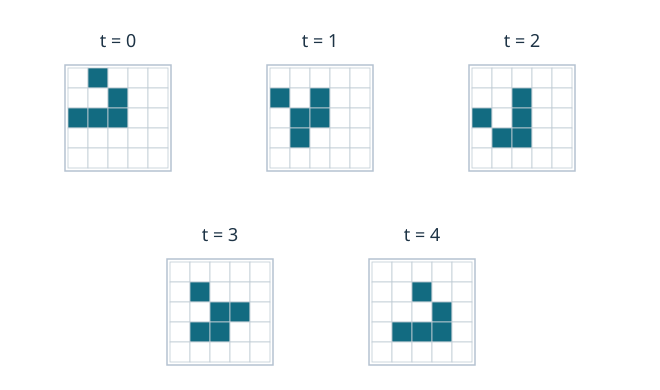

# CELL11 二次元CAとConwayのGame of Life

[CELL1の局所更新](../CELL1/index.md#def-cell1-global-update)では、一次元のセルを同時に更新しました。一次元では左右の並びを読めば十分でしたが、平面に並ぶセルには上下や斜め方向の隣接関係もあります。例えば、生きたセルが集団を作るとき、横に三つ並ぶ場合と正方形に四つ集まる場合とで、次の時刻に同じことが起こるとは限りません。

本章では、まず平面の「近所」を座標で定義し、**どれだけ離れた初期情報が有限時間後の結果に影響し得るか**を証明します。その後、平面で使うLifeという規則について、止まる模様・繰り返す模様・位置を変えて戻る模様を手計算します。規則はどの位置でも同じですが、出現する振る舞いは一種類ではありません。

以下では横軸を $x$（右が正）、縦軸を $y$（下が正）とし、座標 $(x,y)\in\mathbb Z^2$ をセルの位置とします。無限平面 $\mathbb Z^2$ と、端を持つ有限盤面を混同しないことが最初の約束です。

## 1. 平面で「隣のセル」を指定する

一次元の半径1は、位置 $i$ に対して $i-1,i,i+1$ を見るという指定でした。平面では、斜めを含めるかどうかも決める必要があります。

<!-- formal-statement-start -->
### 定義（二次元の近傍）

格子 $\mathbb Z^2$ 上で位置 $z=(x,y)$ に対し、有限集合 $D\subset\mathbb Z^2$ を**参照オフセット集合**とする。位置 $z$ の参照位置の集合を $z+D=\{z+u:u\in D\}$ とする。

半径1の**Moore近傍**（中心を含む参照領域）は $D_M=\{-1,0,1\}^2$、**von Neumann近傍**（中心を含む参照領域）は $D_V=\{(a,b)\in\mathbb Z^2:|a|+|b|\le1\}$ とする。近隣セル数を数えるときは、いずれも中心 $(0,0)$ を除く。
<!-- formal-statement-end -->

<!-- definition-example-start: def-cell11-neighborhood -->

**定義の確認**　$z=(2,3)$ に対して $z+(1,1)=(3,4)$ は $z+D_M$ に入ります。オフセット $(1,1)$ は $D_M$ に入りますが、$|1|+|1|=2>1$ なので $D_V$ には入りません。一方、$(0,-1)$ は両方に入ります。中心を除くとMoore近隣は8セル、von Neumann近隣は4セルです。
<!-- definition-example-end -->

中心を ●、参照する近隣を ■、参照しない位置を ・ とすると、二種類は次のとおりです。

| Moore（8近隣） | von Neumann（4近隣） |
|---|---|
| ■ ■ ■ | ・ ■ ・ |
| ■ ● ■ | ■ ● ■ |
| ■ ■ ■ | ・ ■ ・ |

「斜めの一つ」を見落とすだけで、Lifeの誕生数は変わります。どの近傍を採用するかを、規則の名前から勝手に推定しないでください。

## 2. 二次元の局所規則と大域更新

参照集合が有限なら、各セルで読み込む情報も有限です。それを全格子へ同時に適用すれば、一次元と同じ考え方で大域更新ができます。

<!-- formal-statement-start -->
### 定義（二次元セル・オートマトン）

$Q$ を空でない有限状態集合、$X=Q^{\mathbb Z^2}$ を配置全体の集合、$D\subset\mathbb Z^2$ を有限な参照オフセット集合、$f:Q^D\to Q$ を局所規則とする。大域更新 $F:X\to X$ を、任意の $c\in X$ と $z\in\mathbb Z^2$ に対して

$$
F(c)(z)=f\bigl((c(z+u))_{u\in D}\bigr)
$$

で定める。全ての右辺を更新前の同じ配置 $c$ から評価する。
<!-- formal-statement-end -->

<!-- definition-example-start: def-cell11-2d-ca -->

**定義の確認**　$Q=\{0,1\},D=D_V$ とし、$f$ が中央の値だけを返す規則を選びます。どの位置 $z$ でも $F(c)(z)=c(z)$ となり、$F$ は恒等写像です。局所規則の入力は5セルに限られ、出力は必ず $Q$ に入るため、定義の条件を満たします。平面であっても、局所規則を指定するだけで大域写像は全位置で一意です。
<!-- definition-example-end -->

有限集合 $D$ はある整数 $r\ge0$ に対して $D\subset[-r,r]^2$ を満たします。この $r$ は座標ごとの最大距離で測った参照半径です。$D=D_M$ の場合には $r=1$ です。

## 3. LifeのB3/S23を、例から規則式へ

Lifeでは状態を $0$（死）と $1$（生）の二つとし、**中心を除くMoore近隣8セル**にある生存数だけで次の状態を決めます。誕生条件の B3 は「死セルで近隣の生存数が3なら生まれる」、生存条件の S23 は「生セルで生存数が2か3なら生き残る」の意味です。それ以外は死になります。

位置 $z$ の配置 $c$ に対し、近隣の生存数を次の式で数えます。

$$
n_c(z)=\sum_{u\in D_M\setminus\{(0,0)\}}c(z+u).
$$

右辺は8個の0または1の和なので、$0\le n_c(z)\le8$ です。例えば死セルの周りで上・左・右の3セルだけが生きていれば $n_c(z)=3$ なので、次時刻の中心は1になります。もとの中心が生きていて近隣が1セルしかなければ次は0です。

<!-- formal-statement-start -->
### 定義（ConwayのGame of Life：B3/S23）

$X=\{0,1\}^{\mathbb Z^2}$ とし、$D_M=\{-1,0,1\}^2$ とする。任意の配置 $c\in X$ と位置 $z\in\mathbb Z^2$ について、$n_c(z)=\sum_{u\in D_M\setminus\{(0,0)\}}c(z+u)$ と置く。Lifeの大域更新 $L:X\to X$ は

$$
L(c)(z)=
\begin{cases}
1 & c(z)=0,\ n_c(z)=3,\\
1 & c(z)=1,\ n_c(z)\in\{2,3\},\\
0 & \text{その他}
\end{cases}
$$

で定める。時刻 $t$ の配置は $c^{(t)}=L^t(c^{(0)})$ と表す。
<!-- formal-statement-end -->

<!-- definition-example-start: def-cell11-life -->

**定義の確認**　中央が死で、近隣の生セルがちょうど3なら、第1行によって中央は1です。中央が生で近隣の生セルが3なら第2行で1、同じ生セルの近隣が4なら第3行で0です。どの中心状態・近隣数も三つの条件のいずれか一つに入り、出力が一意に決まります。
<!-- definition-example-end -->

| 中央の現在値 | 近隣の生存数 | 次時刻に生 |
|---|---|---|
| 0 | 3 | はい（誕生） |
| 0 | 0,1,2,4,5,6,7,8 | いいえ |
| 1 | 2,3 | はい（生存） |
| 1 | 0,1,4,5,6,7,8 | いいえ |

## 4. 二次元でも情報は一瞬に遠方へ届かない

Lifeの模様は動いて見えますが、遠くの一セルからの影響が瞬間的に無限遠まで広がることはありません。正方形状の影響範囲を使えば、[CELL2の一次元有限伝播](../CELL2/index.md#thm-cell2-finite-propagation)を平面で証明し直せます。

<!-- formal-statement-start -->
### 定理（二次元CAの有限伝播）

$Q$ は空でない有限集合、$F:Q^{\mathbb Z^2}\to Q^{\mathbb Z^2}$ は参照オフセット集合 $D\subset[-r,r]^2\cap\mathbb Z^2$ を用いる二次元CAとし、$r\ge0$ は整数とする。任意の $t\ge0$、位置 $z=(x,y)$、配置 $c,d$ について、初期配置 $c,d$ が正方形

$$
B_\infty(z,rt)=\{(a,b)\in\mathbb Z^2:|a-x|\le rt,\ |b-y|\le rt\}
$$

上で一致するなら、$F^t(c)(z)=F^t(d)(z)$ である。
<!-- formal-statement-end -->

**証明の見取り図**　時刻 $t+1$ の $z$ は、時刻 $t$ における $z+D$ の値から決まります。各 $z+u$ が参照する初期正方形の座標差は、高々 $rt+r=r(t+1)$ です。この包含関係を帰納法で確かめます。

<!-- proof-start -->
### 証明

$t=0$ では $B_\infty(z,0)=\{z\}$ です。仮定から $c(z)=d(z)$ なので、$F^0(c)(z)=F^0(d)(z)$ です。

任意の非負整数 $t$ で主張が成り立つと仮定し、$t+1$ を示します。$c,d$ が $B_\infty(z,r(t+1))$ 上で一致するとします。任意の $u=(u_1,u_2)\in D$ を選ぶと $|u_1|,|u_2|\le r$ です。

$w=(a,b)\in B_\infty(z+u,rt)$ なら、$z=(x,y)$ に対して

$$
|a-x|\le |a-(x+u_1)|+|u_1|\le rt+r=r(t+1),
$$

$$
|b-y|\le |b-(y+u_2)|+|u_2|\le rt+r=r(t+1)
$$

です。従って $B_\infty(z+u,rt)\subset B_\infty(z,r(t+1))$ となります。帰納法の仮定を位置 $z+u$ に適用して

$$
F^t(c)(z+u)=F^t(d)(z+u)\qquad(u\in D)
$$

を得ます。局所規則 $f:Q^D\to Q$ の全入力が一致するので、

$$
F^{t+1}(c)(z)
=f\bigl((F^t(c)(z+u))_{u\in D}\bigr)
=f\bigl((F^t(d)(z+u))_{u\in D}\bigr)
=F^{t+1}(d)(z).
$$

数学的帰納法により全ての $t$ で成立します。$\square$
<!-- proof-end -->

Lifeでは $r=1$ です。例えば時刻4の $(0,0)$ は初期の $[-4,4]^2$ の81セルで確定します。これは「必ず81セルすべてが影響する」という意味ではなく、**その外は絶対に影響しない**という上界です。

Lifeの全死配置は更新後も全死です。したがって、初期配置の生セルが有限の長方形に含まれるなら、その外側は時間とともに最大1セルずつしか広がりません。

<!-- formal-statement-start -->
### 命題（有限な生存領域の包囲長方形）

Lifeの初期配置 $c^{(0)}\in\{0,1\}^{\mathbb Z^2}$ の生セルがすべて整数長方形 $[a,b]\times[d,e]$ に入るとする（$a\le b,d\le e$）。任意の整数 $t\ge0$ で、時刻 $t$ の生セルは $[a-t,b+t]\times[d-t,e+t]$ に入る。
<!-- formal-statement-end -->

**証明の見取り図**　全死配置と初期配置は、もとの長方形から離れた1段外で同じです。Lifeは半径1なので、新しい生セルが発生できる場所は、古い生セルの周り1段だけです。

<!-- proof-start -->
### 証明

時刻0は仮定そのものです。時刻 $t$ の生セルが長方形 $R_t=[a-t,b+t]\times[d-t,e+t]$ に限られると仮定します。$R_{t+1}$ の外にある任意の位置 $z$ は、$R_t$ のどの位置とも座標ごとの距離1以内になりません。よって $z$ 自身とMoore近隣8セルがすべて死です。$c^{(t)}(z)=0,n_{c^{(t)}}(z)=0$ をLifeの規則に代入すると $c^{(t+1)}(z)=0$ です。帰納法が閉じます。$\square$
<!-- proof-end -->

この長方形のセル数は $(b-a+1+2t)(e-d+1+2t)$。生存数そのものではありません。たとえ毎時刻生セルが5個でも、観測してよい領域の上界は増加します。

## 5. 静止・振動・移動を時間発展で区別する

Lifeのような一つの写像でも、模様の時間的な振る舞いは異なります。見た目で呼び分けるのでなく、配置の等式で区別します。

<!-- formal-statement-start -->
### 定義（静止物体・振動子・移動物体）

Lifeの大域更新を $L:\{0,1\}^{\mathbb Z^2}\to\{0,1\}^{\mathbb Z^2}$ とする。有限個かつ少なくとも1個の生セルを持つ配置 $c$ について、$L(c)=c$ なら**静止物体**という。$L(c)\ne c$ かつ $L^p(c)=c$ を満たす正整数が存在するとき、この配置 $c$ を**振動子**と呼び、その最小値 $p$（必ず $p\ge2$）を**周期**という。

整数ベクトル $v\in\mathbb Z^2$ に対し $(T_vc)(z)=c(z-v)$ とする。$L^p(c)=T_vc$ となる整数 $p\ge1$ と $v\ne(0,0)$ が存在すれば、その等式を満たす模様を**移動物体**という。$T_v$ は生セルを $v$ だけ平行移動する。
<!-- formal-statement-end -->

<!-- definition-example-start: def-cell11-pattern-types -->

**定義の確認**　$c$ の生セルが $\{(0,0),(1,0),(0,1),(1,1)\}$ の場合、次節で全セルを調べ $L(c)=c$ と示します。また横3セルの配置 $b$ は $L(b)\ne b$ かつ $L^2(b)=b$ なので周期2です。$v=(1,1)$ の平行移動なら、生セル $(0,0)$ は $(1,1)$ へ移ります。有限な非空生存集合では $T_vc=c$ と $v\ne0$ は両立しないので、静止と移動の等式は混同できません。
<!-- definition-example-end -->

### 5.1 ブロック：2×2の正方形はなぜ止まるか

左上を $(0,0)$ とし、4つの生セル集合を

$$
S=\{(0,0),(1,0),(0,1),(1,1)\}
$$

とします。

<!-- formal-statement-start -->
### 命題（ブロックは静止物体）

Lifeの配置 $c$ が、$S=\{(0,0),(1,0),(0,1),(1,1)\}$ 上だけ1で他は0であるとする。このとき $L(c)=c$ である。
<!-- formal-statement-end -->

**証明の見取り図**　各生セルは残りの3生セルすべてと斜めを含めて隣接しています。外側の死セルには、同じ2×2ブロックから最大2個しか生存近隣が届きません。

<!-- proof-start -->
### 証明

$z\in S$ を固定すると、他の3点は $z$ から各座標の差が0または1であり、いずれも $z$ 自身ではありません。よって $n_c(z)=3$ で、Lifeの生存条件S23により $L(c)(z)=1$ です。

$z\notin S$ に対し、$z$ の $x$ 座標が $\{0,1\}$ の外なら、距離1以内にあるブロックの $x$ 座標は高々一種類です。各種類には $y=0,1$ の2点しかないので $n_c(z)\le2$ です。$z$ の $x$ 座標が0または1なら、$S$ の外であるため $y$ 座標が $\{0,1\}$ の外にあり、同じ議論で $n_c(z)\le2$。従って死セルで誕生条件 $n_c(z)=3$ を満たす点はありません。全位置で次の状態が元と等しいので $L(c)=c$ です。$\square$
<!-- proof-end -->

### 5.2 ブリンカー：横3セルは縦3セルへ

<!-- formal-statement-start -->
### 命題（ブリンカーは最小周期2）

Lifeの配置 $b$ が $H=\{(-1,0),(0,0),(1,0)\}$ 上でだけ1とする。$V=\{(0,-1),(0,0),(0,1)\}$ とすると、$L(b)$ の生セル集合は $V$、$L^2(b)$ の生セル集合は $H$ である。従って $b$ は最小周期2の振動子である。
<!-- formal-statement-end -->

**証明の見取り図**　横の端は隣に一つしか生セルがなく死に、中央は二つに接して生き残ります。上下の死セルは三つ全てと接して誕生します。

<!-- proof-start -->
### 証明

$H$ の端 $(-1,0),(1,0)$ にある生セルの近隣の生存数は各1なので消滅します。中央 $(0,0)$ は左右2点を近隣に持ち生存します。

死セル $(x,y)$ が3点すべてのMoore近隣に入るには、まず各生セルとの $x$ 座標差が1以下でなければなりません。左端 $-1$ と右端 $1$ の両方から距離1以内にある整数 $x$ は0だけです。さらに $y$ は $-1,0,1$ のいずれかで、$(0,0)$ は既に生です。従って新生点は $(0,-1),(0,1)$ の二つに限られ、両点の近隣生存数は3です。この結果、次の生セル集合は $V$ です。

$V$ に対しては上の計算で $x,y$ を入れ替えればよく、生存するのは $(0,0)$、誕生するのは $(-1,0),(1,0)$ です。従って2歩で $H$ へ戻ります。$H\ne V$ だから周期1ではなく、最小周期は2です。$\square$
<!-- proof-end -->

これは「横3個が縦3個に変わる」という局所計算の結論であって、各端が物体として回転移動しているという意味ではありません。毎世代、誕生と消滅が起きています。

## 6. グライダー：4世代後に斜め一つ進む

次は同じ5個の生セルが形を変え、4世代後に元の形を1セル右下へ移します。単に図のように見えるだけでは周期移動の証明になりません。各世代で、既存の生セルの近隣数と、新生する死セルの近隣数を数えます。

初期の生セル集合を

$$
S_0=\{(1,0),(2,1),(0,2),(1,2),(2,2)\}
$$

とします。次の格子は列が $x=0,1,2,3$、行が $y=0,1,2,3$ です。■ は生、・は死です。

| $y\backslash x$ | 0 | 1 | 2 | 3 |
|---|---|---|---|---|
| 0 | ・ | ■ | ・ | ・ |
| 1 | ・ | ・ | ■ | ・ |
| 2 | ■ | ■ | ■ | ・ |
| 3 | ・ | ・ | ・ | ・ |

5世代の生セル配置を同じ座標系で並べると、形の変化と4世代後の右下への平行移動を目で確かめられます。枠線は時刻順に強調されますが、アニメーションを停止しても5つの配置を同時に比較できます。各マスの濃色は生、白は死です。

<!-- formal-statement-start -->
### 命題（グライダーの4世代移動）

$S_0=\{(1,0),(2,1),(0,2),(1,2),(2,2)\}$ を生セル集合とするLifeの初期配置 $c^{(0)}$ に対し、$c^{(t)}=L^t(c^{(0)})$ とする。このとき $c^{(4)}=T_{(1,1)}c^{(0)}$ であり、各 $0\le t\le4$ の生セル数は5である。
<!-- formal-statement-end -->

**証明の見取り図**　各時刻で、生存して次へ残るセル（近隣数2または3）と、死から生まれるセル（近隣数3）を別々に表にします。次時刻の生セル集合はその二集合の和集合です。誕生候補は現在の生セルの周囲1セル以内だけなので、有限個を数えれば全平面について検証できます。

<!-- proof-start -->
### 証明

$S_t$ を時刻 $t$ の生セル集合とします。各時刻で $S_t$ 内の5点の近隣生存数を、$S_t$ に列挙した点から数えます。生存数3となる死セルを見つけるときは、生セルから上下左右斜めへ1だけずれた点をすべて候補に含めます。その外側は近隣生存数0なので誕生しません。

| $t$ | $S_t$ 内の各生セルの近隣数（座標順） | 次時刻へ残る生セル | 誕生する死セル（どちらも近隣数3） |
|---|---|---|---|
| 0 | $(1,0):1,\ (2,1):3,\ (0,2):1,\ (1,2):3,\ (2,2):2$ | $(2,1),(1,2),(2,2)$ | $(0,1),(1,3)$ |
| 1 | $(0,1):1,\ (2,1):2,\ (1,2):4,\ (2,2):3,\ (1,3):2$ | $(2,1),(2,2),(1,3)$ | $(0,2),(2,3)$ |
| 2 | $(2,1):1,\ (0,2):1,\ (2,2):3,\ (1,3):3,\ (2,3):2$ | $(2,2),(1,3),(2,3)$ | $(1,1),(3,2)$ |
| 3 | $(1,1):1,\ (2,2):4,\ (3,2):2,\ (1,3):2,\ (2,3):3$ | $(3,2),(1,3),(2,3)$ | $(2,1),(3,3)$ |

表の最初の行で、例えば $(0,1)$ の近隣には $(1,0),(0,2),(1,2)$ の3点、$(1,3)$ の近隣には $(0,2),(1,2),(2,2)$ の3点があるので誕生します。生点 $(2,1)$ は $(1,0),(1,2),(2,2)$ の3点に接するため生存します。これと同じ8近隣の照合を残る3行にも行った結果が表です。各行でほかの死セルの生存近隣数は3ではありません。

死セルの候補を漏らさないことも確認します。各 $S_t$ の5点から8方向へずらして得る候補のうち、現在死で、近隣生存数が正の位置についての集計は次のとおりです。表に含まれない死セルの近隣生存数は0です。

| $t$ | 近隣数1の死セル | 2の死セル | 3の死セル | 4の死セル | 5の死セル |
|---|---:|---:|---:|---:|---:|
| 0 | 9 | 5 | 2 | 0 | 1 |
| 1 | 10 | 4 | 2 | 1 | 0 |
| 2 | 9 | 5 | 2 | 0 | 1 |
| 3 | 10 | 4 | 2 | 1 | 0 |

各行で近隣数3の死セルは確かに2点しかなく、その座標は一つ前の表の誕生列と一致します。近隣数2・4・5の死セルは誕生しません。この集計によって、有限の候補を調べる手続きが**その外側を含む全平面について漏れなく**成立します。

表の生存集合と誕生集合の和集合を順次作ると、次を得ます。

$$
\begin{aligned}
S_1&=\{(0,1),(2,1),(1,2),(2,2),(1,3)\},\\
S_2&=\{(2,1),(0,2),(2,2),(1,3),(2,3)\},\\
S_3&=\{(1,1),(2,2),(3,2),(1,3),(2,3)\},\\
S_4&=\{(2,1),(3,2),(1,3),(2,3),(3,3)\}.
\end{aligned}
$$

一方、$S_0$ の各点へ $(1,1)$ を足すと、$(2,1),(3,2),(1,3),(2,3),(3,3)$ の5点となり、$S_4$ と完全に一致します。従って $c^{(4)}=T_{(1,1)}c^{(0)}$、各行の集合には5点あるので生セル数も5です。$\square$
<!-- proof-end -->

4時刻ごとに形が平行移動して再現されるため、このグライダーの4時刻平均の変位は $(1/4,1/4)$ セル／世代です。これは**この初期配置とLifeの規則についての厳密な事実**です。しかし、たった一つの移動物体から「すべての配置が移動する」や「普遍計算ができる」という結論は出ません。計算普遍性の議論では、情報の符号化と任意の計算ステップを実現する構成が別途必要になります。

## 7. 境界条件で結果が変わる：盤面と観測窓

無限平面の一部だけを画面に表示する**観測窓**と、盤面そのものを有限にするモデルは別物です。Lifeを有限盤面に実装する場合にも、盤外を常に死とみなす固定境界と、反対側へつながる周期境界では結果が異なります。

例えば3×3盤面で初期の中央行 $(0,1),(1,1),(2,1)$ だけを生とします。座標は $x,y\in\{0,1,2\}$ です。

- **無限平面または周囲を死とする3×3固定境界**：1歩後は縦3セル $(1,0),(1,1),(1,2)$ だけが生です。中央は近隣数2、上下は3だからです。
- **3×3の周期境界（トーラス）**：各セルの上下左右と斜めを座標3で剰余を取って参照します。初期の中央行の各生セルは左右2点に接して生存し、上下行の各死セルは中央行の3点に接して誕生するため、1歩後は9セルすべて生です。2歩後は各セルの近隣数が8となるため、全セル死になります。

この差は「Lifeの局所規則を変更した」ためではありません。有限盤面で座標 $(-1,1)$ と $(2,1)$ をつなぐか、盤外の生存値を0に固定するかという**参照位置の定義**を変更したためです。有限平面上の数値実験を無限平面の一般命題と取り違えないでください。

## 8. 演習と詳細解答

### Level A

### A1. Moore近傍とvon Neumann近傍

$z=(4,-2)$ とする。$z+(1,-1)$、$z+(-1,0)$、$z+(2,0)$ は、中心を除くMoore近隣とvon Neumann近隣のどちらに入るか判定せよ。

- Level: A

<!-- solution-start -->
#### 詳細解答

オフセットをそれぞれ $(1,-1)$、$(-1,0)$、$(2,0)$ として比較します。Moore近隣は各座標の絶対値が1以下で中心でないものなので、最初の二つは入り、最後は $|2|>1$ で入りません。von Neumann近隣は絶対値和が1のものなので、$(1,-1)$ は $1+1=2$ で入らず、$(-1,0)$ は $1+0=1$ で入り、$(2,0)$ は2なので入りません。座標 $z$ の値によってオフセットの判定は変わりません。
<!-- solution-end -->

### A2. B3/S23の境界値

Lifeで現在死セルの近隣生存数が2,3,4の三例と、現在生セルの近隣生存数が1,2,3,4の四例について、次時刻の値をそれぞれ求めよ。

- Level: A

<!-- solution-start -->
#### 詳細解答

死セルは「ちょうど3」でのみ誕生するので、順に $0,1,0$ です。生セルは2または3なら生存するので、順に $0,1,1,0$ です。近隣数3という同じ数でも、死セルには誕生条件B3、生セルには生存条件S23を適用します。
<!-- solution-end -->

### A3. 2×2ブロックの外側

無限平面で生セルが $(0,0),(1,0),(0,1),(1,1)$ だけのLife配置を考える。死セル $(-1,0)$、$(-1,-1)$、$(2,1)$ の近隣生存数を求め、次時刻に誕生するか判定せよ。

- Level: A

<!-- solution-start -->
#### 詳細解答

$(-1,0)$ は生セル $(0,0),(0,1)$ とだけ距離1以内なので2です。$(-1,-1)$ は $(0,0)$ だけで1です。$(2,1)$ は $(1,0),(1,1)$ の2点で2です。いずれも死セルの誕生条件3を満たさず死のままです。ブロックの他の外側も最大2という命題の計数と一致します。
<!-- solution-end -->

### A4. ブリンカーの1歩

生セルが $(-1,0),(0,0),(1,0)$ のみの無限Life配置で、次時刻に生き残る元の点、死ぬ元の点、誕生する点をすべて求めよ。

- Level: A

<!-- solution-start -->
#### 詳細解答

元の両端は近隣数1だから死に、中央は左右の近隣数2だから生き残ります。死セルのうち3生セルの全てから距離1以内にあるには、左端 $-1$ と右端 $1$ の両方との水平距離が1以下である必要があり、$x=0$ です。$y=-1,1$ の2点はそれぞれ3個の生セルを近隣に持ち誕生します。よって残存は $(0,0)$、消滅は $(-1,0),(1,0)$、誕生は $(0,-1),(0,1)$ です。
<!-- solution-end -->

### A5. 二次元CAの正確な入力数

二状態の二次元CAで、中心を含むMoore近傍 $D_M$ をすべて入力として使う任意の局所規則 $f:\{0,1\}^{D_M}\to\{0,1\}$ は何個あるか。入力パターン数と規則数を区別して求めよ。

- Level: A

<!-- solution-start -->
#### 詳細解答

$D_M$ は3×3の9セルからなるので、入力は9個の0/1の組で $2^9=512$ パターンあります。局所規則は512パターンのそれぞれに独立に0または1を割り当てる関数なので、規則の個数は $2^{512}$ です。$512$ は入力表の行数であり、規則全体の個数ではありません。
<!-- solution-end -->

### Level B

### B1. 二次元の光円錐

二状態の二次元CA $F$ の参照集合が $[-2,2]^2\cap\mathbb Z^2$ に含まれるとする。初期配置 $c,d$ が $[-6,6]\times[3,15]$ の全位置で一致するとき、時刻3に位置 $(0,9)$ の値が一致することを示せ。半径2の一般CAについて「必ずこの正方形の各セルに依存する」と結論してよいかも述べよ。

- Level: B

<!-- solution-start -->
#### 詳細解答

中心 $z=(0,9)$、$r=2$、$t=3$ なので有限伝播定理の必要一致領域は $B_\infty((0,9),6)$ です。これは $|x|\le6$ かつ $|y-9|\le6$、すなわち $[-6,6]\times[3,15]$ です。仮定でこの領域の初期値が一致するので、$F^3(c)(0,9)=F^3(d)(0,9)$ です。各セルへの実際の依存は規則 $f$ によります。例えば $f$ が中心値だけを返す恒等規則なら、時刻3の $(0,9)$ は初期の同じ位置だけで決まります。従って必要一致領域は十分条件であり、全セルへの依存を主張するものではありません。
<!-- solution-end -->

### B2. 同じ横3セルでも盤面が違う

座標集合 $\{0,1,2\}^2$ 上のLifeで、初期の生セルは $(0,1),(1,1),(2,1)$ だけとする。(a) 周囲を死として参照する場合、(b) 座標を3で剰余にして参照する場合について、時刻1と時刻2の生セル集合をすべて求めよ。周期境界では8近隣が異なる8位置になることも確認せよ。

- Level: B

<!-- solution-start -->
#### 詳細解答

(a) 周囲を死とする場合、中央 $(1,1)$ は左右2生セルのため生存し、両端は隣に1生セルしかないので消滅します。上下 $(1,0),(1,2)$ は元の3生セル全部から距離1以内なので誕生します。他の死セルは近隣生存数が2以下です。従って時刻1は $\{(1,0),(1,1),(1,2)\}$。次の時刻は $x,y$ を入れ替えた同じ議論で、時刻2は元の横3セル $\{(0,1),(1,1),(2,1)\}$ です。

(b) 3で剰余を取る場合、任意の中心 $(x,y)$ に対し $(x+a\bmod3,y+b\bmod3)$（$a,b=-1,0,1$ のうち $(0,0)$ を除く）は、3が各座標の差 $-2,-1,0,1,2$ のうち非零の差 $\pm1,\pm2$ を割り切らないため、相異なる8位置を与えます。初期に生きた中央行3セルでは、他の2点が近隣にあり生存します。死んだ上下行6セルはそれぞれ中央行3点すべてを近隣に持つので誕生します。時刻1は9点全て生です。時刻2では全セルの近隣生存数が8であり、生存条件2,3を満たさないので全死です。
<!-- solution-end -->

### B3. グライダーの1歩を検算する

無限平面で初期生セル $S_0=\{(1,0),(2,1),(0,2),(1,2),(2,2)\}$ とする。各生セルの生存近隣数と、死セルのうち誕生する全位置を求め、次時刻の生セル集合を確定せよ。

- Level: B

<!-- solution-start -->
#### 詳細解答

生セルについては、$(1,0)$ の近隣は $(2,1)$ だけで1、$(2,1)$ の近隣は $(1,0),(1,2),(2,2)$ で3、$(0,2)$ の近隣は $(1,2)$ で1、$(1,2)$ の近隣は $(2,1),(0,2),(2,2)$ で3、$(2,2)$ の近隣は $(2,1),(1,2)$ で2です。従って生存する元のセルは $(2,1),(1,2),(2,2)$ の3点です。

死セル $(0,1)$ は $(1,0),(0,2),(1,2)$ の3点、死セル $(1,3)$ は $(0,2),(1,2),(2,2)$ の3点と接して誕生します。これ以外の誕生候補は $S_0+[-1,1]^2$ に限られます。行 $y=-1,0,1,2,3$ ごとにその他の死セルの近隣を数えると、いずれも3ではありません。例えば $(1,1)$ は生セル5点すべてに隣接するため近隣数5であり、誕生しません。よって

$$
S_1=\{(0,1),(2,1),(1,2),(2,2),(1,3)\}
$$

です。次時刻にも5点ありますが、$S_1$ は $S_0$ の単なる平行移動ではありません。
<!-- solution-end -->

### B4. 生存数と伝播範囲の違い

無限平面Lifeで、初期の生セル集合が $[2,5]\times[-1,1]$ の中にあるとする。(a) 時刻 $t$ に生セルが入る長方形を証明して求めよ。(b) $t=3$ の長方形のセル数を求めよ。(c) この個数と実際の生存数を等号で結んではいけない理由を述べよ。

- Level: B

<!-- solution-start -->
#### 詳細解答

(a) Lifeでは死セルの誕生に近隣生存数3が必要なので、時刻 $t$ に生セルが無い領域から1より離れた位置では時刻 $t+1$ に誕生しません。初期の長方形を各方向へ $t$ ずつ拡げる帰納法により、生セルは $[2-t,5+t]\times[-1-t,1+t]$ に入ります。(b) $t=3$ では $[-1,8]\times[-4,4]$、横 $8-(-1)+1=10$、縦 $4-(-4)+1=9$ なので90セルです。(c) 90は「生きている可能性があるセル」の個数に過ぎません。例えば全て死の初期配置も仮定を満たし、全時刻で生存数0です。従って生存数は90以下ですが90と限りません。
<!-- solution-end -->

### Level C

### C1. 生存条件だけを変えると何が壊れるか

無限平面 $\mathbb Z^2$ 上の二状態CA $L_\ast$ を、Moore近隣8セルの生存数 $n_c(z)$ を用いて、死セルは $n=3$ で誕生し、生セルは **$n=3$ のときだけ生存する**ように定める（B3/S3）。(a) 2×2ブロックが静止するか、(b) 横3セルのブリンカーがどう変化するかを時刻0から3まで計算せよ。(c) 初期グライダーの1歩の生セルを求め、Lifeと同じ4世代移動の証明をそのまま使用できるか述べよ。(d) 半径1の有限伝播は成立するか、根拠を述べよ。

- Level: C

<!-- solution-start -->
#### 詳細解答

(a) ブロックの各生セルは残る3セルに近接して近隣数3なので、B3/S3でも生存します。外側死セルの近隣数は最大2なので誕生しません。よってブロックは静止します。

(b) 時刻0の生セルを $H=\{(-1,0),(0,0),(1,0)\}$ とします。中央は近隣数2なので新規則では生存せず、両端は近隣数1なので消滅します。一方、$(0,-1),(0,1)$ は近隣数3なので誕生します。時刻1の生セルは $U=\{(0,-1),(0,1)\}$ です。$U$ の二点は互いに縦に2離れ、Moore近隣ではないので、各生点の近隣生存数は0です。死セルは最多でも2生セルしか近隣に持てないため新生しません。時刻2は全死で、全死からは誕生しないので時刻3も全死です。従って周期2ではなく消滅します。

(c) グライダー初期集合 $S_0$ の各生セルの近隣数は、$(1,0):1,(2,1):3,(0,2):1,(1,2):3,(2,2):2$ です。新規則で生き残るのは $(2,1),(1,2)$ だけです。誕生規則B3は変えていないので、新生セルはLifeと同じ $(0,1),(1,3)$ です。従って時刻1の生セルは $\{(0,1),(2,1),(1,2),(1,3)\}$ の4点になります。Lifeの証明で時刻1に残った $(2,2)$ がここでは消えるため、Life用の5点集合の連鎖をそのまま使うことはできません。「4世代移動しない」と断定するなら、さらに別途時刻4まで計算する必要があります。

(d) 新規則も各位置の次の値を中心とMoore近隣の3×3領域だけから決める半径1の二次元CAです。有限伝播定理の仮定は局所参照半径だけで、B3/S23であることを使っていません。従って任意の時刻 $t$ と位置 $z$ で、初期の $B_\infty(z,t)$ が一致する二配置の時刻 $t$ の値は一致します。
<!-- solution-end -->

## 9. 次の問い

Lifeのブロック、ブリンカー、グライダーは、**一つの固定された局所規則が時間的に異なる振る舞いを作る**ことを示しました。一方、これらだけでは「任意の計算を実行できる」とは証明できません。次章では、ヘッドを一つ持つTuring機械のステップを、局所的な同時更新によって正確に模倣する仕組みを構成します。
