# CELL2 Elementary CAと時空間図

[CELL1の大域更新の定義](../CELL1/index.md#def-cell1-global-update)では、有限個の隣接セルの状態から無限配置全体の次状態を定めました。しかし同じ局所更新でも、規則によって模様は大きく違います。ある規則は左右対称の三角模様を作り、別の規則は左右非対称な筋を作ります。**規則表を読めること**と、**有限時刻後の値が初期配置のどこに依存するかを証明できること**を結び付けたいのです。

例えば位置0だけ1の配置から始め、半径1の規則で10歩後の位置0を知りたいとします。無限個のセルを10回書き換える必要はありません。実は初期の位置 $-10$ から $10$ だけで答えが決まります。これを証明し、時空間図として見えるようにすることが本章の中心です。**有限時間の伝播距離の制限**は、模様が不規則に見えても変わりません。

## 1. 二状態・半径1の256規則

状態集合を $Q=\{0,1\}$、半径を1とします。局所入力は左・中央・右の3ビット $(a,b,d)$ で、入力候補は $2^3=8$ 通りです。局所規則は8通りの入力それぞれへ0か1を割り当てる関数なので、異なる局所規則は $2^8=256$ 個あります。ここで数えているのは**局所規則**であって、有限の観測図で区別できる模様の数ではありません。

入力の順を $111,110,101,100,011,010,001,000$ と固定し、その出力を左から8桁の二進数として読めば、一つの規則に0から255までの番号を与えられます。入力 $abc$ を二進数とみた値 $4a+2b+d$ を $k$ とすると、対応する出力が番号の $2^k$ の位にあります。

<!-- formal-statement-start -->
### 定義（Elementary CA）

状態集合を $Q=\{0,1\}$ とし、半径1の局所規則 $f:Q^3\to Q$ をすべての整数位置へ同期適用する一次元セル・オートマトンを、**Elementary CA**（初等セル・オートマトン）という。

任意の初期配置 $c\in Q^{\mathbb Z}$ と時刻 $t\ge0$ について、時刻 $t$ の配置を

$$
c^{(t)}=F^t(c)
$$

と表す。
<!-- formal-statement-end -->

<!-- definition-example-start: def-cell2-elementary-ca -->

**定義の確認**　$f(a,b,d)=b$ とすれば、三つ組 $(a,b,d)$ に対して中央のビットが一意に返ります。これは $Q^3\to Q$ という条件を満たし、各位置で旧時刻の中央の値を読むためElementary CAです。次時刻は $(F(c))_i=c_i$ になります。
<!-- definition-example-end -->

<!-- formal-statement-start -->
### 定義（規則番号）

Elementary CAの局所規則 $f$ に対し、次の整数を**規則番号**と定める。

$$
R(f)=\sum_{a,b,d\in\{0,1\}} f(a,b,d)\,2^{4a+2b+d}.
$$

ここで8個の項の係数は0または1であり、$0\le R(f)\le255$ である。規則番号が $n$ の規則を **Rule $n$** と呼ぶ。
<!-- formal-statement-end -->

<!-- definition-example-start: def-cell2-rule-number -->

**定義の確認**　局所規則 $f(a,b,d)=b$ では、中央が1となる入力は $010,011,110,111$ なので、出力が1となる位は $k=2,3,6,7$ です。

$$
R(f)=2^2+2^3+2^6+2^7=4+8+64+128=204.
$$

したがって恒等大域更新はRule 204です。規則番号204は各セルの状態204を意味するのではなく、**8個の出力をまとめた符号**です。
<!-- definition-example-end -->

### 1.1 三つの規則表を復号する

次の表ではどの列も、左から右へ $111$ から $000$ の順です。例えばRule 30の $30=16+8+4+2$ から、$k=4,3,2,1$ にだけ1が立ち、$100,011,010,001$ の出力が1だと分かります。

| 入力 $(a,b,d)$ | 111 | 110 | 101 | 100 | 011 | 010 | 001 | 000 |
|---|---:|---:|---:|---:|---:|---:|---:|---:|
| Rule 30 （00011110） | 0 | 0 | 0 | 1 | 1 | 1 | 1 | 0 |
| Rule 90 （01011010） | 0 | 1 | 0 | 1 | 1 | 0 | 1 | 0 |
| Rule 110（01101110） | 0 | 1 | 1 | 0 | 1 | 1 | 1 | 0 |

Rule 90の出力は左右のビットが違うとき1、等しいとき0です。これを $a\oplus d$ と書きます。中央の $b$ は見ていません。ただし線形性の一般理論はCELL4で証明します。Rule 30もRule 110も、この表さえあれば手で更新できます。

<!-- formal-statement-start -->
### 命題（規則番号と局所規則の一対一対応）

$Q=\{0,1\}$、半径1の局所規則 $f:Q^3\to Q$ 全体と、整数集合 $\{0,1,\ldots,255\}$ は、上の写像 $f\mapsto R(f)$ によって一対一に対応する。
<!-- formal-statement-end -->

**証明の見取り図**　8ビットのどれが立っているかを知れば、8個の局所入力すべての出力を復元できます。逆に0から255までの整数は8桁の二進表記をただ一つ持ちます。

<!-- proof-start -->
### 証明

各整数 $0\le n\le255$ に対して、8個のビット $b_0,\ldots,b_7\in\{0,1\}$ を

$$
n=\sum_{k=0}^{7} b_k2^k
$$

となるように選ぶ。二進表記の存在は、$n$ を繰り返し2で割って余り0,1を取り出すことで従う。一意性は、最小の異なるビット位置を $j$ とすると、そこより上の位の差は $2^{j+1}$ の倍数、一方 $j$ の位の差は $\pm2^j$ であり、下の位は一致するため、二つの総和が同じになれないことから分かる。

そこで各入力 $(a,b,d)\in Q^3$ に対して $k=4a+2b+d$ とし、

$$
f_n(a,b,d)=b_k
$$

と定める。$k$ は0から7までを重複なく走り、各入力に0または1を一つ返すので、これは局所規則である。定義に代入すれば $R(f_n)=n$ である。反対に $R(f)=n$ なら二進表記の一意性から全ての入力における $f(a,b,d)$ は $b_k$ と等しい。したがって $f=f_n$ で、全単射が得られる。$\square$
<!-- proof-end -->

この対応でルール表の入力順を逆に読むと番号が変わります。例えばRule 30の8桁を右から数え始める場合にも、**右端の000が $2^0$ の位**という約束は固定です。

## 2. 時刻を縦、位置を横に並べる

規則表を一度適用すれば次の1行が決まります。上から下へ時刻 $t=0,1,2,\ldots$ を並べると、規則が作る筋や三角形の構造が見えます。ただし、1枚に表示できる位置は有限です。描かれていない外側にもセルはあり、有限幅だけを勝手に周期環とみなしてはいけません。

<!-- formal-statement-start -->
### 定義（時空間図と観測窓）

有限非空状態集合 $Q$、一次元CAの大域写像 $F:Q^{\mathbb Z}\to Q^{\mathbb Z}$ と初期配置 $c$ を固定する。整数時刻 $t\ge0$ と整数位置 $i$ ごとに値

$$
c_i^{(t)}=(F^t(c))_i
$$

を配置した表を**時空間図**という。

有限な整数区間 $I\subset\mathbb Z$ と整数 $T\ge0$ を選び、時空間図を次の範囲に制限したものを**観測窓**という。

$$
0\le t\le T,\qquad i\in I.
$$
<!-- formal-statement-end -->

<!-- definition-example-start: def-cell2-spacetime-diagram -->

**定義の確認**　Rule 30、初期位置0のみ1で他を0とする無限配置では、時刻0の1は位置0だけです。時刻1は位置 $-1,0,1$ の3か所で、時刻2は位置 $-2,-1,2$ の3か所です。区間 $I=\{-2,-1,0,1,2\}$、$T=2$ とすれば、その3行5列を切り取った表が観測窓になります。規則表の $001\mapsto1$、$010\mapsto1$、$100\mapsto1$ を時刻0へ適用すると時刻1の3か所が検算できます。
<!-- definition-example-end -->

### 2.1 同じ初期配置から三つの異なる模様

以下の三つのアニメーション付きSVGは、**すべて無限線上**で「位置0だけ1、それ以外すべて0」から開始したものです。時刻0から12までの各行が順に現れます。濃く塗ったマスが状態1、白いマスが状態0です。横軸の位置は $-13$ から13で共通です。動きが無効な設定では全行を静止表示します。

Rule 30は左右が非対称になります。時刻2で1が立つ位置が $-2,-1,2$ ということを、左側へ偏る模様と照合してください。

[Rule 30のSVGを拡大表示する](https://insuns21.github.io/toukei-kentei_grade1_preparation/textbook/volumes/00_foundations/CELL2/assets/rule-30-spacetime.svg)

Rule 90は左右対称の三角形の繰返しに見えます。時刻2には位置 $-2,2$ のみ1で中央は0に戻ることを、局所式 $a\oplus d$ から確認できます。

[Rule 90のSVGを拡大表示する](https://insuns21.github.io/toukei-kentei_grade1_preparation/textbook/volumes/00_foundations/CELL2/assets/rule-90-spacetime.svg)

Rule 110はRule 30ともRule 90とも違う筋を作ります。この模様を眺めただけで普遍計算などの性質が証明されたわけではありません。その話はCELL13で、計算の符号化と証明の境界を区別して扱います。

[Rule 110のSVGを拡大表示する](https://insuns21.github.io/toukei-kentei_grade1_preparation/textbook/volumes/00_foundations/CELL2/assets/rule-110-spacetime.svg)

### 2.2 Rule 30の最初の4行を紙上で確かめる

時刻 $t$ に1がある位置の集合を $S_t$ とします。位置0のみ1という初期条件から $S_0=\{0\}$ です。次の表では0と1だけでなく、各行で1がある**整数位置**を列挙します。

| 時刻 | 1である位置 $S_t$ | 計算の要点 |
|---|---|---|
| 0 | $\{0\}$ | 初期条件 |
| 1 | $\{-1,0,1\}$ | 入力001,010,100が1を返す |
| 2 | $\{-2,-1,2\}$ | 位置0は111、位置1は110なので0 |
| 3 | $\{-3,-2,0,1,2,3\}$ | 位置$-1$は110なので0、位置0は100なので1 |

例えば時刻1が1,1,1と続いている部分に注目します。時刻2の位置0の入力は $(1,1,1)$ なのでRule 30では0です。位置1の入力は $(1,1,0)$ なので0ですが、位置2の入力は $(1,0,0)$ なので1です。**見た目で模様を外挿せず、3セルずつ規則表を適用する**のが出発点です。

## 3. 情報は1歩で半径以上には届かない

時刻1の位置 $i$ は初期位置 $i-1,i,i+1$ の値しか読みません。時刻2の位置 $i$ は、時刻1の $i-1,i,i+1$ を読みます。したがって初期時刻までたどると、これらを決めるのに必要な範囲は $i-2$ から $i+2$ です。このように「最終位置へ影響し得る初期の範囲」を定理にします。規則の出力がたまたま0になるかどうかとは独立した**安全に使える伝播範囲の評価**です。

<!-- formal-statement-start -->
### 定義（有限光円錐）

有限非空状態集合 $Q$ と半径 $r\ge0$ の一次元CAに対し、時刻 $t\in\mathbb Z_{\ge0}$、位置 $i\in\mathbb Z$ での**後方光円錐の初期断面**を整数区間

$$
C^-_{r}(i,t)=\{j\in\mathbb Z\mid i-rt\le j\le i+rt\}
$$

と定める。これは時刻 $t$ の位置 $i$ の値へ影響し得る、初期時刻に取り得る位置を過不足なく含む候補区間である。
<!-- formal-statement-end -->

<!-- definition-example-start: def-cell2-dependence-cone -->

**定義の確認**　半径1で $i=0,t=3$ なら $-3\le j\le3$ の7個の位置が初期断面です。半径2で $i=4,t=3$ なら $4-6=-2$ から $4+6=10$ までの13個です。$t=0$ の場合は半径によらず $\{i\}$ だけで、初期値そのものと一致します。
<!-- definition-example-end -->

<!-- formal-statement-start -->
### 定理（有限伝播・有限光円錐）

有限非空状態集合 $Q$、半径 $r\in\mathbb Z_{\ge0}$、局所規則 $f:Q^{2r+1}\to Q$ が定める無限線上の大域更新写像 $F$ を考える。任意の $c,e\in Q^{\mathbb Z}$、$i\in\mathbb Z$、$t\in\mathbb Z_{\ge0}$ について、初期配置が区間 $[i-rt,i+rt]\cap\mathbb Z$ 上で一致するなら、時刻 $t$ における位置 $i$ の値も一致する。

$$
\bigl(\forall j\in C^-_r(i,t),\ c_j=e_j\bigr)
\quad\Longrightarrow\quad
(F^t(c))_i=(F^t(e))_i.
$$
<!-- formal-statement-end -->

**証明の見取り図**　「時刻 $t$ の値は、初期時刻の幅 $2rt+1$ の区間だけで決まる」を $t$ の帰納法で示します。次時刻の位置 $i$ が読む時刻 $t$ の位置は $i-r$ から $i+r$ です。その一つ一つを決める初期区間を合わせると、ちょうど $i-r(t+1)$ から $i+r(t+1)$ になります。

<!-- proof-start -->
### 証明

$t=0$ のとき、$C^-_r(i,0)=\{i\}$ であり、$F^0$ は恒等写像だから、$c_i=e_i$ なら $(F^0(c))_i=(F^0(e))_i$ である。

ある $t\ge0$ について、**すべての位置 $k\in\mathbb Z$ とすべての配置対**で主張が成り立つと仮定する。任意の位置 $i$ と配置 $c,e$ が

$$
c_j=e_j\qquad (i-r(t+1)\le j\le i+r(t+1))
$$

を満たすとする。$k=i-r,\ldots,i+r$ のそれぞれについて、

$$
k-rt\ \ge\ i-r-rt=i-r(t+1)
$$

かつ

$$
k+rt\ \le\ i+r+rt=i+r(t+1)
$$

である。したがって $[k-rt,k+rt]$ 上で初期配置は一致する。帰納法の仮定を**位置 $k$ に適用**すると、

$$
(F^t(c))_k=(F^t(e))_k
\qquad(k=i-r,\ldots,i+r)
$$

を得る。つまり時刻 $t$ で位置 $i$ が読む $2r+1$ 個の入力値が一つずつ一致する。$F$ の局所更新式へ代入して

$$
\begin{aligned}
(F^{t+1}(c))_i
 &=f((F^t(c))_{i-r},\ldots,(F^t(c))_{i+r})\\
 &=f((F^t(e))_{i-r},\ldots,(F^t(e))_{i+r})\\
 &=(F^{t+1}(e))_i.
\end{aligned}
$$

よって $t+1$ でも主張が成り立つ。数学的帰納法により、すべての非負整数 $t$ について成立する。$\square$
<!-- proof-end -->

ここでの量化は重要です。帰納法の仮定を一つの位置 $i$ にしか置かなければ、次時刻に必要な $i-r,\ldots,i+r$ へ適用できません。**全位置に対して同時に帰納法の仮定を置く**ことで論証が閉じます。

この定理は「初期窓の外はすべて0と仮定してよい」と言っているのではありません。**窓の外がどんな値でも、時刻 $t$ の対象セルは変わらない**という主張です。外側の値を0に固定した別配置へ置き換えてよいのは、有限光円錐の内側を正しく保持したときだけです。

### 3.1 光円錐の形と、図から読めないこと

図では時刻が下向きに増え、下端の $(i,t)=(0,5)$ を決めるために、時刻0で $-5$ から5の入力を読む可能性があります。三角形の内部すべてが**実際に影響する**わけではありません。例えば恒等規則では、5時刻後の位置0は初期の位置0だけから決まります。三角形は到達し得る位置の範囲であって、必ず非零値が伝わる領域ではありません。

## 4. 一セルの定理から有限の観測窓へ

時刻 $t$ に位置 $L$ から $U$ までの複数セルを知りたいなら、それぞれの有限光円錐の初期断面を合わせます。一番左のセルの左端は $L-rt$、一番右のセルの右端は $U+rt$ です。

<!-- formal-statement-start -->
### 命題（有限観測窓を決める初期区間）

有限非空状態集合 $Q$ 上の半径 $r\ge0$ の一次元CAの大域写像 $F$ と、整数 $L\le U$、時刻 $t\ge0$、配置 $c,e\in Q^{\mathbb Z}$ を取る。

初期配置が次の範囲で一致すると仮定する。

$$
c_j=e_j\qquad(L-rt\le j\le U+rt).
$$

このとき、時刻 $t$ において次の一致がすべての観測位置で成り立つ。

$$
(F^t(c))_i=(F^t(e))_i\qquad(L\le i\le U).
$$
<!-- formal-statement-end -->

**証明の見取り図**　観測したい位置 $i$ ごとに[有限光円錐の定理](#thm-cell2-finite-propagation)を使い、その初期区間が共通の大きな初期区間に含まれることを確認します。

<!-- proof-start -->
### 証明

任意の整数 $i$ が $L\le i\le U$ を満たすとする。$r,t\ge0$ なので

$$
L-rt\le i-rt\le i+rt\le U+rt.
$$

したがって $C^-_r(i,t)\subseteq[L-rt,U+rt]\cap\mathbb Z$ であり、仮定より $c$ と $e$ は $C^-_r(i,t)$ 上で一致する。[有限光円錐の定理](#thm-cell2-finite-propagation)を位置 $i$、時刻 $t$ に適用すると $(F^t(c))_i=(F^t(e))_i$ となる。$i$ は観測区間内で任意だったから主張が従う。$\square$
<!-- proof-end -->

例えば半径1で5時刻後の位置 $-2$ から2を調べるなら、初期時刻の $-7$ から7を指定すれば十分です。5時刻分の図を描くときは、必要な区間を各時刻で1ずつ狭めて計算できます。時刻0で $[-7,7]$、時刻1で $[-6,6]$、…、時刻5で $[-2,2]$ とします。**途中の区間外の値を誤って端に回す周期境界**とは違います。

### 4.1 初期の局所的な違いはどこへ広がるか

同じ規則を適用する二つの配置が、初めに少数の位置だけ違っていたとします。この違いがどこへ伝わるかも、[有限光円錐の定理](#thm-cell2-finite-propagation)から証明できます。

<!-- formal-statement-start -->
### 命題（有限差分の伝播範囲）

半径 $r$ の一次元CAと配置 $c,e\in Q^{\mathbb Z}$ について、差異集合 $D_0=\{i\in\mathbb Z\mid c_i\ne e_i\}$ と、各時刻の $D_t=\{i\mid(F^t(c))_i\ne(F^t(e))_i\}$ を定める。$D_0\subseteq[A,B]\cap\mathbb Z$ なら、任意の $t\ge0$ で

$$
D_t\subseteq[A-rt,B+rt]\cap\mathbb Z.
$$

特に初期の差異が有限区間内なら、すべての有限時刻で差異は有限区間内にとどまる。
<!-- formal-statement-end -->

**証明の見取り図**　位置 $i$ が広がった区間の外なら、$[i-rt,i+rt]$ は初期の差異区間と交わりません。そこでは初期配置が一致するので[有限光円錐の定理](#thm-cell2-finite-propagation)を適用します。

<!-- proof-start -->
### 証明

$i<A-rt$ なら $i+rt<A$ である。よって $j\in[i-rt,i+rt]\cap\mathbb Z$ はすべて $j<A$ を満たし、$D_0\subseteq[A,B]$ より $c_j=e_j$ となる。同様に $i>B+rt$ なら $i-rt>B$ だから、初期断面のすべての $j$ は $B$ より右にあり $c_j=e_j$ となる。いずれの場合も[有限光円錐の定理](#thm-cell2-finite-propagation)により $(F^t(c))_i=(F^t(e))_i$ である。したがって差異の残る位置 $i$ は $A-rt\le i\le B+rt$ に限られる。$\square$
<!-- proof-end -->

この命題は「差異が消えない」ことを保証しません。例えば定数0規則では、最初にどれほど違っていても1時刻後の差異集合は空になります。**影響できる範囲**と**実際の影響**を混同しないことが大切です。

## 5. 伝播範囲の評価はいつ正確か

半径 $r$ の局所規則で、1歩の情報の移動距離は高々 $r$ です。しかし最も速い伝播が必ず実現するわけではありません。右方向のシフト $f(a,b,d)=a$ なら

$$
(F(c))_i=c_{i-1},\qquad (F^t(c))_i=c_{i-t}
$$

となり、時刻 $t$ の位置 $i$ は初期位置 $i-t$ に実際に依存します。後者は $t=0$ では恒等、$t+1$ では $(F^{t+1}(c))_i=(F^t(c))_{i-1}=c_{i-1-t}$ と帰納的に証明できます。位置 $i-t$ の値だけを変更すれば、時刻 $t$ の位置 $i$ の値も変わるため、半径1で保証した初期区間の左端はこの規則について改善できません。

一方、Rule 204の恒等規則では、表現上の半径は1でも$(F^t(c))_i=c_i$ のままです。定理は可能性を排除する**伝播し得る範囲の制限**であり、全規則に同じ速さの波が走ると述べたものではありません。時空間図の濃い部分の境界線を、そのまま因果的な到達範囲と解釈することはできません。

## 6. 演習と詳細解答

### Level A

### A1. Rule 30を8ビットから復元する

$30$ を8桁の二進数にし、入力順 $111,110,101,100,011,010,001,000$ の出力表を求めよ。入力 $110$ と $100$ の出力を明示せよ。

- Level: A

<!-- solution-start -->
#### 詳細解答

$30=16+8+4+2=2^4+2^3+2^2+2^1$ なので、$2^7$ から $2^0$ の桁は順に $0,0,0,1,1,1,1,0$、すなわち $00011110$ です。各桁は対応入力の出力なので、表も $0,0,0,1,1,1,1,0$ です。入力 $110$ は $k=4+2=6$ に対応して出力0、入力 $100$ は $k=4$ に対応して出力1です。
<!-- solution-end -->

### A2. Rule 90とRule 204の復号

Rule 90の番号から8出力を復号し、出力が $a\oplus d$ と一致することを8入力で確かめよ。また $f(a,b,d)=b$ の規則番号を計算せよ。

- Level: A

<!-- solution-start -->
#### 詳細解答

$90=64+16+8+2=2^6+2^4+2^3+2^1$ なので、$111$ から $000$ の出力は $0,1,0,1,1,0,1,0$ です。入力 $111,110,101,100,011,010,001,000$ に対して、左と右が違う入力は $110,100,011,001$ の4個です。それらの出力だけが1なので、$a\oplus d$ と一致します。

$f=b$ の場合、中央が1である $111,110,011,010$ の指数は7,6,3,2で、番号は $2^7+2^6+2^3+2^2=128+64+8+4=204$ です。
<!-- solution-end -->

### A3. Rule 110の2歩

位置0だけ1の無限配置からRule 110を2回適用し、時刻1と時刻2に1である全位置を求めよ。

- Level: A

<!-- solution-start -->
#### 詳細解答

Rule 110の表は $111,110,101,100,011,010,001,000$ の順に $0,1,1,0,1,1,1,0$ です。時刻0で1の位置は0のみなので、時刻1の位置 $-1,0,1$ の入力はそれぞれ $001,010,100$ で、出力は $1,1,0$ です。他は入力000で0なので、時刻1の1は $\{-1,0\}$ です。

時刻2の候補位置 $-2,-1,0,1$ の入力は、時刻1から順に $001,011,110,100$ となります。出力は $1,1,1,0$ なので、時刻2の1は $\{-2,-1,0\}$ です。それ以外は000で0です。
<!-- solution-end -->

### A4. 時空間図の数値照合

Rule 30を位置0だけ1から始める。時刻1と時刻2の各位置 $-2,-1,0,1,2$ の値を順に並べ、時刻2で位置0が0になる局所入力を述べよ。

- Level: A

<!-- solution-start -->
#### 詳細解答

時刻1の1は $-1,0,1$ なので、指定の5位置の値は $0,1,1,1,0$ です。時刻2では、位置 $-2$ は001で1、位置 $-1$ は011で1、位置0は111で0、位置1は110で0、位置2は100で1です。したがって時刻2の5値は $1,1,0,0,1$ です。位置0の入力111はRule 30の最上位の桁に対応し、その出力0が中央の穴を作ります。
<!-- solution-end -->

### A5. 半径2の光円錐

半径 $r=2$ の一次元CAで、時刻 $t=3$ の位置 $i=4$ の値を決める初期区間を求め、その整数位置の個数を答えよ。時刻0ではどうなるか。

- Level: A

<!-- solution-start -->
#### 詳細解答

初期断面は $[i-rt,i+rt]=[4-2\cdot3,4+2\cdot3]=[-2,10]$ です。両端を含む整数の個数は $10-(-2)+1=13$ 個です。時刻0の断面は $[4-0,4+0]=\{4\}$ となり、1個だけです。
<!-- solution-end -->

### Level B

### B1. 伝播範囲の端に実際に届く規則

半径1の $f(a,b,d)=a$ を無限線で使う。(i) 任意の $t\ge0$ に対して $(F^t(c))_0=c_{-t}$ を証明せよ。(ii) 時刻4の位置0に初期位置 $-4$ が実際に影響する配置の対を作れ。

- Level: B

<!-- solution-start -->
#### 詳細解答

(i) $t=0$ では $(F^0(c))_0=c_0$ で成立します。実際には全整数位置 $i$ に対して $(F^t(c))_i=c_{i-t}$ を帰納法で示します。$t$ で成り立つと仮定すれば、局所規則により

$$
(F^{t+1}(c))_i=(F^t(c))_{i-1}=c_{(i-1)-t}=c_{i-(t+1)}
$$

です。よって任意の $t$ と $i$ に成立し、$i=0$ とすれば主張が出ます。

(ii) すべて0の配置を $c$、位置 $-4$ だけ1で他の位置は0の配置を $e$ とします。$(F^4(c))_0=c_{-4}=0$、$(F^4(e))_0=e_{-4}=1$ なので値が異なります。初期断面の左端にある位置 $-4$ を除外した初期区間では、この規則の結果を保証できません。
<!-- solution-end -->

### B2. 一つの違いの伝播範囲

二つの初期配置 $c,e$ が、位置3だけで異なり、他のすべての位置で一致する。半径2のCAで時刻 $t$ に異なり得る位置の区間を求め、[有限光円錐の定理](#thm-cell2-finite-propagation)から証明せよ。$t=2$ の区間も求めよ。

- Level: B

<!-- solution-start -->
#### 詳細解答

初期差異区間は $[A,B]=[3,3]$ であり、有限差分の命題に $r=2$ を代入すると、時刻 $t$ の差異集合は $[3-2t,3+2t]\cap\mathbb Z$ に含まれます。これは次のようにも確認できます。位置 $i<3-2t$ ならその初期断面の右端 $i+2t<3$、位置 $i>3+2t$ なら左端 $i-2t>3$ です。どちらの断面も唯一の差異位置3を含まないので、二つの配置は初期断面上で一致し、定理により時刻 $t$ の位置 $i$ も一致します。$t=2$ では $[3-4,3+4]=[-1,7]$ です。この中のすべてで差異が起きるとは限りません。
<!-- solution-end -->

### B3. 観測された一致を一般化できるか

半径1の二つの規則 $f,g$ を、$f(a,b,d)=0$、$g(a,b,d)=1$（入力111のときだけ）、それ以外0と定める。全0初期配置からの時空間図はすべての時刻で一致するか。それでも $f=g$ と結論できない理由を示せ。

- Level: B

<!-- solution-start -->
#### 詳細解答

全0配置ではどの位置も入力000であり、$f(0,0,0)=g(0,0,0)=0$ です。両規則で時刻1も全0になり、同じ議論を毎時刻繰り返すと、全0初期配置からの時空間図は全時刻・全位置で一致します。

しかし入力111について $f(1,1,1)=0$、$g(1,1,1)=1$ です。例えば全1配置を入力すると、$f$ の更新結果は全0、$g$ の更新結果は全1になり、大域写像も異なります。**一つの初期配置の全時刻の観測**を知っても、訪れない局所入力で規則が異なる可能性が残るためです。
<!-- solution-end -->

### B4. Rule 30とRule 90を3歩比較する

位置0だけ1の無限配置から始め、Rule 30とRule 90について時刻1,2,3に1である位置を求めよ。異なる局所規則を一つの画像の見た目だけで同定できないことにも言及せよ。

- Level: B

<!-- solution-start -->
#### 詳細解答

Rule 30では時刻1の1が $\{-1,0,1\}$ です。時刻2の候補 $-2,-1,0,1,2$ の入力は $001,011,111,110,100$ で、出力は $1,1,0,0,1$ となるため、1の集合は $\{-2,-1,2\}$ です。時刻3の候補 $-3$ から3の入力は順に $001,011,110,100,001,010,100$ で、出力は $1,1,0,1,1,1,1$ です。したがって $\{-3,-2,0,1,2,3\}$ です。

Rule 90では局所式は左右の排他的論理和です。時刻1は $\{-1,1\}$、時刻2は $\{-2,2\}$ です。時刻3には、それぞれの1の左右隣に1が立ち、重ならないので $\{-3,-1,1,3\}$ です。二つは時刻1ですでに中心位置0で異なりますが、有限の観測に現れなかった入力について規則表を復元することはできません。有限枚の観測図だけで**任意の初期配置で一致する**と断定する論法は正しくありません。
<!-- solution-end -->

### Level C

### C1. 有限窓シミュレーションを設計する

$Q=\{0,1\}$、半径1の任意の局所規則を考える。無限線で時刻4の位置 $-2,-1,0,1,2$ の5セルを正確に計算したい。

(i) 初期時刻に最低限どの区間を保持すれば、**どんな半径1の規則でも**計算に十分か。各時刻に必要な区間を順番に示せ。

(ii) 無限配置 $c,e$ がその初期区間で一致するなら、時刻4の指定5セルも一致することを完全証明せよ。

(iii) その初期区間の両端が、それぞれ別の半径1規則に対して本当に必要となることを、初期配置の対を作って確かめよ。周期境界で計算した場合の落とし穴も説明せよ。

- Level: C

<!-- solution-start -->
#### 詳細解答

(i) 命題へ $L=-2,U=2,r=1,t=4$ を代入すると、初期断面の両端は $L-rt=-2-4=-6$、$U+rt=2+4=6$ です。従って初期の整数区間 $[-6,6]$、計13セルを保持すれば十分です。これを時刻1に $[-5,5]$、時刻2に $[-4,4]$、時刻3に $[-3,3]$、時刻4に $[-2,2]$ と狭めます。各時刻で計算するセルの左右隣は一つ前の時刻の保持範囲に必ず含まれます。

(ii) $-2\le i\le2$ の任意の整数 $i$ について、$i-4\ge-6$、$i+4\le6$ です。よって $[i-4,i+4]\subseteq[-6,6]$ で初期配置は一致します。[有限光円錐の定理](#thm-cell2-finite-propagation)に時刻 $t=4$、半径 $r=1$、位置 $i$ を代入し $(F^4(c))_i=(F^4(e))_i$ を得ます。これは五つの整数位置すべてで成立するため、時刻4の指定5セルは一致します。

(iii) 左端 $-6$ について局所規則を $f(a,b,d)=a$ とします。$c$ を全0、$e$ を位置 $-6$ だけ1で他を0とすると、$c$ と $e$ は位置 $-6$ 以外で一致します。一方、時刻4の位置 $-2$ は $(F^4(c))_{-2}=c_{-6}=0$、$(F^4(e))_{-2}=e_{-6}=1$ で異なり、左端を削除できません。右端 $6$ については $g(a,b,d)=d$ として、全0配置 $c$ と位置6のみ1の配置 $e$ を取ります。$(G^4(c))_2=c_6=0$、$(G^4(e))_2=e_6=1$ なので右端も削除できません。ここで二つの規則が違う点に注意します。全規則に共通する保証区間の両端を別々の例で示しています。

単に13セルの配列を周期環として4回更新すると、端 $-6$ と6が隣接するという**無限線にはない関係**を加えてしまいます。正しい計算は各時刻で必要な区間を縮める方法です。その方法では最後の $[-2,2]$ に至るまで、更新対象の隣を一つ前の保持範囲から読めます。
<!-- solution-end -->

## 7. この章から次に進む

時空間図は模様を比較する道具ですが、**[有限光円錐の定理](#thm-cell2-finite-propagation)**は無限線上のどんな初期配置にも成り立つ証明済みの主張です。時刻 $t$ の一セルには高々 $2rt+1$ 個の初期セルが関わり、複数セルの観測にも必要な初期領域を求められます。

CELL3では、空間を有限環に変えた場合に**必ず軌道がいつか周期に入る**ことを証明します。無限線では有限時間の情報伝播と無限時間の周期性は別の問題です。時空間図を有限環へ丸めるときこそ、今回の「表示窓と境界条件を混同しない」約束が効いてきます。
