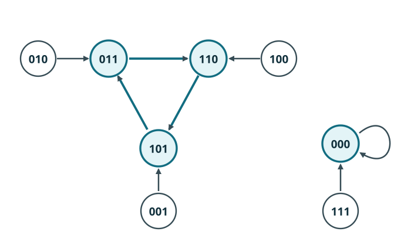

# CELL3 有限環の軌道・周期・状態遷移グラフ

[前章の光円錐の定理](../CELL2/index.md#thm-cell2-finite-propagation)で、有限時間後のセルがどこから情報を受け取れるか分かりました。それでは更新を何百回、何千回と繰り返すとどうなるでしょうか。これを調べる第一歩は、**有限個のセルを円環状につないだ系**の全配置を一つの状態として見ることです。

例えば二状態の3セル環には $000$ から $111$ まで8個の配置しかありません。有限個の配置を無限に更新すれば必ずどこかで再び同じ配置になります。ただし、**初期配置へ戻るとは限らず、途中から別の配置の循環に入る**ことがあります。前半の寄り道と後半の周期を厳密に分け、その全体を有向グラフで理解します。

## 1. 周期有限環は有限状態の写像

整数 $N\ge1$ と有限非空の状態集合 $Q$（要素数 $q$）を固定します。位置は $0,\ldots,N-1$ で、添字は常に $N$ を法として読みます。したがって位置0の左隣は $N-1$ です。[CELL1で定義した周期境界](../CELL1/index.md#def-cell1-finite-boundary)を使います。

<!-- formal-statement-start -->
### 定義（有限環の配置空間と更新写像）

$Q$ は有限非空集合、$N\ge1$ とし、配置空間を $X_N=Q^{\mathbb Z/N\mathbb Z}$ とする。半径 $r\ge0$、局所規則 $f:Q^{2r+1}\to Q$ の**有限環上の大域更新**は写像 $F_N:X_N\to X_N$ であり、各整数 $i$ について

$$
(F_N(x))_i=f(x_{i-r},\ldots,x_i,\ldots,x_{i+r})
$$

と定める。ただし添字は $N$ を法として読む。$X_N$ の要素数は $q^N$ である。
<!-- formal-statement-end -->

<!-- definition-example-start: def-cell3-ring-map -->

**定義の確認**　$Q=\{0,1\},N=3,r=1$ とし、$f(a,b,d)=a$ を使います。配置 $x=001$（順に $x_0=0,x_1=0,x_2=1$）では

$$
(F_3(x))_0=x_2=1,\quad
(F_3(x))_1=x_0=0,\quad
(F_3(x))_2=x_1=0.
$$

したがって $001\mapsto100$ です。どの位置も $Q$ の元へ更新され、3成分が一意に決まります。可能な配置は $2^3=8$ 個です。なお $N=1$ のように局所入力の添字が同じセルを何度も指す場合も、各位置で局所入力を順に読む規約は変わりません。
<!-- definition-example-end -->

ここで有限なのは **配置全体の集合 $X_N$** です。無限線上では状態集合 $Q$ が有限でも、全配置の集合 $Q^{\mathbb Z}$ は一般に無限です。この違いは最後に反例で確認します。

## 2. 時間発展はいつ繰り返すのか

一歩で更新した配置をさらに更新すれば、$x,F(x),F^2(x),\ldots$ という列ができます。最初の配置へ戻る場合も、別の配置で落ち着く場合も、区別して記述したいので、まず周期という語を定めます。

<!-- formal-statement-start -->
### 定義（前方軌道・固定点・周期点）

集合 $X$ 上の写像 $F:X\to X$ と $x\in X$ に対し、$x_t=F^t(x)$（$t=0,1,2,\ldots$）を $x$ の**前方軌道**という。$F(x)=x$ なら $x$ を**固定点**といい、正整数 $p$ が存在して $F^p(x)=x$ なら $x$ を**周期点**という。そのような正整数 $p$ の最小値を**最小周期**という。
<!-- formal-statement-end -->

<!-- definition-example-start: def-cell3-orbit -->

**定義の確認**　先ほどの $f(a,b,d)=a$ を3セル環に適用すると

$$
001\longmapsto100\longmapsto010\longmapsto001
$$

です。$F_3^3(001)=001$ ですが、$F_3(001)\ne001$ かつ $F_3^2(001)\ne001$ なので最小周期は3です。一方 $000\mapsto000$ は固定点で最小周期1です。
<!-- definition-example-end -->

しかし入力にかかわらず0を返す規則では $001\to000\to000\to\cdots$ です。初期の $001$ は周期点ではありません。それでも途中から先は周期的です。この現象を測るために、周期が始まる時刻も記録します。

<!-- formal-statement-start -->
### 定義（前周期性・過渡長・最終周期）

写像 $F:X\to X$ に対し、ある初期状態 $x$ と整数 $\mu\ge0,p\ge1$ が存在して

$$
F^{t+p}(x)=F^t(x)\qquad(t\ge\mu)
$$

が成り立つとき、軌道を**前周期的**という。この性質が成立する $\mu$ の最小値を**過渡長**といい、その $\mu$ に対して成立する $p$ の最小値を**最終周期**という。$\mu=0$ のとき初期状態は周期点である。
<!-- formal-statement-end -->

<!-- definition-example-start: def-cell3-eventual-period -->

**定義の確認**　定数0規則で $001\to000\to000$ となるとき、時刻0には $001\ne000$ なので $\mu=0$ は使えません。時刻1以降は常に $000$ だから $\mu=1$ が最小です。$p=1$ が成り立ち、これより小さい正整数はないので最終周期は1です。
<!-- definition-example-end -->

### 2.1 有限状態写像の周期性を完全に証明する

<!-- formal-statement-start -->
### 定理（有限状態写像の最終周期性）

元が $M\ge1$ 個の集合 $X$ と写像 $F:X\to X$ を任意に取る。任意の初期状態 $x\in X$ の前方軌道は前周期的であり、その過渡長 $\mu$ と最終周期 $p$ は一意に定まり、

$$
\mu+p\le M
$$

を満たす。また $x_0,\ldots,x_{\mu+p-1}$ はすべて相異なり、$x_\mu,\ldots,x_{\mu+p-1}$ が閉じた周期を作る。
<!-- formal-statement-end -->

**証明の見取り図**　$M+1$ 個の時刻に現れる配置には重複が必ずあります。初めて重複が発生する時刻を $t$、その一致先を $s<t$ とすると、$s$ 歩の過渡と $t-s$ 歩の周期を得ます。さらに「初めて」という選び方から両方が最小であることまで確認します。

<!-- proof-start -->
### 証明

$x_n=F^n(x)$ と置く。$x_0,\ldots,x_M$ は $M+1$ 個だが、値の候補 $X$ は $M$ 個なので、鳩の巣原理により重複がある。重複する項が初めて現れる整数時刻 $t\ge1$ を選ぶと、$1\le t\le M$ であり、$x_0,\ldots,x_{t-1}$ は相異なる。$x_t=x_s$ となる $0\le s<t$ は、前の $t$ 項の相異性によって一意である。

$s$ と $t$ の一致は以後も保たれる。実際、$x_{s+k}=x_{t+k}$ が成立するとき、一価写像 $F$ を両辺に適用して

$$
x_{s+k+1}=F(x_{s+k})=F(x_{t+k})=x_{t+k+1}
$$

を得る。$k=0$ では $x_s=x_t$ だから、帰納法によりすべての $k\ge0$ で一致する。したがって $\mu=s,p=t-s$ と置けば、すべての $n\ge s$ で

$$
x_{n+p}=x_n
$$

である。$0\le s<t\le M$ より $\mu+p=t\le M$ となる。

ここで最小性を検証する。$x_s,\ldots,x_{t-1}$ は互いに異なる $p$ 個の状態であり、その最後から $x_t=x_s$ へ戻る。したがってこの $p$ より短い正の周期 $p'<p$ があれば、$x_{s+p'}=x_s$ が $s<s+p'<t$ で成立してしまい、相異性に反する。

もし $s'<s$ から周期的だったと仮定すると、$x_{s'}$ は以後何度でも出現する。しかし時刻 $s$ 以降の状態は上で証明した $x_s,\ldots,x_{t-1}$ だけなので、ある時刻 $n\ge s$ に $x_{s'}=x_n$ となる。この $x_n$ は周期部分のいずれかの状態に等しいが、$s'<s$ の $x_{s'}$ は $x_0,\ldots,x_{t-1}$ の相異性からそのどれとも異なる。矛盾する。よって $s$ も最小である。定義に従って最小値 $\mu,p$ はそれぞれ一意である。$\square$
<!-- proof-end -->

この定理を有限環 $X_N$ に適用すると $M=q^N$ なので **$\mu+p\le q^N$** です。ただし「$q^N$ 歩以内に初期配置へ戻る」という意味ではありません。初期配置が過渡部分にあれば初期配置には戻りません。

## 3. 状態を頂点、更新を矢印にする

一つの軌道だけでなく、**すべての初期配置がどこへ合流するか**を読みたいときはグラフを使います。配置ごとに次の配置は一つだけです。この出方向の一意性がグラフの形を強く制限します。

<!-- formal-statement-start -->
### 定義（状態遷移有向グラフと一歩前像）

元が有限個の集合 $X$ と写像 $F:X\to X$ に対し、各 $x\in X$ を頂点とし各頂点から $F(x)$ へ一つの有向辺を引いたグラフを**状態遷移有向グラフ**という。頂点 $y$ の**一歩前像集合**は

$$
F^{-1}(\{y\})=\{x\in X\mid F(x)=y\}
$$

である。その要素数を**入次数**という。自己ループ $y\to y$ も入次数に1を加える。
<!-- formal-statement-end -->

<!-- definition-example-start: def-cell3-transition-graph -->

**定義の確認**　3セル環の $f(a,b,d)=a$ なら $001\to100\to010\to001$ で、各頂点から矢印は一本です。$001$ に入る矢印は $010\to001$ のみなので $F_3^{-1}(\{001\})=\{010\}$、入次数は1です。$000\to000$ の自己ループも入次数1と数えます。
<!-- definition-example-end -->

### 3.1 Rule 60を全8状態で検算する

局所規則 $f(a,b,d)=a\oplus b$ を考えます。$\oplus$ はビットが異なると1、等しいと0です。入力 $111,110,101,100,011,010,001,000$ に対する出力は $0,0,1,1,1,1,0,0$ なので、[規則番号の定義](../CELL2/index.md#def-cell2-rule-number)によって二進数 $00111100$、つまり **Rule 60** です。

3セル環では隣接添字を3で読むので、

$$
F_3(x_0x_1x_2)=
(x_2\oplus x_0)(x_0\oplus x_1)(x_1\oplus x_2).
$$

例えば $010$ では三位置の出力が順に $0\oplus0=0$、$0\oplus1=1$、$1\oplus0=1$ なので $010\mapsto011$ です。8配置の全遷移は次のとおりです。

| 現在 $x$ | 000 | 001 | 010 | 011 | 100 | 101 | 110 | 111 |
|---|---|---|---|---|---|---|---|---|
| 次 $F_3(x)$ | 000 | 101 | 011 | 110 | 110 | 011 | 101 | 000 |

図で3周期を作る $011\to110\to101\to011$ は強調線、そこへ流れ込む $010,100,001$ は通常線です。別成分では $111\to000$、そして $000\to000$ です。アニメーションが無効でも各矢印をたどれます。

例えば $100\to110\to101\to011\to110\to\cdots$ だから $\mu=1,p=3$ です。$011$ 自身から始めれば $\mu=0,p=3$ です。$111\to000\to000$ は $\mu=1,p=1$ です。同じ周期へ入る配置は複数ありますが、それぞれの初期配置は別々の過渡部分を持ちます。

## 4. 状態遷移グラフに必ず現れる構造

### 4.1 一つの成分に閉路は一つ

いま、矢印の向きを無視して辺をたどれば行き来できる頂点を一組としてまとめます。これにより、更新の流れが互いに交わらない部分を、グラフの形だけから分けられます。

<!-- formal-statement-start -->
### 定義（弱連結成分）

有限状態写像 $F:X\to X$ の状態遷移有向グラフで、二頂点 $u,v$ が、辺の向きを無視すれば有限本の辺からなる道で結ばれるとき同値とみなす。この関係によって分かれる頂点集合の各まとまりを**弱連結成分**という。道の長さ0を許すので各頂点は自分と同じ成分に属する。
<!-- formal-statement-end -->

<!-- definition-example-start: def-cell3-weak-component -->

**定義の確認**　上のRule 60の8頂点では、$010$ から $011$ へ矢印があるため二点は同じ成分です。$011$ から $110$、$110$ から $101$ へも進め、$100$ から $110$、$001$ から $101$ へも進めます。よって $\{001,010,011,100,101,110\}$ は同一成分です。残り $\{000,111\}$ は $111\to000$ と $000\to000$ でつながり、二つのまとまりの間に辺は一本もないので、これらがちょうど二つの弱連結成分です。
<!-- definition-example-end -->

<!-- formal-statement-start -->
### 命題（有限状態遷移グラフの成分構造）

空でない有限個の元からなる集合 $X$ 上の写像 $F:X\to X$ の状態遷移有向グラフについて、辺の向きを無視して移動できる各頂点のまとまり（弱連結成分）には**有向閉路がちょうど一つ**ある。各頂点は有限歩後にその閉路へ到達する。
<!-- formal-statement-end -->

**証明の見取り図**　[有限状態写像の最終周期性](#thm-cell3-eventual-periodicity)から各頂点が閉路へ到達することが分かります。さらに隣り合う頂点 $u\to v$ は同じ「未来」を共有します。向きを無視した道に沿ってそれを繰り返すと、同じ成分内では必ず同じ閉路へ着くことが分かります。

<!-- proof-start -->
### 証明

任意の $x\in X$ に[有限状態写像の最終周期性](#thm-cell3-eventual-periodicity)を適用すると、軌道の $x_\mu,\ldots,x_{\mu+p-1}$ は互いに異なる状態であり、

$$
x_\mu\to x_{\mu+1}\to\cdots\to x_{\mu+p-1}\to x_\mu
$$

という有向閉路を作る。したがってすべての頂点は少なくとも一つの閉路へ到達する。

いま辺 $u\to v$ があれば $F(u)=v$ である。$u$ の軌道は $u,v,F(v),F^2(v),\ldots$、$v$ の軌道は $v,F(v),F^2(v),\ldots$ で、後半は完全に同じである。よって両者の到達する閉路は一致する。

弱連結成分内の任意の二頂点は、辺の向きを無視して有限本の辺で結ばれる。その道の各辺について上の性質を順番に適用すれば、成分内のすべての頂点が同じ閉路に到達する。もし同一成分に二つの異なる閉路があれば、一方の閉路上の頂点は一意な次状態に従い自分の閉路から出られないため、他方の閉路に到達できず矛盾する。よって閉路はちょうど一つである。$\square$
<!-- proof-end -->

### 4.2 前像数を足すと何が分かるか

出る矢印はすべての頂点からちょうど一本ですが、入る矢印は0本の場合も複数本の場合もあります。その数を足すと、全ての始点を一度ずつ数えることになります。

<!-- formal-statement-start -->
### 命題（入次数の総和と単射性）

元が $M\ge1$ 個の集合 $X$ 上の写像 $F:X\to X$ について

$$
\sum_{y\in X}|F^{-1}(\{y\})|=M
$$

が成り立つ。さらに (i) $F$ が単射、(ii) $F$ が全射、(iii) 全頂点の入次数が1、(iv) 全頂点の過渡長が0、は互いに同値である。
<!-- formal-statement-end -->

**証明の見取り図**　前像集合は互いに交わらず、全体として $X$ を分割します。したがって入次数の総和は $M$。単射なら入次数は高々1、全射なら入次数は少なくとも1です。有限個の非負整数の総和を使えば両者は同値です。全頂点が周期点であることとの関係も調べます。

<!-- proof-start -->
### 証明

各 $x\in X$ はただ一つの $F(x)$ を持つので、$F^{-1}(\{y\})$ は $y$ ごとに互いに素であり、それらの合併は $X$ に等しい。したがって要素数を足すと $M$ となる。

(i) なら異なる二点は同じ値へ写らないので入次数は各頂点で高々1。非負整数 $M$ 個の総和が $M$ なので、すべて1であり (iii) を得る。(iii) なら各 $y$ は前像を持ち (ii) が成り立つ。(ii) なら各入次数は少なくとも1で総和は $M$、ゆえにすべて1であり、(i) も成り立つ。

(iii) なら $F$ は全単射である。任意の $x$ の軌道に[有限状態写像の最終周期性](#thm-cell3-eventual-periodicity)を適用すると $x_s=x_t$（$0\le s<t$）となる。単射性を $s$ 回用いれば $F^s(x)=F^s(F^{t-s}(x))$ から $x=F^{t-s}(x)$ が従う。よって $x$ は周期点で $\mu=0$、つまり (iv) となる。

(iv) を仮定し、$F(u)=F(v)$ とする。$u,v$ は周期点で、最小周期をそれぞれ $p,q$ とする。$L=pq$ は両周期の倍数だから $F^L(u)=u$、$F^L(v)=v$ である。一方 $F(u)=F(v)$ に $F^{L-1}$ を適用すると $F^L(u)=F^L(v)$ となるので $u=v$ である。よって (i) の単射性が従う。すべて同値である。$\square$
<!-- proof-end -->

Rule 60の表では

$$
\begin{aligned}
F_3^{-1}(\{000\})&=\{000,111\},\\
F_3^{-1}(\{011\})&=\{010,101\},\\
F_3^{-1}(\{101\})&=\{001,110\},\\
F_3^{-1}(\{110\})&=\{011,100\}.
\end{aligned}
$$

ほかの4状態の前像は空です。入次数の総和は $2+2+2+2=8$。単射ではないので、複数前像を持つ合流点と前像を持たない点が現れています。

## 5. 無限線にこの定理を持ち込むと何が壊れるか

$Q=\{0,1\}$ 上の無限線で、右へ1セルずらす局所規則 $f(a,b,d)=a$ を考えます。位置0だけ1、ほかはすべて0の初期配置 $c$ を取ります。帰納的に

$$
(F^t(c))_i=c_{i-t}
$$

なので、時刻 $t$ には位置 $t$ のみ1です。異なる時刻 $s<t$ の配置は位置 $s$ で1と0に分かれるため、一致しません。**この軌道は前周期的ではありません。**

有限環では位置を $N$ で割った余りで読むため同じシフトが $N$ 歩後に初期配置へ戻ります。一方、無限線では全配置 $Q^{\mathbb Z}$ の個数を一つの有限な数では押さえられません。有限状態写像の証明で使った「$M+1$ 個から重複する」という部分が使えなくなるのです。セル一つの状態が有限であることと、系全体が有限状態であることを混同してはいけません。

## 6. 演習と詳細解答

### Level A

### A1. Rule 60の局所入力

$N=3$ の二状態周期環で $f(a,b,d)=a\oplus b$ を使う。配置 $001$ と $110$ の次配置を、三つの位置の計算を書いて求めよ。

- Level: A

<!-- solution-start -->
#### 詳細解答

$001$ では $(x_0,x_1,x_2)=(0,0,1)$ なので、位置0は $1\oplus0=1$、位置1は $0\oplus0=0$、位置2は $0\oplus1=1$、したがって $F_3(001)=101$ です。$110$ では $(1,1,0)$ なので位置0は $0\oplus1=1$、位置1は $1\oplus1=0$、位置2は $1\oplus0=1$、ゆえに $F_3(110)=101$ です。二つの異なる入力が同じ出力を持ちます。
<!-- solution-end -->

### A2. 過渡長の判定

Rule 60の3セル周期環で、初期配置 $010,011,111$ の過渡長と最終周期をそれぞれ求め、最初の周期状態を述べよ。

- Level: A

<!-- solution-start -->
#### 詳細解答

$010\to011\to110\to101\to011$ なので $\mu=1,p=3$、最初の周期状態は011です。$011\to110\to101\to011$ なので $\mu=0,p=3$、最初の周期状態は011です。$111\to000\to000$ なので $\mu=1,p=1$、最初の周期状態は000です。周期部分で3個または1個の状態がすべて異なることと、それ以前には再出現がないことを確認したため、どれも最小値です。
<!-- solution-end -->

### A3. 一歩前像を列挙する

Rule 60の3セル周期環で、$000,011,001$ の一歩前像集合と入次数を求めよ。

- Level: A

<!-- solution-start -->
#### 詳細解答

全遷移表の出力000の欄に対応する入力は000と111なので $F_3^{-1}(\{000\})=\{000,111\}$、入次数2です。出力011の入力は010と101なので $F_3^{-1}(\{011\})=\{010,101\}$、入次数2です。出力001となる入力は表に存在しないので $F_3^{-1}(\{001\})=\varnothing$、入次数0です。
<!-- solution-end -->

### A4. 2セル環のシフト

$N=2,Q=\{0,1\}$ の周期環で $f(a,b,d)=a$ を使う。$00,01,10,11$ の次配置と各最小周期を求めよ。

- Level: A

<!-- solution-start -->
#### 詳細解答

添字を2で読むので $(F_2(x))_0=x_1$、$(F_2(x))_1=x_0$ です。よって $00\to00$ と $11\to11$ は固定点（最小周期1）、$01\to10\to01$ は最小周期2の循環です。$10$ から始めても同じ循環なので周期2です。どの配置も過渡長0です。
<!-- solution-end -->

### A5. 配置数で得られる周期の長さの評価

$|Q|=3,N=4$ の有限環で、いかなる局所規則でも過渡長 $\mu$ と最終周期 $p$ の和が満たす数値的な制限を示せ。初期状態への復帰まで保証できるか。

- Level: A

<!-- solution-start -->
#### 詳細解答

配置数は位置4個のそれぞれに3通りあるから $M=3^4=81$ です。81個の元を持つ $X_4$ 上の写像に[有限状態写像の最終周期性](#thm-cell3-eventual-periodicity)を適用して $\mu+p\le81$ となります。初期状態が周期部分にあるとは限らないので、初期状態への復帰は保証されません。例えば定数規則では、全0以外の配置は一歩後に全0となり、初期状態には戻りません。
<!-- solution-end -->

### Level B

### B1. Rule 30の有限環を全列挙する

$N=3$ の二状態周期環でRule 30を使う。全8配置の遷移表を作り、初期 $011$ の過渡長と最終周期を求め、$\mu+p\le8$ を確かめよ。

- Level: B

<!-- solution-start -->
#### 詳細解答

Rule 30は入力順 $111,110,101,100,011,010,001,000$ に対して $0,0,0,1,1,1,1,0$ を返します。各位置の三つ組を周期的に作れば、

| $x$ | 000 | 001 | 010 | 011 | 100 | 101 | 110 | 111 |
|---|---|---|---|---|---|---|---|---|
| $F_3(x)$ | 000 | 111 | 111 | 010 | 111 | 001 | 100 | 000 |

となります。例えば011では位置0の入力は101で出力0、位置1は011で1、位置2は110で0なので010です。010では各位置の入力が001,010,100で全て1を返すので111です。111では各入力が111で全て0、000は000を保ちます。ゆえに

$$
011\to010\to111\to000\to000\to\cdots
$$

となり、$\mu=3,p=1$ です。$\mu+p=4\le8$ で、初期011は再出現しません。
<!-- solution-end -->

### B2. 単射なら過渡が消える

元が有限個の集合 $X$ の写像 $F:X\to X$ が単射なら、全ての初期状態の過渡長が0となることを直接証明せよ。逆に全頂点の過渡長が0なら単射か。

- Level: B

<!-- solution-start -->
#### 詳細解答

有限性により任意の軌道 $x_0,x_1,\ldots$ に $x_s=x_t$（$s<t$）が存在します。単射性から $F^s(x)=F^s(F^{t-s}(x))$ の共通の $F$ を $s$ 回分取り除けるので $x=F^{t-s}(x)$ です。したがって初期時刻から周期があり $\mu=0$ です。逆に全頂点の過渡長が0なら $u,v$ はともに周期点です。$F(u)=F(v)$ のとき周期の倍数 $L=p_up_v$ を選ぶと、$u=F^L(u)=F^{L-1}(F(u))$ と $v=F^L(v)=F^{L-1}(F(v))$ が等しいので $u=v$ です。ゆえに単射です。
<!-- solution-end -->

### B3. 合流点と前像を持たない点

元が有限個の集合 $X$ の写像 $F:X\to X$ が単射でないとき、入次数2以上の頂点と入次数0の頂点が必ず存在することを証明せよ。Rule 60の3セル環で例を挙げよ。

- Level: B

<!-- solution-start -->
#### 詳細解答

単射でなければ異なる $u,v$ が $F(u)=F(v)=y$ を満たすので $y$ の入次数は2以上です。もし全頂点の入次数が1以上なら、$y$ の余分な1本を含め、$M=|X|$ 個の頂点の入次数の和は少なくとも $M+1$ になります。しかし前像集合が互いに交わらず合わせると $X$ になるため、入次数の和は $M$ なので矛盾です。よって入次数0の頂点が存在します。Rule 60では000へ000と111から入るので入次数2、001へ入る辺はないので入次数0です。
<!-- solution-end -->

### B4. 無限線の反例

$Q=\{0,1\}$ の無限線上で $(F(c))_i=c_{i-1}$ とする。位置0だけ1の初期配置から、時刻が異なる全配置が一致しないことを示し、有限状態写像の定理の失われた仮定を述べよ。

- Level: B

<!-- solution-start -->
#### 詳細解答

$t=0$ では $(F^0(c))_i=c_i$ です。時刻 $t$ に $(F^t(c))_i=c_{i-t}$ と仮定すると、次時刻は $(F^{t+1}(c))_i=(F^t(c))_{i-1}=c_{i-1-t}$ となり帰納法が閉じます。初期配置で1は位置0にしかないので、時刻 $t$ の1は位置 $t$ にしかありません。$s<t$ なら位置 $s$ は時刻 $s$ に1、時刻 $t$ に0となり配置が異なります。状態集合 $Q$ は有限でも配置空間 $Q^{\mathbb Z}$ は有限でなく、鳩の巣原理の有限個 $M$ の仮定がありません。
<!-- solution-end -->

### Level C

### C1. 多数決規則の軌道と前像を分類する

$Q=\{0,1\},N=3$ の周期環で、局所規則 $f(a,b,d)$ を「三入力のうち2個以上が1なら1、それ以外は0」とする。(i) 全8配置の遷移表を作れ。(ii) 全ての周期軌道および全初期配置の $\mu,p$ を求めよ。(iii) 全頂点の入次数を求め総和を確認せよ。(iv) 同じ『有限の局所状態』だけでは、無限線の軌道の前周期性を保証できない理由を反例とともに説明せよ。

- Level: C

<!-- solution-start -->
#### 詳細解答

(i) $N=3$ では各位置の左・中央・右がちょうど全3位置を一度ずつ読むので、出力は位置によらず「配置中の1の総数が2以上か」で決まります。したがって

| $x$ | 000 | 001 | 010 | 011 | 100 | 101 | 110 | 111 |
|---|---|---|---|---|---|---|---|---|
| $F_3(x)$ | 000 | 000 | 000 | 111 | 000 | 111 | 111 | 111 |

です。(ii) 000と111は固定点です。ほかの6配置は全て一歩で000または111に移るので、周期軌道は $\{000\},\{111\}$ だけです。000,111では $\mu=0,p=1$、ほかの6配置では $\mu=1,p=1$ です。

(iii) 000の前像集合は $\{000,001,010,100\}$、111の前像集合は $\{011,101,110,111\}$、残り6頂点の前像集合は空です。入次数の和は $4+4+6\cdot0=8$ となり、配置数と一致します。それぞれの固定点を含む二つの弱連結成分があり、各成分に一つの自己ループがあります。

(iv) 有限環の証明は全配置空間に8個しか元がないことを使います。無限線では元が有限個の状態集合 $Q$ を使っても $Q^{\mathbb Z}$ は無限集合です。実際、別の局所規則 $g(a,b,d)=a$ と「位置0だけ1」の初期配置を採ると、時刻 $t$ で1は位置 $t$ にだけ存在し、時刻の異なる配置は一致しません。失われた仮定は**全配置空間の有限性**で、鳩の巣原理を適用できません。
<!-- solution-end -->

有限環での全軌道を分類する道具がそろいました。次章CELL4では、XORを代数として扱うことで、時刻を一歩ずつ進めない計算も可能になることを調べます。
