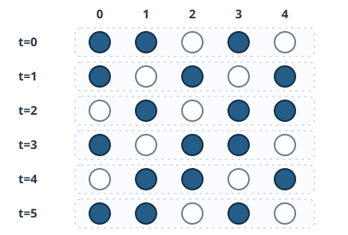

# CELL5 保存則・粒子輸送・Rule 184

[CELL4のRule 90](../CELL4/index.md#thm-cell4-rule90-binomial)では、二つの1が同じ位置に寄与するとXORで打ち消し合いました。しかし自動車や粒子を表す1が、そのように突然消えると困ります。道路をセルに分け、車がいる場所を1、空きを0とするとき、**車が前へ動いても台数は変わらない**規則を考えましょう。

隣が空いている車だけが右に1セル進み、すべての車が同時に判断する規則が **Rule 184** です。目で数えた台数の一致は数歩についての観測にすぎません。この章では、各セルへの**流入 − 流出**として更新を書き直し、どんな長さの周期環・どんな初期配置でも粒子数が保存されると証明します。さらに道路の端から出入りする場合と、動ける車の台数の上限を区別します。

## 1. Rule 184：隣が空いた車だけ進む

状態を $Q=\{0,1\}$ とし、1を粒子（車）、0を空所とします。位置 $i$ の右隣は $i+1$、左隣は $i-1$ です。各時刻の配置を $x=(x_i)$、次時刻を $F_{184}(x)$ と書きます。無限線 $\mathbb Z$ と、添字を $N$ を法として読む長さ $N\ge1$ の**周期環**の両方で同じ局所式を用います。特に交通の進行方向は右（添字が増える方向）と定めます。

更新を行うときは、まず**現在の配置**ですべての車の右隣が空か調べ、その後に一斉に移します。左から順に動かしてはいけません。

例えば無限線の局所模様 $110$（左から位置 $i-1,i,i+1$）では、中央の1は右が0なので右へ動き、中央の次状態は0です。一方 $101$ では中央の0の左が1だから、左の車が移ってきて中央は1になります。この両方を単一の局所規則で表せます。

<!-- formal-statement-start -->
### 定義（Rule 184の局所更新）

二状態の半径1セル・オートマトン $F_{184}$ を、任意の配置 $x$ と位置 $i$ に対して

$$
(F_{184}(x))_i=f(x_{i-1},x_i,x_{i+1}),
\qquad
f(a,b,c)=a(1-b)+bc
$$

で定める。ただし右辺の加減乗算は**通常の整数演算**である。$a,b,c\in\{0,1\}$ なので二項 $a(1-b)$ と $bc$ が同時に1になることはなく、$f$ は必ず0または1を返す。周期環では添字を法 $N$ で読む。
<!-- formal-statement-end -->

<!-- definition-example-start: def-cell5-rule184 -->

**定義の確認**　近傍 $101$ を $a=1,b=0,c=1$ として代入すると $f(1,0,1)=1(1-0)+0\cdot1=1$ です。中央の空所へ左の車が移ってきます。近傍 $110$ では $f(1,1,0)=1(1-1)+1\cdot0=0$ で中央の車が出ていきます。$111$ なら $f(1,1,1)=0+1=1$ で、右側がふさがっている車はそのままです。いずれも出力が0か1であることを直接確かめました。
<!-- definition-example-end -->

すべての近傍について検算すると次の表です。

| 左・中央・右 $(a,b,c)$ | $a(1-b)$ | $bc$ | 出力 $f(a,b,c)$ |
|---|---:|---:|---:|
| 111 | 0 | 1 | 1 |
| 110 | 0 | 0 | 0 |
| 101 | 1 | 0 | 1 |
| 100 | 1 | 0 | 1 |
| 011 | 0 | 1 | 1 |
| 010 | 0 | 0 | 0 |
| 001 | 0 | 0 | 0 |
| 000 | 0 | 0 | 0 |

[CELL2の規則番号の付け方](../CELL2/index.md#def-cell2-rule-number)では、上から並べた出力が $10111000_2=128+32+16+8=184$ なのでRule 184と呼びます。**整数として足す規則**であり、前章のXOR（$1\oplus1=0$）と取り違えないでください。

## 2. 隣接する二つのセルの間で数える：流束

規則表を8行追っても、10万セルある道路の車の数が必ず不変とはまだ言えません。そこで、位置 $i$ と $i+1$ の**境界を右へ横切る車の個数**を数えます。今の配置で左が1、右が0のときだけ、その境界を一台が渡ります。これを流束といいます。

<!-- formal-statement-start -->
### 定義（粒子流束と粒子数）

無限線または長さ $N\ge1$ の周期環上の二状態配置 $x$ に対し、辺 $i\to i+1$ を右向きに通過する一歩の**流束**を

$$
j_i(x)=x_i(1-x_{i+1})\in\{0,1\}
$$

と定める。周期環の**粒子数**と、その一歩で移動する粒子の個数は

$$
K(x)=\sum_{i=0}^{N-1}x_i,\qquad
J(x)=\sum_{i=0}^{N-1}j_i(x)
$$

である。添字は法 $N$ で読む。和は通常の整数の和である。
<!-- formal-statement-end -->

<!-- definition-example-start: def-cell5-flux -->

**定義の確認**　5セル周期環で $x=11010$（左から位置0～4）とします。右隣も1の位置0は $j_0=1(1-1)=0$。位置1は右隣が0なので $j_1=1$。位置2は0なので $j_2=0$、位置3は $j_3=1$、位置4も0なので $j_4=0$ です。つまり $j=(0,1,0,1,0)$、$J(x)=2$。車が3台あることは $K(x)=1+1+0+1+0=3$ から別に数えられます。
<!-- definition-example-end -->

ここで $J(x)$ は「その一歩で何台動くか」で、$K(x)$ は「道路上に何台いるか」です。動けない車も $K$ には含まれるため、一般に二つの値は等しくありません。

## 3. 更新式を流入 − 流出に書き直す

セル $i$ に現在 $x_i$ 台います。右へ出る台数は $j_i=x_i(1-x_{i+1})$、左から入る台数は $j_{i-1}=x_{i-1}(1-x_i)$ です。この増減を現在の台数に加えれば次の台数になります。

<!-- formal-statement-start -->
### 定理（Rule 184の局所保存式）

無限線 $\mathbb Z$ または長さ $N\ge1$ の二状態周期環上で、Rule 184の大域更新 $F_{184}$ と流束 $j_i(x)=x_i(1-x_{i+1})$ は、任意の配置 $x$ とすべての位置 $i$ に対して

$$
\boxed{(F_{184}(x))_i-x_i=j_{i-1}(x)-j_i(x)}
$$

を満たす。さらに更新値は必ず0または1であり、右辺は実際の車の同時移動を表す。
<!-- formal-statement-end -->

**証明の見取り図**　まず局所規則を展開して流入・流出の差に一致させます。次に、空所なら出ていく車はなく、車があるなら同時に左から車が入ることはない、と場合分けします。これにより整数の式が「負の台数」や「同一セルへの二台の衝突」を隠していないと分かります。

<!-- proof-start -->
### 証明

$a=x_{i-1},b=x_i,c=x_{i+1}$ と置く。流束の定義から

$$
j_{i-1}=a(1-b),\qquad j_i=b(1-c)
$$

である。従って現在値と流入・流出の差を加えると

$$
\begin{aligned}
b+j_{i-1}-j_i
&=b+a(1-b)-b(1-c)\\
&=b+a(1-b)-b+bc\\
&=a(1-b)+bc\\
&=f(a,b,c).
\end{aligned}
$$

ゆえに $F_{184}(x)_i-x_i=j_{i-1}-j_i$ がすべての位置で成り立つ。

更新後も二状態であることを、実際の移動として確認する。$b=0$ なら $j_i=0$ で、出力は $0+j_{i-1}=a\in\{0,1\}$ となる。空所には左から高々一台が入る。$b=1$ なら $j_{i-1}=0$ で、出力は $1-j_i=c\in\{0,1\}$ となる。右が0なら自分が出て0となり、右が1なら留まって1となる。両場合を尽くしたので、出力は二状態であり同時移動と一致する。$N=1$ や $N=2$ で周期添字が重なる場合も、上の代数的恒等式と場合分けはそのまま有効である。$\square$
<!-- proof-end -->

この式を**離散的な連続の式**と呼びます。「連続」といっても時間や空間を実数へ変えるわけではありません。量が増える理由を境界を通じた流入・流出に限定するという意味です。

局所式は、連続する区間の粒子数にも適用できます。任意の整数 $L\le R$ について両辺を $i=L,\ldots,R$ で足すと、

$$
\begin{aligned}
\sum_{i=L}^{R}\bigl((F_{184}(x))_i-x_i\bigr)
&=\sum_{i=L}^{R}\bigl(j_{i-1}(x)-j_i(x)\bigr)\\
&=(j_{L-1}-j_L)+(j_L-j_{L+1})+\cdots+(j_{R-1}-j_R)\\
&=j_{L-1}(x)-j_R(x).
\end{aligned}
$$

途中の境界を通った車は、左セルからの流出と右セルへの流入として一度ずつ逆符号で数えられます。この**隣り合う項の相殺**が保存則の仕組みです。

## 4. 周期環では台数が必ず保存される

道路を環状につなぐと「道路の外への出口」はありません。右端から出た車は左端へ入ります。局所式をすべて足せば、端の流束まで打ち消し合います。

<!-- formal-statement-start -->
### 定理（周期環の総粒子数保存）

任意の整数 $N\ge1$ と任意の配置 $x\in\{0,1\}^{\mathbb Z/N\mathbb Z}$ に対し、Rule 184は

$$
K(F_{184}(x))=K(x)
$$

を満たす。さらにすべての非負整数時刻 $t$ について

$$
K(F_{184}^t(x))=K(x)
$$

が成り立つ。
<!-- formal-statement-end -->

<!-- proof-start -->
### 証明

[局所保存式](#thm-cell5-local-continuity)を各位置 $i=0,\ldots,N-1$ に適用する。有限和なので各項を入れ替えてよく、

$$
\begin{aligned}
K(F_{184}(x))-K(x)
&=\sum_{i=0}^{N-1}\bigl((F_{184}(x))_i-x_i\bigr)\\
&=\sum_{i=0}^{N-1}j_{i-1}(x)-\sum_{i=0}^{N-1}j_i(x).
\end{aligned}
$$

周期境界により $j_{-1}=j_{N-1}$ である。最初の和に現れる添字 $-1,0,\ldots,N-2$ は、法 $N$ で $N-1,0,\ldots,N-2$ と読み替えられ、後の和の $0,\ldots,N-1$ と同じ全辺を一回ずつ数える。よって二つの和は等しく、差は0である。

時刻0には $K(F_{184}^0(x))=K(x)$。時刻 $t$ で等式が成り立つと仮定し、配置 $y=F_{184}^t(x)$ に一歩保存則を適用すると

$$
K(F_{184}^{t+1}(x))=K(F_{184}(y))=K(y)=K(F_{184}^t(x))=K(x).
$$

数学的帰納法によりすべての $t\ge0$ で成立する。$\square$
<!-- proof-end -->

**重要なのは周期境界という仮定です。** 保存式自体は各位置で成り立ちますが、全セルにわたって流束を相殺するためには、右端から出る流束が左端へ戻る必要があります。無限線や開放境界について、同じ有限和を無条件に使ってはいけません。

### 4.1 5セル環を五歩追う

先ほどの $x=11010$ を更新します。時刻0には位置1から2、位置3から4へ粒子が移り、位置0の粒子は右が埋まっているため留まります。従って $11010\mapsto10101$ です。各歩で同じ流束計算をすると次の表になります。

| 時刻 $t$ | 配置（位置0～4） | 移動する車の出発位置 | $K$ | $J$ |
|---:|---|---|---:|---:|
| 0 | 11010 | 1, 3 | 3 | 2 |
| 1 | 10101 | 0, 2 | 3 | 2 |
| 2 | 01011 | 1, 4 | 3 | 2 |
| 3 | 10110 | 0, 3 | 3 | 2 |
| 4 | 01101 | 2, 4 | 3 | 2 |
| 5 | 11010 | 1, 3 | 3 | 2 |

図の各行は同じ位置0～4を左から読んだもので、黒丸が1、白丸が0です。**一歩の結果は、前の行の隣り合う10を同時に01へ変えたもの**です。ただし重なる組を左から順番に処理する意味ではありません。Rule 184では全車が元の行で移動可否を判断します。

ここで周期5というのは、この初期配置の軌道について直接五歩を追って確かめた事実です。すべての5セル環の配置の周期が5だという主張ではありません。[有限環の最終周期性](../CELL3/index.md#thm-cell3-eventual-periodicity)は一般の有限状態写像についての別の定理です。

## 5. 開放境界では何が保存されないか

周期環と違い、道路の左端へ外から車が入り、右端から車が出ることがあります。$N\ge1$ の有限区間 $0,\ldots,N-1$ を考え、時刻ごとに端の外側の値 $x_{-1},x_N\in\{0,1\}$ を指定します。区間内の各セルは同じRule 184の式で一歩更新し、更新したあと必要なら外側の値を改めて指定する、という**開放境界モデル**です。

<!-- formal-statement-start -->
### 定義（開放境界の流入・流出）

有限区間 $0,\ldots,N-1$、外側の二状態 $x_{-1},x_N$ に対して、区間内の粒子数を $K_{\mathrm{open}}(x)=\sum_{i=0}^{N-1}x_i$ とする。左境界からの流入 $j_{-1}=x_{-1}(1-x_0)$、右境界への流出 $j_{N-1}=x_{N-1}(1-x_N)$ を、内側の流束 $j_i=x_i(1-x_{i+1})$ と同じ式で定める。次配置は各位置で $F_{\mathrm{open}}(x)_i=f(x_{i-1},x_i,x_{i+1})$ と定める。
<!-- formal-statement-end -->

<!-- definition-example-start: def-cell5-open-boundary -->

**定義の確認**　3セル区間 $x=001$ と外側 $x_{-1}=0,x_3=0$ では $j_{-1}=0(1-0)=0$、$j_2=1(1-0)=1$ です。最後の車は右の外側へ動き、区間内の新配置は $000$、粒子数は1から0に減ります。これは周期環では起きない減少です。
<!-- definition-example-end -->

<!-- formal-statement-start -->
### 命題（開放境界の粒子数収支）

任意の整数 $N\ge1$、二状態の有限区間配置 $x=(x_0,\ldots,x_{N-1})$ および外側の値 $x_{-1},x_N\in\{0,1\}$ について、開放境界でのRule 184の一歩更新は

$$
K_{\mathrm{open}}(F_{\mathrm{open}}(x))-K_{\mathrm{open}}(x)
=j_{-1}(x)-j_{N-1}(x)
$$

を満たす。
<!-- formal-statement-end -->

<!-- proof-start -->
### 証明

各位置に[局所保存式](#thm-cell5-local-continuity)を適用できる。ここでは左右端も指定したので、位置0では $j_{-1}$、位置 $N-1$ では $j_{N-1}$ が実際に定義されている。両辺を有限区間で和にすると

$$
\begin{aligned}
K_{\mathrm{open}}(F_{\mathrm{open}}(x))-K_{\mathrm{open}}(x)
&=\sum_{i=0}^{N-1}(j_{i-1}-j_i)\\
&=(j_{-1}-j_0)+(j_0-j_1)+\cdots+(j_{N-2}-j_{N-1})\\
&=j_{-1}-j_{N-1}.
\end{aligned}
$$

$N=1$ なら中間項のない $j_{-1}-j_0$ となり同じ式が成り立つ。$\square$
<!-- proof-end -->

同じ3セル区間でも $x=000$、外側 $x_{-1}=1,x_3=0$ なら $j_{-1}=1,j_2=0$ なので $000\mapsto100$、粒子数が0から1へ増えます。**保存則が壊れたのではなく、区間の外から粒子が運ばれた**ことを式が教えています。「周期環なら総数一定」という主張を開放境界へそのまま移すと、端の相殺がないため誤りになります。

### 5.1 無限線上で有限個の粒子を追う

無限線全体に1が有限個しかない初期配置なら、その個数も保存されます。実際、[有限伝播の定理](../CELL2/index.md#thm-cell2-finite-propagation)によって時刻 $t$ に1があり得る範囲は、初期の1がある有限区間から左右に高々 $t$ セル広がった範囲に含まれます。従って各時刻の1の個数は有限です。

<!-- formal-statement-start -->
### 命題（無限線上の有限個の粒子の保存）

Rule 184を無限線 $\mathbb Z$ 上で考える。初期配置 $x$ のうち $x_i=1$ となる位置が有限個なら、すべての整数時刻 $t\ge0$ で $F_{184}^t(x)$ の1の個数は $x$ と等しい。
<!-- formal-statement-end -->

<!-- proof-start -->
### 証明

初期配置の1が存在する位置は有限個だから、ある $M\ge0$ について $|i|>M$ なら $x_i=0$ とできる。半径1の有限伝播より、時刻 $t$ に $|i|>M+t$ のセルは、初期の全0の近傍だけを参照する。Rule 184は $f(0,0,0)=0$ だから、時刻 $t$ にそこは0である。

時刻 $t$ の配置を $y=F_{184}^t(x)$ とする。$|i|>M+t$ なら $y_i=0$ で、十分大きな $R$ を取れば、$[-R,R]$ の両端の外側の流束 $j_{-R-1}(y)$ と $j_R(y)$ はともに0となる。よって局所保存式を $-R$ から $R$ まで足し、境界項を相殺すると

$$
\sum_{i=-R}^{R}(F_{184}(y))_i
-\sum_{i=-R}^{R}y_i
=j_{-R-1}(y)-j_R(y)=0.
$$

$R$ を時刻 $t+1$ の1をすべて含むようにも選べるので、両辺は各時刻の全粒子数である。つまり一歩ごとの粒子数が等しく、これを時刻0から帰納的に繰り返せば結論を得る。$\square$
<!-- proof-end -->

無限線全体が1で埋まっているような配置では、粒子の総数を有限の整数として足すことはできません。この場合も**局所保存式は成立**しますが、「無限個＝無限個」を有限個の場合と同じ保存定理の証明として扱うべきではありません。

## 6. 動く車の数：密度だけで流束が決まるか

周期環の粒子数 $K$ が一定でも、その時刻に動く台数 $J$ は変わり得ます。例えば6セル環で $110000$ なら移動できるのは位置1の一台だけ、$101000$ なら位置0と2の二台です。どちらも $K=2$ ですが $J=1$ と $2$ は異なります。違いは**並び方**です。

一歩で動く車一台につき、出発位置には1、到着位置には0が必要です。このため車の数と空所の数のどちらも流束の上限を制限します。

<!-- formal-statement-start -->
### 命題（周期環での移動台数の上限と等号条件）

整数 $N\ge1$ の二状態周期環上の任意の配置 $x$ について、粒子数 $K=K(x)$ と移動台数 $J=J(x)$ は

$$
0\le J\le\min\{K,N-K\}
$$

を満たす。さらに $J=K$ となる必要十分条件は周期的な隣接組 $11$ が存在しないこと、$J=N-K$ となる必要十分条件は周期的な隣接組 $00$ が存在しないことである。
<!-- formal-statement-end -->

<!-- proof-start -->
### 証明

$j_i=x_i(1-x_{i+1})$ は0か1なので $J\ge0$。また各 $i$ で $j_i\le x_i$ だから和を取り

$$
J=\sum_i j_i\le\sum_i x_i=K.
$$

同じく $j_i\le1-x_{i+1}$ だから

$$
J\le\sum_{i=0}^{N-1}(1-x_{i+1})
=N-\sum_{i=0}^{N-1}x_{i+1}=N-K.
$$

最後の等式では添字 $i+1$ が周期環の各位置を一回ずつ走ることを用いた。

続いて等号条件を調べる。各 $i$ の差は

$$
x_i-j_i=x_i-x_i(1-x_{i+1})=x_ix_{i+1}\ge0
$$

なので

$$
K-J=\sum_i x_ix_{i+1}.
$$

右辺は非負整数の和だから0となるのは、どの隣接組にも $x_i=x_{i+1}=1$ がないとき、すなわち $11$ がないときに限る。

同様に

$$
(1-x_{i+1})-j_i=(1-x_{i+1})(1-x_i)\ge0
$$

を全辺で足すと

$$
(N-K)-J=\sum_i(1-x_i)(1-x_{i+1}).
$$

これが0となるのは隣接組 $00$ が全くないときに限る。いずれも添字は周期的に読むので、末尾と先頭の組も忘れてはならない。$\square$
<!-- proof-end -->

粒子の割合 $\rho=K/N$ と、一歩の移動台数をセル数で割った $q=J/N$ を考えれば

$$
0\le q\le\min\{\rho,1-\rho\}
$$

です。これは各時刻の**厳密な上界**ですが、等号になるとは限りません。交通流における「自由に進める車」と「詰まった車」の違いを、式で表した最初の一歩です。実交通の加速、車間距離のばらつき、複数車線、事故などをRule 184が再現するという意味ではありません。

## 7. 演習と詳細解答

### Level A

### A1. 規則表と規則番号

整数式 $f(a,b,c)=a(1-b)+bc$ を用い、近傍 $111,110,101,100,011,010,001,000$ の出力を順に求め、規則番号が184であることを確かめよ。

- Level: A

<!-- solution-start -->
#### 詳細解答

各近傍について $(a(1-b),bc)$ を計算します。$111$ は $(0,1)$ で1、$110$ は $(0,0)$ で0、$101$ は $(1,0)$ で1、$100$ は $(1,0)$ で1、$011$ は $(0,1)$ で1、$010$ は $(0,0)$ で0、$001$ は $(0,0)$ で0、$000$ は $(0,0)$ で0です。出力列は $10111000_2$。1のある桁の重みは $2^7,2^5,2^4,2^3$ なので $128+32+16+8=184$ です。二項が同時に1になることは $b=0$ と $b=1$ の同時成立を要し、不可能です。
<!-- solution-end -->

### A2. 一歩の流束をすべて求める

長さ5の周期環で $x=11010$ とする。$j_0,\ldots,j_4$、$J(x)$ および次配置 $F_{184}(x)$ を求めよ。

- Level: A

<!-- solution-start -->
#### 詳細解答

右隣を法5で読むと $(x_1,x_2,x_3,x_4,x_0)=(1,0,1,0,1)$ です。従って $j_i=x_i(1-x_{i+1})$ より、$j=(0,1,0,1,0)$、合計 $J=2$ です。各成分について $x'_i=x_i+j_{i-1}-j_i$ を使うと

$$
\begin{aligned}
x'_0&=1+j_4-j_0=1, &
x'_1&=1+j_0-j_1=0,\\
x'_2&=0+j_1-j_2=1, &
x'_3&=1+j_2-j_3=0,\\
x'_4&=0+j_3-j_4=1.
\end{aligned}
$$

よって $F_{184}(11010)=10101$ です。更新前後の粒子数はどちらも3です。
<!-- solution-end -->

### A3. 一セル環・二セル環の検算

Rule 184の周期環で、$N=1$ の二配置 $0,1$ と、$N=2$ の配置 $10$ の一歩更新を求めよ。とくに周期添字をどう読んだか説明せよ。

- Level: A

<!-- solution-start -->
#### 詳細解答

$N=1$ なら左右隣も中央と同じ値 $b$ です。$f(b,b,b)=b(1-b)+b^2=b$（$b=0,1$）なので $0\mapsto0$、$1\mapsto1$ です。$N=2$ で $x_0=1,x_1=0$ のとき、位置0では左右隣はともに $x_1=0$ だから $f(0,1,0)=0$、位置1では左右隣がともに $x_0=1$ だから $f(1,0,1)=1$ です。従って $10\mapsto01$。粒子数はいずれも不変です。二セル環では一本だけの境界を考えるのではなく、向きの異なる二つの辺 $0\to1$ と $1\to0$ を別々に数えます。
<!-- solution-end -->

### A4. 出口と入口

開放した3セル区間で、(a) $x=001,x_{-1}=x_3=0$、(b) $x=000,x_{-1}=1,x_3=0$ とする。各場合の境界流束、次配置、粒子数の変化を求めよ。

- Level: A

<!-- solution-start -->
#### 詳細解答

(a) 左境界は $j_{-1}=0(1-0)=0$、右境界は $j_2=1(1-0)=1$ です。内部は $j_0=j_1=0$ なので、局所式で $(x'_0,x'_1,x'_2)=(0,0,1+0-1)=(0,0,0)$ です。$K$ は1から0へ減り、差 $-1=0-1=j_{-1}-j_2$ です。

(b) 左境界は $j_{-1}=1(1-0)=1$、右境界は $j_2=0$、内部の $j_0=j_1=0$ です。従って $(x'_0,x'_1,x'_2)=(0+1-0,0,0)=(1,0,0)$ で、$K$ は0から1へ増え、差 $1=1-0$ です。
<!-- solution-end -->

### A5. 同じ台数でも異なる流束

6セル周期環の $x=110000$ と $y=101000$ について、それぞれ粒子数 $K$、移動台数 $J$ と動く車の出発位置を求めよ。「$K$ のみから $J$ が決まる」という主張を評価せよ。

- Level: A

<!-- solution-start -->
#### 詳細解答

$x$ の1は位置0,1なので $K(x)=2$ です。位置0の右は1で動けず、位置1の右は0なので、$j_1=1$ だけが非零で $J(x)=1$ です。$y$ の1は位置0,2で $K(y)=2$ です。位置0,2とも右に空所があるので $j_0=j_2=1$、$J(y)=2$。二配置は同じ $K=2$ でも $J$ が異なるため、主張は偽です。粒子の数だけでなく隣接の並びも流束を左右します。
<!-- solution-end -->

### Level B

### B1. 局所保存式を別の順番で導く

Rule 184の規則表から、中央 $b=0$ と $b=1$ の場合に分け、$f(a,b,c)=b+a(1-b)-b(1-c)$ を証明せよ。続けて任意の有限区間 $L\le i\le R$ における変化が $j_{L-1}-j_R$ になることを途中の相殺を示して導け。

- Level: B

<!-- solution-start -->
#### 詳細解答

$b=0$ のとき $f(a,0,c)=a$ で、右辺も $0+a(1-0)-0(1-c)=a$ です。$b=1$ のとき $f(a,1,c)=c$、右辺も $1+a(1-1)-1(1-c)=1-(1-c)=c$ です。二状態を尽くしたので恒等式が成り立ちます。$j_{i-1}=x_{i-1}(1-x_i)$ と $j_i=x_i(1-x_{i+1})$ を代入すると $x'_i-x_i=j_{i-1}-j_i$。これを $L\le i\le R$ で足せば

$$
(j_{L-1}-j_L)+(j_L-j_{L+1})+\cdots+(j_{R-1}-j_R).
$$

内部の $j_L,\ldots,j_{R-1}$ はそれぞれ負号と正号で一度ずつ登場するので0となり、$j_{L-1}-j_R$ が残ります。左端と右端で流束が一致するか0なら、区間内の粒子数は変わりません。
<!-- solution-end -->

### B2. 無限線の有限粒子を三歩追う

無限線のRule 184で、時刻0に位置 $0,1,3$ だけが1であるとする。時刻1,2の1の位置と、各一歩で動いた車の出発位置を求めよ。二歩目に全車が動ける理由も述べよ。

- Level: B

<!-- solution-start -->
#### 詳細解答

時刻0では位置0の右の位置1が1で動けません。位置1の右の位置2と位置3の右の位置4は0なので、出発位置は $\{1,3\}$ です。位置0は留まり、位置1の車は2へ、位置3の車は4へ進み、時刻1の1の集合は $\{0,2,4\}$ です。

時刻1では位置1,3,5がすべて空所です。位置0の車は1へ、位置2の車は3へ、位置4の車は5へ動くので、出発位置は $\{0,2,4\}$、時刻2の1の集合は $\{1,3,5\}$ です。時刻0,1,2の粒子数はそれぞれ3で、局所保存式の帰結と一致します。有限個の車が配置されているので[無限線での保存命題](#prop-cell5-finite-support)も適用できます。
<!-- solution-end -->

### B3. 最大流束の等号を特徴付ける

長さ $N\ge1$ のRule 184周期環の配置 $x$ について、$J\le K$ と $J\le N-K$ をそれぞれ直接示し、$J=K$ が「$11$ がない」、$J=N-K$ が「$00$ がない」と同値であることを証明せよ。$N=6,K=2$ で両方の流束が異なる例を挙げよ。

- Level: B

<!-- solution-start -->
#### 詳細解答

各辺で $0\le j_i=x_i(1-x_{i+1})\le x_i$、かつ $j_i\le1-x_{i+1}$ です。各不等式を全 $N$ 辺で足し、周期添字 $\sum_i x_{i+1}=\sum_i x_i=K$ を使うと $J\le K$ と $J\le N-K$ を得ます。等号は単に図で推測せず差を取って確認します。

$$
K-J=\sum_i\bigl(x_i-x_i(1-x_{i+1})\bigr)=\sum_i x_ix_{i+1}.
$$

各項は0か1だから総和が0となるのは各積が0、すなわち隣り合う二つがともに1でないときに限ります。さらに

$$
(N-K)-J=\sum_i\bigl(1-x_{i+1}-x_i(1-x_{i+1})\bigr)
=\sum_i(1-x_i)(1-x_{i+1})
$$

は隣り合う二つがともに0でないときに限って0です。$110000$ は位置1だけが動けるので $J=1<K=2$、$101000$ は位置0,2が動けるので $J=2=K$ です。両配置で $N-K=4$ のため、最大流束が $K$ 側で制限されていることも分かります。
<!-- solution-end -->

### B4. 流束は粒子の塊の個数

$N\ge2$ の周期環の二状態配置 $x$ が全0でも全1でもないとする。周期的な隣接組のうち $10$ の個数は $01$ の個数と等しいことを証明せよ。さらにRule 184の移動台数 $J(x)$ は、連続する1の塊の個数に等しいことを説明し、$x=111000$ と $y=101010$（ともに6セル環）で確認せよ。

- Level: B

<!-- solution-start -->
#### 詳細解答

二値の隣接差 $x_i-x_{i+1}$ は $10$ なら1、$01$ なら $-1$、$00$ または $11$ なら0です。周期環で足すと

$$
\sum_{i=0}^{N-1}(x_i-x_{i+1})=\sum_i x_i-\sum_i x_{i+1}=K-K=0.
$$

よって $10$ の個数から $01$ の個数を引いたものは0で、両者の個数が等しいと分かります。1の塊は必ず右端で $10$ に終わり、各 $10$ は一つの塊の右端です。全0・全1を除いたので塊の始まりと終わりが環上で区別でき、$10$ と塊が一対一に対応します。$j_i=1$ であることも隣接組 $(x_i,x_{i+1})=(1,0)$ と同値なので、$J$ は塊の個数です。

$111000$ の塊は位置0～2の一つだけで、$10$ は位置2から3への一辺、$01$ は位置5から0への一辺、$J=1$ です。$101010$ は位置0,2,4に別々の三つの塊があり、$10$ は位置0,2,4の三辺、$01$ は位置1,3,5の三辺です。よって $J=3$ で一致します。
<!-- solution-end -->

### Level C

### C1. 同じ道路を周期環と開放区間で比べる

二状態Rule 184の6セル配置 $x=110010$（位置0～5）を考える。(a) 周期環として時刻1,2,3の配置と各時刻0,1,2の $J$ を求めよ。(b) 粒子数保存と $J\le\min(K,6-K)$ を式から証明し、(a) の結果に適用せよ。「$K$ が保存されれば $J$ も保存されるか」を評価せよ。(c) 時刻1の配置を今度は開放した6セル区間へ置き、外側を $x_{-1}=x_6=0$ と指定して一歩更新せよ。粒子数変化を境界流束からも検算し、周期環との違いを説明せよ。

- Level: C

<!-- solution-start -->
#### 詳細解答

(a) 時刻0は $110010$ で1が位置0,1,4にあります。右が空なのは位置1（右の2が0）と位置4（右の5が0）なので、$J_0=2$。車0は右が1で留まり、ほかの二台がそれぞれ2,5へ動くため時刻1は $101001$ です。

時刻1では1が位置0,2,5です。周期環では位置5の右は位置0であり1なので、動けるのは位置0と2だけです。$J_1=2$、移動後の1は位置1,3,5となるので時刻2は $010101$ です。

時刻2では1が位置1,3,5です。右隣の位置2,4,0はいずれも0なので三台とも動き、$J_2=3$、時刻3は位置0,2,4が1の $101010$ です。従って

$$
110010\ (J_0=2)\longmapsto
101001\ (J_1=2)\longmapsto
010101\ (J_2=3)\longmapsto
101010.
$$

(b) $j_i=x_i(1-x_{i+1})$ と局所保存式より、周期添字の下で

$$
\begin{aligned}
K(F(x))-K(x)&=\sum_{i=0}^{5}(j_{i-1}-j_i)=0,\\
J&=\sum_i x_i(1-x_{i+1})\le\sum_i x_i=K,\\
J&\le\sum_i(1-x_{i+1})=6-K.
\end{aligned}
$$

初期状態の $K=3$ は全時刻で保存され、従って $J\le\min(3,3)=3$ です。(a) では $J$ が2,2,3と変化しました。ゆえに「$K$ の保存から $J$ の保存が従う」は偽です。時刻2の $010101$ は周期的な $11$ も $00$ もなく、上限の等号を実現しています。

(c) 時刻1の配置 $101001$ の1は位置0,2,5です。開放区間では、位置5の車が右の外側 $x_6=0$ へ出るため、内部の移動は位置0から1、位置2から3であり、更新後は位置1,3にだけ1が残って $010100$ となります。左端への流入は $j_{-1}=x_{-1}(1-x_0)=0(1-1)=0$、右端からの流出は $j_5=x_5(1-x_6)=1(1-0)=1$ なので、

$$
K_{\mathrm{open}}(F_{\mathrm{open}}(x))-K_{\mathrm{open}}(x)
=j_{-1}-j_5=0-1=-1.
$$

実際 $3\to2$ です。周期環なら位置5の右は位置0の1なので $j_5=0$ となり、位置5の粒子はとどまります。従って周期環の時刻2は $010101$ で、開放区間の $010100$ と異なります。違いは局所規則ではなく境界にあります。
<!-- solution-end -->

## 8. まとめと次章へ

Rule 184では、局所的な車の動きを $j_i=x_i(1-x_{i+1})$ という辺の流束として記述できました。これにより、一セルの増減は $j_{i-1}-j_i$、周期環の総粒子数は一定、開放区間の増減は入口 − 出口と分かります。粒子数 $K$ と移動数 $J$ の違い、$J\le\min(K,N-K)$ と等号条件からは、車の数だけでは交通の流れが決まらないことも見えました。

この保存則は「どの配置が次に来るか」を一歩先へ予測しますが、「ある模様が一歩前にどの配置から来たか」には直接答えません。次章CELL6では、重なり合う有限語を**de Bruijnグラフ**としてつなぎ、前像の有無と数を調べます。
