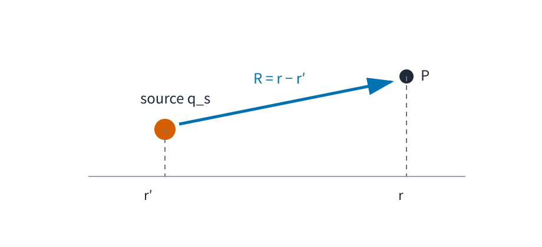
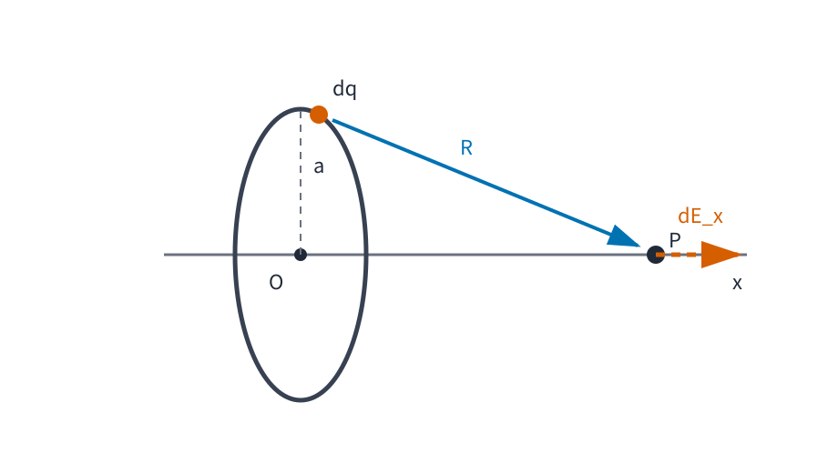

# EMAG1 電荷・Coulomb 力・電場

<!-- definition-example-audit: strict -->

古典力学では、力 $F$ が与えられれば Newton 方程式

$$
m a = F
$$

から運動を考えられました。

しかし「二つの荷電した物体の間には、どの向きに、どれだけの力が働くのか」は力学そのものからは決まりません。そこには新しい経験法則が必要です。

電磁気学の最初の課題は、電荷どうしに生じる力を記述し、それを「離れた二物体の間の力」だけでなく、**空間の各点に値を持つ場**として表すことです。

本章の中心問いは次です。

> **静止した電荷が作る力を、電荷源から切り離して空間の性質として記述するにはどうすればよいか。**

流れは

$$
\text{電荷}
\longrightarrow
\text{Coulomb の法則}
\longrightarrow
\text{重ね合わせ}
\longrightarrow
\text{電場}
\longrightarrow
\text{連続電荷分布}
$$

です。

閉曲面を使う静電場の法則は EMAG2、電位と Poisson 方程式は EMAG3 で扱います。本章では、まず二点電荷の経験則から空間上のベクトル場までを組み立てます。

---

## 1. 電荷：符号を持つ相互作用の源

電磁気学では、電気的な力の源となる物理量として電荷 $q$ を用います。SI 単位は coulomb で、記号は $\mathrm C$ です。

電荷には正負があります。

- $q>0$：正電荷
- $q<0$：負電荷

同符号の電荷どうしは反発し、異符号の電荷どうしは引き合います。

ここで重要なのは、電荷の符号が単なるラベルではなく、後で力の向きを決めることです。

電荷には、孤立系では総量が変化しないという重要な性質があります。

<!-- formal-statement-start -->
> **原理（電荷保存）**  
> 外部との電荷の出入りがない孤立系では、系の総電荷は時間によらず一定である。
<!-- formal-statement-end -->

これはベクトル解析から証明される数学定理ではなく、電磁気学の経験的な物理原理です。

後の EMAG5 では、電荷密度と電流密度を導入し、この原理を局所的な連続の式へ書き換えます。VC9 では Maxwell 方程式からその連続の式が導かれることを数学的に確認済みですが、本系列では物理量の意味から積み上げます。

---

## 2. Coulomb の法則：二つの点電荷の間に働く力

まず電荷が空間の一点に集中している理想化を考えます。位置 $r_1$ に電荷 $q_1$、位置 $r_2$ に電荷 $q_2$ があるとします。

源点から観測点へ向かうベクトルを

$$
R=r_2-r_1
$$

とします。

向きを含むベクトル式を先に書くと、符号判定を別に暗記する必要がありません。

<!-- formal-statement-start -->
> **原理（Coulomb の法則）**  
> 真空中で静止している二つの点電荷 $q_1,q_2$ が異なる位置 $r_1,r_2\in\mathbb R^3$ にあるとする。電荷 1 が電荷 2 に及ぼす力を $F_{2\leftarrow1}$ とすると、
>
$$
\boxed{
F_{2\leftarrow1}
=
\frac{1}{4\pi\varepsilon_0}
\frac{q_1q_2}{|r_2-r_1|^3}
(r_2-r_1)
}
$$
>
> とする。ここで $\varepsilon_0>0$ は真空の誘電率である。
<!-- formal-statement-end -->

Coulomb 定数

$$
k_e
=
\frac{1}{4\pi\varepsilon_0}
$$

を使えば

$$
F_{2\leftarrow1}
=
k_e
\frac{q_1q_2}{R^3}R,
\qquad
R=|R|
$$

と書けます。

力の大きさだけなら

$$
\boxed{
|F_{2\leftarrow1}|
=
k_e
\frac{|q_1q_2|}{R^2}
}
$$

です。

### 2.1 符号が向きを決める

$R=r_2-r_1$ は電荷 1 から電荷 2 へ向くベクトルです。

したがって

- $q_1q_2>0$ なら係数は正で、力は $R$ と同方向：斥力
- $q_1q_2<0$ なら係数は負で、力は $R$ と逆方向：引力

です。

「同符号なら反発、異符号なら引力」を別規則として付け足したのではありません。ベクトル式に符号を含めれば自動的に出ます。

### 2.2 Newton の第3法則との整合

電荷 2 が電荷 1 に及ぼす力は

$$
F_{1\leftarrow2}
=
k_e
\frac{q_1q_2}{|r_1-r_2|^3}
(r_1-r_2).
$$

ところが

$$
r_1-r_2
=
-(r_2-r_1)
$$

なので

$$
\boxed{
F_{1\leftarrow2}
=
-
F_{2\leftarrow1}
}.
$$

静電的な二点電荷模型では、[MECH2 の Newton 第3法則](../MECH2/index.md#principle-mech2-newton-third)と整合します。

ただし、時間変化する電磁場では、物体どうしの瞬間的な力だけでは全体系の力学的な収支を閉じられません。この点は動的電磁気で改めて扱います。

### 2.3 数値例

距離

$$
R=0.50\ \mathrm m
$$

だけ離れた

$$
q_1=2.0\ \mu\mathrm C,
\qquad
q_2=-3.0\ \mu\mathrm C
$$

を考えます。

力の大きさは

$$
|F|
=
k_e
\frac{
(2.0\times10^{-6})
(3.0\times10^{-6})
}{
(0.50)^2
}.
$$

$$
k_e\approx8.99\times10^9\ 
\mathrm{N\,m^2/C^2}
$$

を使うと

$$
|F|
\approx
0.216\ \mathrm N.
$$

$q_1q_2<0$ なので引力です。

---

## 3. 重ね合わせ：三つ以上の電荷ではベクトル和を取る

Coulomb の法則は二点電荷の法則です。多数の電荷があるときは、各電荷からの寄与をベクトルとして足します。

<!-- formal-statement-start -->
> **原理（重ね合わせ）**  
> 位置 $r_1,\ldots,r_N$ に固定された点電荷 $q_1,\ldots,q_N$ があり、別の点電荷 $q_0$ を位置 $r$ に置くとする。$r\ne r_i$ とする。このとき $q_0$ に働く静電気力は、各 $q_i$ が単独で存在するときの Coulomb 力のベクトル和
>
$$
\boxed{
F(r)
=
\sum_{i=1}^N
\frac{1}{4\pi\varepsilon_0}
\frac{q_0q_i}{|r-r_i|^3}
(r-r_i)
}
$$
>
> で与えられる。
<!-- formal-statement-end -->

この原理のおかげで、多数の電荷がある問題を

$$
\text{各電荷の寄与を求める}
\longrightarrow
\text{成分ごとに足す}
$$

という手順へ分解できます。

### 3.1 同じ大きさの二電荷の中点

$x$ 軸上の

$$
r_1=(-a,0,0),
\qquad
r_2=(a,0,0)
$$

に同じ正電荷 $q>0$ を置きます。

原点に正の試験電荷 $q_0$ を置くと、左の電荷からの力は $+x$ 方向、右の電荷からの力は $-x$ 方向です。

大きさはどちらも

$$
k_e\frac{q_0q}{a^2}
$$

なので

$$
F(0)=0.
$$

これは「電荷がないから力が 0」なのではなく、**二つの非零な寄与が対称性で打ち消し合った**結果です。

---

## 4. 電場：試験電荷を外して空間の量にする

ここまでの式では、電荷源 $q_i$ と、力を受ける電荷 $q_0$ が同じ式に入っていました。

しかし、同じ電荷源の配置に対して

- 位置 $r$ ではどの向きに電気的な力が現れるか
- その強さはどれくらいか

を、そこへ実際に置く試験電荷の値とは切り離して表したいところです。

重ね合わせの式を見ると、力 $F$ は $q_0$ に比例しています。そこで比例係数を空間の量として取り出します。

<!-- formal-statement-start -->
> **定義（電場）**  
> 固定した電荷源の配置のもとで、位置 $r$ に置いた試験電荷 $q_0$ に働く静電気力が
>
$$
F(r)=q_0E(r)
$$
>
> と表されるとき、試験電荷 $q_0$ に依存しないベクトル $E(r)$ を、その位置の **電場**とする。
<!-- formal-statement-end -->

SI 単位は

$$
\mathrm{N/C}
$$

です。

電場は [VC1 のベクトル場](../VC1/index.md) の具体例です。各点 $r$ に一つのベクトル $E(r)$ を対応させます。

<!-- definition-example-start: def-emag1-electric-field -->
**定義の確認**

原点の一点電荷で条件を確認します。

原点に源電荷 $Q$ を置き、$r\ne0$ に試験電荷 $q_0$ を置きます。

Coulomb の法則から

$$
F(r)
=
k_e
\frac{Qq_0}{|r|^3}r.
$$

右辺から $q_0$ をくくると

$$
F(r)
=
q_0
\left(
k_e
\frac{Q}{|r|^3}r
\right).
$$

したがって定義の係数は

$$
\boxed{
E(r)
=
k_e
\frac{Q}{|r|^3}r
}.
$$

この式に $q_0$ は残っていません。

さらに任意の試験電荷に対して

$$
q_0E(r)
=
k_e
\frac{Qq_0}{|r|^3}r
=
F(r)
$$

なので、定義を満たしています。
<!-- definition-example-end -->

負の試験電荷を置けば、実際の力 $F=q_0E$ は電場と逆向きになります。

したがって「電場の向き」は

> **正の試験電荷が受ける力の向き**

と読むのが安全です。

---

## 5. 点電荷系の電場

重ね合わせの式から $q_0$ をくくれば、複数点電荷の電場が得られます。

<!-- formal-statement-start -->
> **命題（点電荷系が作る電場）**  
> 位置 $r_i$ に固定された点電荷 $q_i$ が $i=1,\ldots,N$ まであり、観測点 $r$ はどの $r_i$ とも一致しないとする。Coulomb の法則と重ね合わせ原理のもとで、観測点 $r$ の電場は
>
$$
\boxed{
E(r)
=
\frac{1}{4\pi\varepsilon_0}
\sum_{i=1}^N
q_i
\frac{r-r_i}{|r-r_i|^3}
}
$$
>
> である。
<!-- formal-statement-end -->

### 証明の見取り図

試験電荷 $q_0$ に働く合力を書き、全項に共通する $q_0$ をくくります。残った係数が電場です。

<!-- proof-start -->
### 証明

重ね合わせ原理から、試験電荷 $q_0$ に働く力は

$$
F(r)
=
\sum_{i=1}^N
k_e
\frac{q_0q_i}{|r-r_i|^3}
(r-r_i).
$$

$q_0$ は和の各項に共通なので

$$
F(r)
=
q_0
\left[
k_e
\sum_{i=1}^N
q_i
\frac{r-r_i}{|r-r_i|^3}
\right].
$$

電場の定義

$$
F(r)=q_0E(r)
$$

と比較すると

$$
E(r)
=
k_e
\sum_{i=1}^N
q_i
\frac{r-r_i}{|r-r_i|^3}.
$$

最後に

$$
k_e=\frac{1}{4\pi\varepsilon_0}
$$

を代入すれば結論を得ます。
<!-- proof-end -->

### 5.1 同符号二電荷の中点

前節と同じく

$$
r_1=(-a,0,0),
\qquad
r_2=(a,0,0),
\qquad
q_1=q_2=q>0
$$

とします。

原点では

$$
E_1(0)
=
k_e q
\frac{(a,0,0)}{a^3}
=
\frac{k_eq}{a^2}(1,0,0),
$$

$$
E_2(0)
=
k_e q
\frac{(-a,0,0)}{a^3}
=
-\frac{k_eq}{a^2}(1,0,0).
$$

よって

$$
\boxed{
E(0)=0
}.
$$

試験電荷を導入しなくても、空間の対称性だけで「ここでは各電荷からの寄与が打ち消し合う」と読めます。

---

## 6. 点の集まりから連続分布へ

現実の帯電体を、膨大な点電荷を一つずつ列挙して記述するのは不便です。

そこで、十分細かい尺度では電荷が連続的に分布しているとみなし、

- 曲線上の分布
- 曲面上の分布
- 三次元領域内の分布

を密度で表します。

<!-- formal-statement-start -->
> **定義（連続電荷分布の密度）**  
> 線上の微小長さ $ds$ に含まれる電荷を $dq$ とするとき、
>
$$
dq=\lambda\,ds
$$
>
> を満たす $\lambda$ を線電荷密度とする。  
> 曲面上の微小面積 $dS$ に対して
>
$$
dq=\sigma\,dS
$$
>
> を満たす $\sigma$ を面電荷密度とする。  
> 三次元領域の微小体積 $dV$ に対して
>
$$
dq=\rho\,dV
$$
>
> を満たす $\rho$ を体積電荷密度とする。
<!-- formal-statement-end -->

単位はそれぞれ

$$
[\lambda]=\mathrm{C/m},
\qquad
[\sigma]=\mathrm{C/m^2},
\qquad
[\rho]=\mathrm{C/m^3}
$$

です。

<!-- definition-example-start: def-emag1-charge-density -->
**定義の確認**

一様分布から総電荷を戻して条件を確認します。

長さ $L$ の棒に総電荷 $Q$ が一様に分布しているなら

$$
\lambda=\frac{Q}{L}.
$$

したがって

$$
\int_0^L \lambda\,ds
=
\frac{Q}{L}L
=
Q.
$$

半径 $a$ の円板に総電荷 $Q$ が一様に分布しているなら

$$
\sigma=\frac{Q}{\pi a^2}.
$$

面積全体で積分すると

$$
\int_S\sigma\,dS
=
\sigma\,\pi a^2
=
Q.
$$

半径 $a$ の球に総電荷 $Q$ が一様に分布しているなら

$$
\rho
=
\frac{Q}{(4/3)\pi a^3}
=
\frac{3Q}{4\pi a^3}.
$$

体積全体で積分すると

$$
\int_V\rho\,dV
=
\rho\frac{4}{3}\pi a^3
=
Q.
$$

線・面・体積のいずれでも、「密度を対応する幾何学的測度で積分すると総電荷になる」ことが確認できました。
<!-- definition-example-end -->

---

## 7. 連続電荷分布の電場：和を積分へ移す

点電荷系では

$$
E(r)
=
k_e
\sum_i
q_i
\frac{r-r_i}{|r-r_i|^3}
$$

でした。

連続分布では、小領域に含まれる微小電荷 $dq$ を一つの小さな点電荷とみなし、その寄与を足し合わせます。

源の位置を $r'$、観測点を $r$ とします。

一つの微小電荷 $dq$ が作る電場は

$$
dE(r)
=
k_e
\frac{dq}{|r-r'|^3}
(r-r').
$$

これを全電荷分布について積分します。

<!-- formal-statement-start -->
> **命題（連続電荷分布が作る電場）**  
> 有界な領域 $D\subset\mathbb R^3$ に連続な体積電荷密度 $\rho(r')$ が分布し、観測点 $r$ が $D$ の外にあるとする。Coulomb の法則、重ね合わせ原理、および連続分布模型のもとで、
>
$$
\boxed{
E(r)
=
\frac{1}{4\pi\varepsilon_0}
\int_D
\rho(r')
\frac{r-r'}{|r-r'|^3}
\,dV'
}
$$
>
> である。線電荷・面電荷では、それぞれ $\rho\,dV'$ を $\lambda\,ds'$、$\sigma\,dS'$ に置き換える。
<!-- formal-statement-end -->

### 証明の見取り図

領域 $D$ を小領域へ分割し、各小領域の電荷を一点に集めた近似を作ります。点電荷の重ね合わせ和を細分化すると、[RA7 の多重 Riemann 積分](../RA7/index.md)へ移ります。

<!-- proof-start -->
### 証明

$D$ を小領域

$$
D_1,\ldots,D_M
$$

へ分割し、各 $D_j$ から代表点 $r'_j$ を一つ取ります。

$D_j$ の体積を $\Delta V_j$ とすると、その小領域の電荷は細分化極限で

$$
\Delta q_j
\approx
\rho(r'_j)\Delta V_j
$$

と表されます。

各 $\Delta q_j$ を代表点 $r'_j$ に置いた点電荷として近似すれば、点電荷系の電場は

$$
E_M(r)
=
k_e
\sum_{j=1}^M
\rho(r'_j)
\frac{r-r'_j}{|r-r'_j|^3}
\Delta V_j.
$$

観測点 $r$ は $D$ の外にあるため、考えている領域で

$$
|r-r'|>0
$$

です。従って

$$
r'
\longmapsto
\rho(r')
\frac{r-r'}{|r-r'|^3}
$$

は $D$ 上で連続です。

よって分割の最大径を 0 へ近づけると、この Riemann 和は

$$
k_e
\int_D
\rho(r')
\frac{r-r'}{|r-r'|^3}
\,dV'
$$

へ収束します。

最後に

$$
k_e
=
\frac{1}{4\pi\varepsilon_0}
$$

を代入すれば結論を得ます。

線分布と面分布でも、同じ重ね合わせの議論を弧長・面積に対する Riemann 和で行えば

$$
dq=\lambda\,ds',
\qquad
dq=\sigma\,dS'
$$

を使う対応する積分式が得られます。
<!-- proof-end -->

ここで観測点を電荷分布の内部へ入れる場合、核

$$
\frac{r-r'}{|r-r'|^3}
$$

が $r'=r$ で特異になります。点電荷や特異点を含む場の扱いは、EMAG2 で Gauss の法則とともに整理します。

---

## 8. 一様帯電リングの軸上電場

連続分布の最初の標準例として、半径 $a$ の円形リングに総電荷 $Q$ が一様に分布している場合を考えます。

リングを $yz$ 平面に置き、その中心を原点 $O$ とします。観測点 $P$ を $x$ 軸上の

$$
(x,0,0)
$$

に取ります。

リング上の各微小電荷 $dq$ から観測点までの距離はすべて

$$
R
=
\sqrt{x^2+a^2}
$$

です。

したがって微小電場の大きさは

$$
dE
=
k_e
\frac{dq}{x^2+a^2}.
$$

ここで一つの $dq$ が作る電場には

- $x$ 軸方向成分
- $yz$ 平面内の横成分

があります。

しかしリング上で正反対の位置にある電荷要素どうしを組にすると、横成分は大きさが等しく向きが反対なので打ち消し合います。

残るのは $x$ 成分だけです。

電荷要素から観測点へのベクトルと $x$ 軸のなす角を $\alpha$ とすると

$$
\cos\alpha
=
\frac{x}{\sqrt{x^2+a^2}}.
$$

よって

$$
dE_x
=
dE\cos\alpha
=
k_e
\frac{x\,dq}{(x^2+a^2)^{3/2}}.
$$

リング全体で積分すると

$$
E_x
=
k_e
\frac{x}{(x^2+a^2)^{3/2}}
\int dq.
$$

総電荷が $Q$ なので

$$
\int dq=Q.
$$

従って

$$
\boxed{
E(x,0,0)
=
k_e
\frac{Qx}{(x^2+a^2)^{3/2}}
(1,0,0)
}.
$$

### 8.1 極限で式を検査する

中心 $x=0$ では

$$
E(0)=0.
$$

これはリングの全方向対称性と一致します。

一方、

$$
|x|\gg a
$$

では

$$
(x^2+a^2)^{3/2}
=
|x|^3
\left(
1+\frac{a^2}{x^2}
\right)^{3/2}
\approx
|x|^3.
$$

従って遠方では

$$
E
\approx
k_e
\frac{Qx}{|x|^3}(1,0,0),
$$

つまり総電荷 $Q$ を原点に集めた点電荷の電場へ近づきます。

このように、積分結果は

- 対称点
- 遠方極限
- 単位

で検査できます。

---

## 9. 電気力線は「場の向き」を見る補助表現

電場 $E(r)$ は数式としてはベクトル場です。

空間の多数の点で矢印を全部描くと見づらくなるため、電場の向きを曲線で表す補助表現を導入します。

<!-- formal-statement-start -->
> **定義（電気力線）**  
> 電場 $E$ が 0 でない領域で、各点における接線方向がその点の $E$ と平行になる曲線を **電気力線**とする。
<!-- formal-statement-end -->

<!-- definition-example-start: def-emag1-electric-field-line -->
**定義の確認**

正の点電荷の放射状の線で条件を確認します。

原点に $Q>0$ の点電荷があるとき

$$
E(r)
=
k_e\frac{Q}{|r|^3}r,
\qquad
r\ne0.
$$

任意の固定した単位ベクトル $n$ と $s>0$ に対し、曲線

$$
\gamma(s)=sn
$$

を考えます。

曲線を微分すると

$
\gamma'(s)=n.
$

一方、

$$
E(\gamma(s))
=
k_e
\frac{Q}{s^2}n
$$

なので、$\gamma'(s)$ と $E(\gamma(s))$ は平行です。

従って原点から外向きに伸びる放射状の半直線は、定義を満たす電気力線です。
<!-- definition-example-end -->

電気力線について、少なくとも次の三点を区別します。

1. 正電荷の近くでは外向き、負電荷の近くでは内向きになる。
2. 電場が一意に定まる点では、異なる電気力線が同じ点で異なる方向へ交差することはできない。
3. 電気力線は物質の糸でも、電荷が必ずそこを流れる軌跡でもない。

三つ目は特に重要です。

荷電粒子の運動は

$$
m a=qE
$$

で決まり、速度は一般には電場と同方向とは限りません。したがって粒子軌道と電気力線は別物です。

---

## 10. 何が物理法則で、何が数学なのか

ここまでには三種類の主張が混ざっています。

### 10.1 経験的な物理原理

- 電荷保存
- Coulomb の法則
- 重ね合わせ原理

これらは、ベクトル解析だけから証明されるものではありません。

### 10.2 定義

- 電場
- 電荷密度
- 電気力線

これらは経験法則を整理して使うための表現です。

### 10.3 数学的な帰結

Coulomb の法則と重ね合わせ原理を仮定すると、

$$
E(r)
=
k_e
\sum_i
q_i
\frac{r-r_i}{|r-r_i|^3}
$$

や

$$
E(r)
=
k_e
\int
\frac{r-r'}{|r-r'|^3}
\,dq
$$

が導かれます。

この区別を保つと、

> ベクトル解析の積分公式があるから Coulomb の法則が真である

という逆向きの理解を避けられます。

数学は物理法則の形を変換し、その帰結を導く道具です。どの物理法則を採用するかは別の層にあります。

---

## 11. Coulomb 模型の適用範囲

本章では、静止している、または時間変化を無視できる電荷配置を中心にしました。

Coulomb の式をそのまま

$$
\text{遠くの電荷の現在位置}
\longrightarrow
\text{瞬時に現在の力}
$$

という一般原理へ拡張してはいけません。

時間変化する電荷と電流では、

- 磁場
- Faraday の法則
- Ampère--Maxwell の法則
- 有限速度で伝わる電磁波

が必要になります。

電場という考え方は残りますが、静電場だけでは電磁気学全体を閉じられません。

---

## 12. 本章で何ができるようになったか

本章では次を組み立てました。

1. 電荷の符号と保存則を物理原理として説明できる。
2. Coulomb の法則をベクトルで書き、引力・斥力の向きを符号から判定できる。
3. 多数の点電荷について重ね合わせで合力を計算できる。
4. 電場を試験電荷から独立したベクトル場として取り出せる。
5. 点電荷系の電場公式を Coulomb 力から導ける。
6. 線・面・体積電荷密度から総電荷を積分で回収できる。
7. 連続分布の電場を Coulomb 核の積分として書ける。
8. 一様帯電リングの軸上電場を対称性と積分から導ける。
9. 電気力線と荷電粒子の軌道を区別できる。
10. 物理原理・定義・数学的帰結を区別できる。

次の EMAG2 では、Coulomb の法則を一点ずつ足す方法とは別に、**閉曲面を貫く電束**から電場を読む Gauss の法則へ進みます。

---

# 演習

## Level A

### A1. 二点電荷の Coulomb 力

$x$ 軸上の

$$
r_1=(0,0,0)\ \mathrm m,
\qquad
r_2=(0.30,0,0)\ \mathrm m
$$

に

$$
q_1=2.0\ \mu\mathrm C,
\qquad
q_2=-5.0\ \mu\mathrm C
$$

を置く。

1. 電荷 1 が電荷 2 に及ぼす力 $F_{2\leftarrow1}$ の向きを答えよ。
2. 力の大きさを $k_e=8.99\times10^9\ \mathrm{N\,m^2/C^2}$ として求めよ。
3. $F_{1\leftarrow2}$ をベクトルで表し、Newton 第3法則を確認せよ。

- Level: A

<!-- solution-start -->
#### 詳細解答

まず

$$
R
=
r_2-r_1
=
(0.30,0,0)\ \mathrm m.
$$

電荷の積は

$$
q_1q_2
=
(2.0\times10^{-6})
(-5.0\times10^{-6})
<0
$$

なので引力です。

従って電荷 2 に働く力は電荷 1 の方向、すなわち $-x$ 方向です。

大きさは

$$
|F|
=
k_e
\frac{|q_1q_2|}{R^2}.
$$

数値を代入すると

$$
|F|
=
8.99\times10^9
\frac{
(2.0\times10^{-6})
(5.0\times10^{-6})
}{
(0.30)^2
}.
$$

分子の電荷積は

$$
(2.0\times10^{-6})(5.0\times10^{-6})
=
1.0\times10^{-11}.
$$

従って

$$
|F|
=
8.99\times10^9
\frac{1.0\times10^{-11}}{0.09}
\approx
0.999\ \mathrm N.
$$

したがって

$$
\boxed{
F_{2\leftarrow1}
\approx
(-0.999,0,0)\ \mathrm N
}.
$$

反対向きの力は

$$
\boxed{
F_{1\leftarrow2}
\approx
(0.999,0,0)\ \mathrm N
}.
$$

よって

$$
F_{1\leftarrow2}
=
-
F_{2\leftarrow1}
$$

が確認できます。
<!-- solution-end -->

### A2. 点電荷の電場と試験電荷の力

原点に正電荷 $Q>0$ がある。

1. 位置
   $$
   r=(3a,4a,0),
   \qquad
   a>0
   $$
   の電場を求めよ。
2. その点に電荷 $q_0<0$ を置いたときの力を求め、向きを説明せよ。

- Level: A

<!-- solution-start -->
#### 詳細解答

まず距離は

$$
|r|
=
\sqrt{(3a)^2+(4a)^2}
=
5a.
$$

点電荷の電場は

$$
E(r)
=
k_e
\frac{Q}{|r|^3}r.
$$

したがって

$$
E(r)
=
k_e
\frac{Q}{(5a)^3}
(3a,4a,0).
$$

$a$ を約分すると

$$
\boxed{
E(r)
=
\frac{k_eQ}{125a^2}
(3,4,0)
}.
$$

$Q>0$ なので電場は原点から外向きです。

試験電荷に働く力は

$$
F=q_0E.
$$

よって

$$
\boxed{
F
=
\frac{k_eQq_0}{125a^2}
(3,4,0)
}.
$$

$q_0<0$ なので係数は負です。従って力は電場と反対向き、つまり原点へ向きます。
<!-- solution-end -->

### A3. 同符号二電荷の中点

$x$ 軸上の $x=-a$ と $x=a$ に同じ正電荷 $q$ がある。

1. 原点で各電荷が作る電場 $E_1,E_2$ を求めよ。
2. 合成電場が 0 になることを示せ。
3. 原点に正の試験電荷 $q_0$ を置いた場合、合力が 0 でも各電荷からの力が 0 ではないことを式で確認せよ。

- Level: A

<!-- solution-start -->
#### 詳細解答

左側の電荷から原点への変位は

$$
(a,0,0)
$$

です。従って

$$
E_1
=
\frac{k_eq}{a^2}(1,0,0).
$$

右側の電荷から原点への変位は

$$
(-a,0,0)
$$

なので

$$
E_2
=
-\frac{k_eq}{a^2}(1,0,0).
$$

従って

$$
\boxed{
E_1+E_2=0
}.
$$

正の試験電荷 $q_0$ に働く個々の力は

$$
F_1=q_0E_1
=
\frac{k_eqq_0}{a^2}(1,0,0),
$$

$$
F_2=q_0E_2
=
-\frac{k_eqq_0}{a^2}(1,0,0).
$$

$q,q_0,a>0$ なので

$$
F_1\ne0,
\qquad
F_2\ne0.
$$

しかし

$$
F_1+F_2=0.
$$

従って合力 0 は「各電荷からの力がない」のではなく、「非零の二力が打ち消し合う」ことを意味します。
<!-- solution-end -->

### A4. 電荷密度から総電荷を求める

次の一様分布について総電荷を求めよ。

1. 長さ $L$ の線分、線電荷密度 $\lambda_0$
2. 面積 $A$ の平面領域、面電荷密度 $\sigma_0$
3. 体積 $V$ の三次元領域、体積電荷密度 $\rho_0$

さらに、$\lambda_0,\sigma_0,\rho_0$ の SI 単位を答えよ。

- Level: A

<!-- solution-start -->
#### 詳細解答

線分では

$$
dq=\lambda_0\,ds.
$$

従って

$$
Q
=
\int dq
=
\int_0^L\lambda_0\,ds
=
\boxed{\lambda_0L}.
$$

面分布では

$$
dq=\sigma_0\,dS.
$$

従って

$$
Q
=
\int_S\sigma_0\,dS
=
\sigma_0A
=
\boxed{\sigma_0A}.
$$

体積分布では

$$
dq=\rho_0\,dV.
$$

従って

$$
Q
=
\int_D\rho_0\,dV
=
\rho_0V
=
\boxed{\rho_0V}.
$$

SI 単位は

$$
\boxed{
[\lambda_0]=\mathrm{C/m},
\qquad
[\sigma_0]=\mathrm{C/m^2},
\qquad
[\rho_0]=\mathrm{C/m^3}
}.
$$
<!-- solution-end -->

## Level B

### B1. 一様帯電リングの軸上電場

半径 $a$ のリングに総電荷 $Q$ が一様に分布している。リングは $yz$ 平面にあり、中心は原点とする。

$x$ 軸上の点 $(x,0,0)$ における電場を求めよ。

1. リング上の任意の電荷要素から観測点までの距離を求めよ。
2. 横成分が相殺する理由を説明せよ。
3. 軸方向成分を積分して
   $$
   E_x
   =
   k_e
   \frac{Qx}{(x^2+a^2)^{3/2}}
   $$
   を導け。
4. $x=0$ と $|x|\gg a$ の極限を確認せよ。

- Level: B

<!-- solution-start -->
#### 詳細解答

リング上の任意の点は $x$ 座標が 0 で、原点からの距離が $a$ です。

観測点は $(x,0,0)$ なので、直角三角形から距離は

$$
R
=
\sqrt{x^2+a^2}.
$$

微小電荷 $dq$ が作る電場の大きさは

$$
dE
=
k_e\frac{dq}{R^2}
=
k_e
\frac{dq}{x^2+a^2}.
$$

リング上で正反対にある二つの電荷要素を組にすると、$yz$ 平面内の成分は反対向きで同じ大きさなので相殺します。

従って全電場は $x$ 軸方向だけです。

電場ベクトルと $x$ 軸のなす角を $\alpha$ とすると

$$
\cos\alpha
=
\frac{x}{R}
=
\frac{x}{\sqrt{x^2+a^2}}.
$$

従って

$$
dE_x
=
dE\cos\alpha
=
k_e
\frac{x\,dq}{(x^2+a^2)^{3/2}}.
$$

$x,a$ はリング上の積分変数に依存しないので外へ出せます。

$$
E_x
=
k_e
\frac{x}{(x^2+a^2)^{3/2}}
\int dq.
$$

総電荷が $Q$ なので

$$
\int dq=Q.
$$

従って

$$
\boxed{
E_x
=
k_e
\frac{Qx}{(x^2+a^2)^{3/2}}
}.
$$

よって

$$
\boxed{
E(x,0,0)
=
k_e
\frac{Qx}{(x^2+a^2)^{3/2}}
(1,0,0)
}.
$$

$x=0$ なら分子が 0 なので

$$
E(0)=0.
$$

また $|x|\gg a$ では

$$
(x^2+a^2)^{3/2}
\approx
|x|^3
$$

だから

$$
E
\approx
k_e
\frac{Qx}{|x|^3}(1,0,0),
$$

原点の点電荷 $Q$ の遠方場と一致します。
<!-- solution-end -->

### B2. 電気双極子の軸上遠方場

$x$ 軸上の

$$
x=-a
$$

に電荷 $-q$、

$$
x=a
$$

に電荷 $+q$

を置く。$q>0$ とする。

$x>a$ の点における電場を求め、さらに $x\gg a$ で先頭項を求めよ。

- Level: B

<!-- solution-start -->
#### 詳細解答

$x>a$ では、$+q$ からの電場は $+x$ 方向で

$$
E_+
=
k_e
\frac{q}{(x-a)^2}.
$$

$-q$ からの電場は負電荷へ向くので $-x$ 方向で

$$
E_-
=
-
k_e
\frac{q}{(x+a)^2}.
$$

従って

$$
E_x
=
k_eq
\left[
\frac{1}{(x-a)^2}
-
\frac{1}{(x+a)^2}
\right].
$$

通分すると

$$
E_x
=
k_eq
\frac{
(x+a)^2-(x-a)^2
}{
(x^2-a^2)^2
}.
$$

分子は

$$
(x+a)^2-(x-a)^2
=
4ax.
$$

よって厳密には

$$
\boxed{
E_x
=
k_e
\frac{4qax}{(x^2-a^2)^2}
}.
$$

$x\gg a$ では

$$
x^2-a^2
=
x^2
\left(
1-\frac{a^2}{x^2}
\right)
\approx
x^2.
$$

従って先頭項は

$$
E_x
\approx
k_e
\frac{4qax}{x^4}
=
\boxed{
k_e\frac{4qa}{x^3}
}.
$$

さらに係数を

$
p=2aq
$

とまとめて書けば

$$
\boxed{
E_x
\approx
k_e\frac{2p}{x^3}
}.
$$

単独の点電荷の $1/x^2$ より速く $1/x^3$ で減衰します。これは全電荷

$$
-q+q=0
$$

で、遠方では $1/x^2$ の寄与が相殺するためです。
<!-- solution-end -->

### B3. 有限な一様帯電棒の垂直二等分線上の電場

$x$ 軸上の

$$
-\frac{L}{2}\le x'\le\frac{L}{2}
$$

に、一様な線電荷密度 $\lambda>0$ の棒がある。

観測点を

$$
P=(0,y,0),
\qquad
y>0
$$

とする。

1. 対称性から電場の $x$ 成分が 0 であることを説明せよ。
2. 微小電荷
   $$
   dq=\lambda\,dx'
   $$
   が作る $y$ 成分を書け。
3. 積分して
   $$
   E_y
   =
   \frac{k_e\lambda L}
   {y\sqrt{y^2+(L/2)^2}}
   $$
   を示せ。

- Level: B

<!-- solution-start -->
#### 詳細解答

$x'$ と $-x'$ にある二つの微小電荷を組にします。

観測点 $P$ までの距離は両者で同じです。

$x$ 成分は大きさが等しく向きが反対なので打ち消し合います。一方 $y$ 成分はどちらも $+y$ 方向で加わります。

したがって

$$
E_x=0.
$$

位置 $x'$ の微小電荷から観測点へのベクトルは

$$
(-x',y,0).
$$

距離は

$$
R
=
\sqrt{x'^2+y^2}.
$$

微小電場は

$$
dE
=
k_e
\frac{\lambda\,dx'}{R^3}
(-x',y,0).
$$

従って $y$ 成分は

$$
dE_y
=
k_e
\lambda
\frac{y\,dx'}{(x'^2+y^2)^{3/2}}.
$$

よって

$$
E_y
=
k_e\lambda y
\int_{-L/2}^{L/2}
\frac{dx'}{(x'^2+y^2)^{3/2}}.
$$

被積分関数は偶関数なので

$$
E_y
=
2k_e\lambda y
\int_0^{L/2}
\frac{dx'}{(x'^2+y^2)^{3/2}}.
$$

ここでは次の微分公式を使います。

$
\frac{d}{dx'}
\left[
\frac{x'}{y^2\sqrt{x'^2+y^2}}
\right]
=
\frac{1}{(x'^2+y^2)^{3/2}}.
$

従って

$$
E_y
=
2k_e\lambda y
\left[
\frac{x'}{y^2\sqrt{x'^2+y^2}}
\right]_0^{L/2}.
$$

上端を代入すると

$$
E_y
=
2k_e\lambda y
\frac{L/2}
{y^2\sqrt{(L/2)^2+y^2}}.
$$

整理して

$$
\boxed{
E_y
=
\frac{k_e\lambda L}
{y\sqrt{y^2+(L/2)^2}}
}.
$$

したがって

$$
\boxed{
E(P)
=
\left(
0,
\frac{k_e\lambda L}
{y\sqrt{y^2+(L/2)^2}},
0
\right)
}.
$$
<!-- solution-end -->

## Level C

### C1. 一様帯電半円弧の中心電場と試験電荷の初期加速度

半径 $R$ の上半円

$$
r'(\theta)
=
(R\cos\theta,R\sin\theta,0),
\qquad
0\le\theta\le\pi
$$

に、一定の線電荷密度 $\lambda>0$ で電荷が分布している。

中心 $O=(0,0,0)$ に質量 $m>0$、電荷 $q_0$ の小さな試験粒子を静かに置く。

1. 微小弧長 $ds$ と微小電荷 $dq$ を $\theta$ で表せ。
2. 電荷要素 $dq$ が中心に作る微小電場 $dE$ をベクトルで表せ。
3. 対称性から $x$ 成分が相殺することを示せ。
4. $y$ 成分を積分し、
   $$
   \boxed{
   E(O)
   =
   \left(
   0,
   -\frac{2k_e\lambda}{R},
   0
   \right)
   }
   $$
   を導け。
5. 試験粒子の初期加速度 $a(0)$ を求め、$q_0>0$ と $q_0<0$ で向きがどう変わるか説明せよ。
6. 半円弧の総電荷 $Q$ を使って電場の大きさを書き直せ。

- Level: C

<!-- solution-start -->
#### 詳細解答

円弧の半径は $R$ なので、角度が $d\theta$ だけ増えると微小弧長は

$$
ds
=
R\,d\theta.
$$

従って微小電荷は

$$
dq
=
\lambda\,ds
=
\lambda R\,d\theta.
$$

電荷要素の位置は

$$
r'(\theta)
=
(R\cos\theta,R\sin\theta,0).
$$

観測点は原点なので、電荷要素から原点への変位は

$$
O-r'(\theta)
=
(-R\cos\theta,-R\sin\theta,0).
$$

その大きさは

$$
|O-r'(\theta)|
=
R.
$$

従って微小電場は

$$
dE
=
k_e
\frac{dq}{R^3}
(-R\cos\theta,-R\sin\theta,0).
$$

$R$ を一つ約分して

$$
dE
=
-k_e
\frac{dq}{R^2}
(\cos\theta,\sin\theta,0).
$$

さらに

$$
dq=\lambda R\,d\theta
$$

を代入すると

$$
dE
=
-\frac{k_e\lambda}{R}
(\cos\theta,\sin\theta,0)
\,d\theta.
$$

したがって $x$ 成分は

$$
E_x
=
-\frac{k_e\lambda}{R}
\int_0^\pi
\cos\theta\,d\theta.
$$

積分すると

$$
\int_0^\pi\cos\theta\,d\theta
=
[\sin\theta]_0^\pi
=
0.
$$

よって

$$
E_x=0.
$$

これは角度 $\theta$ と $\pi-\theta$ の電荷要素の $x$ 成分が相殺することに対応します。

$y$ 成分は

$$
E_y
=
-\frac{k_e\lambda}{R}
\int_0^\pi
\sin\theta\,d\theta.
$$

ここで

$$
\int_0^\pi
\sin\theta\,d\theta
=
[-\cos\theta]_0^\pi
=
2.
$$

従って

$$
E_y
=
-\frac{2k_e\lambda}{R}.
$$

よって

$$
\boxed{
E(O)
=
\left(
0,
-\frac{2k_e\lambda}{R},
0
\right)
}.
$$

電場は下向きです。すべての正電荷が上半円にあるため、中心に置いた正の試験電荷は電荷から遠ざかる向き、つまり下向きへ押されます。

試験粒子に働く初期の電気力は

$$
F(0)
=
q_0E(O).
$$

Newton の第2法則

$$
ma(0)=F(0)
$$

から

$$
a(0)
=
\frac{q_0}{m}E(O).
$$

従って

$$
\boxed{
a(0)
=
\left(
0,
-\frac{2k_e\lambda q_0}{mR},
0
\right)
}.
$$

$q_0>0$ なら下向き、$q_0<0$ なら係数の符号が反転して上向きです。

最後に半円の長さは

$$
\pi R
$$

なので総電荷は

$$
Q
=
\lambda\pi R.
$$

従って

$$
\lambda
=
\frac{Q}{\pi R}.
$$

これを電場の大きさ

$$
|E|
=
\frac{2k_e\lambda}{R}
$$

へ代入すると

$$
\boxed{
|E|
=
\frac{2k_eQ}{\pi R^2}
}.
$$
<!-- solution-end -->
