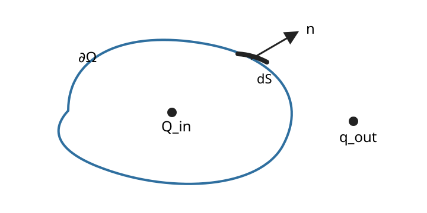

# EMAG2 Gauss の法則と静電場

<!-- definition-example-audit: strict -->

EMAG1 では、Coulomb の法則と重ね合わせから、点電荷や連続電荷分布が作る電場を

$$
E(r)
=
\frac{1}{4\pi\varepsilon_0}
\int
\frac{r-r'}{|r-r'|^3}\,dq
$$

のように組み立てました。

この方法は原理的には強力ですが、電荷が広い領域へ分布すると、観測点ごとに全電荷の寄与を積分し直す必要があります。ところが、球・無限直線・無限平面のように強い対称性がある配置では、電場そのものを一点ずつ足すよりも、**閉曲面を貫く電場の総量**を見る方が圧倒的に簡単です。

本章の中心問いは次です。

> **閉曲面を貫く電場の総量から、その内部の電荷と対称な静電場をどう読み取るか。**

流れは

$$
\text{曲面を貫く電場の総量}
\longrightarrow
\text{Gauss の法則}
\longrightarrow
\text{対称性に合う補助閉曲面}
\longrightarrow
\text{球・円筒・平面対称}
\longrightarrow
\nabla\cdot E=\frac{\rho}{\varepsilon_0}
$$

です。

ここで最初から区別しておくべき二つがあります。

- **Gauss の法則**：電荷と電場を結ぶ電磁気学の物理法則
- **[Gauss--Ostrogradsky の発散定理](../VC4/index.md#thm-vc4-gauss-divergence)**：ベクトル場の発散の体積積分と境界流束を結ぶ数学定理

名前は似ていますが、役割は別です。この区別を保ったまま、両者がどう接続するかを見ます。

---

## 1. 曲面をどれだけ電場が貫くか

電場はベクトルなので、曲面を「貫く量」を測るには電場のうち法線方向の成分だけを取り出す必要があります。

向き付けられた曲面 $S$ の単位法線を $n$ とします。小さな面積要素 $dS$ に対して、その面を貫く寄与は

$$
E\cdot n\,dS
$$

です。

これを面全体で足した量を、次の定義で定めます。

<!-- formal-statement-start -->
> **定義（電束）**  
> 向き付けられた曲面 $S$ 上に電場 $E$ が与えられているとする。$n$ を選んだ向きに対応する単位法線とする。このとき
>
$$
\boxed{
\Phi_E(S)
:=
\int_S E\cdot n\,dS
}
$$
>
> を $S$ を貫く **電束**と呼ぶ。
>
> $S=\partial\Omega$ が閉曲面である場合は、特に断らない限り $n$ を領域 $\Omega$ の外向き単位法線とする。
<!-- formal-statement-end -->

電束の SI 単位は

$$
\frac{\mathrm N}{\mathrm C}\,\mathrm m^2
=
\frac{\mathrm{N\,m^2}}{\mathrm C}
$$

です。

<!-- definition-example-start: def-emag2-electric-flux -->
**定義の確認**

一様電場と平面で確認します。

一定電場

$$
E=E_0 e_z
$$

を考えます。面積 $A$ の平面領域 $S$ の単位法線 $n$ が $e_z$ となす角を $\theta$ とすると、

$$
E\cdot n
=
E_0 e_z\cdot n
=
E_0\cos\theta.
$$

これは面上で一定なので、

$$
\Phi_E(S)
=
\int_S E_0\cos\theta\,dS
=
E_0\cos\theta\int_S dS.
$$

したがって

$$
\boxed{
\Phi_E(S)=E_0A\cos\theta
}.
$$

$\theta=0$ なら電場は面を垂直に貫き、電束は $E_0A$ です。$\theta=\pi/2$ なら電場は面に沿って流れるため、法線成分は 0 で電束も 0 です。

向きを反転して $n\mapsto -n$ とすると

$$
\Phi_E\mapsto-\Phi_E
$$

となり、電束が向き付き量であることも確認できます。
<!-- definition-example-end -->

電束は「電気力線の本数」そのものではありません。電気力線は可視化のための補助曲線であり、何本描くかは任意です。電束は面積分で定義された量です。

---

## 2. Gauss の法則：閉曲面の総電束は内部電荷で決まる

VC9 では Maxwell 方程式の積分形をまとめて扱いました。本章では、その第一式である [電場に対する Gauss の法則](../VC9/index.md#principle-vc9-maxwell-integral) だけを静電場の立場から読み直します。

閉曲面 $\partial\Omega$ を外向きに向け、その内部に含まれる総電荷を $Q_{\mathrm{in}}$ とします。Gauss の法則は

$$
\boxed{
\int_{\partial\Omega}
E\cdot n\,dS
=
\frac{Q_{\mathrm{in}}}{\varepsilon_0}
}
$$

です。

体積電荷密度 $\rho$ で電荷が記述できる場合は

$$
Q_{\mathrm{in}}
=
\int_\Omega \rho\,dV
$$

なので、

$$
\boxed{
\int_{\partial\Omega}
E\cdot n\,dS
=
\frac{1}{\varepsilon_0}
\int_\Omega\rho\,dV
}
$$

と書けます。

この式で重要なのは、右辺に入るのが **閉曲面の内部にある電荷だけ**だということです。

閉曲面の外に電荷があって、その電荷が曲面上に非零の電場を作っていても、外部電荷は $Q_{\mathrm{in}}$ には入りません。外から入ってくる電束と外へ出ていく電束が総和では相殺します。

### 2.1 物理法則と数学定理を混同しない

[Gauss--Ostrogradsky の発散定理](../VC4/index.md#thm-vc4-gauss-divergence) は、VC4 の仮定を満たす $C^1$ 級ベクトル場 $F$ に対して

$$
\int_{\partial\Omega}F\cdot n\,dS
=
\int_\Omega \nabla\cdot F\,dV
$$

と述べます。

これは電荷や電場に限らない数学定理です。

一方、Gauss の法則は

$$
\int_{\partial\Omega}E\cdot n\,dS
=
\frac{Q_{\mathrm{in}}}{\varepsilon_0}
$$

という **電場と電荷の関係**です。

[Gauss--Ostrogradsky の発散定理](../VC4/index.md#thm-vc4-gauss-divergence)だけから、右辺に電荷が現れることは出てきません。逆に Gauss の法則だけから、一般のベクトル場について[Gauss--Ostrogradsky の発散定理](../VC4/index.md#thm-vc4-gauss-divergence)が成立することも出てきません。

両者を組み合わせることで、後で

$$
\nabla\cdot E
=
\frac{\rho}{\varepsilon_0}
$$

という局所式へ移れます。

---

## 3. 対称性に合う補助閉曲面を選ぶ

Gauss の法則はどんな適切な閉曲面にも成り立ちます。しかし、どんな閉曲面を選んでも計算が簡単になるわけではありません。

たとえば電束

$$
\int_{\partial\Omega}E\cdot n\,dS
$$

を直接計算するには、普通は曲面上の各点で $E$ の大きさと向きを知る必要があります。それでは「電場を求めるために、先に電場を知る」という循環になります。

そこで、電荷配置の対称性を利用して、電束積分が簡単になる閉曲面を選びます。

<!-- formal-statement-start -->
> **定義（Gauss 面）**  
> [Gauss の法則](../VC9/index.md#principle-vc9-maxwell-integral)を用いて電場または包有電荷を計算するために、電荷配置の対称性に合わせて補助的に選ぶ閉曲面を **Gauss 面**と呼ぶ。
>
> Gauss 面は実在する膜や物体ではなく、計算のための仮想的な閉曲面である。
<!-- formal-statement-end -->

下図は閉曲面の断面を模式的に描いたものです。$Q_{\mathrm{in}}$ は閉曲面の内部、$q_{\mathrm{out}}$ は外部にあり、$n$ は面素 $dS$ における外向き単位法線です。Gauss の法則の右辺へ入るのは内部の電荷だけです。

<!-- definition-example-start: def-emag2-gaussian-surface -->
**定義の確認**

点電荷のまわりの球面で確認します。

原点に点電荷 $Q$ があるとします。

半径 $R>0$ の球面

$$
S_R
=
\{r\in\mathbb R^3:|r|=R\}
$$

は閉曲面です。外向き単位法線は

$$
n=e_r
$$

です。

EMAG1 の点電荷の電場は

$$
E
=
\frac{1}{4\pi\varepsilon_0}
\frac{Q}{R^2}e_r
$$

なので、球面上では

$$
E\parallel n,
\qquad
|E|=\text{一定}
$$

です。

したがってこの球面は、電束積分から $E$ を外へ出せるという意味で、点電荷の対称性に合った Gauss 面です。
<!-- definition-example-end -->

重要なのは順序です。

> **Gauss 面を球に選んだから電場が球対称になるのではありません。電荷配置が球対称だから、電場も球対称になり、その対称性に合う球面を選ぶと計算が簡単になります。**

Gauss 面は対称性を作りません。すでにある対称性を利用します。

---

## 4. Coulomb 場は Gauss の法則とどう整合するか

点電荷については、EMAG1 の Coulomb 場から閉曲面流束を直接計算できます。

原点の点電荷 $Q$ が作る電場を

$$
E(r)
=
\frac{1}{4\pi\varepsilon_0}
\frac{Q}{|r|^3}r,
\qquad
r\ne0
$$

とします。

球面だけなら計算はすぐです。半径 $R$ の球面上で

$$
E\cdot n
=
\frac{1}{4\pi\varepsilon_0}
\frac{Q}{R^2}
$$

なので、

$$
\int_{S_R}E\cdot n\,dS
=
\frac{Q}{4\pi\varepsilon_0R^2}
\cdot4\pi R^2
=
\frac{Q}{\varepsilon_0}.
$$

半径 $R$ が消えました。

さらに、これは球面に限りません。

<!-- formal-statement-start -->
> **命題（Coulomb 場の閉曲面流束）**  
> 原点の点電荷 $Q$ が作る Coulomb 場
>
$$
E(r)
=
\frac{1}{4\pi\varepsilon_0}
\frac{Q}{|r|^3}r
$$
>
> を考える。$\Omega\subset\mathbb R^3$ を有界領域とし、$\partial\Omega$ を外向きに向ける。原点は $\partial\Omega$ 上にないとする。
>
> 原点が $\Omega$ の外部にあれば
>
$$
\int_{\partial\Omega}E\cdot n\,dS=0,
$$
>
> 原点が $\Omega$ の内部にあれば
>
$$
\boxed{
\int_{\partial\Omega}E\cdot n\,dS
=
\frac{Q}{\varepsilon_0}
}
$$
>
> である。
<!-- formal-statement-end -->

### 証明の見取り図

原点以外では Coulomb 場の発散は 0 です。

原点が閉曲面の外なら、そのまま[Gauss--Ostrogradsky の発散定理](../VC4/index.md#thm-vc4-gauss-divergence)を使えます。原点が内側なら、原点を含む小球をくり抜いてから[Gauss--Ostrogradsky の発散定理](../VC4/index.md#thm-vc4-gauss-divergence)を使います。くり抜いた内側境界の向きが反転することが核心です。

<!-- proof-start -->
### 証明

まず

$$
r=(x,y,z),
\qquad
R=|r|
=
\sqrt{x^2+y^2+z^2}
$$

と書きます。

定数

$$
c
=
\frac{Q}{4\pi\varepsilon_0}
$$

を用いれば

$$
E
=
c
\left(
\frac{x}{R^3},
\frac{y}{R^3},
\frac{z}{R^3}
\right).
$$

$R>0$ で

$$
\frac{\partial}{\partial x}
\left(
\frac{x}{R^3}
\right)
=
\frac{1}{R^3}
-
\frac{3x^2}{R^5}.
$$

同様に各成分を微分すると

$$
\nabla\cdot E
=
c
\left[
\frac{3}{R^3}
-
\frac{3(x^2+y^2+z^2)}{R^5}
\right].
$$

ここで

$$
x^2+y^2+z^2=R^2
$$

なので

$$
\nabla\cdot E
=
c
\left(
\frac{3}{R^3}
-
\frac{3R^2}{R^5}
\right)
=
0.
$$

したがって原点以外では

$$
\boxed{
\nabla\cdot E=0
}.
$$

**原点が $\Omega$ の外にある場合。**

$E$ は $\overline\Omega$ の近傍で滑らかなので、[Gauss--Ostrogradsky の発散定理](../VC4/index.md#thm-vc4-gauss-divergence)を直接使えます。

$$
\int_{\partial\Omega}E\cdot n\,dS
=
\int_\Omega\nabla\cdot E\,dV
=
0.
$$

**原点が $\Omega$ の内部にある場合。**

十分小さい $a>0$ を取り、閉球 $\overline{B_a}$ が $\Omega$ の内部に入るようにします。

原点をくり抜いた領域

$$
\Omega_a
=
\Omega\setminus\overline{B_a}
$$

では $E$ は滑らかで、

$$
\nabla\cdot E=0
$$

です。

[Gauss--Ostrogradsky の発散定理](../VC4/index.md#thm-vc4-gauss-divergence)を $\Omega_a$ に適用すると

$$
0
=
\int_{\partial\Omega_a}E\cdot n_{\Omega_a}\,dS.
$$

境界は外側の $\partial\Omega$ と内側の球面 $\partial B_a$ からなります。

外側では $n_{\Omega_a}=n$ です。一方、内側境界では $\Omega_a$ から見た外向き法線は原点へ向くので、

$$
n_{\Omega_a}
=
-e_r.
$$

したがって

$$
0
=
\int_{\partial\Omega}E\cdot n\,dS
+
\int_{\partial B_a}E\cdot(-e_r)\,dS.
$$

半径 $a$ の球面上では

$$
E
=
\frac{Q}{4\pi\varepsilon_0a^2}e_r.
$$

よって内側境界の寄与は

$$
\int_{\partial B_a}E\cdot(-e_r)\,dS
=
-
\frac{Q}{4\pi\varepsilon_0a^2}
\int_{\partial B_a}dS.
$$

球面積は $4\pi a^2$ なので

$$
\int_{\partial B_a}E\cdot(-e_r)\,dS
=
-\frac{Q}{\varepsilon_0}.
$$

したがって

$$
0
=
\int_{\partial\Omega}E\cdot n\,dS
-
\frac{Q}{\varepsilon_0},
$$

ゆえに

$$
\boxed{
\int_{\partial\Omega}E\cdot n\,dS
=
\frac{Q}{\varepsilon_0}
}.
$$
<!-- proof-end -->

ここで分かったのは、点電荷の Coulomb 場では、点電荷を囲む閉曲面の形を変えても総電束が変わらないことです。

複数の点電荷については重ね合わせにより、閉曲面内部の点電荷だけが

$$
\frac{1}{\varepsilon_0}
\sum_{\text{inside}}q_i
$$

だけ寄与します。外側の点電荷の総寄与は 0 です。

この計算は、Coulomb の法則と Gauss の法則が静電場で整合していることを具体的に示しています。

---

## 5. Gauss の法則を計算に使う四段階

対称性が強い問題では、次の順序を守ると迷いにくくなります。

### 5.1 第1段階：電荷配置の対称性を調べる

まず電荷配置そのものが、どの変換で変わらないかを見ます。

- 球対称：原点まわりの任意の回転
- 円筒対称：軸まわりの回転と軸方向の平行移動
- 平面対称：平面内の平行移動と回転

### 5.2 第2段階：電場の向きと依存変数を絞る

たとえば球対称なら、同じ半径の点は回転で互いに移り合います。従って電場の大きさは半径 $r$ だけの関数です。

さらに、ある点 $r$ を固定する軸まわりの回転を考えると、接線方向成分があれば回転によって向きが変わってしまいます。配置は変わらないのに電場だけが変わることになるため、接線成分は持てません。

よって

$$
E(r)=E_r(r)e_r
$$

です。

### 5.3 第3段階：対称性に合う Gauss 面を選ぶ

球対称なら球面、円筒対称なら同軸円柱、平面対称なら平面をまたぐ薄い円柱を選びます。

狙いは

- $E\cdot n$ が一定になる部分を作る
- $E\cdot n=0$ になる部分を作る

ことです。

### 5.4 第4段階：包有電荷を数えて Gauss の法則を解く

最後に

$$
\int_{\partial\Omega}E\cdot n\,dS
=
\frac{Q_{\mathrm{in}}}{\varepsilon_0}
$$

へ代入します。

この方法は、**対称性が先、Gauss 面が後**です。

---

## 6. 球対称電荷分布

原点を中心として電荷密度が

$$
\rho=\rho(r)
$$

だけで決まる場合を考えます。

半径 $r$ の球内に含まれる電荷を

$$
Q(r)
=
\int_{|x|\le r}\rho(|x|)\,dV
$$

とします。

球対称性から電場は

$$
E(r)=E_r(r)e_r
$$

です。

<!-- formal-statement-start -->
> **命題（球対称電荷分布の電場）**  
> 原点を中心とする球対称な静止電荷分布を考え、半径 $r>0$ の球内の包有電荷を $Q(r)$ とする。電場が球対称であるとき、
>
$$
\boxed{
E(r)
=
\frac{Q(r)}
{4\pi\varepsilon_0r^2}
e_r
}
$$
>
> である。
<!-- formal-statement-end -->

<!-- proof-start -->
### 証明

半径 $r$ の球面を Gauss 面に取ります。

球対称性により球面上では

$$
E=E_r(r)e_r,
\qquad
n=e_r
$$

なので

$$
E\cdot n=E_r(r)
$$

は球面上で一定です。

従って電束は

$$
\int_{S_r}E\cdot n\,dS
=
E_r(r)
\int_{S_r}dS.
$$

球面積が

$$
4\pi r^2
$$

だから

$$
\int_{S_r}E\cdot n\,dS
=
4\pi r^2E_r(r).
$$

[Gauss の法則](../VC9/index.md#principle-vc9-maxwell-integral)から

$$
4\pi r^2E_r(r)
=
\frac{Q(r)}{\varepsilon_0}.
$$

$r>0$ なので割って

$$
E_r(r)
=
\frac{Q(r)}
{4\pi\varepsilon_0r^2}.
$$

よって

$$
E(r)
=
\frac{Q(r)}
{4\pi\varepsilon_0r^2}
e_r.
$$
<!-- proof-end -->

### 6.1 一様に帯電した実体球

半径 $R$ の球内部で

$$
\rho(r)=\rho_0
$$

とし、外部では $\rho=0$ とします。

$0<r<R$ では包有電荷は

$$
Q(r)
=
\rho_0
\frac{4\pi r^3}{3}.
$$

したがって

$$
E(r)
=
\frac{1}{4\pi\varepsilon_0r^2}
\left(
\rho_0\frac{4\pi r^3}{3}
\right)e_r
$$

なので

$$
\boxed{
E(r)
=
\frac{\rho_0r}{3\varepsilon_0}e_r,
\qquad
0<r<R
}.
$$

中心では極限から

$$
E(0)=0.
$$

一方 $r>R$ では全電荷

$$
Q
=
\rho_0\frac{4\pi R^3}{3}
$$

を包むので

$$
\boxed{
E(r)
=
\frac{Q}{4\pi\varepsilon_0r^2}e_r,
\qquad
r>R
}.
$$

外側から見ると、球全体の電荷を中心へ集めた点電荷と同じ電場になります。

---

## 7. 円筒対称：無限直線電荷

$z$ 軸上に一定の線電荷密度 $\lambda$ で電荷が分布している理想化を考えます。

軸からの距離を

$$
s=\sqrt{x^2+y^2}
$$

とします。

配置は

- $z$ 軸まわりの回転
- $z$ 軸方向の平行移動
- 軸を含む平面による反射

で変わりません。

したがって電場は $z$ 成分も周方向成分も持たず、

$$
E=E_s(s)e_s
$$

という半径方向だけの形になります。

<!-- formal-statement-start -->
> **命題（無限直線電荷の電場）**  
> $z$ 軸上に一様な線電荷密度 $\lambda$ があるとする。軸からの距離 $s>0$ の点における電場は
>
$$
\boxed{
E
=
\frac{\lambda}
{2\pi\varepsilon_0s}
e_s
}
$$
>
> である。
<!-- formal-statement-end -->

<!-- proof-start -->
### 証明

半径 $s$、長さ $L$ の、$z$ 軸と同軸な閉円柱を Gauss 面に取ります。

側面では外向き法線が

$$
n=e_s
$$

なので

$$
E\cdot n
=
E_s(s).
$$

対称性により $E_s(s)$ は側面上で一定です。

側面積は

$$
2\pi sL
$$

だから側面の電束は

$$
E_s(s)\,2\pi sL.
$$

上下面では法線が $\pm e_z$ ですが、電場は $e_s$ 方向なので

$$
E\cdot n=0.
$$

従って閉円柱全体の電束は

$$
2\pi sL E_s(s).
$$

円柱内部に含まれる直線電荷の長さは $L$ なので

$$
Q_{\mathrm{in}}
=
\lambda L.
$$

[Gauss の法則](../VC9/index.md#principle-vc9-maxwell-integral)より

$$
2\pi sL E_s(s)
=
\frac{\lambda L}{\varepsilon_0}.
$$

$L>0$ を消去して

$$
E_s(s)
=
\frac{\lambda}
{2\pi\varepsilon_0s}.
$$
<!-- proof-end -->

無限直線は総電荷が無限になる理想化ですが、有限長 $L$ の Gauss 面に入る電荷は $\lambda L$ と有限です。この局所的な計算によって電場を決められます。

---

## 8. 平面対称：無限平面電荷

$z=0$ の平面上に一定の面電荷密度 $\sigma$ があるとします。

配置は $xy$ 平面内の平行移動と回転で変わりません。従って電場の大きさは $x,y$ に依存できず、面内方向の特別な向きも選べません。

したがって電場は平面に垂直です。

さらに $z\mapsto-z$ の反射で配置は変わらないため、上下で大きさが等しく向きが反対です。

<!-- formal-statement-start -->
> **命題（無限平面電荷の電場）**  
> $z=0$ の平面に一様な面電荷密度 $\sigma$ があるとする。$z\ne0$ での電場は
>
$$
\boxed{
E(z)
=
\frac{\sigma}{2\varepsilon_0}
\operatorname{sgn}(z)e_z
}
$$
>
> である。
<!-- formal-statement-end -->

<!-- proof-start -->
### 証明

平面をまたぐ、底面積 $A$ の薄い円柱を Gauss 面に取ります。

上面 $z>0$ では

$$
E=E_0e_z,
\qquad
n=e_z
$$

なので電束は

$$
E_0A.
$$

下面 $z<0$ では

$$
E=-E_0e_z,
\qquad
n=-e_z
$$

なので

$$
E\cdot n=E_0
$$

であり、下面の電束も

$$
E_0A
$$

です。

側面の法線は $xy$ 平面内にあり、電場は $e_z$ 方向なので

$$
E\cdot n=0.
$$

したがって閉曲面全体の電束は

$$
2E_0A.
$$

円柱が切り取る平面電荷は

$$
Q_{\mathrm{in}}
=
\sigma A.
$$

[Gauss の法則](../VC9/index.md#principle-vc9-maxwell-integral)より

$$
2E_0A
=
\frac{\sigma A}{\varepsilon_0}.
$$

$A>0$ を消去して

$$
E_0
=
\frac{\sigma}{2\varepsilon_0}.
$$

従って

$$
E(z)
=
\frac{\sigma}{2\varepsilon_0}
\operatorname{sgn}(z)e_z.
$$
<!-- proof-end -->

$\sigma>0$ なら電場は平面から両側へ離れる向き、$\sigma<0$ なら平面へ向かう向きです。

---

## 9. 積分形から微分形へ

ここまでの Gauss の法則は閉曲面に対する積分形でした。

電荷密度 $\rho$ が通常の連続関数として記述でき、電場 $E$ が領域内で $C^1$ 級である場合を考えます。

Gauss の法則は

$$
\int_{\partial\Omega}E\cdot n\,dS
=
\frac{1}{\varepsilon_0}
\int_\Omega\rho\,dV.
$$

左辺へ [Gauss--Ostrogradsky の発散定理](../VC4/index.md#thm-vc4-gauss-divergence)を適用すると

$$
\int_\Omega\nabla\cdot E\,dV
=
\frac{1}{\varepsilon_0}
\int_\Omega\rho\,dV.
$$

右辺を左へ移して

$$
\int_\Omega
\left(
\nabla\cdot E
-
\frac{\rho}{\varepsilon_0}
\right)dV
=
0.
$$

これが任意の十分小さい領域 $\Omega$ で成り立つとします。

被積分関数

$$
f
=
\nabla\cdot E
-
\frac{\rho}{\varepsilon_0}
$$

は連続です。

もしある点 $x_0$ で $f(x_0)>0$ なら、連続性により $x_0$ の十分小さい近傍で $f>0$ のままです。その近傍を $\Omega$ に選べば

$$
\int_\Omega f\,dV>0
$$

となり、上の等式に反します。

$f(x_0)<0$ でも同様です。

したがって各点で

$$
f=0
$$

であり、

$$
\boxed{
\nabla\cdot E
=
\frac{\rho}{\varepsilon_0}
}
$$

を得ます。

逆に、この微分形が領域内で成り立つなら、$\Omega$ 上で積分して

$$
\int_\Omega\nabla\cdot E\,dV
=
\frac{1}{\varepsilon_0}
\int_\Omega\rho\,dV
$$

とし、左辺へ[Gauss--Ostrogradsky の発散定理](../VC4/index.md#thm-vc4-gauss-divergence)を適用すれば積分形へ戻ります。

四本の Maxwell 方程式について同じ変換をまとめた完全な位置付けは、[VC9 の Maxwell 方程式の積分形と微分形](../VC9/index.md#thm-vc9-maxwell-differential)にあります。本章では電場の Gauss 則だけを静電場の計算へ具体化しました。

---

## 10. 点電荷ではなぜ普通の微分形だけでは足りないのか

点電荷 $Q$ の Coulomb 場は

$$
E(r)
=
\frac{Q}{4\pi\varepsilon_0}
\frac{r}{|r|^3},
\qquad
r\ne0
$$

です。

4節で計算した通り、原点以外では

$$
\nabla\cdot E=0.
$$

ところが原点を囲むどんな球面でも

$$
\int_{S_R}E\cdot n\,dS
=
\frac{Q}{\varepsilon_0}
$$

です。

もし空間全体で単純に

$$
\nabla\cdot E=0
$$

だと思ってしまうと、[Gauss--Ostrogradsky の発散定理](../VC4/index.md#thm-vc4-gauss-divergence)から閉曲面流束まで 0 になるはずで、矛盾します。

矛盾の原因は、**原点で $E$ が定義されず、通常の[Gauss--Ostrogradsky の発散定理](../VC4/index.md#thm-vc4-gauss-divergence)の仮定を満たさない**ことです。

点に集中した電荷を局所式でも表すには、通常の関数より広い「分布」という道具を使います。

三次元 delta 分布 $\delta^{(3)}(r)$ は、十分よい関数 $f$ に対して

$$
\int_{\mathbb R^3}
\delta^{(3)}(r)f(r)\,dV
=
f(0)
$$

となるものとして特徴付けられます。

点電荷 $Q$ の電荷密度を形式的に

$$
\rho(r)
=
Q\delta^{(3)}(r)
$$

と書けば、Gauss の微分形は

$$
\boxed{
\nabla\cdot E
=
\frac{Q}{\varepsilon_0}
\delta^{(3)}(r)
}
$$

となります。

同値なよく使われる形は

$$
\boxed{
\nabla\cdot
\left(
\frac{r}{|r|^3}
\right)
=
4\pi\delta^{(3)}(r)
}
$$

です。

ここでは delta 分布の理論そのものには入りません。

重要なのは、

- 原点以外では発散は 0
- 原点に全電荷 $Q$ が集中している
- 原点を含む体積で積分すると $Q/\varepsilon_0$ が回収される

という三つを同時に表すために、普通の関数を越えた記法が必要になることです。

---

## 11. Gauss の法則だけでは電場が一意に決まらない

Gauss の法則は非常に強いですが、どんな配置でも電場をすぐ求められる万能公式ではありません。

### 11.1 総電束 0 は電場 0 を意味しない

閉曲面内部に電荷がなければ

$$
Q_{\mathrm{in}}=0
$$

なので

$$
\int_{\partial\Omega}E\cdot n\,dS=0.
$$

しかし、これは

$$
E=0
$$

を意味しません。

たとえば一様電場

$$
E=E_0e_z
$$

を任意の閉曲面へ通します。

この場は

$$
\nabla\cdot E=0
$$

なので、[Gauss--Ostrogradsky の発散定理](../VC4/index.md#thm-vc4-gauss-divergence)から

$$
\int_{\partial\Omega}E\cdot n\,dS=0
$$

です。

それでも空間の各点で

$$
E_0\ne0
$$

なら電場は非零です。

閉曲面へ入る電束と出る電束が等しく、総和が 0 になっているだけです。

### 11.2 対称性が弱いと電束積分から E を外へ出せない

Gauss の法則が与えるのは閉曲面上の

$$
E\cdot n
$$

の **積分値**です。

非対称な電荷配置では、曲面上で $E$ の大きさも向きも場所ごとに変わるため、

$$
\int_{\partial\Omega}E\cdot n\,dS
$$

の値を知っても、各点の $E$ は決まりません。

だから Gauss の法則による電場計算では、法則そのものと同じくらい **対称性の判定**が重要です。

---

## 12. 本章で何ができるようになったか

本章では次を組み立てました。

1. 電束を向き付き曲面積分として定義できる。
2. Gauss の法則と [Gauss--Ostrogradsky の発散定理](../VC4/index.md#thm-vc4-gauss-divergence)を、物理法則と数学定理として区別できる。
3. 点電荷の Coulomb 場について、原点をくり抜いた領域に[Gauss--Ostrogradsky の発散定理](../VC4/index.md#thm-vc4-gauss-divergence)を使い、閉曲面流束を再現できる。
4. Gauss 面は対称性を作るものではなく、既存の対称性を計算へ利用する補助曲面だと説明できる。
5. 球対称分布について包有電荷 $Q(r)$ から電場を求められる。
6. 無限直線電荷について円筒形 Gauss 面から $1/s$ の電場を導ける。
7. 無限平面電荷について薄い円柱形 Gauss 面から一定電場を導ける。
8. 正則な領域では積分形と
   $$
   \nabla\cdot E=\rho/\varepsilon_0
   $$
   を[Gauss--Ostrogradsky の発散定理](../VC4/index.md#thm-vc4-gauss-divergence)で往復できる。
9. 点電荷では原点が特異点になり、delta 分布が局所式を補う理由を説明できる。
10. 総電束 0 と電場 0 を混同しない。

次の EMAG3 では、静電場を「力」ではなく **電位**で記述し、

$$
E=-\nabla\phi
$$

と

$$
\Delta\phi
=
-\frac{\rho}{\varepsilon_0}
$$

を通して Poisson 方程式へ進みます。

---

# 演習

## Level A

### A1. 一様電場を貫く電束

一様電場を

$$
E=(3,0,4)\ \mathrm{N/C}
$$

とする。

面積

$$
A=2.0\ \mathrm{m^2}
$$

の平面領域 $S$ の単位法線を

$$
n=(0,0,1)
$$

とする。

1. $S$ を貫く電束を求めよ。
2. 曲面の向きを反転した場合の電束を求めよ。
3. 電場が面に完全に平行なら電束が 0 になる理由を内積から説明せよ。

- Level: A

<!-- solution-start -->
#### 詳細解答

定義から

$$
\Phi_E
=
\int_S E\cdot n\,dS.
$$

まず内積は

$$
E\cdot n
=
(3,0,4)\cdot(0,0,1)
=
4\ \mathrm{N/C}.
$$

一様電場であり、平面の法線も一定なので、$E\cdot n$ は面上で一定です。

したがって

$$
\Phi_E
=
4
\int_S dS.
$$

面積が $A=2.0\ \mathrm{m^2}$ だから

$$
\boxed{
\Phi_E
=
8.0\ \mathrm{N\,m^2/C}
}.
$$

向きを反転すると

$$
n'=-n.
$$

よって

$$
E\cdot n'
=
-E\cdot n
=
-4\ \mathrm{N/C},
$$

したがって

$$
\boxed{
\Phi'_E
=
-8.0\ \mathrm{N\,m^2/C}
}.
$$

最後に、電場が面に完全に平行なら法線 $n$ と直交するので

$$
E\cdot n=0.
$$

従って各面積要素の寄与がすべて 0 となり、

$$
\boxed{
\Phi_E=0
}
$$

です。
<!-- solution-end -->

### A2. 点電荷を囲む球面の電束

原点に点電荷 $Q$ がある。

半径 $R>0$ の球面を外向きに向ける。

1. 球面上の電場 $E$ と単位法線 $n$ を書け。
2. 球面を貫く総電束を求めよ。
3. 結果が $R$ に依存しないことの意味を説明せよ。

- Level: A

<!-- solution-start -->
#### 詳細解答

点電荷の Coulomb 場は、球面上で

$$
E
=
\frac{Q}{4\pi\varepsilon_0R^2}e_r.
$$

外向き単位法線は

$$
n=e_r.
$$

したがって

$$
E\cdot n
=
\frac{Q}{4\pi\varepsilon_0R^2}.
$$

これは球面上で一定です。

よって

$$
\Phi_E
=
\int_{S_R}E\cdot n\,dS
=
\frac{Q}{4\pi\varepsilon_0R^2}
\int_{S_R}dS.
$$

球面積は

$$
\int_{S_R}dS
=
4\pi R^2
$$

なので

$$
\boxed{
\Phi_E
=
\frac{Q}{\varepsilon_0}
}.
$$

$R^2$ が電場の $1/R^2$ と球面積の $R^2$ でちょうど相殺しました。

したがって、点電荷を囲み続ける限り、球面を大きくしても小さくしても総電束は変わりません。
<!-- solution-end -->

### A3. 一様帯電球殻

半径 $a$ の薄い球殻上に総電荷 $Q$ が一様に分布している。

球対称性を用い、中心から距離 $r$ の電場を

1. $0<r<a$
2. $r>a$

に分けて求めよ。

- Level: A

<!-- solution-start -->
#### 詳細解答

球殻は球対称なので、電場は

$$
E=E_r(r)e_r
$$

と書けます。

半径 $r$ の球面を Gauss 面に取ると、総電束は

$$
4\pi r^2E_r(r)
$$

です。

**$0<r<a$ の場合。**

Gauss 面は球殻上の電荷を一つも含みません。

したがって

$$
Q_{\mathrm{in}}=0.
$$

[Gauss の法則](../VC9/index.md#principle-vc9-maxwell-integral)から

$$
4\pi r^2E_r(r)=0.
$$

$r>0$ なので

$$
\boxed{
E=0,
\qquad
0<r<a
}.
$$

**$r>a$ の場合。**

今度は球殻上の全電荷 $Q$ を包みます。

したがって

$$
4\pi r^2E_r(r)
=
\frac{Q}{\varepsilon_0}.
$$

よって

$$
\boxed{
E
=
\frac{Q}{4\pi\varepsilon_0r^2}e_r,
\qquad
r>a
}.
$$

外側では中心に点電荷 $Q$ がある場合と同じ電場です。

$r=a$ では理想化された表面電荷があるため、内外の式をそのまま一つの通常関数として接続することはしません。
<!-- solution-end -->

### A4. 無限直線電荷

$z$ 軸上に一定の線電荷密度 $\lambda$ がある。

軸から距離 $s>0$ の点における電場を、半径 $s$、長さ $L$ の円筒形 Gauss 面を用いて導け。

さらに $\lambda>0$ のときの向きを答えよ。

- Level: A

<!-- solution-start -->
#### 詳細解答

円筒対称性から電場は

$$
E=E_s(s)e_s
$$

です。

側面では

$$
n=e_s
$$

なので

$$
E\cdot n=E_s(s).
$$

側面積は

$$
2\pi sL
$$

だから、側面を貫く電束は

$$
2\pi sL E_s(s).
$$

上下の底面では法線が $\pm e_z$ であり、

$$
e_s\cdot e_z=0
$$

なので電束は 0 です。

したがって閉円柱全体の電束は

$$
\Phi_E
=
2\pi sL E_s(s).
$$

包有電荷は

$$
Q_{\mathrm{in}}
=
\lambda L.
$$

[Gauss の法則](../VC9/index.md#principle-vc9-maxwell-integral)より

$$
2\pi sL E_s(s)
=
\frac{\lambda L}{\varepsilon_0}.
$$

$L>0$ を約分して

$$
E_s(s)
=
\frac{\lambda}{2\pi\varepsilon_0s}.
$$

従って

$$
\boxed{
E
=
\frac{\lambda}{2\pi\varepsilon_0s}e_s
}.
$$

$\lambda>0$ なら係数は正なので、電場は $z$ 軸から外向きです。
<!-- solution-end -->

## Level B

### B1. 半径方向に変化する球対称電荷密度

半径 $R$ の球内で

$$
\rho(r)
=
\rho_0
\left(
1-\frac rR
\right),
\qquad
0\le r\le R,
$$

球外で $\rho=0$ とする。$\rho_0>0$ とする。

1. $0<r<R$ での包有電荷 $Q(r)$ を求めよ。
2. 球内の電場を求めよ。
3. 全電荷 $Q$ を求め、$r>R$ の電場を求めよ。
4. $r=R$ で内側と外側の極限が一致することを確認せよ。

- Level: B

<!-- solution-start -->
#### 詳細解答

球対称なので、半径 $r$ の球内の包有電荷は球殻を積み上げて

$$
Q(r)
=
4\pi
\int_0^r
\rho(s)s^2\,ds.
$$

密度を代入すると

$$
Q(r)
=
4\pi\rho_0
\int_0^r
\left(
1-\frac sR
\right)s^2\,ds.
$$

被積分関数を展開して

$$
Q(r)
=
4\pi\rho_0
\int_0^r
\left(
s^2-\frac{s^3}{R}
\right)ds.
$$

各項を積分すると

$$
Q(r)
=
4\pi\rho_0
\left[
\frac{s^3}{3}
-
\frac{s^4}{4R}
\right]_0^r.
$$

従って

$$
\boxed{
Q(r)
=
4\pi\rho_0
\left(
\frac{r^3}{3}
-
\frac{r^4}{4R}
\right)
}.
$$

[球対称電荷分布の電場](#prop-emag2-spherical-field)から

$$
E(r)
=
\frac{Q(r)}
{4\pi\varepsilon_0r^2}e_r.
$$

$Q(r)$ を代入し、$4\pi$ と $r^2$ を約分すると

$$
\boxed{
E(r)
=
\frac{\rho_0}{\varepsilon_0}
\left(
\frac r3
-
\frac{r^2}{4R}
\right)e_r,
\qquad
0<r<R
}.
$$

全電荷は $r=R$ を代入して

$$
Q
=
4\pi\rho_0
\left(
\frac{R^3}{3}
-
\frac{R^3}{4}
\right).
$$

括弧内は

$$
\frac{R^3}{12}
$$

なので

$$
\boxed{
Q
=
\frac{\pi\rho_0R^3}{3}
}.
$$

$r>R$ では全電荷を包むため

$$
E(r)
=
\frac{Q}
{4\pi\varepsilon_0r^2}e_r.
$$

$Q$ を代入すると

$$
\boxed{
E(r)
=
\frac{\rho_0R^3}
{12\varepsilon_0r^2}e_r,
\qquad
r>R
}.
$$

内側から $r\to R$ とすると

$$
E_{\mathrm{in}}(R)
=
\frac{\rho_0}{\varepsilon_0}
\left(
\frac R3-\frac R4
\right)e_r
=
\frac{\rho_0R}{12\varepsilon_0}e_r.
$$

外側から $r\to R$ とすると

$$
E_{\mathrm{out}}(R)
=
\frac{\rho_0R^3}
{12\varepsilon_0R^2}e_r
=
\frac{\rho_0R}{12\varepsilon_0}e_r.
$$

したがって

$$
\boxed{
E_{\mathrm{in}}(R)
=
E_{\mathrm{out}}(R)
}.
$$
<!-- solution-end -->

### B2. 一様に帯電した無限円柱

半径 $a$ の無限に長い円柱内部に、一定の体積電荷密度 $\rho_0>0$ で電荷が分布している。円柱外部では $\rho=0$ とする。

軸から距離 $s$ の電場を

1. $0<s<a$
2. $s>a$

に分けて求めよ。

- Level: B

<!-- solution-start -->
#### 詳細解答

円筒対称性から

$$
E=E_s(s)e_s
$$

です。

長さ $L$、半径 $s$ の円筒形 Gauss 面を用います。

側面の電束は

$$
2\pi sL E_s(s)
$$

で、上下の底面の電束は 0 です。

**$0<s<a$ の場合。**

Gauss 面の内部で電荷が入る体積は

$$
\pi s^2L.
$$

したがって

$$
Q_{\mathrm{in}}
=
\rho_0\pi s^2L.
$$

[Gauss の法則](../VC9/index.md#principle-vc9-maxwell-integral)より

$$
2\pi sL E_s(s)
=
\frac{\rho_0\pi s^2L}{\varepsilon_0}.
$$

$\pi sL$ を約分すると

$$
2E_s(s)
=
\frac{\rho_0s}{\varepsilon_0}.
$$

従って

$$
\boxed{
E
=
\frac{\rho_0s}{2\varepsilon_0}e_s,
\qquad
0<s<a
}.
$$

**$s>a$ の場合。**

半径 $a$ の円柱全体を包むので

$$
Q_{\mathrm{in}}
=
\rho_0\pi a^2L.
$$

したがって

$$
2\pi sL E_s(s)
=
\frac{\rho_0\pi a^2L}{\varepsilon_0}.
$$

約分して

$$
\boxed{
E
=
\frac{\rho_0a^2}
{2\varepsilon_0s}e_s,
\qquad
s>a
}.
$$

内部では $E$ は $s$ に比例し、外部では $1/s$ で減衰します。
<!-- solution-end -->

### B3. 一様に帯電した無限平板

領域

$$
-a\le z\le a
$$

に一定の体積電荷密度 $\rho_0>0$ があり、$x,y$ 方向には無限に広がっているとする。外部では $\rho=0$ とする。

1. 対称性から電場の向きと $z$ 依存性を説明せよ。
2. $|z|<a$ の電場を求めよ。
3. $|z|>a$ の電場を求めよ。
4. $z=\pm a$ で電場が連続することを確認せよ。

- Level: B

<!-- solution-start -->
#### 詳細解答

平面内の平行移動と回転に対して配置が変わらないので、電場は $x,y$ に依存せず、$z$ 方向だけを向きます。

また $z\mapsto-z$ の反射で配置は変わらないため、

$$
E(-z)=-E(z).
$$

従って

$$
E(z)=E_z(z)e_z
$$

で、$E_z$ は奇関数です。

まず $0<z<a$ とします。

$-z$ から $z$ まで平板をまたぐ、底面積 $A$ の円柱を Gauss 面に取ります。

上下面では電場と外向き法線が同方向なので、総電束は

$$
2E_z(z)A.
$$

側面では電場と法線が直交するため電束は 0 です。

包有体積は

$$
2zA
$$

なので

$$
Q_{\mathrm{in}}
=
2zA\rho_0.
$$

[Gauss の法則](../VC9/index.md#principle-vc9-maxwell-integral)から

$$
2E_z(z)A
=
\frac{2zA\rho_0}{\varepsilon_0}.
$$

従って

$$
E_z(z)
=
\frac{\rho_0z}{\varepsilon_0}.
$$

奇関数性を使えば負の $z$ にも同じ式が成り立つので

$$
\boxed{
E(z)
=
\frac{\rho_0z}{\varepsilon_0}e_z,
\qquad
|z|<a
}.
$$

次に $z>a$ とします。

$-z$ から $z$ までの同じ形の Gauss 面を取ると、電荷があるのは厚さ $2a$ の部分だけです。

したがって

$$
Q_{\mathrm{in}}
=
2aA\rho_0.
$$

電束は依然として

$$
2E_z(z)A
$$

なので

$$
2E_z(z)A
=
\frac{2aA\rho_0}{\varepsilon_0}.
$$

従って $z>a$ では

$$
E
=
\frac{\rho_0a}{\varepsilon_0}e_z.
$$

$z<-a$ では反対向きなので

$$
\boxed{
E(z)
=
\frac{\rho_0a}{\varepsilon_0}
\operatorname{sgn}(z)e_z,
\qquad
|z|>a
}.
$$

内側の式で $z\to a$ とすると

$$
E
\to
\frac{\rho_0a}{\varepsilon_0}e_z,
$$

外側の式の $z>a$ 側も同じです。

$z=-a$ でも同様に

$$
-\frac{\rho_0a}{\varepsilon_0}e_z
$$

で一致します。

従って $z=\pm a$ で電場は連続です。
<!-- solution-end -->

## Level C

### C1. 一様帯電球と反対電荷を持つ同心球殻

半径 $a$ の実体球内部に一定の体積電荷密度 $\rho_0>0$ で電荷が分布している。

さらに半径 $b>a$ の薄い同心球殻に、実体球の全電荷とちょうど反対符号・同じ大きさの総電荷を一様に分布させる。

1. 実体球の全電荷 $Q_0$ を求めよ。
2. 外側球殻の面電荷密度 $\sigma$ を求めよ。
3. $0<r<a$、$a<r<b$、$r>b$ の三領域で電場を求めよ。
4. $r>b$ では電場が 0 になる一方、$a<r<b$ では電場が 0 でない理由を包有電荷から説明せよ。
5. $r>b$ の球面で総電束が 0 であることを確認し、「総電荷 0 だからあらゆる場所で電場 0」とは言えない理由を説明せよ。

- Level: C

<!-- solution-start -->
#### 詳細解答

実体球の体積は

$$
\frac{4\pi a^3}{3}.
$$

したがって全電荷は

$$
\boxed{
Q_0
=
\frac{4\pi\rho_0a^3}{3}
}.
$$

外側球殻の総電荷は

$$
-Q_0.
$$

球殻の面積は

$$
4\pi b^2
$$

なので面電荷密度は

$$
\sigma
=
\frac{-Q_0}{4\pi b^2}.
$$

$Q_0$ を代入すると

$$
\boxed{
\sigma
=
-\frac{\rho_0a^3}{3b^2}
}.
$$

配置全体は球対称なので

$$
E=E_r(r)e_r
$$

です。

**領域 $0<r<a$。**

半径 $r$ の Gauss 面が包むのは実体球の半径 $r$ までの部分だけです。

包有電荷は

$$
Q(r)
=
\rho_0\frac{4\pi r^3}{3}.
$$

[Gauss の法則](../VC9/index.md#principle-vc9-maxwell-integral)より

$$
4\pi r^2E_r(r)
=
\frac{1}{\varepsilon_0}
\rho_0\frac{4\pi r^3}{3}.
$$

$4\pi r^2$ を約分して

$$
\boxed{
E(r)
=
\frac{\rho_0r}{3\varepsilon_0}e_r,
\qquad
0<r<a
}.
$$

**領域 $a<r<b$。**

この Gauss 面は実体球の全電荷 $Q_0$ を包みますが、半径 $b$ の球殻電荷はまだ包みません。

したがって

$$
Q_{\mathrm{in}}
=
Q_0.
$$

よって

$$
4\pi r^2E_r(r)
=
\frac{Q_0}{\varepsilon_0}.
$$

従って

$$
E(r)
=
\frac{Q_0}
{4\pi\varepsilon_0r^2}e_r.
$$

$Q_0=4\pi\rho_0a^3/3$ を代入して

$$
\boxed{
E(r)
=
\frac{\rho_0a^3}
{3\varepsilon_0r^2}e_r,
\qquad
a<r<b
}.
$$

**領域 $r>b$。**

今度は実体球の $Q_0$ と外側球殻の $-Q_0$ の両方を包みます。

したがって

$$
Q_{\mathrm{in}}
=
Q_0-Q_0
=
0.
$$

[Gauss の法則](../VC9/index.md#principle-vc9-maxwell-integral)から

$$
4\pi r^2E_r(r)=0.
$$

よって

$$
\boxed{
E(r)=0,
\qquad
r>b
}.
$$

$a<r<b$ では、外側球殻の電荷は Gauss 面の外側にあるので包有電荷へ入りません。

したがって包有電荷は $Q_0$ のままで、電場は非零です。

一方 $r>b$ では二つの電荷を両方包むため包有電荷が 0 となり、さらに球対称性によって球面上の電場を一定の半径成分として外へ出せるので、電場そのものが 0 と結論できます。

$r>b$ の球面の総電束は

$$
\Phi_E
=
4\pi r^2\cdot0
=
\boxed{0}.
$$

ただし「総電荷が 0」という情報だけでは、一般の非対称な配置で全空間の電場が 0 とは言えません。

この問題で外部電場まで 0 と言えるのは、**総電荷 0 に加えて球対称性がある**からです。

実際、この同じ配置でも $a<r<b$ では全体系の総電荷は 0 であるにもかかわらず、選んだ Gauss 面が包む電荷は $Q_0$ なので電場は非零です。
<!-- solution-end -->
