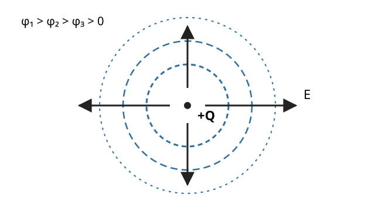

# EMAG3 電位・Poisson 方程式・Coulomb ポテンシャル

<!-- definition-example-audit: strict -->

EMAG2 では、Gauss の法則と対称性から静電場 $E$ を直接求めました。たとえば点電荷 $Q$ のまわりでは

$$
E(r)
=
\frac{Q}{4\pi\varepsilon_0r^2}e_r
$$

です。

しかし、粒子が点 $A$ から点 $B$ へ動いたときに電場がする仕事を知りたいなら、必要なのは一点の $E$ ではなく

$$
\int_A^B E\cdot dr
$$

です。さらに、境界値問題や量子力学では、ベクトル場 $E$ そのものより、一つのスカラー関数から $E$ を復元できる方が扱いやすくなります。

本章の中心問いは次です。

> **静電場を一つのスカラー場で表し、電荷密度・仕事・Coulomb の $-1/r$ ポテンシャルを同じ式からどう結び付けるか。**

流れは

$$
\text{静電場の閉曲線積分が 0}
\longrightarrow
\text{電位}
\longrightarrow
E=-\nabla\phi
\longrightarrow
-\Delta\phi=\frac{\rho}{\varepsilon_0}
\longrightarrow
\text{Coulomb ポテンシャルエネルギー}
$$

です。

この章では、**電位 $\phi$** と **位置エネルギー $U$** を意識して区別します。量子力学でしばしば $V(r)$ と書く Coulomb ポテンシャルはエネルギーであり、電位そのものではありません。

---

## 1. なぜ静電場は一つのスカラーで表せるのか

[VC9 の Faraday の法則](../VC9/index.md#principle-vc9-maxwell-integral)は、固定された向き付き曲面 $S$ に対して

$$
\oint_{\partial S}E\cdot dr
=
-
\frac{d}{dt}
\int_S B\cdot n\,dS
$$

と述べます。

静電気では電磁場が時間に依存しない状況を扱うので

$$
\frac{\partial B}{\partial t}=0.
$$

したがって、適用できる任意の閉曲線について

$$
\boxed{
\oint E\cdot dr=0
}
$$

です。

これは「一周して元の点へ戻ったとき、電場が単位電荷にする正味の仕事が 0」という意味です。

[VC2 の保存場・経路独立・閉曲線積分の同値](../VC2/index.md#thm-vc2-conservative-equivalence)から、閉曲線積分が 0 なら、二点を結ぶ線積分は途中の経路によらず端点だけで決まります。そこで電場の線積分を、一つのスカラー場の差として記録できます。

ただし、数学的には「考える閉曲線が適切な曲面を張れること」など領域の条件が必要です。本章では、静電場の線積分が経路独立になる領域で議論します。局所的には同じ内容を

$$
\nabla\times E=0
$$

と表せます。

---

## 2. 単位電荷あたりの仕事をスカラーで記録する

静電場の線積分が経路独立なら、基準点を一つ固定して、各点までの線積分をスカラー値として記録できます。

電気では慣習的に、電場と逆向きの勾配になるよう符号を取ります。

<!-- formal-statement-start -->
> **定義（電位）**  
> 連結な領域 $\Omega$ 上の静電場 $E$ について、線積分が経路独立であるとする。基準点 $r_0\in\Omega$ と基準値 $\phi(r_0)$ を固定する。
>
> 点 $r\in\Omega$ における **電位** $\phi(r)$ を
>
$$
\boxed{
\phi(r)-\phi(r_0)
=
-
\int_{r_0}^{r}E\cdot d\ell
}
$$
>
> で定める。右辺は経路によらない。
>
> 二点 $A,B$ の電位差は
>
$$
\boxed{
\phi(B)-\phi(A)
=
-
\int_A^B E\cdot d\ell
}
$$
>
> である。
<!-- formal-statement-end -->

ここで定義した量を以下では電位と呼びます。電位の SI 単位は volt で、

$$
1\ \mathrm V
=
1\ \mathrm{J/C}
$$

です。

電位は絶対値より差が物理的に重要です。定数 $C$ を加えて

$$
\phi\mapsto\phi+C
$$

としても電位差は変わりません。

<!-- definition-example-start: def-emag3-electric-potential -->
**定義の確認**\n\n一様電場で確認します。

$x$ 方向の一様電場

$$
E=E_0e_x,
\qquad
E_0>0
$$

を考えます。

原点を基準にして $\phi(0)=0$ とします。原点から $(x,y,z)$ まで、まず $x$ 軸方向へ進み、その後 $y,z$ 方向へ進む経路を選びます。

$y,z$ 方向の区間では $E\cdot d\ell=0$ なので、

$$
\phi(x,y,z)
=
-
\int_0^x E_0\,ds.
$$

したがって

$$
\boxed{
\phi(x,y,z)=-E_0x
}.
$$

実際、

$$
-\nabla\phi
=
-
(-E_0,0,0)
=
E_0e_x
=
E
$$

となり、元の電場を復元できます。

また $x$ が増える向きは電場の向きですが、その向きでは $\phi$ は減少します。
<!-- definition-example-end -->

---

## 3. 電場は電位の負の勾配である

電位差の定義から、電場を電位の微分として取り戻せます。

<!-- formal-statement-start -->
> **命題（電場と電位の勾配）**  
> 開集合 $\Omega\subset\mathbb R^3$ 上で $E$ が連続で、電位 $\phi\in C^1(\Omega)$ が
>
$$
\phi(B)-\phi(A)
=
-
\int_A^B E\cdot d\ell
$$
>
> を任意の十分短い曲線について満たすとする。このとき
>
$$
\boxed{
E=-\nabla\phi
}
$$
>
> が成り立つ。
<!-- formal-statement-end -->

<!-- proof-start -->
### 証明

点 $r\in\Omega$ と座標方向 $e_i$ を一つ固定します。

十分小さい $h$ に対して、$r$ から $r+he_i$ までの線分

$$
\gamma(s)=r+se_i,
\qquad
0\le s\le h
$$

を取ります。

電位差の定義から

$$
\phi(r+he_i)-\phi(r)
=
-
\int_0^h
E(r+se_i)\cdot e_i\,ds.
$$

両辺を $h$ で割ると

$$
\frac{\phi(r+he_i)-\phi(r)}{h}
=
-
\frac1h
\int_0^h
E_i(r+se_i)\,ds.
$$

$h\to0$ とします。

左辺は偏微分の定義から

$$
\frac{\partial\phi}{\partial x_i}(r)
$$

へ収束します。

右辺は $E_i$ の連続性から

$$
-E_i(r)
$$

へ収束します。

したがって各 $i=1,2,3$ について

$$
\frac{\partial\phi}{\partial x_i}
=
-E_i.
$$

よって

$$
\boxed{
E=-\nabla\phi
}.
$$
<!-- proof-end -->

この符号は重要です。電場は電位が最も急に**下がる**向きを向きます。

[VC2 の線積分の基本定理](../VC2/index.md#thm-vc2-line-ftc)を使えば逆向きもすぐ確認できます。$E=-\nabla\phi$ なら

$$
\int_A^B E\cdot d\ell
=
-
\int_A^B\nabla\phi\cdot d\ell
=
-
\bigl(\phi(B)-\phi(A)\bigr).
$$

---

## 4. 等電位面：電位一定の面を電場は直交して横切る

三次元では「同じ電位を持つ点」を集めると、典型的には曲面になります。

<!-- formal-statement-start -->
> **定義（等電位面）**  
> 電位 $\phi$ と定数 $c$ に対し、
>
$$
\phi(r)=c
$$
>
> を満たす点の集合のうち曲面をなす部分を **等電位面**と呼ぶ。
<!-- formal-statement-end -->

[VC1 の正則レベル曲面と勾配の直交](../VC1/index.md#thm-vc1-level-normal)から、$\nabla\phi\ne0$ の点では $\nabla\phi$ は等電位面の接方向に直交します。

しかも

$$
E=-\nabla\phi
$$

なので、電場も等電位面に直交します。

次の図では、正の点電荷を囲む同心円が球形等電位面の断面です。電場は外向きで、各等電位面を直角に横切ります。正電荷では外へ進むほど電位が下がります。

<!-- definition-example-start: def-emag3-equipotential-surface -->
**定義の確認**\n\n一様電場の等電位面で確認します。

先ほどの

$$
\phi(x,y,z)=-E_0x
$$

に対し、$\phi=c$ は

$$
x=-\frac{c}{E_0}
$$

です。

したがって等電位面は $yz$ 平面に平行な平面です。

一方

$$
E=E_0e_x
$$

は $x$ 方向を向くので、確かに各等電位面へ垂直です。
<!-- definition-example-end -->

等電位面に沿って動く変位 $d\ell$ は $E$ と直交するため

$$
E\cdot d\ell=0.
$$

したがって等電位面に沿う移動では、静電場がする仕事は 0 です。

---

## 5. 点電荷の電位はなぜ $1/r$ なのか

原点に点電荷 $Q$ を置きます。

EMAG1 で求めた Coulomb 場は

$$
E(r)
=
\frac{Q}{4\pi\varepsilon_0r^2}e_r,
\qquad
r>0
$$

です。

三次元の点電荷では、$r\to\infty$ で電場が十分速く 0 へ近づくため、無限遠を電位の基準

$$
\phi(\infty)=0
$$

に選べます。

<!-- formal-statement-start -->
> **命題（点電荷の電位）**  
> 原点に点電荷 $Q$ があり、真空中で
>
$$
E(r)
=
\frac{Q}{4\pi\varepsilon_0r^2}e_r
$$
>
> とする。無限遠で $\phi\to0$ を基準に選ぶと、
>
$$
\boxed{
\phi(r)
=
\frac{Q}{4\pi\varepsilon_0r}
},
\qquad
r>0
$$
>
> である。
<!-- formal-statement-end -->

<!-- proof-start -->
### 証明

まず有限の半径 $R>r$ を基準にします。

半径方向の線分に沿って

$$
d\ell=e_s\,ds
$$

なので

$$
E\cdot d\ell
=
\frac{Q}{4\pi\varepsilon_0s^2}\,ds.
$$

電位差の定義から

$$
\phi(r)-\phi(R)
=
-
\int_R^r
\frac{Q}{4\pi\varepsilon_0s^2}\,ds.
$$

定数を外へ出して

$$
\phi(r)-\phi(R)
=
-
\frac{Q}{4\pi\varepsilon_0}
\int_R^r s^{-2}\,ds.
$$

$d(-s^{-1})/ds=s^{-2}$ なので

$$
\int_R^r s^{-2}\,ds
=
\left[-\frac1s\right]_R^r
=
-\frac1r+\frac1R.
$$

よって

$$
\phi(r)-\phi(R)
=
\frac{Q}{4\pi\varepsilon_0}
\left(
\frac1r-\frac1R
\right).
$$

$R\to\infty$ とすると

$$
\phi(R)\to0,
\qquad
\frac1R\to0.
$$

したがって

$$
\boxed{
\phi(r)
=
\frac{Q}{4\pi\varepsilon_0r}
}.
$$
<!-- proof-end -->

勾配から電場へ戻ることも確認できます。

$r=|x|$ に対して

$$
\nabla\left(\frac1r\right)
=
-\frac{x}{r^3}
=
-\frac{e_r}{r^2}
$$

なので、

$$
-\nabla\phi
=
-
\frac{Q}{4\pi\varepsilon_0}
\nabla\left(\frac1r\right)
=
\frac{Q}{4\pi\varepsilon_0r^2}e_r.
$$

元の Coulomb 場を再現しました。

---

## 6. 無限遠を基準にできない場合もある

「電位はいつでも無限遠で 0」と暗記してはいけません。

EMAG2 の無限直線電荷では、線電荷密度を $\lambda$、軸からの距離を $s$ とすると

$$
E(s)
=
\frac{\lambda}{2\pi\varepsilon_0s}e_s
$$

でした。

有限の基準距離 $s_0>0$ を取れば

$$
\phi(s)-\phi(s_0)
=
-
\int_{s_0}^{s}
\frac{\lambda}{2\pi\varepsilon_0\xi}\,d\xi.
$$

したがって

$$
\boxed{
\phi(s)-\phi(s_0)
=
-
\frac{\lambda}{2\pi\varepsilon_0}
\log\frac{s}{s_0}
}.
$$

ところが $s\to\infty$ では対数が発散します。

したがって無限直線電荷では、一般に

$$
\phi(\infty)=0
$$

という基準は選べません。

**電位差は意味を持つが、基準値の選び方は系に合わせる必要がある**ということです。

---

## 7. 複数の点電荷と連続電荷分布

電場は重ね合わせに従います。電位は電場の線積分から作るので、電位も同じく線形に重ね合わせられます。

点電荷 $q_1,\ldots,q_N$ が位置 $r_1,\ldots,r_N$ にあり、無限遠で $\phi\to0$ を選べるとします。

すると

$$
\boxed{
\phi(r)
=
\frac{1}{4\pi\varepsilon_0}
\sum_{j=1}^N
\frac{q_j}{|r-r_j|}
}
$$

です。

ここで電位は**スカラー**なので、各電荷の寄与を向きなしで足します。

このため、電場が 0 でも電位が 0 とは限りません。

たとえば $x=\pm a$ に同じ正電荷 $Q$ を置くと、原点では左右の電場が打ち消し合って

$$
E(0)=0
$$

ですが、電位は

$$
\phi(0)
=
\frac{1}{4\pi\varepsilon_0}
\left(
\frac Qa+\frac Qa
\right)
=
\frac{2Q}{4\pi\varepsilon_0a}
>
0
$$

です。

連続電荷分布でも同じ考え方が使えます。

<!-- formal-statement-start -->
> **命題（連続電荷分布の電位）**  
> 真空中の体積電荷密度 $\rho(r')$ が十分局在し、次の積分が絶対収束するとする。無限遠で $\phi\to0$ を基準に選べるとき、
>
$$
\boxed{
\phi(r)
=
\frac{1}{4\pi\varepsilon_0}
\int_{\mathbb R^3}
\frac{\rho(r')}{|r-r'|}\,d^3r'
}
$$
>
> である。
<!-- formal-statement-end -->

これは「各微小電荷

$$
dq=\rho(r')\,d^3r'
$$

が作る

$$
d\phi
=
\frac{1}{4\pi\varepsilon_0}
\frac{dq}{|r-r'|}
$$

をスカラーとして足す」式です。

十分な正則性の下で $r$ について勾配を取り、

$$
\nabla_r
\frac1{|r-r'|}
=
-
\frac{r-r'}{|r-r'|^3}
$$

を使うと

$$
-\nabla\phi(r)
=
\frac{1}{4\pi\varepsilon_0}
\int
\rho(r')
\frac{r-r'}{|r-r'|^3}\,d^3r',
$$

となります。これは EMAG1 の連続電荷分布の電場そのものです。

三次元の核 $1/(4\pi|r-r'|)$ を数学的に一般化したものは [VC8 の Newton ポテンシャル](../VC8/index.md#def-vc8-newton-potential)です。

---

## 8. Gauss の法則と結ぶと Poisson 方程式になる

EMAG2 では、電荷密度 $\rho$ と電場の局所関係として

$$
\nabla\cdot E
=
\frac{\rho}{\varepsilon_0}
$$

を得ました。

一方、本章では

$$
E=-\nabla\phi
$$

です。

この二つを組み合わせると、ベクトル場 $E$ を消去して、電位だけの方程式が得られます。

<!-- formal-statement-start -->
> **命題（静電位の Poisson 方程式）**  
> 領域 $\Omega\subset\mathbb R^3$ で $\phi\in C^2(\Omega)$ とし、
>
$$
E=-\nabla\phi
$$
>
> および
>
$$
\nabla\cdot E
=
\frac{\rho}{\varepsilon_0}
$$
>
> が成り立つとする。このとき
>
$$
\boxed{
-\Delta\phi
=
\frac{\rho}{\varepsilon_0}
}
$$
>
> が成り立つ。
>
> 特に電荷のない領域 $\rho=0$ では
>
$$
\boxed{
\Delta\phi=0
}
$$
>
> である。
<!-- formal-statement-end -->

<!-- proof-start -->
### 証明

$E=-\nabla\phi$ の両辺へ発散を取ります。

$$
\nabla\cdot E
=
\nabla\cdot(-\nabla\phi).
$$

定数 $-1$ を外へ出して

$$
\nabla\cdot E
=
-
\nabla\cdot(\nabla\phi).
$$

[VC1 のスカラー・ラプラシアン](../VC1/index.md#def-vc1-laplacian)は

$$
\Delta\phi
=
\nabla\cdot(\nabla\phi)
$$

なので

$$
\nabla\cdot E
=
-\Delta\phi.
$$

Gauss の法則の微分形

$$
\nabla\cdot E
=
\frac{\rho}{\varepsilon_0}
$$

を代入すれば

$$
-\Delta\phi
=
\frac{\rho}{\varepsilon_0}.
$$

$\rho=0$ なら

$$
-\Delta\phi=0
$$

なので

$$
\Delta\phi=0.
$$
<!-- proof-end -->

この符号は [PDE5 の Poisson 方程式](../PDE5/index.md#def-pde5-laplace-poisson)

$$
-\Delta u=f
$$

と同じです。

電磁気学では

$$
f=\frac{\rho}{\varepsilon_0}
$$

に相当します。

したがって

$$
\boxed{
\text{電荷密度}
\longrightarrow
\text{Poisson 方程式}
\longrightarrow
\text{電位}
\longrightarrow
E=-\nabla\phi
}
$$

という順でも静電場を求められます。

点電荷の電位

$$
\phi(r)
=
\frac{Q}{4\pi\varepsilon_0r}
$$

は $r>0$ では

$$
\Delta\phi=0
$$

を満たします。源は原点一点に集中しているため、原点では通常の $C^2$ 関数として Poisson 方程式を読めません。

EMAG2 で触れた三次元 delta 分布を使えば、より進んだ記法では

$$
-\Delta\phi
=
\frac{Q}{\varepsilon_0}\delta_0
$$

と書けます。

---

## 9. 電位から位置エネルギーへ

ここまでの $\phi$ は、単位電荷あたりの量でした。

実際に電荷 $q$ を置けば、その電荷に働く力は

$$
F=qE
$$

です。

点 $A$ から $B$ まで電場がする仕事は

$$
W_{A\to B}
=
\int_A^B F\cdot d\ell
=
q\int_A^B E\cdot d\ell.
$$

電位差の定義を使うと

$$
\int_A^B E\cdot d\ell
=
-
\bigl(\phi(B)-\phi(A)\bigr)
$$

なので

$$
W_{A\to B}
=
-
q\bigl(\phi(B)-\phi(A)\bigr).
$$

[MECH3 の保存力の仕事とポテンシャルエネルギー](../MECH3/index.md#prop-mech3-potential-work)と比べると、位置エネルギーは $q\phi$ で与えられます。

<!-- formal-statement-start -->
> **定義（静電ポテンシャルエネルギー）**  
> 静電位 $\phi$ の中に電荷 $q$ を置く。基準定数をそろえて
>
$$
\boxed{
U(r)=q\phi(r)
}
$$
>
> と定める量を、その電荷の **静電ポテンシャルエネルギー**と呼ぶ。
>
> このとき
>
$$
F=qE=-\nabla U
$$
>
> が成り立つ。
<!-- formal-statement-end -->

<!-- definition-example-start: def-emag3-electrostatic-potential-energy -->
**定義の確認**\n\n符号の違う試験電荷で確認します。

ある点で

$$
\phi=5\ \mathrm V
$$

とします。

正電荷

$$
q=2\ \mathrm C
$$

なら

$$
U=q\phi
=
10\ \mathrm J.
$$

一方、負電荷

$$
q=-2\ \mathrm C
$$

なら

$$
U=-10\ \mathrm J.
$$

同じ電位でも、置く電荷の符号によって位置エネルギーの符号は変わります。
<!-- definition-example-end -->

ここで単位を比べると

$$
[\phi]=\mathrm{J/C},
\qquad
[U]=\mathrm J.
$$

したがって、**電位と位置エネルギーは同じ量ではありません。**

---

## 10. 二点電荷の Coulomb ポテンシャルエネルギー

源電荷 $Q$ が作る電位は

$$
\phi(r)
=
\frac{Q}{4\pi\varepsilon_0r}
$$

でした。

そこへ電荷 $q$ を置けば

$$
U(r)
=
q\phi(r)
$$

なので、ただちに

<!-- formal-statement-start -->
> **命題（二点電荷の Coulomb ポテンシャルエネルギー）**  
> 真空中で距離 $r>0$ だけ離れた二点電荷 $Q,q$ の組について、無限遠で位置エネルギーを 0 と選ぶと
>
$$
\boxed{
U(r)
=
\frac{Qq}{4\pi\varepsilon_0r}
}
$$
>
> である。
<!-- formal-statement-end -->

となります。

同符号なら $Qq>0$ なので

$$
U(r)>0.
$$

異符号なら $Qq<0$ なので

$$
U(r)<0.
$$

これは斥力・引力と一致します。

実際、球対称なので

$$
\nabla U
=
\frac{dU}{dr}e_r.
$$

ここで

$$
\frac{dU}{dr}
=
-
\frac{Qq}{4\pi\varepsilon_0r^2}.
$$

したがって

$$
-\nabla U
=
\frac{Qq}{4\pi\varepsilon_0r^2}e_r,
$$

となり、Coulomb 力を再現します。

---

## 11. 電子と陽子ではなぜ $-1/r$ になるのか

陽子の電荷を

$$
+e
$$

とします。

陽子が作る電位は

$$
\phi_p(r)
=
\frac{e}{4\pi\varepsilon_0r}.
$$

電子の電荷は

$$
-e
$$

です。

したがって電子の位置エネルギーは

$$
U(r)
=
(-e)\phi_p(r).
$$

よって

$$
\boxed{
U(r)
=
-
\frac{e^2}{4\pi\varepsilon_0r}
}.
$$

量子力学の水素原子では、この位置エネルギーをしばしば

$$
\boxed{
V(r)
=
-
\frac{e^2}{4\pi\varepsilon_0r}
}
$$

と書いて Hamiltonian に入れます。

ここでの $V(r)$ は volt 単位の「電位」ではなく、joule 単位の**ポテンシャルエネルギー**です。

符号が負になる理由も一行で追えます。

$$
\text{陽子の電位は正}
\quad+\quad
\text{電子の電荷は負}
\quad\Longrightarrow\quad
U=(-e)\phi_p<0.
$$

これが量子力学で現れる Coulomb の $-1/r$ ポテンシャルの古典電磁気学側の出発点です。

---

## 12. 例：一様帯電球の電位

Poisson 方程式と線積分の両方を使える具体例として、半径 $R$ の球内部に一定の体積電荷密度

$$
\rho_0>0
$$

で電荷が分布している場合を考えます。

全電荷は

$$
Q
=
\frac{4\pi R^3}{3}\rho_0.
$$

EMAG2 の Gauss の法則から電場は

$$
E(r)
=
\begin{cases}
\dfrac{\rho_0r}{3\varepsilon_0}e_r,
&
0\le r<R,
\\[1.2ex]
\dfrac{Q}{4\pi\varepsilon_0r^2}e_r,
&
r>R.
\end{cases}
$$

無限遠で $\phi\to0$ とします。

球外では点電荷と同じなので

$$
\phi(r)
=
\frac{Q}{4\pi\varepsilon_0r}
=
\frac{\rho_0R^3}{3\varepsilon_0r},
\qquad
r\ge R.
$$

したがって表面では

$$
\phi(R)
=
\frac{\rho_0R^2}{3\varepsilon_0}.
$$

球内では

$$
\phi(r)-\phi(R)
=
-
\int_R^r
\frac{\rho_0s}{3\varepsilon_0}\,ds.
$$

積分すると

$$
\phi(r)-\phi(R)
=
-
\frac{\rho_0}{3\varepsilon_0}
\left[
\frac{s^2}{2}
\right]_R^r.
$$

よって

$$
\phi(r)-\phi(R)
=
\frac{\rho_0}{6\varepsilon_0}
(R^2-r^2).
$$

$\phi(R)$ を代入して

$$
\phi(r)
=
\frac{\rho_0R^2}{3\varepsilon_0}
+
\frac{\rho_0}{6\varepsilon_0}
(R^2-r^2).
$$

通分すると

$$
\boxed{
\phi(r)
=
\frac{\rho_0}{6\varepsilon_0}
(3R^2-r^2),
\qquad
0\le r\le R
}.
$$

中心では

$$
\phi(0)
=
\frac{\rho_0R^2}{2\varepsilon_0}
$$

で有限です。

さらに球内で

$$
\phi(x,y,z)
=
\frac{\rho_0}{6\varepsilon_0}
\left(
3R^2-x^2-y^2-z^2
\right)
$$

と書けば、

$$
\Delta\phi
=
\frac{\rho_0}{6\varepsilon_0}
(-2-2-2)
=
-\frac{\rho_0}{\varepsilon_0}.
$$

したがって

$$
-\Delta\phi
=
\frac{\rho_0}{\varepsilon_0},
$$

となり Poisson 方程式も直接確認できます。

---

# 演習

## Level A

### A1. 一様電場の電位差

一様電場

$$
E=3e_x\ \mathrm{N/C}
$$

がある。

点

$$
A=(0,0,0)\ \mathrm m,
\qquad
B=(2,1,0)\ \mathrm m
$$

について

1. $\phi(B)-\phi(A)$ を求めよ。
2. $\phi(A)=4\ \mathrm V$ のとき $\phi(B)$ を求めよ。
3. $A$ から $B$ へ $q=2\ \mathrm C$ の正電荷を動かすとき、電場がする仕事を求めよ。

- Level: A

<!-- solution-start -->
#### 詳細解答

電位差は

$$
\phi(B)-\phi(A)
=
-
\int_A^B E\cdot d\ell
$$

です。

一様電場では線積分は変位との内積で

$$
\int_A^B E\cdot d\ell
=
E\cdot(B-A)
$$

と書けます。

変位は

$$
B-A=(2,1,0)
$$

なので

$$
E\cdot(B-A)
=
(3,0,0)\cdot(2,1,0)
=
6.
$$

したがって

$$
\boxed{
\phi(B)-\phi(A)
=
-6\ \mathrm V
}.
$$

$\phi(A)=4\ \mathrm V$ だから

$$
\phi(B)
=
4-6
=
\boxed{-2\ \mathrm V}.
$$

電場が電荷 $q$ にする仕事は

$$
W_{A\to B}
=
-q\bigl(\phi(B)-\phi(A)\bigr).
$$

$q=2\ \mathrm C$ と電位差 $-6\ \mathrm V$ を代入すると

$$
W_{A\to B}
=
-2(-6)
=
\boxed{12\ \mathrm J}.
$$
<!-- solution-end -->

### A2. 点電荷の電位と電場

原点に点電荷 $Q$ を置き、

$$
\frac{Q}{4\pi\varepsilon_0}
=
6\ \mathrm{V\,m}
$$

とする。$\phi(\infty)=0$ とする。

1. 電位 $\phi(r)$ を求めよ。
2. $r=2\ \mathrm m$ での電位を求めよ。
3. $E=-\nabla\phi$ から電場を復元せよ。

- Level: A

<!-- solution-start -->
#### 詳細解答

点電荷の電位は

$$
\phi(r)
=
\frac{Q}{4\pi\varepsilon_0r}.
$$

与えられた係数を代入すると

$$
\boxed{
\phi(r)
=
\frac{6\ \mathrm{V\,m}}{r}
}.
$$

したがって $r=2\ \mathrm m$ では

$$
\phi(2\ \mathrm m)
=
\frac{6\ \mathrm{V\,m}}{2\ \mathrm m}
=
\boxed{3\ \mathrm V}.
$$

$r=|x|$ に対して

$$
\nabla\left(\frac1r\right)
=
-\frac{e_r}{r^2}
$$

なので

$$
E
=
-\nabla\phi
=
-(6\ \mathrm{V\,m})
\nabla\left(\frac1r\right)
=
\boxed{
\frac{6\ \mathrm{V\,m}}{r^2}e_r
}.
$$

単位は

$$
\frac{\mathrm{V\,m}}{\mathrm m^2}
=
\mathrm{V/m}
=
\mathrm{N/C}
$$

で、電場の単位と一致します。
<!-- solution-end -->

### A3. 与えられた電位から電場と等電位面を読む

$x,y,z$ を metre で測る SI 座標とする。電位

$$
\phi(x,y,z)
=
5\ \mathrm V
-
(2\ \mathrm{V/m})x
+
(3\ \mathrm{V/m})z
$$

が与えられている。

1. 電場 $E$ を求めよ。
2. $\phi=5\ \mathrm V$ の等電位面を求めよ。
3. 求めた電場がその面に垂直であることを確認せよ。

- Level: A

<!-- solution-start -->
#### 詳細解答

まず勾配を計算します。

$$
\nabla\phi
=
\left(
\frac{\partial\phi}{\partial x},
\frac{\partial\phi}{\partial y},
\frac{\partial\phi}{\partial z}
\right)
=
(-2,0,3)\ \mathrm{V/m}.
$$

したがって

$$
\boxed{
E=-\nabla\phi=(2,0,-3)\ \mathrm{V/m}
}.
$$

$\phi=5\ \mathrm V$ は

$$
5\ \mathrm V
-
(2\ \mathrm{V/m})x
+
(3\ \mathrm{V/m})z
=
5\ \mathrm V
$$

なので、両辺から $5\ \mathrm V$ を引き、

$$
-(2\ \mathrm{V/m})x
+
(3\ \mathrm{V/m})z
=
0.
$$

共通単位 $\mathrm{V/m}$ を除けば

$$
-2x+3z=0.
$$

従って等電位面は

$$
\boxed{
2x-3z=0
}
$$

という平面です。

この平面の法線ベクトルは

$$
n=(2,0,-3)
$$

と取れます。

一方、電場は

$$
E=(2,0,-3)\ \mathrm{V/m}
$$

なので $n$ と平行です。

したがって電場は等電位面に垂直です。
<!-- solution-end -->

### A4. 電位と位置エネルギーを区別する

ある点の電位が

$$
\phi=12\ \mathrm V
$$

である。

1. $q=3\ \mathrm C$ の電荷の位置エネルギーを求めよ。
2. $q=-3\ \mathrm C$ の電荷の位置エネルギーを求めよ。
3. 電位の単位と位置エネルギーの単位を答えよ。

- Level: A

<!-- solution-start -->
#### 詳細解答

位置エネルギーは

$$
U=q\phi
$$

です。

$q=3\ \mathrm C$ なら

$$
U
=
3\times12
=
\boxed{36\ \mathrm J}.
$$

$q=-3\ \mathrm C$ なら

$$
U
=
-3\times12
=
\boxed{-36\ \mathrm J}.
$$

電位の単位は

$$
\boxed{\mathrm V=\mathrm{J/C}}
$$

であり、位置エネルギーの単位は

$$
\boxed{\mathrm J}
$$

です。
<!-- solution-end -->

## Level B

### B1. 一様帯電球殻の電位

半径 $R$ の薄い球殻上に総電荷 $Q>0$ が一様に分布している。

EMAG2 の結果として

$$
E(r)
=
\begin{cases}
0,
&
0<r<R,
\\[0.8ex]
\dfrac{Q}{4\pi\varepsilon_0r^2}e_r,
&
r>R
\end{cases}
$$

を用いてよい。

$\phi(\infty)=0$ とする。

1. $r\ge R$ の電位を求めよ。
2. $0\le r\le R$ の電位を求めよ。
3. 球殻内部では $E=0$ だが $\phi=0$ ではないことを説明せよ。

- Level: B

<!-- solution-start -->
#### 詳細解答

球外では点電荷 $Q$ と同じ電場なので、

$$
\boxed{
\phi(r)
=
\frac{Q}{4\pi\varepsilon_0r},
\qquad
r\ge R
}.
$$

したがって表面では

$$
\phi(R)
=
\frac{Q}{4\pi\varepsilon_0R}.
$$

球内では

$$
E=0.
$$

よって任意の $0\le r<R$ に対して

$$
\phi(r)-\phi(R)
=
-
\int_R^r E\cdot d\ell
=
0.
$$

したがって

$$
\boxed{
\phi(r)
=
\frac{Q}{4\pi\varepsilon_0R},
\qquad
0\le r\le R
}.
$$

$E=0$ は

$$
\nabla\phi=0
$$

を意味し、電位が**一定**であることを意味します。

一定値が 0 であるとは限りません。

この問題では無限遠を 0 に選んだ結果、球内の一定値は

$$
\frac{Q}{4\pi\varepsilon_0R}
$$

です。
<!-- solution-end -->

### B2. 二つの等しい正電荷：電場 0 と電位 0 は別である

$x$ 軸上の

$$
x=-a,
\qquad
x=+a,
\qquad
a>0
$$

に同じ点電荷 $Q>0$ を置く。無限遠で $\phi\to0$ とする。

1. 原点の電場を求めよ。
2. 原点の電位を求めよ。
3. 「電場が 0 なら電位も 0」という主張が誤りである理由を説明せよ。

- Level: B

<!-- solution-start -->
#### 詳細解答

原点は二つの電荷から等距離 $a$ にあります。

左の電荷が作る電場は $+x$ 方向、右の電荷が作る電場は $-x$ 方向です。

大きさはいずれも

$$
\frac{Q}{4\pi\varepsilon_0a^2}
$$

なので打ち消し合い、

$$
\boxed{
E(0)=0
}.
$$

一方、電位はスカラーとして加算します。

各電荷の寄与は

$$
\frac{Q}{4\pi\varepsilon_0a}
$$

なので

$$
\phi(0)
=
2\frac{Q}{4\pi\varepsilon_0a}.
$$

したがって

$$
\boxed{
\phi(0)
=
\frac{Q}{2\pi\varepsilon_0a}
>0
}.
$$

$E=0$ は

$$
\nabla\phi=0
$$

という**局所的な傾きが 0**であることを意味します。

関数の微分がある点で 0 でも、関数値そのものが 0 とは限りません。

したがって「電場 0」と「電位 0」は別の条件です。
<!-- solution-end -->

### B3. 無限直線電荷の電位差

$z$ 軸上に一定の線電荷密度 $\lambda>0$ がある。

EMAG2 の結果

$$
E(s)
=
\frac{\lambda}{2\pi\varepsilon_0s}e_s
$$

を用いてよい。

1. 軸から距離 $s_0>0$ の点を基準にして、$\phi(s)-\phi(s_0)$ を求めよ。
2. $s>s_0$ なら電位が上がるか下がるか答えよ。
3. $\phi(\infty)=0$ を基準にできない理由を示せ。

- Level: B

<!-- solution-start -->
#### 詳細解答

電位差は

$$
\phi(s)-\phi(s_0)
=
-
\int_{s_0}^{s}
E(\xi)\cdot e_\xi\,d\xi.
$$

したがって

$$
\phi(s)-\phi(s_0)
=
-
\int_{s_0}^{s}
\frac{\lambda}{2\pi\varepsilon_0\xi}\,d\xi.
$$

定数を外へ出すと

$$
\phi(s)-\phi(s_0)
=
-
\frac{\lambda}{2\pi\varepsilon_0}
\int_{s_0}^{s}
\frac{d\xi}{\xi}.
$$

よって

$$
\boxed{
\phi(s)-\phi(s_0)
=
-
\frac{\lambda}{2\pi\varepsilon_0}
\log\frac{s}{s_0}
}.
$$

$s>s_0$ なら

$$
\log\frac{s}{s_0}>0
$$

で、$\lambda>0$ なので

$$
\phi(s)-\phi(s_0)<0.
$$

したがって外へ進むと電位は下がります。

さらに

$$
\log\frac{s}{s_0}
\to\infty
\qquad
(s\to\infty)
$$

なので

$$
\phi(s)-\phi(s_0)
\to-\infty.
$$

無限遠との有限な電位差を作れないため、

$$
\boxed{
\phi(\infty)=0
\text{ を有限な基準として選べない}
}
$$

と分かります。
<!-- solution-end -->

## Level C

### C1. 一様帯電球：Gauss の法則・電位・Poisson 方程式をつなぐ

半径 $R$ の球内部に一定の体積電荷密度 $\rho_0>0$ で電荷が分布し、球外では $\rho=0$ とする。無限遠で $\phi\to0$ とする。

1. 全電荷 $Q$ を求めよ。
2. Gauss の法則から球内・球外の電場を求めよ。
3. 電位 $\phi(r)$ を球内・球外で求めよ。
4. $r=R$ で電位が連続することを確認せよ。
5. 球内で $-\Delta\phi=\rho_0/\varepsilon_0$、球外の $r>R$ で $\Delta\phi=0$ を直接確認せよ。
6. 中心から外向きに正電荷を動かすと位置エネルギーがどう変化するか説明せよ。

- Level: C

<!-- solution-start -->
#### 詳細解答

球の体積は

$$
\frac{4\pi R^3}{3}
$$

なので、全電荷は

$$
\boxed{
Q
=
\frac{4\pi\rho_0R^3}{3}
}.
$$

球対称性から

$$
E(r)=E_r(r)e_r
$$

です。

**球内 $0<r<R$。**

半径 $r$ の Gauss 面が包む電荷は

$$
Q(r)
=
\rho_0\frac{4\pi r^3}{3}.
$$

Gauss の法則から

$$
4\pi r^2E_r(r)
=
\frac{Q(r)}{\varepsilon_0}
=
\frac{1}{\varepsilon_0}
\rho_0\frac{4\pi r^3}{3}.
$$

$4\pi r^2$ を約分して

$$
\boxed{
E(r)
=
\frac{\rho_0r}{3\varepsilon_0}e_r,
\qquad
0<r<R
}.
$$

**球外 $r>R$。**

Gauss 面は全電荷 $Q$ を包むので

$$
4\pi r^2E_r(r)
=
\frac{Q}{\varepsilon_0}.
$$

したがって

$$
\boxed{
E(r)
=
\frac{Q}{4\pi\varepsilon_0r^2}e_r
=
\frac{\rho_0R^3}{3\varepsilon_0r^2}e_r,
\qquad
r>R
}.
$$

次に電位を求めます。

球外では点電荷と同じなので

$$
\boxed{
\phi_{\mathrm{out}}(r)
=
\frac{Q}{4\pi\varepsilon_0r}
=
\frac{\rho_0R^3}{3\varepsilon_0r}
}.
$$

表面では

$$
\phi(R)
=
\frac{\rho_0R^2}{3\varepsilon_0}.
$$

球内では

$$
\phi_{\mathrm{in}}(r)-\phi(R)
=
-
\int_R^r
\frac{\rho_0s}{3\varepsilon_0}\,ds.
$$

積分して

$$
\phi_{\mathrm{in}}(r)-\phi(R)
=
-
\frac{\rho_0}{3\varepsilon_0}
\left[
\frac{s^2}{2}
\right]_R^r
$$

だから

$$
\phi_{\mathrm{in}}(r)-\phi(R)
=
\frac{\rho_0}{6\varepsilon_0}
(R^2-r^2).
$$

よって

$$
\phi_{\mathrm{in}}(r)
=
\frac{\rho_0R^2}{3\varepsilon_0}
+
\frac{\rho_0}{6\varepsilon_0}
(R^2-r^2).
$$

したがって

$$
\boxed{
\phi_{\mathrm{in}}(r)
=
\frac{\rho_0}{6\varepsilon_0}
(3R^2-r^2)
}.
$$

$r=R$ を代入すると

$$
\phi_{\mathrm{in}}(R)
=
\frac{\rho_0}{6\varepsilon_0}
(3R^2-R^2)
=
\frac{\rho_0R^2}{3\varepsilon_0}.
$$

一方

$$
\phi_{\mathrm{out}}(R)
=
\frac{\rho_0R^3}{3\varepsilon_0R}
=
\frac{\rho_0R^2}{3\varepsilon_0}.
$$

したがって

$$
\boxed{
\phi_{\mathrm{in}}(R)
=
\phi_{\mathrm{out}}(R)
}.
$$

Poisson 方程式を確認します。

球内では

$$
\phi_{\mathrm{in}}(x,y,z)
=
\frac{\rho_0}{6\varepsilon_0}
\left(
3R^2-x^2-y^2-z^2
\right).
$$

したがって

$$
\frac{\partial^2\phi}{\partial x^2}
=
-\frac{\rho_0}{3\varepsilon_0},
$$

同様に

$$
\frac{\partial^2\phi}{\partial y^2}
=
-\frac{\rho_0}{3\varepsilon_0},
\qquad
\frac{\partial^2\phi}{\partial z^2}
=
-\frac{\rho_0}{3\varepsilon_0}.
$$

三つを足すと

$$
\Delta\phi_{\mathrm{in}}
=
-\frac{\rho_0}{\varepsilon_0}.
$$

よって

$$
\boxed{
-\Delta\phi_{\mathrm{in}}
=
\frac{\rho_0}{\varepsilon_0}
}.
$$

球外では

$$
\phi_{\mathrm{out}}(r)
=
C\frac1r,
\qquad
C=
\frac{Q}{4\pi\varepsilon_0}.
$$

$r>R>0$ では $1/r$ は調和的なので

$$
\boxed{
\Delta\phi_{\mathrm{out}}=0
}.
$$

最後に、正電荷 $q>0$ の位置エネルギーは

$$
U(r)=q\phi(r)
$$

です。

この系では電場は外向きなので

$$
\frac{d\phi}{dr}<0
$$

です。

したがって中心から外へ進むほど $\phi$ は下がり、$q>0$ なら

$$
U=q\phi
$$

も下がります。

つまり電場の向きへ正電荷を動かすと、静電ポテンシャルエネルギーは減少します。
<!-- solution-end -->

---

## 13. 章末チェック

- 静電場で Faraday の法則から閉曲線積分が 0 になる理由を説明できる。
- 電位差を電場の線積分から定義できる。
- $E=-\nabla\phi$ を線分上の電位差から導ける。
- 等電位面に電場が直交する理由を勾配から説明できる。
- 点電荷の電位 $Q/(4\pi\varepsilon_0r)$ を無限遠基準から導ける。
- 無限直線電荷では $\phi(\infty)=0$ を選べない理由を説明できる。
- 連続電荷分布の電位を Coulomb 核の重ね合わせとして書ける。
- Gauss の法則と $E=-\nabla\phi$ から $-\Delta\phi=\rho/\varepsilon_0$ を導ける。
- 電荷のない領域では $\Delta\phi=0$ になることを説明できる。
- 電位 $\phi$ と位置エネルギー $U=q\phi$ の単位と役割を区別できる。
- 電子と陽子の相互作用から
  $$
  V(r)=-\frac{e^2}{4\pi\varepsilon_0r}
  $$
  を導ける。

次の EMAG4 では、導体の静電平衡、境界条件、静電容量、境界値問題と静電エネルギーへ進みます。
