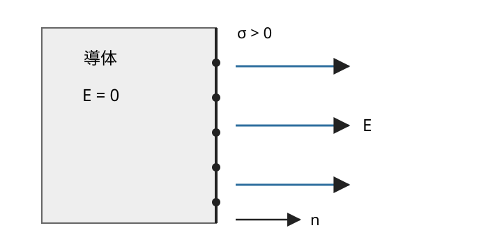
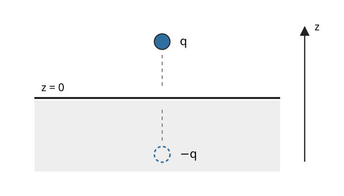

# EMAG4 導体・境界値問題・静電エネルギー

EMAG3 では、電荷分布が分かっていれば Poisson 方程式

$$
-\Delta\phi=\frac{\rho}{\varepsilon_0}
$$

を解き、

$$
E=-\nabla\phi
$$

から電場を復元できるところまで進みました。

しかし、金属板・金属球・電極が現れると、最初から電荷密度 $\rho$ が分かっているとは限りません。むしろ実験では、

- この導体を接地して電位を $0$ にする
- 二枚の電極へ電位差 $V$ を与える
- 導体へ総電荷 $Q$ を与える

という形で条件を与えることが多くなります。

このとき問題は

$$
\text{電荷から場を足し合わせる}
$$

だけではなく、

$$
\text{導体が課す境界条件から電位を決める}
$$

という **境界値問題**へ変わります。

この章では

$$
\boxed{
\text{静電平衡}
\to
\text{導体表面の境界条件}
\to
\text{一意性}
\to
\text{鏡像法}
\to
\text{静電容量}
\to
\text{静電エネルギー}
}
$$

を一続きに学びます。

---

## 1. 導体の静電平衡では何が起きるか

金属のような導体には、物質内部を移動できる電荷があります。

もし導体内部に定常的な非零電場

$$
E\ne0
$$

が残っていれば、自由電荷には

$$
F=qE
$$

が働き、電荷は動き続けます。

したがって「電荷の巨視的な移動が止まった静電平衡」を考えるなら、理想導体の内部では電場が消えていなければなりません。

ここは純粋なベクトル解析の定理ではなく、**自由電荷が動ける導体を静電平衡に置くという物理モデル**から出る条件です。

<!-- formal-statement-start -->
> **命題（導体の静電平衡）**  
> 連結な理想導体が静電平衡にあるとする。導体内部の通常の点では
>
$$
\boxed{
E=0
}
$$
>
> である。したがって
>
$$
\nabla\phi=0
$$
>
> であり、導体内部とその表面は同じ一定電位を持つ。
>
> また導体内部の体積電荷密度は
>
$$
\boxed{
\rho=0
}
$$
>
> であり、余分な自由電荷は導体表面へ移る。
<!-- formal-statement-end -->

### なぜ電位まで一定になるのか

EMAG3 の

$$
E=-\nabla\phi
$$

へ $E=0$ を代入すると

$$
\nabla\phi=0.
$$

連結な導体内部では、任意の二点 $A,B$ を導体内の曲線で結べます。

その曲線に沿って

$$
\phi(B)-\phi(A)
=
-\int_A^B E\cdot d\ell
=
0
$$

なので

$$
\phi(A)=\phi(B).
$$

したがって導体全体は等電位です。

ただし、**互いに離れた二つの導体まで同じ電位になるわけではありません。** それぞれ別の一定電位を持てます。

### なぜ体積電荷が消えるのか

導体内部では $E=0$ です。

Gauss の法則の微分形

$$
\nabla\cdot E
=
\frac{\rho}{\varepsilon_0}
$$

を使うと

$$
0
=
\frac{\rho}{\varepsilon_0}.
$$

よって通常の内部点では

$$
\rho=0.
$$

電荷そのものが消えたのではありません。余分な電荷は、後で見るように表面電荷密度 $\sigma$ として導体表面に現れます。

---

## 2. 導体表面で電場はどちらを向くか

静電平衡では導体内部の電場が 0 です。

一方、導体のすぐ外側には電場が存在できます。

表面上の一点で、導体から真空側へ向く単位法線を $n$ とします。

図では $\sigma>0$ の場合を描いています。負の表面電荷なら電場の向きは反転します。

### 2.1 接線成分は 0

表面をまたぐ細長い長方形の閉曲線を考えます。

静電場では EMAG3 で見たように

$$
\oint E\cdot d\ell=0.
$$

長方形の高さを 0 に近づけると、法線方向の短辺からの寄与は消えます。

表面に沿う二辺だけが残るので

$$
E_{\mathrm{out},t}
-
E_{\mathrm{in},t}
=
0.
$$

導体内部では $E_{\mathrm{in}}=0$ だから

$$
\boxed{
E_{\mathrm{out},t}=0
}.
$$

したがって静電平衡の導体表面では、電場は表面に接して走れません。

もし接線成分があれば、表面電荷が表面に沿って動き続けるからです。

### 2.2 法線成分は表面電荷密度で決まる

次に、表面をまたぐ薄い円柱形の Gauss 面を取ります。

底面積を $\Delta S$ とすると、包む表面電荷は

$$
\sigma\Delta S.
$$

Gauss の法則より

$$
E_{\mathrm{out}}\cdot n\,\Delta S
-
E_{\mathrm{in}}\cdot n\,\Delta S
=
\frac{\sigma\Delta S}{\varepsilon_0}.
$$

$\Delta S$ を消して

$$
(E_{\mathrm{out}}-E_{\mathrm{in}})\cdot n
=
\frac{\sigma}{\varepsilon_0}.
$$

導体内部では $E_{\mathrm{in}}=0$ なので、次を得ます。

<!-- formal-statement-start -->
> **命題（導体表面の静電境界条件）**  
> 静電平衡にある理想導体の表面で、導体から真空側へ向く単位法線を $n$、表面電荷密度を $\sigma$ とする。このとき表面直外では
>
$$
\boxed{
E_{\mathrm{out}}
=
\frac{\sigma}{\varepsilon_0}n
}
$$
>
> が成り立つ。
>
> 特に接線成分は 0 で、電場は導体表面に垂直である。
<!-- formal-statement-end -->

この式は符号付きです。

$\sigma>0$ なら電場は $n$ と同じ向き、$\sigma<0$ なら $n$ と逆向きです。

---

## 3. 導体問題は境界値問題になる

電荷のない真空領域では EMAG3 の Poisson 方程式が

$$
\Delta\phi=0
$$

になります。

導体表面では電位が一定です。

したがって、導体に囲まれた真空領域の静電場は

$$
\boxed{
\Delta\phi=0
\quad\text{in the vacuum region},
\qquad
\phi=\text{指定された値}
\quad\text{on conductor surfaces}
}
$$

という形で求められます。

これは Laplace 方程式の **Dirichlet 境界値問題**です。

たとえば二つの導体を

$$
\phi=0,
\qquad
\phi=V
$$

に保てば、その二つの表面値を満たす調和関数 $\phi$ を探すことになります。

ここで重要なのは、**導体表面の電荷分布を先に知らなくてもよい**ことです。

まず境界値から $\phi$ を求め、

$$
E=-\nabla\phi
$$

を計算し、最後に

$$
\sigma
=
\varepsilon_0 E_{\mathrm{out}}\cdot n
$$

から表面電荷を逆算できます。

---

## 4. 同じ境界条件から二つの静電場は出ない

境界値問題を解くとき、「候補解を一つ見つけた」だけで十分でしょうか。

十分になるためには、その候補以外の解が存在しないこと、つまり **一意性**が必要です。

数学側の一般結果は [PDE6 の Green の第一恒等式による Dirichlet 一意性](../PDE6/index.md#cor-pde6-dirichlet-energy) です。

ここでは静電気に必要な形へ読み替えます。

同じ領域 $\Omega$ で、同じ電荷密度 $\rho$ と同じ境界電位を持つ二つの候補

$$
\phi_1,
\qquad
\phi_2
$$

があると仮定します。

差を

$$
w=\phi_1-\phi_2
$$

と置くと、Poisson 方程式の右辺は打ち消し合うので

$$
\Delta w=0
$$

です。

さらに境界では

$$
w=0.
$$

ここで

$$
\nabla\cdot(w\nabla w)
=
|\nabla w|^2+w\Delta w
$$

を領域全体で積分します。

発散定理を使うと

$$
\int_\Omega |\nabla w|^2\,dV
+
\int_\Omega w\Delta w\,dV
=
\int_{\partial\Omega}
w\,\nabla w\cdot n\,dS.
$$

$\Delta w=0$ かつ境界で $w=0$ なので

$$
\int_\Omega |\nabla w|^2\,dV=0.
$$

被積分関数は非負だから

$$
\nabla w=0.
$$

連結な領域では $w$ は一定です。境界で 0 なので

$$
w=0.
$$

したがって

$$
\boxed{
\phi_1=\phi_2
}
$$

です。

この一意性があるため、**境界条件を満たす巧妙な候補を一つ作れれば、それが物理解である**と言えるようになります。

次の鏡像法はまさにこの考えを使います。

---

## 5. 鏡像法：存在しない電荷で本物の場を作る

無限に広い導体平面

$$
z=0
$$

を接地し、

$$
\phi=0
$$

に保ちます。

その上方

$$
z=a,
\qquad
a>0
$$

に点電荷 $q$ を置きます。

導体表面には複雑な誘導電荷が現れるため、Coulomb の法則で直接足し合わせるのは面倒です。

そこで導体をいったん消し、平面の反対側

$$
z=-a
$$

に仮想的な電荷 $-q$ を置いた候補を考えます。

重要なのは、下側の $-q$ は**実在する電荷ではない**ことです。真空領域 $z>0$ の境界条件を満たす解を構成するための数学的な道具です。

円筒座標の平面からの距離を $\rho$ とすると、$z>0$ で候補電位は

$$
\phi(\rho,z)
=
\frac{q}{4\pi\varepsilon_0}
\left[
\frac{1}{\sqrt{\rho^2+(z-a)^2}}
-
\frac{1}{\sqrt{\rho^2+(z+a)^2}}
\right].
$$

平面上 $z=0$ では二つの分母が等しいので

$$
\phi(\rho,0)=0.
$$

つまり接地条件を満たします。

また $z>0$ では、実電荷 $q$ の位置を除いて Laplace 方程式を満たし、実電荷の位置では正しい Coulomb 特異性を持ちます。

一意性により、この候補は実際の導体問題の電位です。

### 5.1 誘導表面電荷を逆算する

導体から真空側への法線は

$$
n=e_z
$$

です。

表面直上の法線電場は

$$
E_z(\rho,0^+)
=
-\left.
\frac{\partial\phi}{\partial z}
\right|_{z=0^+}.
$$

微分すると

$$
\frac{\partial\phi}{\partial z}
=
\frac{q}{4\pi\varepsilon_0}
\left[
-\frac{z-a}{\{\rho^2+(z-a)^2\}^{3/2}}
+
\frac{z+a}{\{\rho^2+(z+a)^2\}^{3/2}}
\right].
$$

$z=0$ を代入して

$$
\left.
\frac{\partial\phi}{\partial z}
\right|_{0^+}
=
\frac{qa}{2\pi\varepsilon_0(\rho^2+a^2)^{3/2}}.
$$

したがって

$$
E_z(\rho,0^+)
=
-
\frac{qa}{2\pi\varepsilon_0(\rho^2+a^2)^{3/2}}.
$$

境界条件

$$
\sigma=\varepsilon_0 E_z
$$

から

$$
\boxed{
\sigma(\rho)
=
-
\frac{qa}{2\pi(\rho^2+a^2)^{3/2}}
}.
$$

$q>0$ なら導体表面には負の誘導電荷が現れることが式から直接分かります。

---

## 6. 静電容量：電位差を作るのにどれだけ電荷が要るか

二つの導体へそれぞれ

$$
+Q,
\qquad
-Q
$$

を与え、電位差を

$$
V
$$

とします。

真空中の線形な静電気では、導体の形と配置を固定したまま $Q$ を何倍かすると、Poisson/Laplace 方程式の線形性により $V$ も同じ倍率で変わります。

したがって比

$$
\frac{Q}{V}
$$

は $Q$ に依存せず、幾何配置だけで決まります。

この比を静電容量と呼びます。

<!-- formal-statement-start -->
> **定義（静電容量）**  
> 真空中で形と配置を固定した二導体系に電荷 $+Q,-Q$ を与え、その電位差を $V>0$ とする。
>
$$
\boxed{
C=\frac{Q}{V}
}
$$
>
> で定める $C$ をその配置の **静電容量**という。
>
> SI 単位は
>
$$
[C]=\mathrm{C/V}=\mathrm F
$$
>
> であり、$\mathrm F$ は farad である。
<!-- formal-statement-end -->

<!-- definition-example-start: def-emag4-capacitance -->
**定義の確認**

ある配置で

$$
Q=6.0\times10^{-9}\ \mathrm C
$$

を与えたとき

$$
V=3.0\ \mathrm V
$$

になったとします。

すると

$$
C
=
\frac{6.0\times10^{-9}}{3.0}
=
2.0\times10^{-9}\ \mathrm F.
$$

同じ形・同じ配置で電荷を 2 倍にすると、線形性により電位差も 2 倍になるため $C$ は変わりません。
<!-- definition-example-end -->

---

## 7. 平行平板コンデンサー

面積 $A$ の大きな二枚の平板を距離 $d$ だけ離し、端の効果を無視します。

表面電荷密度を

$$
+\sigma,
\qquad
-\sigma
$$

とします。

EMAG2 の無限平面電荷の結果から、一枚の板が作る電場の大きさは

$$
\frac{\sigma}{2\varepsilon_0}.
$$

二枚の板の間では同じ向きに加わるので

$$
E
=
\frac{\sigma}{\varepsilon_0}.
$$

外側では打ち消し合います。

板間で電場は一様だから、電位差は

$$
V=Ed
=
\frac{\sigma d}{\varepsilon_0}.
$$

また

$$
Q=\sigma A.
$$

よって

$$
C=\frac{Q}{V}
=
\frac{\sigma A}{\sigma d/\varepsilon_0}.
$$

したがって

<!-- formal-statement-start -->
> **命題（平行平板コンデンサーの静電容量）**  
> 真空中で面積 $A$ の二枚の平板を距離 $d$ だけ離し、端効果を無視できるとする。このとき
>
$$
\boxed{
C=\frac{\varepsilon_0A}{d}
}
$$
>
> である。
<!-- formal-statement-end -->

面積を大きくすると、同じ電位差でより多くの電荷を保持できるので $C$ は増えます。

距離を大きくすると、同じ電荷でも電位差が大きくなるので $C$ は減ります。

---

## 8. 孤立導体の自己静電容量

二導体がなくても、「無限遠を電位 0」と決めれば、一つの孤立導体について

$$
C=\frac{Q}{\phi_{\mathrm{conductor}}}
$$

を定められます。

半径 $R$ の孤立導体球へ電荷 $Q$ を与えます。

球対称性と Gauss の法則から球外は点電荷と同じで

$$
\phi(r)
=
\frac{Q}{4\pi\varepsilon_0r}.
$$

導体表面では

$$
\phi(R)
=
\frac{Q}{4\pi\varepsilon_0R}.
$$

したがって

<!-- formal-statement-start -->
> **命題（孤立導体球の自己静電容量）**  
> 真空中の半径 $R$ の孤立導体球について、無限遠を電位 0 とすると
>
$$
\boxed{
C=4\pi\varepsilon_0R
}
$$
>
> である。
<!-- formal-statement-end -->

ここでは $C$ が $Q$ に依存せず、球の半径だけで決まることがはっきり見えます。

---

## 9. コンデンサーへ電荷をためる仕事

最初は電荷 0 のコンデンサーへ、少しずつ電荷を移して最終的に $Q$ まで充電します。

途中で蓄えられている電荷を $q$ とすると、そのときの電位差は

$$
V(q)=\frac{q}{C}.
$$

微小電荷 $dq$ を低電位側から高電位側へ移すのに必要な仕事は

$$
dU
=
V(q)\,dq
=
\frac{q}{C}\,dq.
$$

$0$ から $Q$ まで積分すると

$$
U
=
\int_0^Q
\frac{q}{C}\,dq.
$$

したがって

$$
U
=
\frac{1}{C}
\left[
\frac{q^2}{2}
\right]_0^Q
=
\frac{Q^2}{2C}.
$$

$Q=CV$ を使えば次の三つの形が得られます。

<!-- formal-statement-start -->
> **命題（コンデンサーに蓄えられる静電エネルギー）**  
> 静電容量 $C$ のコンデンサーを電荷 $Q$、電位差 $V$ まで準静的に充電したとき、蓄えられる静電エネルギーは
>
$$
\boxed{
U
=
\frac{Q^2}{2C}
=
\frac12QV
=
\frac12CV^2
}
$$
>
> である。
<!-- formal-statement-end -->

係数 $1/2$ は「最初から最終電位差 $V$ に逆らって全電荷を運ぶ」のではなく、電位差が 0 から徐々に増えることから生じます。

---

## 10. エネルギーは電場そのものに蓄えられる

平行平板コンデンサーでは

$$
C=\frac{\varepsilon_0A}{d},
\qquad
V=Ed.
$$

これを

$$
U=\frac12CV^2
$$

へ代入すると

$$
U
=
\frac12
\frac{\varepsilon_0A}{d}
(E d)^2.
$$

したがって

$$
U
=
\frac{\varepsilon_0}{2}E^2Ad.
$$

板間の体積は

$$
Ad
$$

なので、単位体積あたりでは

$$
\boxed{
u_E
=
\frac{\varepsilon_0}{2}|E|^2
}
$$

となります。

これは平行平板だけの偶然ではありません。

滑らかで局在した電荷分布についても、EMAG3 の

$$
\rho=-\varepsilon_0\Delta\phi
$$

を使えば

$$
U
=
\frac12\int_{\mathbb R^3}\rho\phi\,dV
$$

から電場エネルギーへ移れます。

まず

$$
U
=
-\frac{\varepsilon_0}{2}
\int_{\mathbb R^3}
\phi\Delta\phi\,dV.
$$

積の微分則より

$$
\nabla\cdot(\phi\nabla\phi)
=
|\nabla\phi|^2
+
\phi\Delta\phi.
$$

したがって

$$
-\phi\Delta\phi
=
|\nabla\phi|^2
-
\nabla\cdot(\phi\nabla\phi).
$$

十分遠方で境界項が消える条件の下では、発散定理により

$$
U
=
\frac{\varepsilon_0}{2}
\int_{\mathbb R^3}
|\nabla\phi|^2\,dV.
$$

$E=-\nabla\phi$ なので

<!-- formal-statement-start -->
> **命題（静電場のエネルギー）**  
> 境界項が無限遠で消える十分滑らかで局在した静電場について
>
$$
\boxed{
U
=
\frac{\varepsilon_0}{2}
\int_{\mathbb R^3}|E|^2\,dV
}
$$
>
> である。したがって真空中の静電場のエネルギー密度は
>
$$
\boxed{
u_E=\frac{\varepsilon_0}{2}|E|^2
}
$$
>
> と読める。
<!-- formal-statement-end -->

点電荷を数学的な点として扱うと、電荷自身の近くで $|E|^2$ が強く発散し、自己エネルギー積分も発散します。

したがって、この式を点電荷へ使うときは

- 異なる電荷同士の相互作用エネルギー
- 有限サイズの電荷分布
- 自己エネルギーを除いた差

のどれを議論しているかを区別する必要があります。

---

## 11. 一意性の威力：空洞の中はどうなるか

導体内部に空洞があり、その空洞の中に電荷がないとします。

導体は等電位なので、空洞の境界も一定値

$$
\phi=\phi_0
$$

です。

空洞内には電荷がないため

$$
\Delta\phi=0.
$$

定数関数

$$
\phi(x)=\phi_0
$$

はこの方程式と境界条件を満たします。

一意性により、これ以外の解はありません。

したがって空洞内では

$$
\boxed{
\phi=\phi_0,
\qquad
E=0
}.
$$

これは静電遮蔽の最も基本的な形です。

ただし、空洞の中に電荷を置けば事情は変わり、空洞内壁に誘導電荷が現れます。

---

# 演習

## Level A

### A1. 導体内部の三つの結論

連結な理想導体が静電平衡にある。

1. 導体内部で $E=0$ でなければならない理由を説明せよ。
2. $E=0$ から導体が等電位であることを示せ。
3. Gauss の法則の微分形から、通常の内部点で $\rho=0$ を示せ。

- Level: A

<!-- solution-start -->
#### 詳細解答

静電平衡とは、導体内の自由電荷の巨視的な移動が止まった状態です。

もし内部に

$$
E\ne0
$$

が残っていれば、自由電荷 $q$ には

$$
F=qE
$$

が働き、電荷は移動し続けます。

これは静電平衡に反するので

$$
\boxed{
E=0
}
$$

でなければなりません。

次に EMAG3 の関係

$$
E=-\nabla\phi
$$

へ $E=0$ を代入すると

$$
\nabla\phi=0.
$$

導体内の任意の二点 $A,B$ を結ぶ曲線に沿って

$$
\phi(B)-\phi(A)
=
-\int_A^B E\cdot d\ell
=
0.
$$

よって

$$
\boxed{
\phi(A)=\phi(B)
}
$$

であり、連結な導体全体は等電位です。

さらに Gauss の法則の微分形

$$
\nabla\cdot E
=
\frac{\rho}{\varepsilon_0}
$$

へ $E=0$ を代入すると

$$
0
=
\frac{\rho}{\varepsilon_0}.
$$

したがって

$$
\boxed{
\rho=0
}
$$

です。
<!-- solution-end -->

### A2. 表面電荷密度から電場を求める

静電平衡にある導体表面のある点で、表面電荷密度が

$$
\sigma=4.0\times10^{-8}\ \mathrm{C/m^2}
$$

である。

導体から真空側へ向く単位法線を $n$ とする。

1. 表面直外の電場を $\varepsilon_0$ を用いて表せ。
2. 電場の接線成分を答えよ。
3. $\sigma$ が負なら向きがどう変わるか説明せよ。

- Level: A

<!-- solution-start -->
#### 詳細解答

導体表面の境界条件は

$$
E_{\mathrm{out}}
=
\frac{\sigma}{\varepsilon_0}n
$$

です。

したがって

$$
\boxed{
E_{\mathrm{out}}
=
\frac{4.0\times10^{-8}}{\varepsilon_0}n
\ \mathrm{N/C}
}.
$$

静電平衡では表面の接線成分は

$$
\boxed{
E_t=0
}
$$

です。

$\sigma<0$ なら係数 $\sigma/\varepsilon_0$ が負になるため、電場は $n$ と逆向き、つまり真空側から導体表面へ向きます。
<!-- solution-end -->

### A3. 平行平板コンデンサー

真空中で、面積

$$
A=2.0\times10^{-2}\ \mathrm{m^2}
$$

の平板二枚を

$$
d=1.0\times10^{-3}\ \mathrm m
$$

だけ離す。端効果を無視する。

1. 静電容量 $C$ を求めよ。
2. 電位差を $V=5.0\ \mathrm V$ としたときの電荷の大きさ $Q$ を求めよ。
3. 板間電場の大きさを求めよ。

- Level: A

<!-- solution-start -->
#### 詳細解答

平行平板コンデンサーの静電容量は

$$
C
=
\frac{\varepsilon_0A}{d}.
$$

与えられた値を代入すると

$$
C
=
\varepsilon_0
\frac{2.0\times10^{-2}}{1.0\times10^{-3}}
=
20\varepsilon_0.
$$

したがって

$$
\boxed{
C=20\varepsilon_0\ \mathrm F
}.
$$

電荷は

$$
Q=CV
$$

なので

$$
Q
=
(20\varepsilon_0)(5.0)
=
\boxed{
100\varepsilon_0\ \mathrm C
}.
$$

板間電場は一様で

$$
V=Ed
$$

だから

$$
E
=
\frac{V}{d}
=
\frac{5.0}{1.0\times10^{-3}}.
$$

よって

$$
\boxed{
E=5.0\times10^3\ \mathrm{V/m}
}.
$$
<!-- solution-end -->

### A4. コンデンサーのエネルギー

静電容量

$$
C=4.0\ \mu\mathrm F
$$

のコンデンサーを

$$
V=12\ \mathrm V
$$

まで充電する。

1. 電荷 $Q$ を求めよ。
2. 蓄えられるエネルギー $U$ を求めよ。
3. 同じ $C$ で電位差だけを 2 倍にすると $U$ は何倍になるか。

- Level: A

<!-- solution-start -->
#### 詳細解答

まず

$$
Q=CV.
$$

したがって

$$
Q
=
(4.0\times10^{-6})(12)
=
\boxed{
4.8\times10^{-5}\ \mathrm C
}.
$$

エネルギーは

$$
U=\frac12CV^2.
$$

よって

$$
U
=
\frac12
(4.0\times10^{-6})
(12)^2.
$$

$12^2=144$ なので

$$
U
=
2.0\times10^{-6}\times144
=
\boxed{
2.88\times10^{-4}\ \mathrm J
}.
$$

$U$ は $V^2$ に比例するので、$V$ を 2 倍にすると

$$
U'
=
\frac12C(2V)^2
=
4U.
$$

したがって

$$
\boxed{
4\text{倍}
}
$$

です。
<!-- solution-end -->

## Level B

### B1. 孤立導体球の静電容量

半径 $R$ の孤立導体球へ電荷 $Q$ を与え、無限遠で $\phi=0$ とする。

1. 球外の電位 $\phi(r)$ を求めよ。
2. 導体の電位 $\phi(R)$ を求めよ。
3. $C=Q/\phi(R)$ から自己静電容量を導け。
4. 半径を 2 倍にすると静電容量は何倍になるか。

- Level: B

<!-- solution-start -->
#### 詳細解答

球外では球対称性と Gauss の法則により、電場は中心に点電荷 $Q$ がある場合と同じです。

したがって EMAG3 の点電荷の電位から

$$
\phi(r)
=
\boxed{
\frac{Q}{4\pi\varepsilon_0r}
},
\qquad
r\ge R.
$$

導体は等電位なので、その値は表面値

$$
\phi(R)
=
\frac{Q}{4\pi\varepsilon_0R}
$$

です。

自己静電容量は

$$
C
=
\frac{Q}{\phi(R)}
=
\frac{Q}{Q/(4\pi\varepsilon_0R)}.
$$

$Q$ を約分して

$$
\boxed{
C=4\pi\varepsilon_0R
}.
$$

よって $C$ は $R$ に比例します。

$R$ を 2 倍にすると

$$
\boxed{
C\text{ は }2\text{倍}
}
$$

です。
<!-- solution-end -->

### B2. 鏡像電荷の候補が境界条件を満たすことを確かめる

接地された無限導体平面を $z=0$ とし、実電荷 $q$ を $(0,0,a)$ に置く。

候補電位

$$
\phi(x,y,z)
=
\frac{q}{4\pi\varepsilon_0}
\left[
\frac{1}{\sqrt{x^2+y^2+(z-a)^2}}
-
\frac{1}{\sqrt{x^2+y^2+(z+a)^2}}
\right]
$$

を考える。

1. $z=0$ で $\phi=0$ になることを示せ。
2. 二項目を作る $-q$ が物理的な実電荷ではないことを説明せよ。
3. なぜ境界条件を満たす候補を一つ見つけるだけでよいのか、一意性を使って説明せよ。

- Level: B

<!-- solution-start -->
#### 詳細解答

$z=0$ を代入すると、第一項の分母は

$$
\sqrt{x^2+y^2+a^2}
$$

です。

第二項の分母も

$$
\sqrt{x^2+y^2+a^2}
$$

です。

したがって二項はちょうど打ち消し合い、

$$
\boxed{
\phi(x,y,0)=0
}.
$$

下側の $-q$ は、実際の導体内部に置かれた電荷ではありません。

実際の問題では $z\le0$ は導体であり、表面には連続的な誘導表面電荷が現れます。

$-q$ は、真空領域 $z>0$ で正しい Poisson/Laplace 方程式と境界条件を同時に満たす電位を作るための数学的補助です。

最後に、同じ実電荷 $q$ と同じ境界値 $\phi=0$ を持つ二つの解があれば、その差は

$$
\Delta w=0,
\qquad
w|_{z=0}=0
$$

を満たします。

一意性により差は 0 です。

したがって候補電位が方程式と境界条件を満たすことを確認できれば

$$
\boxed{
\text{その候補が実際の電位である}
}
$$

と言えます。
<!-- solution-end -->

### B3. 電荷のない導体空洞

静電平衡にある導体内部に閉じた空洞がある。空洞内には電荷がない。導体の電位を $\phi_0$ とする。

1. 空洞内部で満たす微分方程式を書け。
2. 空洞境界の電位を書け。
3. 定数関数 $\phi=\phi_0$ が解であることを確認せよ。
4. 一意性から空洞内の電場を求めよ。

- Level: B

<!-- solution-start -->
#### 詳細解答

空洞内には電荷がないので Poisson 方程式は

$$
\boxed{
\Delta\phi=0
}
$$

となります。

空洞の壁は導体の一部です。

導体は等電位だから、境界では

$$
\boxed{
\phi=\phi_0
}
$$

です。

定数関数

$$
\phi(x)=\phi_0
$$

について

$$
\nabla\phi=0,
\qquad
\Delta\phi=0
$$

なので、微分方程式を満たします。

また境界値も $\phi_0$ なので境界条件を満たします。

Dirichlet 問題の一意性により、この解以外はありません。

したがって空洞内では

$$
\phi=\phi_0
$$

であり、

$$
E=-\nabla\phi=0.
$$

よって

$$
\boxed{
E=0
}
$$

です。
<!-- solution-end -->

## Level C

### C1. 接地導体平面と点電荷：鏡像法から誘導電荷と力まで

接地された無限導体平面を $z=0$ とし、点電荷 $q>0$ を

$$
(0,0,a),
\qquad
a>0
$$

に置く。

真空領域 $z>0$ だけを物理領域とする。

1. 鏡像電荷を用いて電位 $\phi(\rho,z)$ を構成せよ。
2. $z=0$ で $\phi=0$ を確認せよ。
3. 表面直上の法線電場 $E_z(\rho,0^+)$ を求めよ。
4. 誘導表面電荷密度 $\sigma(\rho)$ を求めよ。
5. 全誘導電荷が $-q$ になることを示せ。
6. 実電荷 $q$ に働く力を求めよ。

- Level: C

<!-- solution-start -->
#### 詳細解答

鏡像法では、実電荷 $q$ の鏡像位置

$$
(0,0,-a)
$$

に仮想電荷 $-q$ を置きます。

円筒座標で平面内の距離を $\rho$ とすると、実電荷までの距離は

$$
R_+
=
\sqrt{\rho^2+(z-a)^2},
$$

鏡像電荷までの距離は

$$
R_-
=
\sqrt{\rho^2+(z+a)^2}.
$$

したがって候補電位は

$$
\boxed{
\phi(\rho,z)
=
\frac{q}{4\pi\varepsilon_0}
\left(
\frac1{R_+}
-
\frac1{R_-}
\right)
}.
$$

$z=0$ では

$$
R_+=R_-=\sqrt{\rho^2+a^2}.
$$

よって

$$
\boxed{
\phi(\rho,0)=0
}
$$

であり、接地条件を満たします。

次に $z$ で微分します。

まず

$$
\frac{\partial}{\partial z}\frac1{R_+}
=
-\frac{z-a}{R_+^3},
$$

また

$$
\frac{\partial}{\partial z}
\left(
-\frac1{R_-}
\right)
=
\frac{z+a}{R_-^3}.
$$

したがって

$$
\frac{\partial\phi}{\partial z}
=
\frac{q}{4\pi\varepsilon_0}
\left(
-\frac{z-a}{R_+^3}
+
\frac{z+a}{R_-^3}
\right).
$$

$z=0^+$ では

$$
R_+=R_-=\sqrt{\rho^2+a^2}
$$

なので

$$
\left.
\frac{\partial\phi}{\partial z}
\right|_{0^+}
=
\frac{q}{4\pi\varepsilon_0}
\frac{2a}{(\rho^2+a^2)^{3/2}}.
$$

電場は

$$
E_z
=
-\frac{\partial\phi}{\partial z}
$$

だから

$$
\boxed{
E_z(\rho,0^+)
=
-
\frac{qa}{2\pi\varepsilon_0(\rho^2+a^2)^{3/2}}
}.
$$

導体から真空側への法線は $+e_z$ です。

したがって

$$
\sigma(\rho)
=
\varepsilon_0E_z(\rho,0^+)
$$

より

$$
\boxed{
\sigma(\rho)
=
-
\frac{qa}{2\pi(\rho^2+a^2)^{3/2}}
}.
$$

全誘導電荷は平面上で積分します。

面積要素は

$$
dS
=
2\pi\rho\,d\rho
$$

なので

$$
Q_{\mathrm{ind}}
=
\int_0^\infty
\sigma(\rho)
2\pi\rho\,d\rho.
$$

$\sigma$ を代入すると

$$
Q_{\mathrm{ind}}
=
-qa
\int_0^\infty
\frac{\rho}{(\rho^2+a^2)^{3/2}}\,d\rho.
$$

ここで

$$
u=\rho^2+a^2,
\qquad
du=2\rho\,d\rho
$$

と置くと

$$
\int_0^\infty
\frac{\rho}{(\rho^2+a^2)^{3/2}}\,d\rho
=
\frac12
\int_{a^2}^{\infty}
u^{-3/2}\,du.
$$

積分して

$$
\frac12
\left[
-2u^{-1/2}
\right]_{a^2}^{\infty}
=
\frac1a.
$$

したがって

$$
\boxed{
Q_{\mathrm{ind}}=-q
}.
$$

最後に実電荷に働く力を求めます。

真空領域の実電荷が感じる導体由来の電場は、鏡像電荷 $-q$ が実電荷位置に作る電場と同じです。

二電荷間の距離は

$$
2a.
$$

したがって Coulomb 力の大きさは

$$
\frac{1}{4\pi\varepsilon_0}
\frac{q^2}{(2a)^2}
=
\frac{q^2}{16\pi\varepsilon_0a^2}.
$$

異符号なので向きは導体平面へ向かう $-e_z$ 方向です。

よって

$$
\boxed{
F
=
-
\frac{q^2}{16\pi\varepsilon_0a^2}e_z
}.
$$

ここで鏡像電荷を「実在する相互作用相手」と解釈してはいけません。

鏡像電荷は真空側の電位を再現する補助構成であり、その結果として得られる電場を使って実電荷への力を計算しています。
<!-- solution-end -->

---

## 12. 章末チェック

- 理想導体の静電平衡で $E=0$ になる理由を物理モデルとして説明できる。
- $E=0$ から導体が等電位になることを線積分で示せる。
- Gauss の法則から導体内部の体積電荷密度が 0 になることを説明できる。
- 導体表面で電場の接線成分が 0、法線成分が $\sigma/\varepsilon_0$ になることを導ける。
- 導体を含む静電問題を Laplace / Poisson 方程式の境界値問題として書ける。
- 同じ電荷密度と同じ Dirichlet 境界値を持つ電位が一意である理由を、差 $w$ のエネルギー積分から追える。
- 接地平面の鏡像法で、仮想電荷が実在する電荷ではないことを説明できる。
- 静電容量 $C=Q/V$ の意味と単位を説明できる。
- 平行平板コンデンサーの $C=\varepsilon_0A/d$ と孤立導体球の $C=4\pi\varepsilon_0R$ を導ける。
- $U=Q^2/(2C)=QV/2=CV^2/2$ を充電仕事から導ける。
- 真空中の静電場エネルギー密度 $u_E=\varepsilon_0|E|^2/2$ を説明できる。
- 電荷のない導体空洞で $E=0$ になることを一意性から説明できる。

次の EMAG5 では、静止した電荷から離れ、電荷の流れである電流と、それが作る磁場へ進みます。
