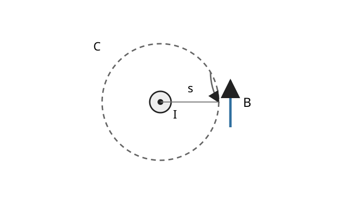

# EMAG5 電流・磁場・Ampère の法則

EMAG1--EMAG4 では、静止した電荷から出発して、電場、電位、導体、境界値問題、静電エネルギーまでを組み立てました。

ここからは電荷が動きます。電荷が流れると、静電場だけでは記述できない新しい場である磁場が現れます。本章の中心となる問いは次の三つです。

- ある面をどれだけの電荷が通過しているかを、局所的な量でどう表すか。
- 定常的に動く電荷が、空間の各点にどのような磁場を作るか。
- 電荷の流れと磁場の関係を、積分法則と局所的な微分式の両方でどう読むか。

真空中の SI 単位系を使い、磁束密度を $B$、真空の透磁率を $\mu_0$ と書きます。$B$ の SI 単位はテスラ（T）です。

電荷保存を扱う前半では、電荷の密度と局所的な流れは時間変化してよいものとします。一方、後半の磁場計算では、時間に依存しない **磁静場**を扱います。時間変化する場合に必要な補正項は章末で必要性だけ確認し、EMAG7 で Maxwell 方程式として本格的に扱います。

---

## 1. 電流は「電荷が面を横切る速さ」

導線の中で電荷が動いているとき、「電荷が動いている」と言うだけでは流れの強さを比較できません。

向き付けられた面 $S$ を考え、その単位法線を $n$ とします。$n$ の向きへ通過する正味の電荷を正として数えます。

例えば、短い時間 $\Delta t$ の間に

- $n$ の向きへ $6\ \mathrm C$
- $-n$ の向きへ $1\ \mathrm C$

の電荷が通過したなら、正味の通過電荷は

$$
\Delta Q=6-1=5\ \mathrm C
$$

です。

時間間隔を小さくした極限で、単位時間あたりの正味の通過電荷を考えます。

<!-- formal-statement-start -->
> **定義（電流）**  
> 向き付けられた面を時刻 $t$ の近くで横切る正味の電荷を $Q_{\mathrm{cross}}(t)$ とする。法線の正向きに通過する電荷を正、逆向きを負として、
>
$$
\boxed{
I(t)
=
\frac{dQ_{\mathrm{cross}}}{dt}
}
$$
>
> を、その面を正向きに通る **電流**と呼ぶ。SI 単位はアンペア（A）であり、
>
$$
1\ \mathrm A
=
1\ \mathrm{C/s}
$$
>
> である。
<!-- formal-statement-end -->

<!-- definition-example-start: def-emag5-current -->
### 例：正向きと逆向きの通過を差し引く

**定義の確認**

$\Delta t=2\ \mathrm s$ の間に正向きへ $6\ \mathrm C$、逆向きへ $1\ \mathrm C$ が通過し、その間の電流を一定と近似します。

正味の通過電荷は

$$
\Delta Q=5\ \mathrm C
$$

なので、

$$
I
=
\frac{\Delta Q}{\Delta t}
=
\frac{5}{2}
=
2.5\ \mathrm A.
$$

面の向きを逆にすれば同じ物理的な流れに対して符号が反転し、

$$
I'=-2.5\ \mathrm A
$$

となります。電流の符号は、どちら向きを正と決めたかを含んでいます。
<!-- definition-example-end -->

### 1.1 面のどこを流れているかまで記録する

電流 $I$ は面全体を通る流れを一つの数にまとめています。

しかし太い導体では、断面の中央と端で流れの強さが違うことがあります。そこで各点で「どちら向きへ、単位面積あたりどれだけ電荷が流れているか」をベクトルとして記録します。

<!-- formal-statement-start -->
> **定義（電流密度）**  
> 各時刻・各点で定まるベクトル場 $J(t,x)$ が、任意の向き付けられた面 $S$ を通る電流を
>
$$
\boxed{
I_S(t)
=
\int_S
J(t,x)\cdot n\,dS
}
$$
>
> によって与えるとき、$J$ を **電流密度**と呼ぶ。SI 単位は $\mathrm{A/m^2}$ である。
<!-- formal-statement-end -->

<!-- definition-example-start: def-emag5-current-density -->
### 例：一様な円形断面

**定義の確認**

半径 $a$ の円形断面を持つ導体が $z$ 軸方向に伸び、断面内で

$$
J=J_0e_z,
\qquad
J_0>0
$$

が一定だとします。

断面の法線を $n=e_z$ と取れば

$$
J\cdot n=J_0.
$$

したがって

$$
\begin{aligned}
I
&=
\int_S J\cdot n\,dS\\
&=
J_0\int_S dS\\
&=
J_0\pi a^2.
\end{aligned}
$$

よって

$$
\boxed{
I=J_0\pi a^2
}.
$$

法線を $-e_z$ に反転すれば $J\cdot n=-J_0$ となり、電流の符号も反転します。これで「向き」と「面を通る総量」が定義式の中で同時に確認できます。
<!-- definition-example-end -->

### 1.2 電荷を運ぶ粒子から $J$ を読む

数密度を $n_c$、各担体の電荷を $q$、平均のドリフト速度を $v_d$ とします。

単位体積に含まれる電荷は

$$
n_cq
$$

なので、電荷流は

$$
\boxed{
J=n_cqv_d
}
$$

と書けます。

電子では $q<0$ です。そのため電子のドリフト速度と、慣習的に正電荷の流れる向きとして定義する電流密度の向きは反対になります。

---

## 2. 電荷保存から連続の式へ

EMAG1 では電荷保存を物理原理として置きました。今度は電流密度を使って、その原理を空間の各点で成り立つ式へ変えます。

固定された体積 $\Omega$ に含まれる総電荷を

$$
Q_\Omega(t)
=
\int_\Omega
\rho(t,x)\,dV
$$

とします。

境界 $\partial\Omega$ の外向き単位法線を $n$ とすると、単位時間に外へ流出する電荷は

$$
\int_{\partial\Omega}
J\cdot n\,dS
$$

です。

外へ正味の電荷が流れれば、内部の総電荷はその分だけ減ります。したがって積分形の電荷保存は

$$
\frac{d}{dt}
\int_\Omega \rho\,dV
=
-
\int_{\partial\Omega}
J\cdot n\,dS
$$

です。

<!-- formal-statement-start -->
> **命題（電荷保存の連続の式）**  
> 固定された任意の有界領域 $\Omega$ について電荷保存
>
$$
\frac{d}{dt}
\int_\Omega \rho\,dV
=
-
\int_{\partial\Omega}
J\cdot n\,dS
$$
>
> が成り立つとする。$\rho$ は時間について $C^1$ 級、$J$ は空間について $C^1$ 級で、時間微分と体積積分を交換できるとする。このとき各点で
>
$$
\boxed{
\partial_t\rho+\nabla\cdot J=0
}
$$
>
> が成り立つ。
<!-- formal-statement-end -->

### 証明の見取り図

左辺の時間微分を体積積分の中へ入れ、右辺へ [Gauss--Ostrogradsky の発散定理](../VC4/index.md#thm-vc4-gauss-divergence)を使います。すると任意の体積 $\Omega$ 上で

$$
\int_\Omega
(\partial_t\rho+\nabla\cdot J)\,dV
=
0
$$

となるため、被積分関数自身が各点で 0 でなければなりません。

<!-- proof-start -->
### 証明

固定領域 $\Omega$ なので、仮定した正則性の下で

$$
\frac{d}{dt}
\int_\Omega\rho(t,x)\,dV
=
\int_\Omega
\partial_t\rho(t,x)\,dV.
$$

一方、[Gauss--Ostrogradsky の発散定理](../VC4/index.md#thm-vc4-gauss-divergence)から

$$
\int_{\partial\Omega}
J\cdot n\,dS
=
\int_\Omega
\nabla\cdot J\,dV.
$$

これらを積分形の電荷保存へ代入すると

$$
\int_\Omega
\partial_t\rho\,dV
=
-
\int_\Omega
\nabla\cdot J\,dV.
$$

従って

$$
\int_\Omega
\left(
\partial_t\rho+\nabla\cdot J
\right)dV
=
0.
$$

この式が任意の十分小さい領域 $\Omega$ について成り立ち、被積分関数は連続です。

もしある点 $x_0$ で

$$
\partial_t\rho+\nabla\cdot J>0
$$

なら、連続性により $x_0$ の十分小さい近傍でも正のままとなり、その近傍上の積分は正になります。これは上式に反します。

負の場合も同様です。従って各点で

$$
\partial_t\rho+\nabla\cdot J=0.
$$
<!-- proof-end -->

この式は、$\nabla\cdot J>0$ の場所では周囲へ正味の電荷が流出するため、

$$
\partial_t\rho<0
$$

となることを表しています。

### 2.1 直接確認できる例

定数 $\alpha$ に対して

$$
J(t,x,y,z)
=
(\alpha x,0,0),
$$

$$
\rho(t,x,y,z)
=
\rho_0-\alpha t
$$

とします。物理的な電荷密度として読むなら、考える時間範囲を $\rho\ge0$ の範囲に限ります。

まず

$$
\partial_t\rho=-\alpha.
$$

また

$$
\nabla\cdot J
=
\frac{\partial}{\partial x}(\alpha x)
=
\alpha.
$$

したがって

$$
\partial_t\rho+\nabla\cdot J
=
-\alpha+\alpha
=
0.
$$

$\alpha>0$ なら右へ行くほど $x$ 方向の電流が強くなり、局所的には流出超過です。その分だけ電荷密度が時間とともに減っています。

### 2.2 定常電流では $\nabla\cdot J=0$

電荷密度が時間に依存しないなら

$$
\partial_t\rho=0.
$$

連続の式から

$$
\boxed{
\nabla\cdot J=0
}
$$

です。

この式には重要な帰結があります。

同じ閉曲線 $C$ を境界に持つ二つの曲面 $S_1,S_2$ を考えます。向きを、$S_1$ と向きを反転した $S_2$ を合わせると閉曲面になるように取ります。

二面で囲まれる体積を $V$ とすると

$$
\begin{aligned}
\int_{S_1}J\cdot n_1\,dS
-
\int_{S_2}J\cdot n_2\,dS
&=
\int_{\partial V}J\cdot n\,dS\\
&=
\int_V\nabla\cdot J\,dV\\
&=
0.
\end{aligned}
$$

従って

$$
\boxed{
\int_{S_1}J\cdot n_1\,dS
=
\int_{S_2}J\cdot n_2\,dS
}.
$$

定常電流では、同じ境界を張るどの曲面を使っても「貫く電流」が一致します。後で磁場の循環と結び付けるときにも、この面の取り替え可能性が重要になります。

---

## 3. 定常電流が作る磁場：Biot--Savart の法則

静電場では、点電荷が作る Coulomb 場を足し合わせて一般の電荷分布の電場を作りました。

磁静場でも似た発想を使います。ただし源は電荷密度そのものではなく **電流**であり、場の向きは源から放射状ではありません。電流方向と観測点への方向の両方から、ベクトル積で決まります。

観測点を $r$、源点を $r'$ とし、

$$
R=r-r'
$$

と書きます。

<!-- formal-statement-start -->
> **原理（Biot--Savart の法則）**  
> 真空中で十分滑らかかつ局在した時間に依存しない電流密度 $J(r')$ が作る磁場は
>
$$
\boxed{
B(r)
=
\frac{\mu_0}{4\pi}
\int_{\mathbb R^3}
\frac{
J(r')\times(r-r')
}{
|r-r'|^3
}
\,dV'
}
$$
>
> で与えられる。
>
> 細い導線に電流 $I$ が流れる理想化では、導線上の有向線素を $d\ell'$ として
>
$$
\boxed{
B(r)
=
\frac{\mu_0 I}{4\pi}
\int
\frac{
d\ell'\times(r-r')
}{
|r-r'|^3
}
}
$$
>
> と書ける。
<!-- formal-statement-end -->

この式では、ベクトル積の順序が向きを決めます。

$$
d\ell'\times R
$$

なので、電流方向を反転すれば磁場の向きも反転します。

[Biot--Savart の法則](#principle-emag5-biot-savart)は、数学上の恒等関係だけから導かれるものではなく、磁静場を記述する物理原理です。

---

## 4. 無限直線電流の磁場を積分で導く

$z$ 軸に沿って $+z$ 方向へ一定電流 $I$ が流れる無限直線導線を考えます。

観測点を $x$ 軸上の

$$
r=s e_x,
\qquad
s>0
$$

に取ります。

源点は

$$
r'=z'e_z,
$$

線素は

$$
d\ell'=dz'e_z
$$

です。

観測点へのベクトルは

$$
R
=
r-r'
=
s e_x-z'e_z.
$$

ベクトル積を先に計算すると

$$
\begin{aligned}
d\ell'\times R
&=
dz'e_z\times
(s e_x-z'e_z)\\
&=
s\,dz'
(e_z\times e_x)
-
z'\,dz'
(e_z\times e_z)\\
&=
s\,dz'e_y.
\end{aligned}
$$

従って Biot--Savart の法則は

$$
B(s e_x)
=
\frac{\mu_0I}{4\pi}
e_y
\int_{-\infty}^{\infty}
\frac{s\,dz'}{(s^2+z'^2)^{3/2}}.
$$

ここで

$$
\frac{d}{dz'}
\left(
\frac{z'}{s\sqrt{s^2+z'^2}}
\right)
=
\frac{s}{(s^2+z'^2)^{3/2}}
$$

なので、

$$
\begin{aligned}
\int_{-\infty}^{\infty}
\frac{s\,dz'}{(s^2+z'^2)^{3/2}}
&=
\left[
\frac{z'}{s\sqrt{s^2+z'^2}}
\right]_{-\infty}^{\infty}\\
&=
\frac1s-\left(-\frac1s\right)\\
&=
\frac2s.
\end{aligned}
$$

よって

$$
B(s e_x)
=
\frac{\mu_0I}{2\pi s}e_y.
$$

$z$ 軸まわりの回転対称性から、一般の方位では磁場は半径一定の円に接する方向を向きます。この右ねじ向きの単位接線ベクトルを $e_\varphi$ と書きます。

<!-- formal-statement-start -->
> **命題（無限直線電流の磁場）**  
> 真空中の $z$ 軸に沿って $+z$ 方向へ定常電流 $I$ が流れる無限直線導線を考える。導線からの距離を $s>0$ とすると、磁場は
>
$$
\boxed{
B(s)
=
\frac{\mu_0I}{2\pi s}e_\varphi
}
$$
>
> である。$e_\varphi$ は $+z$ 方向の電流に対する右ねじの向きの円周接線単位ベクトルである。
<!-- formal-statement-end -->

図は導線を上から見たものです。中央の点は電流が紙面の手前へ流れることを表し、破線円 $C$ は導線を中心とする半径 $s$ の経路です。磁場 $B$ は円周の接線方向を向きます。電流を紙面奥向きへ反転すれば、磁場の向きも反転します。

---

## 5. 対称性が高ければ磁場の循環を使う

Biot--Savart の法則は一般的ですが、直線電流のたびに無限積分を計算するのは大変です。

高い対称性がある場合には、磁場の **循環**を電流へ直接結ぶ方が速く計算できます。

向き付けられた曲面 $S$ の境界を

$$
C=\partial S
$$

とし、$C$ の向きは $S$ の法線と右ねじで整合する向きを取ります。

[VC9 の Ampère--Maxwell の法則](../VC9/index.md#principle-vc9-maxwell-integral)は

$$
\oint_C B\cdot d\ell
=
\mu_0\int_SJ\cdot n\,dS
+
\mu_0\varepsilon_0
\frac{d}{dt}
\int_SE\cdot n\,dS
$$

です。

磁静場では場が時間に依存しないので

$$
\frac{d}{dt}
\int_SE\cdot n\,dS
=
0.
$$

したがって Ampère--Maxwell の法則は

$$
\boxed{
\oint_C
B\cdot d\ell
=
\mu_0
\int_S
J\cdot n\,dS
}
$$

へ特殊化されます。右辺を貫く電流

$$
I_{\mathrm{enc}}
:=
\int_SJ\cdot n\,dS
$$

で書けば

$$
\boxed{
\oint_C B\cdot d\ell
=
\mu_0I_{\mathrm{enc}}
}
$$

です。本章ではこの磁静場での特殊化を、対称性の高い具体計算に使います。

これは [VC9 の Ampère--Maxwell の法則](../VC9/index.md#principle-vc9-maxwell-integral)を、電場が時間変化しない磁静場へ特殊化した形です。

### 5.1 無限直線電流を一行ずつ追う

前節と同じ無限直線電流を考え、半径 $s$ の円 $C$ を取ります。

回転対称性から、円周上で

- $B$ は接線方向
- $|B|$ は一定

です。

従って

$$
B\cdot d\ell
=
B(s)\,d\ell.
$$

円周全体で積分すると

$$
\begin{aligned}
\oint_C
B\cdot d\ell
&=
B(s)
\oint_C d\ell\\
&=
B(s)\,2\pi s.
\end{aligned}
$$

一方、円が囲む電流は $I$ です。

[Ampère--Maxwell の法則](../VC9/index.md#principle-vc9-maxwell-integral)の磁静場での特殊化から

$$
B(s)\,2\pi s
=
\mu_0I.
$$

したがって

$$
\boxed{
B(s)
=
\frac{\mu_0I}{2\pi s}
}.
$$

Biot--Savart の積分と同じ結果が、対称性を使うことで大幅に短く得られました。

### 5.2 局所形は $\nabla\times B=\mu_0J$

この磁静場の積分式の左辺へ [Kelvin--Stokes の定理](../VC5/index.md#thm-vc5-stokes)を使うと

$$
\oint_C B\cdot d\ell
=
\int_S
(\nabla\times B)\cdot n\,dS.
$$

従って

$$
\int_S
(\nabla\times B)\cdot n\,dS
=
\mu_0
\int_S
J\cdot n\,dS.
$$

移項すると

$$
\int_S
(\nabla\times B-\mu_0J)\cdot n\,dS
=
0.
$$

これが任意の十分小さい向き付けられた曲面 $S$ について成り立つなら、

$$
\boxed{
\nabla\times B
=
\mu_0J
}
$$

です。

積分形と微分形を結ぶ数学自体は [VC9 の Maxwell 方程式の積分形と微分形](../VC9/index.md#thm-vc9-maxwell-differential)で証明済みです。本章では、それを磁静場の具体計算へ使っています。

### 5.3 一様な電流密度を持つ円柱導体

半径 $a$ の無限円柱導体に、$+z$ 方向へ総電流 $I$ が断面内で一様に流れるとします。

電流密度の大きさは

$$
J_0
=
\frac{I}{\pi a^2}.
$$

軸から距離 $s$ の円形 Ampère 経路を取ります。

#### 導体内部 $0<s<a$

経路が囲む断面積は $\pi s^2$ なので、

$$
\begin{aligned}
I_{\mathrm{enc}}
&=
J_0\pi s^2\\
&=
\frac{I}{\pi a^2}\pi s^2\\
&=
I\frac{s^2}{a^2}.
\end{aligned}
$$

従って

$$
B(s)\,2\pi s
=
\mu_0I\frac{s^2}{a^2}.
$$

$s>0$ で割ると

$$
\boxed{
B(s)
=
\frac{\mu_0I}{2\pi a^2}s
},
\qquad
0<s<a.
$$

内部では中心から離れるにつれて磁場が線形に増えます。

#### 導体外部 $s\ge a$

経路が囲む全電流は $I$ なので

$$
\boxed{
B(s)
=
\frac{\mu_0I}{2\pi s}
},
\qquad
s\ge a.
$$

$s=a$ では両式とも

$$
\frac{\mu_0I}{2\pi a}
$$

となり、磁場は連続につながります。

---

## 6. 磁場には電荷のような源項がない

電場に対する Gauss の法則では、

$$
\nabla\cdot E
=
\frac{\rho}{\varepsilon_0}
$$

となり、電荷密度 $\rho$ が発散の源になりました。

一方、[VC9 の磁束に対する Gauss の法則](../VC9/index.md#principle-vc9-maxwell-integral)は、任意の閉曲面 $\partial\Omega$ について

$$
\boxed{
\int_{\partial\Omega}
B\cdot n\,dS
=
0
}
$$

と述べます。

さらに [VC9 の積分形と微分形の同値](../VC9/index.md#thm-vc9-maxwell-differential)から

$$
\boxed{
\nabla\cdot B=0
}
$$

です。

これは「磁場が 0」という意味ではありません。

例えば無限直線電流の磁場は明らかに非零ですが、磁場は導線の周囲を円周方向に回るので、閉曲面から正味に湧き出しません。

古典的 Maxwell 方程式では、電荷に対応する孤立した磁気的な源項は置かれていません。そのため磁力線は電気力線のように正電荷から始まり負電荷で終わるのではなく、閉じるか、無限遠まで続く形になります。

---

## 7. 磁場を回転として表す：ベクトルポテンシャル

$\nabla\cdot B=0$ という構造を見ると、VC5 で学んだ [ベクトルポテンシャル](../VC5/index.md#def-vc5-vector-potential)が使えます。

すなわち、適切な領域と正則性の下で

$$
\boxed{
B=\nabla\times A
}
$$

と表します。

ここで $A$ は新しい磁場そのものではありません。同じ $B$ を与える $A$ は一般に一つに決まりません。

### 7.1 Biot--Savart の法則を生む $A$

局在した定常電流密度に対して

$$
A(r)
=
\frac{\mu_0}{4\pi}
\int_{\mathbb R^3}
\frac{J(r')}{|r-r'|}
\,dV'
$$

と置きます。

$r'$ は積分変数なので、$r$ について回転を取ると

$$
\nabla_r\times A(r)
=
\frac{\mu_0}{4\pi}
\int
\nabla_r
\left(
\frac1{|r-r'|}
\right)
\times J(r')
\,dV'.
$$

ここで

$$
\nabla_r
\left(
\frac1{|r-r'|}
\right)
=
-
\frac{r-r'}{|r-r'|^3}.
$$

従って

$$
\nabla_r\times A(r)
=
-
\frac{\mu_0}{4\pi}
\int
\frac{(r-r')\times J(r')}
{|r-r'|^3}
\,dV'.
$$

ベクトル積の反交換性

$$
a\times b=-b\times a
$$

を使えば

$$
\nabla_r\times A(r)
=
\frac{\mu_0}{4\pi}
\int
\frac{J(r')\times(r-r')}
{|r-r'|^3}
\,dV'.
$$

右辺は Biot--Savart の法則そのものです。

したがって

$$
\boxed{
B=\nabla\times A
}
$$

を具体的な積分表示から確認できました。

### 7.2 ゲージ自由度

[VC5 のベクトルポテンシャルのゲージ自由度](../VC5/index.md#prop-vc5-vector-potential-gauge)から、任意の十分滑らかなスカラー関数 $\chi$ に対し

$$
A'
=
A+\nabla\chi
$$

としても

$$
\nabla\times A'
=
\nabla\times A
$$

です。

一様磁場

$$
B=B_0e_z
$$

を例に、実際に確認します。

まず

$$
A_1
=
\frac{B_0}{2}
(-y,x,0)
$$

とすると

$$
\nabla\times A_1
=
(0,0,B_0).
$$

一方

$$
A_2
=
(0,B_0x,0)
$$

でも

$$
\nabla\times A_2
=
(0,0,B_0).
$$

二つの差は

$$
A_2-A_1
=
\left(
\frac{B_0y}{2},
\frac{B_0x}{2},
0
\right).
$$

ここで

$$
\chi
=
\frac{B_0xy}{2}
$$

と置けば

$$
\nabla\chi
=
\left(
\frac{B_0y}{2},
\frac{B_0x}{2},
0
\right).
$$

従って

$$
\boxed{
A_2=A_1+\nabla\chi
}
$$

です。

なお、一様磁場は無限遠で減衰しないので、上の局在電流に対する積分表示の仮定には入りません。ここではゲージ自由度そのものを手計算で確認する局所的な例として使っています。

---

## 8. なぜ時間変化する場では磁静場の式を直す必要があるか

磁静場では

$$
\nabla\times B
=
\mu_0J
$$

でした。

両辺の発散を取ると、[回転の発散は 0](../VC1/index.md#thm-vc1-div-curl)なので

$$
0
=
\mu_0\nabla\cdot J.
$$

従って磁静場では

$$
\nabla\cdot J=0
$$

が必要です。これは定常電流の連続の式と一致しています。

しかし時間変化する電荷密度では、

$$
\partial_t\rho+\nabla\cdot J=0
$$

なので、一般には

$$
\nabla\cdot J
=
-\partial_t\rho
\ne0
$$

となり得ます。

つまり

$$
\nabla\times B=\mu_0J
$$

だけを時間変化する問題へそのまま使うと、電荷保存と両立しません。

[VC9 の Ampère--Maxwell の法則](../VC9/index.md#thm-vc9-maxwell-differential)では、右辺に

$$
\mu_0\varepsilon_0\partial_tE
$$

が加わり、

$$
\nabla\times B
=
\mu_0J
+
\mu_0\varepsilon_0\partial_tE
$$

となります。

両辺の発散を取ると

$$
0
=
\mu_0\nabla\cdot J
+
\mu_0\varepsilon_0
\partial_t(\nabla\cdot E).
$$

Gauss の法則

$$
\nabla\cdot E
=
\frac{\rho}{\varepsilon_0}
$$

を代入すると

$$
\begin{aligned}
0
&=
\mu_0\nabla\cdot J
+
\mu_0\varepsilon_0
\partial_t
\left(
\frac{\rho}{\varepsilon_0}
\right)\\
&=
\mu_0
\left(
\nabla\cdot J+\partial_t\rho
\right).
\end{aligned}
$$

これはちょうど連続の式です。

したがって変位電流項は、単なる付け足しではなく、**時間変化する電磁場と電荷保存を両立させるために必要な項**です。

EMAG7 では Faraday の法則と合わせ、四つの Maxwell 方程式を一つの体系として読み直します。

---

# 演習

## Level A

### A1. 一様電流密度と断面電流

半径 $a$ の円形断面 $S$ を持つ導体に

$$
J=J_0e_z,
\qquad
J_0>0
$$

という一様な電流密度が流れている。断面の単位法線を $n=e_z$ とする。

1. 断面を通る電流 $I$ を求めよ。
2. 面の向きを $n=-e_z$ に反転したときの電流を求めよ。
3. $J_0$ の SI 単位から、得られた $I$ の単位が A になることを確認せよ。

- Level: A

<!-- solution-start -->
#### 詳細解答

電流密度から電流を求める定義は

$$
I
=
\int_S
J\cdot n\,dS
$$

です。

$n=e_z$ なので

$$
J\cdot n
=
J_0e_z\cdot e_z
=
J_0.
$$

従って

$$
\begin{aligned}
I
&=
\int_SJ_0\,dS\\
&=
J_0\,\operatorname{Area}(S)\\
&=
J_0\pi a^2.
\end{aligned}
$$

よって

$$
\boxed{
I=J_0\pi a^2
}.
$$

面の向きを反転して $n=-e_z$ とすると

$$
J\cdot n
=
-J_0
$$

なので

$$
\boxed{
I'=-J_0\pi a^2=-I
}.
$$

最後に

$$
[J_0]
=
\mathrm{A/m^2},
\qquad
[a^2]
=
\mathrm{m^2}
$$

だから

$$
[I]
=
\mathrm{A/m^2}\cdot\mathrm{m^2}
=
\boxed{\mathrm A}.
$$
<!-- solution-end -->

### A2. 連続の式を直接確認する

定数 $\alpha$ と $\rho_0$ に対して

$$
J(t,x,y,z)
=
(\alpha x,0,0),
$$

$$
\rho(t,x,y,z)
=
\rho_0-\alpha t
$$

とする。

1. $\partial_t\rho$ を求めよ。
2. $\nabla\cdot J$ を求めよ。
3. 連続の式を確認せよ。
4. $\alpha>0$ のとき、$\nabla\cdot J>0$ と $\partial_t\rho<0$ の物理的意味を説明せよ。

- Level: A

<!-- solution-start -->
#### 詳細解答

まず

$$
\rho=\rho_0-\alpha t
$$

なので

$$
\boxed{
\partial_t\rho=-\alpha
}.
$$

次に

$$
J=(\alpha x,0,0)
$$

だから

$$
\begin{aligned}
\nabla\cdot J
&=
\frac{\partial}{\partial x}(\alpha x)
+
\frac{\partial}{\partial y}(0)
+
\frac{\partial}{\partial z}(0)\\
&=
\boxed{\alpha}.
\end{aligned}
$$

従って

$$
\partial_t\rho+\nabla\cdot J
=
-\alpha+\alpha
=
\boxed{0}.
$$

連続の式が確かに成り立ちます。

$\alpha>0$ なら

$$
\nabla\cdot J>0
$$

は、十分小さい領域から外へ流れ出る電荷が流れ込む電荷より多いことを表します。

その差を補うために

$$
\partial_t\rho<0
$$

となり、局所的な電荷密度が時間とともに減少します。
<!-- solution-end -->

### A3. Biot--Savart の向き

$z$ 軸上の原点付近にある微小電流要素を

$$
d\ell'=dz'\,e_z,
\qquad
dz'>0
$$

とする。

観測点を

$$
r=s e_x,
\qquad
s>0
$$

とし、源点を原点 $r'=0$ とする。

1. $R=r-r'$ を求めよ。
2. $d\ell'\times R$ を求めよ。
3. この電流要素が観測点に作る磁場の向きを答えよ。
4. 電流方向を反転すると磁場の向きがどう変わるか説明せよ。

- Level: A

<!-- solution-start -->
#### 詳細解答

源点は原点なので

$$
R
=
r-r'
=
s e_x.
$$

従って

$$
\begin{aligned}
d\ell'\times R
&=
dz'e_z\times s e_x\\
&=
s\,dz'
(e_z\times e_x)\\
&=
\boxed{
s\,dz'e_y
}.
\end{aligned}
$$

Biot--Savart の法則では、このベクトル積の向きが磁場寄与の向きです。

したがって観測点では

$$
\boxed{
+e_y\text{ 方向}
}
$$

です。

電流を反転すると $d\ell'$ が $-d\ell'$ へ変わるため、

$$
(-d\ell')\times R
=
-(d\ell'\times R).
$$

従って磁場も

$$
\boxed{
-e_y\text{ 方向へ反転する}
}
$$

ことが分かります。
<!-- solution-end -->

### A4. 磁場の循環から無限直線電流を求める

$z$ 軸に沿って $+z$ 方向へ定常電流 $I>0$ が流れる無限直線導線を考える。

導線から距離 $s>0$ の円形経路 $C$ を用いる。

1. 対称性から、$C$ 上で磁場の向きと大きさがどのようになるか述べよ。
2. $\oint_C B\cdot d\ell$ を $B(s)$ で表せ。
3. 上で得た磁静場の循環式から $B(s)$ を求めよ。
4. 磁場の向きを答えよ。

- Level: A

<!-- solution-start -->
#### 詳細解答

無限直線導線は $z$ 軸まわりの回転に対して同じ形を保ちます。

したがって、軸から同じ距離 $s$ にある点では磁場の大きさは同じです。また磁場は軸を中心とする円の接線方向を向きます。

従って円形経路 $C$ 上で

$$
B\cdot d\ell
=
B(s)\,d\ell.
$$

よって

$$
\begin{aligned}
\oint_C
B\cdot d\ell
&=
B(s)
\oint_C d\ell\\
&=
B(s)\,2\pi s.
\end{aligned}
$$

$C$ が囲む電流は $I$ なので [Ampère--Maxwell の法則](../VC9/index.md#principle-vc9-maxwell-integral)の磁静場での特殊化より

$$
B(s)\,2\pi s
=
\mu_0I.
$$

従って

$$
\boxed{
B(s)
=
\frac{\mu_0I}{2\pi s}
}.
$$

向きは $+z$ 方向の電流に対する右ねじ方向、すなわち

$$
\boxed{
e_\varphi\text{ 方向}
}
$$

です。
<!-- solution-end -->

## Level B

### B1. 定常電流では貫く面を取り替えられる

時間に依存しない電流密度 $J$ が

$$
\nabla\cdot J=0
$$

を満たすとする。

同じ閉曲線 $C$ を境界に持つ二つの向き付けられた曲面 $S_1,S_2$ を取り、境界 $C$ 上で誘導される向きが一致するようにする。

1. $S_1$ と向きを反転した $S_2$ を合わせると閉曲面になることを使い、両面を通る電流が等しいことを示せ。
2. この結論が $\nabla\cdot J\ne0$ の時間依存問題では一般に成立しない理由を連続の式から説明せよ。

- Level: B

<!-- solution-start -->
#### 詳細解答

$S_1$ と $S_2$ に囲まれる体積を $V$ とします。

境界 $C$ 上で両面が同じ向きを誘導するようにしているので、閉曲面 $\partial V$ を作るときには $S_2$ 側の法線を反転します。

従って

$$
\int_{\partial V}
J\cdot n\,dS
=
\int_{S_1}
J\cdot n_1\,dS
-
\int_{S_2}
J\cdot n_2\,dS.
$$

[Gauss--Ostrogradsky の発散定理](../VC4/index.md#thm-vc4-gauss-divergence)から

$
\int_{\partial V}
J\cdot n\,dS
=
\int_V
\nabla\cdot J\,dV.
$$

仮定より $\nabla\cdot J=0$ なので

$$
\int_V\nabla\cdot J\,dV=0.
$$

したがって

$$
\int_{S_1}
J\cdot n_1\,dS
-
\int_{S_2}
J\cdot n_2\,dS
=
0.
$$

よって

$$
\boxed{
\int_{S_1}
J\cdot n_1\,dS
=
\int_{S_2}
J\cdot n_2\,dS
}.
$$

時間依存する場合、連続の式は

$$
\nabla\cdot J
=
-\partial_t\rho
$$

です。

もし $S_1,S_2$ の間の体積で電荷密度が変化していれば、

$$
\int_V\nabla\cdot J\,dV
=
-
\frac{d}{dt}
\int_V\rho\,dV
$$

は一般に 0 ではありません。

そのため二つの面を貫く伝導電流が違ってよく、その差が領域内の電荷蓄積率に対応します。
<!-- solution-end -->

### B2. 一様電流を持つ円柱導体の内外磁場

半径 $a$ の無限円柱導体に、$+z$ 方向へ総電流 $I>0$ が流れている。電流密度は断面内で一様とする。

1. 電流密度の大きさ $J_0$ を求めよ。
2. 軸からの距離 $0<s<a$ で、Ampère 経路が囲む電流 $I_{\mathrm{enc}}(s)$ を求めよ。
3. 導体内部の磁場 $B(s)$ を求めよ。
4. 導体外部 $s\ge a$ の磁場を求めよ。
5. $s=a$ で両式が連続につながることを確認し、磁場の大きさが最大になる位置を答えよ。

- Level: B

<!-- solution-start -->
#### 詳細解答

断面積は $\pi a^2$ です。

電流密度が一様なので

$$
I
=
J_0\pi a^2.
$$

従って

$$
\boxed{
J_0
=
\frac{I}{\pi a^2}
}.
$$

$0<s<a$ の円形 Ampère 経路が囲む面積は $\pi s^2$ です。

よって

$$
\begin{aligned}
I_{\mathrm{enc}}(s)
&=
J_0\pi s^2\\
&=
\frac{I}{\pi a^2}\pi s^2\\
&=
\boxed{
I\frac{s^2}{a^2}
}.
\end{aligned}
$$

回転対称性から円周上で磁場は接線方向を向き、大きさは一定です。

したがって磁静場の循環式は

$$
B(s)\,2\pi s
=
\mu_0I\frac{s^2}{a^2}.
$$

$s>0$ で割って

$$
\boxed{
B(s)
=
\frac{\mu_0I}{2\pi a^2}s
},
\qquad
0<s<a.
$$

一方 $s\ge a$ では全電流 $I$ を囲むので

$$
B(s)\,2\pi s
=
\mu_0I.
$$

従って

$$
\boxed{
B(s)
=
\frac{\mu_0I}{2\pi s}
},
\qquad
s\ge a.
$$

$s=a$ で内部式は

$$
\frac{\mu_0I}{2\pi a^2}a
=
\frac{\mu_0I}{2\pi a}.
$$

外部式も

$$
\frac{\mu_0I}{2\pi a}.
$$

よって連続です。

内部では $B(s)$ は $s$ に比例して増加し、外部では $1/s$ に比例して減少します。

したがって最大値は表面

$$
\boxed{s=a}
$$

で取り、

$$
\boxed{
B_{\max}
=
\frac{\mu_0I}{2\pi a}
}
$$

です。
<!-- solution-end -->

### B3. 同じ一様磁場を表す二つのベクトルポテンシャル

定数 $B_0$ に対し、

$$
A_1
=
\frac{B_0}{2}(-y,x,0),
$$

$$
A_2
=
(0,B_0x,0)
$$

とする。

1. $\nabla\times A_1$ を計算せよ。
2. $\nabla\times A_2$ を計算せよ。
3. $A_2-A_1$ を求めよ。
4. 適切なスカラー関数 $\chi$ を見つけ、
   $$
   A_2-A_1=\nabla\chi
   $$
   を示せ。
5. この計算がゲージ自由度をどう表しているか説明せよ。

- Level: B

<!-- solution-start -->
#### 詳細解答

まず

$$
A_1
=
\left(
-\frac{B_0y}{2},
\frac{B_0x}{2},
0
\right).
$$

回転の第3成分は

$$
\frac{\partial}{\partial x}
\left(
\frac{B_0x}{2}
\right)
-
\frac{\partial}{\partial y}
\left(
-\frac{B_0y}{2}
\right)
=
\frac{B_0}{2}
+
\frac{B_0}{2}
=
B_0.
$$

他の二成分は 0 なので

$$
\boxed{
\nabla\times A_1
=
(0,0,B_0)
}.
$$

次に

$$
A_2=(0,B_0x,0)
$$

だから

$$
\nabla\times A_2
=
\left(
0,0,
\frac{\partial(B_0x)}{\partial x}
\right)
=
\boxed{
(0,0,B_0)
}.
$$

従って二つは同じ磁場を表します。

差を取ると

$$
\begin{aligned}
A_2-A_1
&=
\left(
0+\frac{B_0y}{2},
B_0x-\frac{B_0x}{2},
0
\right)\\
&=
\boxed{
\left(
\frac{B_0y}{2},
\frac{B_0x}{2},
0
\right)
}.
\end{aligned}
$$

ここで

$$
\chi
=
\frac{B_0xy}{2}
$$

と置くと

$$
\nabla\chi
=
\left(
\frac{B_0y}{2},
\frac{B_0x}{2},
0
\right).
$$

従って

$$
\boxed{
A_2-A_1=\nabla\chi
}.
$$

つまり

$$
A_2=A_1+\nabla\chi.
$$

勾配の回転は 0 なので、ベクトルポテンシャルへ勾配を足しても磁場は変わりません。

この例は

$$
\boxed{
\text{異なる }A\text{ が同じ }B\text{ を表し得る}
}
$$

というゲージ自由度を具体的に示しています。
<!-- solution-end -->

## Level C

### C1. 同軸ケーブルの磁場を領域ごとに求める

無限に長い同軸ケーブルを考える。

内側導体は半径 $a$ の円柱で、$+z$ 方向へ総電流 $I>0$ が断面内で一様に流れている。

半径 $b>a$ の位置に、厚さを無視できる円筒状の外側導体があり、そこを $-z$ 方向へ総電流 $I$ が表面電流として流れている。

軸からの距離を $s$ とする。

1. $0<s<a$ で囲まれる電流を求め、磁場を求めよ。
2. $a<s<b$ で磁場を求めよ。
3. $s>b$ で磁場を求めよ。
4. $s=a$ で磁場が連続であることを確認せよ。
5. $s=b$ では理想化した表面電流のため接線磁場が跳ぶことを確認せよ。
6. ケーブルと同軸な有限長の閉円柱面を考え、その閉曲面を貫く磁束が 0 であることを直接確認せよ。
7. 外側導体の $-I$ が「戻り電流」として必要なことを、定常電流と電荷保存の観点から説明せよ。

- Level: C

<!-- solution-start -->
#### 詳細解答

内側導体の電流密度は一様なので、その大きさは

$$
J_0
=
\frac{I}{\pi a^2}.
$$

### 1. $0<s<a$

半径 $s$ の Ampère 円が内側導体内で囲む断面積は

$$
\pi s^2.
$$

従って

$$
\begin{aligned}
I_{\mathrm{enc}}
&=
J_0\pi s^2\\
&=
\frac{I}{\pi a^2}\pi s^2\\
&=
I\frac{s^2}{a^2}.
\end{aligned}
$$

円周上で磁場は $e_\varphi$ 方向、大きさは一定なので

$$
B(s)\,2\pi s
=
\mu_0I\frac{s^2}{a^2}.
$$

したがって

$$
\boxed{
B(s)
=
\frac{\mu_0I}{2\pi a^2}s\,e_\varphi
},
\qquad
0<s<a.
$$

### 2. $a<s<b$

この領域の Ampère 円は内側導体の全電流 $+I$ を囲みますが、まだ外側導体の戻り電流は囲みません。

従って

$$
I_{\mathrm{enc}}=I.
$$

よって

$$
B(s)\,2\pi s
=
\mu_0I
$$

から

$$
\boxed{
B(s)
=
\frac{\mu_0I}{2\pi s}e_\varphi
},
\qquad
a<s<b.
$$

### 3. $s>b$

この Ampère 円は

- 内側導体の $+I$
- 外側導体の $-I$

の両方を囲みます。

従って

$$
I_{\mathrm{enc}}
=
I-I
=
0.
$$

[Ampère--Maxwell の法則](../VC9/index.md#principle-vc9-maxwell-integral)の磁静場での特殊化から

$$
B(s)\,2\pi s=0.
$$

$s>0$ なので

$$
\boxed{
B(s)=0
},
\qquad
s>b.
$$

### 4. $s=a$ の連続性

内側から $s=a$ へ近づけると

$$
B(a^-)
=
\frac{\mu_0I}{2\pi a^2}a\,e_\varphi
=
\frac{\mu_0I}{2\pi a}e_\varphi.
$$

外側の中間領域から近づけると

$$
B(a^+)
=
\frac{\mu_0I}{2\pi a}e_\varphi.
$$

したがって

$$
\boxed{
B(a^-)=B(a^+)
}.
$$

内側導体の電流密度は有限の体積密度であり、$s=a$ に表面電流を追加していないため、ここでは接線磁場は連続につながります。

### 5. $s=b$ の跳び

内側からは

$$
B(b^-)
=
\frac{\mu_0I}{2\pi b}e_\varphi.
$$

外側では

$$
B(b^+)=0.
$$

従って

$$
\boxed{
B(b^+)-B(b^-)
=
-
\frac{\mu_0I}{2\pi b}e_\varphi
}.
$$

外側導体を厚さ 0 の表面電流として理想化したため、磁場の接線成分に有限の跳びが現れます。

### 6. 閉円柱面を貫く磁束

ケーブルと同軸な半径 $R$、長さ $L$ の閉円柱面を考えます。

磁場は存在する領域では常に

$$
B=B_\varphi e_\varphi
$$

という方位角方向です。

円柱の側面の法線は半径方向 $e_s$ なので

$$
B\cdot e_s=0.
$$

上下面の法線は $\pm e_z$ なので

$$
B\cdot(\pm e_z)=0.
$$

従って閉曲面のどの部分でも

$$
B\cdot n=0.
$$

したがって

$$
\boxed{
\int_{\partial\Omega}
B\cdot n\,dS
=
0
}.
$$

磁場が $a<s<b$ で非零でも、閉曲面から正味に湧き出していないことが直接確認できました。

### 7. 戻り電流と電荷保存

定常電流では

$$
\nabla\cdot J=0
$$

でなければなりません。

もし内側導体の $+I$ がどこかで終わり、戻る経路がなければ、その終端では流入する電荷が流出できず、電荷が蓄積します。

すると

$$
\partial_t\rho\ne0
$$

となり、もはや定常ではありません。

同軸ケーブルでは外側導体の $-I$ が戻り電流となり、回路全体として電荷が循環できます。

また $s>b$ の Ampère 経路で

$$
I_{\mathrm{enc}}=I-I=0
$$

となるため、理想的な無限同軸系では外部磁場も

$$
\boxed{B=0}
$$

になります。

この一問で、電流密度、連続の式、磁場の循環、磁束に対する Gauss の法則が同じ物理像へつながりました。
<!-- solution-end -->

---

## 9. 章末チェック

- 面の向きを含めて電流の符号を説明できる。
- 電流密度 $J$ から $I=\int_SJ\cdot n\,dS$ を計算できる。
- 担体の数密度・電荷・ドリフト速度から $J=n_cqv_d$ を読める。
- 時間に依存しない領域での電荷保存から $\partial_t\rho+\nabla\cdot J=0$ を途中式付きで導ける。
- 定常電流で $\nabla\cdot J=0$ となり、同じ境界を持つ面を貫く電流が一致することを示せる。
- Biot--Savart の法則で、源点・観測点・ベクトル積の向きを区別できる。
- 無限直線電流の $B=\mu_0I/(2\pi s)e_\varphi$ を積分から導ける。
- Ampère--Maxwell の法則を磁静場へ特殊化し、対称性と組み合わせて使える。
- 一様電流を持つ円柱導体の内外磁場を求められる。
- 磁束に対する Gauss の法則と $\nabla\cdot B=0$ が「$B=0$」を意味しないことを説明できる。
- VC5 のベクトルポテンシャルを磁場へ適用し、ゲージ変換で $B$ が不変であることを確認できる。
- 時間変化する場では $\nabla\times B=\mu_0J$ だけでは電荷保存と両立せず、Ampère--Maxwell の変位電流項が必要になる理由を説明できる。

次の EMAG6 では、ここで得た磁場を「何が作るか」から「荷電粒子にどのような力を及ぼすか」へ視点を移し、Lorentz 力と電磁場中の粒子運動へ進みます。
