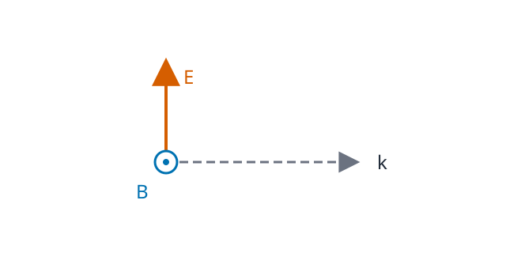

# EMAG8 電磁波とエネルギー

EMAG7 で Maxwell 方程式は、電荷・電流から生じる場だけでなく、時間変化する電場と磁場が互いに結び付くことを示しました。ここで新しい疑問が生まれます。**電荷も電流もない真空の領域へ出た場は、そこで消えるのでしょうか。** もし消えないなら、どの速さで、何を運ぶのでしょうか。

本章では SI 単位系を用い、空間座標を $x=(x_1,x_2,x_3)\in\mathbb R^3$、時刻を $t$ とします。電場 $E(t,x)$（V/m）、磁場 $B(t,x)$（T）、真空の誘電率 $\varepsilon_0>0$、透磁率 $\mu_0>0$ を用います。場には以下の微分と積分が許されるだけの滑らかさを仮定します。特に初めの計算は、自由電荷密度と電流密度がともに 0 の開領域で行います。

「電磁波」という名前を出発点にせず、Maxwell 方程式から波が許されることを導き、平面波で向きと強さを検算し、最後にエネルギーの保存を読み解きます。

---

## 1. 源がなくても電磁場が伝わる

電荷密度 $\rho=0$、電流密度 $J=0$ の真空中では、[EMAG7 の Maxwell 方程式](../EMAG7/index.md) は

$$
\begin{aligned}
\nabla\cdot E&=0,&\nabla\cdot B&=0,\\
\nabla\times E&=-\partial_t B,&
\nabla\times B&=\mu_0\varepsilon_0\partial_t E
\end{aligned}
$$

となります。発散の式は場が存在しないという意味ではありません。例えば一定の電場は発散 0 ですが、零ではありません。では時間変化はどうでしょうか。

### 1.1 回転をもう一度取る理由

Faraday 則は $E$ の空間的な回転を $B$ の時間変化へ、Ampère--Maxwell 則は $B$ の回転を $E$ の時間変化へ移します。片方をもう一度回転すると、もう片方を消去できます。$\nabla\times(\nabla\times F)=\nabla(\nabla\cdot F)-\Delta F$ を、$F=E$ に対して用います。$E$ が空間二階・時間二階まで滑らかなので偏微分を交換でき、

$$
\begin{aligned}
\nabla\times(\nabla\times E)
&=-\nabla\times(\partial_tB)\\
&=-\partial_t(\nabla\times B)\\
&=-\mu_0\varepsilon_0\partial_t^2E.
\end{aligned}
$$

他方、$\nabla\cdot E=0$ だから左辺は $\nabla(0)-\Delta E=-\Delta E$ です。よって

$$
\boxed{\Delta E-\mu_0\varepsilon_0\partial_t^2E=0}.
$$

同じく磁場に対して、

$$
\begin{aligned}
\nabla\times(\nabla\times B)
&=\mu_0\varepsilon_0\nabla\times(\partial_tE)\\
&=\mu_0\varepsilon_0\partial_t(\nabla\times E)\\
&=-\mu_0\varepsilon_0\partial_t^2B,
\end{aligned}
$$

であり、$\nabla\cdot B=0$ を使うと

$$
\boxed{\Delta B-\mu_0\varepsilon_0\partial_t^2B=0}
$$

を得ます。$\Delta=\partial_{x_1}^2+\partial_{x_2}^2+\partial_{x_3}^2$ は各成分へ作用する Laplace 作用素です。

ここで波動方程式の速度に相当する定数を定めます。

<!-- formal-statement-start -->
> **定義（真空中の電磁波の速度）**  
> 真空の定数 $\varepsilon_0>0,\mu_0>0$ を与えたとき、
>
$$
\boxed{c=\frac1{\sqrt{\mu_0\varepsilon_0}}}
$$
>
> と定める。単位は m/s である。真空中で電荷・電流が存在しない Maxwell 方程式の滑らかな解の各成分は、速度 $c$ の波動方程式 $\partial_t^2F=c^2\Delta F$ を満たす。
<!-- formal-statement-end -->

<!-- definition-example-start: def-emag8-wave-speed -->
### 例：進行する形を代入する

**定義の確認**として、滑らかな関数 $f$ について $F(t,x)=f(x_1-ct)$ を考えます。$s=x_1-ct$ と置くと連鎖律より

$$
\partial_tF=-cf'(s),\quad
\partial_t^2F=c^2f''(s),\quad
\Delta F=f''(s).
$$

従って $\partial_t^2F=c^2\Delta F$ です。$x_1-ct$ が一定になる位置は時間とともに $+x_1$ 方向へ $c$ の速さで進みます。$f$ は波形の例であり、**この一つのスカラー解だけで Maxwell 方程式のすべてを満たすとはまだ言えません**。次節で $E$ と $B$ の組を作ります。
<!-- definition-example-end -->

### 1.2 光速との一致と、逆が成り立たない理由

Maxwell 方程式が予言する伝播速度 $c$ は真空中の光速に一致します。現在の SI では真空光速の数値は $299\,792\,458\ \mathrm{m/s}$ と正確に定義されます。電磁気学の理論が光と結び付く重要な接点です。

ただし導出の論理は一方向です。**Maxwell 方程式の解なら、各成分は波動方程式を満たす**のであって、波動方程式の任意の独立な解 $E,B$ が Maxwell 方程式を満たすわけではありません。発散と回転の条件が、電場と磁場の向き・振幅・位相をさらに制限します。この違いは波動方程式だけを解くと見落としやすい点です。

---

## 2. 平面波で電場と磁場を同時に作る

進む方向に垂直な面で波形が同じになる理想化を考えます。波数ベクトル $k\in\mathbb R^3\setminus\{0\}$ は進む方向を指定し、$\omega>0$ は角振動数です。$\theta=k\cdot x-\omega t$ が一定の面は、$\omega/|k|$ の速さで $k$ の向きに移動します。波形 $f$ に対して

$$
E(t,x)=E_0f(\theta),\qquad
B(t,x)=B_0f(\theta)
$$

という形を試します。ここで $E_0,B_0\in\mathbb R^3$ は一定ベクトル、$f\in C^2(\mathbb R)$ は定数ではない関数です。同じ位相の波形を両場に仮定しており、一般の全電磁場がこの形とは限りません。

<!-- formal-statement-start -->
> **定義（同位相の平面電磁波）**  
> $k\in\mathbb R^3\setminus\{0\}$、$\omega>0$、定数ベクトル $E_0,B_0\in\mathbb R^3$、定数でない $f\in C^2(\mathbb R)$ を与える。$\theta=k\cdot x-\omega t$ として
>
$$
E(t,x)=E_0f(\theta),\qquad B(t,x)=B_0f(\theta)
$$
>
> が全時空 $(t,x)\in\mathbb R\times\mathbb R^3$ で真空・無源の Maxwell 方程式を満たすとき、この組を同位相の平面電磁波と呼ぶ。$E_0\ne0$ の場合を非自明な電場を持つ平面波と呼ぶ。
<!-- formal-statement-end -->

<!-- definition-example-start: def-emag8-plane-wave -->
### 例：$x_1$ 方向に進む波

**定義の確認**として、四つの Maxwell 方程式を直接調べます。

$E_*>0$、$k_*>0$ として $k=k_*e_1$、$\omega=ck_*$ とし、

$$
E=E_*\cos(k_*x_1-\omega t)e_2,\qquad
B=\frac{E_*}{c}\cos(k_*x_1-\omega t)e_3
$$

を置きます。$\nabla\cdot E=\partial_{x_2}E_2=0$、$\nabla\cdot B=\partial_{x_3}B_3=0$ です。$E$ の回転は

$$
\nabla\times E=(0,0,-k_*E_*\sin\theta),
$$

一方、$-\partial_tB=(0,0,-(\omega/c)E_*\sin\theta)$ で、$\omega=ck_*$ より一致します。また

$$
\nabla\times B=(0,k_*E_*\sin\theta/c,0)
$$

と $\mu_0\varepsilon_0\partial_tE=(0,\omega E_*\sin\theta/c^2,0)$ は、$\mu_0\varepsilon_0=c^{-2}$ を使うと一致します。これで**四つの Maxwell 方程式をすべて直接確認**できました。
<!-- definition-example-end -->

### 2.1 向きと振幅は Maxwell 方程式が決める

定義の平面波へ微分を実行します。連鎖律から

$$
\nabla\cdot E=(k\cdot E_0)f'(\theta),\qquad
\nabla\times E=(k\times E_0)f'(\theta),\qquad
\partial_tB=-\omega B_0f'(\theta).
$$

$f$ は定数ではないため、$f'$ が 0 でない点が存在します。その点での Maxwell 方程式から、係数について

$$
k\cdot E_0=0,\quad k\cdot B_0=0,\quad
k\times E_0=\omega B_0,\quad
k\times B_0=-\frac{\omega}{c^2}E_0
$$

を得ます。ここから長さの条件も導けます。$k\times E_0=\omega B_0$ の両辺に $k\times$ を作用させ、

$$
\begin{aligned}
k\times(k\times E_0)
&=\omega(k\times B_0)\\
&=-\frac{\omega^2}{c^2}E_0.
\end{aligned}
$$

ベクトル三重積を使えば左辺は $k(k\cdot E_0)-|k|^2E_0=-|k|^2E_0$ です。$E_0\ne0$ なら

$$
\boxed{\omega=c|k|},\qquad
\boxed{B_0=\frac1c\widehat{k}\times E_0},
\qquad \widehat{k}=\frac{k}{|k|}.
$$

これは角振動数と波数の関係式です。$k$ と $E_0$ は直交し、$B_0$ はその両方に直交します。直交性から $|k\times E_0|=|k||E_0|$ であり、$k\times E_0=\omega B_0$ と $\omega=c|k|$ を組み合わせると $|B_0|=|E_0|/c$ です。

<!-- formal-statement-start -->
> **命題（真空平面波の横波性）**  
> 全時空 $(t,x)\in\mathbb R\times\mathbb R^3$ で真空中の無源 Maxwell 方程式を満たす非自明な平面電磁波 $E=E_0f(k\cdot x-\omega t)$、$B=B_0f(k\cdot x-\omega t)$ を考える。$k\ne0,\omega>0$、$E_0\ne0$、$f\in C^2$ は定数でないとする。このとき $\omega=c|k|$、$k\perp E_0$、$k\perp B_0$、$E_0\perp B_0$ が成り立ち、$(E_0,B_0,\widehat k)$ は右手系をなす。また $|E_0|=c|B_0|$ が成り立つ。
<!-- formal-statement-end -->

直前の代入計算は命題の証明にもなっています。最後の右手系についても、$B_0=c^{-1}\widehat k\times E_0$ から

$$
E_0\times B_0
=\frac1c E_0\times(\widehat k\times E_0)
=\frac{|E_0|^2}{c}\widehat k
$$

です。$\widehat k\cdot E_0=0$ を使いました。ベクトル $E_0\times B_0$ が進行方向を向くので、向きが確定します。

図は紙面右を $k$、上を $E$ とした一地点での方向関係です。磁場 $B$ の丸と点の記号は紙面の手前向きを表し、各ベクトルは同じ位置を始点とする方向表示です。時間による大きさ・符号の変化は波形 $f$ が担います。

波長を $\lambda=2\pi/|k|$、周期を $T=2\pi/\omega$、振動数を $\nu=1/T$ と呼ぶと、$\omega=c|k|$ から $c=\lambda\nu$ が従います。ここでは $f(\theta)=\cos\theta$ のような調和波を念頭に置けば、隣り合う山の間隔が $\lambda$ です。一般の波束は異なる波数の重ね合わせで表せますが、無限平面波は空間全体に広がる理想モデルであり、有限の発生源を直接表すものではありません。

### 2.2 偏光とは何を選ぶことか

$k$ を固定しても、その垂直平面内で $E_0$ の向きを選べます。この選択が直線偏光です。例えば進行方向 $e_1$ に対し $E_0=E_*e_2$ と $E_0=E_*e_3$ は異なる偏光であり、後者の $B_0$ は $-E_*e_2/c$ です。Maxwell 方程式は二つの独立な向きを許すため、それらを異なる位相で重ねると円偏光なども構成できます。

---

## 3. 波はエネルギーをどこへ運ぶのか

EMAG4 では静電場のエネルギー密度として $\varepsilon_0|E|^2/2$ を見ました。時間依存する電磁場では、電場の寄与だけでなく磁場にもエネルギーが蓄えられます。どこで増減し、どこへ流れるかを一つの保存式で記述したいので、次の量を導入します。

<!-- formal-statement-start -->
> **定義（電磁エネルギー密度と Poynting ベクトル）**  
> 真空中の電場 $E(t,x)$、磁場 $B(t,x)$ に対し、電磁場のエネルギー密度 $u$ と Poynting ベクトル $S$ を
>
$$
\boxed{u=\frac{\varepsilon_0}{2}|E|^2+\frac{1}{2\mu_0}|B|^2},
\qquad
\boxed{S=\frac1{\mu_0}E\times B}
$$
>
> と定義する。$u$ の SI 単位は J/m³、$S$ の単位は W/m² である。$S$ は電磁場のエネルギー流束密度を表す。
<!-- formal-statement-end -->

<!-- definition-example-start: def-emag8-energy-flux -->
### 例：前節の平面波に適用する

**定義の確認**として、二つの項とベクトル積を計算します。

$E=E_*\cos\theta\,e_2$、$B=(E_*/c)\cos\theta\,e_3$ に対し、

$$
\begin{aligned}
u&=\frac{\varepsilon_0 E_*^2}{2}\cos^2\theta
+\frac{E_*^2}{2\mu_0c^2}\cos^2\theta\\
&=\varepsilon_0E_*^2\cos^2\theta,\\
S&=\frac{E_*^2}{\mu_0c}\cos^2\theta(e_2\times e_3)
=c\varepsilon_0 E_*^2\cos^2\theta\,e_1.
\end{aligned}
$$

$\mu_0^{-1}c^{-2}=\varepsilon_0$ を使いました。$u\ge0$ で、$S$ は常に $+e_1$ 方向です。$\cos\theta$ が負に変わっても $E$ と $B$ が同時に反転するため、流れは逆向きになりません。
<!-- definition-example-end -->

### 3.1 Maxwell 方程式から局所保存式へ

Poynting ベクトルを流れと読む根拠を、電流 $J$ がある場合も含めて導きます。真空中の Maxwell 方程式の回転に関する二式は

$$
\nabla\times E=-\partial_tB,\qquad
\nabla\times B=\mu_0J+\mu_0\varepsilon_0\partial_tE
$$

です。ベクトル解析の恒等式

$$
\nabla\cdot(E\times B)
=B\cdot(\nabla\times E)-E\cdot(\nabla\times B)
$$

へこの二式を代入すると、

$$
\begin{aligned}
\nabla\cdot(E\times B)
&=-B\cdot\partial_tB
-\mu_0E\cdot J-\mu_0\varepsilon_0E\cdot\partial_tE\\
&=-\frac12\partial_t|B|^2
-\mu_0E\cdot J
-\frac{\mu_0\varepsilon_0}{2}\partial_t|E|^2.
\end{aligned}
$$

ここでは $\partial_t|B|^2=2B\cdot\partial_tB$ と $\partial_t|E|^2=2E\cdot\partial_tE$ を各成分の積の微分から使っています。全体を $\mu_0$ で割り、項を左へ移すと

<!-- formal-statement-start -->
> **定理（Poynting の定理）**  
> 真空中で十分滑らかな電場 $E$、磁場 $B$、電流密度 $J$ が $\nabla\times E=-\partial_tB$ と $\nabla\times B=\mu_0J+\mu_0\varepsilon_0\partial_tE$ を満たすとする。$\varepsilon_0,\mu_0>0$ に対して $u=\varepsilon_0|E|^2/2+|B|^2/(2\mu_0)$、$S=(E\times B)/\mu_0$ と置けば、
>
$$
\boxed{\partial_tu+\nabla\cdot S=-J\cdot E}
$$
>
> が各点で成り立つ。
<!-- formal-statement-end -->

上の恒等式計算がこの定理の証明です。右辺の $J\cdot E$ は EMAG6 の単位電荷あたりの仕事率 $E\cdot v$ と対応します。電流密度を荷電粒子の速度で $J=\rho v$ と表せる場合、電荷へなされる仕事率密度は $\rho E\cdot v=J\cdot E$ です。磁気力 $qv\times B$ は $v$ と直交するため仕事をしません。したがって $J\cdot E>0$ の場所では、場のエネルギーが物質側へ移ります。

体積 $V$ を固定し、境界 $\partial V$ に外向き法線 $n$ を与えます。場と境界が十分滑らかで積分交換が可能なら、[VC4 の発散定理](../VC4/index.md#thm-vc4-gauss-divergence)により

$$
\begin{aligned}
\frac{d}{dt}\int_Vu\,dV
&=-\int_V\nabla\cdot S\,dV-\int_VJ\cdot E\,dV\\
&=-\int_{\partial V}S\cdot n\,dA-\int_VJ\cdot E\,dV.
\end{aligned}
$$

これは「内部の場のエネルギーが減る理由は、境界から外へ出たエネルギーと内部で荷電物質になされた仕事である」という帳尻です。磁場のエネルギー密度と流束の定義は、Maxwell 方程式とこの保存則に整合する形を与えます。保存式だけで物質に対する実験的なエネルギー測定のすべてが確定したわけではありません。

### 3.2 平面波のエネルギーは速度 $c$ で進む

第2節の非自明な平面波では $B=c^{-1}\widehat k\times E$ です。$\widehat k\cdot E=0$ を使い、

$$
\begin{aligned}
\frac{|B|^2}{2\mu_0}
&=\frac{|E|^2}{2\mu_0c^2}
=\frac{\varepsilon_0}{2}|E|^2,\\
u&=\varepsilon_0|E|^2,\\
S&=\frac{E\times(\widehat k\times E)}{\mu_0c}
=\frac{|E|^2}{\mu_0c}\widehat k
=cu\,\widehat k.
\end{aligned}
$$

**一方向へ進む真空平面波では、電気的エネルギー密度と磁気的エネルギー密度が等しい**こと、さらに流束の大きさがエネルギー密度の $c$ 倍であることが分かります。この特別な等分配は任意の電磁場には成り立ちません。例えば静電場で $B=0$ なら磁気的な項は 0 です。

$E=E_*\cos\theta\,e_2$ のような調和波で、一周期の時間平均を $\langle\cdot\rangle$ と書くと

$$
\langle\cos^2\theta\rangle
=\frac1{2\pi}\int_0^{2\pi}\frac{1+\cos(2s)}2\,ds
=\frac12.
$$

従って時間平均エネルギー密度は $\langle u\rangle=\varepsilon_0E_*^2/2$、時間平均流束の大きさ（強度）は

$$
\boxed{I=\langle|S|\rangle=\frac12c\varepsilon_0E_*^2}.
$$

$E_*$ は電場の**最大振幅**です。実効値を使う公式と混同しないようにします。波束や二方向からの重ね合わせでは、一般に $|S|=cu$ とは限りません。

---

## 4. 運動量への入口と古典電磁気学の射程

Poynting ベクトルがエネルギーを運ぶなら、電磁波は物体へ運動量も渡せるのでしょうか。電磁場の運動量密度は真空で

$$
g=\frac{S}{c^2}
$$

と表せます。これは**エネルギー保存式だけから導いた関係ではありません**。Lorentz 力と Maxwell 方程式を空間方向の力の収支に使い、Maxwell 応力テンソルを導入することで局所的な運動量保存へつながります。平面波の単位面積・単位時間当たりの運動量流束は強度 $I$ に対して $I/c$ です。法線入射で完全吸収される理想表面なら圧力は $I/c$、完全反射して反対向きへ戻る理想表面なら $2I/c$ となります。ここでは境界の物理条件による違いを示すにとどめ、物質中の応力や放射反作用の詳説は扱いません。

古典電磁気学は、場の伝播・干渉・偏光・エネルギー流の多くを非常によく記述します。一方、原子が示す離散的なスペクトル、単一光子の検出確率、光と物質の量子的な相互作用は、連続な古典場だけでは説明し切れません。量子論は古典電磁波の予測を単に破棄するのでなく、適用できる範囲を含みながら新しい記述を与えます。ここまでで、電荷の Coulomb 力から始めた電磁気学が、真空を伝わる光とエネルギー輸送まで一続きでつながりました。

---

# 演習

## Level A

### A1. 波動方程式と速度

$E(t,x)=A\cos(kx_1-\omega t)e_2$（$A\ne0,k>0,\omega>0$）が真空の波動方程式を満たすための $\omega$ の条件を求めよ。

- Level: A

<!-- solution-start -->
#### 詳細解答

$\theta=kx_1-\omega t$ と置くと、$\partial_t^2E=-\omega^2 A\cos\theta\,e_2$、$\Delta E=-k^2 A\cos\theta\,e_2$ です。$\partial_t^2E=c^2\Delta E$ に代入すると

$$
(-\omega^2+c^2k^2)A\cos\theta\,e_2=0.
$$

$A\ne0$ で $\cos\theta$ は恒等的には 0 でないので $\omega^2=c^2k^2$。$\omega,k,c>0$ より $\boxed{\omega=ck}$ です。これは波動方程式だけの必要十分条件で、対応する磁場の条件はまだ調べていません。
<!-- solution-end -->

### A2. ベクトル積で磁場の向きを決める

$\widehat k=e_3$、$E=E_*\cos\theta\,e_1$（$E_*>0$）である真空の平面波について、磁場とその最大振幅を求めよ。$\theta=k_*x_3-ck_*t$、$k_*>0$ とする。

- Level: A

<!-- solution-start -->
#### 詳細解答

第2節の関係式 $B=c^{-1}\widehat k\times E$ を使います。$e_3\times e_1=e_2$ なので

$$
B=\frac{E_*}{c}\cos\theta\,e_2.
$$

磁場の最大振幅は $B_*=E_*/c$ です。$\widehat k\cdot E=0$、$\widehat k\cdot B=0$ を内積で確かめられます。さらに $E\times B$ は $\cos^2\theta\, e_1\times e_2$ に比例するので $+e_3$ 方向です。
<!-- solution-end -->

### A3. 単位と場のエネルギー

一様な静電場 $E=E_s e_1$（$E_s$ は定数）と $B=0$ がある真空領域で、$u,S$ を求めよ。場のエネルギー密度が磁気的な項と等しいかも判定せよ。

- Level: A

<!-- solution-start -->
#### 詳細解答

定義へ代入すると

$$
u=\frac{\varepsilon_0}{2}|E_s e_1|^2+\frac{1}{2\mu_0}|0|^2
=\frac{\varepsilon_0 E_s^2}{2},\qquad S=\frac1{\mu_0}(E_s e_1)\times0=0.
$$

エネルギー密度の単位は J/m³、流束密度の単位は W/m² です。電気的な項は $\varepsilon_0E_s^2/2$、磁気的な項は 0 なので、$E_s\ne0$ なら両者は等しくありません。等分配は進行する真空平面波の特別な性質です。
<!-- solution-end -->

### A4. 波長・振動数・エネルギー流

真空平面波の波長が $\lambda>0$、電場の最大振幅が $E_*>0$ とする。振動数 $\nu$、角振動数 $\omega$、平均強度 $I$ を $c,\varepsilon_0,\lambda,E_*$ で表せ。波形は $\cos\theta$ とする。

- Level: A

<!-- solution-start -->
#### 詳細解答

波数の大きさは $|k|=2\pi/\lambda$ です。Maxwell 方程式から導いた $\omega=c|k|$ を代入すると

$$
\omega=\frac{2\pi c}{\lambda},\qquad
\nu=\frac{\omega}{2\pi}=\frac{c}{\lambda}.
$$

$u=\varepsilon_0E_*^2\cos^2\theta$、$|S|=cu$ です。一周期の平均 $\langle\cos^2\theta\rangle=1/2$ を用い、

$$
I=\langle|S|\rangle=\frac12c\varepsilon_0E_*^2.
$$

波長を半分にしても**電場振幅を固定したこの古典調和波モデルでは**強度の式は変わりません。
<!-- solution-end -->

## Level B

### B1. 平面波の Maxwell 方程式を逆向きに検査

$k=k_*e_1$、$E_0=E_*e_2$、$E_*>0,k_*>0$ とし、$E=E_0f(k\cdot x-\omega t)$ とする。$f\in C^2(\mathbb R)$ は定数でない。$B=B_0f(k\cdot x-\omega t)$ が真空 Maxwell 方程式を満たすための $\omega>0$ と $B_0$ を求め、四式を直接検算せよ。

- Level: B

<!-- solution-start -->
#### 詳細解答

Faraday 則の係数を比較すると $k\times E_0=\omega B_0$ なので

$$
B_0=\frac{k_*E_*}{\omega}e_3.
$$

Ampère--Maxwell 則へ代入すると

$$
k\times B_0
=-\frac{k_*^2E_*}{\omega}e_2
=-\frac{\omega}{c^2}E_*e_2.
$$

よって $\omega^2=c^2k_*^2$、正値条件から $\omega=ck_*$、従って $B_0=(E_*/c)e_3$ です。$\partial_{x_2}E_2=\partial_{x_3}B_3=0$ だから発散二式は成立します。また $\theta=k_*x_1-ck_*t$ と置くと

$$
\nabla\times E=k_*E_*f'(\theta)e_3,\qquad
-\partial_tB=ck_*\frac{E_*}{c}f'(\theta)e_3,
$$

$$
\nabla\times B=-\frac{k_*E_*}{c}f'(\theta)e_2,\qquad
\mu_0\varepsilon_0\partial_tE=-\frac{ck_*E_*}{c^2}f'(\theta)e_2.
$$

それぞれ一致し、必要十分性が示せました。
<!-- solution-end -->

### B2. 電流がある領域のエネルギー収支

真空中の滑らかな場が $\nabla\times E=-\partial_tB$、$\nabla\times B=\mu_0J+\mu_0\varepsilon_0\partial_tE$ を満たす。$\nabla\cdot(E\times B)=B\cdot(\nabla\times E)-E\cdot(\nabla\times B)$ から $V$ 内のエネルギー収支を導け。$V$ は固定した有界で区分的に滑らかな境界を持つ領域とする。

- Level: B

<!-- solution-start -->
#### 詳細解答

右辺へ Maxwell 方程式を代入すると

$$
\nabla\cdot(E\times B)
=-B\cdot\partial_tB-\mu_0E\cdot J-\mu_0\varepsilon_0E\cdot\partial_tE.
$$

二乗の時間微分を $2B\cdot\partial_tB=\partial_t|B|^2$、$2E\cdot\partial_tE=\partial_t|E|^2$ と直して $\mu_0$ で割ると

$$
\nabla\cdot S
=-\partial_t\left(\frac{|B|^2}{2\mu_0}+\frac{\varepsilon_0|E|^2}{2}\right)-J\cdot E
=-\partial_tu-J\cdot E.
$$

積分と時間微分が交換できる滑らかさを用い、発散定理を固定領域 $V$ へ適用すると

$$
\frac d{dt}\int_Vu\,dV
=-\int_{\partial V}S\cdot n\,dA-\int_VJ\cdot E\,dV.
$$

第1項は外部への流出、第2項は物質への仕事です。
<!-- solution-end -->

### B3. 反対向きの波を重ねると

$k>0$、$\omega=ck$、$E_*>0$ とする。互いに反対向きに進む二つの真空波

$$
\begin{aligned}
E_+&=E_*\cos(kx_1-\omega t)e_2,& B_+&=(E_*/c)\cos(kx_1-\omega t)e_3,\\
E_-&=E_*\cos(kx_1+\omega t)e_2,& B_-&=-(E_*/c)\cos(kx_1+\omega t)e_3
\end{aligned}
$$

を重ねたとき、$E,B$、$S$ を求め、時間平均流束が 0 であることを示せ。

- Level: B

<!-- solution-start -->
#### 詳細解答

線形な Maxwell 方程式の解は加えられます。和積公式を使うと

$$
E=2E_*\cos(kx_1)\cos(\omega t)e_2,
$$

$$
B=\frac{E_*}{c}\left[\cos(kx_1-\omega t)-\cos(kx_1+\omega t)\right]e_3
=\frac{2E_*}{c}\sin(kx_1)\sin(\omega t)e_3.
$$

従って $e_2\times e_3=e_1$ を使い、

$$
\begin{aligned}
S&=\frac{4E_*^2}{\mu_0c}\cos(kx_1)\sin(kx_1)\cos(\omega t)\sin(\omega t)e_1\\
&=\frac{E_*^2}{\mu_0c}\sin(2kx_1)\sin(2\omega t)e_1.
\end{aligned}
$$

固定位置で一周期平均すると $\langle\sin(2\omega t)\rangle=0$ より $\langle S\rangle=0$ です。各瞬間の $S$ が 0 という意味ではありません。二方向の波を重ねた定在波には、単一進行波の $S=cu\,\widehat k$ を使えません。
<!-- solution-end -->

### B4. エネルギーと運動量の規模

真空中の強度 $I>0$ の平面波が、面積 $A>0$ の平面に垂直に入射するとする。境界でのエネルギー吸収・反射が理想的に完全で、力の向きは入射方向とする。1 秒当たり入射するエネルギーと、完全吸収・完全反射それぞれの力の大きさを求めよ。利用している電磁場の運動量流束の関係を明示せよ。

- Level: B

<!-- solution-start -->
#### 詳細解答

強度は単位面積・単位時間当たりのエネルギーなので、入射エネルギー率は $P=IA$（W）です。真空平面波の運動量流束はエネルギー流束の $1/c$ 倍、すなわち圧力 $I/c$ です。完全吸収では入射運動量だけが表面へ移り、

$$
F_{\mathrm{abs}}=\frac{IA}{c}.
$$

完全反射では入射方向の運動量が同じ大きさで反転するため、光の運動量変化は $-2IA/c$（単位時間当たり）です。反作用で表面にかかる力は

$$
F_{\mathrm{refl}}=\frac{2IA}{c}.
$$

この計算では運動量保存と理想境界を仮定しています。Poynting の**エネルギー**保存式だけから圧力公式を導いたのではありません。
<!-- solution-end -->

## Level C

### C1. 円偏光する真空波を構成する

$E_*>0,k>0$、$\omega=ck$、$\theta=kx_1-\omega t$ とし、電場

$$
E(t,x)=E_*\big(\cos\theta\,e_2+\sin\theta\,e_3\big)
$$

を考える。

1. 進行方向が $+e_1$ である真空 Maxwell 方程式の解となるよう $B(t,x)$ を求めよ。
2. 四つの Maxwell 方程式を満たすことを各成分で確かめよ。
3. エネルギー密度 $u$ と Poynting ベクトル $S$ を計算し、線偏光の調和波と時間依存性を比較せよ。

- Level: C

<!-- solution-start -->
#### 詳細解答

(1) 進行波の関係 $B=c^{-1}e_1\times E$ を使います。$e_1\times e_2=e_3$、$e_1\times e_3=-e_2$ より

$$
\boxed{B=\frac{E_*}{c}\big(-\sin\theta\,e_2+\cos\theta\,e_3\big)}.
$$

(2) $E_1=B_1=0$、各成分は $x_1,t$ だけの関数なので

$$
\nabla\cdot E=\partial_{x_2}E_2+\partial_{x_3}E_3=0,\quad
\nabla\cdot B=\partial_{x_2}B_2+\partial_{x_3}B_3=0.
$$

回転を成分で計算します。$\partial_{x_1}\cos\theta=-k\sin\theta$、$\partial_{x_1}\sin\theta=k\cos\theta$ より

$$
\nabla\times E
=(0,-\partial_{x_1}E_3,\partial_{x_1}E_2)
=(0,-kE_*\cos\theta,-kE_*\sin\theta).
$$

一方、$\partial_t\sin\theta=-\omega\cos\theta$、$\partial_t\cos\theta=\omega\sin\theta$ から

$$
-\partial_tB
=(0,-\omega E_*\cos\theta/c,-\omega E_*\sin\theta/c).
$$

$\omega=ck$ なので一致します。残る回転は

$$
\nabla\times B
=(0,-\partial_{x_1}B_3,\partial_{x_1}B_2)
=(0,kE_*\sin\theta/c,-kE_*\cos\theta/c).
$$

これに対し

$$
\mu_0\varepsilon_0\partial_tE
=(0,\omega E_*\sin\theta/c^2,-\omega E_*\cos\theta/c^2)
$$

なので同じ値です。四式すべてを確認しました。

(3) $\cos^2\theta+\sin^2\theta=1$ より、振動中も $|E|^2=E_*^2$、$|B|^2=E_*^2/c^2$ は一定です。従って

$$
u=\frac{\varepsilon_0 E_*^2}{2}+\frac{E_*^2}{2\mu_0c^2}
=\boxed{\varepsilon_0E_*^2}.
$$

また三重積 $E\times(e_1\times E)=|E|^2e_1$ を使い、

$$
S=\frac1{\mu_0c}E\times(e_1\times E)
=\frac{E_*^2}{\mu_0c}e_1
=\boxed{c\varepsilon_0E_*^2e_1}.
$$

線偏光の調和波では $|E|^2=E_*^2\cos^2\theta$ なので $u,S$ は時間変動し、周期平均はそれぞれ $\varepsilon_0E_*^2/2$、$c\varepsilon_0E_*^2e_1/2$ でした。今回の円偏光波は二つの直交成分の二乗和が一定なので、$u,S$ も瞬間的に一定です。偏光の違いは方向だけでなく、瞬間的なエネルギー流にも現れます。
<!-- solution-end -->
