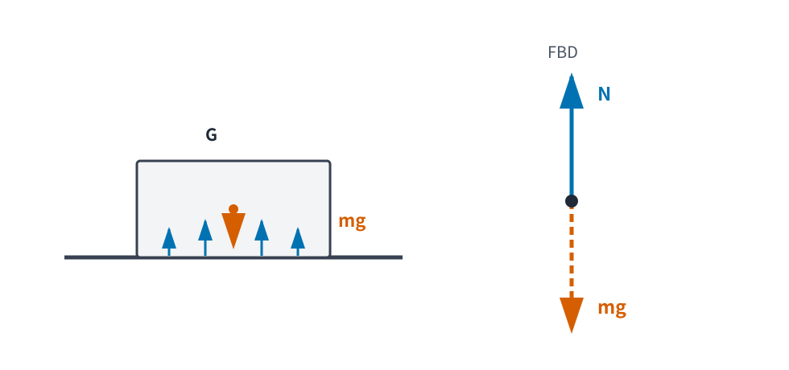
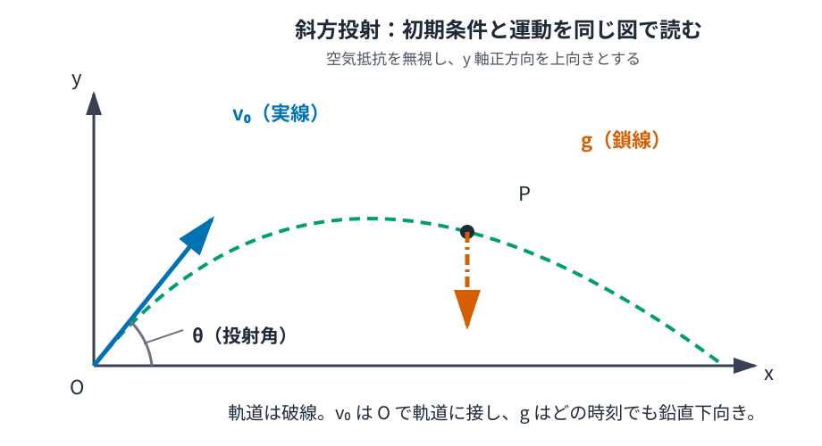
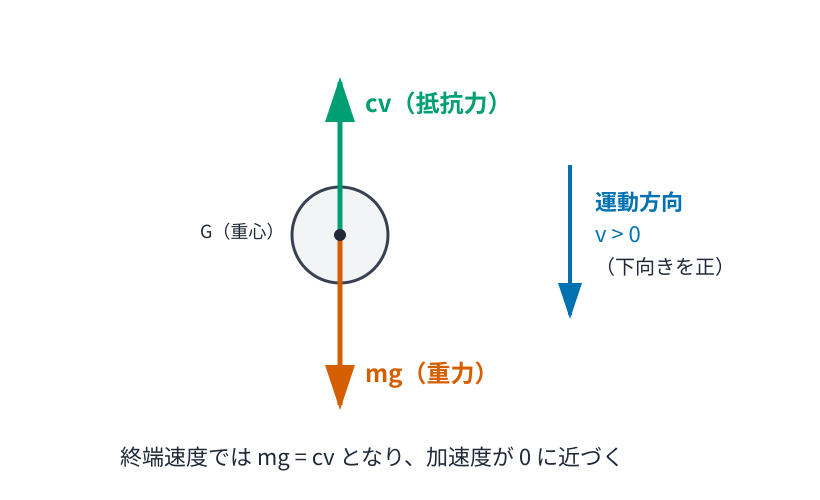

# MECH2 Newton の運動法則と運動方程式

<!-- definition-example-audit: strict -->

> **既出概念**：[MECH1 運動を測る：位置・速度・加速度](../MECH1/index.md)と[ODE1 一階常微分方程式・初期値問題](../ODE1/index.md)を使います。高校物理は前提にしません。

MECH1 では、観測された位置を軌道 $r(t)$ でモデル化し、

$
v(t)=\dot r(t),
\qquad
a(t)=\ddot r(t)
$

として速度と加速度を定義しました。文字の上の点は、MECH1 で導入した **時間微分の略記** です。

しかし、運動学だけでは

$
\text{「この加速度がなぜ生じたのか」}
$

には答えられません。

同じ位置、同じ速度から出発しても、重力だけを受ける物体、ばねにつながれた物体、空気抵抗を受ける物体では、その後の軌道は異なります。そこで本章では、運動を変化させる相互作用を **力** としてモデル化し、質量と加速度を結ぶ Newton の運動法則を導入します。

ここで最初に区別しておくことがあります。

Newton の運動法則は、微積分から証明される数学定理ではありません。実験・観測によって支持され、一定の速度域・長さ尺度・基準系で非常によく働く **物理学側の出発点** です。

本章の中心となる物理法則は、まず

$
F_{\mathrm{net}}=ma
$

です。軌道 $r(t)$ を使えば $a=\ddot r$ なので、

$
m\ddot r(t)=F_{\mathrm{net}}(t)
$

と読めます。力が位置や速度にどう依存するかは Newton の法則そのものではなく、重力・ばね・抵抗など **個々の力モデル** の側で決めます。その後の微分方程式の解法・一意性・極限計算は数学の仕事です。

本章の流れは

$$
\boxed{
\text{相互作用のモデル}
\longrightarrow
\text{力}
\longrightarrow
\text{Newton 方程式}
\longrightarrow
\text{初期値問題}
\longrightarrow
\text{軌道}
}
$$

です。

---

## 1. 質量・力・合力

物体に何も働いていない場合と、強く押した場合とでは、速度の変わり方が違います。また、同じように押しても軽い台車と重い台車では加速度が違います。

Newton 力学では、この二つを

- 相互作用の強さと向きを表す **力**
- 運動の変わりにくさを表す **質量**

として分けます。

<!-- formal-statement-start -->
### 定義（質量・力・合力）

質点に割り当てる正のスカラー量

$$
m>0
$$

を、本章ではその質点の **慣性質量** と呼ぶ。SI 単位は kg とする。

質点と他の物体・外部環境との相互作用をベクトル量

$$
F_i
$$

で表したものを **力** と呼ぶ。

一つの質点に $F_1,\ldots,F_n$ が同時に働くとき、そのベクトル和

$$
F_{\mathrm{net}}
:=
\sum_{i=1}^n F_i
$$

を **合力** と呼ぶ。

本章では後で、合力を質量と加速度に結び付ける原理を導入する。
<!-- formal-statement-end -->

力の SI 単位 N（newton）は

$$
1\ \mathrm{N}
=
1\ \mathrm{kg\,m/s^2}
$$

と定めます。

したがって質量の次元を $M$ と書けば、

$$
[F]
=
MLT^{-2}
$$

です。

<!-- definition-example-start: def-mech2-mass-force-resultant -->

### **定義の確認**：二つの力をベクトル和する

一つの質点に

$$
F_1=
\begin{pmatrix}
6\\
0
\end{pmatrix}
\ \mathrm{N},
\qquad
F_2=
\begin{pmatrix}
-2\\
4
\end{pmatrix}
\ \mathrm{N}
$$

が働くとします。

合力は定義どおり

$$
\begin{aligned}
F_{\mathrm{net}}
&=
F_1+F_2\\
&=
\begin{pmatrix}
6\\
0
\end{pmatrix}
+
\begin{pmatrix}
-2\\
4
\end{pmatrix}\\
&=
\begin{pmatrix}
4\\
4
\end{pmatrix}
\ \mathrm{N}.
\end{aligned}
$$

大きさは

$$
|F_{\mathrm{net}}|
=
\sqrt{4^2+4^2}
=
4\sqrt2\ \mathrm{N}.
$$

力は「大きさだけ」の量ではなく、方向を含むベクトル量です。二つの力が同じ大きさでも反対向きなら合力は 0 になり得ます。

<!-- definition-example-end -->

### 1.1 力は「物体が持っているもの」ではない

力は、単独の物体に保存されている物質のようなものではありません。

たとえば本が机に置かれているとき、

- 地球が本を引く
- 机が本を押す

という別々の相互作用があります。

したがって力を書くときは、

> **誰が、誰に及ぼす力か**

を意識すると混乱が減ります。

---

## 2. Newton の第1法則と慣性系

MECH1 では、一定速度 $U$ で動く二つの基準系の間では

$$
a'=a
$$

となることを確認しました。

しかし、基準系が加速している場合には加速度は一致しません。すると

$$
F=ma
$$

という同じ形の法則を、どの基準系でもそのまま使えるわけではありません。

Newton 力学では、まず特別な基準系のクラスを選びます。

<!-- formal-statement-start -->
### 原理（Newton の第1法則・慣性の法則）

ある基準系で質点に働く合力が 0 であるとき、その質点の速度は時間に依らず一定である。

すなわち

$$
F_{\mathrm{net}}=0
\quad\Longrightarrow\quad
\dot v=0
$$

となるような基準系が存在するとする。
<!-- formal-statement-end -->

この法則の物理的な内容には、

> そのような基準系を現実の中で選べる

という主張が含まれています。

<!-- formal-statement-start -->
### 定義（慣性系）

[Newton の第1法則](#principle-mech2-newton-first)が成り立ち、合力が 0 の質点が一定速度で運動する基準系を **慣性系** と呼ぶ。
<!-- formal-statement-end -->

<!-- definition-example-start: def-mech2-inertial-frame -->

### **定義の確認**：等速移動する基準系も慣性系

慣性系 $S$ に対して、基準系 $S'$ が一定速度ベクトル $U$ で移動しているとします。

MECH1 の [Galilei 変換における速度・加速度](../MECH1/index.md#prop-mech1-galilei-velocity-acceleration) では

$$
v'=v-U,
\qquad
a'=a
$$

でした。

$S$ で合力が 0 なら [Newton の第1法則](#principle-mech2-newton-first)により

$$
a=0.
$$

したがって

$$
a'=0
$$

であり、$S'$ でも速度は一定です。

よって、ある慣性系に対して一定速度で動く基準系も慣性系です。

<!-- definition-example-end -->

### 2.1 地上系はいつでも厳密な慣性系か

地球は自転し、太陽の周りを公転しています。そのため地表に固定した座標系は厳密には慣性系ではありません。

それでも、短い時間・小さな領域・日常的な精度で運動を扱うなら、地上系を近似的な慣性系とみなして十分な場合が多くあります。

物理では

$$
\boxed{
\text{どの近似を採用しているか}
}
$$

を明示することが重要です。

---

## 3. Newton の第2法則：力を運動方程式へ変える

慣性系を選んだら、合力と加速度を結びます。

<!-- formal-statement-start -->
### 原理（Newton の第2法則）

慣性系で、一定の慣性質量 $m>0$ を持つ質点を考える。

質点に働く合力を $F_{\mathrm{net}}(t)$、加速度を $a(t)$ とすると、

$$
\boxed{
F_{\mathrm{net}}(t)
=
m a(t)
}
$$

とする。
<!-- formal-statement-end -->

MECH1 で

$
a(t)=\ddot r(t)
$

と定義したので、

$
\boxed{
m\ddot r(t)
=
F_{\mathrm{net}}(t)
}
$

と書けます。

これが本章の中心となる **運動方程式** です。ここで $F_{\mathrm{net}}(t)$ は、実際の軌道上で時刻 $t$ に質点へ働いている合力を表します。

### 3.1 第2法則は「加速度の公式」ではなくモデルの変換器

重要なのは、右辺の力を先にモデル化しなければ運動方程式は決まらないことです。

たとえば

- 重力だけなら $F_{\mathrm{net}}=F_g$
- 重力と抵抗力なら $F_{\mathrm{net}}=F_g+F_d$
- ばねだけなら $F_{\mathrm{net}}=F_s$

です。

したがって

$$
F=ma
$$

だけを覚えても運動は解けません。

必要なのは

$$
\boxed{
\text{現象}
\to
\text{力を列挙}
\to
\text{合力}
\to
\text{ODE}
}
$$

という順序です。

### 3.2 力が一定なら加速度も一定

一定質量 $m$ に一定の合力 $F_0$ が働くなら

$$
m\ddot r=F_0
$$

なので

$$
\ddot r=\frac{F_0}{m}.
$$

右辺は一定です。

したがって MECH1 の[一定加速度の位置と速度](../MECH1/index.md#prop-mech1-constant-acceleration)から

$$
\dot r(t)
=
v_0+\frac{F_0}{m}t,
$$

$$
r(t)
=
r_0+v_0t+\frac{F_0}{2m}t^2.
$$

運動学で置いていた「一定加速度」という仮定が、一定合力という力学的条件から導かれました。

---

## 4. Newton の第3法則：作用反作用は別の物体に働く

二つの物体が相互作用するとき、力を片側だけ考えると系全体の構造を見失います。

<!-- formal-statement-start -->
### 原理（Newton の第3法則・作用反作用の法則）

Newton 的な二質点間の相互作用モデルで、質点 2 が質点 1 に及ぼす力を

$$
F_{1\leftarrow2}
$$

とし、質点 1 が質点 2 に及ぼす力を

$$
F_{2\leftarrow1}
$$

とする。

このとき

$$
\boxed{
F_{1\leftarrow2}
=
-
F_{2\leftarrow1}
}
$$

とする。
<!-- formal-statement-end -->

この二つの力は

- 大きさが等しい
- 向きが反対
- **別々の物体に働く**

という組です。

最後の点が最重要です。

### 4.1 机上の本：重力と垂直抗力は作用反作用ではない

質量 $m$ の本が水平な机の上で静止しているとします。

本に働く力は、

- 地球が本に及ぼす重力
- 机が本に及ぼす垂直抗力

です。

下図の左側では、重力 $mg$ を本の重心 $G$ から下向きに描き、机からの接触力を本の下面に分布する上向きの力として描いています。右側は、それらを合力 $N$ と重力 $mg$ だけにまとめた自由物体図です。右側の二本の矢印はどちらも **本** を作用対象としているため、向きが反対でも [Newton 第3法則](#principle-mech2-newton-third)の組ではありません。

鉛直上向きを正に取ると

$$
F_g=-mg,
\qquad
N>0.
$$

本が静止し続けるなら加速度は 0 なので

$$
N-mg=0.
$$

したがって

$$
N=mg.
$$

確かに等大反対向きですが、この二つはどちらも **本に働く力** です。したがって第3法則の作用反作用の組ではありません。

本に働く重力の反作用は

> 本が地球に及ぼす重力

です。

本に働く垂直抗力の反作用は

> 本が机に及ぼす接触力

です。

作用反作用は

$$
\boxed{
\text{同じ物体上で打ち消し合う二力ではない}
}
$$

と覚えるより、力の添字と作用対象を確認する方が安全です。

### 4.2 第3法則にもモデルの適用範囲がある

本章では Newton 的な質点間相互作用を扱います。

後に電磁場などを扱うと、物体だけでなく場自身が運動量を担うため、単純な「二物体間の瞬間的な等大反対向きの力」だけでは記述しにくい状況が現れます。

したがって第3法則も、採用したモデルの範囲を意識して使います。

---

## 5. 力のモデルを作る

[Newton の第2法則](#principle-mech2-newton-second)は、力の式を与えなければ閉じません。

ここでは大学初年級力学で最も基本的な三つのモデルを導入します。

### 5.1 地表近くの重力

地表近くの狭い範囲では、重力加速度ベクトルをほぼ一定

$$
g_{\mathrm{vec}}
$$

とみなします。

質量 $m$ の物体に働く重力を

$$
\boxed{
F_g
=
m g_{\mathrm{vec}}
}
$$

とモデル化します。

鉛直上向きを $y$ 軸正方向に取り、

$$
g_{\mathrm{vec}}
=
\begin{pmatrix}
0\\
-g
\end{pmatrix},
\qquad
g>0
$$

と書けば、

$$
F_g
=
\begin{pmatrix}
0\\
-mg
\end{pmatrix}.
$$

本章では数値計算で必要なとき

$$
g=9.8\ \mathrm{m/s^2}
$$

または設問で指定した近似値を使います。

ここで

$$
m\ddot y=-mg
$$

なので、$m>0$ で割ると

$$
\ddot y=-g.
$$

質量が消えました。

ただしこれは「代数だけで自然法則を証明した」のではありません。

同じ $m$ が

- 慣性を表す第2法則の質量
- 重力の強さを表す $F_g=mg$ の質量

の両方に現れる、という物理的入力を使っています。

### 5.2 ばねの力：Hooke の法則

平衡位置を $x=0$ とし、ばねの変形が十分小さい範囲を考えます。

ばね定数を

$$
k>0
$$

とすると、復元力を

$$
\boxed{
F_s=-kx
}
$$

と近似します。

$x>0$ なら

$$
F_s<0,
$$

$x<0$ なら

$$
F_s>0
$$

なので、常に平衡位置へ戻す向きです。

質量 $m$ の物体をつなぐと

$$
m\ddot x=-kx,
$$

すなわち

$$
\ddot x+\frac{k}{m}x=0.
$$

この方程式の詳しい解法と振動の意味は MECH5 で扱います。

ここでは

> 力モデルから運動方程式を立てる

ところまでが主役です。

### 5.3 速度に比例する抵抗力

流体中を動く物体では、媒質との相互作用によって速度と反対向きの力を受けます。

速度が十分小さい範囲などでは、最も単純な近似として速度に比例する抵抗を使います。

<!-- formal-statement-start -->
### 定義（線形抵抗力）

媒質に対する質点の速度を $v$ とし、定数 $c>0$ を取る。

$$
\boxed{
F_d=-cv
}
$$

で表される力を、本章では **線形抵抗力** と呼ぶ。

$c$ の SI 単位は kg/s とする。
<!-- formal-statement-end -->

次元を確認すると

$$
[c]
=
MT^{-1}
$$

なので

$$
[cv]
=
(MT^{-1})(LT^{-1})
=
MLT^{-2}
$$

となり、確かに力の次元です。

<!-- definition-example-start: def-mech2-linear-drag -->

### **定義の確認**：運動方向と反対を向く

一次元で

$$
c=3\ \mathrm{kg/s}
$$

とします。

速度が

$$
v=2\ \mathrm{m/s}
$$

なら

$$
F_d
=
-cv
=
-6\ \mathrm{N}.
$$

速度が正方向なので、抵抗力は負方向です。

反対に

$$
v=-2\ \mathrm{m/s}
$$

なら

$$
F_d
=
-cv
=
6\ \mathrm{N}.
$$

今度は抵抗力が正方向です。

どちらの場合も

$$
F_dv
=
-cv^2
\le0
$$

なので、抵抗力は速度に逆らう向きです。

<!-- definition-example-end -->

線形抵抗は万能ではありません。速度域や物体形状によっては、抵抗力が速さの二乗に近いモデルの方が適切です。

どの式を使うかは実験・尺度・近似の選択です。

---

## 6. 運動方程式は初期値問題である

力の式が決まったとします。

三次元の位置を

$
r(t)\in\mathbb R^3
$

とし、質量 $m>0$ を一定とします。

ここでは、合力のモデルが「現在の位置 $r$、速度 $v$、時刻 $t$」から決まる場合、その **力モデルを表す写像** を

$
\mathcal F(r,v,t)
$

と書くことにします。これは力一般の定義ではなく、運動方程式を状態変数で閉じるための一つの書き方です。

実際の軌道に沿って働く合力は

$
F_{\mathrm{net}}(t)
=
\mathcal F(r(t),v(t),t)
$

であり、[Newton の第2法則](#principle-mech2-newton-second)は

$
m\ddot r(t)
=
\mathcal F(r(t),\dot r(t),t)
$

となります。これは $r$ に関する二階 ODE です。

一つの軌道を選ぶには、通常

$
r(t_0)=r_0,
\qquad
\dot r(t_0)=v_0
$

という位置と速度の初期値を与えます。

### 6.1 一階系に直す

速度を

$
v=\dot r
$

と新しい未知関数として導入すると、

$
\dot r=v,
$

$
\dot v=\frac1m\mathcal F(r,v,t).
$

したがって位置と速度を一つにまとめた変数

$
Y=
\begin{pmatrix}
r\\
v
\end{pmatrix}
$

を使えば、

$
\dot Y
=
\begin{pmatrix}
v\\
m^{-1}\mathcal F(r,v,t)
\end{pmatrix}
$

という一階の初期値問題になります。

これは ODE1 で学んだ

$$
\text{現在の位置と速度}
\longmapsto
\text{その瞬間の変化率}
$$

という形そのものです。

### 6.2 「式を立てる」と「式を解く」は別の仕事

物理側では

- どの物体を質点とみなすか
- どの基準系を慣性系とみなすか
- どの力を入れるか
- どの力を無視するか

を決めます。

その結果として ODE が立ちます。

数学側では

- 解が存在するか
- 一意か
- 公式で解けるか
- 数値解が必要か

を調べます。

この分業を意識すると、「微分方程式を解けたから物理モデルも正しい」とは限らないことが分かります。

---

## 7. 自由落下：Newton 方程式から等加速度運動を導く

空気抵抗を無視し、鉛直上向きを $y$ 軸正方向とします。

地表近くでは重力を

$$
F_g=-mg
$$

と近似するので、[Newton の第2法則](#principle-mech2-newton-second)から

$$
m\ddot y=-mg.
$$

$m>0$ だから

$$
\boxed{
\ddot y=-g
}
$$

です。

初期条件を

$$
y(0)=y_0,
\qquad
\dot y(0)=v_0
$$

とします。

加速度は一定なので、MECH1 の一定加速度の式を成分ごとに使うと

$$
\boxed{
\dot y(t)=v_0-gt
}
$$

および

$$
\boxed{
y(t)=y_0+v_0t-\frac12gt^2
}
$$

を得ます。

### 7.1 自由落下で質量が消える理由

上式には $m$ がありません。

これは

$$
m\ddot y=-mg
$$

で慣性質量と重力側の質量が同じ比例係数として現れ、両辺から約分されたためです。

従って、このモデルでは空気抵抗を無視すれば異なる質量の物体も同じ初期条件から同じ加速度で落下します。

現実には空気抵抗が物体の形状・断面積・速度に依存するため、日常の落下で軌道が同じとは限りません。

---

## 8. 斜方投射：二次元の運動方程式を成分に分ける

次に、空気抵抗を無視し、地表近くの一様重力だけを受ける二次元運動を考えます。

$x$ 軸を水平右向き、$y$ 軸を鉛直上向きとします。時刻 $t=0$ に初速度の大きさ $v_0>0$、水平からの角度 $\theta$ で投げると、

$$
v_x(0)=v_0\cos\theta,
\qquad
v_y(0)=v_0\sin\theta
$$

です。

図では重力加速度は常に下向きです。軌道が右向きに曲がって見えても、水平方向の力を仮定しているわけではありません。

Newton 方程式は

$$
m
\begin{pmatrix}
\ddot x\\
\ddot y
\end{pmatrix}
=
\begin{pmatrix}
0\\
-mg
\end{pmatrix}.
$$

従って成分ごとに

$$
\ddot x=0,
\qquad
\ddot y=-g.
$$

初期位置を

$$
x(0)=x_0,
\qquad
y(0)=y_0
$$

とすれば、

$$
\dot x(t)=v_0\cos\theta,
$$

$$
\dot y(t)=v_0\sin\theta-gt.
$$

さらに積分して

$$
\boxed{
x(t)
=
x_0+v_0\cos\theta\,t
}
$$

および

$$
\boxed{
y(t)
=
y_0+v_0\sin\theta\,t-\frac12gt^2
}
$$

です。

### 8.1 軌道を時間なしで書く

$\cos\theta\ne0$ とします。

$x$ の式から

$$
t
=
\frac{x-x_0}{v_0\cos\theta}.
$$

これを $y(t)$ に代入すると

$$
\begin{aligned}
y-y_0
&=
v_0\sin\theta
\frac{x-x_0}{v_0\cos\theta}\\
&\quad
-
\frac12g
\left(
\frac{x-x_0}{v_0\cos\theta}
\right)^2\\
&=
\tan\theta\,(x-x_0)
-
\frac{g}{2v_0^2\cos^2\theta}
(x-x_0)^2.
\end{aligned}
$$

したがって

$$
\boxed{
y
=
y_0
+
\tan\theta\,(x-x_0)
-
\frac{g}{2v_0^2\cos^2\theta}
(x-x_0)^2
}
$$

で、軌道はこの近似の下で放物線です。

### 8.2 投射距離は追加条件を置いてから求める

たとえば

$$
x_0=0,
\qquad
y_0=0,
\qquad
0<\theta<\frac{\pi}{2}
$$

とし、再び地面 $y=0$ に戻る時刻を求めます。

$$
0
=
v_0\sin\theta\,t
-
\frac12gt^2
$$

なので

$$
t
\left(
v_0\sin\theta-\frac12gt
\right)
=
0.
$$

$t=0$ 以外の解は

$$
T
=
\frac{2v_0\sin\theta}{g}.
$$

この時刻の水平位置は

$$
\begin{aligned}
R
&=
v_0\cos\theta\,T\\
&=
v_0\cos\theta
\frac{2v_0\sin\theta}{g}\\
&=
\frac{v_0^2}{g}
2\sin\theta\cos\theta\\
&=
\boxed{
\frac{v_0^2}{g}\sin2\theta
}.
\end{aligned}
$$

この式は、地面が水平で、投射点と着地点の高さが同じで、空気抵抗を無視するという条件に依存します。

---

## 9. 線形抵抗下の落下：終端速度が現れる

今度は空気抵抗を入れます。

計算を簡潔にするため、この節だけ鉛直 **下向き** を正に取ります。位置を $y(t)$、下向き速度を

$$
v(t)=\dot y(t)
$$

とします。

落下中 $v>0$ のとき、

- 重力 $mg$ は正方向
- 線形抵抗 $-cv$ は負方向

です。図の矢印もこの符号規約に対応しています。

[Newton の第2法則](#principle-mech2-newton-second)は

$$
m\dot v
=
mg-cv.
$$

$m>0$ で割ると

$$
\dot v+\frac{c}{m}v=g.
$$

これは ODE1 の一階線形方程式です。

### 9.1 終端速度と時定数を先に読む

加速度が 0 になる定常値を $v_\infty$ とすると、

$$
0
=
g-\frac{c}{m}v_\infty.
$$

従って

$$
\boxed{
v_\infty
=
\frac{mg}{c}
}
$$

です。

また

$$
\boxed{
\tau
=
\frac{m}{c}
}
$$

と置きます。

$c$ の単位は kg/s なので、

$$
[\tau]
=
\frac{\mathrm{kg}}{\mathrm{kg/s}}
=
\mathrm{s}.
$$

$\tau$ は時間の次元を持ち、速度が終端値へ近づく時間尺度になります。

### 9.2 一階線形 ODE として解く

初期速度を

$$
v(0)=v_0
$$

とします。

方程式を

$$
\dot v+\frac1\tau v=g
$$

と書きます。

積分因子は

$$
\mu(t)
=
e^{t/\tau}
$$

です。

両辺に掛けると

$$
e^{t/\tau}\dot v
+
\frac1\tau e^{t/\tau}v
=
g e^{t/\tau}.
$$

左辺は積の微分なので

$$
\frac{d}{dt}
\left(
e^{t/\tau}v(t)
\right)
=
g e^{t/\tau}.
$$

0 から $t$ まで積分すると

$$
e^{t/\tau}v(t)-v_0
=
g
\int_0^t e^{s/\tau}\,ds.
$$

積分は

$$
\int_0^t e^{s/\tau}\,ds
=
\tau
\left(
e^{t/\tau}-1
\right)
$$

なので、

$$
e^{t/\tau}v(t)
=
v_0
+
g\tau
\left(
e^{t/\tau}-1
\right).
$$

両辺に $e^{-t/\tau}$ を掛けると

$$
\begin{aligned}
v(t)
&=
v_0e^{-t/\tau}
+
g\tau
\left(
1-e^{-t/\tau}
\right)\\
&=
g\tau
+
\left(
v_0-g\tau
\right)e^{-t/\tau}.
\end{aligned}
$$

$g\tau=mg/c=v_\infty$ だから、

$$
\boxed{
v(t)
=
v_\infty
+
\left(
v_0-v_\infty
\right)e^{-t/\tau}
}
$$

です。

$t\to\infty$ では

$$
e^{-t/\tau}\to0
$$

なので

$$
\boxed{
v(t)\to v_\infty
}
$$

となります。

### 9.3 位置まで求める

初期位置を $y(0)=y_0$ とします。

$$
\dot y
=
v_\infty
+
(v_0-v_\infty)e^{-t/\tau}
$$

を 0 から $t$ まで積分すると、

$$
\begin{aligned}
y(t)-y_0
&=
v_\infty t
+
(v_0-v_\infty)
\int_0^t e^{-s/\tau}\,ds\\
&=
v_\infty t
+
\tau(v_0-v_\infty)
\left(
1-e^{-t/\tau}
\right).
\end{aligned}
$$

したがって

$$
\boxed{
y(t)
=
y_0
+
v_\infty t
+
\tau(v_0-v_\infty)
\left(
1-e^{-t/\tau}
\right)
}
$$

です。

落下を静止から始める $v_0=0$ の場合には、

$$
v(t)
=
v_\infty
\left(
1-e^{-t/\tau}
\right)
$$

となります。

---

## 10. 加速する基準系では慣性力が現れる

最後に、「なぜ慣性系をわざわざ選ぶのか」を数式で確認します。

慣性系 $S$ の座標を $x(t)$ とします。

同じ向きの軸を持つ別の基準系 $S'$ の原点が、$S$ から見て位置 $X(t)$ にあるとします。

$S'$ での座標を

$$
x'(t)
=
x(t)-X(t)
$$

と定めます。

二回微分すると

$$
\ddot x'
=
\ddot x-\ddot X.
$$

$S$ が慣性系なら

$$
m\ddot x=F
$$

です。

従って

$$
\begin{aligned}
m\ddot x'
&=
m\ddot x-m\ddot X\\
&=
F-m\ddot X.
\end{aligned}
$$

つまり $S'$ では

$$
\boxed{
m\ddot x'
=
F+F_{\mathrm{inertial}},
\qquad
F_{\mathrm{inertial}}
=
-m\ddot X
}
$$

と書けば Newton 方程式と同じ形になります。

この $-m\ddot X$ は、別の物体との相互作用として生じた力ではありません。**加速する座標系を選んだために追加される見かけの力**です。

$S'$ が一定速度で動くなら

$$
\ddot X=0
$$

なので慣性力は消えます。

これが、Galilei 変換で結ばれた等速移動基準系どうしでは Newton 方程式の形が保たれる理由です。

---

## 11. 本章の見取り図

本章では、運動学から力学へ進みました。

$$
\boxed{
\begin{array}{c}
\text{位置 }r(t),\ \text{速度 }v(t)=\dot r(t),\ \text{加速度 }a(t)=\ddot r(t)\\
\downarrow\\
\text{相互作用を個々の力 }F_i\text{ としてモデル化}\\
\downarrow\\
\text{合力 }F_{\mathrm{net}}\text{ を作り、慣性系で }m\ddot r=F_{\mathrm{net}}\\
\downarrow\\
\text{位置・速度を与えた初期値問題}\\
\downarrow\\
\text{自由落下・斜方投射・抵抗下の落下}
\end{array}
}
$$

特に次を区別できることが重要です。

- Newton の法則は物理的入力であり、数学定理ではない。
- 力の式は現象に応じたモデルであり、[Newton の第2法則](#principle-mech2-newton-second)だけからは決まらない。
- 作用反作用の二力は別々の物体に働く。
- 運動方程式を立てた後は ODE の初期値問題として扱える。
- 加速座標系では、座標系の加速度に由来する慣性力が必要になる。

次の MECH3 では、運動方程式を時刻ごとに直接解く以外の道具として、仕事・運動エネルギー・ポテンシャルを導入します。

---

# 演習

## Level A

### A1. 合力から加速度を求める

質量

$$
m=2\ \mathrm{kg}
$$

の質点に

$$
F_1=
\begin{pmatrix}
6\\
0
\end{pmatrix}
\ \mathrm{N},
\qquad
F_2=
\begin{pmatrix}
-2\\
4
\end{pmatrix}
\ \mathrm{N}
$$

が同時に働く。

1. 合力 $F_{\mathrm{net}}$ を求めよ。
2. [Newton の第2法則](#principle-mech2-newton-second)から加速度 $a$ を求めよ。
3. 加速度の大きさを求めよ。
4. $F_{\mathrm{net}}$ と $a$ の向きを比較せよ。

- Level: A

<!-- solution-start -->
#### 詳細解答

合力は

$$
\begin{aligned}
F_{\mathrm{net}}
&=
F_1+F_2\\
&=
\begin{pmatrix}
6\\
0
\end{pmatrix}
+
\begin{pmatrix}
-2\\
4
\end{pmatrix}\\
&=
\begin{pmatrix}
4\\
4
\end{pmatrix}
\ \mathrm{N}.
\end{aligned}
$$

[Newton の第2法則](#principle-mech2-newton-second)

$$
F_{\mathrm{net}}=ma
$$

から

$$
a
=
\frac{F_{\mathrm{net}}}{m}
=
\frac12
\begin{pmatrix}
4\\
4
\end{pmatrix}
=
\boxed{
\begin{pmatrix}
2\\
2
\end{pmatrix}
\ \mathrm{m/s^2}
}.
$$

大きさは

$$
|a|
=
\sqrt{2^2+2^2}
=
2\sqrt2\ \mathrm{m/s^2}.
$$

$m>0$ なので

$$
a=\frac1mF_{\mathrm{net}}
$$

は合力の正のスカラー倍です。従って加速度と合力は同じ向きです。

<!-- solution-end -->

---

### A2. 自由落下を Newton 方程式から解く

鉛直上向きを正とし、地面を $y=0$ とする。

高さ

$$
y(0)=20\ \mathrm{m}
$$

から物体を静かに放す。

空気抵抗を無視し、

$$
g=9.8\ \mathrm{m/s^2}
$$

とする。

1. 運動方程式を立てよ。
2. $y(t)$ と速度 $\dot y(t)$ を求めよ。
3. 地面に到達する時刻を求めよ。
4. 到達直前の速度を求めよ。

- Level: A

<!-- solution-start -->
#### 詳細解答

物体に働く力は下向きの重力だけです。上向きを正に取ったので

$$
F_g=-mg.
$$

[Newton の第2法則](#principle-mech2-newton-second)から

$$
m\ddot y=-mg.
$$

$m>0$ で割ると

$$
\boxed{
\ddot y=-g=-9.8
}.
$$

初速度は 0 なので、

$$
\dot y(t)
=
-gt
=
-9.8t\ \mathrm{m/s}.
$$

位置は

$$
y(t)
=
20-\frac12gt^2
=
20-4.9t^2.
$$

地面到達時刻 $T>0$ は

$$
0
=
20-4.9T^2.
$$

従って

$$
T^2
=
\frac{20}{4.9}
=
\frac{200}{49},
$$

$$
\boxed{
T
=
\frac{10\sqrt2}{7}\ \mathrm{s}
\approx2.02\ \mathrm{s}
}.
$$

到達直前の速度は

$$
\dot y(T)
=
-9.8T
=
-\frac{49}{5}\frac{10\sqrt2}{7}
=
-14\sqrt2\ \mathrm{m/s}.
$$

したがって

$$
\boxed{
\dot y(T)
=
-14\sqrt2\ \mathrm{m/s}
}
$$

です。負号は下向きを表します。

<!-- solution-end -->

---

### A3. ばねから運動方程式を立てる

水平面上で質量

$$
m=0.50\ \mathrm{kg}
$$

の物体をばね定数

$$
k=8.0\ \mathrm{N/m}
$$

のばねにつなぐ。

摩擦を無視し、平衡位置を $x=0$ とする。

ある瞬間に

$$
x=0.10\ \mathrm{m}
$$

である。

1. Hooke の法則から、その瞬間のばね力を求めよ。
2. その瞬間の加速度を求めよ。
3. 一般の時刻について運動方程式を立てよ。
4. $x<0$ のとき加速度がどちら向きになるか説明せよ。

- Level: A

<!-- solution-start -->
#### 詳細解答

ばね力は

$$
F_s=-kx.
$$

従って $x=0.10$ m では

$$
F_s
=
-(8.0)(0.10)
=
\boxed{
-0.80\ \mathrm{N}
}.
$$

[Newton の第2法則](#principle-mech2-newton-second)から

$$
a
=
\frac{F_s}{m}
=
\frac{-0.80}{0.50}
=
\boxed{
-1.6\ \mathrm{m/s^2}
}.
$$

一般の時刻では

$$
m\ddot x=-kx,
$$

従って

$$
\boxed{
\ddot x+\frac{k}{m}x=0
}
$$

です。

数値を代入すれば

$$
\ddot x+16x=0.
$$

$x<0$ なら

$$
F_s=-kx>0
$$

です。従って加速度は正方向、すなわち平衡位置 $x=0$ へ戻す方向です。

<!-- solution-end -->

---

### A4. 作用反作用の組を見分ける

水平な机の上に本が静止している。

次の四つの力を考える。

1. 地球が本に及ぼす重力。
2. 本が地球に及ぼす重力。
3. 机が本に及ぼす垂直抗力。
4. 本が机に及ぼす接触力。

次を答えよ。

1. [Newton 第3法則](#principle-mech2-newton-third)の作用反作用の組を二組挙げよ。
2. 本に働く力だけを挙げよ。
3. 本が静止しているとき、なぜ重力と垂直抗力の大きさが等しくなるか説明せよ。
4. 重力と垂直抗力が作用反作用の組でない理由を説明せよ。

- Level: A

<!-- solution-start -->
#### 詳細解答

作用反作用は **別々の物体に働く相互作用の対** です。

従って第一の組は

- 地球が本に及ぼす重力
- 本が地球に及ぼす重力

です。

第二の組は

- 机が本に及ぼす垂直抗力
- 本が机に及ぼす接触力

です。

本に働く力は

- 地球が本に及ぼす重力
- 机が本に及ぼす垂直抗力

の二つです。

本は静止しているので加速度は 0 です。[Newton の第2法則](#principle-mech2-newton-second)から

$$
F_{\mathrm{net}}=0.
$$

鉛直上向きを正に取れば

$$
N-mg=0.
$$

従って

$$
N=mg.
$$

重力と垂直抗力は大きさが等しく向きが反対ですが、どちらも **本に働く力** です。

[Newton 第3法則](#principle-mech2-newton-third)の対は異なる物体に働く必要があるため、この二力は作用反作用の組ではありません。

<!-- solution-end -->

---

## Level B

### B1. 斜方投射の飛行時間・最高点・投射距離

地面を

$$
y=0
$$

とし、原点から大きさ

$$
v_0=20\ \mathrm{m/s}
$$

の初速度で、水平から

$$
\theta=30^\circ
$$

の方向へ物体を投げる。

空気抵抗を無視し、

$$
g=10\ \mathrm{m/s^2}
$$

とする。

1. $x(t),y(t)$ を求めよ。
2. 再び地面へ戻る時刻 $T>0$ を求めよ。
3. 投射距離 $R=x(T)$ を求めよ。
4. 最高点に達する時刻を求めよ。
5. 最高点の高さを求めよ。

- Level: B

<!-- solution-start -->
#### 詳細解答

初速度の成分は

$$
v_x(0)
=
v_0\cos30^\circ
=
20\frac{\sqrt3}{2}
=
10\sqrt3,
$$

$$
v_y(0)
=
v_0\sin30^\circ
=
20\frac12
=
10.
$$

空気抵抗を無視すると

$$
\ddot x=0,
\qquad
\ddot y=-10.
$$

初期位置が原点なので

$$
\boxed{
x(t)=10\sqrt3\,t
}
$$

および

$$
\boxed{
y(t)=10t-5t^2
}
$$

です。

地面へ戻る時刻は

$$
0
=
10T-5T^2
=
5T(2-T).
$$

$T>0$ なので

$$
\boxed{
T=2\ \mathrm{s}
}.
$$

投射距離は

$$
R
=
x(2)
=
10\sqrt3\times2
=
\boxed{
20\sqrt3\ \mathrm{m}
}.
$$

鉛直速度は

$$
\dot y(t)=10-10t.
$$

最高点では鉛直速度が 0 になるので

$$
10-10t=0,
$$

従って

$$
\boxed{
t=1\ \mathrm{s}
}.
$$

そのとき

$$
y(1)
=
10-5
=
\boxed{
5\ \mathrm{m}
}.
$$

<!-- solution-end -->

---

### B2. 線形抵抗下の落下を積分因子で解く

下向きを正とする。

質量

$$
m=2\ \mathrm{kg}
$$

の物体が、重力と線形抵抗

$$
F_d=-cv,
\qquad
c=4\ \mathrm{kg/s}
$$

を受けて落下する。

$$
g=10\ \mathrm{m/s^2},
\qquad
v(0)=0
$$

とする。

1. 速度 $v(t)$ の ODE を立てよ。
2. 積分因子を用いて $v(t)$ を求めよ。
3. 終端速度 $v_\infty$ を求めよ。
4. 時定数 $\tau$ を求めよ。
5. $t=\tau$ で速度が終端速度の何倍かを式で答えよ。

- Level: B

<!-- solution-start -->
#### 詳細解答

下向きを正に取っているので、重力は $+mg$、抵抗力は $-cv$ です。

[Newton の第2法則](#principle-mech2-newton-second)から

$$
m\dot v
=
mg-cv.
$$

数値を代入すると

$$
2\dot v
=
20-4v.
$$

両辺を 2 で割って

$$
\boxed{
\dot v+2v=10
}.
$$

積分因子は

$$
\mu(t)=e^{2t}
$$

です。

方程式に掛けると

$$
e^{2t}\dot v+2e^{2t}v=10e^{2t}.
$$

左辺は

$$
\frac{d}{dt}
\left(
e^{2t}v
\right)
$$

なので

$$
\frac{d}{dt}
\left(
e^{2t}v
\right)
=
10e^{2t}.
$$

0 から $t$ まで積分し、$v(0)=0$ を使うと

$$
e^{2t}v(t)
=
10
\int_0^t e^{2s}\,ds.
$$

積分は

$$
\int_0^t e^{2s}\,ds
=
\frac12
\left(
e^{2t}-1
\right)
$$

だから

$$
e^{2t}v(t)
=
5
\left(
e^{2t}-1
\right).
$$

従って

$$
\boxed{
v(t)
=
5
\left(
1-e^{-2t}
\right)
\ \mathrm{m/s}
}.
$$

終端速度は

$$
v_\infty
=
\frac{mg}{c}
=
\frac{2\times10}{4}
=
\boxed{
5\ \mathrm{m/s}
}.
$$

時定数は

$$
\tau
=
\frac{m}{c}
=
\frac24
=
\boxed{
0.5\ \mathrm{s}
}.
$$

$t=\tau$ では

$$
v(\tau)
=
v_\infty
\left(
1-e^{-\tau/\tau}
\right)
=
v_\infty
(1-e^{-1}).
$$

従って終端速度の

$$
\boxed{
1-e^{-1}
}
$$

倍です。

<!-- solution-end -->

---

### B3. 加速する座標系で慣性力を導く

慣性系 $S$ で自由な質点が

$$
F=0
$$

を満たすとする。

別の基準系 $S'$ の原点が $S$ から見て

$$
X(t)
=
\frac12At^2
$$

と運動する。ここで $A$ は一定ベクトルとする。

同じ質点の座標を

$$
x'(t)=x(t)-X(t)
$$

とする。

1. $S$ での加速度 $\ddot x$ を求めよ。
2. $S'$ での加速度 $\ddot x'$ を求めよ。
3. $S'$ で
   $$
   m\ddot x'=F_{\mathrm{inertial}}
   $$
   と書くとき、$F_{\mathrm{inertial}}$ を求めよ。
4. $A=0$ のとき何が起きるか説明せよ。

- Level: B

<!-- solution-start -->
#### 詳細解答

$S$ は慣性系で、実際の合力が

$$
F=0
$$

です。

[Newton の第2法則](#principle-mech2-newton-second)から

$$
m\ddot x=0.
$$

$m>0$ なので

$$
\boxed{
\ddot x=0
}.
$$

一方、

$$
x'=x-X
$$

なので二回微分すると

$$
\ddot x'
=
\ddot x-\ddot X.
$$

$$
X(t)=\frac12At^2
$$

だから

$$
\dot X=At,
$$

$$
\ddot X=A.
$$

従って

$$
\ddot x'
=
0-A
=
\boxed{
-A
}.
$$

$S'$ で Newton 方程式と同じ形

$$
m\ddot x'=F_{\mathrm{inertial}}
$$

に書けば

$$
\boxed{
F_{\mathrm{inertial}}
=
-mA
}.
$$

これは別の物体との相互作用から生じた力ではなく、加速する基準系を使ったことによる慣性力です。

$A=0$ なら

$$
\ddot X=0
$$

なので、$S'$ は $S$ に対して一定速度で移動します。

このとき

$$
F_{\mathrm{inertial}}=0
$$

となり、MECH1 の Galilei 変換の場合へ戻ります。

<!-- solution-end -->

---

## Level C

### C1. 二次元で重力と線形抵抗を同時に受ける質点

水平右向きを $x$ 軸正方向、鉛直上向きを $y$ 軸正方向とする。

質量 $m>0$ の質点が、地表近くの重力

$$
F_g=
\begin{pmatrix}
0\\
-mg
\end{pmatrix}
$$

と、静止した媒質から受ける線形抵抗

$$
F_d
=
-c
\begin{pmatrix}
v_x\\
v_y
\end{pmatrix},
\qquad
c>0
$$

だけを受けるとする。

初期条件を

$$
x(0)=x_0,
\qquad
y(0)=y_0,
$$

$$
v_x(0)=u_0,
\qquad
v_y(0)=w_0
$$

とする。

また

$$
\tau=\frac{m}{c}
$$

と置く。

1. $v_x,v_y$ に対する二本の一階 ODE を立てよ。
2. $v_x(t)$ を求めよ。
3. $v_y(t)$ を求めよ。
4. $x(t),y(t)$ を求めよ。
5. $t\to\infty$ で速度がどうなるか求め、その物理的意味を説明せよ。
6. 水平方向の極限変位
   $$
   \lim_{t\to\infty}(x(t)-x_0)
   $$
   を求めよ。
7. $c$ を大きくすると $\tau=m/c$ がどう変わり、速度の過渡成分がどう変わるか説明せよ。

- Level: C

<!-- solution-start -->
#### 詳細解答

まず合力を成分で書きます。

水平方向には抵抗力だけが働くので

$$
m\dot v_x=-cv_x.
$$

鉛直方向には重力と抵抗力が働くので

$$
m\dot v_y=-mg-cv_y.
$$

$m>0$ で割り、

$$
\frac{c}{m}=\frac1\tau
$$

を使うと

$$
\boxed{
\dot v_x+\frac1\tau v_x=0
}
$$

および

$$
\boxed{
\dot v_y+\frac1\tau v_y=-g
}
$$

です。

### 水平速度

第一式に積分因子

$$
e^{t/\tau}
$$

を掛けると

$$
\frac{d}{dt}
\left(
e^{t/\tau}v_x
\right)
=
0.
$$

従って

$$
e^{t/\tau}v_x(t)
=
v_x(0)
=
u_0.
$$

よって

$$
\boxed{
v_x(t)=u_0e^{-t/\tau}
}.
$$

### 鉛直速度

第二式に同じ積分因子を掛けると

$$
\frac{d}{dt}
\left(
e^{t/\tau}v_y
\right)
=
-ge^{t/\tau}.
$$

0 から $t$ まで積分すると

$$
e^{t/\tau}v_y(t)-w_0
=
-g
\int_0^t e^{s/\tau}\,ds.
$$

積分は

$$
\int_0^t e^{s/\tau}\,ds
=
\tau
\left(
e^{t/\tau}-1
\right)
$$

なので

$$
e^{t/\tau}v_y(t)
=
w_0
-
g\tau
\left(
e^{t/\tau}-1
\right).
$$

従って

$$
\begin{aligned}
v_y(t)
&=
w_0e^{-t/\tau}
-
g\tau
\left(
1-e^{-t/\tau}
\right)\\
&=
-g\tau
+
(w_0+g\tau)e^{-t/\tau}.
\end{aligned}
$$

よって

$$
\boxed{
v_y(t)
=
-g\tau
+
(w_0+g\tau)e^{-t/\tau}
}.
$$

### 位置

$x'(t)=v_x(t)$ なので

$$
x(t)-x_0
=
u_0
\int_0^t e^{-s/\tau}\,ds.
$$

積分は

$$
\int_0^t e^{-s/\tau}\,ds
=
\tau
\left(
1-e^{-t/\tau}
\right)
$$

です。

従って

$$
\boxed{
x(t)
=
x_0
+
\tau u_0
\left(
1-e^{-t/\tau}
\right)
}.
$$

次に

$$
y'(t)
=
-g\tau
+
(w_0+g\tau)e^{-t/\tau}
$$

なので

$$
\begin{aligned}
y(t)-y_0
&=
-g\tau t\\
&\quad
+
(w_0+g\tau)
\int_0^t e^{-s/\tau}\,ds\\
&=
-g\tau t
+
\tau(w_0+g\tau)
\left(
1-e^{-t/\tau}
\right).
\end{aligned}
$$

従って

$$
\boxed{
y(t)
=
y_0
-
g\tau t
+
\tau(w_0+g\tau)
\left(
1-e^{-t/\tau}
\right)
}.
$$

### 長時間極限

$t\to\infty$ では

$$
e^{-t/\tau}\to0.
$$

従って

$$
v_x(t)\to0,
$$

$$
v_y(t)\to-g\tau.
$$

つまり

$$
\boxed{
v(t)
\longrightarrow
\begin{pmatrix}
0\\
-g\tau
\end{pmatrix}
}.
$$

長時間後には水平速度が抵抗で失われ、鉛直方向では下向きの終端速度

$$
-g\tau
=
-\frac{mg}{c}
$$

へ近づきます。

水平位置については

$$
x(t)-x_0
=
\tau u_0
\left(
1-e^{-t/\tau}
\right)
$$

だから

$$
\boxed{
\lim_{t\to\infty}
(x(t)-x_0)
=
\tau u_0
}.
$$

線形抵抗があるため、水平速度は指数的に 0 へ減衰し、水平方向の極限変位は有限になります。

最後に

$$
\tau=\frac{m}{c}
$$

なので、$m$ を固定して $c$ を大きくすると $\tau$ は小さくなります。

過渡成分は

$$
e^{-t/\tau}
$$

を含みます。

$\tau$ が小さいほど、同じ $t>0$ に対して $t/\tau$ は大きくなり、

$$
e^{-t/\tau}
$$

はより速く小さくなります。

従って抵抗係数 $c$ が大きいほど、初期速度の影響は短い時間で失われ、終端的な運動へ速く近づきます。

<!-- solution-end -->
