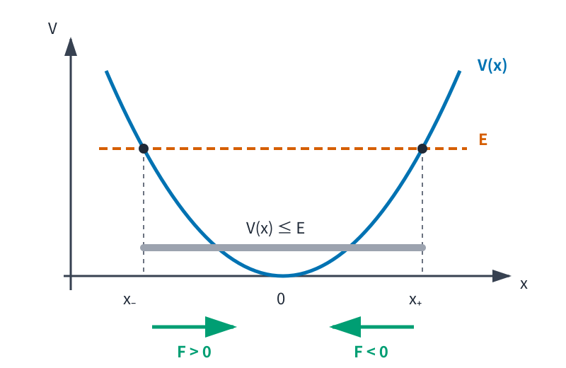

# MECH3 仕事・エネルギー・ポテンシャル

<!-- definition-example-audit: strict -->

> **既出概念**：[MECH2 Newton の運動法則と運動方程式](../MECH2/index.md)を使います。高校物理は前提にしません。

MECH2 では、力のモデルを決めると

$$
m\ddot q=F(q,\dot q,t)
$$

という運動方程式が得られ、位置と速度の初期値から軌道を求められることを学びました。

しかし、毎回この微分方程式を時刻ごとに解くのが最も見通しのよい方法とは限りません。

たとえば、ばねにつながれた物体が「どこまで進めるか」だけを知りたいなら、軌道 $x(t)$ の公式を先に求めなくても、速度と位置の間に保存される量があれば十分です。

本章では

$$
\boxed{
\text{力}
\longrightarrow
\text{仕事}
\longrightarrow
\text{運動エネルギー}
\longrightarrow
\text{ポテンシャル}
\longrightarrow
\text{力学的エネルギー保存}
}
$$

という道具を作ります。

重要なのは、エネルギー保存を最初から独立した魔法の法則として置かないことです。本章では、Newton の第2法則と保存力の形から、どの条件で力学的エネルギーが一定になるかを導きます。

---

## 1. 仕事：力が軌道に沿って運動へ渡す量

同じ大きさの力でも、物体の進行方向と同じ向きに押す場合と、横向きに押す場合とでは速度の変わり方が違います。

そこで、力の大きさだけでなく

- 力の向き
- 実際に動いた向き
- どれだけ動いたか

を一つの量にまとめます。

<!-- formal-statement-start -->
### 定義（仕事）

時刻区間 $[t_0,t_1]$ で質点の軌道を

$$
q:[t_0,t_1]\to\mathbb R^n
$$

とし、$q$ は連続微分可能とする。

質点に力

$$
F(q(t),\dot q(t),t)
$$

が働くとき、この力が区間 $[t_0,t_1]$ で行う **仕事** を

$$
\boxed{
W_{t_0\to t_1}[F]
=
\int_{t_0}^{t_1}
F(q(t),\dot q(t),t)
\cdot
\dot q(t)\,dt
}
$$

で定める。

仕事の SI 単位は J（joule）であり、

$$
1\ \mathrm{J}
=
1\ \mathrm{N\,m}
$$

とする。
<!-- formal-statement-end -->

<!-- definition-example-start: def-mech3-work -->

### **定義の確認**：一定の力で直線上を動かす

一次元で一定の力

$$
F=5\ \mathrm{N}
$$

が働き、物体が

$$
x(0)=1\ \mathrm{m},
\qquad
x(2)=4\ \mathrm{m}
$$

と動いたとします。

一次元では内積は通常の積なので、

$$
W
=
\int_0^2 F\dot x(t)\,dt.
$$

$F=5$ は一定だから

$$
\begin{aligned}
W
&=
5\int_0^2\dot x(t)\,dt\\
&=
5\bigl(x(2)-x(0)\bigr)\\
&=
5(4-1)\\
&=
15\ \mathrm{J}.
\end{aligned}
$$

同じ距離を逆向きに動けば $x(2)-x(0)<0$ となり、仕事は負になります。仕事は距離だけでなく、力と変位の向きを含む量です。

<!-- definition-example-end -->

### 1.1 力が速度と直交すると瞬間的な仕事率は 0

仕事の積分の中身

$$
F\cdot\dot q
$$

は単位時間あたりに仕事が増える速さを表します。

$$
\frac{dW}{dt}
=
F\cdot\dot q
$$

なので、力と速度が直交していれば

$$
F\cdot\dot q=0.
$$

この場合、その力は瞬間的には運動エネルギーを増減させません。

後の中心力では、この「力の向き」と「速度の向き」の関係が重要になります。

---

## 2. 運動エネルギーと仕事―エネルギー定理

Newton の第2法則は加速度を与えますが、仕事の積分には速度が現れます。そこで

$$
m\ddot q\cdot\dot q
$$

を、速度だけから作られる量の時間微分として読み替えます。

<!-- formal-statement-start -->
### 定義（運動エネルギー）

一定質量 $m>0$ の質点が速度 $v$ を持つとき、

$$
\boxed{
K(v)
=
\frac12m\lVert v\rVert^2
}
$$

をその質点の **運動エネルギー** と定める。
<!-- formal-statement-end -->

<!-- definition-example-start: def-mech3-kinetic-energy -->

### **定義の確認**：質量 2 kg、速さ 3 m/s

$$
m=2\ \mathrm{kg},
\qquad
\lVert v\rVert=3\ \mathrm{m/s}
$$

なら、

$$
K
=
\frac12\cdot2\cdot3^2
=
9\ \mathrm{J}.
$$

単位も

$$
\mathrm{kg}\,
\frac{\mathrm m^2}{\mathrm s^2}
=
\mathrm{N\,m}
=
\mathrm J
$$

となり、仕事と同じ次元です。

<!-- definition-example-end -->

仕事と運動エネルギーが同じ単位なのは偶然ではありません。

<!-- formal-statement-start -->
### 定理（仕事―エネルギー定理）

一定質量 $m>0$ の質点が、慣性系で区間 $[t_0,t_1]$ において

$$
m\ddot q(t)
=
F_{\mathrm{net}}(q(t),\dot q(t),t)
$$

を満たすとする。$q$ は二回連続微分可能とする。

このとき合力のした仕事は運動エネルギーの変化に等しく、

$$
\boxed{
K(t_1)-K(t_0)
=
W_{t_0\to t_1}[F_{\mathrm{net}}]
}
$$

が成り立つ。
<!-- formal-statement-end -->

### 証明の見取り図

Newton 方程式の両辺と速度 $\dot q$ の内積を取ります。左辺は

$$
m\ddot q\cdot\dot q
$$

ですが、これは $rac12m\lVert\dot q\rVert^2$ の時間微分です。

<!-- proof-start -->
### 証明

運動エネルギーを時刻の関数として

$$
K(t)
=
\frac12m\lVert\dot q(t)\rVert^2
$$

と書きます。

内積を成分表示すると

$$
\lVert\dot q(t)\rVert^2
=
\sum_{i=1}^n \dot q_i(t)^2.
$$

従って各成分を微分して

$$
\begin{aligned}
\frac{dK}{dt}
&=
\frac12m
\frac{d}{dt}
\sum_{i=1}^n\dot q_i^2\\
&=
\frac12m
\sum_{i=1}^n
2\dot q_i\ddot q_i\\
&=
m\dot q\cdot\ddot q.
\end{aligned}
$$

[Newton の第2法則](../MECH2/index.md#principle-mech2-newton-second)から

$$
m\ddot q=F_{\mathrm{net}}
$$

なので、

$$
\frac{dK}{dt}
=
F_{\mathrm{net}}\cdot\dot q.
$$

$t_0$ から $t_1$ まで積分すると

$$
K(t_1)-K(t_0)
=
\int_{t_0}^{t_1}
F_{\mathrm{net}}\cdot\dot q\,dt.
$$

右辺は[仕事の定義](#def-mech3-work)そのものだから、

$$
K(t_1)-K(t_0)
=
W_{t_0\to t_1}[F_{\mathrm{net}}].
$$

<!-- proof-end -->

この定理によって、時間 $t$ を消去して「どの位置でどれだけ速いか」を求められる場合が生まれます。

---

## 3. 保存力とポテンシャルエネルギー

一般の力の仕事は、始点と終点だけでは決まりません。途中でどの経路を通ったかに依存することがあります。

一方、ばねの力や地表近くの重力では、力をあるスカラー関数の傾きから作れます。

多変数微積分で、スカラー関数 $V(q)$ の勾配を

$$
\nabla V
=
\begin{pmatrix}
\partial V/\partial q_1\\
\vdots\\
\partial V/\partial q_n
\end{pmatrix}
$$

と書きます。

「高い $V$ の方向」が $\nabla V$ であり、その反対向き

$$
-\nabla V
$$

へ力が向くモデルを考えます。

<!-- formal-statement-start -->
### 定義（保存力・ポテンシャルエネルギー）

領域 $U\subset\mathbb R^n$ 上の位置だけに依存する力

$$
F:U\to\mathbb R^n
$$

を考える。

連続微分可能なスカラー関数

$$
V:U\to\mathbb R
$$

が存在して

$$
\boxed{
F(q)
=
-\nabla V(q)
}
$$

と書けるとき、本章では $F$ を **保存力** と呼び、$V$ をその **ポテンシャルエネルギー** と呼ぶ。
<!-- formal-statement-end -->

<!-- definition-example-start: def-mech3-conservative-potential -->

### **定義の確認**：Hooke のばね力

一次元で MECH2 の Hooke の力

$$
F(x)=-kx,
\qquad
k>0
$$

を考えます。

$$
V(x)=\frac12kx^2
$$

と置くと、

$$
\frac{dV}{dx}
=
kx.
$$

従って

$$
-\frac{dV}{dx}
=
-kx
=
F(x).
$$

よって、このばね力は定義の条件

$$
F=-V'
$$

を満たす保存力であり、

$$
V(x)=\frac12kx^2
$$

をポテンシャルエネルギーとして選べます。

<!-- definition-example-end -->

### 3.1 ポテンシャルのゼロ点は任意にずらせる

定数 $C$ に対して

$$
\widetilde V(q)=V(q)+C
$$

と置いても、

$$
\nabla\widetilde V
=
\nabla V
$$

です。

従って

$$
-\nabla\widetilde V
=
-\nabla V
=
F.
$$

力を決めるのはポテンシャルの絶対値ではなく、その空間的な変化です。

---

## 4. 保存力の仕事はポテンシャル差だけで決まる

保存力では、仕事の積分に含まれる経路依存性が消えます。

<!-- formal-statement-start -->
### 命題（保存力の仕事とポテンシャル差）

$F=-\nabla V$ が保存力であり、$q:[t_0,t_1]\to U$ が連続微分可能な軌道であるとする。

このとき

$$
\boxed{
W_{t_0\to t_1}[F]
=
V(q(t_0))-V(q(t_1))
}
$$

が成り立つ。
<!-- formal-statement-end -->

### 証明の見取り図

$V(q(t))$ を時間で微分します。多変数の連鎖律により

$$
\frac{d}{dt}V(q(t))
=
\nabla V(q(t))\cdot\dot q(t).
$$

ここへ $F=-\nabla V$ を代入します。

<!-- proof-start -->
### 証明

多変数の連鎖律から

$$
\frac{d}{dt}V(q(t))
=
\nabla V(q(t))\cdot\dot q(t).
$$

保存力の定義

$$
F(q(t))
=
-\nabla V(q(t))
$$

を代入すると、

$$
F(q(t))\cdot\dot q(t)
=
-
\frac{d}{dt}V(q(t)).
$$

$t_0$ から $t_1$ まで積分して

$$
\begin{aligned}
W_{t_0\to t_1}[F]
&=
\int_{t_0}^{t_1}
F(q(t))\cdot\dot q(t)\,dt\\
&=
-
\int_{t_0}^{t_1}
\frac{d}{dt}V(q(t))\,dt\\
&=
-
\bigl(
V(q(t_1))-V(q(t_0))
\bigr)\\
&=
V(q(t_0))-V(q(t_1)).
\end{aligned}
$$

<!-- proof-end -->

したがって、保存力の仕事は途中の軌道ではなく始点と終点だけで決まります。

特に閉じた軌道で始点と終点が同じなら、

$$
W=0.
$$

---

## 5. 力学的エネルギー保存

仕事―エネルギー定理は

$$
\Delta K=W
$$

を与え、保存力の仕事は

$$
W=-\Delta V
$$

と書けました。

二つを合わせると、

$$
\Delta K=-\Delta V
$$

です。

そこで $K$ と $V$ の和を一つの量として追います。

<!-- formal-statement-start -->
### 定義（力学的エネルギー）

一定質量 $m>0$ の質点が位置 $q$、速度 $v$ を持ち、位置に依存するポテンシャルエネルギー $V(q)$ が与えられているとする。

$$
\boxed{
E(q,v)
=
\frac12m\lVert v\rVert^2+V(q)
}
$$

を **力学的エネルギー** と定める。
<!-- formal-statement-end -->

<!-- definition-example-start: def-mech3-mechanical-energy -->

### **定義の確認**：ばねにつながれた質点

一次元で

$$
V(x)=\frac12kx^2
$$

なら、

$$
E(x,v)
=
\frac12mv^2
+
\frac12kx^2.
$$

たとえば

$$
m=2,
\qquad
k=8,
\qquad
x=0.50,
\qquad
v=1
$$

なら、

$$
\begin{aligned}
E
&=
\frac12\cdot2\cdot1^2
+
\frac12\cdot8\cdot0.50^2\\
&=
1+1\\
&=
2.
\end{aligned}
$$

SI 単位で値を入れたなら

$$
E=2\ \mathrm J.
$$

<!-- definition-example-end -->

<!-- formal-statement-start -->
### 定理（力学的エネルギー保存）

一定質量 $m>0$ の質点が、慣性系で

$$
m\ddot q(t)
=
-\nabla V(q(t))
$$

を満たすとする。$V$ は時間に陽には依存しない連続微分可能な関数とする。

このとき

$$
\boxed{
E(t)
=
\frac12m\lVert\dot q(t)\rVert^2
+
V(q(t))
}
$$

は時間に依らず一定である。
<!-- formal-statement-end -->

### 証明の見取り図

仕事―エネルギー定理と保存力の仕事の式を同じ区間に適用すると、

$$
K(t_1)-K(t_0)
=
V(q(t_0))-V(q(t_1))
$$

です。項を移せば $K+V$ が両端で一致します。

<!-- proof-start -->
### 証明

[仕事―エネルギー定理](#thm-mech3-work-energy)により、

$$
K(t_1)-K(t_0)
=
W_{t_0\to t_1}[F].
$$

ここで

$$
F=-\nabla V
$$

なので、[保存力の仕事とポテンシャル差](#prop-mech3-potential-work)から

$$
W_{t_0\to t_1}[F]
=
V(q(t_0))-V(q(t_1)).
$$

従って

$$
K(t_1)-K(t_0)
=
V(q(t_0))-V(q(t_1)).
$$

右辺の $V(q(t_1))$ と左辺の $K(t_0)$ を移項すると、

$$
K(t_1)+V(q(t_1))
=
K(t_0)+V(q(t_0)).
$$

$t_0,t_1$ は任意なので、

$$
E(t)
=
K(t)+V(q(t))
$$

は一定です。

<!-- proof-end -->

### 5.1 「エネルギーはいつでも保存する」ではない

上の定理には条件があります。

- 力が $-\nabla V$ の形の保存力だけである。
- $V$ が時刻 $t$ に陽には依存しない。
- Newton 力学の一定質量モデルを使っている。

摩擦や抵抗力があれば、質点の力学的エネルギー $K+V$ は一般には保存しません。

---

## 6. 非保存力があるときのエネルギー収支

MECH2 の線形抵抗

$$
R=-c\dot q,
\qquad
c>0
$$

は速度に依存します。

運動方程式が

$$
m\ddot q
=
-\nabla V(q)+R
$$

なら、

<!-- formal-statement-start -->
### 命題（非保存力を含むエネルギー収支）

$$
E(t)
=
\frac12m\lVert\dot q(t)\rVert^2
+
V(q(t))
$$

とする。

このとき

$$
\boxed{
\frac{dE}{dt}
=
R\cdot\dot q
}
$$

が成り立つ。

特に $R=-c\dot q$ なら

$$
\boxed{
\frac{dE}{dt}
=
-c\lVert\dot q\rVert^2
\le0
}
$$

である。
<!-- formal-statement-end -->

<!-- proof-start -->
### 証明

運動エネルギーの微分は、仕事―エネルギー定理の証明と同じ計算で

$$
\frac{dK}{dt}
=
m\ddot q\cdot\dot q
$$

です。

運動方程式を代入すると

$$
\frac{dK}{dt}
=
\left(
-\nabla V+R
\right)
\cdot\dot q.
$$

一方、連鎖律から

$$
\frac{dV}{dt}
=
\nabla V\cdot\dot q.
$$

二式を足すと

$$
\begin{aligned}
\frac{dE}{dt}
&=
\frac{dK}{dt}
+
\frac{dV}{dt}\\
&=
-\nabla V\cdot\dot q
+
R\cdot\dot q
+
\nabla V\cdot\dot q\\
&=
R\cdot\dot q.
\end{aligned}
$$

$R=-c\dot q$ なら

$$
R\cdot\dot q
=
-c\lVert\dot q\rVert^2
\le0.
$$

<!-- proof-end -->

抵抗力があると、質点の力学的エネルギーは減少します。そのエネルギーが「消滅した」と考えるのではなく、より大きな系では媒質の内部エネルギーなどへ移ったと考えます。

---

## 7. 一自由度ではポテンシャルの形から運動範囲が読める

一次元の保存力

$$
m\ddot x=-V'(x)
$$

を考えます。

力学的エネルギーが一定値 $E$ なら

$$
\frac12m\dot x^2+V(x)=E.
$$

従って

$$
\boxed{
\dot x^2
=
\frac{2}{m}
\bigl(
E-V(x)
\bigr)
}
$$

です。

左辺は 0 以上なので、実際に運動できる位置では必ず

$$
\boxed{
V(x)\le E
}
$$

でなければなりません。

これだけで、微分方程式を明示的に解く前に「どこへ行けるか」が分かります。

### 7.1 転回点

運動範囲の端では速度が 0 になります。ただし、$V(x)=E$ を満たすすべての点で必ず普通の意味の「折り返し」が起こるとは限りません。

<!-- formal-statement-start -->
### 定義（転回点）

一次元運動 $x(t)$ について、時刻 $t_*$ で

$$
\dot x(t_*)=0
$$

となり、$t_*$ の前後で速度の符号が反転して運動方向が変わるとき、位置

$$
x_*=x(t_*)
$$

を **転回点** と呼ぶ。
<!-- formal-statement-end -->

<!-- definition-example-start: def-mech3-turning-point -->

### **定義の確認**：ばねポテンシャルの端点

$$
V(x)=\frac12kx^2,
\qquad
k>0
$$

で、全エネルギーを $E>0$ とします。

$$
V(x)=E
$$

を解くと

$$
x=\pm A,
\qquad
A=\sqrt{\frac{2E}{k}}.
$$

ここでは速度は 0 です。

右端 $x=A$ では

$$
F(A)
=
-V'(A)
=
-kA
<
0,
$$

なので加速度は左向きです。従って右端へ右向きに到達した運動は、その後左向きへ反転します。

左端 $x=-A$ では

$$
F(-A)=kA>0
$$

で加速度は右向きなので、同様に右向きへ反転します。

したがって $\pm A$ は転回点です。

<!-- definition-example-end -->

<!-- formal-statement-start -->
### 命題（許容領域と通常の転回点）

一次元の保存力運動

$$
m\ddot x=-V'(x)
$$

で全エネルギーを $E$ とする。

1. 軌道が通過できる位置では $V(x)\le E$ が必要である。
2. $V(x_*)=E$ なら、その位置で速度は 0 である。
3. さらに $V'(x_*)\ne0$ で、軌道が有限時刻に $x_*$ へ到達するなら、$x_*$ は転回点である。
<!-- formal-statement-end -->

<!-- proof-start -->
### 証明

エネルギー保存から

$$
\frac12m\dot x^2
=
E-V(x).
$$

$m>0$ かつ左辺は 0 以上なので、

$$
E-V(x)\ge0,
$$

すなわち

$$
V(x)\le E
$$

が必要です。

$V(x_*)=E$ なら

$$
\frac12m\dot x^2=0
$$

だから

$$
\dot x=0.
$$

さらに $V'(x_*)\ne0$ なら、運動方程式から

$$
\ddot x(t_*)
=
-\frac1mV'(x_*)
\ne0.
$$

速度を $t_*$ の近くで一次まで展開すると

$$
\dot x(t)
=
\ddot x(t_*)
(t-t_*)
+
o(|t-t_*|).
$$

主項の係数 $\ddot x(t_*)$ は 0 ではないため、十分 $t_*$ に近い範囲では $t-t_*$ の符号が変わると速度の符号も反転します。

従って運動方向が変わり、$x_*$ は転回点です。

<!-- proof-end -->

### 7.2 図でポテンシャル・力・転回点を同時に読む

ばね型の

$$
V(x)=\frac12kx^2
$$

を例にします。

下図では水平線 $E$ とポテンシャルの交点が $x_-,x_+$ です。中央の $V(x)<E$ の範囲だけが許容領域で、左右の交点では速度が 0 になります。

また

$$
F(x)=-V'(x)=-kx
$$

なので、$x<0$ では力は右向き、$x>0$ では左向きです。力はポテンシャルを下る向きを向きます。

ポテンシャル図は軌道 $x(t)$ そのものではありません。横軸は時間ではなく位置 $x$、縦軸はエネルギーです。

この区別を保つと、「グラフ上を粒子が滑る」という誤読を避けられます。

---

## 8. エネルギー曲線を位相平面で読む

一自由度では、位置 $x$ と速度 $v=\dot x$ を組にして

$$
(x,v)
$$

を考えると、エネルギー一定条件は位相平面上の曲線になります。

$$
\frac12mv^2+V(x)=E
$$

から

$$
\boxed{
v
=
\pm
\sqrt{
\frac{2}{m}
\bigl(E-V(x)\bigr)
}
}
$$

です。

たとえば

$$
V(x)=\frac12kx^2
$$

なら

$$
\frac12mv^2
+
\frac12kx^2
=
E.
$$

$$
A
=
\sqrt{\frac{2E}{k}},
\qquad
\omega
=
\sqrt{\frac{k}{m}}
$$

と置くと、

$$
\boxed{
\frac{x^2}{A^2}
+
\frac{v^2}{\omega^2A^2}
=
1
}
$$

となり、位相平面では楕円です。

ここではまだ $x(t)$ の正弦・余弦表示を使っていません。それでも保存量だけから、運動が楕円上に閉じ込められることが分かります。

振動の時間発展は MECH5 で詳しく扱います。

---

## 9. 二つの基本ポテンシャル

### 9.1 地表近くの重力

鉛直上向きを $y$ 軸正方向とすると、

$$
F_y=-mg.
$$

$$
V(y)=mgy
$$

なら

$$
-\frac{dV}{dy}
=
-mg
=
F_y.
$$

したがって、空気抵抗を無視した鉛直運動では

$$
\frac12m\dot y^2+mgy
=
E
$$

が一定です。

初期高さ $y_0$、初速度 $v_0$ なら、

$$
\frac12mv^2+mgy
=
\frac12mv_0^2+mgy_0.
$$

質量 $m>0$ で割ると、

$$
\boxed{
v^2
=
v_0^2
+
2g(y_0-y)
}
$$

が得られます。

これは時刻 $t$ を求めずに、位置と速さを直接結ぶ式です。

### 9.2 ばね

$$
F=-kx
$$

に対して

$$
V(x)=\frac12kx^2.
$$

したがって

$$
\boxed{
\frac12m\dot x^2
+
\frac12kx^2
=
E
}
$$

です。

最大変位で速度が 0 なら、最大変位を $A>0$ として

$$
E=\frac12kA^2.
$$

平衡位置 $x=0$ ではポテンシャルが最小なので、速さが最大になります。

---

## 10. $p^2/(2m)+V$ への最初の橋

後の解析力学・量子力学では、速度だけでなく運動量を変数として使います。

一定質量の質点について、古典的な運動量を

$$
p=m\dot q
$$

と書くと、

$$
\dot q=\frac{p}{m}.
$$

従って運動エネルギーは

$$
\begin{aligned}
K
&=
\frac12m\lVert\dot q\rVert^2\\
&=
\frac12m
\left\lVert
\frac{p}{m}
\right\rVert^2\\
&=
\frac{\lVert p\rVert^2}{2m}.
\end{aligned}
$$

よって、時間に依らないポテンシャル中の古典的な力学的エネルギーは

$$
\boxed{
E
=
\frac{\lVert p\rVert^2}{2m}
+
V(q)
}
$$

と書けます。

一自由度なら

$$
\boxed{
E
=
\frac{p^2}{2m}
+
V(q)
}
$$

です。

解析力学では、この形を位相空間上の関数として体系化します。量子力学でも同じ構造が重要になりますが、そこで $p$ の意味は単なる数から変わります。

本章ではまず、

> $p^2/(2m)$ は古典的な運動エネルギー、$V(q)$ は位置に依存するポテンシャルエネルギー

という由来を押さえておけば十分です。

---

## 11. 本章の見取り図

本章では、Newton 方程式を直接解くだけでなく、保存量から運動を読む方法を作りました。

$$
\boxed{
\begin{array}{c}
m\ddot q=F\\
\downarrow\\
W=\displaystyle\int F\cdot dq\\
\downarrow\\
\Delta K=W\\
\downarrow\\
F=-\nabla V\ \Longrightarrow\ W=-\Delta V\\
\downarrow\\
K+V=\text{constant}
\end{array}
}
$$

特に次を区別できることが重要です。

- 仕事は力と実際の変位方向の内積を積分した量である。
- 運動エネルギーの変化は合力の仕事に等しい。
- 保存力は $F=-\nabla V$ と書ける。
- 保存力だけなら $K+V$ が保存する。
- 抵抗力などがあれば、質点の力学的エネルギーは一般に保存しない。
- 一自由度では $V(x)\le E$ が許容領域を決める。
- $V(x)=E$ は速度 0 の候補を与えるが、通常の転回には $V'(x)\ne0$ という追加情報が効く。

次の MECH4 では、別の保存量である運動量・角運動量を導入し、力積・トルクと保存則を結びます。

---

# 演習

## Level A

### A1. 一定力の仕事

一次元で、物体が $x=1\ \mathrm m$ から $x=3\ \mathrm m$ まで動く。

1. 一定の力 $F=5\ \mathrm N$ が正方向に働くとき、仕事を求めよ。
2. 同じ運動で $F=-5\ \mathrm N$ なら仕事を求めよ。
3. 二つの答えの符号の違いを説明せよ。

- Level: A

<!-- solution-start -->
#### 詳細解答

一定力なので[仕事の定義](#def-mech3-work)から

$$
W
=
F(x_1-x_0)
$$

と書けます。

正方向の力では

$$
W
=
5(3-1)
=
\boxed{
10\ \mathrm J
}.
$$

反対向きの力では

$$
W
=
-5(3-1)
=
\boxed{
-10\ \mathrm J
}.
$$

変位は正方向です。

したがって $F>0$ なら力と変位が同方向で正の仕事、$F<0$ なら逆方向で負の仕事になります。

<!-- solution-end -->

---

### A2. 仕事から速さを求める

質量

$$
m=2\ \mathrm{kg}
$$

の質点の初速度の大きさが

$$
v_0=3\ \mathrm{m/s}
$$

である。

その後、合力が質点に

$$
W=7\ \mathrm J
$$

の仕事をした。

1. 初めの運動エネルギーを求めよ。
2. 仕事後の運動エネルギーを求めよ。
3. 仕事後の速さを求めよ。

- Level: A

<!-- solution-start -->
#### 詳細解答

初めの運動エネルギーは

$$
K_0
=
\frac12mv_0^2
=
\frac12\cdot2\cdot3^2
=
9\ \mathrm J.
$$

[仕事―エネルギー定理](#thm-mech3-work-energy)から

$$
K_1-K_0=W.
$$

従って

$$
K_1
=
K_0+W
=
9+7
=
16\ \mathrm J.
$$

$$
K_1=\frac12mv_1^2
$$

なので

$$
16
=
\frac12\cdot2\cdot v_1^2
=
v_1^2.
$$

速さは非負だから

$$
\boxed{
v_1=4\ \mathrm{m/s}
}.
$$

<!-- solution-end -->

---

### A3. 力からポテンシャルを作る

一次元で

$$
F(x)=-4x\ \mathrm N
$$

とする。

1. $F=-dV/dx$ を満たす $V(x)$ を求めよ。
2. $V(0)=0$ を課すと定数はどう決まるか。
3. $x=0$ から $x=2\ \mathrm m$ までこの力がする仕事を求めよ。

- Level: A

<!-- solution-start -->
#### 詳細解答

保存力では

$$
F(x)
=
-\frac{dV}{dx}.
$$

従って

$$
-4x
=
-\frac{dV}{dx},
$$

すなわち

$$
\frac{dV}{dx}
=
4x.
$$

積分して

$$
V(x)
=
2x^2+C.
$$

$V(0)=0$ だから

$$
0=C.
$$

従って

$$
\boxed{
V(x)=2x^2
}.
$$

[保存力の仕事とポテンシャル差](#prop-mech3-potential-work)から

$$
W_{0\to2}
=
V(0)-V(2).
$$

$$
V(0)=0,
\qquad
V(2)=2\cdot2^2=8
$$

なので

$$
\boxed{
W_{0\to2}=-8\ \mathrm J
}.
$$

<!-- solution-end -->

---

### A4. 調和ポテンシャルの許容領域と転回点

質量

$$
m=1\ \mathrm{kg}
$$

の質点が一次元ポテンシャル

$$
V(x)=2x^2\ \mathrm J
$$

の中を運動し、全エネルギーは

$$
E=18\ \mathrm J
$$

で一定とする。

1. 許容領域を求めよ。
2. 転回点を求めよ。
3. $x=0$ での速さを求めよ。
4. $x>0$ で力がどちら向きか答えよ。

- Level: A

<!-- solution-start -->
#### 詳細解答

許容領域では

$$
V(x)\le E
$$

です。

従って

$$
2x^2\le18,
$$

$$
x^2\le9.
$$

よって

$$
\boxed{
-3\le x\le3
}.
$$

転回点候補は

$$
V(x)=E
$$

を満たす点です。

$$
2x^2=18
$$

だから

$$
\boxed{
x=\pm3\ \mathrm m
}.
$$

ここでは $V'(x)=4x$ が 0 ではないので、[許容領域と通常の転回点](#prop-mech3-allowed-region-turning)により通常の転回点です。

$x=0$ では

$$
V(0)=0.
$$

エネルギー保存から

$$
\frac12mv^2=E-V(0)=18.
$$

$m=1$ なので

$$
\frac12v^2=18,
$$

$$
v^2=36.
$$

したがって速さは

$$
\boxed{
|v|=6\ \mathrm{m/s}
}.
$$

力は

$$
F=-V'(x)=-4x.
$$

$x>0$ なら $F<0$ なので、負方向すなわち原点へ向きます。

<!-- solution-end -->

---

## Level B

### B1. 二次元ポテンシャルと経路に依らない仕事

二次元で

$$
V(x,y)
=
a(x^2+2y^2),
\qquad
a>0
$$

とする。

1. $F=-\nabla V$ から力 $F(x,y)$ を求めよ。
2. 点 $A=(1,0)$ から点 $B=(0,1)$ まで移動するとき、保存力がする仕事を求めよ。
3. 答えが途中の経路に依らない理由を説明せよ。

- Level: B

<!-- solution-start -->
#### 詳細解答

まず偏微分すると

$$
\frac{\partial V}{\partial x}
=
2ax,
$$

$$
\frac{\partial V}{\partial y}
=
4ay.
$$

従って

$$
\nabla V
=
\begin{pmatrix}
2ax\\
4ay
\end{pmatrix}.
$$

保存力は

$$
F=-\nabla V
$$

だから

$$
\boxed{
F(x,y)
=
\begin{pmatrix}
-2ax\\
-4ay
\end{pmatrix}
}.
$$

ポテンシャルの値は

$$
V(A)
=
a(1^2+0)
=
a,
$$

$$
V(B)
=
a(0+2\cdot1^2)
=
2a.
$$

[保存力の仕事とポテンシャル差](#prop-mech3-potential-work)から

$$
W_{A\to B}
=
V(A)-V(B)
=
a-2a.
$$

従って

$$
\boxed{
W_{A\to B}=-a
}.
$$

保存力では仕事が始点と終点のポテンシャル差だけで表されるため、途中の経路には依存しません。

<!-- solution-end -->

---

### B2. 重力と線形抵抗があると力学的エネルギーはどう変わるか

鉛直上向きを $y$ 軸正方向とする。

質量 $m>0$ の質点に、重力と線形抵抗だけが働くとする。

$$
F_g=-mg,
\qquad
F_d=-c\dot y,
\qquad
c>0.
$$

1. 運動方程式を立てよ。
2. 
   $$
   E(t)=\frac12m\dot y^2+mgy
   $$
   と置き、$dE/dt$ を求めよ。
3. $dot y\ne0$ のとき $E$ が減少することを示せ。
4. 上昇中と下降中のどちらでも同じ結論になる理由を説明せよ。

- Level: B

<!-- solution-start -->
#### 詳細解答

上向きを正に取っているので、重力は $-mg$、抵抗力は速度と反対向きに

$$
-c\dot y
$$

です。

従って運動方程式は

$$
\boxed{
m\ddot y
=
-mg-c\dot y
}.
$$

エネルギーを微分すると

$$
\begin{aligned}
\frac{dE}{dt}
&=
\frac{d}{dt}
\left(
\frac12m\dot y^2+mgy
\right)\\
&=
m\dot y\ddot y
+
mg\dot y\\
&=
\dot y
\left(
m\ddot y+mg
\right).
\end{aligned}
$$

運動方程式から

$$
m\ddot y+mg
=
-c\dot y.
$$

従って

$$
\boxed{
\frac{dE}{dt}
=
-c\dot y^2
}.
$$

$c>0$ かつ $\dot y\ne0$ なら

$$
-c\dot y^2<0.
$$

従って運動中は

$$
\boxed{
\frac{dE}{dt}<0
}
$$

です。

上昇中では $\dot y>0$、下降中では $\dot y<0$ ですが、式には $\dot y^2$ が現れます。

したがってどちらの場合も抵抗力は運動方向と逆向きで、負の仕事をし、質点の力学的エネルギーを減少させます。

<!-- solution-end -->

---

### B3. 二重井戸ポテンシャルの許容領域

一次元ポテンシャル

$$
V(x)
=
a(x^2-b^2)^2,
\qquad
a>0,
\quad
b>0
$$

を考える。

質点の全エネルギーが

$$
E
=
\frac14ab^4
$$

であるとする。

1. 許容領域 $V(x)\le E$ を求めよ。
2. $V(x)=E$ を満たす転回点候補をすべて求めよ。
3. それらで $V'(x)\ne0$ を確認し、通常の転回点であることを示せ。
4. 速さが最大になる位置と、その最大速さを求めよ。質量を $m$ とする。

- Level: B

<!-- solution-start -->
#### 詳細解答

許容条件は

$$
a(x^2-b^2)^2
\le
\frac14ab^4.
$$

$a>0$ で割ると

$$
(x^2-b^2)^2
\le
\frac14b^4.
$$

両辺の平方根を取って

$$
|x^2-b^2|
\le
\frac12b^2.
$$

従って

$$
-\frac12b^2
\le
x^2-b^2
\le
\frac12b^2.
$$

両辺に $b^2$ を足すと

$$
\frac12b^2
\le
x^2
\le
\frac32b^2.
$$

よって許容領域は二つに分かれ、

$$
\boxed{
-\sqrt{\frac32}b
\le
x
\le
-\frac{b}{\sqrt2}
}
$$

または

$$
\boxed{
\frac{b}{\sqrt2}
\le
x
\le
\sqrt{\frac32}b
}
$$

です。

転回点候補は等号

$$
(x^2-b^2)^2
=
\frac14b^4
$$

を満たす点です。

従って

$$
x^2-b^2
=
\pm\frac12b^2.
$$

よって

$$
x^2
=
\frac12b^2
$$

または

$$
x^2
=
\frac32b^2.
$$

従って候補は

$$
\boxed{
x
=
\pm\frac{b}{\sqrt2},
\qquad
x
=
\pm\sqrt{\frac32}b
}.
$$

微分すると

$$
V'(x)
=
4ax(x^2-b^2).
$$

上の四点では $x\ne0$ かつ

$$
x^2-b^2
=
\pm\frac12b^2
\ne0
$$

なので

$$
V'(x)\ne0.
$$

したがって、軌道が到達すれば [許容領域と通常の転回点](#prop-mech3-allowed-region-turning)により四点はいずれも通常の転回点です。

速さは

$$
\frac12mv^2
=
E-V(x)
$$

から、$V$ が最小の位置で最大になります。

$$
V(x)\ge0
$$

で、

$$
V(\pm b)=0.
$$

従って最大速さは $x=\pm b$ で達成され、

$$
\frac12mv_{\max}^2
=
E
=
\frac14ab^4.
$$

よって

$$
v_{\max}^2
=
\frac{ab^4}{2m},
$$

$$
\boxed{
v_{\max}
=
b^2
\sqrt{
\frac{a}{2m}
}
}.
$$

<!-- solution-end -->

---

## Level C

### C1. 臨界エネルギーでは $V(x)=E$ でも普通の転回点とは限らない

一次元ポテンシャル

$$
V(x)
=
V_0
\left(
1-\frac{x^2}{a^2}
\right)^2,
\qquad
V_0>0,
\quad
a>0
$$

を考える。

質量 $m>0$ の質点が

$$
m\ddot x=-V'(x)
$$

に従い、全エネルギーが

$$
E=V_0
$$

であるとする。

1. 力 $F(x)=-V'(x)$ を求めよ。
2. 許容領域を求めよ。
3. $V(x)=E$ を満たす点をすべて求めよ。
4. そのうち $V'(x)\ne0$ の点を特定し、通常の転回点を求めよ。
5. $x=0$ でも $V(0)=E$ かつ速度 0 となるが、なぜ [許容領域と通常の転回点](#prop-mech3-allowed-region-turning)だけでは通常の転回点と結論できないか説明せよ。
6. $x=\pm a$ での速さを求めよ。
7. $x=0$ 近傍で $E-V(x)$ の最低次の項を求め、
   $$
   |\dot x|
   \sim
   \lambda |x|
   $$
   の形になる定数 $\lambda$ を求めよ。これを用いて、臨界エネルギーの軌道が $x=0$ へ有限時間で到達しない場合がある理由を説明せよ。

- Level: C

<!-- solution-start -->
#### 詳細解答

まず

$$
V(x)
=
V_0
\left(
1-\frac{x^2}{a^2}
\right)^2
$$

を微分します。

連鎖律により

$$
\begin{aligned}
V'(x)
&=
V_0
\cdot
2
\left(
1-\frac{x^2}{a^2}
\right)
\cdot
\left(
-\frac{2x}{a^2}
\right)\\
&=
-\frac{4V_0x}{a^2}
\left(
1-\frac{x^2}{a^2}
\right).
\end{aligned}
$$

従って力は

$$
\boxed{
F(x)
=
\frac{4V_0x}{a^2}
\left(
1-\frac{x^2}{a^2}
\right)
}.
$$

許容条件は

$$
V(x)\le E=V_0.
$$

$V_0>0$ で割ると

$$
\left(
1-\frac{x^2}{a^2}
\right)^2
\le1.
$$

これは

$$
-1
\le
1-\frac{x^2}{a^2}
\le1.
$$

右側の不等式から

$$
-\frac{x^2}{a^2}\le0
$$

で、これは常に成り立ちます。

左側から

$$
1-\frac{x^2}{a^2}
\ge-1,
$$

従って

$$
\frac{x^2}{a^2}
\le2.
$$

よって許容領域は

$$
\boxed{
|x|
\le
\sqrt2\,a
}.
$$

次に

$$
V(x)=E
$$

を解きます。

$$
\left(
1-\frac{x^2}{a^2}
\right)^2
=
1
$$

なので

$$
1-\frac{x^2}{a^2}
=
\pm1.
$$

$+1$ の場合は

$$
x=0.
$$

$-1$ の場合は

$$
\frac{x^2}{a^2}=2,
$$

従って

$$
x=\pm\sqrt2\,a.
$$

よって候補は

$$
\boxed{
x=0,
\qquad
x=\pm\sqrt2\,a
}.
$$

微分

$$
V'(x)
=
-\frac{4V_0x}{a^2}
\left(
1-\frac{x^2}{a^2}
\right)
$$

を調べます。

$x=\pm\sqrt2 a$ では

$$
1-\frac{x^2}{a^2}
=
-1
$$

かつ $x\ne0$ なので

$$
V'(\pm\sqrt2 a)\ne0.
$$

従って

$$
\boxed{
x=\pm\sqrt2 a
}
$$

は通常の転回点です。

一方、

$$
V'(0)=0.
$$

従って $x=0$ では

$$
\ddot x
=
-\frac1mV'(0)
=
0.
$$

[許容領域と通常の転回点](#prop-mech3-allowed-region-turning)の第3項は $V'(x_*)\ne0$ を仮定しているため、この点には適用できません。

実際、

$$
x=0,
\qquad
\dot x=0
$$

を初期状態として置けば、そのまま静止する解

$$
x(t)=0
$$

があります。

従って $V=E$ だけでは「必ず折り返す」とは言えません。

次に $x=\pm a$ では

$$
V(\pm a)=0.
$$

エネルギー保存から

$$
\frac12mv^2
=
E-V
=
V_0.
$$

従って

$$
v^2
=
\frac{2V_0}{m},
$$

速さは

$$
\boxed{
|v|
=
\sqrt{
\frac{2V_0}{m}
}
}.
$$

最後に $x=0$ 近傍を調べます。

展開すると

$$
\begin{aligned}
V(x)
&=
V_0
\left(
1
-
2\frac{x^2}{a^2}
+
\frac{x^4}{a^4}
\right).
\end{aligned}
$$

従って

$$
\begin{aligned}
E-V(x)
&=
V_0-V(x)\\
&=
2V_0\frac{x^2}{a^2}
-
V_0\frac{x^4}{a^4}.
\end{aligned}
$$

$x\to0$ では最低次の項は

$$
E-V(x)
\sim
\frac{2V_0}{a^2}x^2.
$$

エネルギー式

$$
\frac12m\dot x^2
=
E-V(x)
$$

へ代入すると

$$
\frac12m\dot x^2
\sim
\frac{2V_0}{a^2}x^2.
$$

従って

$$
\dot x^2
\sim
\frac{4V_0}{ma^2}x^2,
$$

$$
|\dot x|
\sim
\frac{2}{a}
\sqrt{
\frac{V_0}{m}
}
|x|.
$$

よって

$$
\boxed{
\lambda
=
\frac{2}{a}
\sqrt{
\frac{V_0}{m}
}
}.
$$

$x=0$ へ近づく枝では、概略

$$
\frac{dx}{dt}
\approx
-\lambda x
$$

となります。

時間を分離すると

$$
dt
\approx
-
\frac{dx}{\lambda x}.
$$

正の位置 $x_0$ から $\varepsilon>0$ まで近づくのに必要な時間は

$$
\begin{aligned}
T(\varepsilon)
&\approx
\frac1\lambda
\int_{\varepsilon}^{x_0}
\frac{dx}{x}\\
&=
\frac1\lambda
\log
\frac{x_0}{\varepsilon}.
\end{aligned}
$$

$\varepsilon\to0$ では

$$
\log\frac{x_0}{\varepsilon}
\to\infty.
$$

従って臨界エネルギーでは、軌道が $x=0$ に近づき続けても、有限時間には到達しない枝があり得ます。

これが

$$
V(x)=E
$$

だけでは通常の転回点判定として不十分な理由です。

<!-- solution-end -->
