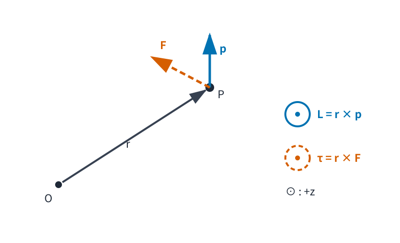

# MECH4 運動量・角運動量・保存則

<!-- definition-example-audit: strict -->

> **既出概念**：[MECH3 仕事・エネルギー・ポテンシャル](../MECH3/index.md)までを使います。高校物理は前提にしません。

MECH3 では、Newton の運動方程式を毎回そのまま解かなくても、

$$
E=\frac12m\lVert \dot q\rVert^2+V(q)
$$

のように時間に依らず一定となる式があれば、運動できる領域や速さを先に読めることを学びました。

ただし、エネルギーだけでは「どちら向きに動いているか」や「回転しようとする向き」を直接表せません。たとえば、同じ速さで右へ動く物体と左へ動く物体は同じ運動エネルギーを持ちますが、衝突や外力への応答は同じではありません。

そこで本章では、まず速度の向きを保ったベクトル量を作り、その時間変化を力と結びます。次に、固定した基準点まわりの回転の向きを測るベクトル量を作り、その時間変化を力の回転効果と結びます。

中心線は

$$
\boxed{
\text{力}
\longrightarrow
\frac{dp}{dt}
\longrightarrow
\text{時間積分で }p\text{ の変化を読む}
}
$$

と

$$
\boxed{
\text{力の回転効果}
\longrightarrow
\frac{dL}{dt}
\longrightarrow
\text{右辺が }0\text{ なら }L\text{ は一定}
}
$$

です。

このような一定量が見つかると、二階の運動方程式をそのまま解く代わりに、より低い階数の関係式から運動を読むことができます。最後に、空間を平行移動しても法則が変わらないこと、向きを回しても法則が変わらないことが、それぞれどの一定量と結び付きそうかを直観として整理します。ただし Noether の定理そのものは解析力学で扱います。

---

## 1. 運動量：速度の向きを残した運動の量

運動エネルギー

$$
K=\frac12m\lVert v\rVert^2
$$

は速度の大きさだけに依存します。したがって $v$ と $-v$ は同じ $K$ を持ちます。

一方、力を受けたときの運動の変化を方向込みで追うには、速度ベクトルそのものに質量を掛けた量が自然です。

<!-- formal-statement-start -->
### 定義（運動量）

一定質量 $m>0$ の質点が速度 $v\in\mathbb R^n$ を持つとき、

$$
\boxed{
p=mv
}
$$

をその質点の **運動量** と定める。

SI 単位は

$$
\mathrm{kg\,m/s}
$$

である。
<!-- formal-statement-end -->

<!-- definition-example-start: def-mech4-linear-momentum -->

### **定義の確認**：同じ速さでも向きが違えば運動量は違う

質量

$$
m=2\ \mathrm{kg}
$$

の質点が一次元で

$$
v=3\ \mathrm{m/s}
$$

なら

$$
p
=
mv
=
2\cdot3
=
6\ \mathrm{kg\,m/s}.
$$

同じ速さで逆向きなら

$$
v=-3\ \mathrm{m/s}
$$

なので

$$
p=-6\ \mathrm{kg\,m/s}.
$$

運動エネルギーはどちらも

$$
K
=
\frac12\cdot2\cdot3^2
=
9\ \mathrm J
$$

ですが、運動量は符号を変えます。

<!-- definition-example-end -->

一定質量なら

$$
p(t)=m\dot q(t)
$$

だから、

$$
\frac{dp}{dt}
=
m\ddot q.
$$

[Newton の第2法則](../MECH2/index.md#principle-mech2-newton-second)

$$
m\ddot q=F_{\mathrm{net}}
$$

を使うと、

$$
\boxed{
\frac{dp}{dt}
=
F_{\mathrm{net}}
}
$$

となります。

これは Newton 方程式を「力は運動量をどの速さで変えるかを決める」と読み替えた式です。

### 1.1 一定質量という仮定

本章では $m$ を一定とします。質量が時間で変化する系では

$$
\frac{d}{dt}(mv)=m\dot v+\dot m\,v
$$

となるため、単純に $F=m\dot v$ と同一視できません。ロケットのような可変質量系は本章の対象外です。

---

## 2. 力積：有限時間にわたる力の効果

瞬間ごとの力が分かっていても、最終的に運動量がどれだけ変わるかを知りたいなら、時間にわたって力を積み上げればよいはずです。

そこで、力を時間にわたって積み上げたベクトル量を次で定義します。

<!-- formal-statement-start -->
### 定義（力積）

時刻区間 $[t_0,t_1]$ で質点に合力

$$
F_{\mathrm{net}}(t)
$$

が働くとする。

この区間の **力積** を

$$
\boxed{
J_{t_0\to t_1}
=
\int_{t_0}^{t_1}
F_{\mathrm{net}}(t)\,dt
}
$$

で定める。

SI 単位は

$$
\mathrm{N\,s}
=
\mathrm{kg\,m/s}
$$

である。
<!-- formal-statement-end -->

<!-- definition-example-start: def-mech4-impulse -->

### **定義の確認**：一定力を 0.5 秒加える

一次元で

$$
F_{\mathrm{net}}=8\ \mathrm N
$$

を

$$
\Delta t=0.5\ \mathrm s
$$

だけ加えると、

$$
J
=
\int_0^{0.5}8\,dt
=
8\cdot0.5
=
4\ \mathrm{N\,s}.
$$

力が負方向なら力積も負になります。力積は大きさだけでなく向きを持つベクトル量です。

<!-- definition-example-end -->

<!-- formal-statement-start -->
### 定理（力積―運動量定理）

一定質量 $m>0$ の質点が慣性系で

$$
\frac{dp}{dt}
=
F_{\mathrm{net}}(t)
$$

を満たすとする。$p$ は連続微分可能、$F_{\mathrm{net}}$ は区間 $[t_0,t_1]$ で積分可能とする。

このとき

$$
\boxed{
p(t_1)-p(t_0)
=
\int_{t_0}^{t_1}
F_{\mathrm{net}}(t)\,dt
}
$$

すなわち

$$
\boxed{
\Delta p=J
}
$$

が成り立つ。
<!-- formal-statement-end -->

### 証明の見取り図

出発点は

$$
\frac{dp}{dt}=F_{\mathrm{net}}.
$$

両辺を時間積分すれば、左辺は運動量の端点差になります。

<!-- proof-start -->
### 証明

$t_0$ から $t_1$ まで積分すると

$$
\int_{t_0}^{t_1}
\frac{dp}{dt}\,dt
=
\int_{t_0}^{t_1}
F_{\mathrm{net}}(t)\,dt.
$$

ベクトルの各成分について微積分学の基本定理を適用すると、

$$
\int_{t_0}^{t_1}
\frac{dp}{dt}\,dt
=
p(t_1)-p(t_0).
$$

したがって

$$
p(t_1)-p(t_0)
=
\int_{t_0}^{t_1}
F_{\mathrm{net}}(t)\,dt
=
J_{t_0\to t_1}.
$$

<!-- proof-end -->

この定理は、力の時間変化が複雑でも「時間積分さえ分かれば最終運動量が分かる」ことを意味します。

---

## 3. 合力が 0 なら運動量は保存する

運動量の時間変化は

$$
\frac{dp}{dt}=F_{\mathrm{net}}
$$

でした。

したがって合力が 0 なら、運動量は変化しません。

<!-- formal-statement-start -->
### 定理（合力が 0 のときの運動量保存）

一定質量 $m>0$ の質点が慣性系で、ある時間区間 $I$ において

$$
F_{\mathrm{net}}(t)=0
$$

を満たすとする。

このとき

$$
\boxed{
p(t)=p_0
\qquad
(t\in I)
}
$$

となり、運動量は区間 $I$ で一定である。
<!-- formal-statement-end -->

<!-- proof-start -->
### 証明

Newton の第2法則を運動量表示で書くと

$$
\frac{dp}{dt}=F_{\mathrm{net}}.
$$

仮定から

$$
F_{\mathrm{net}}=0
$$

なので

$$
\frac{dp}{dt}=0.
$$

従って $p$ は時間に依らない定数ベクトルです。

<!-- proof-end -->

### 3.1 全体が 0 でなくても成分は保存することがある

三次元で

$$
F_{\mathrm{net}}
=
(F_x,F_y,F_z)
$$

なら

$$
\frac{dp_x}{dt}=F_x,
\qquad
\frac{dp_y}{dt}=F_y,
\qquad
\frac{dp_z}{dt}=F_z.
$$

したがって、たとえば

$$
F_x=0
$$

だけが成り立つ場合でも

$$
p_x=\text{constant}
$$

です。

地表近くの重力だけを受ける斜方投射では

$$
F_x=0,
\qquad
F_y=-mg
$$

なので、水平方向の運動量は保存し、鉛直方向の運動量は変化します。

「保存するかしないか」は量全体だけでなく、成分ごとにも調べられます。

---

## 4. 回転を測る前の準備：三次元のベクトル積

基準点まわりの回転を記述するには、単に二つのベクトルの大きさを掛けるだけではなく、「二つの向きが作る平面に対してどちら側へ回そうとしているか」を記録する必要があります。

そのため三次元ではベクトル積を使います。

$$
a=
\begin{pmatrix}
a_1\\
a_2\\
a_3
\end{pmatrix},
\qquad
b=
\begin{pmatrix}
b_1\\
b_2\\
b_3
\end{pmatrix}
$$

に対して、本章では

$$
a\times b
=
\begin{pmatrix}
a_2b_3-a_3b_2\\
a_3b_1-a_1b_3\\
a_1b_2-a_2b_1
\end{pmatrix}
$$

を使います。

特に

$$
a\times a=0,
\qquad
a\times b=-b\times a.
$$

二つのベクトルのなす角を $0\le\theta\le\pi$ とすると、

$$
\lVert a\times b\rVert
=
\lVert a\rVert
\lVert b\rVert
\sin\theta.
$$

従って、二つのベクトルが平行なら

$$
a\times b=0.
$$

ベクトル積の向きは右手系で決めます。

本章で平面運動を扱うときは

$$
q=(x,y,0)
$$

のように $z=0$ の三次元ベクトルとみなします。この場合、ベクトル積は $z$ 成分だけを持ち、

$$
(a\times b)_z
=
a_xb_y-a_yb_x
$$

です。

---

## 5. トルク：力が基準点まわりに回そうとする効果

同じ力でも、基準点のすぐ近くに加える場合と遠くに加える場合では、回そうとする効果が違います。また、位置ベクトルと同じ向きに押しても回転効果はありません。

そこで「基準点からの位置」と「力の向き」をベクトル積で組み合わせます。

<!-- formal-statement-start -->
### 定義（トルク）

慣性系内の固定した基準点 $O$ を取り、質点の $O$ からの位置ベクトルを

$$
r
$$

とする。

質点に合力 $F_{\mathrm{net}}$ が働くとき、$O$ まわりの **トルク** を

$$
\boxed{
\tau_O
=
r\times F_{\mathrm{net}}
}
$$

で定める。

SI 単位は

$$
\mathrm{N\,m}
$$

である。
<!-- formal-statement-end -->

<!-- definition-example-start: def-mech4-torque -->

### **定義の確認**：てこの腕が長いほどトルクが大きい

$$
r=
\begin{pmatrix}
2\\
0\\
0
\end{pmatrix}
\mathrm m,
\qquad
F=
\begin{pmatrix}
0\\
3\\
0
\end{pmatrix}
\mathrm N
$$

なら

$$
\tau_O
=
r\times F
=
\begin{pmatrix}
0\\
0\\
2\cdot3
\end{pmatrix}
=
\begin{pmatrix}
0\\
0\\
6
\end{pmatrix}
\mathrm{N\,m}.
$$

同じ $3\ \mathrm N$ の力でも、位置ベクトルの長さが $1\ \mathrm m$ ならトルクの大きさは $3\ \mathrm{N\,m}$ です。

一方、力が $r$ と平行なら

$$
r\times F=0
$$

であり、基準点まわりの回転効果はありません。

<!-- definition-example-end -->

> **エネルギーとの単位の違い**
>
> トルクの単位 $\mathrm{N\,m}$ はエネルギーの単位 $\mathrm J=\mathrm{N\,m}$ と次元としては同じです。しかし意味は異なります。エネルギーはスカラー、トルクは向きを持つベクトル量です。単位だけから同じ物理量だと判断してはいけません。

---

## 6. 角運動量：基準点まわりの運動を測る

回転効果を生む力側の量がトルクなら、運動している質点側にも、それに対応する量が必要です。

位置ベクトルと運動量をベクトル積で組み合わせます。

<!-- formal-statement-start -->
### 定義（角運動量）

固定した基準点 $O$ からの位置ベクトルを $r$、質点の運動量を $p$ とする。

$O$ まわりの **角運動量** を

$$
\boxed{
L_O
=
r\times p
}
$$

で定める。

SI 単位は

$$
\mathrm{kg\,m^2/s}
$$

である。
<!-- formal-statement-end -->

<!-- definition-example-start: def-mech4-angular-momentum -->

### **定義の確認**：位置と運動量が直交する場合

$$
r=
\begin{pmatrix}
2\\
0\\
0
\end{pmatrix}
\mathrm m,
\qquad
p=
\begin{pmatrix}
0\\
4\\
0
\end{pmatrix}
\mathrm{kg\,m/s}
$$

なら

$$
L_O
=
r\times p
=
\begin{pmatrix}
0\\
0\\
8
\end{pmatrix}
\mathrm{kg\,m^2/s}.
$$

運動量が同じでも基準点から遠いほど、また位置ベクトルと運動量がより直交するほど、角運動量の大きさは大きくなります。

<!-- definition-example-end -->

### 6.1 図で $r,p,F,L,\tau$ の関係を読む

次の図では、$O$ を固定した基準点、$P$ を質点の位置とします。

位置ベクトル $r$ は $O$ から $P$ へ引きます。一方、運動量 $p$ と力 $F$ は、どちらも質点 $P$ を始点として描いています。

図の配置では

$$
r\times p
$$

と

$$
r\times F
$$

はいずれも正の $z$ 方向です。記号 $\odot$ は紙面の手前向きを表します。

この図で重要なのは、矢印の長さそのものではなく、

- $r$ の始点は基準点 $O$
- $p$ と $F$ の始点は質点 $P$
- $L$ と $\tau$ の向きはベクトル積で決まる

という対応です。

---

## 7. 角運動量の時間変化はトルクに等しい

運動量について

$$
\frac{dp}{dt}=F_{\mathrm{net}}
$$

が成り立ちました。

角運動量についても、時間微分するとトルクが現れます。

<!-- formal-statement-start -->
### 定理（角運動量の時間変化とトルク）

一定質量 $m>0$ の質点が慣性系で運動し、固定した基準点 $O$ からの位置ベクトルを $r(t)$ とする。

$$
p(t)=m\dot r(t),
\qquad
L_O(t)=r(t)\times p(t),
\qquad
\tau_O(t)=r(t)\times F_{\mathrm{net}}(t)
$$

とする。

このとき

$$
\boxed{
\frac{dL_O}{dt}
=
\tau_O
}
$$

が成り立つ。
<!-- formal-statement-end -->

### 証明の見取り図

積の微分と同じように、ベクトル積も両方の因子を微分します。

$$
\frac{d}{dt}(r\times p)
=
\dot r\times p
+
r\times\dot p.
$$

第1項は $p=m\dot r$ により同じ向きのベクトル同士のベクトル積となって消えます。

<!-- proof-start -->
### 証明

角運動量の定義から

$$
L_O=r\times p.
$$

各成分を微分します。例えば第1成分は

$
(L_O)_1=r_2p_3-r_3p_2
$

なので、

$
\frac{d}{dt}(L_O)_1
=
\dot r_2p_3+r_2\dot p_3
-
\dot r_3p_2-r_3\dot p_2.
$

これは

$
(\dot r\times p)_1+(r\times\dot p)_1
$

に等しいです。第2・第3成分も同じ積の微分で計算できるため、

$
\frac{dL_O}{dt}
=
\dot r\times p
+
r\times\dot p.
$

ここで

$$
p=m\dot r
$$

なので

$$
\dot r\times p
=
\dot r\times(m\dot r)
=
m(\dot r\times\dot r)
=
0.
$$

また Newton の第2法則から

$$
\dot p
=
F_{\mathrm{net}}.
$$

したがって

$$
\begin{aligned}
\frac{dL_O}{dt}
&=
0+r\times F_{\mathrm{net}}\\
&=
\tau_O.
\end{aligned}
$$

<!-- proof-end -->

この証明で「基準点 $O$ が慣性系内で固定されている」という条件は重要です。基準点自体が動く場合には

$$
\dot r
$$

が単純な質点速度と一致せず、追加項が現れます。

---

## 8. トルクが 0 なら角運動量は保存する

前節の式

$$
\frac{dL_O}{dt}
=
\tau_O
$$

から、トルクが 0 なら角運動量は変化しません。

<!-- formal-statement-start -->
### 定理（トルクが 0 のときの角運動量保存）

一定質量の質点が慣性系で運動し、固定基準点 $O$ まわりの合トルクが時間区間 $I$ で

$$
\tau_O(t)=0
$$

を満たすとする。

このとき

$$
\boxed{
L_O(t)=L_0
\qquad
(t\in I)
}
$$

となり、$O$ まわりの角運動量は保存する。
<!-- formal-statement-end -->

<!-- proof-start -->
### 証明

[角運動量の時間変化とトルク](#thm-mech4-angular-momentum-balance)から

$$
\frac{dL_O}{dt}
=
\tau_O.
$$

仮定 $\tau_O=0$ を代入すると

$$
\frac{dL_O}{dt}=0.
$$

従って $L_O$ は一定です。

<!-- proof-end -->

### 8.1 力が位置ベクトルと平行ならトルクは 0

中心 $O$ に対して、合力が常に位置ベクトル $r$ と平行な場合を考えます。

たとえば

$$
F_{\mathrm{net}}(t)
=
\alpha(t)\,r(t)
$$

のように書けるなら、

$$
\tau_O
=
r\times F_{\mathrm{net}}
=
r\times(\alpha r).
$$

成分公式を展開すると

$$
\tau_O
=
\alpha(r\times r)
=
0.
$$

<!-- formal-statement-start -->
### 命題（位置ベクトルに平行な力と角運動量保存）

一定質量の質点が慣性系で運動し、固定基準点 $O$ からの位置ベクトルを $r(t)$ とする。

あるスカラー関数 $\alpha(t)$ が存在して

$$
F_{\mathrm{net}}(t)
=
\alpha(t)\,r(t)
$$

が成り立つとする。

このとき

$$
\boxed{
\tau_O=0
}
$$

であり、

$$
\boxed{
L_O=r\times p
}
$$

は保存する。

さらに $L_O\ne0$ なら、軌道は $O$ を通り $L_O$ に垂直な一つの固定平面内にある。
<!-- formal-statement-end -->

<!-- proof-start -->
### 証明

まず

$$
\tau_O
=
r\times F_{\mathrm{net}}
=
r\times(\alpha r)
=
\alpha(r\times r)
=
0.
$$

従って[トルクが 0 のときの角運動量保存](#thm-mech4-angular-momentum-conservation)から $L_O$ は一定です。

次に

$
r=
\begin{pmatrix}
r_1\\r_2\\r_3
\end{pmatrix},
\qquad
p=
\begin{pmatrix}
p_1\\p_2\\p_3
\end{pmatrix}
$

とおいて成分を直接展開すると、

$
\begin{aligned}
r\cdot(r\times p)
&=
r_1(r_2p_3-r_3p_2)
+r_2(r_3p_1-r_1p_3)
+r_3(r_1p_2-r_2p_1)\\
&=0,
\end{aligned}
$

です。各積が符号を変えて一度ずつ現れるため、すべて相殺します。

すなわち

$$
r(t)\cdot L_O=0
$$

がすべての時刻で成り立ちます。

$L_O\ne0$ は一定ベクトルなので、

$$
\{x\in\mathbb R^3:x\cdot L_O=0\}
$$

は $O$ を通る固定平面です。

各時刻の位置ベクトル $r(t)$ がこの平面に属するため、軌道全体も同じ平面内にあります。

<!-- proof-end -->

ここで重要なのは、この結論に「力が保存力であること」や「時間に依存しないこと」を使っていない点です。

角運動量保存に必要なのは、この基準点まわりのトルクが 0 であることです。

---

## 9. 保存則は運動方程式の階数を下げる

一定量の価値は「一定になる」という事実だけではありません。二階微分方程式を、より低い階数の関係式へ変えられます。

### 9.1 運動量保存の場合

合力が 0 なら

$$
p=p_0
$$

です。

一定質量なので

$$
p_0=m\dot q.
$$

従って

$$
\boxed{
\dot q
=
\frac{p_0}{m}
}
$$

となります。

もとの Newton 方程式

$$
m\ddot q=0
$$

は二階でしたが、一定量を使うと一階の式になりました。

さらに積分すれば

$$
q(t)
=
q(t_0)
+
\frac{p_0}{m}(t-t_0).
$$

### 9.2 平面運動で角運動量を使う

平面上で、中心 $O$ からの距離を $\rho(t)>0$、偏角を $\theta(t)$ として

$$
x=\rho\cos\theta,
\qquad
y=\rho\sin\theta
$$

と書きます。

速度成分は積の微分と連鎖律から

$$
\dot x
=
\dot\rho\cos\theta
-
\rho\dot\theta\sin\theta,
$$

$$
\dot y
=
\dot\rho\sin\theta
+
\rho\dot\theta\cos\theta.
$$

平面運動の角運動量の $z$ 成分は

$$
L_z
=
m(x\dot y-y\dot x).
$$

ここへ上の式を代入すると、

$$
\begin{aligned}
x\dot y
&=
\rho\cos\theta
\left(
\dot\rho\sin\theta
+
\rho\dot\theta\cos\theta
\right)\\
&=
\rho\dot\rho\sin\theta\cos\theta
+
\rho^2\dot\theta\cos^2\theta,
\end{aligned}
$$

$$
\begin{aligned}
y\dot x
&=
\rho\sin\theta
\left(
\dot\rho\cos\theta
-
\rho\dot\theta\sin\theta
\right)\\
&=
\rho\dot\rho\sin\theta\cos\theta
-
\rho^2\dot\theta\sin^2\theta.
\end{aligned}
$$

差を取ると $\dot\rho$ を含む項が消えて、

$$
\begin{aligned}
x\dot y-y\dot x
&=
\rho^2\dot\theta
\left(
\cos^2\theta+\sin^2\theta
\right)\\
&=
\rho^2\dot\theta.
\end{aligned}
$$

したがって

$$
\boxed{
L_z
=
m\rho^2\dot\theta
}
$$

です。

角運動量が一定値

$$
L_z=\ell
$$

なら、

$$
\boxed{
\dot\theta
=
\frac{\ell}{m\rho^2}
}
$$

となります。

これは角度方向の運動を一階の関係式へ下げています。

半径 $\rho(t)$ 自体の方程式と組み合わせる方法は MECH6 の中心力問題で扱います。

---

## 10. 一定量と対称性の直観

ここまでの保存則は Newton 方程式から直接導きました。

それとは別に、一定量を予想するための強い直観があります。

### 10.1 空間の場所をずらしても法則が同じなら運動量を疑う

自由粒子の法則

$$
m\ddot q=0
$$

には「この場所だけ特別」という位置はありません。

座標を一定ベクトル $a$ だけ平行移動して

$$
q\mapsto q+a
$$

としても、加速度は変わらず法則の形は同じです。

このような並進の一様性は、解析力学では運動量保存と体系的に結び付けられます。

### 10.2 向きを回しても法則が同じなら角運動量を疑う

力が常に中心 $O$ への位置ベクトルと平行なら、中心のまわりの特定の方位だけが特別ということはありません。

この回転に対する一様性は、角運動量保存と結び付きます。

ただし、本章ではこれを証明として使いません。

本章での証明はあくまで

$$
\frac{dp}{dt}=F_{\mathrm{net}},
\qquad
\frac{dL}{dt}=\tau
$$

から出発しています。

「連続対称性から一定量を体系的に作る」一般原理は、解析力学の Noether の定理で扱います。

---

## 11. エネルギー・運動量・角運動量を区別する

三つの一定量は似ていますが、同じ条件で保存するわけではありません。

| 量 | 定義 | 変化を決めるもの | 代表的な保存条件 |
|---|---|---|---|
| 運動量 $p$ | $p=m\dot q$ | $dp/dt=F_{\mathrm{net}}$ | 合力が 0 |
| 角運動量 $L_O$ | $L_O=r\times p$ | $dL_O/dt=\tau_O$ | 基準点 $O$ まわりの合トルクが 0 |
| 力学的エネルギー $E$ | $K+V$ | 非保存力の仕事率など | 時間に陽に依存しない保存力だけ |

たとえば、中心へ向く力が働いていると

$$
F_{\mathrm{net}}\ne0
$$

でも

$$
r\times F_{\mathrm{net}}=0
$$

なら角運動量は保存します。

逆に、合力が 0 なら運動量は保存しますが、エネルギー保存の議論とは出発点が違います。

保存則は「何となく全部一緒に保存する法則」ではなく、それぞれ異なる微分関係の右辺が 0 になる条件から生まれます。

---

## 12. 本章の見取り図

本章では Newton 方程式を、運動量と角運動量の変化率として読み替えました。

$$
\boxed{
F_{\mathrm{net}}
=
\frac{dp}{dt}
}
$$

から

$$
\boxed{
\Delta p
=
\int F_{\mathrm{net}}\,dt
}
$$

を得て、

$$
F_{\mathrm{net}}=0
\Longrightarrow
p=\text{constant}
$$

を導きました。

また固定基準点 $O$ について

$$
\boxed{
L_O=r\times p,
\qquad
\tau_O=r\times F_{\mathrm{net}}
}
$$

と定めると、

$$
\boxed{
\frac{dL_O}{dt}
=
\tau_O
}
$$

なので

$$
\tau_O=0
\Longrightarrow
L_O=\text{constant}.
$$

特に力が $r$ と平行なら

$$
r\times F_{\mathrm{net}}=0
$$

であり、角運動量が保存します。

一定量を使えば、二階の運動方程式を一階の関係式へ下げられる場合があります。次の MECH5 では、ばねの平衡点近くの運動を時間方向まで解き、単振動・減衰振動・強制振動を扱います。

---

# 演習

## Level A

### A1. 一次元の力積と運動量

質量

$$
m=2\ \mathrm{kg}
$$

の質点が一次元を運動している。初速度は

$$
v_0=3\ \mathrm{m/s}
$$

である。

時刻 $0$ から $4\ \mathrm s$ まで一定の力

$$
F=-3\ \mathrm N
$$

が働くとする。

1. 初期運動量 $p_0$ を求めよ。
2. 4 秒間の力積 $J$ を求めよ。
3. 4 秒後の運動量 $p_1$ を求めよ。
4. 4 秒後の速度を求めよ。

- Level: A

<!-- solution-start -->
#### 詳細解答

初期運動量は

$$
p_0
=
mv_0
=
2\cdot3
=
6\ \mathrm{kg\,m/s}.
$$

一定力なので力積は

$$
\begin{aligned}
J
&=
\int_0^4F\,dt\\
&=
\int_0^4(-3)\,dt\\
&=
-3\cdot4\\
&=
-12\ \mathrm{N\,s}.
\end{aligned}
$$

[力積―運動量定理](#thm-mech4-impulse-momentum)から

$$
p_1-p_0=J.
$$

従って

$$
p_1
=
p_0+J
=
6-12
=
-6\ \mathrm{kg\,m/s}.
$$

最後に

$$
p_1=mv_1
$$

なので

$$
v_1
=
\frac{p_1}{m}
=
\frac{-6}{2}
=
\boxed{
-3\ \mathrm{m/s}
}.
$$

負号は、4 秒後には初めと逆向きに運動していることを表します。

<!-- solution-end -->

---

### A2. 力がない方向の運動量保存

二次元で質量 $m$ の質点に

$$
F_{\mathrm{net}}
=
\begin{pmatrix}
0\\
-mg
\end{pmatrix}
$$

だけが働くとする。

初期運動量を

$$
p(0)
=
\begin{pmatrix}
p_{x0}\\
p_{y0}
\end{pmatrix}
$$

とする。

1. $dp_x/dt$ と $dp_y/dt$ を求めよ。
2. $p_x(t)$ を求めよ。
3. $p_y(t)$ を求めよ。

- Level: A

<!-- solution-start -->
#### 詳細解答

運動量表示の Newton 方程式は

$$
\frac{dp}{dt}
=
F_{\mathrm{net}}.
$$

成分ごとに書くと

$$
\frac{dp_x}{dt}=0,
\qquad
\frac{dp_y}{dt}=-mg.
$$

第1式を積分すると

$$
p_x(t)=p_{x0}.
$$

従って

$$
\boxed{
p_x=\text{constant}
}
$$

です。

第2式を $0$ から $t$ まで積分すると

$$
p_y(t)-p_{y0}
=
\int_0^t(-mg)\,ds.
$$

右辺は

$$
-mgt
$$

だから

$$
\boxed{
p_y(t)
=
p_{y0}-mgt
}.
$$

力のない $x$ 方向だけ運動量が保存し、重力が働く $y$ 方向では運動量が変化します。

<!-- solution-end -->

---

### A3. トルクの計算

固定基準点 $O$ から見た位置ベクトルと力が

$$
r=
\begin{pmatrix}
2\\
-1\\
0
\end{pmatrix}
\mathrm m,
\qquad
F=
\begin{pmatrix}
3\\
4\\
0
\end{pmatrix}
\mathrm N
$$

である。

トルク

$$
\tau_O=r\times F
$$

を求めよ。

- Level: A

<!-- solution-start -->
#### 詳細解答

ベクトル積を成分で計算します。

$$
r\times F
=
\begin{pmatrix}
r_yF_z-r_zF_y\\
r_zF_x-r_xF_z\\
r_xF_y-r_yF_x
\end{pmatrix}.
$$

ここでは $r_z=F_z=0$ なので、$x,y$ 成分は 0 です。

$z$ 成分は

$$
\begin{aligned}
\tau_z
&=
r_xF_y-r_yF_x\\
&=
2\cdot4-(-1)\cdot3\\
&=
8+3\\
&=
11.
\end{aligned}
$$

従って

$$
\boxed{
\tau_O
=
\begin{pmatrix}
0\\
0\\
11
\end{pmatrix}
\mathrm{N\,m}
}.
$$

<!-- solution-end -->

---

### A4. 角運動量の計算

質量

$$
m=2\ \mathrm{kg}
$$

の質点について、

$$
r=
\begin{pmatrix}
1\\
2\\
0
\end{pmatrix}
\mathrm m,
\qquad
v=
\begin{pmatrix}
3\\
-1\\
0
\end{pmatrix}
\mathrm{m/s}
$$

とする。

1. 運動量 $p$ を求めよ。
2. 角運動量 $L_O=r\times p$ を求めよ。

- Level: A

<!-- solution-start -->
#### 詳細解答

運動量は

$$
p=mv
$$

なので

$$
p
=
2
\begin{pmatrix}
3\\
-1\\
0
\end{pmatrix}
=
\begin{pmatrix}
6\\
-2\\
0
\end{pmatrix}
\mathrm{kg\,m/s}.
$$

角運動量は

$$
L_O=r\times p.
$$

平面運動なので $z$ 成分だけを計算すればよく、

$$
\begin{aligned}
(L_O)_z
&=
r_xp_y-r_yp_x\\
&=
1\cdot(-2)-2\cdot6\\
&=
-2-12\\
&=
-14.
\end{aligned}
$$

従って

$$
\boxed{
L_O
=
\begin{pmatrix}
0\\
0\\
-14
\end{pmatrix}
\mathrm{kg\,m^2/s}
}.
$$

負の $z$ 方向を向く角運動量です。

<!-- solution-end -->

---

## Level B

### B1. 時間で変化する力の力積

質量 $m$ の質点に、$0\le t\le T$ で

$$
F(t)
=
\begin{pmatrix}
at\\
b
\end{pmatrix}
$$

が働くとする。$a,b$ は定数である。

初期運動量を

$$
p(0)
=
\begin{pmatrix}
p_{x0}\\
p_{y0}
\end{pmatrix}
$$

とする。

1. 力積 $J_{0\to T}$ を求めよ。
2. $p(T)$ を求めよ。
3. $b=0$ のとき、どの運動量成分が保存するか説明せよ。

- Level: B

<!-- solution-start -->
#### 詳細解答

力積は成分ごとに積分して

$$
J_{0\to T}
=
\int_0^T
\begin{pmatrix}
at\\
b
\end{pmatrix}
dt.
$$

したがって

$$
\begin{aligned}
J_{0\to T}
&=
\begin{pmatrix}
\int_0^T at\,dt\\
\int_0^T b\,dt
\end{pmatrix}\\
&=
\begin{pmatrix}
\frac12aT^2\\
bT
\end{pmatrix}.
\end{aligned}
$$

[力積―運動量定理](#thm-mech4-impulse-momentum)から

$$
p(T)-p(0)=J_{0\to T}.
$$

従って

$$
\boxed{
p(T)
=
\begin{pmatrix}
p_{x0}+\frac12aT^2\\
p_{y0}+bT
\end{pmatrix}
}.
$$

$b=0$ なら

$$
F_y=0
$$

なので

$$
\frac{dp_y}{dt}=0.
$$

従って

$$
\boxed{
p_y(t)=p_{y0}
}
$$

が保存します。

一方 $F_x=at$ は一般に 0 ではないので、$p_x$ は変化します。

<!-- solution-end -->

---

### B2. 位置ベクトルに平行な力と平面運動

三次元で固定点 $O$ からの位置ベクトルを $r(t)$ とする。

質点に働く合力が

$$
F_{\mathrm{net}}(t)
=
-\kappa(t)r(t)
$$

と書けるとする。$\kappa(t)$ は任意の実数値関数である。

1. $O$ まわりのトルクが 0 であることを示せ。
2. 角運動量 $L_O$ が保存することを示せ。
3. $L_O\ne0$ なら、軌道が一つの固定平面内にあることを示せ。
4. その平面を $xy$ 平面に取り、極座標
   $$
   x=\rho\cos\theta,\qquad y=\rho\sin\theta
   $$
   を使う。$L_z=\ell$ とすると
   $$
   \dot\theta=\frac{\ell}{m\rho^2}
   $$
   を導け。

- Level: B

<!-- solution-start -->
#### 詳細解答

トルクは

$$
\tau_O
=
r\times F_{\mathrm{net}}.
$$

力を代入すると

$$
\begin{aligned}
\tau_O
&=
r\times(-\kappa r)\\
&=
-\kappa(r\times r)\\
&=
0.
\end{aligned}
$$

従って

$$
\boxed{
\tau_O=0
}.
$$

[角運動量の時間変化とトルク](#thm-mech4-angular-momentum-balance)から

$$
\frac{dL_O}{dt}
=
\tau_O
=
0.
$$

よって

$$
\boxed{
L_O=\text{constant}
}.
$$

また

$$
L_O=r\times p
$$

なので、成分を直接展開すると

$
\begin{aligned}
r\cdot L_O
&=
r\cdot(r\times p)\\
&=
r_1(r_2p_3-r_3p_2)
+r_2(r_3p_1-r_1p_3)
+r_3(r_1p_2-r_2p_1)\\
&=0.
\end{aligned}
$

$L_O\ne0$ は一定ベクトルなので、

$$
\{x:x\cdot L_O=0\}
$$

は $O$ を通る一つの固定平面です。

各時刻の $r(t)$ はこの平面に入るため、軌道もその平面内にあります。

平面を $xy$ 平面に取ると、

$$
L_z
=
m(x\dot y-y\dot x).
$$

本文で導いたように

$$
x\dot y-y\dot x
=
\rho^2\dot\theta.
$$

したがって

$$
L_z
=
m\rho^2\dot\theta.
$$

$L_z=\ell$ だから

$$
\boxed{
\dot\theta
=
\frac{\ell}{m\rho^2}
}.
$$

力の大きさ $\kappa(t)$ を具体的に解かなくても、トルクが 0 という幾何的条件だけで角度方向の一階関係が得られます。

<!-- solution-end -->

---

### B3. 角運動量は基準点に依存する

固定した二つの基準点 $O,A$ を考え、$O$ から $A$ への一定ベクトルを $a$ とする。

質点の $O$ からの位置ベクトルを $r$ とすれば、$A$ からの位置ベクトルは

$$
r_A=r-a
$$

である。

1. $O$ まわりの角運動量
   $$
   L_O=r\times p
   $$
   と $A$ まわりの角運動量
   $$
   L_A=r_A\times p
   $$
   の間に
   $$
   L_A=L_O-a\times p
   $$
   が成り立つことを示せ。
2. トルクについて
   $$
   \tau_A=\tau_O-a\times F_{\mathrm{net}}
   $$
   を示せ。
3. $F_{\mathrm{net}}=0$ なら、$L_O$ と $L_A$ の両方が保存することを説明せよ。

- Level: B

<!-- solution-start -->
#### 詳細解答

まず

$$
L_A
=
r_A\times p
=
(r-a)\times p.
$$

各成分を展開すると

$
L_A
=
r\times p-a\times p.
$

ここで

$$
r\times p=L_O
$$

なので

$$
\boxed{
L_A
=
L_O-a\times p
}.
$$

次に

$$
\tau_A
=
r_A\times F_{\mathrm{net}}
=
(r-a)\times F_{\mathrm{net}}.
$$

同様に展開して

$$
\begin{aligned}
\tau_A
&=
r\times F_{\mathrm{net}}
-
a\times F_{\mathrm{net}}\\
&=
\tau_O
-
a\times F_{\mathrm{net}}.
\end{aligned}
$$

従って

$$
\boxed{
\tau_A
=
\tau_O-a\times F_{\mathrm{net}}
}.
$$

$F_{\mathrm{net}}=0$ なら

$$
\tau_O
=
r\times0
=
0,
$$

$$
\tau_A
=
(r-a)\times0
=
0.
$$

したがって

$$
\frac{dL_O}{dt}=0,
\qquad
\frac{dL_A}{dt}=0.
$$

よって両方とも保存します。

ただし一般には

$$
L_A\ne L_O.
$$

「角運動量が保存する」ことと「どの基準点から測っても同じ角運動量になる」ことは別です。

<!-- solution-end -->

---

## Level C

### C1. 斜方投射で運動量保存と角運動量収支を同時に確認する

$xy$ 平面で、鉛直上向きを $y$ 軸正方向とする。

質量 $m>0$ の質点が、初期位置

$$
q(0)
=
\begin{pmatrix}
0\\
h
\end{pmatrix}
$$

から初速度

$$
v(0)
=
\begin{pmatrix}
u\\
w
\end{pmatrix}
$$

で投射される。

空気抵抗を無視し、重力

$$
F
=
\begin{pmatrix}
0\\
-mg
\end{pmatrix}
$$

だけが働くとする。

1. 運動量 $p(t)$ を求め、$p_x$ が保存することを確認せよ。
2. 位置 $q(t)$ を求めよ。
3. 原点 $O=(0,0)$ まわりのトルクの $z$ 成分 $\tau_z(t)$ を求めよ。
4. 原点まわりの角運動量の $z$ 成分
   $$
   L_z(t)=x(t)p_y(t)-y(t)p_x(t)
   $$
   を求めよ。
5. $dL_z/dt=\tau_z$ を直接確認せよ。
6. 一般に $L_z$ が保存しない理由を説明せよ。

- Level: C

<!-- solution-start -->
#### 詳細解答

まず運動量方程式

$$
\frac{dp}{dt}
=
F
$$

を成分で書くと

$$
\frac{dp_x}{dt}=0,
\qquad
\frac{dp_y}{dt}=-mg.
$$

初期運動量は

$$
p(0)
=
m
\begin{pmatrix}
u\\
w
\end{pmatrix}
=
\begin{pmatrix}
mu\\
mw
\end{pmatrix}.
$$

従って

$$
\boxed{
p_x(t)=mu
}
$$

であり、水平方向の運動量は保存します。

鉛直成分は

$$
p_y(t)-mw
=
\int_0^t(-mg)\,ds
=
-mgt
$$

なので

$$
\boxed{
p_y(t)
=
m(w-gt)
}.
$$

したがって

$$
p(t)
=
\begin{pmatrix}
mu\\
m(w-gt)
\end{pmatrix}.
$$

速度は $v=p/m$ だから

$$
\dot x=u,
\qquad
\dot y=w-gt.
$$

初期条件 $x(0)=0$, $y(0)=h$ を使って積分すると

$$
\boxed{
x(t)=ut
},
$$

$$
\boxed{
y(t)
=
h+wt-\frac12gt^2
}.
$$

次に原点まわりのトルクを求めます。

平面内では

$$
\tau_z
=
xF_y-yF_x.
$$

ここで

$$
F_x=0,
\qquad
F_y=-mg
$$

なので

$$
\begin{aligned}
\tau_z(t)
&=
x(t)(-mg)-y(t)\cdot0\\
&=
-mg\,x(t)\\
&=
-mg(ut).
\end{aligned}
$$

従って

$$
\boxed{
\tau_z(t)
=
-mugt
}.
$$

角運動量は

$$
L_z
=
xp_y-yp_x.
$$

各量を代入すると

$$
\begin{aligned}
L_z(t)
&=
ut\cdot m(w-gt)
-
\left(
h+wt-\frac12gt^2
\right)
mu.
\end{aligned}
$$

$mu$ をくくると

$$
L_z(t)
=
mu
\left[
t(w-gt)
-
\left(
h+wt-\frac12gt^2
\right)
\right].
$$

括弧の中を順に整理します。

$$
t(w-gt)
=
wt-gt^2.
$$

したがって

$$
\begin{aligned}
L_z(t)
&=
mu
\left(
wt-gt^2-h-wt+\frac12gt^2
\right)\\
&=
mu
\left(
-h-\frac12gt^2
\right).
\end{aligned}
$$

よって

$$
\boxed{
L_z(t)
=
-muh
-
\frac12mugt^2
}.
$$

時間微分すると

$$
\frac{dL_z}{dt}
=
-mugt.
$$

一方、先ほど求めたトルクは

$$
\tau_z(t)
=
-mugt.
$$

従って

$$
\boxed{
\frac{dL_z}{dt}
=
\tau_z
}
$$

を直接確認できました。

一般には $u\ne0$ なら

$$
\tau_z(t)
=
-mugt
$$

は 0 ではありません。

したがって原点 $O$ まわりでは角運動量は保存しません。

ここで、水平方向の力は 0 なので $p_x$ は保存している一方、原点まわりのトルクは 0 ではないため $L_z$ は保存しないことが分かります。

つまり

$$
\text{運動量のある成分が保存する条件}
$$

と

$$
\text{ある基準点まわりの角運動量が保存する条件}
$$

は別々に判定しなければなりません。

<!-- solution-end -->
