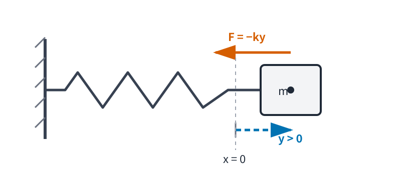
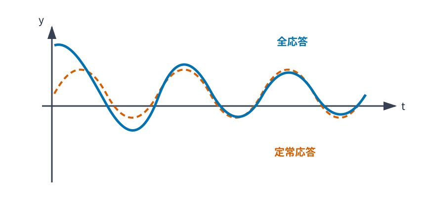

# MECH5 振動

<!-- definition-example-audit: strict -->

> **既出概念**：[MECH4 運動量・角運動量・保存則](../MECH4/index.md)までと、[RA3 Taylor の定理](../RA3/index.md#thm-ra3-taylor)、[ODE2 定係数線形微分方程式](../ODE2/index.md#thm-ode2-constant-coefficient)を使います。

MECH3 では、保存力がポテンシャルエネルギー $V(x)$ から $F(x)=-V'(x)$ と書けることを学びました。しかし、物体が力のつり合う位置の近くを往復するとき、**どの速さで往復し、抵抗や周期外力で何が変わるか**は、エネルギーなどの一定量だけでは時間方向まで分かりません。

本章では、ポテンシャルの極小付近を Taylor 展開して

$$
m\ddot y+ky=0
$$

が普遍的に現れる理由を導きます。ここで $y(t)$ は平衡位置からの変位です。続いて速度比例抵抗と周期外力を加え、

$$
m\ddot y+c\dot y+ky=F_0\cos(\Omega t)
$$

を物理的に読みます。中心線は

$$
\boxed{
\text{安定なつり合い位置}
\longrightarrow
\text{二次近似}
\longrightarrow
\text{単振動}
\longrightarrow
\text{減衰・強制・共振}
}
$$

です。ODE2 の一般論を作り直すのではなく、既知の ODE を力学モデルへ適用する橋渡しに集中します。

---

## 1. 平衡点と調和近似

一次元の合力を $F(x)$ とします。静止し続けられる位置では合力が 0 でなければなりません。

<!-- formal-statement-start -->
### 定義（平衡点）

一次元の質点に働く合力を $F(x)$ とする。位置 $x_*$ が

$$
F(x_*)=0
$$

を満たすとき、$x_*$ を **平衡点** とする。保存力 $F=-V'$ では

$$
V'(x_*)=0
$$

と同値である。
<!-- formal-statement-end -->

<!-- definition-example-start: def-mech5-equilibrium -->

### **定義の確認**：ばね

$$
F(x)=-kx,\qquad k>0
$$

なら $F(0)=0$ なので $x_*=0$ は平衡点です。さらに $x>0$ なら $F<0$、$x<0$ なら $F>0$ で、力は平衡点へ戻す向きです。

<!-- definition-example-end -->

平衡点なら何でも振動の中心になるわけではありません。ポテンシャルの山頂も $V'=0$ ですが、少しずれると離れていきます。本章では曲率が正の極小を区別します。

<!-- formal-statement-start -->
### 定義（非退化安定平衡点）

開区間上の $C^2$ 級ポテンシャル $V$ に対し、点 $x_*$ が

$$
V'(x_*)=0,
\qquad
V''(x_*)>0
$$

を満たすとき、本章では $x_*$ を **非退化安定平衡点** とする。
<!-- formal-statement-end -->

<!-- definition-example-start: def-mech5-nondegenerate-stable-equilibrium -->

### **定義の確認**：調和ポテンシャル

$$
V(x)=\frac12kx^2,\qquad k>0
$$

なら

$$
V'(0)=0,\qquad V''(0)=k>0
$$

なので $0$ は非退化安定平衡点です。一方 $V(x)=x^4$ は $0$ に極小を持ちますが $V''(0)=0$ であり、二次近似が主項になりません。

<!-- definition-example-end -->

### 1.1 Taylor の定理を力へ適用する

平衡点からの変位を

$$
y=x-x_*
$$

とします。$V$ が $x_*$ の近くで $C^3$ 級だとします。[Taylor の定理](../RA3/index.md#thm-ra3-taylor)を $f=V$、展開点 $a=x_*$、評価点 $x=x_*+y$、次数 $n=2$ で使うと、ある中間点 $\xi$ に対して

$$
V(x_*+y)
=
V(x_*)+V'(x_*)y
+\frac12V''(x_*)y^2
+\frac16V'''(\xi)y^3.
$$

平衡条件 $V'(x_*)=0$ を使い、

$$
k_{\mathrm{eff}}:=V''(x_*)>0
$$

と置けば、

$$
V(x_*+y)
=
V(x_*)+\frac12k_{\mathrm{eff}}y^2+O(y^3)
$$

と読めます。

力については $V'$ に [Taylor の定理](../RA3/index.md#thm-ra3-taylor)を次数 1 で使います。ある中間点 $\eta$ に対し

$$
V'(x_*+y)
=
V'(x_*)+V''(x_*)y+\frac12V'''(\eta)y^2,
$$

したがって

$$
F(x_*+y)
=
-k_{\mathrm{eff}}y-\frac12V'''(\eta)y^2.
$$

小変位では

$$
\boxed{F\approx-k_{\mathrm{eff}}y}
$$

です。

<!-- formal-statement-start -->
### 命題（非退化極小の調和近似）

質量 $m>0$ の質点が一次元ポテンシャル $V$ による保存力 $F=-V'$ を受けるとする。$V$ は平衡点 $x_*$ の近くで $C^3$ 級で、

$$
V'(x_*)=0,
\qquad
V''(x_*)=k_{\mathrm{eff}}>0
$$

とする。変位 $y=x-x_*$ が十分小さいとき、Newton 方程式は一次近似で

$$
\boxed{
m\ddot y+k_{\mathrm{eff}}y=0
}
$$

となる。
<!-- formal-statement-end -->

### 証明の見取り図

力の Taylor 展開で定数項は平衡条件により消え、一次項 $-k_{\mathrm{eff}}y$ が残ります。

<!-- proof-start -->
### 証明

Newton の第2法則は

$$
m\ddot x=F(x).
$$

$x=x_*+y$ で $x_*$ は定数なので $\ddot x=\ddot y$ です。上の展開を代入すると

$$
m\ddot y
=
-k_{\mathrm{eff}}y
-\frac12V'''(\eta)y^2.
$$

変位について一次まで残す線形近似では二次項を落とし、

$$
m\ddot y+k_{\mathrm{eff}}y=0
$$

を得ます。$k_{\mathrm{eff}}>0$ なので復元力は変位と逆向きです。
<!-- proof-end -->

これは「どんな振動も完全な正弦波」という主張ではありません。振幅が大きければ高次項が効きます。調和振動子は**非退化極小の近くでの第一近似**として普遍的なのです。

---

## 2. 単振動

線形復元力 $F=-ky$ に対し

$$
m\ddot y=-ky.
$$

$m>0$, $k>0$ なので

$$
\omega_0:=\sqrt{\frac{k}{m}}
$$

と置けば

$$
\ddot y+\omega_0^2y=0.
$$

この形の方程式では、復元力が変位に比例するため、運動の時間尺度が一つの定数 $\omega_0$ で決まります。この往復運動と、その時間尺度を表す量に名前を付けます。

<!-- formal-statement-start -->
### 定義（単振動）

定数 $\omega_0>0$ に対し、変位 $y(t)$ が

$$
\boxed{\ddot y+\omega_0^2y=0}
$$

を満たす運動を **単振動** とする。$\omega_0$ を **固有角振動数** とする。
<!-- formal-statement-end -->

<!-- definition-example-start: def-mech5-simple-harmonic-motion -->

### **定義の確認**：ばね―質点系

$m=2\ \mathrm{kg}$、$k=8\ \mathrm{N/m}$ なら

$$
\omega_0=\sqrt{\frac82}=2\ \mathrm{s^{-1}},
$$

したがって $\ddot y+4y=0$ です。

<!-- definition-example-end -->

ここでは平衡位置を $y=0$ とし、右向きを $y$ の正方向とします。図は $y>0$ の瞬間で、変位は平衡位置から質点へ向き、復元力 $F=-ky<0$ は質点を始点として負方向へ働きます。

### 2.1 振幅・位相・周期

[ODE2 の定係数斉次方程式の基本解系](../ODE2/index.md#thm-ode2-constant-coefficient)を適用します。特性多項式は

$$
p(r)=r^2+\omega_0^2
$$

で根は $\pm i\omega_0$ なので、

$$
y(t)=C_1\cos(\omega_0t)+C_2\sin(\omega_0t).
$$

$$
A:=\sqrt{C_1^2+C_2^2}
$$

とし、$A>0$ なら

$$
C_1=A\cos\phi,\qquad C_2=A\sin\phi
$$

と書けます。加法定理から

$$
\boxed{
y(t)=A\cos(\omega_0t-\phi)
}.
$$

$A$ が振幅、$\phi$ が初期位相です。周期 $T$ は $\omega_0T=2\pi$ より

$$
\boxed{
T=\frac{2\pi}{\omega_0}
=2\pi\sqrt{\frac{m}{k}}
}.
$$

初期条件 $y(0)=y_0$, $\dot y(0)=v_0$ なら

$$
C_1=y_0,
\qquad
C_2=\frac{v_0}{\omega_0},
$$

よって

$$
\boxed{
A=\sqrt{y_0^2+\frac{v_0^2}{\omega_0^2}}
}.
$$

初速度も振幅を決めることが分かります。

---

## 3. 単振動のエネルギー

ばねのポテンシャルは $V(y)=ky^2/2$ なので

$$
E=\frac12m\dot y^2+\frac12ky^2.
$$

<!-- formal-statement-start -->
### 定理（単振動のエネルギー保存）

$m>0$, $k>0$ とし、$C^2$ 級関数 $y(t)$ が

$$
m\ddot y+ky=0
$$

を満たすとする。このとき

$$
\boxed{
E(t)=\frac12m\dot y(t)^2+\frac12ky(t)^2
}
$$

は一定である。
<!-- formal-statement-end -->

### 証明の見取り図

$E$ を時間微分すると運動方程式が因子になります。

<!-- proof-start -->
### 証明

$$
\begin{aligned}
\frac{dE}{dt}
&=m\dot y\ddot y+ky\dot y\\
&=\dot y(m\ddot y+ky)\\
&=0.
\end{aligned}
$$
<!-- proof-end -->

振幅表示を代入し $k=m\omega_0^2$ を使えば

$$
E
=
\frac12kA^2
\left[
\sin^2(\omega_0t-\phi)
+\cos^2(\omega_0t-\phi)
\right]
=
\boxed{\frac12kA^2}.
$$

したがって振幅は保存エネルギーの大きさを表します。

---

## 4. 減衰振動

現実には抵抗で振幅が減ることがあります。低速域の第一近似として、速度比例抵抗

$$
F_{\mathrm{drag}}=-c\dot y,\qquad c>0
$$

を使います。

<!-- formal-statement-start -->
### 定義（線形減衰振動子）

$m>0$, $c\ge0$, $k>0$ とし、

$$
\boxed{
m\ddot y+c\dot y+ky=0
}
$$

に従う系を **線形減衰振動子** とする。
<!-- formal-statement-end -->

<!-- definition-example-start: def-mech5-damped-oscillator -->

### **定義の確認**：抵抗の向き

$\dot y>0$ なら $-c\dot y<0$、$\dot y<0$ なら $-c\dot y>0$ なので、抵抗は常に速度と逆向きです。

<!-- definition-example-end -->

単振動と同じ $E$ を微分すると

$$
\begin{aligned}
\frac{dE}{dt}
&=\dot y(m\ddot y+ky)\\
&=-c\dot y^2\\
&\le0.
\end{aligned}
$$

抵抗が力学的エネルギーを散逸させることが、解を求める前に分かります。

### 4.1 三つの減衰領域

$$
\gamma:=\frac{c}{2m},
\qquad
\omega_0:=\sqrt{\frac{k}{m}}
$$

と置けば

$$
\ddot y+2\gamma\dot y+\omega_0^2y=0.
$$

特性根は

$$
r=-\gamma\pm\sqrt{\gamma^2-\omega_0^2}.
$$

<!-- formal-statement-start -->
### 命題（減衰振動の三領域）

$m>0$, $c>0$, $k>0$ とする。

1. $\gamma<\omega_0$ なら $\omega_d=\sqrt{\omega_0^2-\gamma^2}$ と置いて

$$
y=e^{-\gamma t}
\left(
C_1\cos\omega_dt+C_2\sin\omega_dt
\right).
$$

2. $\gamma=\omega_0$ なら

$$
y=(C_1+C_2t)e^{-\gamma t}.
$$

3. $\gamma>\omega_0$ なら二つの相異なる負の実根 $r_1,r_2$ を用いて

$$
y=C_1e^{r_1t}+C_2e^{r_2t}.
$$
<!-- formal-statement-end -->

### 証明の見取り図

特性根が、共役複素根・重根・相異なる実根のどれになるかを [ODE2](../ODE2/index.md#thm-ode2-constant-coefficient) の基本解系へ対応させます。

<!-- proof-start -->
### 証明

$\gamma<\omega_0$ では根は $-\gamma\pm i\omega_d$ なので第一式を得ます。$\gamma=\omega_0$ では $-\gamma$ が二重根で、$e^{-\gamma t}$ と $te^{-\gamma t}$ が基本解です。

$\gamma>\omega_0$ では根は実数です。しかも

$$
0<\sqrt{\gamma^2-\omega_0^2}<\gamma
$$

だから両根とも負です。従って第三式を得ます。
<!-- proof-end -->

不足減衰だけが零点を繰り返し横切ります。臨界減衰と過減衰では、一般には指数成分で平衡へ戻ります。

---

## 5. 強制振動と定常応答

外から周期的な力を加えると、振動子は自分の固有角振動数だけでなく、外力の角振動数 $\Omega$ に応答します。

<!-- formal-statement-start -->
### 定義（正弦駆動される減衰振動子）

$m>0$, $c\ge0$, $k>0$, $F_0>0$, $\Omega>0$ とし、

$$
\boxed{
m\ddot y+c\dot y+ky
=
F_0\cos(\Omega t)
}
$$

に従う系を **正弦駆動される減衰振動子** とする。
<!-- formal-statement-end -->

<!-- definition-example-start: def-mech5-forced-oscillator -->

### **定義の確認**：各項の単位

$m\ddot y$, $c\dot y$, $ky$, $F_0\cos(\Omega t)$ はすべて力の単位を持ちます。特に $c$ の単位は $\mathrm{kg/s}$、$k$ は $\mathrm{N/m}$ です。

<!-- definition-example-end -->

$c>0$ とし、定常的な特殊解を

$$
y_p=a\cos(\Omega t)+b\sin(\Omega t)
$$

と置きます。微分して代入し、$\cos$ と $\sin$ の係数を比較すると

$$
(k-m\Omega^2)a+c\Omega b=F_0,
$$

$$
(k-m\Omega^2)b-c\Omega a=0.
$$

この2式を解くと、分母

$$
D=(k-m\Omega^2)^2+c^2\Omega^2
$$

に対し

$$
a=\frac{F_0(k-m\Omega^2)}{D},
\qquad
b=\frac{F_0c\Omega}{D}.
$$

したがって振幅は

$$
\boxed{
A(\Omega)
=
\sqrt{a^2+b^2}
=
\frac{F_0}{
\sqrt{(k-m\Omega^2)^2+c^2\Omega^2}
}
}.
$$

$a=A\cos\delta$, $b=A\sin\delta$ と置けば

$$
y_p=A\cos(\Omega t-\delta)
$$

と書けます。位相差は象限を含めて $a,b$ から決めます。

<!-- formal-statement-start -->
### 命題（減衰強制振動の定常応答）

$m>0$, $c>0$, $k>0$ とする。正弦駆動される減衰振動子には

$$
y_p(t)=A(\Omega)\cos(\Omega t-\delta)
$$

の形の定常特殊解があり、その振幅は

$$
\boxed{
A(\Omega)=
\frac{F_0}{
\sqrt{(k-m\Omega^2)^2+c^2\Omega^2}
}
}.
$$

また任意の解は、定常特殊解と減衰する斉次解との和である。
<!-- formal-statement-end -->

[ODE2 の非斉次方程式の一般解](../ODE2/index.md#thm-ode2-nonhom-general)により、全解は $y=y_p+y_h$ です。前節から $c>0$ なら $y_h\to0$ なので、十分時間が経つと駆動周波数の応答が残ります。

図の実線が全応答、破線が定常応答です。二つは色だけでなく線種・線幅でも区別しています。

---

## 6. 共振

「外力の周期が合うと大きく揺れる」という現象は、無減衰と減衰ありで数学的な姿が異なります。

<!-- formal-statement-start -->
### 定義（共振）

周期外力を受ける振動系で、駆動角振動数が系の固有時間尺度と適合し、応答が顕著に大きくなる現象を **共振** とする。

本章の線形振動子では、無減衰の厳密一致による時間増大と、減衰ありの有限な定常振幅ピークを区別する。
<!-- formal-statement-end -->

<!-- definition-example-start: def-mech5-resonance -->

### **定義の確認**：低周波・高周波・固有周波数付近

定常振幅

$$
A(\Omega)=
\frac{F_0}{
\sqrt{(k-m\Omega^2)^2+c^2\Omega^2}
}
$$

を見ると、$\Omega\to0$ では $A\to F_0/k$、$\Omega\to\infty$ では $A\to0$ です。減衰が小さいと、その間の固有角振動数付近に大きな山ができます。

<!-- definition-example-end -->

### 6.1 無減衰の厳密共振

$c=0$ かつ $\Omega=\omega_0=\sqrt{k/m}$ とします。

$$
m\ddot y+ky=F_0\cos(\omega_0t)
$$

を $m$ で割ると

$$
\ddot y+\omega_0^2y
=
\frac{F_0}{m}\cos(\omega_0t).
$$

右辺と同じ $\cos(\omega_0t)$ は斉次解なので、そのまま試行できません。そこで

$$
y_p=B t\sin(\omega_0t)
$$

を試します。微分すると

$$
\dot y_p
=
B\sin(\omega_0t)
+B\omega_0t\cos(\omega_0t),
$$

$$
\ddot y_p
=
2B\omega_0\cos(\omega_0t)
-B\omega_0^2t\sin(\omega_0t).
$$

従って

$$
\ddot y_p+\omega_0^2y_p
=
2B\omega_0\cos(\omega_0t).
$$

係数比較から

$$
B=\frac{F_0}{2m\omega_0}.
$$

<!-- formal-statement-start -->
### 命題（無減衰線形振動子の厳密共振）

$m>0$, $k>0$ とし $\omega_0=\sqrt{k/m}$ とする。方程式

$$
m\ddot y+ky=F_0\cos(\omega_0t)
$$

は特殊解

$$
\boxed{
y_p(t)=
\frac{F_0}{2m\omega_0}
t\sin(\omega_0t)
}
$$

を持つ。従って一般解には、時間に比例して増える包絡線を持つ項が現れる。
<!-- formal-statement-end -->

これは理想化された線形・無減衰モデルの結論です。実物では振幅が大きくなるほど非線形性・追加の散逸・材料限界が効きます。

### 6.2 減衰がある場合の振幅ピーク

$c>0$ では

$$
D(\Omega)
=
(k-m\Omega^2)^2+c^2\Omega^2
$$

は 0 にならず、定常振幅は有限です。$A$ を最大にすることは $D$ を最小にすることなので、

$$
\begin{aligned}
D'(\Omega)
&=
2(k-m\Omega^2)(-2m\Omega)+2c^2\Omega\\
&=
2\Omega[-2m(k-m\Omega^2)+c^2].
\end{aligned}
$$

正の内部極値では

$$
\Omega^2
=
\frac{k}{m}-\frac{c^2}{2m^2}.
$$

したがって $c^2<2mk$ のとき、

$$
\boxed{
\Omega_{\mathrm r}
=
\sqrt{
\frac{k}{m}-\frac{c^2}{2m^2}
}
=
\sqrt{\omega_0^2-2\gamma^2}
<\omega_0
}.
$$

減衰が十分小さければ $\Omega_{\mathrm r}$ は $\omega_0$ に近いものの、厳密には一致しません。$c^2\ge2mk$ なら正の内部ピークはありません。

---

## 7. 強制振動のエネルギー収支

$$
E=\frac12m\dot y^2+\frac12ky^2
$$

とすると

$$
\frac{dE}{dt}
=
\dot y(m\ddot y+ky).
$$

運動方程式から

$$
m\ddot y+ky
=
F_0\cos(\Omega t)-c\dot y
$$

なので、

$$
\boxed{
\frac{dE}{dt}
=
F_0\cos(\Omega t)\dot y
-c\dot y^2
}.
$$

第1項は外力が与える瞬間仕事率、第2項は抵抗で失う仕事率です。定常振動では一周期平均で、外力から入るエネルギーと散逸するエネルギーが釣り合います。

---

## 8. 本章の見取り図

本章の核心は、調和振動子が特別なばね問題だからではなく、**滑らかな非退化安定平衡点の近くで普遍的に現れる線形近似**だから重要だという点です。

$$
V'(x_*)=0,\qquad V''(x_*)>0
$$

なら

$$
F\approx-V''(x_*)y,
\qquad
\omega_0=\sqrt{\frac{V''(x_*)}{m}}.
$$

減衰を加えればエネルギーは減少し、周期外力を加えれば定常応答と共振が現れます。次の MECH6 では一点へ向く力を三次元へ広げ、中心力・万有引力・Kepler 問題を扱います。

---

# 演習

## Level A

### A1. ポテンシャル極小から固有角振動数を求める

質量 $m>0$ の質点が

$$
V(x)=V_0+\frac{a}{2}(x-x_*)^2+\frac{b}{4}(x-x_*)^4,
\qquad a>0,\quad b\ge0
$$

で与えられるポテンシャル中を運動する。$x_*$ が非退化安定平衡点であることを確認し、小振幅での $k_{\mathrm{eff}}$ と $\omega_0$ を求めよ。

- Level: A

<!-- solution-start -->
#### 詳細解答

$$
V'(x)=a(x-x_*)+b(x-x_*)^3,
$$

なので $V'(x_*)=0$ です。また

$$
V''(x)=a+3b(x-x_*)^2
$$

より $V''(x_*)=a>0$。従って非退化安定平衡点です。

$$
\boxed{k_{\mathrm{eff}}=a},
\qquad
\boxed{\omega_0=\sqrt{\frac{a}{m}}}.
$$

四次項は小振幅の一次復元力には現れません。
<!-- solution-end -->

### A2. 初期条件から単振動を決める

$$
\ddot y+9y=0,
\qquad
y(0)=2,\quad \dot y(0)=-3
$$

とする。$y(t)$、振幅 $A$、周期 $T$ を求めよ。

- Level: A

<!-- solution-start -->
#### 詳細解答

$\omega_0=3$ なので

$$
y=C_1\cos3t+C_2\sin3t.
$$

$y(0)=2$ から $C_1=2$。また

$$
\dot y=-3C_1\sin3t+3C_2\cos3t
$$

なので $\dot y(0)=3C_2=-3$、従って $C_2=-1$ です。

$$
\boxed{y=2\cos3t-\sin3t},
$$

$$
\boxed{A=\sqrt{2^2+(-1)^2}=\sqrt5},
\qquad
\boxed{T=\frac{2\pi}{3}}.
$$
<!-- solution-end -->

### A3. エネルギーから振幅を読む

$m=2\ \mathrm{kg}$、$k=8\ \mathrm{N/m}$ の単振動子が $E=4\ \mathrm J$ を持つ。振幅 $A$ と最大速度 $v_{\max}$ を求めよ。

- Level: A

<!-- solution-start -->
#### 詳細解答

転回点では $\dot y=0$ なので

$$
4=\frac12\cdot8 A^2,
$$

従って

$$
\boxed{A=1\ \mathrm m}.
$$

平衡点では $y=0$ なので

$$
4=\frac12\cdot2\,v_{\max}^2,
$$

従って

$$
\boxed{v_{\max}=2\ \mathrm{m/s}}.
$$
<!-- solution-end -->

### A4. 減衰領域を分類する

$m=1$, $k=9$ とする。$c=2,6,8$ のそれぞれを不足減衰・臨界減衰・過減衰に分類せよ。

- Level: A

<!-- solution-start -->
#### 詳細解答

$$
\omega_0=\sqrt{9}=3,
\qquad
\gamma=\frac c2.
$$

$c=2$ なら $\gamma=1<3$ で不足減衰、$c=6$ なら $\gamma=3$ で臨界減衰、$c=8$ なら $\gamma=4>3$ で過減衰です。
<!-- solution-end -->

## Level B

### B1. Taylor の定理から調和近似を作る

$$
V(x)=U_0\left(1-\cos\frac{x}{\ell}\right),
\qquad U_0>0,\quad \ell>0
$$

とする。$x_*=0$ が非退化安定平衡点であることを示し、二次近似、有効ばね定数、固有角振動数、力の一次近似を求めよ。

- Level: B

<!-- solution-start -->
#### 詳細解答

$$
V'(x)=\frac{U_0}{\ell}\sin\frac{x}{\ell},
\qquad
V''(x)=\frac{U_0}{\ell^2}\cos\frac{x}{\ell}.
$$

従って

$$
V'(0)=0,
\qquad
V''(0)=\frac{U_0}{\ell^2}>0.
$$

Taylor の定理を $a=0$, $n=2$ で適用し、

$$
V(x)
=
V(0)+V'(0)x+\frac12V''(0)x^2+R_3(x)
$$

と書けば、小さい $x$ について

$$
\boxed{
V(x)\approx
\frac12\frac{U_0}{\ell^2}x^2
}.
$$

よって

$$
\boxed{
k_{\mathrm{eff}}=\frac{U_0}{\ell^2}
},
\qquad
\boxed{
\omega_0=\sqrt{\frac{U_0}{m\ell^2}}
}.
$$

また

$$
F(x)
=-\frac{U_0}{\ell}\sin\frac{x}{\ell}
\approx
-\frac{U_0}{\ell^2}x,
$$

なので小変位では平衡点へ戻す力です。
<!-- solution-end -->

### B2. 不足減衰の初期値問題

$$
\ddot y+2\dot y+5y=0,
\qquad
y(0)=1,\quad \dot y(0)=0
$$

とする。減衰領域を判定して $y(t)$ を求め、$E=\dot y^2/2+5y^2/2$ が非増加であることを示せ。

- Level: B

<!-- solution-start -->
#### 詳細解答

標準形との比較から

$$
\gamma=1,
\qquad
\omega_0=\sqrt5,
\qquad
\omega_d=\sqrt{5-1}=2.
$$

従って不足減衰で、

$$
y=e^{-t}(C_1\cos2t+C_2\sin2t).
$$

初期位置から $C_1=1$。微分して $t=0$ を代入すると

$$
\dot y(0)=-C_1+2C_2=0
$$

なので $C_2=1/2$ です。

$$
\boxed{
y=e^{-t}\left(\cos2t+\frac12\sin2t\right)
}.
$$

エネルギーについて

$$
\frac{dE}{dt}
=
\dot y(\ddot y+5y).
$$

運動方程式から $\ddot y+5y=-2\dot y$ なので

$$
\boxed{
\frac{dE}{dt}=-2\dot y^2\le0
}.
$$
<!-- solution-end -->

### B3. 定常応答と減衰共振

$$
\ddot y+\dot y+4y=3\cos(\Omega t)
$$

を考える。$\omega_0$、定常振幅 $A(\Omega)$、正の変位振幅ピーク $\Omega_{\mathrm r}$ を求め、$\Omega_{\mathrm r}<\omega_0$ を確認せよ。

- Level: B

<!-- solution-start -->
#### 詳細解答

$m=1$, $c=1$, $k=4$, $F_0=3$ なので

$$
\boxed{\omega_0=2}.
$$

振幅は

$$
\boxed{
A(\Omega)
=
\frac{3}{
\sqrt{(4-\Omega^2)^2+\Omega^2}
}
}.
$$

また

$$
\Omega_{\mathrm r}^2
=
4-\frac12
=
\frac72,
$$

従って

$$
\boxed{\Omega_{\mathrm r}=\sqrt{\frac72}\approx1.87<2=\omega_0}.
$$

減衰があるため、変位振幅のピークは固有角振動数より少し低い側にあります。
<!-- solution-end -->

## Level C

### C1. 非線形ポテンシャルから強制減衰振動まで

質量 $m>0$ の質点について

$$
V(x)=\frac12kx^2+\frac{\lambda}{4}x^4,
\qquad k>0,\quad \lambda>0
$$

とする。速度比例抵抗 $-c\dot x$ と周期外力 $F_0\cos(\Omega t)$ を加える。$c>0$, $F_0>0$ とする。

1. 保存力を求め、$x=0$ が非退化安定平衡点であることを示せ。
2. 小振幅で線形化した運動方程式を導け。
3. $\omega_0$ と定常振幅 $A(\Omega)$ を求めよ。
4. $c^2<2mk$ として $\Omega_{\mathrm r}$ を求めよ。
5. 線形化後のエネルギー収支を導け。
6. 振幅が大きくなると線形共振公式をそのまま信頼できない理由を説明せよ。

- Level: C

<!-- solution-start -->
#### 詳細解答

$$
V'(x)=kx+\lambda x^3
$$

なので

$$
\boxed{F_{\mathrm{cons}}=-kx-\lambda x^3}.
$$

また

$$
V'(0)=0,
\qquad
V''(0)=k>0,
$$

従って $0$ は非退化安定平衡点です。

厳密な運動方程式は

$$
m\ddot x+c\dot x+kx+\lambda x^3
=
F_0\cos(\Omega t).
$$

小振幅では $\lambda x^3$ を一次近似から外し、

$$
\boxed{
m\ddot x+c\dot x+kx
=
F_0\cos(\Omega t)
}.
$$

したがって

$$
\boxed{\omega_0=\sqrt{\frac{k}{m}}},
$$

$$
\boxed{
A(\Omega)
=
\frac{F_0}{
\sqrt{(k-m\Omega^2)^2+c^2\Omega^2}
}
}.
$$

$c^2<2mk$ なら

$$
\boxed{
\Omega_{\mathrm r}
=
\sqrt{
\frac{k}{m}-\frac{c^2}{2m^2}
}
}.
$$

線形化したエネルギー

$$
E_{\mathrm{lin}}
=
\frac12m\dot x^2+\frac12kx^2
$$

を微分すると

$$
\frac{dE_{\mathrm{lin}}}{dt}
=
\dot x(m\ddot x+kx).
$$

線形化方程式から

$$
m\ddot x+kx
=
F_0\cos(\Omega t)-c\dot x
$$

なので

$$
\boxed{
\frac{dE_{\mathrm{lin}}}{dt}
=
F_0\cos(\Omega t)\dot x-c\dot x^2
}.
$$

第1項は外力による瞬間仕事率、第2項は散逸です。

最後に、非線形項と線形項の大きさの比は $x\ne0$ で

$$
\frac{|\lambda x^3|}{|kx|}
=
\frac{\lambda x^2}{k}.
$$

振幅が大きいほどこの比は大きくなるため、共振で大振幅を予測する領域ほど線形化の前提が悪くなります。実系では追加の非線形性・散逸・材料限界も再検討する必要があります。
<!-- solution-end -->
