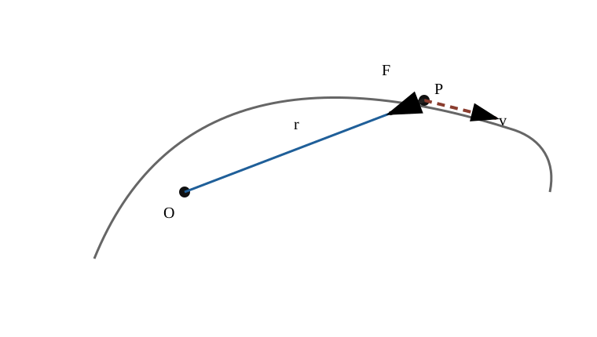
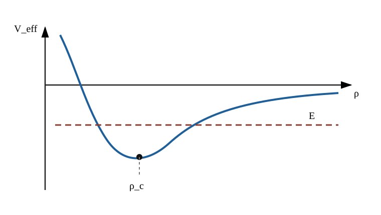
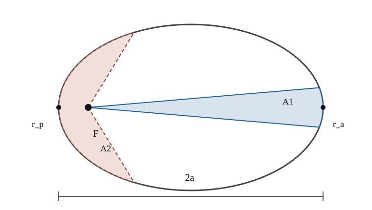

# MECH6 中心力・万有引力・Kepler 問題

<!-- definition-example-audit: strict -->

> **既出概念**：[MECH3 の力学的エネルギー保存](../MECH3/index.md#thm-mech3-mechanical-energy-conservation)、[MECH4 の角運動量保存](../MECH4/index.md#thm-mech4-angular-momentum-conservation)と[位置ベクトルに平行な力](../MECH4/index.md#prop-mech4-radial-force-angular-momentum)、[ODE2 の定係数線形微分方程式](../ODE2/index.md#thm-ode2-constant-coefficient)を使います。

MECH4 では、力が位置ベクトルと平行ならトルクが消え、角運動量が保存されることを見ました。ここで次の問いが生まれます。

**一点へ向く力だけで、なぜ惑星軌道は平面上の楕円になり、面積速度と周期に単純な法則が現れるのでしょうか。**

本章では、中心からの距離を $\rho(t)$、軌道面内の角度を $\theta(t)$ と書きます。主役は

$$
\boxed{
\text{中心力}
\longrightarrow
\text{角運動量保存}
\longrightarrow
\text{平面極座標}
\longrightarrow
\text{有効ポテンシャル}
\longrightarrow
\text{軌道方程式}
}
$$

という書き換えです。万有引力ではこの流れがさらに

$$
\boxed{
\frac{1}{\rho^2}\text{ の引力}
\longrightarrow
\text{円錐曲線}
\longrightarrow
\text{Kepler の3法則}
}
$$

へつながります。

固定された中心天体の質量を $M>0$、運動する質点の質量を $m>0$、万有引力定数を $G>0$ とします。中心天体自身の運動まで含めた二体問題は MECH7 で扱います。

---

## 1. 中心力とは何か

中心を原点 $O$ に取り、質点の位置ベクトルを $r(t)$ とします。

$$
\rho(t):=|r(t)|>0,
\qquad
e_r(t):=\frac{r(t)}{\rho(t)}
$$

と置くと、$e_r$ は中心から質点へ向く単位ベクトルです。

<!-- formal-statement-start -->
### 定義（中心力）

質点に働く力 $F$ が

$$
\boxed{
F(t)=f(\rho(t))\,e_r(t)
}
$$

と書けるとき、その力を **中心力** とする。ここで $f$ は距離 $\rho$ だけの関数である。

$f(\rho)<0$ なら力は中心向き、$f(\rho)>0$ なら中心から外向きである。
<!-- formal-statement-end -->

<!-- definition-example-start: def-mech6-central-force -->

### **定義の確認**：逆二乗引力

$$
F=-\frac{k}{\rho^2}e_r,
\qquad k>0
$$

は、方向が常に $e_r$ と平行で、大きさ $k/\rho^2$ が距離だけで決まるので中心力です。

一方、一定方向の重力 $F=-mg\,e_y$ は、一般の位置で $r$ と平行ではないため、原点を中心とする中心力ではありません。

<!-- definition-example-end -->

図の $F$ は中心向きの場合を描いています。中心力の条件は「速度と反対向き」ではなく、**位置ベクトルと平行**であることです。

---

## 2. 中心力運動は一つの平面に閉じる

中心力では

$$
r\times F
=
r\times \bigl(f(\rho)e_r\bigr)
=0
$$

です。したがって [MECH4 の角運動量保存](../MECH4/index.md#thm-mech4-angular-momentum-conservation)を適用できます。

<!-- formal-statement-start -->
### 命題（中心力運動の平面縮約）

質量 $m>0$ の質点が中心力

$$
F=f(\rho)e_r
$$

だけを受けるとする。角運動量

$$
L=r\times mv
$$

は時間に依らず一定である。

特に $L\neq0$ なら、運動は原点を通り $L$ に垂直な一つの固定平面内に限られる。
<!-- formal-statement-end -->

### 証明の見取り図

中心力ではトルクが 0 なので $L$ は一定です。さらに $L=r\times mv$ はベクトル積の第1因子 $r$ に垂直なので、常に $r\cdot L=0$ です。

<!-- proof-start -->
### 証明

[MECH4 の角運動量の時間変化](../MECH4/index.md#thm-mech4-angular-momentum-balance)より

$$
\frac{dL}{dt}
=
r\times F.
$$

中心力では $F$ と $r$ が平行なので

$$
r\times F=0.
$$

従って

$$
\frac{dL}{dt}=0,
\qquad
L=\text{一定}.
$$

また $L=r\times mv$ は $r$ に垂直なので

$
r(t)\cdot L=0
$

がすべての $t$ で成り立ちます。$L\neq0$ なら

$$
\Pi:=\{x\in\mathbb R^3:x\cdot L=0\}
$$

は原点を通る固定平面であり、$r(t)\in\Pi$ です。よって軌道全体が $\Pi$ に含まれます。
<!-- proof-end -->

$L=0$ の場合は $r$ と $v$ が平行で、運動は中心を通る直線上の純粋な動径運動になります。本章の軌道方程式では主に $L\neq0$ を扱います。

---

## 3. 平面極座標の速度と加速度

固定された軌道面に直交座標を取り、

$$
r=\rho e_r,
$$

$$
e_r=
\begin{pmatrix}
\cos\theta\\
\sin\theta
\end{pmatrix},
\qquad
e_\theta=
\begin{pmatrix}
-\sin\theta\\
\cos\theta
\end{pmatrix}
$$

とします。

まず基底ベクトル自身が回転することに注意します。

$$
\dot e_r
=
\dot\theta
\begin{pmatrix}
-\sin\theta\\
\cos\theta
\end{pmatrix}
=
\dot\theta\,e_\theta,
$$

$$
\dot e_\theta
=
-\dot\theta
\begin{pmatrix}
\cos\theta\\
\sin\theta
\end{pmatrix}
=
-\dot\theta\,e_r.
$$

<!-- formal-statement-start -->
### 命題（平面極座標での速度・加速度）

$\rho,\theta$ が $C^2$ 級で $\rho>0$ とする。このとき

$$
\boxed{
v
=
\dot\rho\,e_r
+
\rho\dot\theta\,e_\theta
}
$$

および

$$
\boxed{
a
=
(\ddot\rho-\rho\dot\theta^2)e_r
+
(\rho\ddot\theta+2\dot\rho\dot\theta)e_\theta
}
$$

が成り立つ。
<!-- formal-statement-end -->

### 証明の見取り図

$r=\rho e_r$ を一度微分して速度、もう一度微分して加速度を求めます。各段階で $e_r,e_\theta$ 自身の時間微分を残さないことが要点です。

<!-- proof-start -->
### 証明

まず

$$
v
=
\frac{d}{dt}(\rho e_r)
=
\dot\rho e_r+\rho\dot e_r.
$$

$\dot e_r=\dot\theta e_\theta$ を代入して

$$
v
=
\dot\rho e_r+\rho\dot\theta e_\theta.
$$

さらに微分すると

$$
\begin{aligned}
a
&=
\ddot\rho e_r
+\dot\rho\dot e_r
+(\dot\rho\dot\theta+\rho\ddot\theta)e_\theta
+\rho\dot\theta\dot e_\theta\\
&=
\ddot\rho e_r
+\dot\rho\dot\theta e_\theta
+(\dot\rho\dot\theta+\rho\ddot\theta)e_\theta
-\rho\dot\theta^2e_r.
\end{aligned}
$$

$e_r$ 成分と $e_\theta$ 成分をまとめて

$$
a
=
(\ddot\rho-\rho\dot\theta^2)e_r
+
(\rho\ddot\theta+2\dot\rho\dot\theta)e_\theta.
$$
<!-- proof-end -->

中心力には $e_\theta$ 成分がありません。Newton 方程式

$$
ma=F=f(\rho)e_r
$$

の $e_\theta$ 成分は

$$
m(\rho\ddot\theta+2\dot\rho\dot\theta)=0.
$$

両辺に $\rho$ を掛けると

$$
\rho^2\ddot\theta+2\rho\dot\rho\dot\theta
=
\frac{d}{dt}(\rho^2\dot\theta)
=
0.
$$

従って

$$
\boxed{
\ell:=m\rho^2\dot\theta
}
$$

は一定です。軌道面の向きを $L$ と同じ向きに選べば $\ell=|L|>0$ です。

---

## 4. 有効ポテンシャル：二次元運動を一次元問題として読む

中心力が保存力で、

$$
F=-U'(\rho)e_r
$$

と書けるとします。$e_r,e_\theta$ は互いに直交する単位ベクトルなので

$$
|v|^2
=
\dot\rho^2+\rho^2\dot\theta^2.
$$

従って力学的エネルギーは

$$
E
=
\frac12m\dot\rho^2
+\frac12m\rho^2\dot\theta^2
+U(\rho).
$$

角運動量保存

$$
\dot\theta
=
\frac{\ell}{m\rho^2}
$$

を代入すると

$$
E
=
\frac12m\dot\rho^2
+
U(\rho)
+
\frac{\ell^2}{2m\rho^2}.
$$

この最後の二項を一つにまとめます。

<!-- formal-statement-start -->
### 定義（有効ポテンシャル）

中心ポテンシャル $U(\rho)$ と保存角運動量 $\ell$ に対して

$$
\boxed{
V_{\mathrm{eff}}(\rho)
:=
U(\rho)
+
\frac{\ell^2}{2m\rho^2}
}
$$

を **有効ポテンシャル** とする。
<!-- formal-statement-end -->

<!-- definition-example-start: def-mech6-effective-potential -->

### **定義の確認**：万有引力

万有引力のポテンシャル

$$
U(\rho)=-\frac{GMm}{\rho}
$$

では

$$
\boxed{
V_{\mathrm{eff}}(\rho)
=
-\frac{GMm}{\rho}
+
\frac{\ell^2}{2m\rho^2}
}.
$$

第1項は引力ポテンシャル、第2項は角運動量を保ちながら $\rho$ を小さくすると急増する項です。

<!-- definition-example-end -->

<!-- formal-statement-start -->
### 命題（中心力運動の有効一次元化）

保存中心力 $F=-U'(\rho)e_r$ を受け、$\ell\neq0$ とする。このとき動径運動は

$$
\boxed{
E
=
\frac12m\dot\rho^2+V_{\mathrm{eff}}(\rho)
}
$$

および

$$
\boxed{
m\ddot\rho
=
-\frac{dV_{\mathrm{eff}}}{d\rho}
}
$$

を満たす。
<!-- formal-statement-end -->

<!-- proof-start -->
### 証明

エネルギー式は直前の計算で得ています。次に

$$
V_{\mathrm{eff}}'(\rho)
=
U'(\rho)
-
\frac{\ell^2}{m\rho^3}.
$$

一方、Newton 方程式の $e_r$ 成分は

$$
m(\ddot\rho-\rho\dot\theta^2)
=
-U'(\rho).
$$

従って

$$
m\ddot\rho
=
-U'(\rho)
+
m\rho\dot\theta^2.
$$

ここで

$$
\dot\theta=\frac{\ell}{m\rho^2}
$$

だから

$$
m\rho\dot\theta^2
=
m\rho
\frac{\ell^2}{m^2\rho^4}
=
\frac{\ell^2}{m\rho^3}.
$$

よって

$$
m\ddot\rho
=
-U'(\rho)+\frac{\ell^2}{m\rho^3}
=
-V_{\mathrm{eff}}'(\rho).
$$
<!-- proof-end -->

エネルギー線 $E$ と $V_{\mathrm{eff}}$ の交点では $\dot\rho=0$ です。MECH3 の一次元ポテンシャルと同じ読み方で、動径方向の転回点を判定できます。

### 4.1 円軌道

円軌道では $\rho=\rho_c$ が一定なので

$$
\dot\rho=\ddot\rho=0.
$$

従って有効ポテンシャルの停留条件

$$
V_{\mathrm{eff}}'(\rho_c)=0
$$

が必要です。万有引力なら

$$
\frac{GMm}{\rho_c^2}
-
\frac{\ell^2}{m\rho_c^3}
=0,
$$

したがって

$$
\boxed{
\rho_c
=
\frac{\ell^2}{GMm^2}
}.
$$

同じ結果は向心加速度からも得られます。円運動では $v=\rho_c\dot\theta$ なので

$$
m\frac{v^2}{\rho_c}
=
\frac{GMm}{\rho_c^2},
$$

ゆえに

$$
\boxed{
v_c=\sqrt{\frac{GM}{\rho_c}}
}.
$$

---

## 5. Newton の万有引力

<!-- formal-statement-start -->
### 原理（Newton の万有引力）

質量 $M>0$ の中心天体を原点に固定し、質量 $m>0$ の質点が距離 $\rho>0$ にあるとする。本章の固定中心近似では、質点に働く万有引力を

$$
\boxed{
F
=
-\frac{GMm}{\rho^2}e_r
}
$$

とする。

対応するポテンシャルを無限遠で 0 と取れば

$$
\boxed{
U(\rho)
=
-\frac{GMm}{\rho}
}
$$

である。
<!-- formal-statement-end -->

これは数学定理ではなく物理法則です。ポテンシャルとの対応は微分で確認できます。

$$
-\frac{dU}{d\rho}
=
-\frac{GMm}{\rho^2}.
$$

### 5.1 脱出速度

半径 $\rho_0$ で速さ $v_0$ を持つとき、

$$
E
=
\frac12mv_0^2-\frac{GMm}{\rho_0}.
$$

無限遠で速度が 0 まで落ちても到達できる境界は $E=0$ です。従って

$$
\frac12m v_{\mathrm{esc}}^2
=
\frac{GMm}{\rho_0},
$$

$$
\boxed{
v_{\mathrm{esc}}
=
\sqrt{\frac{2GM}{\rho_0}}
}.
$$

円軌道速度 $v_c=\sqrt{GM/\rho_0}$ と比べると

$$
v_{\mathrm{esc}}=\sqrt2\,v_c.
$$

---

## 6. 時刻を消して軌道そのものを求める

有効ポテンシャルは $\rho(t)$ の許容範囲をよく示します。しかし「軌道が何という曲線か」を直接知るには、時刻 $t$ を消して $\rho$ を $\theta$ の関数として扱う方が便利です。

$$
u(\theta):=\frac{1}{\rho(\theta)}
$$

と置きます。

角運動量保存から

$$
\dot\theta
=
\frac{\ell}{m\rho^2}
=
\frac{\ell}{m}u^2.
$$

また

$$
\rho=\frac1u
$$

なので、連鎖律により

$$
\dot\rho
=
\frac{d\rho}{d\theta}\dot\theta
=
-\frac{u'}{u^2}\frac{\ell}{m}u^2
=
-\frac{\ell}{m}u',
$$

ここで $u'=du/d\theta$ です。さらに

$$
\ddot\rho
=
-\frac{\ell}{m}u''\dot\theta
=
-\frac{\ell^2}{m^2}u^2u''.
$$

一方、

$$
\rho\dot\theta^2
=
\frac1u
\left(\frac{\ell}{m}u^2\right)^2
=
\frac{\ell^2}{m^2}u^3.
$$

したがって動径加速度は

$$
\ddot\rho-\rho\dot\theta^2
=
-\frac{\ell^2}{m^2}u^2(u''+u).
$$

<!-- formal-statement-start -->
### 命題（Binet 型の軌道方程式）

$L\neq0$ の中心力

$$
F=f(\rho)e_r
$$

の軌道について $u(\theta)=1/\rho(\theta)$ とする。このとき

$$
\boxed{
u''+u
=
-\frac{m}{\ell^2u^2}
f\!\left(\frac1u\right)
}
$$

が成り立つ。
<!-- formal-statement-end -->

<!-- proof-start -->
### 証明

Newton 方程式の動径成分は

$$
m(\ddot\rho-\rho\dot\theta^2)
=
f(\rho).
$$

上で得た

$$
\ddot\rho-\rho\dot\theta^2
=
-\frac{\ell^2}{m^2}u^2(u''+u)
$$

と $\rho=1/u$ を代入すると

$$
-\frac{\ell^2}{m}u^2(u''+u)
=
f\!\left(\frac1u\right).
$$

$\ell\neq0$、$u>0$ なので割ることができ、

$$
u''+u
=
-\frac{m}{\ell^2u^2}
f\!\left(\frac1u\right).
$$
<!-- proof-end -->

万有引力では

$$
f(\rho)=-\frac{GMm}{\rho^2},
$$

従って

$$
f(1/u)=-GMm\,u^2.
$$

Binet 方程式は

$$
u''+u
=
\frac{GMm^2}{\ell^2}.
$$

ここで

$$
\boxed{
p:=\frac{\ell^2}{GMm^2}>0
}
$$

と置けば

$$
u''+u=\frac1p.
$$

---

## 7. 逆二乗引力の軌道は円錐曲線になる

[ODE2 の定係数線形方程式](../ODE2/index.md#thm-ode2-constant-coefficient)を $\theta$ を独立変数として適用すると、

$$
u(\theta)
=
\frac1p
+
A\cos\theta+B\sin\theta.
$$

定数 $e\ge0$、$\theta_0$ を用いて

$$
A\cos\theta+B\sin\theta
=
\frac{e}{p}\cos(\theta-\theta_0)
$$

と書けば、

$$
u
=
\frac1p\left(1+e\cos(\theta-\theta_0)\right).
$$

従って

$$
\boxed{
\rho(\theta)
=
\frac{p}{1+e\cos(\theta-\theta_0)}
}.
$$

<!-- formal-statement-start -->
### 定理（逆二乗力の円錐曲線軌道）

固定中心 $M$ による万有引力

$$
F=-\frac{GMm}{\rho^2}e_r
$$

の下で $\ell\neq0$ とする。軌道は適切な角度原点 $\theta_0$ を選べば

$$
\boxed{
\rho
=
\frac{p}{1+e\cos(\theta-\theta_0)},
\qquad
p=\frac{\ell^2}{GMm^2},
\qquad
e\ge0
}
$$

と書ける。

$e$ は離心率であり、

- $0\le e<1$：楕円（$e=0$ は円）
- $e=1$：放物線
- $e>1$：双曲線

に対応する。
<!-- formal-statement-end -->

### 7.1 離心率とエネルギー

$\phi=\theta-\theta_0$ と置くと

$$
u=\frac1p(1+e\cos\phi),
\qquad
u'=-\frac{e}{p}\sin\phi.
$$

前節の計算から

$$
\dot\rho=-\frac{\ell}{m}u',
\qquad
\rho^2\dot\theta^2=\frac{\ell^2}{m^2}u^2.
$$

従ってエネルギーは

$$
E
=
\frac{\ell^2}{2m}(u'^2+u^2)-GMm\,u.
$$

ここで

$$
u'^2+u^2
=
\frac1{p^2}
\left[
e^2\sin^2\phi+(1+e\cos\phi)^2
\right]
$$

$$
=
\frac1{p^2}
(1+2e\cos\phi+e^2).
$$

また

$$
\frac1p=\frac{GMm^2}{\ell^2}.
$$

代入すると $\cos\phi$ の項が打ち消し合い、

$$
\boxed{
E
=
\frac{G^2M^2m^3}{2\ell^2}(e^2-1)
}.
$$

従って

$$
\boxed{
e^2
=
1+
\frac{2E\ell^2}{G^2M^2m^3}
}.
$$

これにより

$$
E<0\iff e<1,
\qquad
E=0\iff e=1,
\qquad
E>0\iff e>1
$$

が分かります。

---

## 8. 楕円軌道の幾何

以後 $0\le e<1$ とし、近日点が $\theta=0$ になるよう角度原点を取ります。

$$
\rho
=
\frac{p}{1+e\cos\theta}.
$$

近日点では $\cos\theta=1$ なので

$$
r_p=\frac{p}{1+e}.
$$

遠日点では $\cos\theta=-1$ なので

$$
r_a=\frac{p}{1-e}.
$$

楕円の長半径 $a$ は

$$
a=\frac{r_p+r_a}{2}
$$

だから

$$
a
=
\frac12
\left(
\frac{p}{1+e}
+
\frac{p}{1-e}
\right)
=
\frac{p}{1-e^2}.
$$

従って

$$
\boxed{
p=a(1-e^2)
}.
$$

短半径を $b$ とすると楕円の幾何から

$$
b=a\sqrt{1-e^2}
$$

です。

さらに

$$
p=\frac{\ell^2}{GMm^2}=a(1-e^2)
$$

と

$$
E
=
\frac{G^2M^2m^3}{2\ell^2}(e^2-1)
$$

を組み合わせると

$$
\boxed{
E=-\frac{GMm}{2a}
}.
$$

束縛軌道では長半径だけで全エネルギーが決まります。

---

## 9. Kepler 第1法則

<!-- formal-statement-start -->
### 定理（Kepler 第1法則）

固定中心近似の万有引力

$$
F=-\frac{GMm}{\rho^2}e_r
$$

の下で、$\ell\neq0$ かつ $E<0$ とする。このとき質点の軌道は、中心天体を一つの焦点とする楕円である。
<!-- formal-statement-end -->

<!-- proof-start -->
### 証明

[定理（逆二乗力の円錐曲線軌道）](#thm-mech6-conic-orbit)より

$$
\rho
=
\frac{p}{1+e\cos(\theta-\theta_0)}.
$$

また

$$
e^2
=
1+
\frac{2E\ell^2}{G^2M^2m^3}.
$$

$E<0$ なので $e<1$ です。さらに $e\ge0$ だから $0\le e<1$。この極方程式は原点を焦点とする楕円を表します。原点に中心天体 $M$ を置いたので、中心天体は楕円の一焦点にあります。
<!-- proof-end -->

ここで「惑星は必ず楕円」というより、**固定中心・逆二乗引力・非零角運動量・負エネルギー**という仮定から楕円が出る、と読むことが重要です。

---

## 10. Kepler 第2法則

軌道面で、原点と質点を結ぶ線分が短い時間 $dt$ に掃く面積を $dA$ とします。微小扇形の面積は

$$
dA
=
\frac12\rho^2\,d\theta
$$

なので

$$
\frac{dA}{dt}
=
\frac12\rho^2\dot\theta.
$$

角運動量

$$
\ell=m\rho^2\dot\theta
$$

を使えば

$$
\boxed{
\frac{dA}{dt}
=
\frac{\ell}{2m}
}.
$$

<!-- formal-statement-start -->
### 定理（Kepler 第2法則）

中心力運動で $L\neq0$ とする。中心と質点を結ぶ線分の面積速度は一定で、

$$
\boxed{
\frac{dA}{dt}
=
\frac{\ell}{2m}
}
$$

である。従って等しい時間には等しい面積を掃く。
<!-- formal-statement-end -->

<!-- proof-start -->
### 証明

中心力では角運動量保存により

$$
\ell=m\rho^2\dot\theta
$$

が一定です。一方、

$$
\frac{dA}{dt}
=
\frac12\rho^2\dot\theta.
$$

従って

$$
\frac{dA}{dt}
=
\frac12
\frac{\ell}{m}
=
\frac{\ell}{2m},
$$

右辺は定数です。
<!-- proof-end -->

第2法則は逆二乗力に固有ではありません。**任意の中心力**で成り立ちます。これが第1・第3法則との重要な違いです。

---

## 11. Kepler 第3法則

楕円の面積は

$$
\pi ab.
$$

一周期 $T$ で楕円全体を一度掃くので、[Kepler 第2法則](#thm-mech6-kepler-second)から

$$
\pi ab
=
\frac{\ell}{2m}T.
$$

従って

$$
T
=
\frac{2\pi m ab}{\ell}.
$$

ここで

$$
b^2=a^2(1-e^2)
$$

および

$$
\ell^2
=
GMm^2p
=
GMm^2a(1-e^2)
$$

を使います。

<!-- formal-statement-start -->
### 定理（Kepler 第3法則）

固定中心 $M$ の万有引力下にある楕円軌道の長半径を $a$、周期を $T$ とする。このとき

$$
\boxed{
T^2
=
\frac{4\pi^2}{GM}a^3
}
$$

が成り立つ。
<!-- formal-statement-end -->

<!-- proof-start -->
### 証明

まず

$$
T^2
=
\frac{4\pi^2m^2a^2b^2}{\ell^2}.
$$

楕円の関係 $b^2=a^2(1-e^2)$ を代入して

$$
T^2
=
\frac{4\pi^2m^2a^4(1-e^2)}{\ell^2}.
$$

一方、

$$
p=a(1-e^2)
$$

かつ

$$
p=\frac{\ell^2}{GMm^2}
$$

なので

$$
\ell^2
=
GMm^2a(1-e^2).
$$

これを分母へ代入すると

$$
T^2
=
\frac{
4\pi^2m^2a^4(1-e^2)
}{
GMm^2a(1-e^2)
}
=
\frac{4\pi^2}{GM}a^3.
$$
<!-- proof-end -->

試験質点の質量 $m$ が消えることが分かります。MECH7 で中心天体も動く二体問題へ進むと、固定中心近似の $GM$ は二体問題の $G(M+m)$ に置き換わります。

---

## 12. 双曲線散乱への入口

$e>1$ のとき軌道は双曲線です。近日点が $\theta=0$ になるように取れば

$$
\rho
=
\frac{p}{1+e\cos\theta}.
$$

遠方では $\rho\to\infty$ なので

$$
1+e\cos\theta_\infty=0,
$$

従って

$$
\cos\theta_\infty=-\frac1e.
$$

$\theta_\infty\in(\pi/2,\pi)$ と取ると、入射側と出射側の漸近方向は $\pm\theta_\infty$ です。直進からの偏向角の大きさ $\chi$ は

$$
\chi=2\theta_\infty-\pi.
$$

$$
\theta_\infty
=
\pi-\arccos\frac1e
$$

なので

$$
\chi
=
\pi-2\arccos\frac1e
=
2\arcsin\frac1e.
$$

従って

$$
\boxed{
\chi
=
2\arcsin\frac1e
}.
$$

$e$ が大きいほど $\chi$ は小さく、ほぼ直進します。散乱断面積まで進むには衝突径数との対応が必要なので、ここでは軌道幾何までに留めます。

---

## 13. $1/\rho$ ポテンシャルという共通構造

古典重力では

$$
U(\rho)=-\frac{GMm}{\rho}.
$$

異符号の電荷間の Coulomb 引力も、物理定数は異なりますが

$$
U(\rho)=-\frac{\alpha}{\rho},
\qquad
\alpha>0
$$

という同じ数学形を持ちます。

このため、古典中心力で現れた

- 有効ポテンシャル
- $1/\rho$ ポテンシャル
- 角運動量
- 軌道の動径・角度分離

という語彙は、後の数理量子力学で水素様原子を考えるとき再び現れます。

ただし、古典軌道と、量子力学で用いる波動関数などの記述対象は同じではありません。「式の一部が同型」であることと「物理が同じ」であることは区別します。

---

## 14. 本章の見取り図

中心力では、三次元の二階ベクトル方程式をそのまま解く必要はありません。

$$
r\times F=0
$$

から角運動量が保存し、

$$
L=\text{一定}
$$

なので運動は固定平面へ落ちます。さらに

$$
\ell=m\rho^2\dot\theta
$$

を使うと

$$
E
=
\frac12m\dot\rho^2
+
V_{\mathrm{eff}}(\rho)
$$

という一次元問題へ縮約できます。

万有引力では

$$
F=-\frac{GMm}{\rho^2}e_r
$$

を $u=1/\rho$ へ変換すると

$$
u''+u=\frac{GMm^2}{\ell^2}
$$

という定係数方程式になり、

$$
\rho
=
\frac{p}{1+e\cos(\theta-\theta_0)}
$$

が出ます。ここから Kepler の法則が別々の経験則としてではなく、**同じ保存則と逆二乗力から連続して導かれる**ことが本章の核心です。

次の MECH7 では固定中心近似を外し、多粒子系・重心・二体問題・換算質量・衝突へ進みます。

---

# 演習

## Level A

### A1. 極座標の加速度を確認する

$$
\rho(t)=R,
\qquad
\theta(t)=\omega t,
\qquad
R>0,\ \omega>0
$$

とする。速度と加速度を極座標の単位ベクトル $e_r,e_\theta$ で表し、等速円運動の向心加速度を回収せよ。

- Level: A

<!-- solution-start -->
#### 詳細解答

$$
\dot\rho=0,\qquad
\ddot\rho=0,\qquad
\dot\theta=\omega,\qquad
\ddot\theta=0.
$$

[命題（平面極座標での速度・加速度）](#prop-mech6-polar-kinematics)の速度式から

$$
v
=
\dot\rho e_r+\rho\dot\theta e_\theta
=
R\omega e_\theta.
$$

従って速さは

$$
\boxed{|v|=R\omega}.
$$

加速度公式へ代入すると

$$
a
=
(0-R\omega^2)e_r+(0+0)e_\theta.
$$

よって

$$
\boxed{
a=-R\omega^2e_r
}.
$$

大きさは $R\omega^2=v^2/R$ で、向きは中心向きです。
<!-- solution-end -->

### A2. 万有引力の円軌道

質量 $M$ の中心天体の周りを、質量 $m$ の質点が半径 $R$ の円軌道で運動する。軌道速度 $v_c$、角速度 $\omega_c$、周期 $T_c$ を求めよ。

- Level: A

<!-- solution-start -->
#### 詳細解答

円運動の中心向き加速度は $v_c^2/R$ です。Newton の第2法則より

$$
m\frac{v_c^2}{R}
=
\frac{GMm}{R^2}.
$$

$m>0$、$R>0$ を使って整理すると

$$
\boxed{
v_c=\sqrt{\frac{GM}{R}}
}.
$$

$$
\omega_c=\frac{v_c}{R}
$$

なので

$$
\boxed{
\omega_c=\sqrt{\frac{GM}{R^3}}
}.
$$

周期は $T_c=2\pi/\omega_c$ より

$$
\boxed{
T_c
=
2\pi\sqrt{\frac{R^3}{GM}}
}.
$$

従って

$$
T_c^2=\frac{4\pi^2}{GM}R^3
$$

で、円軌道は Kepler 第3法則の $a=R$ の特別な場合です。
<!-- solution-end -->

### A3. 脱出速度

地表など半径 $R$ の位置から、抵抗を無視して質点を速さ $v_0$ で打ち出す。無限遠まで到達するための最小速度をエネルギーから求めよ。

- Level: A

<!-- solution-start -->
#### 詳細解答

初期エネルギーは

$$
E
=
\frac12mv_0^2-\frac{GMm}{R}.
$$

無限遠では $U(\infty)=0$ です。ちょうど速度 0 で無限遠へ届く境界が $E=0$ なので

$$
\frac12mv_{\mathrm{esc}}^2
-
\frac{GMm}{R}
=
0.
$$

従って

$$
\frac12v_{\mathrm{esc}}^2
=
\frac{GM}{R},
$$

$$
\boxed{
v_{\mathrm{esc}}
=
\sqrt{\frac{2GM}{R}}
}.
$$

質点の質量 $m$ は消えます。
<!-- solution-end -->

### A4. 離心率で軌道を分類する

逆二乗引力の軌道

$$
\rho=\frac{p}{1+e\cos\theta},
\qquad p>0
$$

について、次の各 $e$ に対する軌道型を答えよ。また楕円の場合は近日点・遠日点距離を求めよ。

1. $e=0$
2. $e=1/2$
3. $e=1$
4. $e=2$

- Level: A

<!-- solution-start -->
#### 詳細解答

円錐曲線の分類より

$$
0\le e<1:\text{楕円},\qquad
e=1:\text{放物線},\qquad
e>1:\text{双曲線}.
$$

従って

1. $e=0$：円
2. $e=1/2$：楕円
3. $e=1$：放物線
4. $e=2$：双曲線

です。

楕円では

$$
r_p=\frac{p}{1+e},
\qquad
r_a=\frac{p}{1-e}.
$$

$e=0$ では

$$
r_p=r_a=p
$$

で円です。

$e=1/2$ では

$$
r_p
=
\frac{p}{3/2}
=
\boxed{\frac{2p}{3}},
$$

$$
r_a
=
\frac{p}{1/2}
=
\boxed{2p}.
$$
<!-- solution-end -->

## Level B

### B1. Binet 方程式から万有引力軌道を導く

万有引力

$$
F=-\frac{GMm}{\rho^2}e_r
$$

を受け、角運動量の大きさを $\ell>0$ とする。

1. $u=1/\rho$ に対する Binet 方程式を書け。
2. 一般解を求めよ。
3. $p=\ell^2/(GMm^2)$ と置いて軌道式を示せ。
4. 負エネルギーなら楕円であることを説明せよ。

- Level: B

<!-- solution-start -->
#### 詳細解答

中心力の動径成分は

$$
f(\rho)=-\frac{GMm}{\rho^2}.
$$

従って

$$
f(1/u)=-GMm\,u^2.
$$

Binet 方程式

$$
u''+u
=
-\frac{m}{\ell^2u^2}f(1/u)
$$

へ代入すると

$$
u''+u
=
-\frac{m}{\ell^2u^2}
(-GMm\,u^2)
=
\frac{GMm^2}{\ell^2}.
$$

$$
p:=\frac{\ell^2}{GMm^2}
$$

と置けば

$$
\boxed{
u''+u=\frac1p
}.
$$

斉次方程式 $u_h''+u_h=0$ の解は

$$
u_h=A\cos\theta+B\sin\theta,
$$

定数特殊解は $u_p=1/p$ です。従って

$$
u
=
\frac1p+A\cos\theta+B\sin\theta.
$$

$A,B$ を振幅・位相表示して

$$
A\cos\theta+B\sin\theta
=
\frac{e}{p}\cos(\theta-\theta_0)
$$

と書けば

$$
u
=
\frac1p
\left[
1+e\cos(\theta-\theta_0)
\right].
$$

$u=1/\rho$ なので

$$
\boxed{
\rho
=
\frac{p}{1+e\cos(\theta-\theta_0)}
}.
$$

さらに本文で導いた

$$
E
=
\frac{G^2M^2m^3}{2\ell^2}(e^2-1)
$$

を使うと、$E<0$ なら

$$
e^2-1<0,
$$

従って $0\le e<1$ です。よって軌道は楕円です。
<!-- solution-end -->

### B2. Kepler 第2法則から近日点速度と遠日点速度を比べる

楕円軌道の近日点距離を $r_p$、遠日点距離を $r_a$、その場所での速さをそれぞれ $v_p,v_a$ とする。

1. 近日点・遠日点では速度が動径方向に垂直であることを使い、角運動量保存から $r_pv_p=r_av_a$ を示せ。
2. $r_p=a(1-e)$、$r_a=a(1+e)$ を使い $v_p/v_a$ を求めよ。
3. 面積速度の観点から意味を説明せよ。

- Level: B

<!-- solution-start -->
#### 詳細解答

近日点と遠日点では $\rho$ が極値なので

$$
\dot\rho=0.
$$

従って速度は

$$
v=\rho\dot\theta e_\theta
$$

となり、位置ベクトルに垂直です。角運動量の大きさは

$$
\ell
=
m\rho^2\dot\theta
=
m\rho(\rho\dot\theta)
=
m\rho v.
$$

近日点と遠日点で同じ $\ell$ を持つため

$$
mr_pv_p=mr_av_a.
$$

よって

$$
\boxed{
r_pv_p=r_av_a
}.
$$

さらに

$$
r_p=a(1-e),
\qquad
r_a=a(1+e)
$$

なので

$$
\frac{v_p}{v_a}
=
\frac{r_a}{r_p}
=
\boxed{
\frac{1+e}{1-e}
}.
$$

$e>0$ なら $v_p>v_a$ です。

面積速度は

$$
\frac{dA}{dt}
=
\frac12\rho v_\perp
$$

です。近日点では $\rho$ が小さいので、同じ面積速度を保つには接線速度が大きくなります。遠日点では逆に遅くなります。
<!-- solution-end -->

### B3. 楕円軌道の周期を導く

楕円の長半径を $a$、離心率を $e$、短半径を $b=a\sqrt{1-e^2}$ とする。

1. 面積速度から $T=2\pi mab/\ell$ を導け。
2. $p=a(1-e^2)$ と $p=\ell^2/(GMm^2)$ を用いて Kepler 第3法則を導け。
3. 周期が質点の質量 $m$ に依らないことを確認せよ。

- Level: B

<!-- solution-start -->
#### 詳細解答

楕円全体の面積は

$$
A_{\mathrm{ellipse}}=\pi ab.
$$

面積速度は一定で

$$
\frac{dA}{dt}=\frac{\ell}{2m}.
$$

一周期 $T$ で楕円全体を一度掃くので

$$
\pi ab
=
\frac{\ell}{2m}T.
$$

従って

$$
\boxed{
T=\frac{2\pi mab}{\ell}
}.
$$

二乗して

$$
T^2
=
\frac{4\pi^2m^2a^2b^2}{\ell^2}.
$$

$b^2=a^2(1-e^2)$ より

$$
T^2
=
\frac{4\pi^2m^2a^4(1-e^2)}{\ell^2}.
$$

また

$$
p=a(1-e^2)
$$

と

$$
p=\frac{\ell^2}{GMm^2}
$$

から

$$
\ell^2
=
GMm^2a(1-e^2).
$$

従って

$$
T^2
=
\frac{
4\pi^2m^2a^4(1-e^2)
}{
GMm^2a(1-e^2)
}
=
\boxed{
\frac{4\pi^2}{GM}a^3
}.
$$

右辺に $m$ は残りません。固定中心近似では、同じ中心天体 $M$ の周りを回る質点の周期は、その質量ではなく長半径で決まります。
<!-- solution-end -->

## Level C

### C1. 保存則から Kepler 軌道を再構成する

質量 $M$ の中心天体を原点に固定し、質量 $m$ の質点が

$$
F=-\frac{GMm}{\rho^2}e_r
$$

だけを受ける。角運動量 $L\neq0$、全エネルギー $E<0$ とする。

1. 運動が固定平面に限られることを示せ。
2. 平面極座標で $\ell=m\rho^2\dot\theta$ が一定であることを示せ。
3. 有効ポテンシャルを求め、動径エネルギー式を書け。
4. $u=1/\rho$ から軌道式を導け。
5. 軌道が楕円であることを示せ。
6. 長半径 $a$ に対し $E=-GMm/(2a)$ を導け。
7. Kepler 第2法則、第3法則を導け。
8. この導出のどこが「逆二乗力に固有」で、どこが「任意の中心力」で成立するか整理せよ。

- Level: C

<!-- solution-start -->
#### 詳細解答

中心力なので

$$
r\times F=0.
$$

角運動量の時間変化は

$$
\frac{dL}{dt}=r\times F=0
$$

であり、

$$
L=\text{一定}.
$$

さらに $r\cdot L=0$ なので、$L\neq0$ なら $r(t)$ は固定平面

$$
\{x:x\cdot L=0\}
$$

内にあります。

この平面で極座標を使うと、加速度の $e_\theta$ 成分は

$$
\rho\ddot\theta+2\dot\rho\dot\theta.
$$

中心力には $e_\theta$ 成分がないため

$$
\rho\ddot\theta+2\dot\rho\dot\theta=0.
$$

両辺に $\rho$ を掛けると

$$
\frac{d}{dt}(\rho^2\dot\theta)=0.
$$

従って

$$
\boxed{
\ell=m\rho^2\dot\theta=\text{一定}
}.
$$

万有引力ポテンシャルは

$$
U(\rho)=-\frac{GMm}{\rho}.
$$

よって有効ポテンシャルは

$$
\boxed{
V_{\mathrm{eff}}(\rho)
=
-\frac{GMm}{\rho}
+
\frac{\ell^2}{2m\rho^2}
}.
$$

エネルギーは

$$
\boxed{
E
=
\frac12m\dot\rho^2
+
V_{\mathrm{eff}}(\rho)
}.
$$

次に

$$
u=\frac1\rho
$$

と置きます。角運動量保存から

$$
\dot\theta=\frac{\ell}{m}u^2.
$$

連鎖律により

$$
\dot\rho=-\frac{\ell}{m}u',
$$

$$
\ddot\rho
=
-\frac{\ell^2}{m^2}u^2u''.
$$

また

$$
\rho\dot\theta^2
=
\frac{\ell^2}{m^2}u^3.
$$

従って

$$
\ddot\rho-\rho\dot\theta^2
=
-\frac{\ell^2}{m^2}u^2(u''+u).
$$

Newton 方程式

$$
m(\ddot\rho-\rho\dot\theta^2)
=
-GMm\,u^2
$$

へ代入し、$-u^2$ を消すと

$$
\frac{\ell^2}{m}(u''+u)
=
GMm.
$$

従って

$$
u''+u
=
\frac{GMm^2}{\ell^2}.
$$

$$
p=\frac{\ell^2}{GMm^2}
$$

と置けば

$$
u''+u=\frac1p.
$$

一般解は

$$
u
=
\frac1p
\left[
1+e\cos(\theta-\theta_0)
\right],
$$

したがって

$$
\boxed{
\rho
=
\frac{p}{
1+e\cos(\theta-\theta_0)
}
}.
$$

エネルギーと離心率の関係は

$$
E
=
\frac{G^2M^2m^3}{2\ell^2}(e^2-1).
$$

仮定 $E<0$ より

$$
e^2<1.
$$

$e\ge0$ なので

$$
0\le e<1.
$$

従って軌道は楕円です。

楕円では

$$
p=a(1-e^2).
$$

一方

$$
\ell^2=GMm^2p.
$$

エネルギー式へ代入すると

$$
E
=
\frac{G^2M^2m^3}{2GMm^2p}(e^2-1)
=
\frac{GMm}{2p}(e^2-1).
$$

$p=a(1-e^2)$ を使えば

$$
E
=
-\frac{GMm}{2a}.
$$

従って

$$
\boxed{
E=-\frac{GMm}{2a}
}.
$$

次に面積速度は

$$
\frac{dA}{dt}
=
\frac12\rho^2\dot\theta
=
\frac{\ell}{2m}.
$$

よって

$$
\boxed{
\frac{dA}{dt}=\text{一定}
}
$$

であり、Kepler 第2法則を得ます。

楕円面積 $\pi ab$ を一周期で掃くので

$$
\pi ab
=
\frac{\ell}{2m}T.
$$

従って

$$
T=\frac{2\pi mab}{\ell}.
$$

$b^2=a^2(1-e^2)$ と

$$
\ell^2=GMm^2a(1-e^2)
$$

を使うと

$$
T^2
=
\frac{4\pi^2m^2a^4(1-e^2)}
{GMm^2a(1-e^2)}
=
\boxed{
\frac{4\pi^2}{GM}a^3
}.
$$

最後に依存関係を整理します。

- **任意の中心力で成立**：トルク 0、角運動量保存、固定平面への縮約、面積速度一定、Kepler 第2法則。
- **保存中心力で成立**：有効ポテンシャルによる一次元化。
- **逆二乗引力に固有**：Binet 方程式の右辺が定数になること、円錐曲線軌道、負エネルギーで楕円となること、Kepler 第1法則、$T^2\propto a^3$ という第3法則の具体形。

同じ「中心力」という仮定だけから第1・第3法則まで出るわけではないことが重要です。
<!-- solution-end -->
