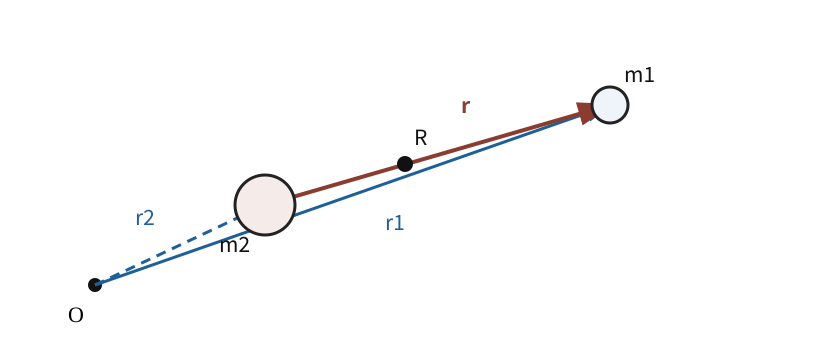
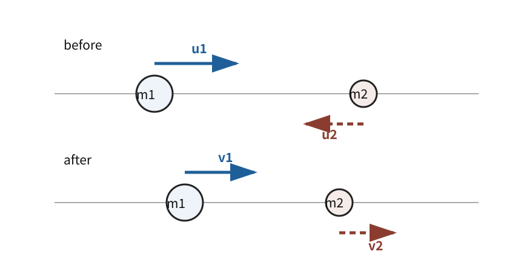

# MECH7 質点系・重心・衝突

<!-- definition-example-audit: strict -->

> **既出概念**：[MECH2 の Newton の第2法則](../MECH2/index.md#principle-mech2-newton-second)と[第3法則](../MECH2/index.md#principle-mech2-newton-third)、[MECH3 の運動エネルギー](../MECH3/index.md#def-mech3-kinetic-energy)、[MECH4 の運動量と力積](../MECH4/index.md#def-mech4-linear-momentum)、[MECH6 の Newton の万有引力](../MECH6/index.md#principle-mech6-newtonian-gravitation)を使います。

MECH6 では中心天体を固定し、その周囲を一つの質点が運動する問題として扱いました。しかし実際には、二つの天体は互いに引き合い、どちらも動きます。衝突でも同じで、見るべき対象は一個の質点ではなく、**複数の質点を一つの系として見たときに何が保存され、何が内部運動として残るか**です。

本章の中心となる流れは

$$
\boxed{
\text{各質点の Newton 方程式}
\longrightarrow
\text{内力の相殺}
\longrightarrow
\text{重心運動}
\longrightarrow
\text{相対運動}
\longrightarrow
\text{換算質量}
}
$$

です。衝突では同じ分解を使って、

$$
\boxed{
\text{重心の並進}
+
\text{重心から見た相対運動}
}
$$

としてエネルギーの行方を読みます。

---

## 1. 多粒子系では「内側」と「外側」を分ける

質量 $m_i>0$、位置 $r_i(t)\in\mathbb R^3$ を持つ $N$ 個の質点を考えます。質点 $i$ に外部から働く力を $F_i^{\mathrm{ext}}$、質点 $j$ から質点 $i$ に働く内力を $F_{ij}$ と書きます。

各質点について Newton の第2法則は

$$
m_i\ddot r_i
=
F_i^{\mathrm{ext}}
+
\sum_{j\ne i}F_{ij}
$$

です。

ここで Newton の第3法則を、同じ時刻の一組 $(i,j)$ について

$$
\boxed{
F_{ij}=-F_{ji}
}
$$

と仮定します。重要なのは、$F_{ij}$ と $F_{ji}$ は**同じ質点に働く二力ではない**ことです。別々の質点に働く作用反作用の組なので、個々の運動方程式では消えません。しかし全質点の式を足し合わせると、系の内部で対になって消えます。

---

## 2. 全運動量の時間変化は外力だけで決まる

系全体の運動量を

$$
P
:=
\sum_{i=1}^N m_i\dot r_i
$$

とします。

<!-- formal-statement-start -->
### 定理（質点系の全運動量収支）

質量 $m_i>0$ の $N$ 質点が

$$
m_i\ddot r_i
=
F_i^{\mathrm{ext}}
+
\sum_{j\ne i}F_{ij}
$$

に従い、すべての $i\ne j$ について Newton の第3法則

$$
F_{ij}=-F_{ji}
$$

が成り立つとする。このとき全運動量

$$
P=\sum_{i=1}^N m_i\dot r_i
$$

は

$$
\boxed{
\frac{dP}{dt}
=
\sum_{i=1}^N F_i^{\mathrm{ext}}
}
$$

を満たす。

特に外力の総和が 0 なら $P$ は保存する。
<!-- formal-statement-end -->

### 証明の見取り図

各質点の Newton 方程式を全部足します。内力は $(i,j)$ と $(j,i)$ が必ず組になり、第3法則で相殺します。

<!-- proof-start -->
### 証明

まず

$$
\frac{dP}{dt}
=
\sum_{i=1}^N m_i\ddot r_i.
$$

各質点の運動方程式を代入すると

$$
\frac{dP}{dt}
=
\sum_{i=1}^N F_i^{\mathrm{ext}}
+
\sum_{i=1}^N\sum_{j\ne i}F_{ij}.
$$

二重和の内力項を $i<j$ の組ごとにまとめると

$$
\sum_{i=1}^N\sum_{j\ne i}F_{ij}
=
\sum_{1\le i<j\le N}
(F_{ij}+F_{ji}).
$$

Newton の第3法則 $F_{ij}=-F_{ji}$ より各括弧が 0 なので

$$
\sum_{i=1}^N\sum_{j\ne i}F_{ij}=0.
$$

従って

$$
\boxed{
\frac{dP}{dt}
=
\sum_{i=1}^N F_i^{\mathrm{ext}}
}.
$$

外力の総和が 0 なら $dP/dt=0$ なので $P$ は一定です。
<!-- proof-end -->

この定理は「内力が小さい」から成り立つのではありません。衝突中の接触力のように内力が非常に大きくても、作用反作用の組として全運動量には寄与しません。

---

## 3. 重心は系全体の代表位置になる

多数の位置 $r_i$ をそのまま追う代わりに、まず系全体の並進を一つの点で代表させたいと考えます。その役割を持つのが、質量で重み付けした平均位置です。

全質量を

$$
M:=\sum_{i=1}^N m_i
$$

とします。

<!-- formal-statement-start -->
### 定義（重心）

質量 $m_i>0$、位置 $r_i$ を持つ $N$ 質点系について

$$
\boxed{
R
:=
\frac{1}{M}
\sum_{i=1}^N m_i r_i,
\qquad
M=\sum_{i=1}^N m_i
}
$$

を **重心**（質量中心）とする。
<!-- formal-statement-end -->

<!-- definition-example-start: def-mech7-center-of-mass -->

### **定義の確認**：二質点の重心

一直線上の $x_1=0$ に質量 $m_1$、$x_2=L$ に質量 $m_2$ があるとします。重心座標は

$$
X
=
\frac{m_1\cdot0+m_2L}{m_1+m_2}
=
\frac{m_2}{m_1+m_2}L.
$$

$m_2>m_1$ なら $X>L/2$ となり、重心は重い第2質点側へ寄ります。等質量なら $X=L/2$ です。

<!-- definition-example-end -->

図では $R$ が二質点を結ぶ線分上にあり、相対位置 $r=r_1-r_2$ は第2質点から第1質点へ向きます。この向きは後の符号に効くので、本文でも固定して使います。

<!-- formal-statement-start -->
### 定理（重心の運動方程式）

上の質点系で全質量を $M$、重心を $R$ とする。Newton の第3法則が内力に成り立つなら

$$
\boxed{
P=M\dot R
}
$$

かつ

$$
\boxed{
M\ddot R
=
\sum_{i=1}^N F_i^{\mathrm{ext}}
}
$$

である。
<!-- formal-statement-end -->

<!-- proof-start -->
### 証明

重心の定義を微分すると

$$
\dot R
=
\frac1M
\sum_{i=1}^N m_i\dot r_i.
$$

質量は一定なので $M$ も一定です。両辺に $M$ を掛けて

$$
M\dot R
=
\sum_{i=1}^N m_i\dot r_i
=
P.
$$

さらに時間微分すると

$$
M\ddot R
=
\frac{dP}{dt}.
$$

[質点系の全運動量収支](#thm-mech7-total-momentum-balance)を使えば

$$
\frac{dP}{dt}
=
\sum_{i=1}^N F_i^{\mathrm{ext}}.
$$

従って

$$
\boxed{
M\ddot R
=
\sum_{i=1}^N F_i^{\mathrm{ext}}
}.
$$
<!-- proof-end -->

外力の総和が 0 なら

$$
\ddot R=0,
$$

つまり重心は等速直線運動をします。内部でどれほど複雑な衝突や振動が起きても、外から押されない限り重心の運動は変わりません。

---

## 4. 二体問題を「重心」と「相対位置」に分ける

ここから $N=2$ とします。質量を $m_1,m_2$、位置を $r_1,r_2$ とし、

$$
M:=m_1+m_2
$$

と置きます。重心は

$$
R
=
\frac{m_1r_1+m_2r_2}{M}.
$$

二つの質点の離れ方を表すため、相対位置を

$$
\boxed{
r:=r_1-r_2
}
$$

と定めます。

$R$ と $r$ が分かれば元の $r_1,r_2$ も回収できます。実際、

$$
r_1=r_2+r
$$

を重心の式へ代入すると

$$
MR
=
m_1(r_2+r)+m_2r_2
=
Mr_2+m_1r.
$$

従って

$$
r_2
=
R-\frac{m_1}{M}r.
$$

さらに $r_1=r_2+r$ なので

$$
r_1
=
R-\frac{m_1}{M}r+r
=
R+\frac{m_2}{M}r.
$$

よって

$$
\boxed{
r_1
=
R+\frac{m_2}{M}r,
\qquad
r_2
=
R-\frac{m_1}{M}r
}.
$$

二つの位置を別々に追う代わりに、**系全体の並進 $R$ と、内部の離れ方 $r$ を別々に追える**ようになりました。

---

## 5. 換算質量：二体問題を一体問題へ変える

外力がなく、二質点の間にだけ内力が働くとします。質点2が質点1へ及ぼす力を $F(r)$ とし、[Newton の第3法則](../MECH2/index.md#principle-mech2-newton-third)により質点1が質点2へ及ぼす力は $-F(r)$ とします。

運動方程式は

$$
m_1\ddot r_1=F(r),
\qquad
m_2\ddot r_2=-F(r)
$$

です。

相対加速度は

$$
\ddot r
=
\ddot r_1-\ddot r_2
=
\frac{F(r)}{m_1}
+
\frac{F(r)}{m_2}.
$$

ここに現れる係数を、一つの質量の逆数としてまとめたいと考えます。

<!-- formal-statement-start -->
### 定義（換算質量）

二つの正の質量 $m_1,m_2$ に対して

$$
\boxed{
\mu
:=
\frac{m_1m_2}{m_1+m_2}
}
$$

を **換算質量** とする。

同値に

$$
\boxed{
\frac1\mu
=
\frac1{m_1}
+
\frac1{m_2}
}
$$

である。
<!-- formal-statement-end -->

<!-- definition-example-start: def-mech7-reduced-mass -->

### **定義の確認**：極端な質量比と等質量

$m_2\gg m_1$ なら

$$
\mu
=
\frac{m_1}{1+m_1/m_2}
\approx m_1.
$$

重い質点2がほぼ固定中心に見える極限で、換算質量は軽い質点の質量へ近づきます。

一方 $m_1=m_2=m$ なら

$$
\mu
=
\frac{m^2}{2m}
=
\frac m2.
$$

等質量二体の相対運動では、見かけの質量は各質点の半分になります。

<!-- definition-example-end -->

<!-- formal-statement-start -->
### 定理（二体問題の重心・相対運動への縮約）

外力のない二質点系で

$$
m_1\ddot r_1=F(r),
\qquad
m_2\ddot r_2=-F(r),
\qquad
r=r_1-r_2
$$

とする。全質量 $M=m_1+m_2$、重心 $R$、換算質量 $\mu=m_1m_2/M$ に対して

$$
\boxed{
M\ddot R=0
}
$$

および

$$
\boxed{
\mu\ddot r=F(r)
}
$$

が成り立つ。
<!-- formal-statement-end -->

<!-- proof-start -->
### 証明

外力がないので重心の運動方程式から

$$
M\ddot R=0.
$$

相対運動については

$$
\ddot r
=
\frac{F(r)}{m_1}
+
\frac{F(r)}{m_2}
=
\left(
\frac1{m_1}
+
\frac1{m_2}
\right)F(r).
$$

換算質量の定義

$$
\frac1\mu
=
\frac1{m_1}
+
\frac1{m_2}
$$

を使うと

$$
\ddot r
=
\frac1\mu F(r).
$$

従って

$$
\boxed{
\mu\ddot r=F(r)
}.
$$
<!-- proof-end -->

この式は「本当に一個の粒子しかない」という意味ではありません。二個の質点の**相対運動だけ**が、質量 $\mu$ の一個の仮想質点の運動方程式と同じ形になる、という意味です。

---

## 6. 運動エネルギーも二つに分かれる

二体の速度は

$$
\dot r_1
=
\dot R+\frac{m_2}{M}\dot r,
$$

$$
\dot r_2
=
\dot R-\frac{m_1}{M}\dot r
$$

です。

<!-- formal-statement-start -->
### 定理（二体の運動エネルギー分解）

二質点の全運動エネルギー

$$
K
=
\frac12m_1|\dot r_1|^2
+
\frac12m_2|\dot r_2|^2
$$

は

$$
\boxed{
K
=
\frac12M|\dot R|^2
+
\frac12\mu|\dot r|^2
}
$$

と分解される。
<!-- formal-statement-end -->

<!-- proof-start -->
### 証明

$r_1,r_2$ の速度表示を代入します。

$$
\begin{aligned}
2K
&=
m_1
\left|
\dot R+\frac{m_2}{M}\dot r
\right|^2
+
m_2
\left|
\dot R-\frac{m_1}{M}\dot r
\right|^2.
\end{aligned}
$$

内積を使って展開すると、$\dot R\cdot\dot r$ の係数は

$$
2m_1\frac{m_2}{M}
-
2m_2\frac{m_1}{M}
=
0
$$

なので交差項が消えます。

$|\dot R|^2$ の係数は

$$
m_1+m_2=M.
$$

$|\dot r|^2$ の係数は

$$
m_1\frac{m_2^2}{M^2}
+
m_2\frac{m_1^2}{M^2}
=
\frac{m_1m_2(m_1+m_2)}{M^2}
=
\frac{m_1m_2}{M}
=
\mu.
$$

従って

$$
2K
=
M|\dot R|^2+\mu|\dot r|^2,
$$

すなわち

$$
\boxed{
K
=
\frac12M|\dot R|^2
+
\frac12\mu|\dot r|^2
}.
$$
<!-- proof-end -->

第1項は系全体の並進、第2項は二質点が互いに近づいたり離れたりする内部運動です。衝突で失われ得るのは主に第2項で、外力がない限り重心の速度は変わりません。

---

## 7. 万有引力の二体問題は MECH6 と同じ形になる

二質点が万有引力だけで相互作用するとします。相対位置

$$
r=r_1-r_2,
\qquad
\rho=|r|
$$

に対し、質点1に働く力は

$$
F(r)
=
-\frac{Gm_1m_2}{\rho^3}r.
$$

二体縮約から

$$
\mu\ddot r
=
-\frac{Gm_1m_2}{\rho^3}r.
$$

ここで

$$
m_1m_2=M\mu
$$

なので

$$
\boxed{
\mu\ddot r
=
-\frac{GM\mu}{\rho^3}r
},
\qquad
M=m_1+m_2.
$$

これは [MECH6 の固定中心問題](../MECH6/index.md#principle-mech6-newtonian-gravitation)で

- 運動する質量を $\mu$
- 中心質量を $M=m_1+m_2$

と置いた式と同じです。

従って相対軌道について MECH6 の結果をそのまま使えます。楕円軌道なら周期 $T$ と相対軌道の長半径 $a$ は

$$
\boxed{
T^2
=
\frac{4\pi^2}{G(m_1+m_2)}a^3
}
$$

を満たします。

固定中心近似 $m_2\gg m_1$ では

$$
m_1+m_2\approx m_2,
\qquad
\mu\approx m_1
$$

なので MECH6 の式が回収されます。

---

## 8. 衝突では「短時間の力積」を見る

衝突中には、物体間の接触力が短時間に大きくなります。個々の力を時間ごとに追うより、衝突区間 $[t_-,t_+]$ で全運動量収支を積分します。

$$
P(t_+)-P(t_-)
=
\int_{t_-}^{t_+}
\sum_i F_i^{\mathrm{ext}}(t)\,dt.
$$

衝突時間が短く、重力など外力による力積を無視できるなら

$$
\boxed{
P_{\mathrm{after}}
\approx
P_{\mathrm{before}}
}.
$$

外力の総力積が厳密に 0 なら、近似ではなく厳密な等号です。

図では同じ二質点を衝突前後に分けて描いています。運動量保存は「それぞれの速度が保存する」という意味ではなく、質量を掛けたベクトル和が保存するという意味です。

衝突では運動量だけでなく、運動エネルギーが保存するかどうかを区別します。

<!-- formal-statement-start -->
### 定義（弾性衝突・非弾性衝突）

外力の総力積を無視できる衝突について、衝突前後の全運動エネルギーが等しいとき **弾性衝突** とする。

$$
K_{\mathrm{before}}
=
K_{\mathrm{after}}.
$$

全運動エネルギーが保存しない衝突を **非弾性衝突** とする。

特に衝突後に二物体が一体となって同じ速度で動く場合を **完全非弾性衝突** とする。
<!-- formal-statement-end -->

<!-- definition-example-start: def-mech7-collision-types -->

### **定義の確認**：くっつく衝突

一次元で質量 $m_1,m_2$ が速度 $u_1,u_2$ で衝突し、その後一体となって速度 $V$ で動くなら

$$
m_1u_1+m_2u_2
=
(m_1+m_2)V.
$$

従って

$$
V
=
\frac{m_1u_1+m_2u_2}{m_1+m_2}.
$$

これは衝突前の重心速度そのものです。運動量は保存しますが、一般には運動エネルギーは減少するので完全非弾性衝突です。

<!-- definition-example-end -->

---

## 9. 一次元弾性衝突の速度公式

衝突前の速度を $u_1,u_2$、衝突後を $v_1,v_2$ とします。外力の力積を無視し、弾性衝突とします。

運動量保存は

$$
m_1u_1+m_2u_2
=
m_1v_1+m_2v_2.
$$

運動エネルギー保存は

$$
\frac12m_1u_1^2+\frac12m_2u_2^2
=
\frac12m_1v_1^2+\frac12m_2v_2^2.
$$

<!-- formal-statement-start -->
### 定理（一次元弾性衝突の速度）

$m_1,m_2>0$ の二質点が一次元で弾性衝突し、衝突前後で外力の総力積が 0 とする。衝突前速度を $u_1,u_2$、衝突後速度を $v_1,v_2$ とすると

$$
\boxed{
v_1
=
\frac{m_1-m_2}{m_1+m_2}u_1
+
\frac{2m_2}{m_1+m_2}u_2
}
$$

$$
\boxed{
v_2
=
\frac{2m_1}{m_1+m_2}u_1
+
\frac{m_2-m_1}{m_1+m_2}u_2
}
$$

である。
<!-- formal-statement-end -->

### 証明の見取り図

運動量保存と運動エネルギー保存を直接二元二次方程式として解く代わりに、エネルギー差を因数分解します。そこから「相対速度が符号反転する」ことを得ると、残りは二元一次方程式です。

<!-- proof-start -->
### 証明

運動量保存を移項すると

$$
m_1(u_1-v_1)
=
-m_2(u_2-v_2).
$$

運動エネルギー保存を 2 倍して移項すると

$$
m_1(u_1^2-v_1^2)
+
m_2(u_2^2-v_2^2)
=
0.
$$

平方差を使って

$$
m_1(u_1-v_1)(u_1+v_1)
+
m_2(u_2-v_2)(u_2+v_2)
=
0.
$$

運動量保存から

$$
m_2(u_2-v_2)
=
-m_1(u_1-v_1)
$$

なので

$$
m_1(u_1-v_1)
\left[
(u_1+v_1)-(u_2+v_2)
\right]
=
0.
$$

速度が全く変わらない自明な場合を除けば

$$
u_1+v_1=u_2+v_2,
$$

従って

$$
\boxed{
v_1-v_2=-(u_1-u_2)
}.
$$

この式と運動量保存

$$
m_1v_1+m_2v_2
=
m_1u_1+m_2u_2
$$

を連立します。

相対速度式から

$$
v_1=v_2-u_1+u_2.
$$

これを運動量保存へ代入すると

$$
m_1(v_2-u_1+u_2)+m_2v_2
=
m_1u_1+m_2u_2.
$$

従って

$$
(m_1+m_2)v_2
=
2m_1u_1+(m_2-m_1)u_2,
$$

よって

$$
v_2
=
\frac{2m_1}{m_1+m_2}u_1
+
\frac{m_2-m_1}{m_1+m_2}u_2.
$$

さらに相対速度式へ戻すと

$$
v_1
=
\frac{m_1-m_2}{m_1+m_2}u_1
+
\frac{2m_2}{m_1+m_2}u_2.
$$
<!-- proof-end -->

等質量 $m_1=m_2$ では

$$
v_1=u_2,
\qquad
v_2=u_1
$$

となり、速度を交換します。

---

## 10. 完全非弾性衝突で失われる運動エネルギー

一次元で完全非弾性衝突を考えます。衝突後の共通速度は

$$
V
=
\frac{m_1u_1+m_2u_2}{M},
\qquad
M=m_1+m_2.
$$

これは重心速度です。

衝突前の相対速度は

$$
\dot r=u_1-u_2.
$$

運動エネルギー分解から

$$
K_{\mathrm{before}}
=
\frac12MV^2
+
\frac12\mu(u_1-u_2)^2.
$$

衝突後は二物体が同じ速度 $V$ なので相対速度は 0 です。

$$
K_{\mathrm{after}}
=
\frac12MV^2.
$$

従って失われた運動エネルギーは

<!-- formal-statement-start -->
### 命題（完全非弾性衝突の運動エネルギー損失）

外力の総力積が 0 の一次元完全非弾性衝突で、衝突前速度を $u_1,u_2$ とする。このとき

$$
\boxed{
K_{\mathrm{before}}-K_{\mathrm{after}}
=
\frac12\mu(u_1-u_2)^2
}
$$

である。
<!-- formal-statement-end -->

<!-- proof-start -->
### 証明

二体の運動エネルギー分解を衝突前へ適用すると

$$
K_{\mathrm{before}}
=
\frac12M|\dot R|^2
+
\frac12\mu|\dot r|^2.
$$

一次元では

$$
\dot R=V,
\qquad
\dot r=u_1-u_2.
$$

従って

$$
K_{\mathrm{before}}
=
\frac12MV^2
+
\frac12\mu(u_1-u_2)^2.
$$

完全非弾性衝突後は $v_1=v_2=V$ なので相対速度は 0 です。よって

$$
K_{\mathrm{after}}
=
\frac12MV^2.
$$

差を取れば

$$
\boxed{
K_{\mathrm{before}}-K_{\mathrm{after}}
=
\frac12\mu(u_1-u_2)^2
}.
$$
<!-- proof-end -->

失われた運動エネルギーは、重心の並進エネルギーではなく、**衝突前に存在していた相対運動のエネルギー**です。実物体ではこの分が変形、熱、音、内部振動などへ移ります。

---

## 11. 重心系で見ると衝突の構造が一行になる

重心とともに動く基準系では

$$
\dot R=0.
$$

そのため二体の全運動量は 0 で、運動エネルギーは

$$
\boxed{
K_{\mathrm{CM}}
=
\frac12\mu|\dot r|^2
}
$$

だけになります。

弾性衝突なら $K_{\mathrm{CM}}$ が保存するので、一次元では

$$
|v_1-v_2|
=
|u_1-u_2|.
$$

非自明な衝突では進行方向が入れ替わるため

$$
v_1-v_2
=
-(u_1-u_2).
$$

完全非弾性衝突なら衝突後の相対速度が 0 なので、重心系の運動エネルギーをすべて失います。

「運動量保存」と「運動エネルギー保存」が別々のルールに見えていたものが、重心系では

- 重心速度は外力でしか変わらない
- 弾性か非弾性かは内部の相対運動エネルギーが残るかで決まる

と整理できます。

---

## 12. 本章の見取り図

質点系の各運動方程式を足すと、Newton の第3法則により内力が消え、

$$
\frac{dP}{dt}
=
F_{\mathrm{ext,total}}
$$

が得られます。重心

$$
R
=
\frac1M\sum_i m_ir_i
$$

を使えば

$$
P=M\dot R,
\qquad
M\ddot R=F_{\mathrm{ext,total}}.
$$

二体問題では

$$
r=r_1-r_2,
\qquad
\mu=\frac{m_1m_2}{m_1+m_2}
$$

を導入することで

$$
M\ddot R=0,
\qquad
\mu\ddot r=F(r)
$$

へ分離できます。さらに

$$
K
=
\frac12M|\dot R|^2
+
\frac12\mu|\dot r|^2
$$

なので、重心の並進と内部の相対運動をエネルギーの上でも分離できます。

この換算質量は、古典力学だけの技巧ではありません。後の水素様原子でも、電子と原子核の二体問題を相対座標へ縮約すると同じ

$$
\mu=\frac{m_1m_2}{m_1+m_2}
$$

が現れます。

次の MECH8 では、質点の集まりの内部距離が固定された極限として剛体を導入し、並進に加えて回転を記述します。

---

# 演習

## Level A

### A1. 二質点の重心

一直線上で、質量 $m_1=2\,\mathrm{kg}$ の質点が $x_1=0\,\mathrm{m}$、質量 $m_2=3\,\mathrm{kg}$ の質点が $x_2=10\,\mathrm{m}$ にある。

1. 重心座標 $X$ を求めよ。
2. 原点を $x=4\,\mathrm{m}$ へ平行移動した座標 $x'=x-4$ で各位置を表し、新しい重心座標 $X'$ を直接計算せよ。
3. $X'=X-4$ を確認せよ。

- Level: A

<!-- solution-start -->
#### 詳細解答

全質量は

$$
M=2+3=5\,\mathrm{kg}.
$$

重心は

$$
X
=
\frac{2\cdot0+3\cdot10}{5}
=
\boxed{6\,\mathrm{m}}.
$$

新座標では

$$
x_1'=-4\,\mathrm{m},
\qquad
x_2'=6\,\mathrm{m}.
$$

従って

$$
X'
=
\frac{2(-4)+3(6)}5
=
\frac{-8+18}{5}
=
\boxed{2\,\mathrm{m}}.
$$

一方

$$
X-4=6-4=2\,\mathrm{m}
$$

なので一致します。重心も座標原点と同じだけ平行移動します。
<!-- solution-end -->

### A2. 換算質量

次の二体について換算質量を求めよ。

1. $m_1=m_2=m$
2. $m_1=m$, $m_2=9m$
3. $m_2\to\infty$ の極限

- Level: A

<!-- solution-start -->
#### 詳細解答

[換算質量](#def-mech7-reduced-mass)は

$
\mu=\frac{m_1m_2}{m_1+m_2}
$$

を使います。

等質量なら

$$
\mu
=
\frac{m^2}{2m}
=
\boxed{\frac m2}.
$$

$m_2=9m$ なら

$$
\mu
=
\frac{9m^2}{10m}
=
\boxed{\frac9{10}m}.
$$

$m_2\to\infty$ では

$$
\mu
=
\frac{m_1}{1+m_1/m_2}
\longrightarrow
\boxed{m_1}.
$$

重い側を固定中心とみなす極限が回収されます。
<!-- solution-end -->

### A3. 完全非弾性衝突の共通速度

一次元で $m_1=2\,\mathrm{kg}$ が $u_1=5\,\mathrm{m/s}$、$m_2=3\,\mathrm{kg}$ が $u_2=-1\,\mathrm{m/s}$ で進み、衝突後に一体となった。外力の力積を無視して共通速度を求めよ。

- Level: A

<!-- solution-start -->
#### 詳細解答

運動量保存より

$$
m_1u_1+m_2u_2
=
(m_1+m_2)V.
$$

数値を代入すると

$$
2\cdot5+3(-1)
=
5V.
$$

従って

$$
7=5V,
$$

$$
\boxed{
V=1.4\,\mathrm{m/s}
}.
$$

正方向へ進みます。この速度は衝突前の重心速度です。
<!-- solution-end -->

### A4. 等質量の弾性衝突

一次元で $m_1=m_2=m$ とする。[一次元弾性衝突の速度](#thm-mech7-one-dimensional-elastic-collision)から、衝突後に速度が交換されることを示せ。

- Level: A

<!-- solution-start -->
#### 詳細解答

$m_1=m_2=m$ を公式へ代入すると

$$
v_1
=
\frac{m-m}{2m}u_1
+
\frac{2m}{2m}u_2
=
u_2,
$$

$$
v_2
=
\frac{2m}{2m}u_1
+
\frac{m-m}{2m}u_2
=
u_1.
$$

従って

$$
\boxed{
v_1=u_2,
\qquad
v_2=u_1
}.
$$

等質量の一次元弾性衝突では、二質点は速度を交換します。
<!-- solution-end -->

## Level B

### B1. 重心運動と内部運動を分離する

外力のない二質点系で

$$
r_1
=
R+\frac{m_2}{M}r,
\qquad
r_2
=
R-\frac{m_1}{M}r,
\qquad
M=m_1+m_2
$$

とする。

1. $m_1r_1+m_2r_2=MR$ を確認せよ。
2. 全運動量が $P=M\dot R$ となることを確認せよ。
3. $\dot R=0$ の重心系では $m_1\dot r_1+m_2\dot r_2=0$ となることを示せ。

- Level: B

<!-- solution-start -->
#### 詳細解答

位置表示を代入すると

$$
\begin{aligned}
m_1r_1+m_2r_2
&=
m_1
\left(
R+\frac{m_2}{M}r
\right)
+
m_2
\left(
R-\frac{m_1}{M}r
\right)\\
&=
(m_1+m_2)R
+
\frac{m_1m_2-m_1m_2}{M}r\\
&=
MR.
\end{aligned}
$$

次に時間微分すると

$$
m_1\dot r_1+m_2\dot r_2
=
M\dot R.
$$

左辺は全運動量 $P$ なので

$$
\boxed{
P=M\dot R
}.
$$

重心系では $\dot R=0$ だから

$$
\boxed{
m_1\dot r_1+m_2\dot r_2=0
}.
$$

これは重心系で二質点の運動量が常に反対向きで釣り合うことを表します。
<!-- solution-end -->

### B2. 二体万有引力を相対運動へ縮約する

二質点 $m_1,m_2$ が万有引力だけで相互作用する。$r=r_1-r_2$、$\rho=|r|$ とする。

1. 質点1に働く力を $r$ で表せ。
2. 相対運動が
   $$
   \mu\ddot r=-GM\mu\,r/\rho^3
   $$
   を満たすことを示せ。
3. MECH6 の固定中心問題と対応する質量を答えよ。
4. 楕円相対軌道の周期公式を求めよ。

- Level: B

<!-- solution-start -->
#### 詳細解答

$r=r_1-r_2$ は質点2から質点1へ向くので、質点1への引力は質点2の方向、すなわち $-r$ 方向です。

$$
F(r)
=
-\frac{Gm_1m_2}{\rho^3}r.
$$

二体縮約より

$$
\mu\ddot r=F(r).
$$

従って

$$
\mu\ddot r
=
-\frac{Gm_1m_2}{\rho^3}r.
$$

$m_1m_2=M\mu$ を使えば

$$
\boxed{
\mu\ddot r
=
-\frac{GM\mu}{\rho^3}r
}.
$$

これは MECH6 の固定中心式で、運動する質量を $\mu$、中心質量を

$$
\boxed{
M=m_1+m_2
}
$$

としたものと同じです。

したがって相対軌道の長半径を $a$、周期を $T$ とすると

$$
\boxed{
T^2
=
\frac{4\pi^2}{G(m_1+m_2)}a^3
}.
$$
<!-- solution-end -->

### B3. 完全非弾性衝突のエネルギー損失

一次元で質量 $m_1,m_2$、衝突前速度 $u_1,u_2$ の二物体が完全非弾性衝突をする。外力の総力積を 0 とする。

1. 衝突後速度 $V$ を求めよ。
2. 衝突前後の運動エネルギー差を直接計算し、
   $$
   \frac12\mu(u_1-u_2)^2
   $$
   になることを示せ。
3. $u_1=u_2$ なら損失が 0 になる理由を説明せよ。

- Level: B

<!-- solution-start -->
#### 詳細解答

運動量保存から

$$
V
=
\frac{m_1u_1+m_2u_2}{M},
\qquad
M=m_1+m_2.
$$

衝突前の運動エネルギーは

$$
K_i
=
\frac12m_1u_1^2
+
\frac12m_2u_2^2.
$$

衝突後は

$$
K_f
=
\frac12MV^2
=
\frac{(m_1u_1+m_2u_2)^2}{2M}.
$$

差の 2 倍を計算します。

$$
\begin{aligned}
2(K_i-K_f)
&=
m_1u_1^2+m_2u_2^2
-
\frac{(m_1u_1+m_2u_2)^2}{M}\\
&=
\frac{
M(m_1u_1^2+m_2u_2^2)
-
(m_1u_1+m_2u_2)^2
}{M}.
\end{aligned}
$$

分子を展開すると

$$
\begin{aligned}
& (m_1+m_2)(m_1u_1^2+m_2u_2^2)
-(m_1^2u_1^2+2m_1m_2u_1u_2+m_2^2u_2^2)\\
&=
m_1m_2u_1^2
-2m_1m_2u_1u_2
+m_1m_2u_2^2\\
&=
m_1m_2(u_1-u_2)^2.
\end{aligned}
$$

従って

$$
K_i-K_f
=
\frac12
\frac{m_1m_2}{M}
(u_1-u_2)^2.
$$

換算質量 $\mu=m_1m_2/M$ を使えば

$$
\boxed{
K_i-K_f
=
\frac12\mu(u_1-u_2)^2
}.
$$

$u_1=u_2$ なら衝突前から相対速度が 0 です。二物体は互いに近づいていないため、失われる相対運動エネルギーも 0 になります。
<!-- solution-end -->

## Level C

### C1. 二体問題と衝突を重心・相対座標で統一する

外力のない二質点系を考える。質量を $m_1,m_2$、位置を $r_1,r_2$ とし、

$$
M=m_1+m_2,
\qquad
R=\frac{m_1r_1+m_2r_2}{M},
\qquad
r=r_1-r_2,
\qquad
\mu=\frac{m_1m_2}{M}
$$

とする。

1. $r_1,r_2$ を $R,r$ で表せ。
2. 内力が $F(r)$ と $-F(r)$ の組であるとき、$M\ddot R=0$ と $\mu\ddot r=F(r)$ を導け。
3. 全運動エネルギーを
   $$
   K=\frac12M|\dot R|^2+\frac12\mu|\dot r|^2
   $$
   と分解せよ。
4. 万有引力なら相対運動が MECH6 の固定中心問題と同型になることを示せ。
5. 一次元弾性衝突では相対速度が符号反転することを導け。
6. 完全非弾性衝突では相対速度が 0 になり、失われる運動エネルギーが衝突前の相対運動エネルギーに等しいことを示せ。
7. 以上から、「重心運動」と「内部運動」を分ける利点を説明せよ。

- Level: C

<!-- solution-start -->
#### 詳細解答

4節で得た重心・相対座標の変換を使うと

$
\boxed{
r_1
=
R+\frac{m_2}{M}r,
\qquad
r_2
=
R-\frac{m_1}{M}r
}
$$

です。

運動方程式を

$$
m_1\ddot r_1=F(r),
\qquad
m_2\ddot r_2=-F(r)
$$

とします。両式を足すと

$$
m_1\ddot r_1+m_2\ddot r_2=0.
$$

左辺は $M\ddot R$ なので

$$
\boxed{
M\ddot R=0
}.
$$

一方

$$
\ddot r
=
\ddot r_1-\ddot r_2
=
\frac{F(r)}{m_1}
+
\frac{F(r)}{m_2}
=
\frac{F(r)}\mu.
$$

従って

$$
\boxed{
\mu\ddot r=F(r)
}.
$$

速度表示は

$$
\dot r_1
=
\dot R+\frac{m_2}{M}\dot r,
\qquad
\dot r_2
=
\dot R-\frac{m_1}{M}\dot r.
$$

これを全運動エネルギーへ代入します。交差項の係数は

$$
m_1\frac{m_2}{M}
-
m_2\frac{m_1}{M}
=
0
$$

なので消え、$|\dot r|^2$ の係数は

$$
\frac{m_1m_2^2+m_2m_1^2}{M^2}
=
\frac{m_1m_2}{M}
=
\mu.
$$

よって

$$
\boxed{
K
=
\frac12M|\dot R|^2
+
\frac12\mu|\dot r|^2
}.
$$

万有引力では

$$
F(r)
=
-\frac{Gm_1m_2}{|r|^3}r.
$$

$m_1m_2=M\mu$ なので

$$
\mu\ddot r
=
-\frac{GM\mu}{|r|^3}r.
$$

これは MECH6 の式で運動質量を $\mu$、中心質量を $M=m_1+m_2$ としたものです。

次に一次元弾性衝突を考えます。運動量保存と運動エネルギー保存から

$$
m_1(u_1-v_1)
=
-m_2(u_2-v_2)
$$

と

$$
m_1(u_1-v_1)(u_1+v_1)
+
m_2(u_2-v_2)(u_2+v_2)
=
0
$$

を得ます。第1式を第2式へ使うと、非自明な衝突では

$$
u_1+v_1=u_2+v_2.
$$

従って

$$
\boxed{
v_1-v_2
=
-(u_1-u_2)
}.
$$

相対速度が大きさを保って反転します。

完全非弾性衝突では衝突後に

$$
v_1=v_2=V
$$

なので

$$
\dot r_{\mathrm{after}}
=
v_1-v_2
=
0.
$$

一方、重心速度は運動量保存により衝突前後で変わりません。従って

$$
K_{\mathrm{before}}
=
\frac12MV^2
+
\frac12\mu(u_1-u_2)^2,
$$

$$
K_{\mathrm{after}}
=
\frac12MV^2.
$$

よって

$$
\boxed{
K_{\mathrm{before}}-K_{\mathrm{after}}
=
\frac12\mu(u_1-u_2)^2
}.
$$

この一連の計算から、重心・相対座標の利点は明確です。外力がなければ重心運動は単純な等速運動として切り離せます。万有引力の軌道、弾性衝突、非弾性衝突の違いはすべて、残った相対運動 $r$ とそのエネルギーをどう扱うかへ集約されます。
<!-- solution-end -->
