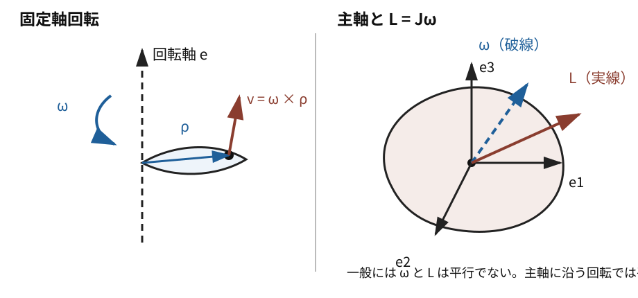

# MECH8 剛体の回転

<!-- definition-example-audit: strict -->

> **既出概念**：[MECH4 のトルクと角運動量](../MECH4/index.md#def-mech4-torque)、[MECH7 の重心](../MECH7/index.md#def-mech7-center-of-mass)、[F0-00F1 の実対称行列のスペクトル定理](../F0_00F1_固有空間_スペクトル定理_PSD/index.md#thm-real-symmetric-spectral)を使います。

MECH7 までは、物体を質点または質点の集まりとして扱ってきました。ところが、コマ、車輪、人工衛星の姿勢のような問題では、同じ物体の中にある点どうしの位置関係を保ったまま、物体全体が向きを変えます。各点を別々の Newton 方程式で追うことはできますが、それでは「どの軸まわりに回りやすいか」「角速度と角運動量はどちらを向くか」が見えにくくなります。

本章では、形を保つ物体を一つの対象としてまとめ、

$$
\boxed{
\text{剛体}
\longrightarrow
\text{固定軸の慣性モーメント}
\longrightarrow
\text{慣性テンソル}
\longrightarrow
\text{主軸}
\longrightarrow
\text{Euler 方程式}
}
$$

という順に進みます。

特に重要なのは、質点の式 $L=r\times p$ を多数の質点について足すと、一般には

$$
L=J\omega
$$

となり、**角運動量 $L$ と角速度 $\omega$ は同じ向きとは限らない**ことです。これが剛体回転で最初に現れる三次元らしさです。

左図では固定軸まわりの点の速度を、右図では主軸と一般の $\omega,L$ の向きを示しています。右図で二本の矢印がずれていることが、慣性テンソルを導入する理由です。

---

## 1. 剛体とは何を固定するモデルか

現実の物体は力を加えればわずかに変形します。しかし、変形が回転運動に比べて十分小さい場面では、物体内部の二点間距離が変わらないと理想化すると、運動を「並進」と「向きの変化」に分けられます。

<!-- formal-statement-start -->
### 定義（剛体）

質点 $i=1,\dots,N$ の位置を $r_i(t)\in\mathbb R^3$ とする。すべての組 $i,j$ について

$$
|r_i(t)-r_j(t)|
$$

が時間 $t$ によらず一定であるとき、この質点系を **剛体** とする。
<!-- formal-statement-end -->

<!-- definition-example-start: def-mech8-rigid-body -->
### 定義の確認：二点を結ぶ棒

二質点の位置を

$$
r_1(t)=R(t)+a e(t),
\qquad
r_2(t)=R(t)-a e(t),
$$

とし、$a>0$、$|e(t)|=1$ とします。このとき

$$
r_1-r_2=2a e(t)
$$

なので

$$
|r_1-r_2|=2a
$$

は一定です。$R(t)$ が動き、$e(t)$ が回転しても二点間距離は変わらないので、この二質点系は剛体の条件を満たします。
<!-- definition-example-end -->

剛体という仮定は「物体内部の力を無視する」という意味ではありません。むしろ、内部の拘束力が距離を保つ結果だけを採用し、その細かな変形をモデルから外す理想化です。

---

## 2. 重心の並進と重心から見た配置

全質量を $M=\sum_i m_i$、重心を

$$
R=\frac1M\sum_i m_i r_i
$$

とし、重心から各質点への位置を

$$
\rho_i:=r_i-R
$$

と置きます。すると

$$
\sum_i m_i\rho_i
=
\sum_i m_i(r_i-R)
=
MR-MR
=
0.
$$

この恒等式が、あとで並進エネルギーと回転エネルギーの交差項を消します。

位置は

$$
\boxed{
r_i=R+\rho_i
}
$$

と分かれます。$R$ は物体全体の並進、$\rho_i$ の向きの変化は重心まわりの回転を表します。

剛体では

$$
|\rho_i-\rho_j|
$$

が一定なので、重心から見た点配置は形を変えずに回転します。

---

## 3. 固定軸回転では速度は $\omega\times\rho$ になる

まず一般の三次元回転へ進む前に、空間に固定された単位ベクトル $e$ を軸とする回転を考えます。回転角を $\phi(t)$ とし、

$$
\omega(t):=\dot\phi(t)e
$$

を角速度ベクトルとします。

<!-- formal-statement-start -->
### 命題（固定軸回転の速度）

原点を通る固定軸 $e$ のまわりを角度 $\phi(t)$ で回転する点の位置を $\rho(t)$ とし、角速度を

$$
\omega(t)=\dot\phi(t)e
$$

とする。このとき速度は

$$
\boxed{
\dot\rho=\omega\times\rho
}
$$

である。
<!-- formal-statement-end -->

### 証明の見取り図

座標軸を回転軸に合わせます。$e=e_z$ とすれば、軸方向成分は動かず、垂直平面内の二成分だけが通常の円運動をします。

<!-- proof-start -->
### 証明

$e=e_z=(0,0,1)$ とします。軸に垂直な距離を $a\ge0$、軸方向座標を $z$ とすれば

$$
\rho(t)
=
\begin{pmatrix}
a\cos\phi(t)\\
a\sin\phi(t)\\
z
\end{pmatrix}.
$$

時間微分すると

$$
\dot\rho
=
\dot\phi
\begin{pmatrix}
-a\sin\phi\\
a\cos\phi\\
0
\end{pmatrix}.
$$

一方

$$
\omega
=
\dot\phi
\begin{pmatrix}
0\\0\\1
\end{pmatrix}
$$

なので、外積を計算すると

$$
\omega\times\rho
=
\dot\phi
\begin{pmatrix}
-a\sin\phi\\
a\cos\phi\\
0
\end{pmatrix}.
$$

従って

$$
\dot\rho=\omega\times\rho.
$$
<!-- proof-end -->

この式から、回転軸に平行な成分は速度へ寄与せず、軸から遠い点ほど速く動くことが分かります。

---

## 4. 固定軸では質量を「軸からの距離の二乗」で重み付けする

回転軸から質点 $i$ までの垂直距離を $d_i$ とします。固定軸回転では

$$
|\dot\rho_i|
=
|\omega|d_i
$$

なので、各質点の運動エネルギーは

$$
\frac12m_i|\dot\rho_i|^2
=
\frac12m_i d_i^2\omega^2
$$

です。全体を足すと、軸ごとに一つの係数へまとめたくなります。

<!-- formal-statement-start -->
### 定義（固定軸まわりの慣性モーメント）

質点系の質点 $i$ の質量を $m_i$、指定した回転軸からの垂直距離を $d_i$ とする。この軸まわりの **慣性モーメント** を

$$
\boxed{
I=\sum_i m_i d_i^2
}
$$

とする。

連続的な質量分布では、質量要素を $dm$ として

$$
\boxed{
I=\int d_\perp^2\,dm
}
$$

とする。
<!-- formal-statement-end -->

<!-- definition-example-start: def-mech8-moment-of-inertia -->
### 定義の確認：一様細棒の中心軸

長さ $\ell$、質量 $M$ の一様な細棒を $x$ 軸上の $-\ell/2\le x\le\ell/2$ に置き、中心を通って棒に垂直な軸のまわりに回します。線密度は

$$
\lambda=\frac{M}{\ell}
$$

なので $dm=\lambda\,dx$、回転軸からの距離は $|x|$ です。従って定義へ代入すると

$$
I_C
=
\int_{-\ell/2}^{\ell/2}x^2\lambda\,dx
=
\frac{M}{\ell}
\left[
\frac{x^3}{3}
\right]_{-\ell/2}^{\ell/2}.
$$

端点を入れると

$$
I_C
=
\frac{M}{\ell}
\frac{\ell^3}{12}
=
\boxed{
\frac{M\ell^2}{12}
}.
$$
<!-- definition-example-end -->

この $I$ を使えば固定軸まわりの回転エネルギーは

$$
\boxed{
K_{\mathrm{rot}}=\frac12I\omega^2
}
$$

となります。質量が軸から遠いほど $d^2$ の重みで強く効くため、同じ質量でも分布によって回転しにくさが変わります。

---

## 5. 軸を平行移動すると慣性モーメントはどう変わるか

毎回積分し直す代わりに、重心を通る軸の慣性モーメントから平行な別軸の値を作れます。鍵は

$$
\sum_i m_i\rho_i=0
$$

です。

<!-- formal-statement-start -->
### 定理（平行軸の定理）

総質量 $M$ の剛体について、重心を通るある軸まわりの慣性モーメントを $I_C$ とする。その軸に平行で、重心軸から垂直距離 $d$ だけ離れた軸まわりの慣性モーメント $I$ は

$$
\boxed{
I=I_C+Md^2
}
$$

を満たす。
<!-- formal-statement-end -->

### 証明の見取り図

回転軸に垂直な平面だけを見て、各質点の重心基準位置を $s_i$、二本の軸のずれを一定ベクトル $a$ とします。$|a|=d$ であり、距離二乗 $|s_i-a|^2$ を展開した交差項が重心条件で消えます。

<!-- proof-start -->
### 証明

重心軸を原点とする軸垂直平面で、質点 $i$ の位置を $s_i$、新しい平行軸の位置を $a$ とします。すると

$$
|a|=d
$$

で、新しい軸からの距離二乗は

$$
|s_i-a|^2
=
|s_i|^2-2a\cdot s_i+|a|^2.
$$

質量を掛けて足すと

$$
I
=
\sum_i m_i|s_i|^2
-2a\cdot\sum_i m_i s_i
+
|a|^2\sum_i m_i.
$$

第1項は $I_C$ です。重心を原点に取ったので

$$
\sum_i m_i s_i=0.
$$

また $\sum_i m_i=M$、$|a|=d$ だから

$$
I
=
I_C+Md^2.
$$
<!-- proof-end -->

一様細棒なら、中心を通る垂直軸から端を通る平行軸までの距離は $d=\ell/2$ です。従って

$$
I_{\mathrm{end}}
=
\frac{M\ell^2}{12}
+
M\left(\frac{\ell}{2}\right)^2
=
\boxed{
\frac{M\ell^2}{3}
}.
$$

---

## 6. 一般の剛体にも各瞬間の角速度がある

固定軸回転では $\omega=\dot\phi e$ と置けました。自由に向きを変える剛体でも、ある瞬間だけを見れば、すべての物体固定方向の変化を一つの角速度ベクトル $\omega$ で表せます。

剛体に固定した正規直交基底を $e_1(t),e_2(t),e_3(t)$ とします。正規直交性

$$
e_i\cdot e_j=\delta_{ij}
$$

を時間微分すると

$$
\dot e_i\cdot e_j
+
e_i\cdot\dot e_j
=
0.
$$

従って、係数

$$
A_{ji}:=e_j\cdot\dot e_i
$$

で作る行列 $A$ は

$$
A_{ji}=-A_{ij}
$$

を満たす反対称行列です。

三次元の反対称行列は一意なベクトル

$$
\omega
=
\omega_1e_1+\omega_2e_2+\omega_3e_3
$$

に対する外積作用と対応し、

$$
Ax=\omega\times x
$$

と書けます。従って各基底ベクトルについて

$$
\boxed{
\dot e_i=\omega\times e_i
}
$$

です。

重心または剛体上の固定点を原点とし、物体に固定された点の位置を

$$
\rho
=
\xi_1e_1+\xi_2e_2+\xi_3e_3
$$

とします。物体固定座標 $\xi_1,\xi_2,\xi_3$ は時間によらないので

$$
\dot\rho
=
\sum_i \xi_i\dot e_i.
$$

上の式を代入すると

$$
\dot\rho
=
\sum_i
\xi_i(\omega\times e_i)
=
\omega\times
\sum_i\xi_i e_i.
$$

従って一般の剛体回転でも各瞬間に

$$
\boxed{
\dot\rho=\omega\times\rho
}
$$

が成り立ちます。

固定軸回転は、この $\omega$ の向きが空間内で変わらない特別な場合です。

---

## 7. 三次元では「一本の数」ではなく慣性テンソルが必要になる

固定軸が最初から決まっているなら、慣性モーメント $I$ だけで十分です。しかし、自由に回転する剛体では回転軸の向きそのものが変化します。

重心または固定点を原点とし、質点 $i$ の位置を $\rho_i$ とします。角速度 $\omega$ に対して各点の速度が

$$
v_i=\omega\times\rho_i
$$

で与えられるとき、角運動量は

$$
L
=
\sum_i \rho_i\times m_i v_i
=
\sum_i m_i\rho_i\times(\omega\times\rho_i)
$$

です。

ベクトル三重積

$$
a\times(b\times c)
=
b(a\cdot c)-c(a\cdot b)
$$

を使うと

$$
\rho_i\times(\omega\times\rho_i)
=
|\rho_i|^2\omega
-
(\rho_i\cdot\omega)\rho_i.
$$

右辺は $\omega$ に線形なので、一つの行列でまとめられます。

<!-- formal-statement-start -->
### 定義（慣性テンソル）

原点から見た質点 $i$ の位置を $\rho_i\in\mathbb R^3$、質量を $m_i$ とする。単位行列を $I_3$ として

$$
\boxed{
J
:=
\sum_i
m_i
\left(
|\rho_i|^2 I_3-\rho_i\rho_i^{\mathsf T}
\right)
}
$$

を、その原点まわりの **慣性テンソル** とする。

連続質量分布では

$$
\boxed{
J
=
\int
\left(
|\rho|^2 I_3-\rho\rho^{\mathsf T}
\right)
dm
}
$$

とする。
<!-- formal-statement-end -->

<!-- definition-example-start: def-mech8-inertia-tensor -->
### 定義の確認：二つの点質量

質量 $m$ の二点を

$$
\rho_1=(a,0,0)^{\mathsf T},
\qquad
\rho_2=(0,b,0)^{\mathsf T}
$$

に置きます。

第1質点の寄与は

$$
m
\left(
a^2I_3-\rho_1\rho_1^{\mathsf T}
\right)
=
m
\begin{pmatrix}
0&0&0\\
0&a^2&0\\
0&0&a^2
\end{pmatrix},
$$

第2質点の寄与は

$$
m
\left(
b^2I_3-\rho_2\rho_2^{\mathsf T}
\right)
=
m
\begin{pmatrix}
b^2&0&0\\
0&0&0\\
0&0&b^2
\end{pmatrix}.
$$

従って

$$
\boxed{
J
=
m
\begin{pmatrix}
b^2&0&0\\
0&a^2&0\\
0&0&a^2+b^2
\end{pmatrix}
}.
$$

定義式の各項を直接足し合わせて慣性テンソルを得ました。
<!-- definition-example-end -->

各項 $|\rho_i|^2I_3-\rho_i\rho_i^{\mathsf T}$ は対称なので、$J$ も実対称行列です。

さらに任意の $x\in\mathbb R^3$ に対して

$$
x^{\mathsf T}Jx
=
\sum_i m_i
\left(
|\rho_i|^2|x|^2-(\rho_i\cdot x)^2
\right).
$$

外積の恒等式

$$
|x\times\rho_i|^2
=
|x|^2|\rho_i|^2-(x\cdot\rho_i)^2
$$

より

$$
\boxed{
x^{\mathsf T}Jx
=
\sum_i m_i|x\times\rho_i|^2
\ge0
}.
$$

従って $J$ は半正定値です。

---

## 8. 慣性テンソルは $L$ と $K$ を同時にまとめる

<!-- formal-statement-start -->
### 定理（慣性テンソルによる角運動量と回転エネルギー）

固定点または重心を原点とし、剛体の各質点の速度が

$$
v_i=\omega\times\rho_i
$$

で与えられるとする。このとき原点まわりの角運動量 $L$ と回転運動エネルギー $K_{\mathrm{rot}}$ は

$$
\boxed{
L=J\omega
}
$$

および

$$
\boxed{
K_{\mathrm{rot}}
=
\frac12\omega^{\mathsf T}J\omega
}
$$

で与えられる。
<!-- formal-statement-end -->

### 証明の見取り図

角運動量にはベクトル三重積を、エネルギーには $|\omega\times\rho|^2$ の恒等式を使います。どちらにも同じ行列 $J$ が現れます。

<!-- proof-start -->
### 証明

角運動量について

$$
L
=
\sum_i
\rho_i\times m_i(\omega\times\rho_i).
$$

ベクトル三重積から

$$
\rho_i\times(\omega\times\rho_i)
=
|\rho_i|^2\omega
-
(\rho_i\cdot\omega)\rho_i.
$$

また

$$
(\rho_i\cdot\omega)\rho_i
=
\rho_i\rho_i^{\mathsf T}\omega.
$$

従って

$$
L
=
\sum_i
m_i
\left(
|\rho_i|^2I_3-\rho_i\rho_i^{\mathsf T}
\right)\omega
=
J\omega.
$$

次に回転運動エネルギーは

$$
K_{\mathrm{rot}}
=
\frac12
\sum_i
m_i|\omega\times\rho_i|^2.
$$

外積の恒等式を使うと

$$
|\omega\times\rho_i|^2
=
|\omega|^2|\rho_i|^2-(\omega\cdot\rho_i)^2.
$$

これを行列で書けば

$$
|\omega\times\rho_i|^2
=
\omega^{\mathsf T}
\left(
|\rho_i|^2I_3-\rho_i\rho_i^{\mathsf T}
\right)
\omega.
$$

従って

$$
K_{\mathrm{rot}}
=
\frac12
\omega^{\mathsf T}J\omega.
$$
<!-- proof-end -->

固定軸の単位方向を $e$ として $\omega=\omega e$ とすれば

$$
K_{\mathrm{rot}}
=
\frac12\omega^2 e^{\mathsf T}Je.
$$

よってその軸まわりの慣性モーメントは

$$
\boxed{
I_e=e^{\mathsf T}Je
}
$$

です。固定軸のスカラー $I$ は、慣性テンソルを方向 $e$ に制限した量だと分かります。

---

## 9. なぜ $\omega$ と $L$ は平行とは限らないのか

質点の円運動では、しばしば角運動量と角速度は同じ軸方向を向きます。しかし剛体では

$$
L=J\omega
$$

であり、一般の対称行列 $J$ はベクトルの向きを変えます。

例えば

$$
J=
\begin{pmatrix}
2&0&0\\
0&3&0\\
0&0&5
\end{pmatrix},
\qquad
\omega=
\begin{pmatrix}
1\\1\\0
\end{pmatrix}
$$

なら

$$
L
=
\begin{pmatrix}
2\\3\\0
\end{pmatrix}.
$$

$\omega$ と $L$ は平行ではありません。

では、どの向きなら平行になるでしょうか。必要なのは

$$
J e=\lambda e
$$

を満たす方向、すなわち慣性テンソルの固有ベクトルです。

<!-- formal-statement-start -->
### 定義（主軸・主慣性モーメント）

慣性テンソル $J$ の単位固有ベクトル $e$ が

$$
Je=I e
$$

を満たすとき、$e$ が張る方向を **主軸**、固有値 $I$ を対応する **主慣性モーメント** とする。
<!-- formal-statement-end -->

<!-- definition-example-start: def-mech8-principal-axis -->
### 定義の確認：対角慣性テンソル

$$
J=
\begin{pmatrix}
2&0&0\\
0&3&0\\
0&0&5
\end{pmatrix}
$$

とします。標準基底 $e_1,e_2,e_3$ について

$$
Je_1=2e_1,
\qquad
Je_2=3e_2,
\qquad
Je_3=5e_3.
$$

従って三つの座標軸は主軸で、主慣性モーメントは $2,3,5$ です。例えば $\omega=\omega_0e_2$ なら

$$
L=J\omega=3\omega_0e_2
$$

となり、$L$ と $\omega$ は同じ $e_2$ 方向を向きます。
<!-- definition-example-end -->

<!-- formal-statement-start -->
### 定理（主軸の存在）

剛体の慣性テンソル $J$ は実対称行列である。従って $\mathbb R^3$ には $J$ の固有ベクトルからなる正規直交基底

$$
e_1,e_2,e_3
$$

が存在する。対応する固有値を $I_1,I_2,I_3$ とすれば、この基底で

$$
\boxed{
J=
\operatorname{diag}(I_1,I_2,I_3)
}
$$

となる。
<!-- formal-statement-end -->

### 証明の見取り図

慣性テンソルの定義から $J^{\mathsf T}=J$ を確認し、[実対称行列のスペクトル定理](../F0_00F1_固有空間_スペクトル定理_PSD/index.md#thm-real-symmetric-spectral)をそのまま適用します。

<!-- proof-start -->
### 証明

各 $\rho_i\rho_i^{\mathsf T}$ は対称行列であり、$|\rho_i|^2I_3$ も対称です。従って

$$
J^{\mathsf T}=J.
$$

よって $J$ は実対称行列です。

F0-00F1 の実対称行列のスペクトル定理を $3\times3$ 実対称行列 $J$ に適用すると、$J$ の固有ベクトルからなる正規直交基底 $e_1,e_2,e_3$ が存在します。

この基底で $Je_k=I_ke_k$ だから、表現行列の第 $k$ 列は $I_ke_k$ の座標

$$
(0,\dots,I_k,\dots,0)^{\mathsf T}
$$

です。従って表現行列は

$$
\operatorname{diag}(I_1,I_2,I_3)
$$

になります。
<!-- proof-end -->

主軸基底で角速度を

$$
\omega
=
\omega_1e_1+\omega_2e_2+\omega_3e_3
$$

と書けば

$$
L
=
I_1\omega_1e_1
+
I_2\omega_2e_2
+
I_3\omega_3e_3
$$

です。一成分だけが非零なら $L\parallel\omega$ ですが、複数成分があり $I_1,I_2,I_3$ が異なれば一般には平行になりません。

---

## 10. 全運動エネルギーは重心の並進と回転へ分かれる

MECH7 の二体問題で見た「重心の並進＋重心から見た内部運動」は、剛体でも同じです。

<!-- formal-statement-start -->
### 命題（剛体の運動エネルギー分解）

総質量 $M$、重心位置 $R$ を持つ剛体について

$$
r_i=R+\rho_i,
\qquad
\sum_i m_i\rho_i=0
$$

とする。重心から見た各点の速度が

$$
\dot\rho_i=\omega\times\rho_i
$$

で与えられるなら、全運動エネルギーは

$$
\boxed{
K
=
\frac12M|\dot R|^2
+
\frac12\omega^{\mathsf T}J_C\omega
}
$$

と分解される。ここで $J_C$ は重心まわりの慣性テンソルである。
<!-- formal-statement-end -->

### 証明の見取り図

$\dot r_i=\dot R+\omega\times\rho_i$ を二乗して足します。交差項は $\sum_i m_i\rho_i=0$ によって消えます。

<!-- proof-start -->
### 証明

$$
K
=
\frac12
\sum_i
m_i
|\dot R+\omega\times\rho_i|^2.
$$

二乗を展開すると

$$
K
=
\frac12
\sum_i m_i|\dot R|^2
+
\sum_i
m_i
\dot R\cdot(\omega\times\rho_i)
+
\frac12
\sum_i
m_i|\omega\times\rho_i|^2.
$$

第1項は

$$
\frac12M|\dot R|^2.
$$

第2項では $\dot R$ と $\omega$ は質点番号 $i$ に依らないので

$$
\sum_i
m_i
\dot R\cdot(\omega\times\rho_i)
=
\dot R\cdot
\left(
\omega\times
\sum_i m_i\rho_i
\right)
=
0.
$$

第3項は慣性テンソルによる回転エネルギーの式から

$$
\frac12\omega^{\mathsf T}J_C\omega.
$$

従って主張を得ます。
<!-- proof-end -->

この分解により、外力による重心の運動と、外トルクによる姿勢の変化を分けて考えられます。

---

## 11. 物体とともに回る基底では微分に補正項が出る

主軸 $e_1,e_2,e_3$ は剛体に固定されているので、空間から見ると基底自体が回転します。ベクトル

$$
A
=
A_1e_1+A_2e_2+A_3e_3
$$

を微分するとき、成分 $A_i$ の変化だけでなく基底 $e_i$ の変化も足す必要があります。

第6節で確認したように、剛体とともに回る正規直交基底では、その瞬間の角速度 $\omega$ に対して

$$
\dot e_i=\omega\times e_i
$$

が成り立ちます。

<!-- formal-statement-start -->
### 命題（回転基底での時間微分）

剛体とともに回る正規直交基底 $e_1,e_2,e_3$ が

$$
\dot e_i=\omega\times e_i
$$

を満たすとする。ベクトル

$$
A=\sum_{i=1}^3 A_i e_i
$$

に対し、基底を固定して成分だけ微分したものを

$$
\left(
\frac{dA}{dt}
\right)_{\mathrm{body}}
:=
\sum_{i=1}^3
\dot A_i e_i
$$

と書く。このとき慣性系から見た時間微分は

$$
\boxed{
\left(
\frac{dA}{dt}
\right)_{\mathrm{space}}
=
\left(
\frac{dA}{dt}
\right)_{\mathrm{body}}
+
\omega\times A
}
$$

である。
<!-- formal-statement-end -->

<!-- proof-start -->
### 証明

積の微分から

$$
\left(
\frac{dA}{dt}
\right)_{\mathrm{space}}
=
\sum_i
\dot A_i e_i
+
\sum_i
A_i\dot e_i.
$$

第1項は定義により

$$
\left(
\frac{dA}{dt}
\right)_{\mathrm{body}}.
$$

第2項では $\dot e_i=\omega\times e_i$ なので

$$
\sum_i A_i\dot e_i
=
\sum_i A_i(\omega\times e_i)
=
\omega\times
\sum_i A_i e_i
=
\omega\times A.
$$

従って主張を得ます。
<!-- proof-end -->

この補正項 $\omega\times A$ が Euler 方程式の非線形項を生みます。

---

## 12. Euler の剛体方程式への入口

外力の重心まわりの総トルクを $\tau$ とします。[MECH4 の角運動量収支](../MECH4/index.md#thm-mech4-angular-momentum-balance)より、慣性系では

$$
\tau
=
\left(
\frac{dL}{dt}
\right)_{\mathrm{space}}.
$$

物体固定基底を主軸 $e_1,e_2,e_3$ に取ると

$$
L
=
I_1\omega_1e_1
+
I_2\omega_2e_2
+
I_3\omega_3e_3.
$$

剛体の質量分布は物体固定基底では変わらないので $I_1,I_2,I_3$ は定数です。

<!-- formal-statement-start -->
### 定理（Euler の剛体方程式）

重心または固定点を原点とし、物体固定基底を慣性テンソルの主軸 $e_1,e_2,e_3$ に取る。主慣性モーメントを $I_1,I_2,I_3$、角速度成分を $\omega_1,\omega_2,\omega_3$、外トルク成分を $\tau_1,\tau_2,\tau_3$ とする。このとき

$$
\boxed{
I_1\dot\omega_1+(I_3-I_2)\omega_2\omega_3=\tau_1
}
$$

$$
\boxed{
I_2\dot\omega_2+(I_1-I_3)\omega_3\omega_1=\tau_2
}
$$

$$
\boxed{
I_3\dot\omega_3+(I_2-I_1)\omega_1\omega_2=\tau_3
}
$$

が成り立つ。
<!-- formal-statement-end -->

### 証明の見取り図

回転基底での微分公式を $A=L$ に適用します。主軸基底では $L_i=I_i\omega_i$ なので、成分微分と $\omega\times L$ を別々に計算します。

<!-- proof-start -->
### 証明

回転基底での微分公式より

$$
\tau
=
\left(
\frac{dL}{dt}
\right)_{\mathrm{body}}
+
\omega\times L.
$$

主軸基底では

$$
L
=
\begin{pmatrix}
I_1\omega_1\\
I_2\omega_2\\
I_3\omega_3
\end{pmatrix},
$$

従って

$$
\left(
\frac{dL}{dt}
\right)_{\mathrm{body}}
=
\begin{pmatrix}
I_1\dot\omega_1\\
I_2\dot\omega_2\\
I_3\dot\omega_3
\end{pmatrix}.
$$

また

$$
\omega\times L
=
\begin{pmatrix}
\omega_1\\
\omega_2\\
\omega_3
\end{pmatrix}
\times
\begin{pmatrix}
I_1\omega_1\\
I_2\omega_2\\
I_3\omega_3
\end{pmatrix}.
$$

外積の第1成分は

$$
\omega_2I_3\omega_3-\omega_3I_2\omega_2
=
(I_3-I_2)\omega_2\omega_3.
$$

第2成分は

$$
\omega_3I_1\omega_1-\omega_1I_3\omega_3
=
(I_1-I_3)\omega_3\omega_1.
$$

第3成分は

$$
\omega_1I_2\omega_2-\omega_2I_1\omega_1
=
(I_2-I_1)\omega_1\omega_2.
$$

これを成分ごとに $\tau$ と等置すれば三本の Euler 方程式を得ます。
<!-- proof-end -->

この式は Newton 力学の外に新しい法則を追加したものではありません。入力は角運動量収支

$$
\tau=\frac{dL}{dt}
$$

であり、**回転する主軸基底でその同じ法則を書き直した結果**です。

---

## 13. 軸対称剛体では Euler 方程式が読みやすくなる

$I_1=I_2=I$、$I_3=J$ とし、外トルクが 0 とします。Euler 方程式は

$$
I\dot\omega_1+(J-I)\omega_2\omega_3=0,
$$

$$
I\dot\omega_2+(I-J)\omega_3\omega_1=0,
$$

$$
J\dot\omega_3=0
$$

です。

最後の式から

$$
\omega_3=\text{一定}
$$

です。

さらに最初の二式から

$$
\dot\omega_1
=
-\frac{J-I}{I}\omega_3\omega_2,
$$

$$
\dot\omega_2
=
\frac{J-I}{I}\omega_3\omega_1.
$$

従って

$$
\frac{d}{dt}
(\omega_1^2+\omega_2^2)
=
2\omega_1\dot\omega_1
+
2\omega_2\dot\omega_2
=
0.
$$

つまり物体固定基底から見ると、$\omega_3$ と横成分の大きさが保たれ、$(\omega_1,\omega_2)$ の向きだけが回ります。

一方、空間から見れば外トルクが 0 なので角運動量 $L$ 自体は一定です。同じ運動でも「空間に固定した基底」と「物体に固定した基底」で見え方が異なることが、剛体回転の重要な点です。

---

## 14. 古典力学 I から解析力学へ

ここまでで、質点から剛体まで Newton 力学の基本対象を一巡しました。

古典力学 I では、運動を

$$
F_{\mathrm{net}}=ma
$$

から出発して、保存量や幾何を使って整理しました。剛体回転では、姿勢を三つの座標成分で直接追うよりも「回転そのもの」を座標化したくなります。

解析力学 I では、この問題をより一般に

- 拘束を持つ系を少数の一般化座標で表す
- 運動方程式を Lagrange 方程式として組み立てる
- 共役運動量と Hamilton 形式へ進む
- 回転や対称性を座標変換・保存則と結び付ける

という形で整理します。

本章の

$$
K_{\mathrm{rot}}
=
\frac12\omega^{\mathsf T}J\omega
$$

は、後で一般化速度に関する二次形式として現れる運動エネルギーの最初の具体例です。

---

# 演習

## Level A

### 問題 A1：四点質量の固定軸慣性モーメント

質量 $m$ の四質点が

$$
(a,0,0),\quad(-a,0,0),\quad(0,b,0),\quad(0,-b,0)
$$

に固定されている。$z$ 軸まわりの慣性モーメントを求めよ。

- Level: A

<!-- solution-start -->
### 詳細解答

$z$ 軸から点 $(x,y,0)$ までの垂直距離の二乗は

$$
d^2=x^2+y^2
$$

です。

$(\pm a,0,0)$ の二点はそれぞれ $d^2=a^2$、$(0,\pm b,0)$ の二点はそれぞれ $d^2=b^2$ です。

従って

$$
I_z
=
ma^2+ma^2+mb^2+mb^2
$$

なので

$$
\boxed{
I_z=2m(a^2+b^2)
}.
$$
<!-- solution-end -->

### 問題 A2：一様細棒の端軸

長さ $\ell$、質量 $M$ の一様細棒について、中心を通り棒に垂直な軸まわりの慣性モーメントが

$$
I_C=\frac{M\ell^2}{12}
$$

であるとする。棒の端を通り、これに平行な軸まわりの慣性モーメントを平行軸の定理で求めよ。

- Level: A

<!-- solution-start -->
### 詳細解答

中心軸と端軸の距離は

$$
d=\frac{\ell}{2}.
$$

平行軸の定理

$$
I=I_C+Md^2
$$

へ代入すると

$$
I
=
\frac{M\ell^2}{12}
+
M\frac{\ell^2}{4}.
$$

通分して

$$
I
=
M\ell^2
\left(
\frac1{12}+\frac3{12}
\right)
=
\boxed{
\frac{M\ell^2}{3}
}.
$$
<!-- solution-end -->

### 問題 A3：二点質量の慣性テンソル

質量 $m$ の二質点が

$$
\rho_1=(a,0,0)^{\mathsf T},
\qquad
\rho_2=(0,b,0)^{\mathsf T}
$$

にある。原点まわりの慣性テンソルを求めよ。

- Level: A

<!-- solution-start -->
### 詳細解答

定義

$$
J
=
\sum_i
m
\left(
|\rho_i|^2I_3-\rho_i\rho_i^{\mathsf T}
\right)
$$

を各質点へ適用します。

第1質点では

$$
|\rho_1|^2=a^2,
\qquad
\rho_1\rho_1^{\mathsf T}
=
\begin{pmatrix}
a^2&0&0\\
0&0&0\\
0&0&0
\end{pmatrix}.
$$

従って寄与は

$$
m
\begin{pmatrix}
0&0&0\\
0&a^2&0\\
0&0&a^2
\end{pmatrix}.
$$

第2質点では

$$
|\rho_2|^2=b^2,
\qquad
\rho_2\rho_2^{\mathsf T}
=
\begin{pmatrix}
0&0&0\\
0&b^2&0\\
0&0&0
\end{pmatrix},
$$

従って寄与は

$$
m
\begin{pmatrix}
b^2&0&0\\
0&0&0\\
0&0&b^2
\end{pmatrix}.
$$

足し合わせて

$$
\boxed{
J
=
m
\begin{pmatrix}
b^2&0&0\\
0&a^2&0\\
0&0&a^2+b^2
\end{pmatrix}
}.
$$
<!-- solution-end -->

### 問題 A4：角速度と角運動量は平行か

$$
J=
\begin{pmatrix}
2&0&0\\
0&3&0\\
0&0&5
\end{pmatrix},
\qquad
\omega=
\begin{pmatrix}
1\\1\\0
\end{pmatrix}
$$

とする。角運動量 $L$ と回転エネルギー $K_{\mathrm{rot}}$ を求め、$L$ と $\omega$ が平行か判定せよ。

- Level: A

<!-- solution-start -->
### 詳細解答

角運動量は

$$
L=J\omega
$$

なので

$$
L
=
\begin{pmatrix}
2\\3\\0
\end{pmatrix}.
$$

もし $L$ と $\omega$ が平行なら、あるスカラー $c$ が存在して

$$
(2,3,0)=c(1,1,0)
$$

となるはずです。しかし第1成分から $c=2$、第2成分から $c=3$ となり矛盾します。

従って

$$
\boxed{
L\not\parallel\omega
}.
$$

回転エネルギーは

$$
K_{\mathrm{rot}}
=
\frac12\omega^{\mathsf T}J\omega
=
\frac12
(1,1,0)
\begin{pmatrix}
2\\3\\0
\end{pmatrix}.
$$

よって

$$
\boxed{
K_{\mathrm{rot}}=\frac52
}.
$$
<!-- solution-end -->

## Level B

### 問題 B1：平行軸の定理を導く

総質量 $M$ の質点系について、重心を原点とする軸垂直平面で各質点の位置を $s_i$ とし

$$
\sum_i m_i s_i=0
$$

とする。新しい平行軸がベクトル $a$ だけずれ、$|a|=d$ であるとき

$$
I=I_C+Md^2
$$

を導け。

- Level: B

<!-- solution-start -->
### 詳細解答

新しい軸から質点 $i$ までの軸垂直平面内の位置は

$$
s_i-a
$$

です。従って新しい軸まわりの慣性モーメントは

$$
I
=
\sum_i m_i|s_i-a|^2.
$$

内積で展開すると

$$
|s_i-a|^2
=
|s_i|^2-2a\cdot s_i+|a|^2.
$$

よって

$$
I
=
\sum_i m_i|s_i|^2
-
2a\cdot\sum_i m_i s_i
+
|a|^2\sum_i m_i.
$$

ここで

$$
\sum_i m_i|s_i|^2=I_C,
$$

重心条件から

$$
\sum_i m_i s_i=0,
$$

また

$$
\sum_i m_i=M,
\qquad
|a|^2=d^2.
$$

従って

$$
\boxed{
I=I_C+Md^2
}.
$$

交差項が消える理由は「軸が平行だから」だけではなく、基準軸が重心を通るためです。
<!-- solution-end -->

### 問題 B2：並進と回転の運動エネルギー分解

剛体の各質点について

$$
r_i=R+\rho_i,
\qquad
\dot r_i=\dot R+\omega\times\rho_i,
\qquad
\sum_i m_i\rho_i=0
$$

とする。全運動エネルギーが

$$
K
=
\frac12M|\dot R|^2
+
\frac12\omega^{\mathsf T}J_C\omega
$$

へ分かれることを示せ。

- Level: B

<!-- solution-start -->
### 詳細解答

出発点は

$$
K
=
\frac12
\sum_i m_i|\dot r_i|^2
$$

です。速度式を代入すると

$$
K
=
\frac12
\sum_i
m_i
|\dot R+\omega\times\rho_i|^2.
$$

二乗を展開して

$$
K
=
\frac12
\sum_i m_i|\dot R|^2
+
\sum_i
m_i\dot R\cdot(\omega\times\rho_i)
+
\frac12
\sum_i
m_i|\omega\times\rho_i|^2.
$$

第1項は

$$
\frac12M|\dot R|^2.
$$

第2項は

$$
\dot R\cdot
\left(
\omega\times
\sum_i m_i\rho_i
\right)
$$

とまとめられます。重心条件

$$
\sum_i m_i\rho_i=0
$$

からこの項は 0 です。

第3項は慣性テンソルの定理より

$$
\frac12\omega^{\mathsf T}J_C\omega.
$$

以上から

$$
\boxed{
K
=
\frac12M|\dot R|^2
+
\frac12\omega^{\mathsf T}J_C\omega
}.
$$
<!-- solution-end -->

### 問題 B3：軸対称剛体の無トルク運動

主慣性モーメントが

$$
I_1=I_2=I,
\qquad
I_3=J
$$

で、外トルクが 0 とする。

1. $\omega_3$ が一定であることを示せ。
2. $\omega_1^2+\omega_2^2$ が一定であることを示せ。
3. $\Omega=((J-I)/I)\omega_3$ と置いたとき

$$
\dot\omega_1=-\Omega\omega_2,
\qquad
\dot\omega_2=\Omega\omega_1
$$

となることを示せ。

- Level: B

<!-- solution-start -->
### 詳細解答

外トルクが 0 なので Euler 方程式は

$$
I\dot\omega_1+(J-I)\omega_2\omega_3=0,
$$

$$
I\dot\omega_2+(I-J)\omega_3\omega_1=0,
$$

$$
J\dot\omega_3=0
$$

です。

第3式で $J>0$ とすれば

$$
\boxed{
\dot\omega_3=0
}
$$

なので $\omega_3$ は一定です。

次に最初の二式を解くと

$$
\dot\omega_1
=
-\frac{J-I}{I}\omega_2\omega_3,
$$

$$
\dot\omega_2
=
\frac{J-I}{I}\omega_3\omega_1.
$$

よって

$$
\frac{d}{dt}
(\omega_1^2+\omega_2^2)
=
2\omega_1\dot\omega_1
+
2\omega_2\dot\omega_2.
$$

上の二式を代入すると

$$
2\omega_1
\left(
-\frac{J-I}{I}\omega_2\omega_3
\right)
+
2\omega_2
\left(
\frac{J-I}{I}\omega_3\omega_1
\right)
=
0.
$$

従って

$$
\boxed{
\omega_1^2+\omega_2^2=\text{一定}
}.
$$

最後に

$$
\Omega
=
\frac{J-I}{I}\omega_3
$$

と置けば

$$
\boxed{
\dot\omega_1=-\Omega\omega_2,
\qquad
\dot\omega_2=\Omega\omega_1
}.
$$

$\omega_3$ は一定なので $\Omega$ も一定です。従って物体固定基底では $(\omega_1,\omega_2)$ が一定角速度で回る形になります。
<!-- solution-end -->

## Level C

### 問題 C1：非主軸回転では成分が結合する

質量 $m$ の四質点を、物体固定座標で

$$
(2b,0,0),\quad(-2b,0,0),\quad(0,b,0),\quad(0,-b,0)
$$

に置く。原点は重心であり、外トルクは 0 とする。

1. 主軸が座標軸であることを示し、主慣性モーメント $I_1,I_2,I_3$ を求めよ。
2. ある時刻に

$$
\omega_1=\Omega,
\qquad
\omega_2=\Omega,
\qquad
\omega_3=0
$$

であったとする。その瞬間の $\dot\omega_1,\dot\omega_2,\dot\omega_3$ を Euler 方程式から求めよ。
3. $\omega_3=0$ であっても、その状態が一般には保たれない理由を説明せよ。

- Level: C

<!-- solution-start -->
### 詳細解答

まず慣性テンソルを求めます。

$x$ 軸上の二質点 $(\pm2b,0,0)$ はそれぞれ

$$
m
\begin{pmatrix}
0&0&0\\
0&4b^2&0\\
0&0&4b^2
\end{pmatrix}
$$

を寄与するので、二つ合わせて

$$
\begin{pmatrix}
0&0&0\\
0&8mb^2&0\\
0&0&8mb^2
\end{pmatrix}.
$$

$y$ 軸上の二質点 $(0,\pm b,0)$ は二つ合わせて

$$
\begin{pmatrix}
2mb^2&0&0\\
0&0&0\\
0&0&2mb^2
\end{pmatrix}.
$$

従って

$$
J
=
\begin{pmatrix}
2mb^2&0&0\\
0&8mb^2&0\\
0&0&10mb^2
\end{pmatrix}.
$$

対角行列なので座標軸が主軸であり、

$$
\boxed{
I_1=2mb^2,
\qquad
I_2=8mb^2,
\qquad
I_3=10mb^2
}.
$$

次に外トルクが 0 なので

$$
I_1\dot\omega_1+(I_3-I_2)\omega_2\omega_3=0.
$$

その瞬間は $\omega_3=0$ だから

$$
I_1\dot\omega_1=0
$$

となり

$$
\boxed{
\dot\omega_1=0
}.
$$

第2式も

$$
I_2\dot\omega_2+(I_1-I_3)\omega_3\omega_1=0
$$

で、$\omega_3=0$ より

$$
\boxed{
\dot\omega_2=0
}.
$$

第3式は

$$
I_3\dot\omega_3
+
(I_2-I_1)\omega_1\omega_2
=
0.
$$

値を代入すると

$$
10mb^2\dot\omega_3
+
(8mb^2-2mb^2)\Omega^2
=
0.
$$

従って

$$
10mb^2\dot\omega_3
+
6mb^2\Omega^2
=
0,
$$

すなわち

$$
\boxed{
\dot\omega_3
=
-\frac35\Omega^2
}.
$$

この値は $\Omega\ne0$ なら非零です。従って、ある瞬間に $\omega_3=0$ でも直後には第3成分が生じます。

原因は

$$
(I_2-I_1)\omega_1\omega_2
$$

という Euler 方程式の結合項です。$\omega$ が一つの主軸だけに沿うなら他成分との積は消えますが、異なる主慣性モーメントを持つ複数の主軸成分を同時に含むと、回転成分どうしが結合します。
<!-- solution-end -->

---

## まとめ

剛体回転では、質点力学の量を捨てるのではなく、多数の質点について足し合わせて構造を見ます。

$$
\boxed{
v_i=\omega\times\rho_i
}
$$

から固定軸の慣性モーメント

$$
\boxed{
I=\sum_i m_i d_i^2
}
$$

が現れ、回転軸が一般化すると

$$
\boxed{
J
=
\sum_i
m_i
\left(
|\rho_i|^2I_3-\rho_i\rho_i^{\mathsf T}
\right)
}
$$

へ進みます。

この行列によって

$$
\boxed{
L=J\omega,
\qquad
K_{\mathrm{rot}}
=
\frac12\omega^{\mathsf T}J\omega
}
$$

が同時に表されます。

$J$ は実対称なので正規直交主軸が存在し、主軸基底では

$$
J=\operatorname{diag}(I_1,I_2,I_3)
$$

です。しかし基底自体が剛体とともに回るため、時間微分には $\omega\times A$ が加わり、それが Euler 方程式

$$
I_1\dot\omega_1+(I_3-I_2)\omega_2\omega_3=\tau_1
$$

などの非線形項を生みます。

これで古典力学 I の質点・保存則・振動・中心力・質点系・剛体という流れがつながり、次の解析力学では「座標の選び方そのもの」を系統的に扱う準備が整いました。
