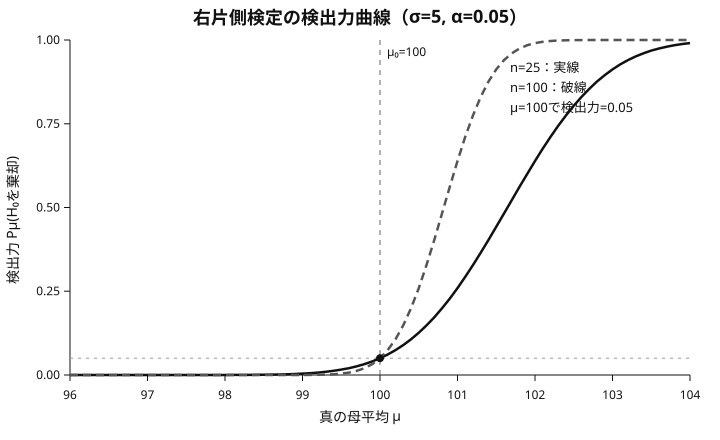
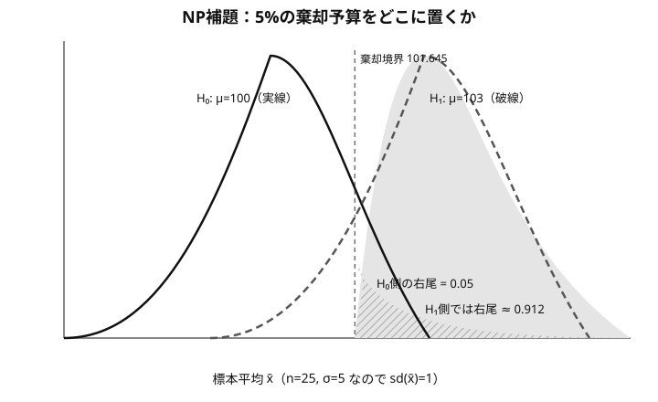

<!-- definition-example-audit: strict -->

# I3-01 検定の基礎とネイマン・ピアソン理論

I2-02 では、標本から母数の候補を区間として残す方法を学びました。本章では逆に、**ある母数値・母数領域を帰無仮説として置き、観測データに基づいて棄却するかどうかを決める方法**を扱います。

本章では記号だけの例を連発しません。中心となる製品重量の例を使い回し、

$$
\boxed{
\text{具体的な数値}
\longrightarrow
\text{何を計算しているか}
\longrightarrow
\text{一般式}
\longrightarrow
\text{理論}
}
$$

の順で進みます。

[ネイマン・ピアソン補題](#lem-i3-01-neyman-pearson)は、単なる尤度比の公式ではありません。**第一種過誤を固定したまま、どこを棄却域に入れれば特定の対立仮説を最も見つけやすいか**を答える最適化原理です。

関連する正本:

- [I1-01 尤度・最尤推定](../I1_01_尤度_最尤推定/index.md)
- [I2-02 区間推定](../I2_02_区間推定/index.md)
- [S1-01 標本分布と t・カイ二乗・F 分布](../S1_01_標本分布とカイ二乗_t_f分布/index.md)
- 発展演習: [Core 63 ネイマン・ピアソン・単調尤度比・一様最強力検定](../../../../statistical-mathematics/core/63_neyman_pearson_ump.md)
- 発展整理: [最強力・一様最強力・一様最強力不偏検定](../../../../statistical-mathematics/core/63a_neyman_pearson_mp_ump_umpu.md)

## この章で解けるようになる問題

- 帰無仮説・対立仮説、単純仮説・複合仮説を区別する。
- 棄却域・検定関数・有意水準を具体的な検定規則から読み取る。
- 第一種の過誤、第二種の過誤、検出力を数値で計算する。
- 検出力曲線を読み、標本サイズを増やす効果を説明する。
- P値を「帰無仮説が正しい確率」と誤読しない。
- 単純対単純仮説で尤度比から最強力検定を構成する。
- ネイマン・ピアソン補題を「第一種過誤予算の最適配分」として説明する。
- 正規母平均の片側検定が一様最強力になる理由を説明する。
- 両側問題で一様最強力検定が通常存在しない理由を説明する。
- 離散分布で境界ランダム化が必要になる理由を計算で確認する。
- 検定を反転すると信頼集合になることを具体例と一般論の両方で理解する。

---

## 0. まず検定を1本、最後までやる

ある工程の製品重量は平均100 gとされ、母標準偏差は既知で

$$
\sigma=5\ \mathrm{g}
$$

とします。25個を無作為に測ったところ

$$
n=25,
\qquad
\bar x=102
$$

でした。平均が100 gから変わったと言えるか、両側5%水準で調べます。

$$
H_0:\mu=100,
\qquad
H_1:\mu\ne100.
$$

帰無仮説の下では

$$
Z
=\frac{\sqrt n(\bar X-100)}5
\sim N(0,1)
$$

なので

$$
Z_{\mathrm{obs}}
=\frac{5(102-100)}5
=2.
$$

両側5%水準の棄却域は

$$
|Z|>z_{0.975}\approx1.96.
$$

今回は

$$
2>1.96
$$

なので $H_0$ を棄却します。P値でも

$$
p
=2\{1-\Phi(2)\}
\approx0.0455<0.05
$$

となり同じ結論です。

> **日本語での結論**  
> 5%有意水準で平均100 gという帰無仮説を棄却する。観測データは、工程平均が100 gと異なることを示す統計的証拠を与えている。

この1本の検定に、これから出てくる用語が全部入っています。

- $H_0$：帰無仮説
- $H_1$：対立仮説
- $Z$：検定統計量
- $|Z|>1.96$：棄却域
- 5%：第一種過誤に課した上限である有意水準
- $p\approx0.0455$：この観測値を棄却側に入れる最小の有意水準

---

## 1. 検定は「データから判断する規則」

<!-- formal-statement-start -->
> **定義（仮説・帰無仮説・対立仮説・単純仮説・複合仮説）**  
> 母数空間 $\Theta$ の部分集合 $\Theta_H$ を用いて $H:\theta\in\Theta_H$ の形で表した主張を仮説という。第一種過誤を制御する側を帰無仮説 $H_0$、検出したい側を対立仮説 $H_1$ という。母数を1点に特定する仮説を単純仮説、複数の母数値を含む仮説を複合仮説という。
<!-- formal-statement-end -->

<!-- definition-example-start: def-i3-01-hypothesis-classification -->
**定義の確認**  
製品重量の例で $H_0:\mu=100$ は1点だけを指定するので単純仮説です。片側問題

$$
H_0:\mu\le100,
\qquad
H_1:\mu>100
$$

なら、どちらも多数の母数値を含むので複合仮説です。
<!-- definition-example-end -->

<!-- formal-statement-start -->
> **定義（検定関数）**  
> 観測標本を $x$ とする。$0\le\varphi(x)\le1$ を満たし、$\varphi(x)$ を「観測値が $x$ のとき帰無仮説を棄却する確率」と解釈する関数を検定関数という。非ランダム検定では $\varphi(x)\in\{0,1\}$ である。
<!-- formal-statement-end -->

<!-- formal-statement-start -->
> **定義（棄却域）**  
> 非ランダム検定で $\varphi(x)=1$ となる標本点の集合を棄却域という。

$$
R=\{x:\varphi(x)=1\}.
$$
<!-- formal-statement-end -->

<!-- formal-statement-start -->
> **定義（検定統計量）**  
> 棄却規則を記述するために標本から計算する統計量 $T(X)$ を検定統計量という。
<!-- formal-statement-end -->

### 1.1 同じ工程を片側検定へ変える

今度は「平均が100 gを**上回ったか**」だけを調べます。

$$
H_0:\mu\le100,
\qquad
H_1:\mu>100.
$$

母標準偏差5 g、標本サイズ25なので標本平均の標準誤差は

$$
\frac5{\sqrt{25}}=1\ \mathrm{g}.
$$

5%右片側検定では $z_{0.95}\approx1.645$ だから

$$
\bar X>100+1.645\times1=101.645
$$

なら棄却します。

したがって

$$
T(X)=\bar X,
\qquad
R=\{\bar X>101.645\},
$$

$$
\varphi(x)
=\mathbf 1\{\bar x>101.645\}.
$$

今回の観測値は $\bar x=102$ なので棄却です。

<!-- definition-example-start: def-i3-01-test-statistic, def-i3-01-test-function, def-i3-01-rejection-region -->
**定義の確認**  
この具体例では「標本平均を計算する」が検定統計量、「101.645を超えたら棄却」が棄却域、「超えたら1、そうでなければ0」が検定関数です。同じ判断規則を3通りに書いているだけです。
<!-- definition-example-end -->

> **注意**  
> 「棄却しない」は「$H_0$ が真だと証明した」ではありません。設定した水準で棄却するほど強い証拠が得られなかった、という意味です。

---

## 2. 第一種の過誤と有意水準

<!-- formal-statement-start -->
> **定義（第一種の過誤）**  
> 真の母数が帰無仮説領域 $\Theta_0$ にあるにもかかわらず $H_0$ を棄却する誤りを第一種の過誤という。母数 $\theta\in\Theta_0$ における第一種過誤確率は $E_\theta[\varphi(X)]$ である。
<!-- formal-statement-end -->

<!-- formal-statement-start -->
> **定義（有意水準・水準）**  
> 帰無仮説 $H_0:\theta\in\Theta_0$ に対し、次を満たす検定を水準 $\alpha$ の検定という。

$$
\sup_{\theta\in\Theta_0}E_\theta[\varphi(X)]\le\alpha.
$$
<!-- formal-statement-end -->

### 2.1 「5%」を工程例で読む

片側検定の棄却規則は

$$
\bar X>101.645.
$$

本当に $\mu=100$ なら

$$
\bar X\sim N(100,1)
$$

なので

$$
P_{100}(\bar X>101.645)
=1-\Phi(1.645)
=0.05.
$$

つまり、工程平均が100 gのままなのに「上昇した」と誤判定する確率を5%にしています。

では帰無仮説内の $\mu=99$ ならどうでしょうか。

$$
P_{99}(\bar X>101.645)
=1-\Phi(2.645)
\approx0.0041.
$$

100 gよりさらに小さい真値では誤棄却しにくくなります。したがって

$$
\sup_{\mu\le100}P_\mu(\bar X>101.645)
=P_{100}(\bar X>101.645)
=0.05.
$$

<!-- definition-example-start: def-i3-01-type1-error, def-i3-01-significance-level -->
**定義の確認**  
複合帰無仮説 $\mu\le100$ では、帰無仮説内の全ての平均について誤棄却確率を考えます。その最大が境界 $\mu=100$ で5%なので、この検定は水準5%です。
<!-- definition-example-end -->

---

## 3. 第二種の過誤と検出力

第一種過誤だけを小さくしたければ、絶対に棄却しなければ0にできます。しかしそれでは異常も一度も見つけられません。そこで、対立仮説が真のときに正しく棄却できる確率を考えます。

<!-- formal-statement-start -->
> **定義（第二種の過誤）**  
> 真の母数が対立仮説領域 $\Theta_1$ にあるのに帰無仮説を棄却しない誤りを第二種の過誤という。対立点 $\theta\in\Theta_1$ における第二種過誤確率は $1-E_\theta[\varphi(X)]$ である。
<!-- formal-statement-end -->

<!-- formal-statement-start -->
> **定義（検出力関数）**  
> 検定関数 $\varphi$ に対し、次を検出力関数という。対立点では大きいほど望ましい。

$$
\beta_\varphi(\theta)
=E_\theta[\varphi(X)]
=P_\theta(H_0\text{ を棄却}).
$$
<!-- formal-statement-end -->

### 3.1 本当に平均が102 gなら、どれくらい見つけられるか

棄却条件は

$$
\bar X>101.645.
$$

本当に $\mu=102$ なら

$$
\bar X\sim N(102,1)
$$

だから検出力は

$$
\begin{aligned}
\beta(102)
&=P_{102}(\bar X>101.645)\\
&=1-\Phi(101.645-102)\\
&=1-\Phi(-0.355)\\
&\approx0.639.
\end{aligned}
$$

したがって第二種過誤確率は

$$
1-0.639=0.361.
$$

> **意味**  
> 工程平均が本当に2 g上昇していても、25個だけ測る設計では約36%は見逃します。

一方、本当に $\mu=103$ なら

$$
\beta(103)
=1-\Phi(101.645-103)
\approx0.912.
$$

3 gの上昇なら約91%の確率で検出できます。

<!-- definition-example-start: def-i3-01-type2-error, def-i3-01-power-function -->
**定義の確認**  
同じ検定でも、真の平均102 gでは検出力約0.639、103 gでは約0.912です。第二種過誤は1個の固定値ではなく、どの対立点が真かによって変わります。
<!-- definition-example-end -->

### 3.2 一般式

既知分散正規平均の右片側検定

$$
H_0:\mu\le\mu_0,
\qquad
H_1:\mu>\mu_0
$$

で

$$
\frac{\sqrt n(\bar X-\mu_0)}\sigma>z_{1-\alpha}
$$

を棄却域とすると

$$
\boxed{
\beta(\mu)
=1-\Phi\left(
z_{1-\alpha}
-\frac{\sqrt n(\mu-\mu_0)}\sigma
\right)
}.
$$

### 3.3 目標検出力から標本サイズを逆算する

「100 gから2 g上昇したら、80%以上の確率で見つけたい」とします。

$$
\Delta=2,
\qquad
\sigma=5,
\qquad
\alpha=0.05,
\qquad
1-\beta_0=0.8.
$$

$z_{0.95}=1.645$、$z_{0.8}=0.842$ より

$$
\begin{aligned}
n
&\ge
\left(
\frac{(1.645+0.842)5}{2}
\right)^2\\
&\approx38.66.
\end{aligned}
$$

従って必要標本サイズは

$$
\boxed{n=39}
$$

以上です。実際、$n=39$ なら $\mu=102$ における検出力は約0.803です。

一般には

$$
\boxed{
n\ge
\left(
\frac{(z_{1-\alpha}+z_{1-\beta_0})\sigma}{\Delta}
\right)^2
}.
$$

---

## 3A. 検出力曲線

<!-- formal-statement-start -->
> **定義（検出力曲線）**  
> 検出力関数 $\beta_\varphi(\theta)=P_\theta(H_0\text{ を棄却})$ を母数 $\theta$ の関数として図示したものを検出力曲線という。
<!-- formal-statement-end -->

この図は

$$
\mu_0=100,
\qquad
\sigma=5,
\qquad
\alpha=0.05
$$

を固定し、$n=25$ と $n=100$ を比較しています。

- $\mu=100$ ではどちらも検出力0.05です。これは第一種過誤を5%に制御していることそのものです。
- $n=25$ では $\mu=102$ の検出力は約0.639です。
- $n=100$ では $\mu=101$ ですでに約0.639、$\mu=102$ では約0.991です。
- 標本サイズを増やすと、帰無境界の近くで曲線が急に立ち上がります。

<!-- definition-example-start: def-i3-01-power-curve -->
**定義の確認**  
検出力曲線は「この検定が何%水準か」だけでなく、「真値がどの程度ずれれば、どのくらいの確率で見つけられるか」を1枚で表します。
<!-- definition-example-end -->

---

## 4. P値は「この観測値なら何%水準から棄却されるか」

<!-- formal-statement-start -->
> **定義（P値）**  
> 水準 $\alpha$ ごとの棄却域 $R_\alpha$ が入れ子になる検定族について、観測値 $x$ に対し次をP値という。

$$
p(x)=\inf\{\alpha:x\in R_\alpha\}.
$$
<!-- formal-statement-end -->

片側の工程例では $\bar x=102$ なので

$$
z_{\mathrm{obs}}
=\frac{102-100}{1}
=2.
$$

右片側P値は

$$
\boxed{
p=1-\Phi(2)\approx0.0228
}.
$$

したがって5%水準では棄却し、1%水準では棄却しません。

<!-- definition-example-start: def-i3-01-pvalue -->
**定義の確認**  
$p\approx0.0228$ は「$H_0$ が真である確率が2.28%」という意味ではありません。この観測値を棄却側に入れる最小の有意水準が約2.28%という意味です。
<!-- definition-example-end -->

---

## 5. 最強力検定と一様最強力検定

水準5%を守る棄却域は1つではありません。では、その5%の「誤棄却予算」をどこに置けば対立仮説を最も見つけやすいのでしょうか。

<!-- formal-statement-start -->
> **定義（最強力検定）**  
> 単純仮説 $H_0:\theta=\theta_0$ 対 $H_1:\theta=\theta_1$ を考える。水準 $\alpha$ の検定 $\varphi^*$ が、任意の水準 $\alpha$ の検定 $\varphi$ に対して次を満たすとき、$\varphi^*$ を $\theta_1$ に対する最強力検定という。

$$
E_{\theta_1}[\varphi^*(X)]
\ge E_{\theta_1}[\varphi(X)].
$$
<!-- formal-statement-end -->

<!-- formal-statement-start -->
> **定義（一様最強力検定）**  
> 複合対立仮説 $H_1:\theta\in\Theta_1$ に対し、水準 $\alpha$ の検定 $\varphi^*$ が任意の水準 $\alpha$ の検定 $\varphi$ に対して、全ての $\theta\in\Theta_1$ で次を満たすとき、$\varphi^*$ を一様最強力検定という。

$$
E_\theta[\varphi^*(X)]
\ge E_\theta[\varphi(X)].
$$
<!-- formal-statement-end -->

<!-- definition-example-start: def-i3-01-most-powerful, def-i3-01-ump -->
**定義の確認**  
「平均が103 gになった」という1点だけを敵に固定して、その敵に対して最も検出力が高いなら最強力です。さらに101 gでも102 gでも103 gでも、100 gより大きい全ての真値に同じ検定が最強なら一様最強力です。
<!-- definition-example-end -->

---

## 6. ネイマン・ピアソン補題

### 6.1 先に図で見る：5%の予算を右側へ置く理由

工程例で、単純対単純

$$
H_0:\mu=100,
\qquad
H_1:\mu=103
$$

を考えます。$n=25,\sigma=5$ なので

$$
\bar X\mid H_0\sim N(100,1),
\qquad
\bar X\mid H_1\sim N(103,1).
$$

水準5%を守るため、$H_0$ の下で棄却域に入る確率は0.05までです。右側に全部置けば境界は

$$
\bar X>101.645.
$$

この棄却域は $H_0$ の確率質量を5%しか使いませんが、$H_1:\mu=103$ の下では

$$
P_{103}(\bar X>101.645)
\approx0.912
$$

を拾います。対立分布が右へ移動しているので、同じ5%を中央や左側へ使うより右側へ使う方が効率的です。

これを一般化したものがネイマン・ピアソン補題です。

<!-- formal-statement-start -->
> **補題（ネイマン・ピアソン補題）**  
> 単純仮説 $H_0:\theta=\theta_0$ 対 $H_1:\theta=\theta_1$ を考え、確率密度関数または確率質量関数を $f_0(x)=f(x;\theta_0)$、$f_1(x)=f(x;\theta_1)$ とする。ある $k\ge0$ と必要なら $0\le\gamma\le1$ を選び、次の検定関数が $E_{\theta_0}[\varphi^*(X)]=\alpha$ を満たすように定める。このとき $\varphi^*$ は水準 $\alpha$ の検定の中で $H_1:\theta=\theta_1$ に対する最強力検定である。

$$
\varphi^*(x)=
\begin{cases}
1,&f_1(x)>k f_0(x),\\
\gamma,&f_1(x)=k f_0(x),\\
0,&f_1(x)<k f_0(x).
\end{cases}
$$
<!-- formal-statement-end -->

要点は

$$
\boxed{
\frac{f_1(x)}{f_0(x)}\text{ が大きい標本点から棄却域へ入れる}
}
$$

です。

### 6.2 「第一種過誤予算1円あたりの検出力」と考える

標本点 $x$ を棄却側に入れると、帰無仮説下では $f_0(x)$ だけ第一種過誤を消費し、対立仮説下では $f_1(x)$ だけ検出力を稼ぎます。したがって

$$
\frac{f_1(x)}{f_0(x)}
$$

は「第一種過誤予算1単位あたりに得られる検出力」に対応します。

<!-- proof-start -->
### 6.3 証明

$\varphi^*$ を上の検定、$\varphi$ を任意の水準 $\alpha$ の検定とします。$\varphi^*$ の定義から各 $x$ について

$$
\{\varphi^*(x)-\varphi(x)\}
\{f_1(x)-k f_0(x)\}
\ge0.
$$

積分すると

$$
E_{\theta_1}[\varphi^*]-E_{\theta_1}[\varphi]
\ge
k\{E_{\theta_0}[\varphi^*]-E_{\theta_0}[\varphi]\}.
$$

$E_{\theta_0}[\varphi^*]=\alpha$ で、$\varphi$ は水準 $\alpha$ だから右辺は0以上です。従って

$$
\boxed{
E_{\theta_1}[\varphi^*]
\ge E_{\theta_1}[\varphi]
}
$$

となります。
<!-- proof-end -->

> **重要**  
> ネイマン・ピアソン補題が直接保証するのは、固定した1つの対立点に対する最強力性です。一様最強力性には「敵を変えても同じ棄却域が最強か」をさらに確認します。

---

## 7. 正規母平均：最強力から片側一様最強力へ

まず

$$
H_0:\mu=100,
\qquad
H_1:\mu=103
$$

を考えます。既知分散正規標本では

$$
\frac{L(103;x)}{L(100;x)}
$$

は $\sum_i x_i$、したがって $\bar x$ の増加関数です。よってネイマン・ピアソン補題から、$\bar X$ が大きい側を棄却するのが最強力です。

水準5%なら

$$
\bar X>101.645.
$$

このとき $\mu=103$ での検出力は約0.912でした。

一般に $\mu_1>\mu_0$ なら

$$
\log\frac{L(\mu_1)}{L(\mu_0)}
=
\frac{n(\mu_1-\mu_0)}{\sigma^2}\bar X
-\frac{n(\mu_1^2-\mu_0^2)}{2\sigma^2}
$$

で、$\bar X$ の係数は常に正です。つまり101 gを敵にしても102 gを敵にしても103 gを敵にしても、最適な方向は常に「大きい $\bar X$」です。

<!-- formal-statement-start -->
> **定理（既知分散正規平均の片側一様最強力検定）**  
> $X_1,\ldots,X_n$ は独立同分布で $N(\mu,\sigma^2)$ に従い、$\sigma$ は既知とする。$H_0:\mu\le\mu_0$ 対 $H_1:\mu>\mu_0$ に対し、次で棄却する検定は水準 $\alpha$ の一様最強力検定である。

$$
\frac{\sqrt n(\bar X-\mu_0)}\sigma>z_{1-\alpha}.
$$
<!-- formal-statement-end -->

理由は、任意の固定対立点 $\mu_1>\mu_0$ に対して同じ上側棄却域が最強力であり、かつ複合帰無仮説 $\mu\le\mu_0$ での棄却確率の最大が境界 $\mu_0$ だからです。

---

## 8. 両側問題ではなぜ一様最強力が壊れるのか

同じ工程で

$$
H_0:\mu=100,
\qquad
H_1:\mu\ne100
$$

を考えます。

右側の敵を $\mu=103$ に固定すると、最強力検定は5%を全て右尾へ使って

$$
\bar X>101.645
$$

です。この検出力は約0.912です。

一方、左側の敵を $\mu=97$ に固定すると、最強力検定は5%を全て左尾へ使って

$$
\bar X<98.355
$$

です。

標準的な両側5%検定は2.5%ずつ分けて

$$
\bar X<98.040
\quad\text{または}\quad
\bar X>101.960
$$

とします。これは妥当な水準5%検定ですが、$\mu=103$ だけを敵にしたときの検出力は約0.851で、片側最強力検定の0.912より低くなります。

<!-- formal-statement-start -->
> **命題（既知分散正規平均の両側問題では一様最強力検定が存在しない）**  
> $0<\alpha<1$ とする。$H_0:\mu=\mu_0$ 対 $H_1:\mu\ne\mu_0$ について、全ての $\mu\ne\mu_0$ に対して最強力となる単一の水準 $\alpha$ 検定は存在しない。
<!-- formal-statement-end -->

右側の敵は右尾へ予算を集中してほしく、左側の敵は左尾へ集中してほしいので、同じ検定が両方に対して最強にはなれません。

> **発展**  
> 両側問題では候補を不偏検定に絞り、そのクラス内で一様に最強な一様最強力不偏検定を考えることがあります。

---

## 9. 離散分布ではランダム化が必要になることがある

コインを5回投げ、表の回数を $X$ とします。

$$
X\sim\operatorname{Bin}(5,p),
$$

$$
H_0:p=0.5,
\qquad
H_1:p>0.5.
$$

5%水準の右片側検定を作りたいとします。尤度比は $X$ とともに増えるので、大きい $X$ から棄却側へ入れます。

ところが

$$
P_{0.5}(X=5)=\frac1{32}=0.03125
$$

だけでは5%を使い切れず、次の $X=4$ まで常に棄却すると

$$
P_{0.5}(X\ge4)
=\frac6{32}
=0.1875
$$

で5%を大幅に超えます。

そこで

- $X=5$ なら必ず棄却
- $X=4$ なら確率 $\gamma$ で棄却
- $X\le3$ なら棄却しない

とします。

$$
\frac1{32}+\gamma\frac5{32}=0.05
$$

より

$$
\boxed{\gamma=0.12}.
$$

例えば対立点 $p=0.8$ での検出力は

$$
\begin{aligned}
P_{0.8}(X=5)
+0.12P_{0.8}(X=4)
&=0.32768+0.12\times0.4096\\
&\approx0.377.
\end{aligned}
$$

ランダム化は、離散分布で「水準をちょうど使い切る」ための理論上の装置です。

---

## 10. 検定と信頼区間は反転でつながる

<!-- formal-statement-start -->
> **定理（検定と信頼集合の双対性）**  
> 各母数値 $\theta_0\in\Theta$ について点帰無仮説 $H_0:\theta=\theta_0$ の水準 $\alpha$ 検定を用意し、その受容域を $A(\theta_0)$ とする。観測値 $x$ に対し次で定めた $C(x)$ は、被覆確率少なくとも $1-\alpha$ の信頼集合である。

$$
C(x)=\{\theta_0:x\in A(\theta_0)\}.
$$
<!-- formal-statement-end -->

### 10.1 最初の工程例で確認する

最初の両側検定では

$$
\left|
\frac{\bar X-\mu_0}{1}
\right|>1.96
$$

なら $H_0:\mu=\mu_0$ を棄却しました。

観測値 $\bar x=102$ に対し、**棄却されない** $\mu_0$ を全部集めると

$$
|102-\mu_0|\le1.96,
$$

したがって

$$
\boxed{100.04\le\mu_0\le103.96}.
$$

これはI2-02で求めた95%信頼区間そのものです。100はこの区間に入らないので、$H_0:\mu=100$ は両側5%検定で棄却されます。

<!-- proof-start -->
### 10.2 一般の証明

真の母数を $\theta$ と固定すると

$$
\theta\in C(X)
\quad\Longleftrightarrow\quad
X\in A(\theta).
$$

従って

$$
P_\theta\{\theta\in C(X)\}
=P_\theta\{X\in A(\theta)\}
=1-P_\theta\{X\in R(\theta)\}
\ge1-\alpha.
$$
<!-- proof-end -->

---

## 11. まとめ

本章の流れは次の通りです。

$$
\boxed{
\text{水準で誤棄却予算を固定}
\longrightarrow
\text{対立点での検出力を考える}
\longrightarrow
\text{NP補題で予算を最適配分}
}
$$

- 第一種過誤は「正常なのに異常判定」。
- 第二種過誤は「異常なのに見逃す」。
- 検出力は「異常を正しく見つける確率」。
- ネイマン・ピアソン補題は、固定した敵に対して $f_1/f_0$ が大きい場所から棄却域へ入れる。
- 同じ棄却域が全ての片側対立点で最強なら一様最強力になる。
- 両側では右の敵と左の敵が要求する最強力棄却域が逆なので、一様最強力が通常存在しない。

---

# 演習

## Level A

### I3-01-A01 第一種・第二種過誤を言葉で区別する

ある製造工程について

$$
H_0:\text{工程は基準内},
\qquad
H_1:\text{工程は異常}
$$

とする。

1. 第一種の過誤を述べよ。
2. 第二種の過誤を述べよ。
3. 水準を小さくすれば両方の誤りが必ず小さくなる、が誤りである理由を述べよ。

<!-- solution-start -->
#### 解答

1. 工程が基準内なのに異常と判定すること。
2. 工程が異常なのに帰無仮説を棄却しないこと。
3. 棄却域を狭くすると第一種過誤は減るが、同じ標本サイズでは異常時にも棄却しにくくなり第二種過誤が増えることがある。
<!-- solution-end -->

### I3-01-A02 工程平均の検出力

$\sigma=5,n=25$ とし、

$$
H_0:\mu\le100,
\qquad
H_1:\mu>100
$$

を右片側5%で検定する。

1. $\bar X$ による棄却域を求めよ。
2. $\mu=102$ での検出力を求めよ。
3. 第二種過誤確率を求めよ。

<!-- solution-start -->
#### 解答

$$
\bar X>100+1.645\frac5{5}=101.645.
$$

$$
\beta(102)
=P_{102}(\bar X>101.645)
=1-\Phi(-0.355)
\approx0.639.
$$

第二種過誤確率は約 $0.361$。
<!-- solution-end -->

### I3-01-A03 P値を数値で求める

上の検定で $\bar x=102$ を観測した。P値と5%・1%水準での結論を述べよ。

<!-- solution-start -->
#### 解答

$$
z_{\mathrm{obs}}=2,
\qquad
p=1-\Phi(2)\approx0.0228.
$$

5%では棄却、1%では棄却しない。
<!-- solution-end -->

### I3-01-A04 検出力曲線を読む

本文の検出力曲線について答えよ。

1. $\mu=100$ で検出力が0.05になる理由を述べよ。
2. $n=25$ で $\mu=102$ の検出力を読め。
3. $n=100$ の曲線が急に立ち上がる理由を述べよ。

<!-- solution-start -->
#### 解答

1. 帰無境界での棄却確率が有意水準そのものだから。
2. 約0.639。
3. 標準誤差が $\sigma/\sqrt n$ で小さくなり、同じ平均差が標準誤差何個分かで見て大きくなるため。
<!-- solution-end -->

## Level B

### I3-01-B01 目標検出力から標本サイズを決める

$\sigma=5$、右片側5%検定で、100 gから2 gの上昇を80%以上の検出力で見つけたい。$z_{0.95}=1.645,z_{0.8}=0.842$ として必要な $n$ を求めよ。

<!-- solution-start -->
#### 解答

$$
n\ge
\left(\frac{(1.645+0.842)5}{2}\right)^2
\approx38.66.
$$

従って $\boxed{n\ge39}$。
<!-- solution-end -->

### I3-01-B02 正規単純対単純で最強力検定を作る

$X_i\sim N(\mu,25)$、$n=25$ とし

$$
H_0:\mu=100,
\qquad
H_1:\mu=103
$$

を5%水準で検定する。

1. 尤度比が $\bar X$ の増加関数であることを示せ。
2. 最強力棄却域を求めよ。
3. 検出力を求めよ。

<!-- solution-start -->
#### 解答

$$
\log\frac{L(103)}{L(100)}
=\frac{25(3)}{25}\bar X-\text{定数}
$$

なので $\bar X$ の増加関数。従って

$$
\boxed{\bar X>101.645}
$$

が最強力棄却域で、検出力は

$$
P_{103}(\bar X>101.645)\approx0.912.
$$
<!-- solution-end -->

### I3-01-B03 離散検定のランダム化

$X\sim\operatorname{Bin}(5,p)$ で $H_0:p=0.5$ 対 $H_1:p>0.5$ を5%で検定する。

1. $X=5$ だけを棄却するときのサイズを求めよ。
2. $X\ge4$ を棄却するときのサイズを求めよ。
3. $X=4$ でランダム化してサイズをちょうど0.05にする確率を求めよ。

<!-- solution-start -->
#### 解答

$$
P_{0.5}(X=5)=1/32=0.03125,
$$

$$
P_{0.5}(X\ge4)=6/32=0.1875.
$$

$$
\frac1{32}+\gamma\frac5{32}=0.05
$$

より $\boxed{\gamma=0.12}$。
<!-- solution-end -->

### I3-01-B04 検定を反転して信頼区間を得る

$\sigma=5,n=25,\bar x=102$ について、各 $\mu_0$ の両側5%検定を反転し、非棄却となる $\mu_0$ の集合を求めよ。

<!-- solution-start -->
#### 解答

$$
|102-\mu_0|\le1.96
$$

より

$$
\boxed{[100.04,103.96]}.
$$
<!-- solution-end -->

## Level C

### I3-01-C01 指数分布で片側一様最強力検定を作る

$X_1,\ldots,X_n$ は率母数 $\lambda$ の指数分布

$$
f(x;\lambda)=\lambda e^{-\lambda x},\qquad x>0
$$

に従う。$H_0:\lambda=\lambda_0$ 対 $H_1:\lambda<\lambda_0$ を考え、$T=\sum_iX_i$ とする。

1. 固定した $\lambda_1<\lambda_0$ について尤度比を求めよ。
2. 最強力棄却域の向きを述べよ。
3. $2\lambda_0T\sim\chi^2_{2n}$ を用いて水準 $\alpha$ の臨界値を求めよ。
4. 一様最強力性を説明せよ。

<!-- solution-start -->
#### 解答

$$
\frac{L(\lambda_1)}{L(\lambda_0)}
=\left(\frac{\lambda_1}{\lambda_0}\right)^n
\exp\{(\lambda_0-\lambda_1)T\}
$$

は $T$ の増加関数。従って

$$
\boxed{2\lambda_0T>\chi^2_{2n,1-\alpha}}
$$

で棄却する。臨界値が $\lambda_1$ に依存しないので、全ての $\lambda_1<\lambda_0$ に同じ検定が最強力となる。
<!-- solution-end -->

### I3-01-C02 両側正規検定に一様最強力がない理由

本文の工程例で、右側対立 $\mu=103$ と左側対立 $\mu=97$ に対する最強力棄却域をそれぞれ書き、なぜ1つの検定で両方を同時に最強にできないか説明せよ。

<!-- solution-start -->
#### 解答

$\mu=103$ には $\bar X>101.645$、$\mu=97$ には $\bar X<98.355$ がそれぞれ最強力。右側へ5%を全部使う規則と左側へ5%を全部使う規則は同一ではないため、両側対立全体に一様最強力検定は存在しない。
<!-- solution-end -->

### I3-01-C03 P値を最小の水準として導く

右片側正規検定で観測統計量が $z_{\mathrm{obs}}$ であるとき、棄却条件

$$
z_{\mathrm{obs}}>z_{1-\alpha}
$$

を $\alpha$ について解き、P値を導け。

<!-- solution-start -->
#### 解答

$$
z_{\mathrm{obs}}>z_{1-\alpha}
\iff
1-\Phi(z_{\mathrm{obs}})<\alpha.
$$

従って境界を含めたP値は

$$
\boxed{p=1-\Phi(z_{\mathrm{obs}})}.
$$
<!-- solution-end -->

### I3-01-C04 検出力・標本サイズ・一様最強力を接続する

既知分散正規平均の右片側検定について、一般の $\mu_0,\sigma,n,\alpha$ で

1. 棄却域
2. 検出力関数
3. $\mu_1=\mu_0+\Delta$ で目標検出力 $1-\beta_0$ を確保する標本サイズ
4. 一様最強力である理由

をまとめよ。

<!-- solution-start -->
#### 解答

$$
\frac{\sqrt n(\bar X-\mu_0)}\sigma>z_{1-\alpha},
$$

$$
\beta(\mu)
=1-\Phi\left(z_{1-\alpha}-\frac{\sqrt n(\mu-\mu_0)}\sigma\right),
$$

$$
n\ge
\left(\frac{(z_{1-\alpha}+z_{1-\beta_0})\sigma}{\Delta}\right)^2.
$$

任意の固定 $\mu_1>\mu_0$ で尤度比が $\bar X$ の増加関数で、同じ上側棄却域が最強力だから一様最強力。
<!-- solution-end -->

## Level D

### I3-01-D01 敵が変わると最強の棄却域も変わる

標本空間を $\{0,1,2\}$ とし、確率質量を

| $x$ | 0 | 1 | 2 |
|---|---:|---:|---:|
| $f_0(x)$ | 0.5 | 0.3 | 0.2 |
| $f_a(x)$ | 0.1 | 0.3 | 0.6 |
| $f_b(x)$ | 0.7 | 0.2 | 0.1 |

とする。水準0.2で $H_{1a}$ と $H_{1b}$ それぞれに対する最強力検定を構成し、複合対立全体に一様最強力検定がない理由を説明せよ。

<!-- solution-start -->
#### 解答

$$
\frac{f_a}{f_0}=(0.2,1,3)
$$

なので $x=2$ で棄却し、検出力は0.6。

$$
\frac{f_b}{f_0}=\left(1.4,\frac23,0.5\right)
$$

なので $x=0$ を優先する。$f_0(0)=0.5$ だから確率 $0.2/0.5=0.4$ で棄却し、検出力は $0.7\times0.4=0.28$。最強力規則が対立点ごとに異なるので1つの検定が両方に最強にはなれない。
<!-- solution-end -->

---

## 30分ドリル

### I3-01-DRILL01 工程平均の検定を設計から解釈まで閉じる

$X_i\sim N(\mu,25)$ とし、$H_0:\mu\le100$ 対 $H_1:\mu>100$ を考える。

1. $n=25$、水準5%の棄却域を求めよ。
2. $\mu=102,103$ での検出力を求めよ。
3. 2 gの上昇を80%の検出力で見つけるための必要標本サイズを求めよ。
4. $\bar x=102$ の右片側P値を求めよ。
5. 任意の $\mu>100$ に対してこの検定が一様最強力になる理由を説明せよ。
6. 両側5%検定なら一様最強力にならない理由を説明せよ。

<!-- solution-start -->
#### 解答

$$
\bar X>101.645.
$$

$$
\beta(102)\approx0.639,
\qquad
\beta(103)\approx0.912.
$$

$$
n\ge39.
$$

$$
p=1-\Phi(2)\approx0.0228.
$$

片側では全ての固定対立点 $\mu>100$ に対して尤度比が $\bar X$ の増加関数なので同じ上側棄却域が最強力。一方、両側では右側の敵と左側の敵で最強力棄却域の方向が逆になる。
<!-- solution-end -->
