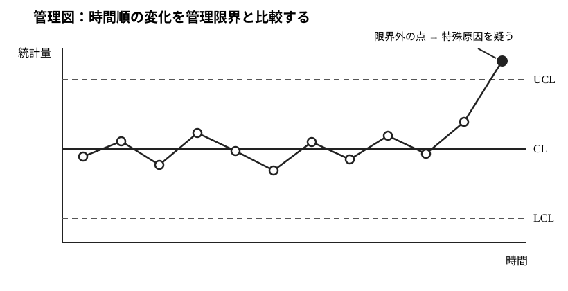
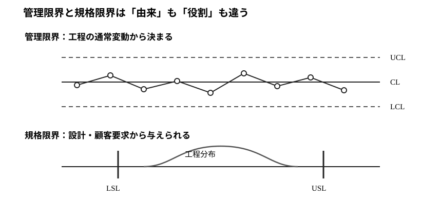
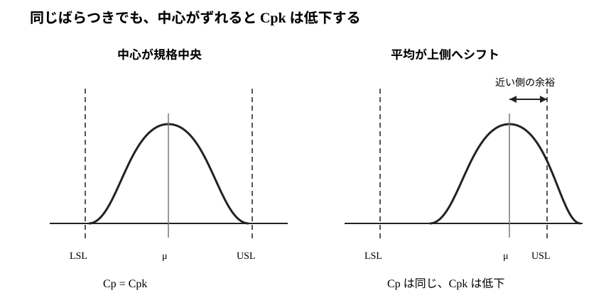

# E4-01 管理図と工程能力

品質管理では、「完成品が規格内だったか」だけでなく、「工程そのものが同じ確率的仕組みで安定して動いているか」を監視します。管理図は工程の時間的安定性を、工程能力指数は安定した工程の分布が規格幅に対して十分狭いかを評価します。この二つは目的が異なるため、**管理限界と規格限界を混同しないこと**が最重要です。

本章は [通常教材の執筆スタイルガイド](../../../style-guide.md)、[共通演習規約](../../../../EXERCISE_GUIDELINES.md)、[共通記号ガイド](../../../../references/notation-guide.md)、[共通用語ガイド](../../../../references/terminology-guide.md)、[分布・記号ガイド](../../../../references/distribution-notation-guide.md) に従います。

## この章で解けるようになる問題

- 共通原因と特殊原因を区別する。
- $\bar X$ 管理図とR管理図の役割を区別し、管理限界を計算する。
- p管理図・np管理図を二項分布から構成する。
- 3シグマ管理限界の誤警報確率と平均連長を説明する。
- 平均シフト後の検出確率を計算する。
- 管理限界と規格限界を区別する。
- $C_p,C_{pk}$ を計算し、中心ずれの影響を説明する。
- 「工程が安定か」と「工程能力が十分か」を順番に判断する。

## 公式出題範囲との対応

| 範囲 | 本章の内容 |
|---|---|
| 管理図 | $\bar X$、R、p、np管理図 |
| プロセス管理 | 共通原因・特殊原因、管理状態、平均連長 |
| 工程能力指数 | $C_p,C_{pk}$、規格限界、中心ずれ |

## 前提知識チェック

1. P3-01: 二項分布。
2. P3-02: 正規分布と標準化。
3. P4-02: 標本平均の分布と正規近似。
4. P2-02: 平均と分散。

---

## 1. 管理図と規格は別の問い

ある工程で直径を毎時間5個測るとします。すべての製品が規格内でも、平均が時間とともに一方向へ移動していれば工程異常の兆候かもしれません。逆に工程が統計的に安定していても、ばらつきが規格幅に比べて大きければ不良品は多くなります。

- **管理図**：工程が時間的に同じ仕組みで動いているか。
- **工程能力**：安定した工程の分布が規格内へ十分収まるか。

したがって「管理状態だから良品工程」とは限らず、「全観測が規格内だから管理状態」とも限りません。

管理図は時間順の統計量を UCL・CL・LCL と比較し、限界外の点や不自然な連続パターンを特殊原因の手掛かりとして扱います。

## 2. 共通原因と特殊原因

工程が本来もつ多数の小さな要因による、安定したばらつきを共通原因による変動といいます。設備故障、原料ロット異常、設定ミスなど、通常とは異なる追加要因による変動を特殊原因による変動といいます。

管理図では中心線をCL、上側管理限界をUCL、下側管理限界をLCLと書きます。一方、規格上限USL・規格下限LSLは設計・顧客要求から定める境界です。

管理限界は工程データから、規格限界は外部要求から決まるため、数値が近くても同じ意味の線ではありません。

## 3. $\bar X$ 管理図

管理状態で各測定値が独立に平均 $\mu_0$、標準偏差 $\sigma$ の正規分布に従うとします。1群あたり $n$ 個測ると
$$
\bar X\sim N\left(\mu_0,\frac{\sigma^2}{n}\right).
$$
したがって3シグマ方式では
$$
CL=\mu_0,
$$
$$
UCL=\mu_0+3\frac{\sigma}{\sqrt n},
\qquad
LCL=\mu_0-3\frac{\sigma}{\sqrt n}.
$$

正規分布なら、工程が正常でも1点が限界外へ出る確率は
$$
P(|Z|>3)\approx0.0027.
$$
各群が独立なら、信号が出るまでの群数は幾何分布とみなせるため、管理状態での平均連長は
$$
ARL_0\approx\frac1{0.0027}\approx370.
$$

## 4. $\bar X$--R管理図

工程平均だけでなく群内ばらつきも監視する必要があります。群 $i$ のレンジを
$$
R_i=X_{i,\max}-X_{i,\min}
$$
とし、平均レンジを $\bar R$ とします。

標本サイズに応じた定数 $A_2,D_3,D_4$ が与えられたとき
$$
\bar X\text{管理図}:\quad
UCL=\bar{\bar X}+A_2\bar R,
$$
$$
CL=\bar{\bar X},\qquad
LCL=\bar{\bar X}-A_2\bar R,
$$
$$
R\text{管理図}:\quad
UCL=D_4\bar R,
\quad CL=\bar R,
\quad LCL=D_3\bar R.
$$

R管理図が管理外なら、平均を評価する前にばらつき変化の原因を確認します。

## 5. p管理図とnp管理図

各製品を「不適合=1、適合=0」で記録し、管理状態での不適合率を $p_0$ とします。群サイズが $n$ なら不適合品数 $X$ は
$$
X\sim\operatorname{Bin}(n,p_0).
$$
不適合率
$$
\hat p=\frac Xn
$$
について
$$
E[\hat p]=p_0,\qquad
\operatorname{Var}(\hat p)=\frac{p_0(1-p_0)}n.
$$
正規近似によるp管理図は
$$
CL=p_0,
$$
$$
UCL=p_0+3\sqrt{\frac{p_0(1-p_0)}n},
$$
$$
LCL=p_0-3\sqrt{\frac{p_0(1-p_0)}n}.
$$
負の下限は実務上0とします。群サイズが変わる場合は限界も群ごとに変わります。

群サイズが一定で、不適合**品数**をそのまま描くnp管理図では
$$
CL=np_0,
$$
$$
UCL=np_0+3\sqrt{np_0(1-p_0)},
$$
$$
LCL=np_0-3\sqrt{np_0(1-p_0)}.
$$

## 6. 平均シフトの検出確率

$\bar X$ 管理図を平均 $\mu_0$、既知標準偏差 $\sigma$ で作った後、実際の工程平均が
$$
\mu_1=\mu_0+\delta\sigma
$$
へ移動したとします。

標本平均の標準偏差は $\sigma/\sqrt n$ なので、新しい平均から見た上側管理限界の標準化値は
$$
3-\delta\sqrt n,
$$
下側管理限界は
$$
-3-\delta\sqrt n.
$$
したがって1群で信号を出す確率は
$$
p_{\mathrm{sig}}
=1-\left[\Phi(3-\delta\sqrt n)-\Phi(-3-\delta\sqrt n)\right].
$$
各群が独立ならシフト後の平均連長は
$$
ARL_1=\frac1{p_{\mathrm{sig}}}.
$$

## 7. 工程能力指数

工程が管理状態にあり、
$$
X\sim N(\mu,\sigma^2)
$$
で近似できるとします。規格幅と工程の自然ばらつき $6\sigma$ を比べる指数が
$$
C_p=\frac{USL-LSL}{6\sigma}.
$$
$C_p$ は規格幅とばらつき幅だけを比較し、平均の中心ずれを反映しません。

中心ずれを考慮するのが
$$
C_{pk}=\min\left\{
\frac{USL-\mu}{3\sigma},
\frac{\mu-LSL}{3\sigma}
\right\}.
$$
常に
$$
C_{pk}\le C_p
$$
で、平均が規格中心にあるとき両者は等しくなります。

分布の幅が同じなら $C_p$ は変わりません。一方、平均が規格中央からずれると近い側の余裕が減るため $C_{pk}$ が低下します。

## 8. 「安定してから能力」を評価する

平均や分散が時間によって変化している工程では、一つの $\mu,\sigma$ で工程を代表すること自体が不適切です。そのため

1. 管理図で特殊原因の有無を確認する。
2. 管理状態と判断できた工程について、$C_p,C_{pk}$ などで規格適合能力を評価する。

という順序が基本です。

---

## 9. 演習：問題の直後に解答

### Level A：基礎部品

#### E4-01-A01 $\bar X$ 管理限界
- Level: A
- 目安時間: 8分
- 主題: $\bar X$管理図
- 使用技術: 標本平均の分布
- calculation_load: low

管理状態で個々の測定値の平均が50、標準偏差が4である。各群 $n=16$ 個を測定するとき、3シグマの中心線・上下管理限界を求めよ。

<!-- solution-start -->

##### 解答

###### 詳細解答

標本平均の標準偏差は
$$
\frac4{\sqrt{16}}=1.
$$
したがって
$$
CL=50,
$$
$$
UCL=50+3\cdot1=53,\qquad
LCL=50-3\cdot1=47.
$$

###### 本番答案

標準誤差は1。よってCL=50、LCL=47、UCL=53。

###### 採点基準

標準誤差8点、中心線4点、上下限8点。合計20点。

<!-- solution-end -->

#### E4-01-A02 3シグマと平均連長
- Level: A
- 目安時間: 7分
- 主題: 誤警報
- 使用技術: 幾何分布の平均
- calculation_load: low

管理状態で1群が3シグマ限界外へ出る確率を0.0027とする。群ごとの判定が独立なら、誤警報までの平均群数を求めよ。

<!-- solution-start -->

##### 解答

###### 詳細解答

1群ごとの信号確率が $p=0.0027$ なので、最初の信号までの群数は成功確率 $p$ の幾何分布とみなせる。その平均は
$$
\frac1p=\frac1{0.0027}\approx370.4.
$$

###### 本番答案

$ARL_0=1/0.0027\approx370$ 群。

###### 採点基準

幾何分布の対応8点、式6点、数値6点。合計20点。

<!-- solution-end -->

#### E4-01-A03 p管理図
- Level: A
- 目安時間: 8分
- 主題: p管理図
- 使用技術: 二項分布の分散
- calculation_load: low

管理状態の不適合率が $p_0=0.04$、群サイズが100とする。3シグマのp管理図の中心線・上下管理限界を求めよ。

<!-- solution-start -->

##### 解答

###### 詳細解答

標準偏差は
$$
\sqrt{\frac{0.04\cdot0.96}{100}}
\approx0.0196.
$$
したがって
$$
UCL\approx0.04+3(0.0196)=0.0988,
$$
$$
LCL\approx0.04-3(0.0196)=-0.0188.
$$
下限は負なので0とする。CL=0.04。

###### 本番答案

CL=0.04、UCL約0.0988、LCL=0。

###### 採点基準

標準偏差8点、上限6点、下限処理6点。合計20点。

<!-- solution-end -->

#### E4-01-A04 $C_p$ と $C_{pk}$
- Level: A
- 目安時間: 8分
- 主題: 工程能力指数
- 使用技術: 規格幅、中心ずれ
- calculation_load: low

$LSL=90,USL=110,\mu=104,\sigma=2$ とする。$C_p,C_{pk}$ を求めよ。

<!-- solution-start -->

##### 解答

###### 詳細解答

$$
C_p=\frac{110-90}{6\cdot2}=\frac53.
$$
一方
$$
C_{pk}=\min\left\{\frac{110-104}{6},\frac{104-90}{6}\right\}
=\min\left\{1,\frac73\right\}=1.
$$
平均が上側へずれているため $C_{pk}<C_p$。

###### 本番答案

$C_p=5/3$、$C_{pk}=1$。

###### 採点基準

$C_p$8点、$C_{pk}$8点、中心ずれ解釈4点。合計20点。

<!-- solution-end -->

### Level B：標準技能

#### E4-01-B01 $\bar X$--R管理図
- Level: B
- 目安時間: 12分
- 主題: $\bar X$--R管理図
- 使用技術: 管理図定数
- calculation_load: medium

群サイズ5で、過去の管理状態データから
$$
\bar{\bar X}=10.0,\qquad \bar R=0.8
$$
を得た。$n=5$ に対する定数を
$$
A_2=0.577,\qquad D_3=0,\qquad D_4=2.114
$$
とする。$\bar X$ 管理図とR管理図の中心線・上下管理限界を求めよ。

<!-- solution-start -->

##### 解答

###### 詳細解答

$\bar X$ 管理図では
$$
UCL=10+0.577\cdot0.8=10.4616,
$$
$$
LCL=10-0.577\cdot0.8=9.5384.
$$
R管理図では
$$
UCL=2.114\cdot0.8=1.6912,
$$
$$
LCL=0\cdot0.8=0.
$$
中心線はそれぞれ10.0、0.8。

###### 本番答案

$\bar X$図: CL=10、LCL=9.5384、UCL=10.4616。R図: CL=0.8、LCL=0、UCL=1.6912。

###### 採点基準

$\bar X$図10点、R図10点。合計20点。

<!-- solution-end -->

#### E4-01-B02 np管理図
- Level: B
- 目安時間: 10分
- 主題: np管理図
- 使用技術: 二項分布
- calculation_load: medium

管理状態の不適合率が $p_0=0.02$、各群 $n=200$ 個で一定とする。不適合品数を描くnp管理図の中心線と3シグマ管理限界を求めよ。

<!-- solution-start -->

##### 解答

###### 詳細解答

不適合品数 $X$ は二項分布で
$$
E[X]=np_0=4,
$$
$$
\operatorname{Var}(X)=np_0(1-p_0)=200\cdot0.02\cdot0.98=3.92.
$$
標準偏差は約1.98。したがって
$$
UCL\approx4+3(1.98)=9.94,
$$
$$
LCL\approx4-3(1.98)<0
$$
なのでLCL=0。

###### 本番答案

CL=4、UCL約9.94、LCL=0。

###### 採点基準

平均5点、分散5点、上限6点、下限4点。合計20点。

<!-- solution-end -->

#### E4-01-B03 群サイズが異なるp管理図
- Level: B
- 目安時間: 12分
- 主題: p管理図
- 使用技術: 標準誤差比較
- calculation_load: medium

管理状態の不適合率を $p_0=0.10$ とする。群サイズが $n=100$ の日と $n=400$ の日について、3シグマp管理図の上側管理限界をそれぞれ求め、群サイズが大きいほど限界幅が狭くなる理由を説明せよ。

<!-- solution-start -->

##### 解答

###### 詳細解答

$n=100$ では
$$
SE=\sqrt{\frac{0.1\cdot0.9}{100}}=0.03,
$$
よって
$$UCL=0.10+3(0.03)=0.19.$$
$n=400$ では
$$
SE=\sqrt{\frac{0.09}{400}}=0.015,
$$
よって
$$UCL=0.145.$$
群サイズが大きいほど不適合率の標準誤差が $1/\sqrt n$ の割合で小さくなるため、同じ3標準偏差でも限界幅は狭くなる。

###### 本番答案

$n=100$ でUCL=0.19、$n=400$ でUCL=0.145。$SE\propto1/\sqrt n$ のため大標本ほど限界が狭い。

###### 採点基準

各上限7点、理由6点。合計20点。

<!-- solution-end -->

#### E4-01-B04 管理状態と工程能力の区別
- Level: B
- 目安時間: 10分
- 主題: 工程判断
- 使用技術: 概念区別
- calculation_load: low

次の二つを別々に判定せよ。

1. すべての測定値は規格内だが、$\bar X$ 管理図で直近1点がUCLを超えた。
2. 管理図には異常信号がないが、$C_{pk}=0.70$ である。

<!-- solution-start -->

##### 解答

###### 詳細解答

1は規格内であっても管理図上は特殊原因を疑う信号であり、工程が管理状態とは言えない。2は工程自体は統計的に安定している可能性が高いが、規格に対する能力が不足している。

###### 本番答案

1. 規格適合でも管理外れ。2. 管理状態でも工程能力不足。

###### 採点基準

各判定8点、管理限界と規格限界の区別4点。合計20点。

<!-- solution-end -->

### Level C：本番標準

#### E4-01-C01 p管理図で工程異常を判定する
- Level: C
- 目安時間: 20分
- 主題: p管理図
- 使用技術: 二項正規近似、工程判断
- calculation_load: medium

過去の管理状態で不適合率 $p_0=0.04$、各群 $n=100$ とする。

1. 3シグマp管理図の管理限界を求めよ。
2. ある群の不適合率が0.11であった。管理図上どう判定するか。
3. この判定と「製品規格を満たすか」という判定の違いを説明せよ。

<!-- solution-start -->

##### 解答

###### 詳細解答

$$
SE=\sqrt{0.04\cdot0.96/100}\approx0.0196.
$$
したがって
$$
UCL\approx0.0988,\qquad LCL=0.
$$
0.11はUCLを超えるため、特殊原因による工程変化を疑う信号である。

管理限界は過去の工程変動から計算される統計的境界である。一方、規格限界は製品に要求される仕様であり、外部から定められる。したがって両者は別の基準である。

###### 本番答案

CL=0.04、UCL約0.0988、LCL=0。0.11は管理外れ。管理限界は工程分布由来、規格限界は要求仕様由来。

###### 採点基準

限界8点、判定5点、両限界の区別7点。合計20点。

<!-- solution-end -->

#### E4-01-C02 平均シフトの検出確率
- Level: C
- 目安時間: 22分
- 主題: 検出力
- 使用技術: 正規標準化
- calculation_load: medium

$\bar X$ 管理図を $\mu_0,\sigma$ を用いて3シグマで作る。群サイズは $n=4$ とする。その後、工程平均だけが $\mu_0+\sigma$ へ1標準偏差だけ上昇した。

1. 新しい平均から見たUCLの標準化値を求めよ。
2. LCL側の確率を無視できるとして、1群で異常信号を出す確率を求めよ。ただし $\Phi(1)=0.8413$ とする。
3. シフト後の平均連長を求めよ。

<!-- solution-start -->

##### 解答

###### 詳細解答

シフト量は $\delta=1$、$\sqrt n=2$ なので、新しい平均から見たUCLは
$$
3-\delta\sqrt n=3-2=1
$$
標準誤差分だけ上にある。したがって上側信号確率は
$$
1-\Phi(1)=1-0.8413=0.1587.
$$
LCL側は非常に遠いため無視すれば
$$
p_{\mathrm{sig}}\approx0.1587.
$$
よって
$$
ARL_1\approx\frac1{0.1587}\approx6.30.
$$

###### 本番答案

UCLの標準化値は1。信号確率は約0.1587、平均連長は約6.3群。

###### 採点基準

標準化7点、信号確率7点、平均連長6点。合計20点。

<!-- solution-end -->

#### E4-01-C03 工程能力と不適合率
- Level: C
- 目安時間: 22分
- 主題: 工程能力指数
- 使用技術: 標準化、正規確率
- calculation_load: medium

管理状態の工程が
$$
X\sim N(100,2^2)
$$
に従い、規格が $94\le X\le106$ とする。

1. $C_p,C_{pk}$ を求めよ。
2. 規格外率を求めよ。ただし $P(Z>3)=0.00135$ とする。
3. 平均が102へずれ、標準偏差が2のままとする。このとき $C_{pk}$ を求めよ。

<!-- solution-start -->

##### 解答

###### 詳細解答

初期状態では
$$
C_p=\frac{106-94}{6\cdot2}=1.
$$
平均100は規格中心なので $C_{pk}=1$。

上下規格は平均から3標準偏差なので
$$
P(X<94\text{ または }X>106)=2(0.00135)=0.0027.
$$

平均102では
$$
C_{pk}=\min\left\{\frac{106-102}{6},\frac{102-94}{6}\right\}
=\min\left\{\frac23,\frac43\right\}=\frac23.
$$

###### 本番答案

初期は $C_p=C_{pk}=1$、規格外率0.0027。平均102では $C_{pk}=2/3$。

###### 採点基準

能力指数8点、規格外率6点、中心ずれ後6点。合計20点。

<!-- solution-end -->

#### E4-01-C04 $\bar X$--R管理図の順序
- Level: C
- 目安時間: 20分
- 主題: 工程管理
- 使用技術: 管理図解釈
- calculation_load: low

ある工程の $\bar X$--R管理図で、$\bar X$ はすべて管理限界内だが、R管理図で2群がUCLを超えた。

1. 工程を管理状態と判断してよいか。
2. $\bar X$ 管理図が限界内だから平均は安定している、と直ちに結論してよいか。
3. 工程能力指数をこのまま計算・解釈することの問題点を述べよ。

<!-- solution-start -->

##### 解答

###### 詳細解答

R管理図が管理外なので、群内ばらつきに特殊原因がある可能性があり、工程全体を管理状態とは判断できない。ばらつき構造が変化していると、$\bar X$ 管理図の限界幅を支える前提も不安定になるため、平均側だけを独立に安全と断定しない。

また工程能力指数は一つの安定した $\mu,\sigma$ を前提に規格幅と比較する指標なので、特殊原因を含む状態で計算しても代表的な工程能力とは解釈しにくい。

###### 本番答案

R図が管理外なので工程は未管理。ばらつき変化を解消してから $\bar X$ 図と工程能力を再評価する。

###### 採点基準

管理状態6点、平均側の解釈6点、工程能力の前提8点。合計20点。

<!-- solution-end -->

#### E4-01-C05 np管理図を二項分布から導く
- Level: C
- 目安時間: 22分
- 主題: np管理図
- 使用技術: 期待値・分散
- calculation_load: medium

各製品が独立に確率 $p_0$ で不適合となり、各群の製品数を一定の $n$ とする。不適合品数を $X$ とする。

1. $E[X]$ と $\operatorname{Var}(X)$ を求めよ。
2. 正規近似による3シグマnp管理図の中心線・上下限を導け。
3. p管理図との使い分けを説明せよ。

<!-- solution-start -->

##### 解答

###### 詳細解答

$X\sim\operatorname{Bin}(n,p_0)$ なので
$$
E[X]=np_0,
$$
$$
\operatorname{Var}(X)=np_0(1-p_0).
$$
したがって標準偏差は $\sqrt{np_0(1-p_0)}$。3シグマ限界は
$$
CL=np_0,
$$
$$
UCL=np_0+3\sqrt{np_0(1-p_0)},
$$
$$
LCL=np_0-3\sqrt{np_0(1-p_0)}.
$$
負のLCLは0とする。

np管理図は群サイズ一定のとき不適合**品数**を直接監視できる。p管理図は不適合**率**を用いるため、群サイズが異なる場合にも限界を調整して使いやすい。

###### 本番答案

二項分布より平均 $np_0$、分散 $np_0(1-p_0)$。これに±3標準偏差を加えてnp管理限界を得る。群サイズ一定ならnp、変動するならpが扱いやすい。

###### 採点基準

平均・分散8点、限界8点、使い分け4点。合計20点。

<!-- solution-end -->

### Level D：発展

#### E4-01-D01 平均シフトと平均連長を一般式で導く
- Level: D
- 目安時間: 35分
- 主題: 管理図の検出性能
- 使用技術: 正規標準化、幾何分布
- calculation_load: high

管理状態では個々の観測が $N(\mu_0,\sigma^2)$ に従い、群サイズ $n$ の $\bar X$ 管理図を
$$
\mu_0\pm3\frac{\sigma}{\sqrt n}
$$
で作る。その後、標準偏差は変わらず平均だけが
$$
\mu_1=\mu_0+\delta\sigma
$$
へ変化したとする。

1. 新しい平均から見たUCL・LCLの標準化値を求めよ。
2. 1群で信号を出す確率 $p_{\mathrm{sig}}$ を標準正規分布関数 $\Phi$ で表せ。
3. 群ごとの判定が独立なら $ARL_1=1/p_{\mathrm{sig}}$ となる理由を説明せよ。
4. $n$ を大きくすると同じ $\delta$ のシフトを検出しやすくなる理由を式から説明せよ。

<!-- solution-start -->

##### 解答

###### 詳細解答

新しい工程で
$$
\bar X\sim N\left(\mu_0+\delta\sigma,\frac{\sigma^2}{n}\right).
$$
UCLを新しい平均で標準化すると
$$
\frac{\mu_0+3\sigma/\sqrt n-(\mu_0+\delta\sigma)}{\sigma/\sqrt n}
=3-\delta\sqrt n.
$$
LCLは
$$
-3-\delta\sqrt n.
$$
したがって限界内に残る確率は
$$
\Phi(3-\delta\sqrt n)-\Phi(-3-\delta\sqrt n),
$$
信号確率は
$$
p_{\mathrm{sig}}
=1-\left[\Phi(3-\delta\sqrt n)-\Phi(-3-\delta\sqrt n)\right].
$$

各群を独立に判定するなら、最初の信号までの群数は成功確率 $p_{\mathrm{sig}}$ の幾何分布なので
$$
ARL_1=\frac1{p_{\mathrm{sig}}}.
$$
$n$ が大きくなると $\delta\sqrt n$ が大きくなり、上側シフトでは $3-\delta\sqrt n$ が小さくなる。したがってUCLを超える確率が増え、平均連長は短くなる。

###### 本番答案

標準化限界は $3-\delta\sqrt n$ と $-3-\delta\sqrt n$。よって $p_{\mathrm{sig}}=1-[\Phi(3-\delta\sqrt n)-\Phi(-3-\delta\sqrt n)]$、独立群なら $ARL_1=1/p_{\mathrm{sig}}$。$n$ 増加で $\delta\sqrt n$ が増え検出しやすくなる。

###### 採点基準

標準化6点、信号確率6点、平均連長4点、群サイズ効果4点。合計20点。

<!-- solution-end -->

## 10. 30分ドリル

### E4-01-DRILL-01 工程の安定性と能力を順に判定する

ある寸法工程について、群サイズ5の $\bar X$--R管理図を使う。過去の管理状態データから
$$
\bar{\bar X}=100.0,\qquad \bar R=1.0
$$
を得た。$n=5$ の定数を
$$
A_2=0.577,\qquad D_3=0,\qquad D_4=2.114
$$
とする。規格は $97\le X\le103$ である。

1. $\bar X$ 管理図とR管理図の管理限界を求めよ。
2. 新しい群で $\bar X=100.7,R=0.9$ を得た。管理図上の判定をせよ。
3. 別の群で $\bar X=100.1,R=2.3$ を得た。どちらの管理図が信号を出すか。
4. 特殊原因を除去し、安定後の工程が $N(100.4,0.8^2)$ と推定された。$C_p,C_{pk}$ を求めよ。
5. 「管理状態」と「工程能力」の結論を分けて述べよ。

<!-- solution-start -->

##### 解答

###### 詳細解答

$\bar X$ 管理図は
$$
100\pm0.577(1)=100\pm0.577
$$
なので
$$
LCL=99.423,\qquad UCL=100.577.
$$
R管理図は
$$
LCL=0,\qquad UCL=2.114.
$$

$\bar X=100.7$ はUCLを超えるため平均側で管理外信号。$R=0.9$ は限界内。

別群では $\bar X=100.1$ は限界内だが、$R=2.3>2.114$ なのでR管理図が管理外信号を出す。

安定後の能力は
$$
C_p=\frac{103-97}{6(0.8)}=\frac6{4.8}=1.25.
$$
$$
C_{pk}
=\min\left\{\frac{103-100.4}{2.4},\frac{100.4-97}{2.4}\right\}
=\min\left\{\frac{2.6}{2.4},\frac{3.4}{2.4}\right\}
\approx1.083.
$$

したがって途中の新規群には特殊原因を疑う信号があり、その時点で工程能力を評価すべきではない。特殊原因除去後の安定工程については $C_p=1.25,C_{pk}\approx1.08$ と評価できる。

###### 本番答案

$\bar X$図: 99.423～100.577、R図: 0～2.114。第1群は平均側、第2群はR側で管理外。安定後は $C_p=1.25,C_{pk}\approx1.08$。管理状態確認後に能力を評価する。

###### 採点基準

全100点。管理限界25点、第1群判定15点、第2群判定15点、能力指数25点、総合判断20点。

<!-- solution-end -->

## 11. 過去問との対応

統計応用（理工学）の「管理図、プロセス管理、工程能力指数」を担当する。管理図の公式代入だけでなく、二項分布・標本平均の分布から限界を構成し、特殊原因の検出と規格適合能力を別々に判断できることを重視する。

## 12. 章末チェック

- 管理限界と規格限界を区別できる。
- $\bar X$ とR管理図の役割を説明できる。
- p・np管理図を二項分布から導ける。
- 3シグマの誤警報確率と平均連長を結び付けられる。
- 平均シフト後の信号確率を標準化して計算できる。
- $C_p$ と $C_{pk}$ の違いを中心ずれで説明できる。
- 工程能力は管理状態を確認した後に評価すると説明できる。