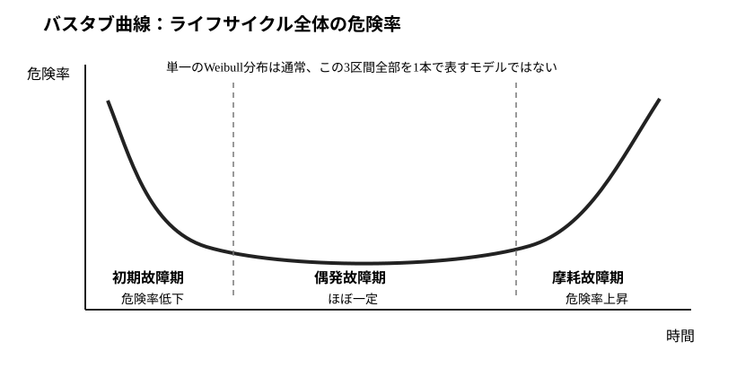
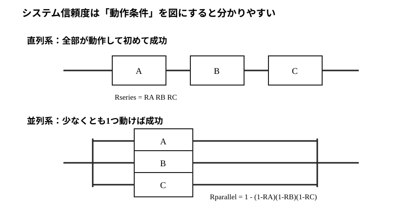
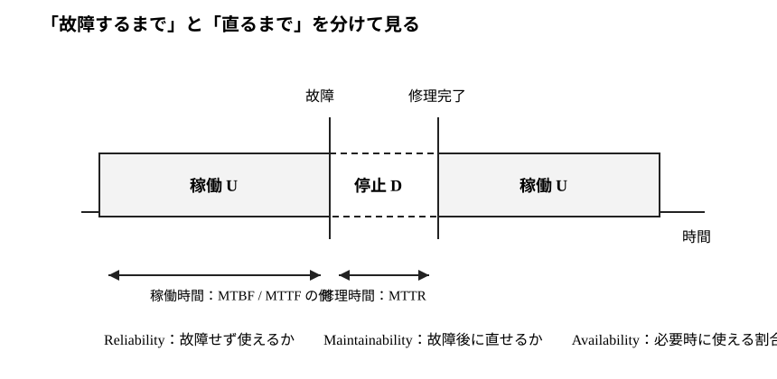

# E4-02 信頼性・保全性

信頼性は「必要な期間、故障せず機能する確率」を、保全性は「故障した後、所定時間内に復旧できる確率」を扱います。非修理部品の寿命分布だけでなく、危険率、直列・並列システム、修理時間、長期アベイラビリティまでを同じ確率モデルで結びます。

本章は [通常教材の執筆スタイルガイド](../../../style-guide.md)、[共通演習規約](../../../../EXERCISE_GUIDELINES.md)、[共通記号ガイド](../../../../references/notation-guide.md)、[共通用語ガイド](../../../../references/terminology-guide.md)、[分布・記号ガイド](../../../../references/distribution-notation-guide.md) に従います。

## この章で解けるようになる問題

- 信頼度関数、寿命分布、危険率の相互関係を導く。
- 指数分布とワイブル分布の危険率を解釈する。
- 平均故障時間・平均故障間隔・平均修復時間を区別する。
- 独立な直列・並列・$k$-out-of-$n$ システムの信頼度を求める。
- 共通原因故障が独立冗長系の計算を崩す理由を説明する。
- 保全度と長期アベイラビリティを計算する。
- 2状態連続時間マルコフ過程から定常アベイラビリティを導く。

## 公式出題範囲との対応

| 範囲 | 本章の内容 |
|---|---|
| 信頼性 | 信頼度、寿命分布、危険率、システム信頼度 |
| 保全性 | 修理時間分布、保全度、平均修復時間 |
| プロセス管理との接続 | 故障・修理サイクル、アベイラビリティ |

## 前提知識チェック

1. P3-02: 指数分布、ワイブル分布、ガンマ関数。
2. P3-05: 生存関数、危険率、平均残存寿命。
3. E2-01: マルコフ過程・定常分布。

---

## 1. 信頼度関数

<!-- formal-statement-start -->
> **定義（信頼性・信頼度関数）**  
> 非修理対象の故障時刻を非負確率変数 $T$ とするとき、時刻 $t$ まで必要な機能を失わずに動作する確率
> $R(t)=P(T>t)$
> を **信頼度関数** という。本章では、このように所定時間まで機能を維持する確率的性質を **信頼性** と呼ぶ。分布関数 $F(t)=P(T\le t)$ とは $R(t)=1-F(t)$ の関係にある。
<!-- formal-statement-end -->

<!-- definition-example-start: def-e4-02-reliability -->
**定義の確認**  
故障時刻が率 $\lambda$ の指数分布なら $R(t)=e^{-\lambda t}$ です。例えば $\lambda=0.01$ /時なら100時間を超えて動作する確率は $R(100)=e^{-1}\approx0.368$ です。
<!-- definition-example-end -->

非修理部品の故障時刻を非負確率変数 $T$ とします。分布関数を
$$
F(t)=P(T\le t)
$$
とすると、時刻 $t$ まで故障しない確率は
$$
R(t)=P(T>t)=1-F(t).
$$
これを信頼度関数といいます。

連続型で寿命の確率密度関数を $f(t)$ とすると
$$
f(t)=F'(t)=-R'(t).
$$

## 2. 危険率

<!-- formal-statement-start -->
> **定義（危険率）**  
> 連続寿命 $T$ の密度を $f(t)$、信頼度関数を $R(t)=P(T>t)$ とする。$R(t)>0$ のとき
> $h(t)=f(t)/R(t)$
> を **危険率（ハザード率）** という。これは「時刻 $t$ まで生存した」という条件のもとで、単位時間当たりに直後の故障が生じる強さを表す。
<!-- formal-statement-end -->

<!-- definition-example-start: def-e4-02-hazard-rate -->
**定義の確認**  
指数分布では $f(t)=\lambda e^{-\lambda t}$、$R(t)=e^{-\lambda t}$ なので $h(t)=\lambda$ です。時刻まで生存した条件を入れても故障強度が変わらないことが、一定危険率として現れます。
<!-- definition-example-end -->

時刻 $t$ まで生存したという条件のもとで、直後に故障する強さを危険率（ハザード率）といい、
$$
h(t)=\frac{f(t)}{R(t)}
$$
と定義します。

$f(t)=-R'(t)$ なので
$$
h(t)=-\frac{R'(t)}{R(t)}
=-\frac{d}{dt}\log R(t).
$$
累積危険率を
$$
H(t)=\int_0^t h(u)\,du
$$
とすると、$R(0)=1$ より
$$
R(t)=e^{-H(t)}.
$$
したがって危険率が分かれば寿命分布全体を再構成できます。

## 3. 指数分布とワイブル分布

### 3.1 指数分布

率 $\lambda>0$ の指数分布では
$$
R(t)=e^{-\lambda t},
$$
したがって
$$
h(t)=\lambda.
$$
危険率は時間に依存しません。

さらに
$$
P(T>s+t\mid T>s)
=\frac{R(s+t)}{R(s)}
=e^{-\lambda t}
=P(T>t),
$$
なので無記憶性を持ちます。

非修理部品の平均故障時間は
$$
E[T]=\int_0^\infty R(t)\,dt
=\frac1\lambda.
$$

### 3.2 ワイブル分布

形状母数 $k>0$、尺度母数 $\eta>0$ のワイブル寿命モデルを
$$
R(t)=\exp\left\{-\left(\frac t\eta\right)^k\right\}
$$
で表します。累積危険率は $(t/\eta)^k$ なので
$$
h(t)=\frac{k}{\eta}\left(\frac t\eta\right)^{k-1}.
$$

- $k<1$：危険率が低下する。
- $k=1$：危険率一定で指数分布になる。
- $k>1$：危険率が上昇する。

単一のワイブル分布は単調な危険率を表すモデルです。初期故障→偶発故障→摩耗故障という「バスタブ型」の全期間を1本のワイブル分布だけで表すわけではありません。

バスタブ曲線はライフサイクル全体の典型像です。ワイブル分布の形状母数 $k$ は、そのうち危険率が低下・一定・上昇する一つの局面を表すモデルとして対応させると理解しやすくなります。

## 4. 平均故障時間・平均故障間隔・平均修復時間

用語を用途で区別します。

- **平均故障時間（MTTF）**：非修理部品が故障するまでの平均時間。
- **平均故障間隔（MTBF）**：修理可能設備で、ある故障から次の故障までの平均的な稼働時間を表す指標。
- **平均修復時間（MTTR）**：故障してから修理完了までの平均時間。

指数寿命モデルでは平均故障時間や平均稼働時間が $1/\lambda$ という同じ形になることがありますが、非修理部品の寿命と、修理を繰り返す設備の故障間隔は概念として別です。

## 5. システム信頼度

時刻 $t$ における部品 $i$ の信頼度を $R_i(t)$ とし、部品故障は独立とします。

直列系は「全て動作」が成功事象、並列系は「少なくとも1つ動作」が成功事象です。この動作条件を先に事象として書けば、積と余事象の公式を暗記せずに導けます。

### 5.1 直列系

全部品が動作して初めてシステムが動くなら
$$
R_{\mathrm{series}}(t)=\prod_i R_i(t).
$$

### 5.2 並列系

少なくとも1部品が動けばシステムが動くなら、全て故障する確率の補数から
$$
R_{\mathrm{parallel}}(t)
=1-\prod_i\{1-R_i(t)\}.
$$

### 5.3 $k$-out-of-$n$ 系

同一信頼度 $R$ の独立な $n$ 部品のうち、少なくとも $k$ 個が動作すればよいとします。動作部品数 $X$ は
$$
X\sim\operatorname{Bin}(n,R)
$$
なので
$$
R_{k/n}=P(X\ge k)
=\sum_{j=k}^n {n\choose j}R^j(1-R)^{n-j}.
$$

## 6. 独立性が破れる共通原因故障

冗長化の信頼度向上は独立故障を前提にします。例えば電源喪失・浸水・火災のように複数部品を同時に故障させる要因があると、単純な並列公式は過大評価になります。

したがって「部品の個別信頼度が高い」ことと「システム冗長化が期待どおり効く」ことは別問題です。

## 7. 保全性

<!-- formal-statement-start -->
> **定義（保全性・保全度）**  
> 故障後の修理完了までの時間を非負確率変数 $D$ とするとき、
> $M(t)=P(D\le t)$
> を **保全度** という。本章では、故障した対象を所定時間内に修理・復旧できる確率的性質を **保全性** と呼ぶ。したがって信頼性が故障までの時間を扱うのに対し、保全性は故障後の復旧時間を扱う。
<!-- formal-statement-end -->

<!-- definition-example-start: def-e4-02-maintainability -->
**定義の確認**  
修理時間が率 $\mu=0.5$ /時の指数分布なら、2時間以内に修理完了する保全度は $M(2)=1-e^{-1}\approx0.632$ です。これは「2時間まで故障しない確率」ではなく、故障後に2時間以内で復旧する確率です。
<!-- definition-example-end -->

修理時間を非負確率変数 $D$ とします。保全度を
$$
M(t)=P(D\le t)
$$
と定義します。これは「故障後 $t$ 時間以内に修理を完了できる確率」です。

修理時間が率 $\mu>0$ の指数分布なら
$$
M(t)=1-e^{-\mu t},
$$
平均修復時間は
$$
E[D]=\frac1\mu.
$$

## 8. 長期アベイラビリティ

設備が「稼働→故障→修理→稼働」を繰り返すとします。

信頼性は主に「故障するまで」、保全性は「故障してから復旧するまで」、アベイラビリティはその両方を含めた長期稼働割合を見る概念です。

1サイクルの平均稼働時間を $E[U]$、平均停止時間を $E[D]$ とすれば、長期的に稼働している時間割合は
$$
A=\frac{E[U]}{E[U]+E[D]}.
$$
平均故障間隔を $MTBF$、平均修復時間を $MTTR$ と書けば
$$
A=\frac{MTBF}{MTBF+MTTR}.
$$

故障率 $\lambda$、修理率 $\mu$ の指数モデルなら
$$
E[U]=\frac1\lambda,\qquad E[D]=\frac1\mu,
$$
したがって
$$
A=\frac{1/\lambda}{1/\lambda+1/\mu}
=\frac{\mu}{\lambda+\mu}.
$$

## 9. 2状態連続時間マルコフ過程との接続

状態を

- 0：稼働
- 1：故障・修理中

とし、稼働→故障の遷移率を $\lambda$、故障→稼働の遷移率を $\mu$ とします。定常確率を $(\pi_0,\pi_1)$ とすると、定常状態では単位時間当たりの平均遷移流量が釣り合い
$$
\lambda\pi_0=\mu\pi_1,
$$
$$
\pi_0+\pi_1=1.
$$
これを解くと
$$
\pi_0=\frac\mu{\lambda+\mu},
\qquad
\pi_1=\frac\lambda{\lambda+\mu}.
$$
稼働状態の定常確率 $\pi_0$ が長期アベイラビリティと一致します。

---

## 10. 演習：問題の直後に解答

### Level A：基礎部品

#### E4-02-A01 危険率から信頼度
- Level: A
- 目安時間: 8分
- 主題: 危険率
- 使用技術: 積分
- calculation_load: low

寿命 $T$ の危険率が
$$
h(t)=2t\qquad(t\ge0)
$$
で与えられる。$R(t)$ と $F(t)$ を求めよ。

<!-- solution-start -->

##### 解答

###### 詳細解答

累積危険率は
$$
H(t)=\int_0^t2u\,du=t^2.
$$
したがって
$$
R(t)=e^{-H(t)}=e^{-t^2}.
$$
分布関数は
$$
F(t)=1-R(t)=1-e^{-t^2}.
$$

###### 本番答案

$H(t)=t^2$ より $R(t)=e^{-t^2}$、$F(t)=1-e^{-t^2}$。

###### 採点基準

累積危険率8点、信頼度7点、分布関数5点。合計20点。

<!-- solution-end -->

#### E4-02-A02 ワイブル危険率の形
- Level: A
- 目安時間: 7分
- 主題: ワイブル分布
- 使用技術: 危険率解釈
- calculation_load: low

ワイブル寿命モデル
$$
R(t)=\exp\left\{-\left(\frac t\eta\right)^k\right\}
$$
について、$k=0.5,1,2$ のとき危険率が時間とともに増加・一定・減少のどれになるか答えよ。

<!-- solution-start -->

##### 解答

###### 詳細解答

危険率は
$$
h(t)=\frac{k}{\eta}\left(\frac t\eta\right)^{k-1}.
$$
したがって $k=0.5$ では指数 $k-1<0$ なので減少、$k=1$ では一定、$k=2$ では増加する。

###### 本番答案

$k=0.5$: 減少、$k=1$: 一定、$k=2$: 増加。

###### 採点基準

危険率式8点、各判定12点。合計20点。

<!-- solution-end -->

#### E4-02-A03 直列・並列系
- Level: A
- 目安時間: 8分
- 主題: システム信頼性
- 使用技術: 独立確率
- calculation_load: low

独立な3部品のある時刻での信頼度がすべて0.8である。

1. 3部品直列系の信頼度を求めよ。
2. 3部品並列系の信頼度を求めよ。

<!-- solution-start -->

##### 解答

###### 詳細解答

直列系は全て動作する必要があるため
$$
R_{\mathrm{series}}=0.8^3=0.512.
$$
並列系は全て故障する確率の補数なので
$$
R_{\mathrm{parallel}}=1-(0.2)^3=0.992.
$$

###### 本番答案

直列0.512、並列0.992。

###### 採点基準

直列8点、並列12点。合計20点。

<!-- solution-end -->

#### E4-02-A04 保全度と平均修復時間
- Level: A
- 目安時間: 8分
- 主題: 保全性
- 使用技術: 指数分布
- calculation_load: low

修理時間 $D$ が率 $\mu=0.2$/時間の指数分布に従う。

1. 5時間以内に修理を完了する保全度 $M(5)$ を求めよ。
2. 平均修復時間を求めよ。

<!-- solution-start -->

##### 解答

###### 詳細解答

指数分布より
$$
M(5)=1-e^{-0.2\cdot5}=1-e^{-1}.
$$
平均修復時間は
$$
E[D]=\frac1{0.2}=5\text{時間}.
$$

###### 本番答案

$M(5)=1-e^{-1}$、平均修復時間5時間。

###### 採点基準

保全度10点、平均修復時間10点。合計20点。

<!-- solution-end -->

### Level B：標準技能

#### E4-02-B01 ワイブル平均故障時間
- Level: B
- 目安時間: 15分
- 主題: 寿命分布
- 使用技術: 生存関数積分
- calculation_load: medium

寿命 $T$ の信頼度関数が
$$
R(t)=\exp\left\{-\left(\frac{t}{100}\right)^2\right\}
$$
である。非負確率変数について
$$
E[T]=\int_0^\infty R(t)\,dt
$$
を用い、$E[T]$ を求めよ。ただし
$$
\int_0^\infty e^{-u^2}\,du=\frac{\sqrt\pi}{2}
$$
を用いてよい。

<!-- solution-start -->

##### 解答

###### 詳細解答

$$
E[T]=\int_0^\infty e^{-(t/100)^2}\,dt.
$$
$u=t/100$ と置くと $dt=100du$ なので
$$
E[T]=100\int_0^\infty e^{-u^2}\,du
=100\cdot\frac{\sqrt\pi}{2}
=50\sqrt\pi.
$$

###### 本番答案

$u=t/100$ と置換し、$E[T]=50\sqrt\pi$ 時間。

###### 採点基準

期待値の出発式6点、置換8点、結論6点。合計20点。

<!-- solution-end -->

#### E4-02-B02 2-out-of-3 系
- Level: B
- 目安時間: 10分
- 主題: 冗長系
- 使用技術: 二項分布
- calculation_load: medium

独立な同一部品3個の信頼度が0.8で、少なくとも2個が動作すればシステムが機能する。システム信頼度を求めよ。

<!-- solution-start -->

##### 解答

###### 詳細解答

動作部品数 $X$ は
$$
X\sim\operatorname{Bin}(3,0.8).
$$
したがって
$$
\begin{aligned}
P(X\ge2)
&={3\choose2}(0.8)^2(0.2)+(0.8)^3\\
&=0.384+0.512=0.896.
\end{aligned}
$$

###### 本番答案

$R=P(X\ge2)=3(0.8)^2(0.2)+(0.8)^3=0.896$。

###### 採点基準

二項モデル6点、2個動作項7点、3個動作項・合計7点。合計20点。

<!-- solution-end -->

#### E4-02-B03 長期アベイラビリティ
- Level: B
- 目安時間: 10分
- 主題: 修理可能系
- 使用技術: 平均時間比
- calculation_load: low

修理可能設備の故障までの平均稼働時間が500時間、平均修復時間が10時間である。長期アベイラビリティを求めよ。

<!-- solution-start -->

##### 解答

###### 詳細解答

1サイクルは平均500時間の稼働と平均10時間の停止からなるので
$$
A=\frac{500}{500+10}=\frac{50}{51}\approx0.9804.
$$

###### 本番答案

$A=500/(500+10)=50/51\approx0.9804$。

###### 採点基準

サイクル解釈8点、式6点、数値6点。合計20点。

<!-- solution-end -->

#### E4-02-B04 指数分布の無記憶性
- Level: B
- 目安時間: 12分
- 主題: 指数寿命
- 使用技術: 条件付き確率
- calculation_load: medium

寿命 $T$ の信頼度が $R(t)=e^{-\lambda t}$ とする。$s,t\ge0$ に対し
$$
P(T>s+t\mid T>s)=P(T>t)
$$
を示せ。

<!-- solution-start -->

##### 解答

###### 詳細解答

$\{T>s+t\}\subset\{T>s\}$ なので条件付き確率の定義から
$$
P(T>s+t\mid T>s)
=\frac{P(T>s+t)}{P(T>s)}.
$$
信頼度を代入すると
$$
\frac{e^{-\lambda(s+t)}}{e^{-\lambda s}}
=e^{-\lambda t}
=P(T>t).
$$

###### 本番答案

$P(T>s+t\mid T>s)=R(s+t)/R(s)=e^{-\lambda t}=P(T>t)$。

###### 採点基準

条件付き確率8点、指数式8点、結論4点。合計20点。

<!-- solution-end -->

### Level C：本番標準

#### E4-02-C01 区分的な危険率から信頼度を作る
- Level: C
- 目安時間: 22分
- 主題: 危険率
- 使用技術: 区分積分
- calculation_load: medium

危険率が
$$
h(t)=
\begin{cases}
0.01,&0\le t<100,\\
0.03,&t\ge100
\end{cases}
$$
で与えられる。

1. $0\le t<100$ の $R(t)$ を求めよ。
2. $t\ge100$ の累積危険率 $H(t)$ と $R(t)$ を求めよ。
3. 150時間まで故障しない確率を求めよ。

<!-- solution-start -->

##### 解答

###### 詳細解答

$t<100$ では
$$
H(t)=0.01t,\qquad R(t)=e^{-0.01t}.
$$
$t\ge100$ では
$$
H(t)=\int_0^{100}0.01\,du+\int_{100}^t0.03\,du
=1+0.03(t-100).
$$
したがって
$$
R(t)=\exp\{-1-0.03(t-100)\}.
$$
$t=150$ では
$$
R(150)=e^{-1-1.5}=e^{-2.5}.
$$

###### 本番答案

$t<100$: $R=e^{-0.01t}$。$t\ge100$: $H=1+0.03(t-100)$、$R=e^{-1-0.03(t-100)}$。$R(150)=e^{-2.5}$。

###### 採点基準

前半6点、後半累積危険率8点、150時間値6点。合計20点。

<!-- solution-end -->

#### E4-02-C02 直列・並列の混合系
- Level: C
- 目安時間: 20分
- 主題: システム信頼性
- 使用技術: 事象の積・補数
- calculation_load: medium

部品Aが、部品B・Cの並列部分と直列に接続されている。A,B,Cのある時刻での信頼度がそれぞれ0.95, 0.90, 0.80で、故障は独立とする。システム信頼度を求めよ。

<!-- solution-start -->

##### 解答

###### 詳細解答

B・C並列部分は、両方故障する場合だけ機能しないので
$$
R_{BC}=1-(1-0.90)(1-0.80)
=1-0.02=0.98.
$$
Aとこの並列部分は直列なので
$$
R_{\mathrm{sys}}=0.95\cdot0.98=0.931.
$$

###### 本番答案

$R_{BC}=1-(0.1)(0.2)=0.98$、よって $R_{\mathrm{sys}}=0.95(0.98)=0.931$。

###### 採点基準

並列部分10点、直列結合6点、数値4点。合計20点。

<!-- solution-end -->

#### E4-02-C03 指数寿命の直列系
- Level: C
- 目安時間: 22分
- 主題: 直列系寿命
- 使用技術: 最小値、指数関数
- calculation_load: medium

独立な部品 $i=1,\ldots,m$ の寿命 $T_i$ が率 $\lambda_i$ の指数分布に従う。全ての部品が動作している間だけシステムが機能する直列系の寿命を
$$
T=\min(T_1,\ldots,T_m)
$$
とする。

1. $R_T(t)$ を求めよ。
2. $T$ の分布を同定せよ。
3. 平均故障時間を求めよ。

<!-- solution-start -->

##### 解答

###### 詳細解答

$T>t$ は全ての $T_i>t$ と同値。独立性から
$$
R_T(t)=\prod_{i=1}^mP(T_i>t)
=\prod_{i=1}^m e^{-\lambda_i t}
=e^{-t\sum_i\lambda_i}.
$$
これは率
$$
\lambda_{\mathrm{sys}}=\sum_i\lambda_i
$$
の指数分布の信頼度なので
$$
T\sim\operatorname{Exp}\left(\sum_i\lambda_i\right).
$$
平均故障時間は
$$
E[T]=\frac1{\sum_i\lambda_i}.
$$

###### 本番答案

$R_T(t)=\prod e^{-\lambda_i t}=e^{-t\sum\lambda_i}$。よって $T\sim\operatorname{Exp}(\sum\lambda_i)$、平均は $1/\sum\lambda_i$。

###### 採点基準

事象対応6点、独立積6点、分布同定4点、平均4点。合計20点。

<!-- solution-end -->

#### E4-02-C04 故障率・修理率とアベイラビリティ
- Level: C
- 目安時間: 22分
- 主題: 修理可能系
- 使用技術: 指数分布、時間割合
- calculation_load: medium

修理可能設備の稼働時間が率 $\lambda=0.002$/時間の指数分布、修理時間が率 $\mu=0.1$/時間の指数分布に従う。

1. 平均故障間隔を求めよ。
2. 平均修復時間を求めよ。
3. 長期アベイラビリティを求めよ。
4. アベイラビリティを改善するには、$\lambda$ と $\mu$ をどちら向きに変えるべきか説明せよ。

<!-- solution-start -->

##### 解答

###### 詳細解答

平均稼働時間は
$$
\frac1\lambda=500\text{時間}.
$$
平均修復時間は
$$
\frac1\mu=10\text{時間}.
$$
したがって
$$
A=\frac{500}{500+10}=\frac{50}{51}\approx0.9804.
$$
また
$$
A=\frac\mu{\lambda+\mu}.
$$
したがって故障率 $\lambda$ を下げる、または修理率 $\mu$ を上げるとアベイラビリティは向上する。

###### 本番答案

平均故障間隔500時間、平均修復時間10時間、$A=50/51\approx0.9804$。$\lambda$ を下げるか $\mu$ を上げると改善。

###### 採点基準

各平均時間8点、アベイラビリティ8点、改善方向4点。合計20点。

<!-- solution-end -->

#### E4-02-C05 共通原因故障と並列冗長
- Level: C
- 目安時間: 20分
- 主題: 共通原因故障
- 使用技術: 条件付き確率
- calculation_load: medium

2部品の並列系を考える。確率0.05で共通原因故障が起こり、その場合は2部品とも故障する。共通原因故障が起きない確率0.95のもとでは、各部品は独立に信頼度0.9で動作するとする。

1. システム信頼度を求めよ。
2. 共通原因故障を無視して $1-(0.1)^2=0.99$ と計算することが過大評価になる理由を説明せよ。

<!-- solution-start -->

##### 解答

###### 詳細解答

共通原因故障が起きた場合のシステム信頼度は0。起きない場合は独立並列系なので
$$
1-(0.1)^2=0.99.
$$
全確率の公式から
$$
R_{\mathrm{sys}}
=0.05\cdot0+0.95\cdot0.99
=0.9405.
$$
単純な0.99は、両部品を同時に落とす故障経路を無視しているため過大評価になる。

###### 本番答案

$R=0.95[1-(0.1)^2]=0.9405$。0.99は共通原因による同時故障を無視している。

###### 採点基準

条件付き信頼度6点、全確率8点、解釈6点。合計20点。

<!-- solution-end -->

### Level D：発展

#### E4-02-D01 2状態連続時間マルコフ過程からアベイラビリティを導く
- Level: D
- 目安時間: 35分
- 主題: 信頼性とマルコフ過程
- 使用技術: 微小時間遷移、定常分布
- calculation_load: high

修理可能設備の状態を0=稼働、1=故障とする。稼働状態では単位時間当たり故障率 $\lambda$、故障状態では単位時間当たり修理率 $\mu$ とする。

1. 微小時間 $\Delta t$ に対して、0→1と1→0の遷移確率を一次まで書け。
2. 定常確率 $(\pi_0,\pi_1)$ が満たす流量釣合式を導け。
3. $\pi_0,\pi_1$ を求めよ。
4. $\pi_0$ が $MTBF/(MTBF+MTTR)$ と一致することを示せ。

<!-- solution-start -->

##### 解答

###### 詳細解答

遷移率の定義から
$$
P(0\to1\text{ in }\Delta t)=\lambda\Delta t+o(\Delta t),
$$
$$
P(1\to0\text{ in }\Delta t)=\mu\Delta t+o(\Delta t).
$$
定常状態では稼働から故障へ流れる平均確率流量と、故障から稼働へ戻る流量が等しいので
$$
\lambda\pi_0=\mu\pi_1.
$$
さらに
$$
\pi_0+\pi_1=1.
$$
連立して
$$
\pi_0=\frac\mu{\lambda+\mu},
\qquad
\pi_1=\frac\lambda{\lambda+\mu}.
$$
指数モデルでは
$$
MTBF=\frac1\lambda,\qquad MTTR=\frac1\mu.
$$
したがって
$$
\frac{MTBF}{MTBF+MTTR}
=\frac{1/\lambda}{1/\lambda+1/\mu}
=\frac\mu{\lambda+\mu}
=\pi_0.
$$
稼働状態の定常確率と長期稼働時間割合が一致する。

###### 本番答案

微小時間遷移は $\lambda\Delta t$、$\mu\Delta t$。定常流量 $\lambda\pi_0=\mu\pi_1$ と総和1から $(\pi_0,\pi_1)=(\mu,\lambda)/(\lambda+\mu)$。$MTBF=1/\lambda,MTTR=1/\mu$ を代入して $\pi_0=MTBF/(MTBF+MTTR)$。

###### 採点基準

微小時間式5点、釣合式5点、定常確率5点、時間割合との一致5点。合計20点。

<!-- solution-end -->

## 11. 30分ドリル

### E4-02-DRILL-01 寿命・冗長化・修理を一つの設備で考える

同一部品A,Bの寿命は独立で、各部品の信頼度が
$$
R(t)=\exp\left\{-\left(\frac{t}{1000}\right)^2\right\}
$$
である。A,Bを並列にし、その並列部分が別の部品Cと直列に接続される。Cの寿命は率 $\lambda_C=0.0005$/時間の指数分布とする。

1. 500時間におけるA単体の信頼度を求めよ。
2. 500時間におけるA,B並列部分の信頼度を求めよ。
3. 500時間におけるシステム全体の信頼度を求めよ。
4. Cが修理可能で、故障率0.0005/時間、修理率0.1/時間の2状態指数モデルに従うとき、C単体の長期アベイラビリティを求めよ。
5. 「500時間信頼度」と「長期アベイラビリティ」の違いを説明せよ。

<!-- solution-start -->

##### 解答

###### 詳細解答

A単体は
$$
R_A(500)=\exp\{-(0.5)^2\}=e^{-0.25}.
$$
A,B並列部は独立なので
$$
R_{AB}(500)
=1-\{1-e^{-0.25}\}^2.
$$
Cの500時間信頼度は
$$
R_C(500)=e^{-0.0005\cdot500}=e^{-0.25}.
$$
したがって直列結合された全体系は
$$
R_{\mathrm{sys}}(500)
=e^{-0.25}\left[1-\{1-e^{-0.25}\}^2\right].
$$

修理可能なCの長期アベイラビリティは
$$
A_C=\frac{0.1}{0.0005+0.1}
=\frac{200}{201}\approx0.9950.
$$

500時間信頼度は「修理しない寿命モデルで、500時間まで連続して故障しない確率」。長期アベイラビリティは「故障と修理を繰り返す設備が、長期的に稼働状態にいる時間割合」であり、同じ指標ではない。

###### 本番答案

$R_A(500)=e^{-0.25}$、$R_{AB}=1-(1-e^{-0.25})^2$、$R_{\mathrm{sys}}=e^{-0.25}[1-(1-e^{-0.25})^2]$。修理可能Cのアベイラビリティは $200/201\approx0.9950$。信頼度は無故障継続確率、アベイラビリティは修理込みの長期稼働割合。

###### 採点基準

全100点。単体信頼度15点、並列25点、全体系20点、アベイラビリティ20点、概念区別20点。

<!-- solution-end -->

## 12. 過去問との対応

統計応用（理工学）の「信頼性・保全性」を担当する。信頼度関数と危険率の変換、寿命分布、システム構成、修理可能性を別々の公式として暗記せず、一つの確率モデルとして接続できることを重視する。

## 13. 章末チェック

- $h=f/R$ と $R=e^{-H}$ を相互に導ける。
- 指数分布とワイブル分布の危険率の違いを説明できる。
- 平均故障時間・平均故障間隔・平均修復時間を区別できる。
- 直列・並列・$k$-out-of-$n$ 系の信頼度を計算できる。
- 共通原因故障が冗長化の効果を下げる理由を説明できる。
- 保全度を修理時間分布から計算できる。
- 長期アベイラビリティを平均時間比と定常マルコフ確率の両方から導ける。